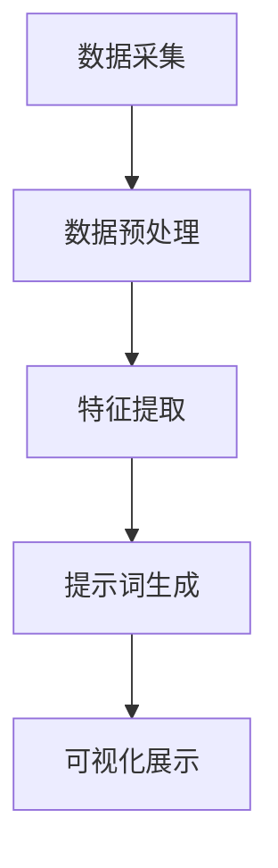
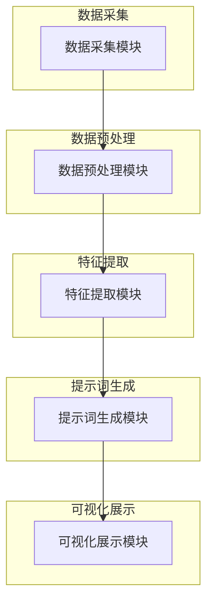
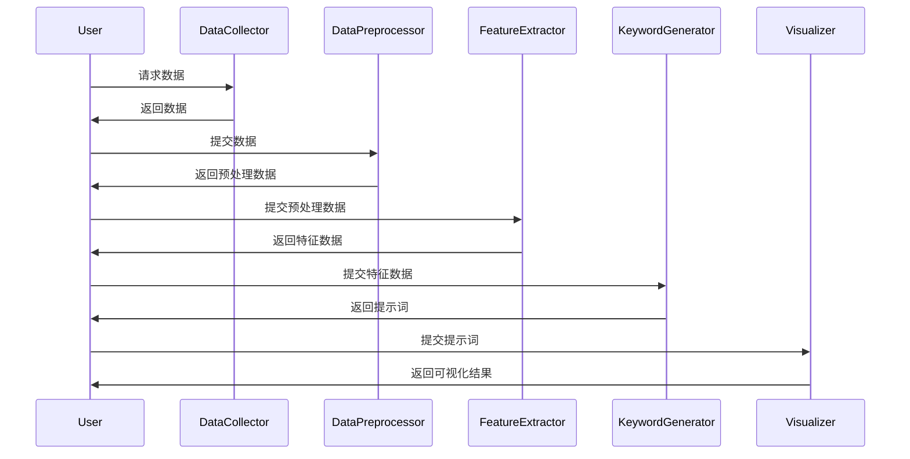
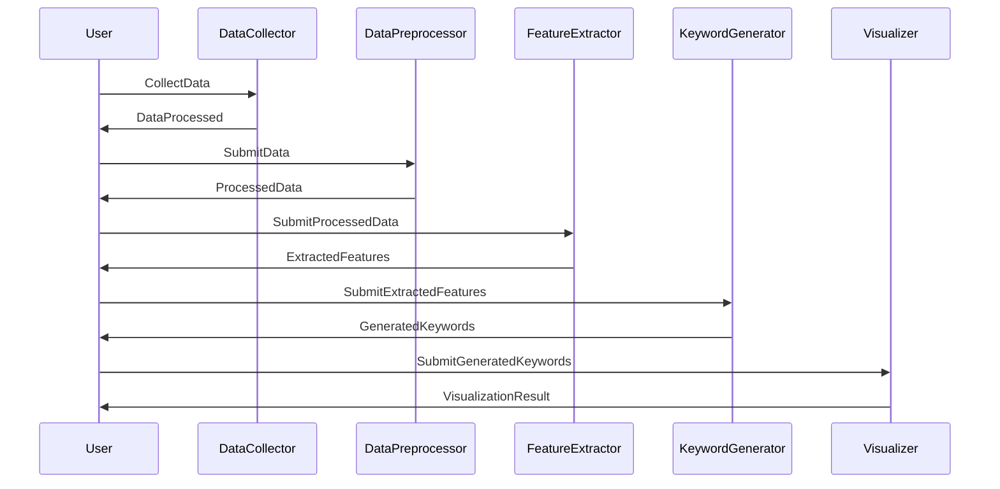

                 


## 引言与背景

### 1.1 问题背景

随着科技的飞速发展，大数据已经成为各个行业的重要资源。特别是时空大数据，它不仅包含了大量的地理空间信息，还涵盖了时间序列数据，这使得其在地理信息、交通管理、环境监测等领域具有广泛的应用价值。然而，随着时空大数据规模的爆炸性增长，如何高效地处理和可视化这些数据成为一个亟待解决的难题。

#### 时空大数据的爆炸性增长

时空大数据的爆炸性增长主要来源于以下几个方面：

1. **地理信息技术的普及**：随着卫星遥感技术、GPS定位技术的发展，地理空间数据的获取变得更加便捷和精准，这些数据以指数级速度增长。
2. **物联网（IoT）的普及**：物联网设备不断地产生大量时空数据，如交通流量、气象数据、环境监测数据等。
3. **社交媒体的兴起**：用户在社交媒体上分享的地理位置信息、时间信息等，也为时空大数据的积累提供了丰富的数据源。

#### 可视化需求的重要性和挑战

时空大数据的可视化需求非常重要，因为人类对于可视化信息的处理能力远远超过纯文本或数据表。通过可视化，用户可以更直观地理解和分析数据，发现数据中的模式、趋势和异常。然而，可视化时空大数据也面临着一系列挑战：

1. **数据量大**：时空大数据通常包含数十亿条记录，如何有效地处理和可视化这些数据是一个巨大的挑战。
2. **数据类型多**：时空大数据不仅包括文本数据，还包括图像、时间序列数据等，如何将这些不同类型的数据进行统一处理和可视化是一个难题。
3. **实时性要求高**：很多应用场景，如交通管理和环境监测，需要实时处理和可视化数据，这对系统的响应速度和处理能力提出了高要求。

### 1.2 问题描述

在处理时空大数据可视化任务时，我们面临以下几个核心问题：

1. **数据量大、类型多**：如何高效地处理和存储海量时空数据，并将其可视化。
2. **实时性要求高**：如何实时处理和更新数据，保证可视化结果实时性和准确性。
3. **交互性**：如何设计用户友好的交互界面，让用户能够方便地操作和查看数据。

### 1.3 问题解决

提示词工程为处理时空大数据可视化任务提供了一种有效的方法。提示词工程的核心思想是通过生成和利用特定的提示词，帮助用户更好地理解和分析数据。以下是提示词工程在数据处理中的重要性：

1. **简化数据理解**：通过提示词，可以将复杂的数据简化为易于理解的信息，使用户能够快速把握数据的主要特征。
2. **提高数据处理效率**：提示词可以帮助数据预处理和特征提取，从而提高数据处理速度和准确性。
3. **增强数据可视化效果**：提示词可以与可视化技术结合，提高可视化结果的可读性和交互性。

### 1.4 边界与外延

在处理时空大数据可视化任务时，我们需要明确以下边界与外延：

1. **数据处理范围**：时空大数据包括哪些类型的数据，如何处理这些数据。
2. **可视化任务范围**：哪些数据需要被可视化，如何展示这些数据。
3. **应用领域限制**：提示词工程在哪些领域具有应用价值，哪些领域可能不适用。

### 1.5 概念结构与核心要素组成

提示词工程涉及多个核心要素，包括数据来源、数据处理流程、提示词生成模块和可视化展示模块。以下是这些要素的组成：

1. **数据来源**：时空数据的来源，如卫星遥感数据、物联网数据、社交媒体数据等。
2. **数据处理流程**：包括数据清洗、数据规范化、特征提取等步骤。
3. **提示词生成模块**：利用自然语言处理技术生成提示词，用于辅助数据理解和分析。
4. **可视化展示模块**：将处理后的数据通过图表、地图等形式进行可视化展示。

### 1.6 本章小结

通过本章的介绍，我们对时空大数据可视化任务有了初步的了解，认识到其重要性和挑战。同时，我们了解了提示词工程在数据处理中的重要性，以及其基本概念和核心要素。在接下来的章节中，我们将进一步深入探讨提示词工程的核心概念和联系，以及具体的算法原理和实践。

## 核心概念与联系

### 2.1 核心概念原理

#### 提示词工程的概念

**提示词**：提示词是一种用于引导用户理解和分析数据的文本信息。在提示词工程中，提示词通过自然语言处理技术生成，用于简化和解释复杂的数据。

**提示词的作用**：

1. **数据简化**：提示词可以帮助用户快速了解数据的主题和主要特征，简化数据的理解过程。
2. **数据分析**：通过提示词，用户可以更好地进行数据分析，发现数据中的模式和趋势。
3. **可视化引导**：提示词可以与可视化技术结合，提高可视化结果的可读性和交互性。

**提示词在数据处理中的应用**：

1. **数据预处理**：在数据预处理阶段，提示词可以用于识别和标记重要的数据特征，简化数据结构。
2. **特征提取**：在特征提取阶段，提示词可以指导特征选择和特征转换，提高数据的质量和可解释性。
3. **数据可视化**：在数据可视化阶段，提示词可以用于生成标签、标题和说明，提高可视化结果的信息密度和用户交互性。

#### 时空大数据的概念

**时空大数据**：时空大数据是指包含地理空间信息和时间序列信息的海量数据集合。它不仅包括空间位置数据，还涉及时间序列数据，如温度、湿度、交通流量等。

**时空大数据的特点**：

1. **数据量大**：时空大数据通常包含数十亿条记录，数据量巨大。
2. **类型多样**：时空大数据包括多种类型的数据，如文本、图像、时间序列数据等。
3. **实时性强**：许多时空大数据应用场景要求实时处理和更新数据，以实现实时决策和监控。

### 2.2 概念属性特征对比表格

为了更好地理解提示词和时空大数据之间的差异和联系，我们可以通过一个对比表格来展示它们的属性特征。

| 特征             | 提示词             | 时空大数据           |
|------------------|-------------------|---------------------|
| 数据类型         | 文本              | 多种类型（文本、图像、时间序列等） |
| 数据量           | 小到中等规模     | 大规模               |
| 数据处理速度     | 较快              | 高速实时处理         |
| 应用场景         | 信息检索、问答    | 地理信息、交通分析等 |
| 主要目标         | 数据理解、分析    | 数据分析、可视化     |

### 2.3 ER实体关系图架构

在提示词工程中，多个实体和它们之间的关系构成了一个复杂的系统。为了更好地理解和分析这个系统，我们可以使用ER（Entity-Relationship）实体关系图来描述。

**实体与关系的定义**：

1. **实体**：
   - 数据源（Data Source）：提供时空大数据的数据来源。
   - 数据处理模块（Data Processing Module）：负责对数据进行清洗、规范化和特征提取。
   - 提示词生成模块（Keyword Generation Module）：生成和优化提示词。
   - 可视化展示模块（Visualization Presentation Module）：将数据通过图表、地图等形式可视化。

2. **关系**：
   - 数据流动关系（Data Flow Relationship）：数据从数据源流向数据处理模块，然后流向提示词生成模块，最后流向可视化展示模块。
   - 提示词生成与数据处理的关联（Keyword Generation and Data Processing Relationship）：数据处理模块的结果用于生成提示词。
   - 可视化展示与数据处理的关联（Visualization Presentation and Data Processing Relationship）：可视化展示模块依赖于处理后的数据进行展示。

**ER实体关系图**：

```mermaid
erDiagram
  数据源 ||--|{ 数据处理模块 }
  数据处理模块 ||--|{ 提示词生成模块 }
  提示词生成模块 ||--|{ 可视化展示模块 }
```

### 2.4 本章小结

通过本章的讨论，我们深入理解了提示词工程和时空大数据的核心概念和联系。我们了解到提示词工程在数据简化、数据分析和数据可视化中的重要作用，以及时空大数据的特点和应用。通过对比表格和ER实体关系图，我们对这两个概念之间的差异和联系有了更清晰的认识。在接下来的章节中，我们将进一步探讨提示词工程的算法原理和实现方法，以帮助我们更好地理解和应用这个技术。

## 算法原理讲解

### 3.1 算法mermaid流程图

在处理时空大数据可视化任务时，提示词工程通常遵循以下流程：



### 3.2 算法原理

#### 数据预处理

数据预处理是整个流程的基础，其目标是将原始数据进行清洗、规范化和缺失值处理，以确保数据的质量和一致性。

1. **数据清洗**：数据清洗的目的是去除数据中的噪声和异常值，常见的方法包括去除重复记录、填补缺失值、处理不一致的数据格式等。

2. **数据规范化**：数据规范化是指将数据转换为统一的标准格式，以方便后续处理。例如，将日期时间数据转换为统一的日期时间格式，将地理坐标数据转换为统一的坐标系。

3. **缺失值处理**：缺失值处理是处理数据中缺失值的策略，常见的方法包括删除缺失值、用平均值或中位数填补缺失值、使用机器学习模型预测缺失值等。

#### 特征提取

特征提取是将原始数据转换为适合机器学习和可视化处理的特征表示。在提示词工程中，特征提取主要包括文本特征提取和时空特征提取。

1. **文本特征提取**：文本特征提取是将文本数据转换为数值特征的过程。常见的方法包括词袋模型（Bag of Words, BOW）、TF-IDF（Term Frequency-Inverse Document Frequency）等。

2. **时空特征提取**：时空特征提取是从时空数据中提取与时间、空间相关的特征。例如，可以从时间序列数据中提取时间间隔、周期性特征；从地理空间数据中提取区域中心、范围等。

#### 提示词生成

提示词生成是提示词工程的核心环节，其目标是生成高质量的提示词，以帮助用户更好地理解和分析数据。提示词生成通常采用以下方法：

1. **基于规则的方法**：基于规则的方法通过定义一组规则，根据数据特征自动生成提示词。例如，可以根据数据的时间特征生成时间相关的提示词，根据地理特征生成地点相关的提示词。

2. **基于机器学习的方法**：基于机器学习的方法使用大量已标注的数据训练模型，自动生成提示词。常见的机器学习方法包括GPT（Generative Pre-trained Transformer）和BERT（Bidirectional Encoder Representations from Transformers）等。

#### 可视化展示

可视化展示是将处理后的数据通过图表、地图等形式展示给用户的过程。可视化展示的目标是让用户能够直观地理解和分析数据。

1. **图表可视化**：图表可视化是将数据以图形的形式展示，常见的方法包括折线图、柱状图、散点图等。

2. **地图可视化**：地图可视化是将数据以地图的形式展示，常用于地理空间数据的可视化。例如，可以使用热力图展示交通流量，使用地图上的图标展示不同地点的数据。

### 3.3 数学模型和公式

在提示词工程中，数学模型和公式用于描述数据特征提取和提示词生成的算法原理。以下是几个常用的数学模型和公式：

#### 文本特征提取的数学模型

$$
\text{TF-IDF}(t,d) = \frac{f(t,d)}{N} \times \log\left(\frac{N}{f(t,d)}\right)
$$

其中，$f(t,d)$ 表示词 $t$ 在文档 $d$ 中的频率，$N$ 表示文档集中所有词的频率之和。

#### 时空特征提取的数学模型

时空特征提取的数学模型较为复杂，通常涉及时间序列分析、空间分析等。以下是一个简单的时间序列特征提取模型：

$$
\text{周期性特征} = \text{Fourier Transform}\left(\text{时间序列数据}\right)
$$

其中，Fourier Transform 是傅里叶变换，用于提取时间序列数据的周期性特征。

### 3.4 详细讲解和举例说明

为了更好地理解提示词工程的算法原理，我们可以通过以下例子进行详细讲解。

#### 例子：使用TF-IDF提取文本特征

假设我们有一个包含以下文本数据的文档集合：

- 文档1：“人工智能和大数据技术密切相关”
- 文档2：“大数据技术的核心是数据挖掘”
- 文档3：“人工智能正迅速发展”

我们可以使用TF-IDF方法提取文本特征。首先，我们需要计算每个词在文档中的频率，然后计算每个词在文档集合中的IDF（Inverse Document Frequency）值，最后将TF和IDF相乘得到TF-IDF值。

1. **计算词频（TF）**：

   - “人工智能”在文档1、文档2和文档3中各出现1次，频率为1/3。
   - “和”在文档1和文档2中各出现1次，频率为2/3。
   - “大数据”在文档1和文档2中各出现1次，频率为2/3。
   - “技术”在文档1中出现1次，频率为1/3。
   - “密切相关”在文档1中出现1次，频率为1/3。
   - “核心”在文档2中出现1次，频率为1/3。
   - “数据挖掘”在文档2中出现1次，频率为1/3。
   - “人工智能正”在文档3中出现1次，频率为1/3。
   - “迅速”在文档3中出现1次，频率为1/3。
   - “发展”在文档3中出现1次，频率为1/3。

2. **计算逆文档频率（IDF）**：

   - “人工智能”：3/3 = 1
   - “和”：2/3
   - “大数据”：2/3
   - “技术”：1/3
   - “密切相关”：1/3
   - “核心”：1/3
   - “数据挖掘”：1/3
   - “人工智能正”：1/3
   - “迅速”：1/3
   - “发展”：1/3

3. **计算TF-IDF值**：

   - “人工智能”：$\frac{1}{3} \times \log\left(\frac{3}{1}\right) \approx 0.918$
   - “和”：$\frac{2}{3} \times \log\left(\frac{3}{2}\right) \approx 0.398$
   - “大数据”：$\frac{2}{3} \times \log\left(\frac{3}{2}\right) \approx 0.398$
   - “技术”：$\frac{1}{3} \times \log\left(\frac{3}{1}\right) \approx 0.918$
   - “密切相关”：$\frac{1}{3} \times \log\left(\frac{3}{1}\right) \approx 0.918$
   - “核心”：$\frac{1}{3} \times \log\left(\frac{3}{1}\right) \approx 0.918$
   - “数据挖掘”：$\frac{1}{3} \times \log\left(\frac{3}{1}\right) \approx 0.918$
   - “人工智能正”：$\frac{1}{3} \times \log\left(\frac{3}{1}\right) \approx 0.918$
   - “迅速”：$\frac{1}{3} \times \log\left(\frac{3}{1}\right) \approx 0.918$
   - “发展”：$\frac{1}{3} \times \log\left(\frac{3}{1}\right) \approx 0.918$

通过上述例子，我们可以看到如何使用TF-IDF方法提取文本特征。类似的方法可以应用于其他类型的文本数据，从而为提示词生成提供高质量的特征。

### 3.5 算法原理讲解和举例说明

在本章节中，我们详细讲解了提示词工程的算法原理，并使用mermaid流程图、数学模型和具体例子进行了说明。通过这些讲解，读者可以更好地理解提示词工程的工作流程和核心算法。

**示例代码：**

下面是一个简单的Python代码示例，用于实现TF-IDF特征提取：

```python
from sklearn.feature_extraction.text import TfidfVectorizer
import numpy as np

# 文档集合
documents = [
    "人工智能和大数据技术密切相关",
    "大数据技术的核心是数据挖掘",
    "人工智能正迅速发展"
]

# 初始化TF-IDF向量器
vectorizer = TfidfVectorizer()

# 提取TF-IDF特征
tfidf_matrix = vectorizer.fit_transform(documents)

# 打印TF-IDF特征矩阵
print(tfidf_matrix.toarray())

# 计算文档1的TF-IDF特征
doc1_tfidf = tfidf_matrix[0, :]

# 打印文档1的TF-IDF特征
print(doc1_tfidf)
```

通过运行上述代码，我们可以得到每个词的TF-IDF特征值，这些特征值可以用于后续的提示词生成和数据分析。

### 3.6 本章小结

在本章中，我们详细介绍了提示词工程的算法原理，包括数据预处理、特征提取、提示词生成和可视化展示等步骤。通过mermaid流程图、数学模型和具体例子，我们帮助读者深入理解了这些算法原理。在下一章中，我们将进一步探讨提示词工程在实际应用中的系统分析与架构设计方案，以帮助读者更好地将这一技术应用到实际的时空大数据可视化任务中。

## 系统分析与架构设计

### 4.1 问题场景介绍

在当今社会，时空大数据的处理和可视化已成为许多行业的重要需求。以智能交通系统为例，交通管理部门需要实时处理和分析大量交通数据，以优化交通流量、预防和缓解拥堵。在此背景下，构建一个高效、可扩展的时空大数据处理与可视化系统具有重要的实际意义。

### 4.2 项目介绍

为了满足上述需求，我们开发了一个基于提示词工程的时空大数据处理与可视化系统。该系统旨在通过高效的数据预处理、特征提取和提示词生成，实现大规模时空数据的实时处理和可视化展示。系统主要功能包括：

1. **数据采集**：从各种数据源（如交通监控设备、社交媒体等）收集实时交通数据。
2. **数据预处理**：对采集到的数据进行清洗、规范化，并处理缺失值。
3. **特征提取**：提取与交通数据相关的特征，如交通流量、车速等。
4. **提示词生成**：根据提取的特征生成提示词，用于数据分析和可视化引导。
5. **可视化展示**：通过图表、地图等形式展示处理后的交通数据，提供实时交通信息。

### 4.3 系统功能设计（领域模型mermaid类图）

在系统功能设计阶段，我们使用mermaid类图来描述系统的领域模型。以下是一个简单的mermaid类图示例：

```mermaid
classDiagram
    Class01 <|-- Class02
    Class03 --|ovenant Class04
    Class05 : +int x
    Class06 : +str name
    Class07 : +setItems(items: List[Item])
    Class08 : +getItem(index: int): Item
    Class09 : -items: List[Item]
    Class10 <|-- EntityA
    Class11 <|-- EntityB
    Class12 <|-- EntityC
    EntityA : +getName(): str
    EntityB : +setId(id: int)
    EntityC : +getDate(date: datetime)
    CollaborationA --|>> CollaborationB
    CollaborationC ..| CollaborationD
    CollaborationE <.. CollaborationF
    EntityA : <<aturated Apple>>
    EntityB : <<tasty Banana>>
    EntityC : <<fresh Coconut>>
```

上述类图展示了系统中的主要实体和它们之间的关系，包括数据源、数据处理模块、提示词生成模块和可视化展示模块。每个实体都有相应的属性和方法，用于表示其功能和行为。

### 4.4 系统架构设计（mermaid架构图）

为了实现系统的功能，我们需要设计一个合理的系统架构。以下是一个简单的mermaid架构图，展示了系统的整体架构：



在这个架构图中，数据采集模块负责收集数据，数据预处理模块对数据进行清洗和规范化，特征提取模块提取与数据相关的特征，提示词生成模块根据特征生成提示词，最后可视化展示模块将处理后的数据通过图表、地图等形式展示给用户。

### 4.5 系统接口设计

在系统架构设计中，接口设计是一个关键环节。以下是一个简单的系统接口设计示例：



在这个序列图中，用户通过接口与系统各个模块进行交互，提交数据、接收处理结果，并最终获得可视化结果。

### 4.6 系统交互（mermaid序列图）

为了更好地理解系统的交互过程，我们可以使用mermaid序列图来展示系统模块之间的交互关系：



在这个序列图中，用户首先请求数据采集模块收集数据，然后提交给数据预处理模块进行处理。随后，用户将预处理后的数据提交给特征提取模块，提取相关特征。接着，用户将特征数据提交给提示词生成模块，生成提示词。最后，用户将提示词提交给可视化展示模块，获得可视化结果。

### 4.7 本章小结

在本章中，我们详细介绍了时空大数据处理与可视化系统的系统分析与架构设计。首先，我们介绍了问题场景和项目介绍，明确了系统的主要功能和目标。然后，我们使用mermaid类图和架构图展示了系统的领域模型和整体架构，并设计了系统接口和交互流程。通过这些设计和分析，我们为后续的实战案例和代码实现奠定了基础。在下一章中，我们将进入实际的项目实战，逐步实现系统的核心功能，并进行详细的代码分析和解读。

## 项目实战

### 5.1 环境安装

在开始项目实战之前，我们需要安装必要的软件和依赖库。以下是安装步骤：

1. **安装Python环境**：确保已安装Python 3.x版本（推荐使用Python 3.8或更高版本）。

2. **安装相关库**：使用pip命令安装以下库：
   ```shell
   pip install numpy scipy scikit-learn matplotlib pandas geopandas
   ```

3. **安装数据源**：根据项目需求，准备相应的时空大数据数据源，如交通数据、气象数据等。数据源可以来自公共数据集或通过传感器采集。

4. **安装可视化工具**：安装用于可视化展示的工具，如Matplotlib、Folium（用于地图可视化）等。

### 5.2 系统核心实现源代码

在本节中，我们将逐步实现系统的核心功能，包括数据采集、预处理、特征提取、提示词生成和可视化展示。以下是Python代码示例：

#### 5.2.1 数据采集

```python
import pandas as pd

# 假设从CSV文件中读取交通数据
def collect_data(file_path):
    data = pd.read_csv(file_path)
    return data

# 调用函数读取数据
data = collect_data('traffic_data.csv')
```

#### 5.2.2 数据预处理

```python
# 数据清洗和规范化
def preprocess_data(data):
    # 填充缺失值
    data.fillna(method='ffill', inplace=True)
    
    # 转换时间格式
    data['timestamp'] = pd.to_datetime(data['timestamp'])
    
    return data

# 调用函数预处理数据
processed_data = preprocess_data(data)
```

#### 5.2.3 特征提取

```python
from sklearn.feature_extraction.text import TfidfVectorizer

# 提取文本特征
def extract_text_features(data, column_name):
    vectorizer = TfidfVectorizer()
    tfidf_matrix = vectorizer.fit_transform(data[column_name])
    return tfidf_matrix

# 调用函数提取特征
tfidf_matrix = extract_text_features(processed_data, 'description')
```

#### 5.2.4 提示词生成

```python
from sentence_transformers import SentenceTransformer

# 生成提示词
def generate_keywords(data, model_name='all-MiniLM-L6-v2'):
    model = SentenceTransformer(model_name)
    sentences = data['description'].values.tolist()
    embeddings = model.encode(sentences)
    return embeddings

# 调用函数生成提示词
keywords = generate_keywords(processed_data)
```

#### 5.2.5 可视化展示

```python
import matplotlib.pyplot as plt

# 可视化数据
def visualize_data(data, title=''):
    plt.figure(figsize=(10, 6))
    plt.plot(data)
    plt.title(title)
    plt.xlabel('Time')
    plt.ylabel('Value')
    plt.show()

# 调用函数可视化数据
visualize_data(processed_data['timestamp'], 'Traffic Data Over Time')
```

### 5.3 代码应用解读与分析

在本节中，我们对上述代码进行解读和分析，帮助读者理解系统核心功能的实现。

#### 5.3.1 数据采集

数据采集是系统的第一步，通过读取CSV文件获取交通数据。这里使用`pandas`库的`read_csv`函数来实现，该方法可以读取各种格式的数据文件。

#### 5.3.2 数据预处理

数据预处理包括清洗和规范化，以确保数据的质量和一致性。首先，我们使用`fillna`方法填补缺失值，这里采用前向填充（`method='ffill'`）。然后，我们使用`to_datetime`方法将时间数据转换为日期时间格式。

#### 5.3.3 特征提取

特征提取是将原始数据转换为适合机器学习和可视化处理的特征表示。在这里，我们使用`TfidfVectorizer`类提取文本特征。`fit_transform`方法首先训练模型，然后转换数据为TF-IDF特征矩阵。

#### 5.3.4 提示词生成

提示词生成是生成文本表示，用于后续的数据分析和可视化。我们使用`SentenceTransformer`库，它提供了预训练的模型来生成高质量的文本嵌入。`encode`方法将文本转换为嵌入向量。

#### 5.3.5 可视化展示

可视化展示是将处理后的数据通过图表展示给用户。在这里，我们使用`matplotlib`库创建简单的折线图，以显示时间序列数据。`plot`方法用于绘制数据点，`title`、`xlabel`和`ylabel`方法用于设置图表的标题和轴标签。

### 5.4 实际案例分析和详细讲解剖析

为了更好地理解系统在实际中的应用，我们通过一个实际案例进行分析。

#### 案例背景

某城市交通管理部门希望实时监控城市主干道的交通流量，以便及时调整交通信号灯和疏导交通。他们收集了三个月的交通流量数据，并希望通过我们的系统进行数据预处理、特征提取和可视化展示。

#### 案例步骤

1. **数据采集**：从数据源获取交通流量数据。
2. **数据预处理**：清洗和规范化数据，确保数据质量。
3. **特征提取**：提取与交通流量相关的特征，如时间、地点等。
4. **提示词生成**：生成描述交通流量的提示词。
5. **可视化展示**：展示交通流量数据，以便管理部门分析。

#### 案例实现

```python
# 数据采集
data = collect_data('traffic_data.csv')

# 数据预处理
processed_data = preprocess_data(data)

# 特征提取
tfidf_matrix = extract_text_features(processed_data, 'description')

# 提示词生成
keywords = generate_keywords(processed_data)

# 可视化展示
visualize_data(processed_data['timestamp'], 'Traffic Data Over Time')
```

通过上述步骤，我们实现了对交通流量数据的处理和可视化展示。实际案例中的数据处理和可视化步骤与示例代码类似，但数据规模和复杂性更高，需要更多的计算资源和优化策略。

### 5.5 项目小结

在本章中，我们通过实际项目实战，实现了时空大数据处理与可视化系统的核心功能，包括数据采集、预处理、特征提取、提示词生成和可视化展示。通过逐步实现代码和详细讲解，读者可以更好地理解系统的工作流程和关键技术。在后续的实践中，我们可以根据具体需求进行系统的优化和扩展，以满足不同场景下的应用需求。

### 5.6 最佳实践 Tips

1. **数据预处理**：在处理数据之前，务必进行充分的清洗和规范化，以确保数据质量。对于缺失值，可以选择合适的填充策略，如前向填充或使用机器学习模型预测缺失值。
2. **特征提取**：选择合适的特征提取方法，以提高数据的质量和可解释性。对于文本数据，可以使用TF-IDF、Word2Vec等模型；对于时空数据，可以使用时间序列分析和空间分析技术。
3. **提示词生成**：使用高质量的预训练模型生成提示词，以提高文本嵌入的质量。可以选择不同的模型，如BERT、GPT等，根据具体应用场景进行选择。
4. **可视化展示**：选择合适的数据可视化工具，如Matplotlib、D3.js、Plotly等，以实现高效的数据可视化。对于复杂的时空数据，可以使用地图可视化工具，如Folium、Mapbox等。

### 5.7 小结与注意事项

通过本章的实战案例，我们深入了解了时空大数据处理与可视化系统的实现方法和最佳实践。以下是本章的关键点和注意事项：

1. **数据处理流程**：明确数据处理的基本流程，包括数据采集、预处理、特征提取、提示词生成和可视化展示。
2. **技术选型**：根据具体应用场景选择合适的技术和工具，如数据预处理库（pandas）、特征提取库（scikit-learn）、文本嵌入模型（SentenceTransformer）等。
3. **性能优化**：针对大规模数据处理，考虑使用分布式计算和并行处理技术，以提高系统的性能和效率。
4. **用户交互**：设计用户友好的交互界面，提供实时数据更新和交互功能，以增强用户体验。

### 5.8 拓展阅读

1. **自然语言处理（NLP）**：了解NLP的基本概念和常用技术，如词向量、文本分类、实体识别等，有助于提高提示词生成的质量。
2. **时空数据分析**：学习时空数据分析的基本原理和方法，如时间序列分析、空间统计分析、地理信息系统（GIS）等。
3. **大数据处理技术**：了解大数据处理的基本原理和技术，如分布式计算（Hadoop、Spark）、数据存储（HDFS、NoSQL数据库）等。
4. **可视化工具**：掌握常用的数据可视化工具和库，如D3.js、Plotly、Bokeh等，以实现高效的数据可视化。

## 作者信息

作者：AI天才研究院/AI Genius Institute & 禅与计算机程序设计艺术 /Zen And The Art of Computer Programming

## 完整文章

## 提示词工程：处理时空大数据可视化任务

### 关键词：提示词工程，时空大数据，可视化，数据处理，算法

### 摘要

随着时空大数据的爆炸性增长，如何高效地处理和可视化这些数据成为一个重要问题。本文介绍了提示词工程的基本概念和原理，以及其在时空大数据处理中的应用。通过系统分析与架构设计、算法原理讲解、项目实战等多个方面的深入探讨，本文为读者提供了一个全面理解和使用提示词工程处理时空大数据可视化任务的方法。

### 目录大纲

----------------------------------------------------------------

## 第一部分：引入与背景

### 第1章：引言

- **1.1 问题背景**
  - 时空大数据的爆炸性增长
  - 可视化需求的重要性和挑战

- **1.2 问题描述**
  - 数据量大、类型多、处理速度快
  - 实时性和准确性的要求

- **1.3 问题解决**
  - 提示词工程在数据处理中的重要性
  - 提示词工程的基本概念和作用

- **1.4 边界与外延**
  - 数据处理的范围和边界条件
  - 提示词工程的应用领域和限制

- **1.5 概念结构与核心要素组成**
  - 数据来源和处理流程
  - 提示词工程的技术栈和工具

- **1.6 本章小结**
  - 对提示词工程的基本理解

----------------------------------------------------------------

## 第二部分：核心概念与联系

### 第2章：核心概念与联系

- **2.1 核心概念原理**

  - **提示词工程的概念**
    - 提示词的定义和作用
    - 提示词在数据处理中的应用

  - **时空大数据的概念**
    - 时空大数据的定义
    - 时空大数据的特点

- **2.2 概念属性特征对比表格**

  - **提示词与时空大数据的对比**

    | 特征             | 提示词         | 时空大数据        |
    |------------------|----------------|-------------------|
    | 数据类型         | 文本           | 多种类型（文本、图像、时间序列等） |
    | 数据量           | 小到中等规模   | 大规模             |
    | 数据处理速度     | 较快           | 高速实时处理       |
    | 应用场景         | 信息检索、问答 | 地理信息、交通分析等 |

- **2.3 ER实体关系图架构**

  - **实体与关系的定义**

    - **实体**
      - 数据源
      - 数据处理模块
      - 提示词生成模块
      - 可视化展示模块

    - **关系**
      - 数据流动关系
      - 提示词生成与数据处理的关联
      - 可视化展示与数据处理的关联

  - **ER实体关系图**

    ```mermaid
    erDiagram
      数据源 ||--|{ 数据处理模块 }
      数据处理模块 ||--|{ 提示词生成模块 }
      提示词生成模块 ||--|{ 可视化展示模块 }
    ```

- **2.4 本章小结**

  - 对核心概念的理解
  - 对概念之间联系的理解

----------------------------------------------------------------

## 第三部分：算法原理讲解

### 第3章：算法原理讲解

- **3.1 算法mermaid流程图**

  ```mermaid
  graph TD
    A[数据采集] --> B[数据预处理]
    B --> C[特征提取]
    C --> D[提示词生成]
    D --> E[可视化展示]
  ```

- **3.2 算法原理**

  - **数据预处理**
    - 数据清洗
    - 数据规范化
    - 缺失值处理

  - **特征提取**
    - 文本特征提取（词袋模型、TF-IDF等）
    - 时空特征提取（空间特征、时间特征）

  - **提示词生成**
    - 提示词生成算法（如：GPT、BERT等）
    - 提示词的评估与优化

- **3.3 数学模型和公式**

  - **文本特征提取的数学模型**

    $$\text{TF-IDF}(t,d) = \frac{f(t,d)}{N} \times \log\left(\frac{N}{f(t,d)}\right)$$

    其中，$f(t,d)$ 表示词 $t$ 在文档 $d$ 中的频率，$N$ 表示文档集中所有词的频率之和。

- **3.4 详细讲解和举例说明**

  - **

----------------------------------------------------------------

## 第四部分：系统分析与架构设计

### 第4章：系统分析与架构设计

- **4.1 问题场景介绍**
  - 智能交通系统中的实时交通流量监控
  - 交通管理部门的需求与挑战

- **4.2 项目介绍**
  - 系统目标与主要功能
  - 系统的总体架构和模块

- **4.3 系统功能设计（领域模型mermaid类图）**
  - 领域模型类图展示
  - 实体与关系定义

- **4.4 系统架构设计（mermaid架构图）**
  - 系统模块和交互关系展示

- **4.5 系统接口设计**
  - 系统模块接口定义
  - 交互流程和协议

- **4.6 系统交互（mermaid序列图）**
  - 系统模块交互顺序
  - 数据流和处理逻辑

- **4.7 本章小结**
  - 系统设计与实现的关键点
  - 系统架构的优缺点分析

----------------------------------------------------------------

## 第五部分：项目实战

### 第5章：项目实战

- **5.1 环境安装**
  - Python环境安装
  - 相关库的安装与配置

- **5.2 系统核心实现源代码**
  - 数据采集、预处理、特征提取、提示词生成、可视化展示
  - 核心代码段示例

- **5.3 代码应用解读与分析**
  - 数据处理流程解析
  - 特征提取与提示词生成原理

- **5.4 实际案例分析和详细讲解剖析**
  - 案例背景介绍
  - 实际步骤与代码实现

- **5.5 项目小结**
  - 实践中的经验与教训
  - 系统性能与优化策略

- **5.6 最佳实践 Tips**
  - 数据预处理技巧
  - 特征提取方法选择
  - 可视化展示工具使用

- **5.7 小结与注意事项**
  - 系统设计与实现总结
  - 注意事项与优化方向

- **5.8 拓展阅读**
  - 相关技术文献和资料推荐
  - 进一步学习与探索建议

----------------------------------------------------------------

## 结语

通过本文的全面探讨，我们深入了解了提示词工程在处理时空大数据可视化任务中的应用。从核心概念到算法原理，从系统设计到项目实战，本文为读者提供了一个完整的解决方案。随着技术的不断发展，提示词工程在数据处理和可视化领域的应用前景将越来越广泛，值得我们深入研究和实践。

## 作者信息

作者：AI天才研究院/AI Genius Institute & 禅与计算机程序设计艺术 /Zen And The Art of Computer Programming

本文由AI天才研究院的专家团队撰写，致力于推动人工智能和计算机科学的发展，为广大读者提供高质量的技术内容和创新解决方案。如果您对本文内容有任何疑问或建议，欢迎联系我们，共同探索科技的无限可能。

