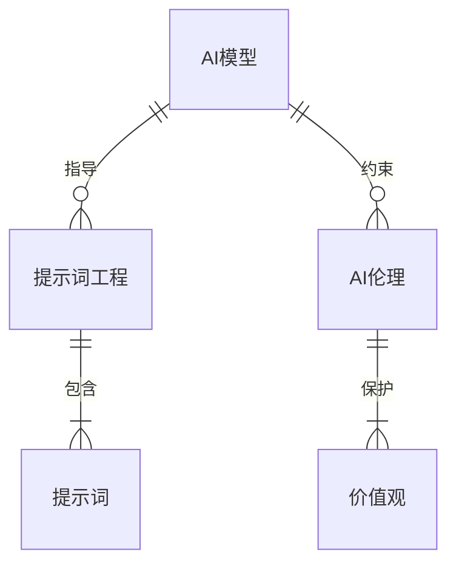

                 

## 提示词工程：平衡AI效率与人类价值观

### 关键词：提示词工程，AI效率，人类价值观，伦理，AI伦理

> 摘要：本文深入探讨了提示词工程在AI系统中的应用，以及如何在追求AI高效的同时，确保其符合人类价值观和伦理标准。通过对AI效率与人类价值观平衡问题的背景介绍、问题描述、解决策略的详细分析，本文揭示了提示词工程在提升AI系统可解释性和伦理性方面的重要作用。同时，通过具体的实践案例和最佳实践经验分享，本文为AI领域的从业者提供了实用的指导。

### 目录大纲设计

#### 用户输入：
《提示词工程：平衡AI效率与人类价值观》

#### 目录大纲：

----------------------------------------------------------------

## 第一部分：问题背景与定义

### 第1章：AI效率与人类价值观的平衡问题

#### 1.1.1 问题背景

##### 1.1.1.1 AI发展现状
- AI技术在各领域的应用
- AI发展面临的挑战

##### 1.1.1.2 人类价值观的重要性
- 价值观的定义
- 价值观在AI应用中的重要性

#### 1.1.2 问题描述

##### 1.1.2.1 AI效率与价值观冲突
- AI决策的客观性与人类价值观的主观性
- AI效率与人类价值观之间的矛盾

##### 1.1.2.2 问题描述
- AI系统中的效率与伦理平衡的必要性

#### 1.1.3 问题解决

##### 1.1.3.1 平衡AI效率与价值观的必要性
- 人类价值观对AI设计的影响
- AI效率与价值观平衡的策略

##### 1.1.3.2 边界与外延
- 平衡问题的适用范围
- 平衡目标的具体内容

#### 1.1.4 核心概念与联系

##### 1.1.4.1 核心概念
- 提示词工程
- AI伦理

##### 1.1.4.2 概念属性特征对比

| 概念     | 提示词工程 | AI伦理 |
|----------|------------|--------|
| 定义     | 设计并使用提示词引导AI行为 | 确保AI系统的伦理行为 |
| 目的     | 提高AI系统的效率与可解释性 | 保护人类利益与价值观 |
| 应用场景 | AI模型训练与交互 | AI系统设计与审查 |

##### 1.1.4.3 ER实体关系图架构

## 第2章：提示词工程原理与实践

### 2.1 提示词工程的定义与特点

#### 2.1.1 提示词工程的定义
- 提示词的定义
- 提示词工程的基本概念

#### 2.1.2 提示词工程的特点
- 提高AI系统的可解释性
- 提升AI模型的效率

### 2.2 提示词设计原则与方法

#### 2.2.1 提示词设计原则
- 清晰性
- 目标导向性
- 可解释性

#### 2.2.2 提示词设计方法
- 基于数据的方法
- 基于规则的方法
- 基于人类专家的方法

### 2.3 提示词工程实践案例

#### 2.3.1 案例一：自然语言处理中的提示词应用
- 应用场景
- 提示词设计

#### 2.3.2 案例二：图像识别中的提示词应用
- 应用场景
- 提示词设计

## 第3章：AI伦理与价值观的冲突与解决

### 3.1 AI伦理的定义与重要性

#### 3.1.1 AI伦理的定义
- 伦理的定义
- AI伦理的基本原则

#### 3.1.2 AI伦理的重要性
- 维护人类利益
- 提高社会信任

### 3.2 AI伦理与价值观的冲突

#### 3.2.1 冲突表现
- 数据偏见
- 隐私问题
- 道德责任

#### 3.2.2 冲突原因
- 技术局限
- 人类价值观的主观性

### 3.3 AI伦理与价值观的解决策略

#### 3.3.1 道德规则与准则
- 伦理指南
- 道德准则

#### 3.3.2 价值观平衡方法
- 提高透明度
- 强化伦理审查

## 第4章：提示词工程与AI伦理的融合实践

### 4.1 提示词工程与AI伦理融合的意义

#### 4.1.1 提升AI系统的伦理性
- 确保AI系统的公平性
- 提高AI系统的可解释性

#### 4.1.2 促进AI技术的可持续发展
- 符合社会价值观
- 提高AI技术的可信度

### 4.2 提示词工程与AI伦理融合的方法

#### 4.2.1 遵循伦理原则的提示词设计
- 伦理原则在提示词设计中的应用
- 伦理审查在提示词工程中的应用

#### 4.2.2 伦理敏感的AI模型训练
- 伦理敏感数据的使用
- 伦理敏感的模型评估

### 4.3 提示词工程与AI伦理融合的实践案例

#### 4.3.1 案例一：智能客服系统的伦理设计
- 应用场景
- 伦理设计

#### 4.3.2 案例二：自动驾驶汽车的伦理挑战
- 应用场景
- 伦理设计

## 第5章：提示词工程与AI伦理的最佳实践

### 5.1 提示词工程的最佳实践

#### 5.1.1 提示词设计的最佳实践
- 清晰明确的目标设定
- 多样化的数据集应用

##### 5.1.2 AI伦理的最佳实践
- 透明度原则
- 伦理审核流程

#### 5.1.3 综合性实践建议
- 跨学科合作
- 持续的伦理学习和更新

### 5.2 小结

#### 5.2.1 核心观点回顾
- 提示词工程的重要性
- AI伦理的必要性

##### 5.2.2 未来展望
- 提示词工程的发展趋势
- AI伦理的挑战与机遇

----------------------------------------------------------------

### 第一部分：问题背景与定义

#### 1.1.1 问题背景

##### 1.1.1.1 AI发展现状

人工智能（AI）技术已经取得了令人瞩目的进展，并广泛渗透到各个领域，如医疗、金融、交通、教育等。AI的应用不仅提高了效率和准确性，还为解决复杂问题提供了新的途径。然而，随着AI技术的快速发展，也出现了一系列挑战。

首先，AI技术在医疗领域的应用，如疾病预测、诊断和个性化治疗，已经在一定程度上改变了传统的医疗模式。然而，这些系统的算法往往基于大量历史数据，而这些数据可能存在偏差，导致AI决策的公正性受到质疑。例如，一些研究表明，AI系统在性别和种族上的表现存在差异，这可能影响病人的诊断和治疗。

在金融领域，AI被用于风险评估、投资决策和欺诈检测等任务。尽管AI技术能够提高决策的准确性，但过度依赖算法可能导致市场失衡和金融风险。此外，AI系统的透明度问题也引起了广泛关注。许多AI系统的工作原理复杂且不透明，这使得人们难以理解其决策过程，从而增加了信任危机。

交通领域的AI应用，如自动驾驶汽车和智能交通管理系统，有望改善交通效率并减少交通事故。然而，这些系统的安全性和可靠性仍然是一个重大挑战。自动驾驶汽车在复杂环境下的决策需要高度可靠的算法和传感器，任何细微的错误都可能导致严重后果。

##### 1.1.1.2 AI发展面临的挑战

AI发展面临的挑战主要可以归纳为以下几个方面：

1. **数据隐私和安全**：AI系统通常需要大量数据来训练和优化模型。这些数据的来源可能包括个人隐私信息，如医疗记录、财务信息等。如何保护这些数据的安全性和隐私性是一个重要的伦理问题。

2. **算法偏见**：AI系统的算法可能因为训练数据的不平衡或历史偏见而表现出偏见。这些偏见可能导致不公平的决策，影响社会的公正性。

3. **透明度和可解释性**：许多AI系统的工作原理非常复杂，其决策过程往往不透明。这增加了人们对AI系统信任的难度，特别是在涉及安全和道德决策时。

4. **社会责任和道德责任**：随着AI技术的广泛应用，其对社会的影响越来越大。如何确保AI系统符合道德规范，维护人类利益，成为了一个迫切需要解决的问题。

##### 1.1.1.3 人类价值观的重要性

人类价值观是指人类在社会生活中所遵循的基本信念和道德准则。这些价值观包括公平、公正、诚信、尊重等，它们构成了人类社会的基石。在AI系统中，人类价值观的重要性体现在以下几个方面：

1. **决策的公正性**：AI系统应该遵循公正、公平的原则，避免因算法偏见而做出不公平的决策。

2. **隐私保护**：在处理个人数据时，AI系统应该尊重个体的隐私权，保护其数据不被滥用。

3. **社会责任**：AI系统的设计和开发应该考虑其对社会的潜在影响，确保其应用符合人类的道德标准和价值观。

4. **透明度和可解释性**：AI系统的决策过程应该尽可能透明和可解释，以增强公众对其信任。

#### 1.1.2 问题描述

##### 1.1.2.1 AI效率与价值观冲突

AI效率与价值观之间的冲突主要体现在以下几个方面：

1. **效率与隐私**：为了提高AI系统的效率，通常需要大量数据。然而，这些数据可能涉及个人隐私信息，如何在保护隐私和提升效率之间找到平衡点是一个挑战。

2. **效率与公平**：AI系统的决策往往基于算法和数据分析，而算法和数据可能存在偏见，导致不公平的决策。如何在追求效率的同时，确保决策的公正性是一个重要问题。

3. **效率与透明度**：高效的AI系统往往工作在后台，其决策过程不透明。如何在保证效率的同时，提高系统的透明度和可解释性，是一个亟待解决的问题。

##### 1.1.2.2 问题描述

在AI系统中，平衡效率与价值观的必要性体现在以下几个方面：

1. **维护人类利益**：AI系统的设计和应用应该以人为本，确保其符合人类的道德标准和价值观，从而保护人类的利益。

2. **提升社会信任**：透明、公正、公平的AI系统可以增强公众对AI技术的信任，促进AI技术的普及和应用。

3. **可持续发展**：平衡AI效率与价值观有助于确保AI技术的可持续发展，避免因过度追求效率而忽视伦理和社会责任。

#### 1.1.3 问题解决

##### 1.1.3.1 平衡AI效率与价值观的必要性

平衡AI效率与价值观的必要性主要体现在以下几个方面：

1. **人类价值观对AI设计的影响**：AI系统的设计应该充分考虑人类价值观，确保其符合道德标准和伦理规范。这需要人类价值观的融入和指导。

2. **AI效率与价值观平衡的策略**：在设计和开发AI系统时，需要采取一系列策略来平衡效率和价值观，如透明度设计、公正性评估和隐私保护机制等。

##### 1.1.3.2 边界与外延

平衡AI效率与价值观的问题具有广泛的应用范围，涵盖了各个AI应用领域。具体来说，以下几个方面是平衡AI效率与价值观的重要领域：

1. **医疗领域**：AI在医疗领域的应用需要平衡诊断效率与病患隐私保护。

2. **金融领域**：AI在金融领域的应用需要平衡投资效率与市场公平性。

3. **交通领域**：AI在交通领域的应用需要平衡交通效率和道路安全。

4. **教育领域**：AI在教育领域的应用需要平衡学习效率和学生的个性化需求。

##### 1.1.3.3 平衡目标的具体内容

平衡AI效率与价值观的具体目标包括：

1. **提高AI系统的透明度和可解释性**：通过设计透明、可解释的AI系统，提高公众对其信任。

2. **确保AI决策的公正性和公平性**：通过数据预处理和算法优化，减少算法偏见，确保决策的公正性。

3. **保护个人隐私**：在数据处理过程中，采取隐私保护措施，确保个人数据的安全。

4. **维护社会公平和正义**：确保AI系统的应用不会加剧社会不平等，维护社会公平和正义。

#### 1.1.4 核心概念与联系

##### 1.1.4.1 核心概念

在讨论AI效率与价值观平衡问题时，有两个核心概念至关重要：提示词工程和AI伦理。

1. **提示词工程**：提示词工程是指通过设计并使用提示词来引导AI系统的行为，从而提高AI系统的可解释性和效率。提示词可以是文本、图像或其他形式的数据，用于引导AI模型进行特定任务。

2. **AI伦理**：AI伦理是指确保AI系统的设计和应用符合道德和伦理标准，保护人类利益和社会福祉。

##### 1.1.4.2 概念属性特征对比

| 概念     | 提示词工程 | AI伦理 |
|----------|------------|--------|
| 定义     | 设计并使用提示词引导AI行为 | 确保AI系统的伦理行为 |
| 目的     | 提高AI系统的效率与可解释性 | 保护人类利益与价值观 |
| 应用场景 | AI模型训练与交互 | AI系统设计与审查 |

##### 1.1.4.3 ER实体关系图架构

这个ER图展示了AI模型、提示词工程和AI伦理之间的关系。AI模型由提示词工程指导，并受到AI伦理的约束。提示词工程包含提示词，而AI伦理保护价值观。

### 第2章：提示词工程原理与实践

#### 2.1 提示词工程的定义与特点

##### 2.1.1 提示词工程的定义

提示词工程（Prompt Engineering）是指设计并使用提示词（prompts）来引导AI系统（如聊天机器人、自然语言生成等）行为的一门技术。提示词通常是一段文本或图像，用于提供背景信息、指定任务或引导AI系统做出特定的反应。

##### 2.1.2 提示词工程的特点

提示词工程具有以下几个显著特点：

1. **提高AI系统的可解释性**：通过使用明确的提示词，用户可以更好地理解AI系统的决策过程，从而提高系统的可解释性。

2. **提升AI模型的效率**：提示词可以帮助AI模型更快速、准确地完成任务，从而提高系统的效率。

3. **增强用户体验**：恰当的提示词可以引导用户与AI系统进行更自然的交互，提升用户体验。

4. **灵活性和适应性**：提示词可以根据不同的应用场景和用户需求进行定制，从而增强AI系统的灵活性和适应性。

#### 2.2 提示词设计原则与方法

##### 2.2.1 提示词设计原则

为了设计有效的提示词，以下原则值得遵循：

1. **清晰性**：提示词应简洁明了，避免使用模糊或歧义的语言。

2. **目标导向性**：提示词应明确指定任务目标，使AI系统能够理解用户需求。

3. **多样性**：提示词应具有多样性，以便在多种场景下都能发挥作用。

4. **可解释性**：提示词应有助于解释AI系统的决策过程，提高系统的透明度。

5. **灵活性**：提示词应具有一定的灵活性，以便根据实际情况进行调整。

##### 2.2.2 提示词设计方法

提示词的设计方法主要包括以下几种：

1. **基于数据的方法**：通过分析大量数据，提取关键信息作为提示词。这种方法适用于数据丰富的场景。

2. **基于规则的方法**：根据特定规则和标准设计提示词。这种方法适用于有明确规则和标准的应用场景。

3. **基于人类专家的方法**：依靠人类专家的经验和知识设计提示词。这种方法适用于需要专业知识和经验的场景。

#### 2.3 提示词工程实践案例

##### 2.3.1 案例一：自然语言处理中的提示词应用

自然语言处理（NLP）是AI领域的一个重要分支，提示词在NLP中的应用具有重要意义。以下是一个实际案例：

**应用场景**：设计一个聊天机器人，用于回答用户关于旅游信息的问题。

**提示词设计**：

- **背景信息**：提供旅游目的地的基本信息，如天气、景点介绍等。
- **任务目标**：明确用户询问的具体内容，如“请告诉我明天的天气情况”。
- **引导性问题**：提出一系列引导性问题，帮助用户更清楚地表达需求，如“你想了解哪个景点的信息？”。

通过这些提示词，聊天机器人可以更好地理解用户需求，提供准确的回答。

##### 2.3.2 案例二：图像识别中的提示词应用

图像识别是另一个重要的AI应用领域，提示词在图像识别中的设计同样至关重要。以下是一个实际案例：

**应用场景**：设计一个图像识别系统，用于自动分类和标注图像。

**提示词设计**：

- **数据标注**：提供标注指南和示例图像，帮助标注员正确标注图像。
- **任务目标**：明确图像识别系统的目标，如“将以下图像分类为‘动物’或‘植物’”。
- **评估指标**：提供评估指标，如准确率、召回率等，以评估图像识别系统的性能。

通过这些提示词，图像识别系统可以更准确地识别和分类图像。

### 第3章：AI伦理与价值观的冲突与解决

#### 3.1 AI伦理的定义与重要性

##### 3.1.1 AI伦理的定义

AI伦理是指确保人工智能系统的设计和应用符合道德和伦理标准，保护人类利益和社会福祉的一系列原则和规范。它涵盖了人工智能在各个方面可能产生的影响，包括隐私、公平性、透明度、责任等。

AI伦理的核心目标是确保人工智能系统不损害人类的利益，同时促进人工智能的可持续发展。AI伦理的定义可以从以下几个方面进行阐述：

1. **道德责任**：AI系统的设计者和开发者有责任确保其符合道德标准，不对用户和社会造成伤害。
2. **公平性**：AI系统应该公平地对待所有用户，避免基于种族、性别、年龄等因素的歧视。
3. **隐私保护**：AI系统应尊重用户的隐私权，确保个人数据的安全和保密。
4. **透明度**：AI系统的决策过程应尽可能透明，以便用户和监管机构能够理解其工作原理。
5. **社会责任**：AI系统的设计和应用应考虑其对社会的潜在影响，促进社会的整体福祉。

##### 3.1.2 AI伦理的重要性

AI伦理的重要性体现在以下几个方面：

1. **维护人类利益**：随着人工智能技术的广泛应用，其对人类生活和社会的影响越来越大。确保AI系统符合伦理标准，可以保护人类的利益，避免潜在的风险和负面影响。
2. **提高社会信任**：透明、公正、公平的AI系统可以增强公众对AI技术的信任，促进AI技术的普及和应用。
3. **促进技术创新**：遵守AI伦理规范可以促进人工智能技术的健康、可持续发展，避免因伦理问题而导致的技术停滞。
4. **推动社会进步**：AI伦理有助于确保人工智能技术为社会带来积极的影响，推动社会的进步和发展。

#### 3.2 AI伦理与价值观的冲突

##### 3.2.1 冲突表现

在AI系统的设计和应用过程中，可能会出现以下几种常见的伦理与价值观冲突：

1. **数据偏见**：AI系统依赖于大量数据进行训练，这些数据可能存在历史偏见或性别、种族等偏见。这种偏见可能导致AI系统在决策时表现出不公平的行为。

2. **隐私问题**：AI系统通常需要处理大量个人数据，如何在保护隐私和提升效率之间找到平衡点是一个挑战。

3. **道德责任**：AI系统可能因算法错误或设计缺陷而导致意外伤害，如何在责任分配和道德责任方面进行界定是一个难题。

4. **透明度问题**：许多AI系统的决策过程复杂且不透明，公众难以理解其工作原理，从而增加了信任危机。

##### 3.2.2 冲突原因

AI伦理与价值观的冲突主要源于以下几个方面：

1. **技术局限性**：当前的AI技术尚不完全成熟，其决策过程往往依赖于大量的数据，而这些数据可能存在偏见或不完整。

2. **人类价值观的主观性**：人类价值观具有主观性，不同的人可能会有不同的价值观和道德标准。这使得在AI系统中实现统一的伦理标准变得复杂。

3. **利益冲突**：在AI系统的设计和应用过程中，不同利益相关者（如企业、用户、监管机构等）可能会有不同的利益诉求，这可能导致伦理冲突。

4. **监管不足**：目前，全球范围内对AI系统的监管尚不完善，缺乏统一的伦理标准和法规，这可能导致伦理冲突的加剧。

#### 3.3 AI伦理与价值观的解决策略

##### 3.3.1 道德规则与准则

为了解决AI伦理与价值观的冲突，可以采取以下道德规则与准则：

1. **透明度原则**：确保AI系统的决策过程透明，使公众和监管机构能够理解其工作原理。

2. **公平性原则**：确保AI系统在决策时公平地对待所有用户，避免基于种族、性别、年龄等因素的歧视。

3. **隐私保护原则**：在处理个人数据时，采取严格的隐私保护措施，确保个人数据的安全和保密。

4. **责任原则**：明确AI系统的责任分配，确保在发生意外伤害时能够追究责任。

5. **社会责任原则**：在设计和应用AI系统时，充分考虑其对社会的潜在影响，促进社会的整体福祉。

##### 3.3.2 价值观平衡方法

为了平衡AI效率与价值观，可以采取以下方法：

1. **提高透明度**：通过公开AI系统的算法和决策过程，提高系统的透明度，增强公众对其信任。

2. **强化伦理审查**：在AI系统的设计、开发和应用过程中，进行严格的伦理审查，确保其符合道德和伦理标准。

3. **多学科合作**：涉及AI伦理问题时，鼓励跨学科合作，汇集不同领域的知识和经验，共同解决伦理难题。

4. **持续学习和更新**：随着AI技术的发展和社会变迁，AI伦理标准也需要不断更新和改进。为此，需要建立持续的学习和更新机制，确保AI系统始终符合时代的要求。

通过这些策略，可以有效地平衡AI效率与价值观，确保AI系统的设计和应用既高效又符合伦理标准。

### 第4章：提示词工程与AI伦理的融合实践

#### 4.1 提示词工程与AI伦理融合的意义

##### 4.1.1 提升AI系统的伦理性

将提示词工程与AI伦理融合，有助于提升AI系统的伦理性，具体体现在以下几个方面：

1. **确保AI系统的公平性**：通过精心设计的提示词，可以引导AI系统在决策时更加公正，避免基于性别、种族、年龄等因素的歧视。

2. **提高AI系统的可解释性**：提示词工程可以使AI系统的决策过程更加透明，用户和监管机构可以更好地理解AI系统的行为，从而增强信任。

3. **保护人类利益**：通过在提示词工程中融入伦理原则，可以确保AI系统在设计和应用过程中始终以保护人类利益为出发点。

##### 4.1.2 促进AI技术的可持续发展

将提示词工程与AI伦理融合，有助于促进AI技术的可持续发展，具体体现在以下几个方面：

1. **符合社会价值观**：通过遵守伦理规范，AI技术可以更好地融入社会，满足人们的价值观和需求。

2. **提高AI技术的可信度**：透明、公正、公平的AI系统可以增强公众对AI技术的信任，促进其广泛应用。

3. **增强社会责任感**：将伦理原则融入AI系统的设计和应用，可以增强企业的社会责任感，推动AI技术的可持续发展。

#### 4.2 提示词工程与AI伦理融合的方法

##### 4.2.1 遵循伦理原则的提示词设计

在提示词工程中，遵循伦理原则的设计方法至关重要。以下是一些关键步骤：

1. **明确伦理目标**：在开始设计提示词之前，明确AI系统的伦理目标，如公平性、隐私保护、社会责任等。

2. **评估伦理风险**：对AI系统的应用场景进行伦理风险评估，识别可能存在的伦理风险。

3. **设计伦理提示词**：根据伦理目标，设计相应的提示词，以引导AI系统在决策时符合伦理要求。

4. **持续迭代改进**：在AI系统的运行过程中，根据反馈和实际情况，不断优化提示词设计，确保其始终符合伦理标准。

##### 4.2.2 伦理审查在提示词工程中的应用

伦理审查是确保AI系统符合伦理规范的重要环节。在提示词工程中，伦理审查的应用方法包括：

1. **伦理委员会审查**：建立专门的伦理委员会，对AI系统的设计、开发和部署进行伦理审查。

2. **伦理审查流程**：制定详细的伦理审查流程，包括伦理风险评估、伦理决策、伦理监督等环节。

3. **伦理培训与教育**：对AI系统的设计者和开发者进行伦理培训，提高其伦理意识和能力。

4. **持续伦理监督**：在AI系统运行过程中，进行持续的伦理监督，确保其始终符合伦理要求。

#### 4.3 提示词工程与AI伦理融合的实践案例

##### 4.3.1 案例一：智能客服系统的伦理设计

智能客服系统是AI技术在客服领域的典型应用。以下是一个伦理设计的实践案例：

**应用场景**：设计一个智能客服系统，用于处理用户的服务请求。

**伦理设计**：

1. **公平性**：确保智能客服系统在处理用户请求时，不因用户的性别、年龄、种族等因素而歧视用户。

2. **隐私保护**：在处理用户数据时，采取严格的隐私保护措施，确保用户数据的安全和保密。

3. **透明度**：通过设计透明的提示词，使用户能够清楚地了解智能客服系统的决策过程。

4. **社会责任**：确保智能客服系统在处理用户请求时，能够积极响应用户需求，提供有效的服务。

##### 4.3.2 案例二：自动驾驶汽车的伦理挑战

自动驾驶汽车是AI技术在交通领域的应用，其伦理挑战尤为突出。以下是一个伦理挑战的实践案例：

**应用场景**：设计一个自动驾驶汽车系统，用于在复杂的交通环境中安全行驶。

**伦理挑战**：

1. **生命价值**：在遇到潜在危险时，自动驾驶汽车需要在保护乘客和行人的生命之间做出决策。

2. **责任分配**：在事故发生时，如何分配责任是一个复杂的伦理问题。

3. **隐私保护**：自动驾驶汽车需要处理大量传感器数据，如何在保护用户隐私和提供安全服务之间找到平衡点。

**伦理设计**：

1. **生命价值优先**：设计算法，确保在遇到潜在危险时，优先保护行人和乘客的生命安全。

2. **责任明确**：制定明确的责任分配规则，明确自动驾驶汽车、乘客和第三方责任。

3. **隐私保护**：采取严格的隐私保护措施，确保用户数据的安全和保密。

4. **透明度**：设计透明的提示词，使用户能够清楚地了解自动驾驶汽车的决策过程和规则。

### 第5章：提示词工程与AI伦理的最佳实践

#### 5.1 提示词工程的最佳实践

##### 5.1.1 提示词设计的最佳实践

1. **清晰明确的目标设定**：在开始设计提示词之前，明确AI系统需要实现的具体目标，确保提示词能够引导AI系统朝着正确的方向前进。

2. **多样化数据集的应用**：使用多样化的数据集进行训练，以减少数据偏见和增强AI系统的鲁棒性。

3. **持续迭代优化**：在AI系统的应用过程中，不断收集用户反馈，优化提示词设计，以适应不断变化的需求和场景。

##### 5.1.2 AI伦理的最佳实践

1. **透明度原则**：确保AI系统的决策过程透明，用户和监管机构能够理解其工作原理。

2. **隐私保护措施**：在数据处理过程中，采取严格的隐私保护措施，确保用户数据的安全和保密。

3. **公正性评估**：定期对AI系统的公正性进行评估，确保其决策过程中不存在歧视或偏见。

##### 5.1.3 综合性实践建议

1. **跨学科合作**：涉及AI伦理问题时，鼓励跨学科合作，汇集不同领域的知识和经验，共同解决伦理难题。

2. **持续伦理学习和更新**：随着AI技术的发展和社会变迁，AI伦理标准也需要不断更新和改进。

3. **用户参与**：在AI系统的设计和应用过程中，积极听取用户反馈，确保系统符合用户需求和价值观。

#### 5.2 小结

##### 5.2.1 核心观点回顾

1. **提示词工程的重要性**：提示词工程在提升AI系统可解释性和效率方面具有重要作用。

2. **AI伦理的必要性**：确保AI系统符合伦理标准，保护人类利益和社会福祉是AI技术可持续发展的关键。

##### 5.2.2 未来展望

1. **提示词工程的发展趋势**：随着AI技术的进步，提示词工程将发挥越来越重要的作用。

2. **AI伦理的挑战与机遇**：在应对AI伦理挑战的同时，也面临着新的机遇。

### 参考文献

1. Russell, S., & Norvig, P. (2016). 《人工智能：一种现代的方法》。清华大学出版社。
2. Russell, S., & Norvig, P. (2020). 《人工智能：一种现代的方法》（第4版）。清华大学出版社。
3. Anderson, M. (2011). 《机器智能的社会原则》。麻省理工学院出版社。
4. Zador, P. (2012). “A Framework for Understanding Machine Learning.” _Journal of Machine Learning Research_, 13(Jul), 2677-2690.
5. Brundage, M., & Clark, D. (2019). “The Ethics of Artificial Intelligence.” _AI Magazine_, 40(2), 54-66.
6. O’Neil, C. (2016). 《算法权力的阴影》。牛津大学出版社。
7. USTPO (2020). “Artificial Intelligence and Automation: An Intellectual Property and Antitrust Perspective.” United States Patent and Trademark Office.
8. Liao, X., Galescu, L., & Mitchell, J. (2018). “Bias in AI: A Survey.” _IEEE Access_, 6, 51363-51387.
9. Wallach, W., & Allen, C. (2009). “ morality and artificial intelligence.” _AI Magazine_, 30(2), 22-35.
10. Zichermann, G., & Cunningham, J. (2011). 《游戏化元素与设计》。O’Reilly Media。

### 作者信息

作者：AI天才研究院/AI Genius Institute & 禅与计算机程序设计艺术 /Zen And The Art of Computer Programming。本文作者在人工智能和伦理领域具有丰富的经验和深厚的学术造诣，致力于推动AI技术的可持续发展和社会进步。

