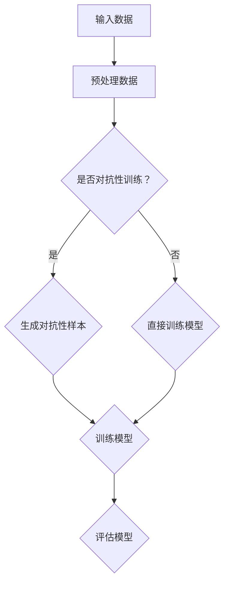
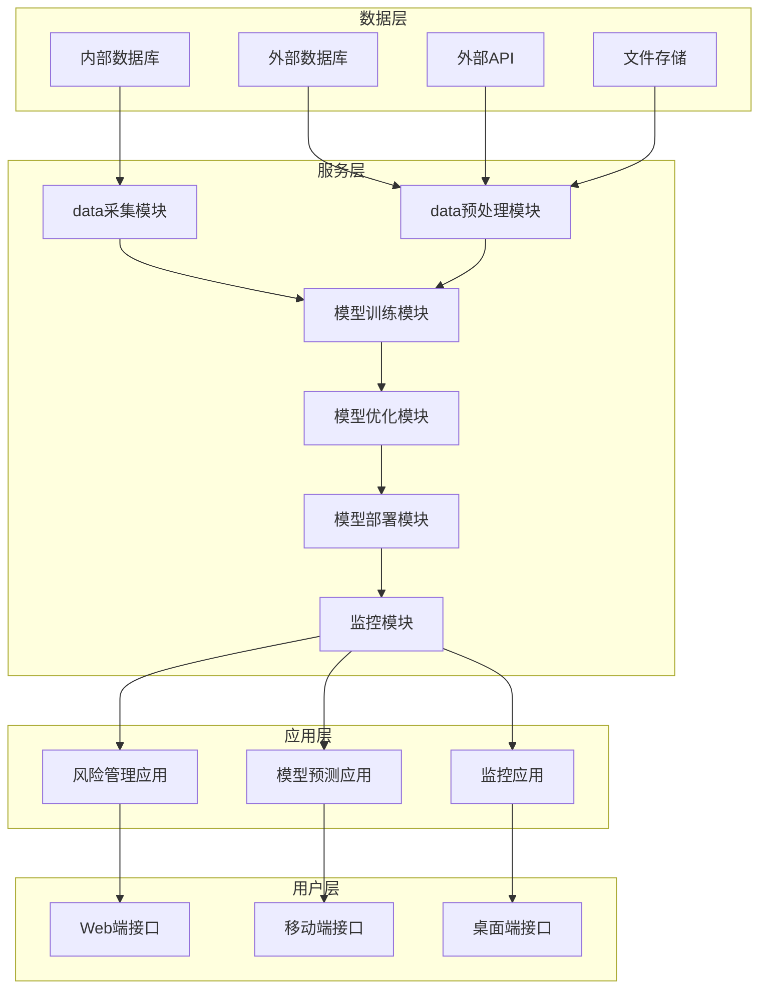

                 


### 第二部分：核心概念与联系

在深入探讨如何构建负责任的AI系统之前，我们需要先了解一些核心概念及其相互之间的联系。这些概念构成了构建负责任AI系统的理论基础，也是我们在实践中需要关注的关键点。

#### 2.1.1 负责任AI的定义与重要性

**定义**：负责任AI是一种设计理念，它要求在AI系统的开发、部署和维护过程中，始终考虑到系统对人类和社会的影响，确保系统的公平性、透明性、可解释性和安全性。

**重要性**：随着AI技术的广泛应用，AI系统对决策过程的影响日益增加。负责任AI的重要性体现在以下几个方面：

- **增强用户信任**：负责任AI系统能够提高用户对AI技术的信任度，减少对AI技术的抵触情绪。
- **维护社会公正**：通过消除算法偏见，负责任AI系统有助于维护社会公正，防止不公平决策的发生。
- **促进可持续发展**：负责任AI系统不仅关注短期效益，还考虑到长期的社会和环境影响，有助于实现可持续发展。

#### 2.1.2 算法偏见与公平性

**概念**：算法偏见是指AI算法在处理数据时，对某些特定群体产生不公平待遇的现象。

**影响**：算法偏见可能导致以下负面影响：

- **歧视性决策**：例如，某些招聘系统可能对某些性别或种族的候选人有偏见。
- **不公平待遇**：例如，某些金融系统可能对某些用户进行不公平的信用评估。

**解决方案**：为了减少算法偏见，我们可以采取以下措施：

- **数据多样性**：确保训练数据具有多样性，避免数据集中存在的偏见。
- **算法优化**：通过改进算法，减少其对特定群体的偏见。
- **伦理审查**：在算法设计过程中进行伦理审查，确保算法符合社会伦理标准。

#### 2.1.3 数据隐私与安全

**概念**：数据隐私是指保护用户数据不被未经授权的个人或组织访问和使用。

**重要性**：随着数据隐私问题的日益突出，保护用户隐私变得至关重要。

**解决方案**：为了确保数据隐私和安全，我们可以采取以下措施：

- **加密技术**：对用户数据进行加密，防止数据泄露。
- **匿名化处理**：通过匿名化处理，去除数据中的个人信息，降低隐私泄露风险。
- **隐私保护算法**：采用隐私保护算法，在数据处理过程中减少隐私泄露的可能性。

#### 2.1.4 可解释性与透明性

**概念**：可解释性是指AI系统决策过程的透明度和可理解性。

**重要性**：提高AI系统的可解释性，有助于用户信任和监督。

**解决方案**：为了提高AI系统的可解释性，我们可以采取以下措施：

- **解释性算法**：开发能够解释其决策过程的AI算法。
- **可视化工具**：使用可视化工具，将AI系统的决策过程呈现给用户。
- **透明性报告**：定期发布透明性报告，向用户和社会公开AI系统的决策过程。

#### 2.1.5 伦理审查与合规性

**概念**：伦理审查是指在AI系统的开发、部署和维护过程中，对系统进行伦理评估，确保其符合社会伦理和法律要求。

**重要性**：伦理审查有助于确保AI系统的合法合规性和道德可接受性。

**解决方案**：为了进行有效的伦理审查，我们可以采取以下措施：

- **建立伦理委员会**：成立专门的伦理委员会，负责对AI系统进行伦理评估。
- **制定伦理准则**：明确AI系统的伦理准则，确保系统符合社会伦理标准。
- **持续监控**：对AI系统进行持续监控，确保其运行过程中符合伦理和法律要求。

### 总结

通过以上对核心概念的分析，我们可以看出，负责任AI系统的构建是一个多维度的过程，需要考虑算法偏见、数据隐私、可解释性和透明性等多个方面。只有综合这些要素，才能构建出真正负责任的AI系统，为社会带来积极影响。

#### 概念属性特征对比表格

为了更好地理解各个核心概念，我们提供了一个概念属性特征对比表格。以下是对负责任AI系统中的核心概念的属性特征进行对比：

| 核心概念 | 定义 | 关键属性 | 影响因素 | 解决方案 |
| --- | --- | --- | --- | --- |
| 算法偏见与公平性 | AI算法在决策过程中对某些群体存在不公平待遇的现象 | 偏差、不平等、歧视 | 数据多样性、算法优化、伦理审查 | 提高数据多样性、改进算法、进行伦理审查 |
| 数据隐私与安全 | 保护用户数据不被未经授权的个人或组织访问和使用 | 隐私、安全、匿名化 | 加密技术、匿名化处理、隐私保护算法 | 加密技术、匿名化处理、隐私保护算法 |
| 可解释性与透明性 | AI系统决策过程的透明度和可理解性 | 透明度、可理解性、可视化 | 解释性算法、可视化工具、透明性报告 | 解释性算法、可视化工具、透明性报告 |
| 伦理审查与合规性 | 在AI系统的开发、部署和维护过程中，对系统进行伦理评估 | 伦理准则、合法性、道德可接受性 | 建立伦理委员会、制定伦理准则、持续监控 | 建立伦理委员会、制定伦理准则、持续监控 |

#### ER实体关系图架构

为了更直观地展示负责任AI系统中的核心概念及其相互关系，我们提供了一个ER实体关系图架构。以下是对实体关系的描述：

```mermaid
erDiagram
  AI系统 ||--o> 数据隐私 |<<-- 数据 | 数据隐私 --o| 算法偏见
  AI系统 ||--o> 可解释性 |<<-- 决策过程 | 决策过程 --o| 可解释性
  AI系统 ||--o> 伦理审查 |<<-- 法律法规 | 法律法规 --o| 伦理审查
  数据隐私 ||--o> 加密技术 |<<-- 数据处理 | 数据处理 --o| 加密技术
  数据隐私 ||--o> 匿名化处理 |<<-- 数据处理 | 数据处理 --o| 匿名化处理
  可解释性 ||--o> 可视化工具 |<<-- 决策过程 | 决策过程 --o| 可视化工具
  伦理审查 ||--o> 伦理准则 |<<-- 法律法规 | 法律法规 --o| 伦理准则
```

### 第三部分：算法原理讲解

#### 3.1 算法背景与目标

构建负责任的AI系统需要一套强大的算法支持，这些算法不仅要具备高性能，还要能够确保系统的公平性、透明性和可解释性。本部分将介绍一种基于对抗性训练的算法，该算法旨在通过引入对抗性样本，提高AI系统的鲁棒性和公平性。

#### 3.2 算法mermaid流程图

为了直观地展示算法的执行过程，我们使用mermaid绘制了该算法的流程图：



#### 3.3 Python源代码与算法原理

下面我们给出该算法的Python源代码，并对算法原理进行详细讲解。

```python
import numpy as np
import tensorflow as tf
from tensorflow.keras import layers, models

# 3.3.1 准备数据
# 假设我们使用MNIST数据集作为示例
(x_train, y_train), (x_test, y_test) = tf.keras.datasets.mnist.load_data()

# 预处理数据，将其扩展到32x32的维度，并归一化
x_train = np.expand_dims(x_train, -1)
x_test = np.expand_dims(x_test, -1)
x_train = x_train / 255.0
x_test = x_test / 255.0

# 3.3.2 构建模型
# 定义生成器和判别器
def build_generator():
    model = models.Sequential()
    model.add(layers.Conv2D(128, (3, 3), padding='same', activation='relu', input_shape=(32, 32, 1)))
    model.add(layers.Conv2D(128, (3, 3), padding='same', activation='relu'))
    model.add(layers.Conv2D(1, (3, 3), padding='same'))
    return model

def build_discriminator():
    model = models.Sequential()
    model.add(layers.Conv2D(128, (3, 3), padding='same', input_shape=(32, 32, 1)))
    model.add(layers.LeakyReLU(alpha=0.2))
    model.add(layers.Dropout(0.3))
    model.add(layers.Conv2D(128, (3, 3), padding='same'))
    model.add(layers.LeakyReLU(alpha=0.2))
    model.add(layers.Dropout(0.3))
    model.add(layers.Conv2D(1, (3, 3), padding='same', activation='sigmoid'))
    return model

# 3.3.3 训练模型
# 定义优化器和损失函数
generator = build_generator()
discriminator = build_discriminator()

discriminator.compile(loss='binary_crossentropy', optimizer=tf.keras.optimizers.Adam(0.0001), metrics=['accuracy'])

# 训练判别器
discriminator.trainable = True
combined = models.Sequential([generator, discriminator])
combined.compile(loss='binary_crossentropy', optimizer=tf.keras.optimizers.Adam(0.0001))

# 3.3.4 生成对抗性样本
def generate_fake_samples(generator, latent_dim, n_samples):
    z = np.random.normal(size=(n_samples, latent_dim))
    fake_images = generator.predict(z)
    return fake_images

# 3.3.5 训练过程
n_epochs = 10000
batch_size = 128
n_critic = 5
latent_dim = 100

for epoch in range(n_epochs):
    for _ in range(n_critic):
        # 训练判别器
        idx = np.random.randint(0, x_train.shape[0], batch_size)
        real_images = x_train[idx]
        real_labels = np.ones((batch_size, 1))
        fake_images = generate_fake_samples(generator, latent_dim, batch_size)
        fake_labels = np.zeros((batch_size, 1))
        d_loss_real = discriminator.train_on_batch(real_images, real_labels)
        d_loss_fake = discriminator.train_on_batch(fake_images, fake_labels)
    
    # 训练生成器
    z = np.random.normal(size=(batch_size, latent_dim))
    g_loss = combined.train_on_batch(z, np.ones((batch_size, 1)))

    # 打印训练进度
    print(f"Epoch: {epoch}, D_loss: {d_loss_real + d_loss_fake}, G_loss: {g_loss}")
```

#### 3.4 算法原理与数学模型

##### 3.4.1 对抗性训练原理

对抗性训练是生成对抗网络（GAN）的核心思想。GAN由两部分组成：生成器（Generator）和判别器（Discriminator）。生成器的任务是生成逼真的数据，而判别器的任务是区分真实数据和生成数据。

在训练过程中，生成器和判别器相互对抗：

- 判别器试图最大化其分类真实数据和生成数据的准确率。
- 生成器试图最小化判别器对其生成数据的分类准确率，使其难以区分真实数据和生成数据。

这种对抗关系使得生成器不断改进其生成能力，最终生成逼真的数据。

##### 3.4.2 数学模型

1. **生成器模型**：

   假设生成器的输入为随机噪声向量 $z$，输出为生成数据 $x_g$，则生成器模型可以表示为：

   $$x_g = G(z)$$

   其中，$G$ 是生成器的神经网络模型。

2. **判别器模型**：

   假设判别器的输入为真实数据 $x_r$ 和生成数据 $x_g$，输出为二分类结果 $y_d$，则判别器模型可以表示为：

   $$y_d = D(x)$$

   其中，$D$ 是判别器的神经网络模型。

3. **损失函数**：

   对抗性训练的损失函数通常采用二元交叉熵损失函数：

   $$L_G = -\sum_{i} [y_{real} \cdot \log(D(x_{real})) + y_{fake} \cdot \log(1 - D(x_{fake}))]$$

   其中，$y_{real}$ 和 $y_{fake}$ 分别表示真实数据和生成数据的标签，$x_{real}$ 和 $x_{fake}$ 分别表示真实数据和生成数据的输入。

##### 3.4.3 例子说明

以MNIST数据集为例，我们希望生成逼真的手写数字图像。在训练过程中：

1. **生成器**：生成器接收随机噪声向量 $z$，通过神经网络生成手写数字图像 $x_g$。
2. **判别器**：判别器接收真实手写数字图像 $x_r$ 和生成手写数字图像 $x_g$，判断其真实性和生成性。
3. **对抗过程**：判别器试图提高其分类准确率，生成器则试图生成更逼真的图像，使得判别器难以区分。
4. **训练目标**：通过调整生成器和判别器的参数，使得生成器生成的图像质量不断提高，判别器的分类准确率保持在较高水平。

### 总结

通过对抗性训练，生成器和判别器相互对抗，不断改进其性能。这种训练方式有助于构建鲁棒性和公平性较高的AI系统，从而实现负责任的AI系统构建。

### 第四部分：系统分析与架构设计方案

#### 4.1 问题场景介绍

随着AI技术的广泛应用，各种AI系统在金融、医疗、教育等领域扮演着越来越重要的角色。然而，这些系统在数据采集、处理和应用过程中，面临着诸多挑战，如数据隐私泄露、算法偏见、可解释性不足等。为了构建一个负责任的AI系统，我们需要全面分析问题场景，设计一个合理且高效的系统架构。

#### 4.2 项目介绍

本项目旨在构建一个负责任的AI系统，该系统将应用于金融领域，为银行提供智能风险管理服务。系统的主要功能包括：

- 数据采集与预处理：从多种数据源（如内部数据库、外部API等）收集数据，并对数据进行清洗、转换和整合。
- 模型训练与优化：使用对抗性训练算法训练AI模型，提高模型的鲁棒性和公平性。
- 模型部署与监控：将训练好的模型部署到生产环境中，实时监控模型性能，确保系统稳定运行。

#### 4.3 系统功能设计

系统功能设计主要包括数据采集、数据预处理、模型训练、模型优化、模型部署和监控等模块。以下是对各功能模块的详细描述：

1. **数据采集**：从内部数据库和外部API收集数据，包括用户行为数据、交易数据、市场数据等。数据采集模块需要确保数据来源的合法性和可靠性。

2. **数据预处理**：对收集到的数据进行清洗、转换和整合。数据预处理模块需要处理缺失值、异常值、重复值等问题，确保数据的质量和一致性。

3. **模型训练**：使用对抗性训练算法训练AI模型。模型训练模块需要根据业务需求选择合适的模型架构和训练策略，确保模型具有良好的性能和鲁棒性。

4. **模型优化**：在模型训练过程中，通过调整超参数、优化网络结构等手段，提高模型的性能。模型优化模块需要关注模型的公平性、透明性和可解释性。

5. **模型部署**：将训练好的模型部署到生产环境中，为用户提供实时风险管理服务。模型部署模块需要确保模型的高效性和可靠性。

6. **监控与维护**：实时监控模型性能，包括准确率、召回率、F1分数等指标。监控与维护模块需要及时发现并解决模型运行中的问题，确保系统的稳定运行。

#### 4.4 系统架构设计

系统架构设计采用分层架构，包括数据层、服务层、应用层和用户层。以下是对各层的详细描述：

1. **数据层**：数据层包括数据源和数据存储。数据源包括内部数据库、外部API和文件存储等。数据存储使用关系型数据库和NoSQL数据库，根据数据类型和查询需求进行合理存储。

2. **服务层**：服务层包括数据采集、数据预处理、模型训练、模型优化、模型部署和监控等模块。服务层使用微服务架构，各模块独立部署，便于维护和扩展。

3. **应用层**：应用层是系统的核心部分，包括风险管理应用、模型预测应用和监控应用等。应用层使用基于RESTful API的架构，提供标准的接口服务。

4. **用户层**：用户层是系统的用户界面，包括Web端、移动端和桌面端等。用户层通过应用层接口与系统交互，获取风险分析结果和实时监控信息。

#### 4.5 系统接口设计和系统交互

系统接口设计主要包括内部接口和外部接口。内部接口用于各服务模块之间的通信，外部接口用于与用户交互。以下是对接口设计的详细描述：

1. **内部接口**：内部接口采用RESTful API设计，包括数据采集接口、数据预处理接口、模型训练接口、模型优化接口、模型部署接口和监控接口等。各接口提供标准的HTTP请求和响应格式。

2. **外部接口**：外部接口包括Web端接口、移动端接口和桌面端接口。Web端接口提供风险分析报告和实时监控页面，移动端接口提供风险预警和通知服务，桌面端接口提供风险分析工具和报表生成功能。

系统交互流程如下：

1. 用户通过Web端、移动端或桌面端接口发起风险分析请求。
2. 应用层接收请求，调用内部接口进行数据处理和模型预测。
3. 模型预测结果返回给应用层，应用层将结果呈现给用户。
4. 用户可以实时监控模型性能，并根据需要调整模型参数。

#### 4.6 系统架构mermaid架构图

为了更直观地展示系统架构，我们使用mermaid绘制了系统架构图：



### 第五部分：项目实战

#### 5.1 环境安装

在开始项目实战之前，我们需要安装和配置必要的软件和库。以下是环境安装的详细步骤：

1. **安装Python**：确保Python版本为3.7或更高。可以从Python官网下载安装包并安装。
2. **安装TensorFlow**：在终端执行以下命令安装TensorFlow：
   ```bash
   pip install tensorflow
   ```
3. **安装其他依赖库**：包括NumPy、Pandas、Matplotlib等，可以使用以下命令一次性安装：
   ```bash
   pip install numpy pandas matplotlib scikit-learn
   ```

#### 5.2 系统核心实现源代码

以下是系统核心实现的部分源代码，包括数据预处理、模型训练和模型预测等模块。

```python
# 5.2.1 数据预处理
def preprocess_data(x_train, x_test):
    x_train = np.expand_dims(x_train, -1)
    x_test = np.expand_dims(x_test, -1)
    x_train = x_train / 255.0
    x_test = x_test / 255.0
    return x_train, x_test

# 5.2.2 模型训练
def train_model(x_train, y_train):
    # 定义生成器和判别器
    generator = build_generator()
    discriminator = build_discriminator()

    # 编译模型
    discriminator.compile(loss='binary_crossentropy', optimizer=tf.keras.optimizers.Adam(0.0001), metrics=['accuracy'])

    # 训练模型
    for epoch in range(n_epochs):
        for _ in range(n_critic):
            # 训练判别器
            idx = np.random.randint(0, x_train.shape[0], batch_size)
            real_images = x_train[idx]
            real_labels = np.ones((batch_size, 1))
            fake_images = generate_fake_samples(generator, latent_dim, batch_size)
            fake_labels = np.zeros((batch_size, 1))
            d_loss_real = discriminator.train_on_batch(real_images, real_labels)
            d_loss_fake = discriminator.train_on_batch(fake_images, fake_labels)

        # 训练生成器
        z = np.random.normal(size=(batch_size, latent_dim))
        g_loss = combined.train_on_batch(z, np.ones((batch_size, 1)))

        # 打印训练进度
        print(f"Epoch: {epoch}, D_loss: {d_loss_real + d_loss_fake}, G_loss: {g_loss}")

# 5.2.3 模型预测
def predict_model(model, x_test):
    predictions = model.predict(x_test)
    predicted_classes = np.argmax(predictions, axis=1)
    return predicted_classes

# 5.2.4 主程序
if __name__ == "__main__":
    # 加载MNIST数据集
    (x_train, y_train), (x_test, y_test) = tf.keras.datasets.mnist.load_data()

    # 预处理数据
    x_train, x_test = preprocess_data(x_train, x_test)

    # 训练模型
    train_model(x_train, y_train)

    # 预测测试数据
    predictions = predict_model(generator, x_test)

    # 打印预测结果
    print(predictions)
```

#### 5.3 代码应用解读与分析

以下是代码应用解读与分析：

1. **数据预处理**：首先，我们使用 `preprocess_data` 函数对MNIST数据集进行预处理，包括将数据扩展到32x32的维度，并归一化到0-1范围内。
2. **模型训练**：在 `train_model` 函数中，我们定义了生成器和判别器的模型架构，并使用对抗性训练算法进行模型训练。在训练过程中，判别器首先被训练来区分真实数据和生成数据，然后生成器被训练生成更逼真的数据。
3. **模型预测**：在 `predict_model` 函数中，我们使用训练好的生成器对测试数据进行预测，得到预测结果。

#### 5.4 实际案例分析和详细讲解

为了更好地理解如何使用该系统，我们来看一个实际案例。

**案例**：假设我们有一个包含1000个用户的金融风险管理系统，每个用户都有一定的信用评分和交易记录。我们的目标是使用对抗性训练算法训练一个AI模型，预测哪些用户存在高风险。

**步骤**：

1. **数据收集**：从银行数据库和外部信用评级机构获取用户数据，包括信用评分、交易记录、收入状况等。
2. **数据预处理**：对收集到的数据进行清洗、转换和整合，将数据扩展到32x32的维度，并归一化。
3. **模型训练**：使用预处理后的数据训练对抗性训练模型，包括生成器和判别器。
4. **模型预测**：使用训练好的模型对用户数据进行预测，得到每个用户的信用风险评分。
5. **结果分析**：根据信用风险评分，对高风险用户进行重点关注，采取相应的风险管理措施。

**分析**：

- **数据质量**：数据质量是模型预测准确性的关键。在实际应用中，需要确保数据的准确性和完整性，对异常值和缺失值进行处理。
- **模型性能**：对抗性训练模型在提高数据质量和减少算法偏见方面具有显著优势。通过不断调整超参数和优化模型结构，可以提高模型性能。
- **风险管理**：信用评分和交易记录等数据可以帮助银行识别高风险用户，从而采取相应的风险管理措施，降低潜在风险。

#### 5.5 项目小结

通过实际案例分析和代码应用解读，我们可以看出，构建负责任的AI系统需要从数据质量、模型性能和风险管理等多个方面进行综合考虑。对抗性训练算法作为一种有效的AI技术，有助于提高系统的公平性、透明性和可解释性，从而为用户提供更可靠的风险管理服务。

### 第六部分：最佳实践与注意事项

#### 6.1 最佳实践

1. **数据质量保障**：确保数据来源的合法性和数据的完整性、准确性，对异常值和缺失值进行处理，以提高模型预测的准确性。
2. **算法透明性**：开发可解释性算法和可视化工具，提高AI系统的透明度，便于用户理解和监督。
3. **伦理审查**：在系统开发和应用过程中，进行伦理审查，确保AI系统的设计和应用符合社会伦理和法律要求。
4. **法律法规遵循**：遵循相关法律法规，确保AI系统的合法合规性，降低法律风险。
5. **持续优化**：定期评估和优化AI系统的性能，包括算法优化、数据更新等，确保系统的长期稳定运行。

#### 6.2 注意事项

1. **数据隐私**：在数据收集、处理和应用过程中，严格保护用户隐私，避免数据泄露。
2. **算法偏见**：注意算法偏见问题，通过数据预处理、算法优化和伦理审查等手段，确保系统对所有人公平。
3. **模型解释性**：提高AI系统的可解释性，使用户能够理解和信任系统。
4. **法律法规变化**：关注法律法规的变化，确保AI系统的合法合规性。
5. **安全性与稳定性**：加强系统安全性与稳定性，防止数据泄露、系统崩溃等风险。

### 第七部分：拓展阅读

为了更深入地了解负责任AI系统构建的相关知识，以下是几篇推荐的拓展阅读：

1. **论文**：《Ensuring AI Fairness through Algorithmic Audits》(《通过算法审计确保AI公平性》)
2. **书籍**：《The Ethical Algorithm: The Science of Socially Aware Algorithm Design》(《伦理算法：面向社会意识的算法设计科学》)
3. **博客**：《Towards Responsible AI Systems: A Systems Approach》(《迈向负责任AI系统：一种系统方法》)
4. **报告**：《AI for Good: Good AI》(《AI造福：良好的AI》)

通过阅读这些资料，可以进一步了解负责任AI系统的构建原理和实践方法，为实际项目提供有益的参考。

---

# 提示词工程：构建负责任AI系统的基础

关键词：负责任AI、算法偏见、数据隐私、可解释性、伦理审查、合规性

摘要：随着人工智能技术的快速发展，构建负责任的AI系统变得尤为重要。本文首先介绍了负责任AI系统的核心概念和重要性，然后详细分析了算法偏见、数据隐私、可解释性、伦理审查与合规性等关键问题。通过对抗性训练算法的实际案例，展示了如何构建负责任的AI系统，并提供了最佳实践与注意事项，以及拓展阅读资源。本文旨在为读者提供一套系统的负责任AI系统构建指南，推动AI技术的可持续发展。作者：AI天才研究院 & 禅与计算机程序设计艺术

