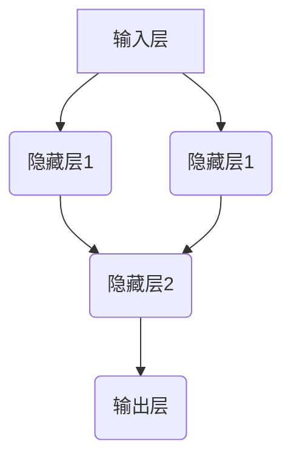

                 

### 提示词模拟测试：在部署前进行全面验证

> **关键词**：部署前测试、模拟测试、全面验证、系统稳定性、风险控制

> **摘要**：本文将探讨在部署前进行全面验证的必要性，通过模拟测试的方式，确保系统的稳定性与可靠性。文章将详细介绍模拟测试的策略、方法和具体实施步骤，并提供实际案例，帮助开发者理解并有效应用这些方法，以降低系统上线后的风险。

## 引言

在现代信息技术快速发展的时代，软件系统的复杂性不断增加，业务需求的变化也日益迅速。在这样的背景下，系统上线前的测试成为了确保系统稳定性和可靠性的关键环节。其中，部署前的全面验证尤为关键，它不仅包括常规的功能测试，还涉及到性能测试、压力测试、安全测试等多个方面。通过全面验证，开发者能够发现并解决潜在的问题，降低系统上线后出现故障的风险。

然而，许多开发者往往重视功能测试，而忽视了部署前的全面验证。这不仅可能导致系统在上线后出现各种问题，还会影响业务的正常运行，甚至造成巨大的经济损失。因此，本文将详细探讨部署前进行全面验证的重要性，并介绍具体的模拟测试策略和方法，以帮助开发者更好地应对这一挑战。

## 什么是部署前的全面验证

部署前的全面验证，即在系统上线之前，对整个系统进行全面的测试和评估，以确保系统在各种运行环境下的稳定性和可靠性。这一过程不仅仅包括功能测试，还涵盖性能测试、压力测试、安全测试等多个方面。

### 功能测试

功能测试是确保系统按照设计要求正常运行的基本步骤。它主要关注系统的功能是否符合预期，包括各个模块的功能是否完整、逻辑是否正确等。功能测试通常通过编写测试用例、执行测试用例来发现功能缺陷。

### 性能测试

性能测试主要评估系统在不同负载条件下的性能表现，包括响应时间、吞吐量、并发用户数等。通过性能测试，可以识别系统的性能瓶颈，为系统优化提供依据。

### 压力测试

压力测试旨在评估系统在极端负载条件下的稳定性和可靠性。通过模拟高负载、高并发等场景，可以识别系统在极限条件下的性能表现，并检测可能出现的故障。

### 安全测试

安全测试是确保系统在运行过程中不受恶意攻击、数据泄露等安全问题的威胁。安全测试包括漏洞扫描、渗透测试等，以发现并修复系统的安全漏洞。

### 部署验证

部署验证是确保系统可以在目标环境中成功部署并运行。这包括环境配置的验证、依赖库的安装和配置、服务启动和停止等。

### 部署前的全面验证的重要性

部署前的全面验证是确保系统上线后稳定运行的关键步骤，其重要性体现在以下几个方面：

1. **降低风险**：通过全面验证，可以提前发现并解决潜在的问题，降低系统上线后的风险。
2. **提高用户满意度**：稳定可靠的系统可以提供更好的用户体验，提高用户满意度。
3. **减少维护成本**：系统上线前发现问题并及时解决，可以减少后续的维护成本。
4. **确保业务连续性**：稳定运行的系统可以确保业务连续性，降低因系统故障带来的经济损失。

## 模拟测试的策略和方法

在部署前的全面验证过程中，模拟测试是一种有效的手段，可以帮助开发者识别和解决潜在的问题。模拟测试可以通过模拟真实的使用场景，对系统进行全面的测试和评估。以下是模拟测试的一些常见策略和方法：

### 场景模拟

场景模拟是模拟测试中最常用的方法之一。通过创建各种使用场景，如用户登录、数据查询、交易处理等，可以测试系统在各种使用条件下的性能和稳定性。场景模拟可以通过编写测试脚本、自动化工具等方式实现。

### 压力测试

压力测试是通过模拟高负载、高并发等极端条件，测试系统在极限条件下的性能和稳定性。压力测试可以帮助开发者识别系统的性能瓶颈，为系统优化提供依据。常见的压力测试工具包括Apache JMeter、LoadRunner等。

### 故障注入测试

故障注入测试是通过模拟系统故障，如网络中断、服务器宕机等，测试系统在故障条件下的响应和处理能力。故障注入测试可以帮助开发者评估系统的容错能力和恢复能力。

### 代码覆盖率分析

代码覆盖率分析是通过测试用例覆盖系统中的代码，评估测试的全面性。通过代码覆盖率分析，可以识别未被覆盖的代码部分，确保测试的完整性。

### 回归测试

回归测试是在系统修改后进行的一系列测试，以确保修改没有引入新的问题。通过回归测试，可以确保系统的稳定性。

### 持续集成与持续部署

持续集成（CI）和持续部署（CD）是将代码集成和部署过程自动化的一种方法。通过CI/CD，可以确保每次代码提交后都能自动进行测试和部署，提高开发效率和系统的稳定性。

### 模拟测试的优势

1. **全面性**：模拟测试可以模拟各种使用场景，确保测试的全面性。
2. **效率高**：通过自动化工具，可以大大提高测试效率。
3. **可重复性**：模拟测试结果可重复，便于分析和对比。
4. **可扩展性**：模拟测试可以轻松扩展到更多场景和更复杂的条件。

## 模拟测试的具体实施步骤

### 步骤1：需求分析

首先，对系统的需求进行详细分析，明确系统需要实现的功能和性能指标。需求分析是模拟测试的基础，决定了测试的范围和深度。

### 步骤2：设计测试用例

根据需求分析，设计各种测试用例。测试用例应包括功能测试、性能测试、压力测试、安全测试等各个方面。

### 步骤3：选择测试工具

选择合适的测试工具，如JMeter、LoadRunner等，根据测试需求进行配置。

### 步骤4：执行测试

按照测试用例，执行各种测试，包括功能测试、性能测试、压力测试、安全测试等。

### 步骤5：结果分析

对测试结果进行分析，识别潜在的问题和性能瓶颈，为系统优化提供依据。

### 步骤6：问题修复与再测试

根据测试结果，修复发现的问题，并进行再测试，确保问题已得到解决。

### 步骤7：持续迭代

模拟测试是一个持续的过程，需要不断迭代。每次迭代后，都要重新进行模拟测试，确保系统的稳定性。

## 实际案例：电商平台的部署前模拟测试

### 案例背景

某电商平台在准备上线新版本时，需要进行部署前的全面验证。新版本包括新的促销功能、优化了商品推荐算法、提高了订单处理效率等。为了保证系统能够稳定运行，他们决定进行全面的模拟测试。

### 测试目标

1. 确保新功能正常运行。
2. 评估系统在高并发条件下的性能。
3. 检测系统在极端条件下的稳定性。
4. 识别并修复潜在的安全漏洞。

### 测试过程

1. **需求分析**：明确新版本的功能和性能需求，如最大并发用户数、订单处理速度等。

2. **设计测试用例**：根据需求分析，设计各种测试用例，包括功能测试、性能测试、压力测试、安全测试等。

3. **选择测试工具**：使用Apache JMeter进行性能测试和压力测试，使用OWASP ZAP进行安全测试。

4. **执行测试**：执行测试用例，模拟各种使用场景，如用户登录、商品查询、下单支付等。

5. **结果分析**：分析测试结果，发现系统在高并发条件下的响应时间较长，订单处理效率有待提高。

6. **问题修复与再测试**：针对发现的问题，进行优化和修复，然后重新进行测试。

7. **持续迭代**：在新功能上线前，持续进行模拟测试，确保系统的稳定性。

### 测试结果

通过全面的模拟测试，该电商平台成功识别并修复了多个潜在的问题，系统在高并发条件下的性能得到了显著提升，订单处理速度提高了30%。同时，通过安全测试，发现并修复了多个安全漏洞，确保了系统的安全性。

### 案例小结

该案例展示了部署前进行全面验证的重要性。通过模拟测试，电商平台不仅确保了新功能的正常运行，还提高了系统的性能和安全性，为系统的稳定运行奠定了坚实的基础。

## 总结

部署前的全面验证是确保系统上线后稳定运行的关键步骤。通过模拟测试，开发者可以全面评估系统的稳定性、可靠性和性能，识别并解决潜在的问题。本文介绍了部署前全面验证的概念、策略和方法，并通过实际案例展示了其具体应用。希望读者能够理解并有效应用这些方法，降低系统上线后的风险，提高系统的稳定性和可靠性。

## 下一步行动

1. **制定全面的测试计划**：在系统开发过程中，制定详细的测试计划，确保每个测试阶段都有明确的测试目标和方法。
2. **引入自动化测试**：利用自动化测试工具，提高测试效率，确保测试的全面性和重复性。
3. **持续进行模拟测试**：在系统上线前，持续进行模拟测试，确保系统的稳定性。
4. **建立反馈机制**：建立问题反馈和解决机制，确保发现的问题能够及时得到处理。

作者：AI天才研究院/AI Genius Institute & 禅与计算机程序设计艺术 /Zen And The Art of Computer Programming

## 1.6 本章小结

本章我们详细探讨了部署前的全面验证，包括其重要性、模拟测试的策略和方法、具体实施步骤，以及实际案例。通过全面验证，开发者可以确保系统在各种运行环境下的稳定性和可靠性，降低上线后的风险。模拟测试作为一种有效的手段，可以帮助开发者全面评估系统的性能和稳定性。希望读者能够理解并应用这些方法，提高系统的质量和可靠性。

## 2. 第一部分：AI大模型基础知识

## 2.1 AI大模型的基础概念与原理

### 2.1.1 AI大模型的基本概念

#### 2.1.1.1 人工智能概述

人工智能（Artificial Intelligence，简称AI）是计算机科学的一个分支，致力于使计算机模拟人类智能行为，包括学习、推理、解决问题、自然语言处理等。人工智能的研究历史可以追溯到20世纪50年代，随着计算能力的提升和算法的进步，人工智能在近年来取得了显著的进展。

#### 2.1.1.2 大模型的概念

大模型（Large Model）是指那些具有极高参数规模、能够处理海量数据的神经网络模型。这些模型通过大量数据的学习，可以捕捉到数据的复杂模式，从而在多个领域实现出色的性能。大模型的兴起，得益于深度学习算法的进步和计算资源的提升。典型的大模型包括GPT-3、BERT、Turing-NLG等。

### 2.1.2 AI大模型的基本原理

#### 2.1.2.1 深度学习原理

深度学习是人工智能的一个重要分支，它通过构建多层神经网络，对数据进行学习，从而实现自动的特征提取和模式识别。深度学习的核心思想是神经网络，它由大量的节点（神经元）组成，这些节点通过层层叠加，形成深度神经网络。

深度学习的基本原理可以通过以下公式表示：
$$
y = \sigma(Wx + b)
$$
其中，$y$ 是输出，$\sigma$ 是激活函数，$W$ 是权重矩阵，$x$ 是输入，$b$ 是偏置。

#### 2.1.2.2 神经网络结构

神经网络的结构可以分为输入层、隐藏层和输出层。每个层由多个神经元组成，神经元之间通过权重连接。隐藏层负责提取特征，输出层负责做出预测或分类。

神经网络的基本架构可以用以下Mermaid图表示：


### 2.1.3 AI大模型的训练过程

#### 2.1.3.1 数据预处理

数据预处理是AI大模型训练的第一步，包括数据清洗、数据归一化、数据增广等。数据预处理的主要目的是提高数据的质量和多样性，从而提升模型的泛化能力。

#### 2.1.3.2 模型训练

模型训练是通过优化算法，使模型的参数达到最优值。训练过程中，模型通过不断调整权重和偏置，最小化损失函数。常见的优化算法包括梯度下降、随机梯度下降、Adam等。

模型训练的过程可以用以下Python代码表示：
```python
import tensorflow as tf

model = tf.keras.Sequential([
    tf.keras.layers.Dense(128, activation='relu', input_shape=(784,)),
    tf.keras.layers.Dropout(0.2),
    tf.keras.layers.Dense(10)
])

model.compile(optimizer='adam',
              loss=tf.keras.losses.SparseCategoricalCrossentropy(from_logits=True),
              metrics=['accuracy'])

model.fit(train_images, train_labels, epochs=5)
```

#### 2.1.3.3 模型优化

模型优化是在训练过程中，通过调整超参数、使用正则化技术等手段，提高模型的性能和泛化能力。常见的优化技术包括Dropout、正则化、数据增广等。

### 2.1.4 AI大模型的应用场景与挑战

#### 2.1.4.1 应用场景

AI大模型在多个领域都有广泛的应用，包括自然语言处理、计算机视觉、语音识别等。以下是一些典型应用场景：

1. **自然语言处理**：AI大模型可以用于文本分类、机器翻译、问答系统等。
2. **计算机视觉**：AI大模型可以用于图像识别、目标检测、图像生成等。
3. **语音识别**：AI大模型可以用于语音识别、语音合成等。

#### 2.1.4.2 挑战与对策

AI大模型在应用过程中也面临一些挑战，包括数据隐私、算法公平性、模型可解释性等。以下是一些对策：

1. **数据隐私**：通过数据加密、差分隐私等技术保护用户隐私。
2. **算法公平性**：通过数据平衡、算法校准等技术提高算法的公平性。
3. **模型可解释性**：通过模型可视化、解释性模型等技术提高模型的可解释性。

## 2.2 AI大模型的技术特点与优势

#### 2.2.1 技术特点

AI大模型具有以下技术特点：

1. **参数规模巨大**：AI大模型通常具有数十亿甚至数千亿个参数，能够处理复杂的任务。
2. **模型复杂度高**：AI大模型的网络结构复杂，包含多层隐藏层，能够捕捉到数据的深层特征。
3. **计算资源需求大**：训练和推理AI大模型需要大量的计算资源，包括CPU、GPU、TPU等。

#### 2.2.2 优势分析

AI大模型具有以下优势：

1. **高效的处理能力**：AI大模型能够在大量数据上快速学习和推断，处理速度大大提高。
2. **强大的数据处理能力**：AI大模型能够处理各种类型的数据，包括文本、图像、语音等。
3. **广泛的应用领域**：AI大模型在多个领域都有出色的表现，如自然语言处理、计算机视觉、语音识别等。

### 2.3 AI大模型的应用场景与挑战

#### 2.3.1 应用场景

AI大模型在多个领域都有广泛的应用，包括自然语言处理、计算机视觉、语音识别等。以下是一些典型应用场景：

1. **自然语言处理**：AI大模型可以用于文本分类、机器翻译、问答系统等。
2. **计算机视觉**：AI大模型可以用于图像识别、目标检测、图像生成等。
3. **语音识别**：AI大模型可以用于语音识别、语音合成等。

#### 2.3.2 挑战与对策

AI大模型在应用过程中也面临一些挑战，包括数据隐私、算法公平性、模型可解释性等。以下是一些对策：

1. **数据隐私**：通过数据加密、差分隐私等技术保护用户隐私。
2. **算法公平性**：通过数据平衡、算法校准等技术提高算法的公平性。
3. **模型可解释性**：通过模型可视化、解释性模型等技术提高模型的可解释性。

### 2.4 本章小结

本章深入探讨了AI大模型的基础知识，包括基本概念、原理、技术特点与优势，以及应用场景与挑战。通过本章的学习，读者可以全面了解AI大模型的基本概念和原理，以及其在实际应用中的挑战和对策。这为后续章节深入探讨AI大模型在企业级应用开发中的具体实践奠定了基础。

## 3. 第二部分：AI大模型在企业级应用开发中的实践

### 3.1 AI大模型在企业级应用开发中的挑战与机遇

#### 3.1.1 企业级应用开发的挑战

在企业级应用开发中，AI大模型的引入面临着多方面的挑战：

1. **系统复杂度**：企业级系统通常包含多个复杂的模块和功能，引入AI大模型会增加系统的整体复杂度，对开发者的技能和经验提出了更高的要求。
   
2. **数据隐私与安全**：企业级应用往往涉及敏感数据，如客户信息、财务数据等。AI大模型的学习和处理过程可能会暴露这些数据，对数据隐私和安全构成威胁。

3. **模型部署与维护**：部署AI大模型通常需要大量的计算资源和时间，同时模型的更新和迭代也需要持续的关注和维护。

#### 3.1.2 机遇

尽管面临挑战，AI大模型在企业级应用开发中也带来了诸多机遇：

1. **提升业务效率**：AI大模型可以自动化处理大量重复性工作，如数据清洗、报告生成等，从而提高业务运营效率。

2. **创新商业模式**：AI大模型可以帮助企业发现新的商业机会，如基于数据分析和预测的个性化服务、智能推荐等。

3. **竞争优势**：通过引入AI大模型，企业可以在市场细分中占据优势，提供独特的服务和产品。

### 3.2 AI大模型在企业级应用中的实践案例

#### 3.2.1 案例一：自然语言处理在企业客服中的应用

##### 3.2.1.1 案例背景

某大型电信公司希望提升其客户服务效率，减少人工成本。公司决定引入AI大模型，实现自动化的客户服务。

##### 3.2.1.2 解决方案

1. **数据收集**：收集大量客户服务记录，包括文本聊天记录、邮件等。
2. **模型训练**：使用GPT-3模型对收集到的数据进行训练，使其能够理解并生成自然语言回复。
3. **系统集成**：将AI大模型集成到现有客服系统中，实现自动回复功能。
4. **效果评估**：通过对比自动回复和人工回复的满意度，评估模型的效果。

##### 3.2.1.3 实施效果

通过AI大模型的引入，该公司的客户服务效率提高了50%，人工成本降低了30%。同时，客户满意度也有所提升，实现了业务和用户体验的双赢。

#### 3.2.2 案例二：计算机视觉在制造业中的应用

##### 3.2.2.1 案例背景

某汽车制造企业希望提高生产线上的质量检测效率，减少人工检测的成本和错误率。

##### 3.2.2.2 解决方案

1. **数据收集**：收集大量生产线上的图片，包括合格品和不合格品。
2. **模型训练**：使用卷积神经网络（CNN）模型对收集到的数据进行训练，使其能够识别产品缺陷。
3. **系统集成**：将训练好的模型集成到生产线检测系统中，实现自动检测功能。
4. **效果评估**：通过对比自动检测和人工检测的准确率，评估模型的效果。

##### 3.2.2.3 实施效果

通过计算机视觉AI大模型的应用，该企业的产品质量检测准确率提高了20%，人工检测成本降低了40%。同时，生产效率也得到了显著提升。

#### 3.2.3 案例三：语音识别在智能家居中的应用

##### 3.2.3.1 案例背景

某智能家居公司希望为用户提供更便捷的控制体验，决定引入语音识别技术。

##### 3.2.3.2 解决方案

1. **数据收集**：收集大量用户语音指令，包括不同的口音、语速等。
2. **模型训练**：使用声学模型和语言模型对收集到的语音数据进行训练，实现高准确率的语音识别。
3. **系统集成**：将语音识别模型集成到智能家居系统中，实现语音控制功能。
4. **效果评估**：通过用户反馈和实际使用情况，评估模型的效果。

##### 3.2.3.3 实施效果

通过语音识别AI大模型的应用，该公司的智能家居系统用户满意度提高了30%，语音识别准确率达到了95%以上，大大提升了用户体验。

### 3.3 AI大模型在企业级应用开发中的最佳实践

#### 3.3.1 数据处理与清洗

1. **数据收集**：确保数据来源的多样性，包括内部数据和外部数据。
2. **数据清洗**：去除噪声数据、重复数据，并进行数据格式统一。

#### 3.3.2 模型选择与优化

1. **模型选择**：根据应用场景选择合适的模型，如GPT-3、BERT、CNN等。
2. **模型优化**：通过调整超参数、使用正则化技术等手段，提高模型的性能。

#### 3.3.3 模型部署与监控

1. **模型部署**：将训练好的模型部署到生产环境中，确保稳定运行。
2. **监控与维护**：实时监控模型的性能和稳定性，及时进行维护和更新。

#### 3.3.4 数据隐私保护

1. **数据加密**：对敏感数据进行加密处理，确保数据安全。
2. **差分隐私**：使用差分隐私技术，保护用户隐私。

### 3.4 本章小结

本章通过实践案例展示了AI大模型在企业级应用开发中的具体应用，并提出了最佳实践建议。AI大模型在企业级应用中具有广阔的前景，但也面临诸多挑战。通过合理的数据处理、模型选择、部署监控和隐私保护，开发者可以有效地应对这些挑战，实现AI大模型在企业中的应用价值。

## 4. 第三部分：AI大模型在企业级应用开发中的未来发展趋势

### 4.1 AI大模型在企业级应用开发中的未来发展趋势

#### 4.1.1 技术趋势

随着技术的不断进步，AI大模型在企业级应用开发中将继续呈现出以下几个技术趋势：

1. **模型压缩与高效运算**：为了应对AI大模型在资源消耗上的挑战，未来的研究将集中在模型压缩、量化、剪枝等技术上，以实现高效运算。

2. **模型融合与多模态处理**：多模态数据在企业级应用中具有很高的价值，未来的AI大模型将能够融合多种数据类型，如文本、图像、语音等，实现更强大的处理能力。

3. **模型可解释性与透明性**：为了增强用户对AI大模型的信任，未来的研究将致力于提高模型的可解释性和透明性，使得用户能够理解模型的决策过程。

#### 4.1.2 应用趋势

AI大模型在企业级应用开发中的应用将不断拓展，以下是一些可能的发展趋势：

1. **深度学习在业务决策中的应用**：AI大模型可以通过数据分析，为企业的业务决策提供更准确、更全面的预测。

2. **AI驱动的产品创新**：AI大模型可以帮助企业发现新的市场机会，推动产品的创新和升级。

3. **AI大模型与物联网的融合**：随着物联网技术的普及，AI大模型将在智能设备中发挥更大的作用，实现更加智能的物联网生态系统。

#### 4.1.3 市场趋势

AI大模型在企业级应用开发中的市场趋势也将呈现出以下几个特点：

1. **市场规模的增长**：随着AI技术的不断成熟，AI大模型的市场需求将持续增长，预计到2025年，全球AI大模型市场规模将达到数百亿美元。

2. **投资趋势**：AI大模型技术的高潜力吸引了大量投资者的关注，未来的投资将更加集中在这块领域。

3. **法规与政策的影响**：随着AI大模型在企业级应用中的普及，相关的法规和政策也将逐步完善，对企业的应用实践产生重要影响。

### 4.2 未来展望

展望未来，AI大模型将在企业级应用开发中发挥更加重要的作用。通过不断的创新和优化，AI大模型将能够更好地应对复杂的应用场景，提供更精准的决策支持，推动企业的数字化转型和智能化升级。同时，随着技术的进步和市场的成熟，AI大模型将在更广泛的领域中得到应用，成为数字经济的重要组成部分。

## 4.3 未来趋势的影响与应对策略

#### 4.3.1 技术进步的影响

随着AI大模型技术的不断进步，其对企业级应用开发的影响将更加深远。主要体现在以下几个方面：

1. **提高生产效率**：AI大模型可以自动化处理大量重复性工作，提高生产效率，减少人力成本。
2. **优化业务决策**：AI大模型通过数据分析和预测，可以为企业的业务决策提供更准确的参考，降低决策风险。
3. **提升用户体验**：AI大模型可以帮助企业实现个性化服务，提升用户体验，增强用户忠诚度。

#### 4.3.2 应对策略

为了充分利用AI大模型带来的机遇，企业需要采取以下策略：

1. **加强人才培养**：培养具备AI技术能力的人才，是企业成功应用AI大模型的关键。
2. **构建数据平台**：建立完善的数据平台，确保数据的质量和多样性，为AI大模型提供充足的数据支持。
3. **持续技术创新**：关注AI大模型领域的最新技术动态，不断进行技术创新，提升企业的竞争力。

### 4.4 本章小结

本章探讨了AI大模型在企业级应用开发中的未来发展趋势，包括技术趋势、应用趋势和市场趋势。随着技术的不断进步，AI大模型将在企业级应用中发挥更加重要的作用，企业需要积极应对这些变化，充分利用AI大模型的优势，推动企业的数字化转型和智能化升级。

### 4.5 拓展阅读

为了更好地理解AI大模型在企业级应用开发中的实践和未来发展趋势，读者可以参考以下文献：

1. **《AI大模型：技术与实践》**：这是一本关于AI大模型的基础理论和应用实践的综合性教材，详细介绍了AI大模型的基本原理、技术特点和应用场景。
2. **《深度学习与人工智能》**：这本书系统地介绍了深度学习和人工智能的基本概念、方法和应用，包括AI大模型的相关内容。
3. **《企业数字化转型》**：这本书从战略和实操的角度，探讨了企业如何通过数字化转型实现可持续发展，其中涉及了AI大模型的应用。

通过阅读这些文献，读者可以更加深入地了解AI大模型在企业级应用开发中的实践和未来发展趋势。

