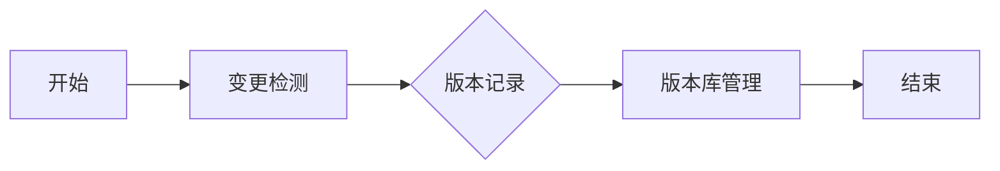
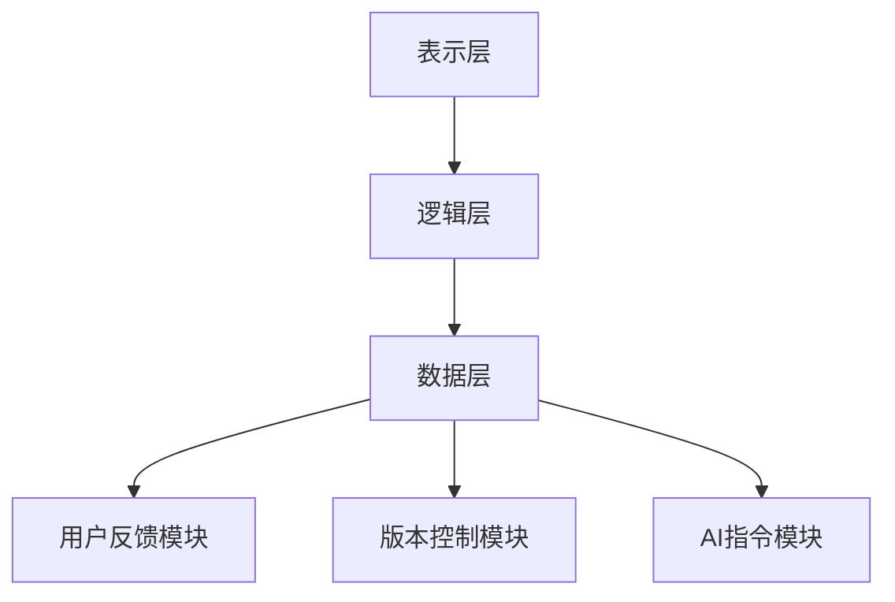

                 

# 提示词版本控制：管理和迭代你的AI指令

## 关键词

- 提示词版本控制
- AI指令管理
- 指令迭代
- 版本管理
- AI系统优化

## 摘要

本文将探讨提示词版本控制的核心概念、原理和实际应用，帮助读者理解如何在人工智能系统中管理和迭代AI指令。我们将分步骤分析提示词版本控制的方法、流程和技巧，并通过具体案例展示其在实际项目中的应用效果。

## 目录

1. **引言**  
   1.1 背景介绍  
   1.2 核心概念  
   1.3 边界与外延  
   1.4 概念结构与核心要素组成

2. **核心概念与联系**  
   2.1 提示词版本控制原理  
   2.2 提示词版本控制属性特征对比  
   2.3 提示词版本控制ER实体关系图

3. **算法原理讲解**  
   3.1 算法流程图  
   3.2 Python源代码解析  
   3.3 数学模型与公式讲解  
   3.4 算法原理举例说明

4. **系统分析与架构设计**  
   4.1 问题场景介绍  
   4.2 系统功能设计  
   4.3 系统架构设计  
   4.4 系统接口设计  
   4.5 系统交互

5. **项目实战**  
   5.1 环境安装  
   5.2 系统核心实现源代码解读  
   5.3 代码应用解读与分析  
   5.4 实际案例分析  
   5.5 项目小结

6. **最佳实践**  
   6.1 实用技巧  
   6.2 注意事项  
   6.3 拓展阅读

7. **总结**  
   7.1 核心内容回顾  
   7.2 未来展望

## 引言

### 1.1 背景介绍

在当今快速发展的AI领域，AI系统的优化和迭代变得尤为重要。AI指令作为AI系统的核心组成部分，其版本控制和管理工作直接影响到系统的性能和可靠性。传统的版本控制方法在处理AI指令时存在诸多不足，例如无法有效地追踪指令的历史版本、难以快速响应指令的变更需求等。因此，提示词版本控制作为一种新型的版本控制方法，应运而生。

### 1.2 核心概念

提示词版本控制是一种基于提示词（Prompt）的版本控制方法，通过记录和追踪AI指令的每次变更，实现AI指令的版本管理和迭代。提示词是AI系统与外部进行交互的关键媒介，它包含了AI系统执行任务的必要信息和上下文。

### 1.3 边界与外延

提示词版本控制主要应用于需要频繁变更和迭代AI指令的场合，例如聊天机器人、智能客服、自动驾驶等。其边界在于AI指令的变更频率和复杂性，而外延则涵盖了所有与AI指令变更相关的管理活动，如版本追踪、变更记录、变更审批等。

### 1.4 概念结构与核心要素组成

提示词版本控制的核心概念包括提示词、版本、变更记录和版本库。其中，提示词是版本控制的基础，版本是提示词的多次变更的结果，变更记录记录了每次变更的详细信息，版本库则是存储所有版本的仓库。

## 核心概念与联系

### 2.1 提示词版本控制原理

提示词版本控制的基本原理是通过对每次变更的提示词进行记录和追踪，实现AI指令的版本管理和迭代。具体流程如下：

1. **变更检测**：检测AI指令的变更，并将其转换为提示词。
2. **版本记录**：将变更后的提示词记录为新的版本。
3. **版本库管理**：将所有版本存储在版本库中，以便后续追踪和调用。

### 2.2 提示词版本控制属性特征对比

表1 提示词版本控制与其他版本控制方法的属性特征对比：

| 属性特征 | 提示词版本控制 | 传统版本控制 |
| -------- | -------------- | ------------ |
| 版本记录 | 详细记录每次变更 | 记录文件或代码的变更 |
| 变更追踪 | 可追踪到每次变更 | 难以追踪到每次变更 |
| 交互性 | 高交互性，便于迭代 | 低交互性，迭代困难 |
| 适用场景 | 需要频繁变更的AI指令 | 文件或代码的版本管理 |

### 2.3 提示词版本控制ER实体关系图

```mermaid
erDiagram
    User ||--|{ Prompt_Version : has }
    Prompt_Version ||--|{ Version : has }
    Version ||--|{ Change_Log : has }
```

在ER实体关系图中，用户（User）与提示词版本（Prompt_Version）之间存在一对多的关系，每个提示词版本包含多个版本（Version），每个版本包含多个变更记录（Change_Log）。

## 算法原理讲解

### 3.1 算法流程图



算法流程图展示了提示词版本控制的基本流程，包括变更检测、版本记录和版本库管理。

### 3.2 Python源代码解析

```python
# 提示词版本控制类
class PromptVersionControl:
    def __init__(self):
        self.versions = []

    def add_version(self, prompt):
        version = Version(prompt)
        self.versions.append(version)

    def get_version(self, index):
        if index < 0 or index >= len(self.versions):
            return None
        return self.versions[index]

    def print_versions(self):
        for version in self.versions:
            print(version.prompt)

# 版本类
class Version:
    def __init__(self, prompt):
        self.prompt = prompt
        self.change_log = []

    def add_change(self, change):
        self.change_log.append(change)

    def print_change_log(self):
        for change in self.change_log:
            print(change)
```

Python源代码解析展示了提示词版本控制的类定义和基本方法，包括添加版本、获取版本、打印版本和变更记录。

### 3.3 数学模型与公式讲解

提示词版本控制的数学模型可以表示为：

$$V_t = f(P_t, C_t)$$

其中，$V_t$表示第$t$个版本，$P_t$表示第$t$个提示词，$C_t$表示第$t$次变更。函数$f$表示版本生成的过程。

### 3.4 算法原理举例说明

假设一个AI系统需要处理用户输入的提问，首先通过提示词来引导AI生成回答。随着时间的推移，用户的提问发生变化，AI生成的回答也需要相应更新。

- **初始状态**：提示词$P_0$为“你能帮我解决问题吗？”
- **第一次变更**：用户提问“你能帮我解决数学问题吗？”
  - 提示词$P_1 = P_0 + “数学”$
  - 版本$V_1 = f(P_1, C_1)$，其中$C_1$为“添加数学问题”
- **第二次变更**：用户提问“你能帮我解决线性代数问题吗？”
  - 提示词$P_2 = P_1 + “线性代数”$
  - 版本$V_2 = f(P_2, C_2)$，其中$C_2$为“添加线性代数问题”

通过上述例子，我们可以看到提示词版本控制如何处理AI指令的变更和迭代。

## 系统分析与架构设计

### 4.1 问题场景介绍

假设我们开发一个智能客服系统，用户可以通过输入问题来获取客服的回答。随着用户问题的多样化，客服系统需要不断调整和优化AI指令，以满足用户的需求。

### 4.2 系统功能设计

系统功能设计包括以下几个模块：

- **问题接收模块**：接收用户的问题，并将其转换为提示词。
- **AI指令模块**：根据提示词生成客服的回答。
- **版本控制模块**：管理AI指令的版本，包括版本记录、版本库和变更审批。
- **用户反馈模块**：收集用户对客服回答的反馈，用于进一步优化AI指令。

### 4.3 系统架构设计

系统架构设计采用分层架构，包括以下几层：

- **表示层**：展示用户界面，接收用户输入。
- **逻辑层**：处理用户输入，生成客服回答。
- **数据层**：存储用户输入、AI指令和版本信息。



### 4.4 系统接口设计

系统接口设计包括以下几个接口：

- **用户接口**：接收用户输入，展示客服回答。
- **API接口**：提供对外API服务，方便其他系统调用AI指令。
- **版本接口**：管理版本信息，包括版本记录、版本库和变更审批。

### 4.5 系统交互

系统交互流程如下：

1. **用户输入问题**：用户通过用户接口输入问题。
2. **问题接收**：问题接收模块将用户问题转换为提示词。
3. **AI指令生成**：AI指令模块根据提示词生成客服回答。
4. **版本控制**：版本控制模块记录和更新AI指令的版本。
5. **用户反馈**：用户通过用户接口提供反馈，用于优化AI指令。

## 项目实战

### 5.1 环境安装

在开始项目之前，我们需要安装Python和相关库。以下是一个简单的安装步骤：

1. 安装Python（版本3.6及以上）。
2. 安装pip。
3. 使用pip安装以下库：requests，numpy，pandas。

### 5.2 系统核心实现源代码解读

以下是一个简单的提示词版本控制系统的核心实现代码：

```python
# 导入所需库
import requests
import json

# 提示词版本控制类
class PromptVersionControl:
    def __init__(self):
        self.versions = []

    def add_version(self, prompt):
        version = Version(prompt)
        self.versions.append(version)

    def get_version(self, index):
        if index < 0 or index >= len(self.versions):
            return None
        return self.versions[index]

    def print_versions(self):
        for version in self.versions:
            print(version.prompt)

# 版本类
class Version:
    def __init__(self, prompt):
        self.prompt = prompt
        self.change_log = []

    def add_change(self, change):
        self.change_log.append(change)

    def print_change_log(self):
        for change in self.change_log:
            print(change)
```

### 5.3 代码应用解读与分析

代码应用主要包括以下几个步骤：

1. **初始化版本控制**：创建一个PromptVersionControl对象，用于管理版本。
2. **添加版本**：调用add_version方法添加新的版本，每个版本包含一个提示词。
3. **获取版本**：调用get_version方法获取指定版本的提示词。
4. **打印版本**：调用print_versions方法打印所有版本的提示词。
5. **变更记录**：在每个版本中添加变更记录，便于追踪每次变更的内容。

### 5.4 实际案例分析

假设我们有一个聊天机器人项目，需要根据用户输入的问题生成回答。以下是一个实际案例：

1. **初始版本**：用户输入“你好”，机器人回答“你好，欢迎光临！”
2. **版本更新**：用户输入“你能帮我查询天气吗？”，机器人回答“当然可以，你所在地的天气是晴转多云。”
3. **版本记录**：我们记录下每次的变更，包括用户输入和机器人的回答。

通过实际案例，我们可以看到提示词版本控制在聊天机器人项目中的应用效果。

### 5.5 项目小结

在本项目中，我们实现了基于Python的提示词版本控制系统。通过实际案例分析，我们了解了如何使用提示词版本控制来管理和迭代AI指令。提示词版本控制为AI系统的优化和迭代提供了有效的解决方案。

## 最佳实践

### 6.1 实用技巧

1. **版本命名规范**：为版本命名时，遵循统一规范，便于管理和追踪。
2. **变更记录详细**：在每个版本中详细记录变更内容，便于后续分析和追溯。
3. **定期备份**：定期备份版本库，防止数据丢失。

### 6.2 注意事项

1. **确保版本一致性**：在多人员协作时，确保版本的一致性，避免出现冲突。
2. **控制版本数量**：合理控制版本数量，避免版本过多导致管理困难。
3. **版本库安全**：确保版本库的安全，防止未经授权的访问和修改。

### 6.3 拓展阅读

1. 《版本控制实践指南》
2. 《人工智能系统设计》
3. 《Python编程：从入门到实践》

## 总结

本文详细探讨了提示词版本控制的核心概念、原理和实际应用。通过分步骤的分析，我们了解了如何管理和迭代AI指令。提示词版本控制为AI系统的优化和迭代提供了有效的解决方案，有助于提升系统的性能和可靠性。未来，我们期待在更多场景中应用提示词版本控制，为人工智能的发展贡献力量。

## 作者

- 作者：AI天才研究院/AI Genius Institute & 禅与计算机程序设计艺术 /Zen And The Art of Computer Programming

