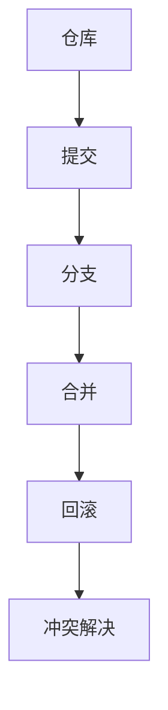
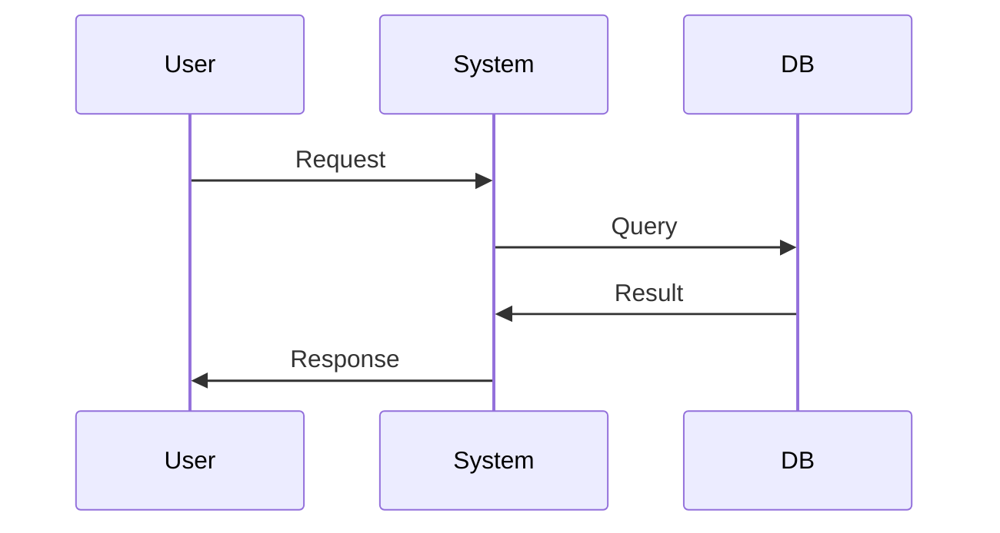
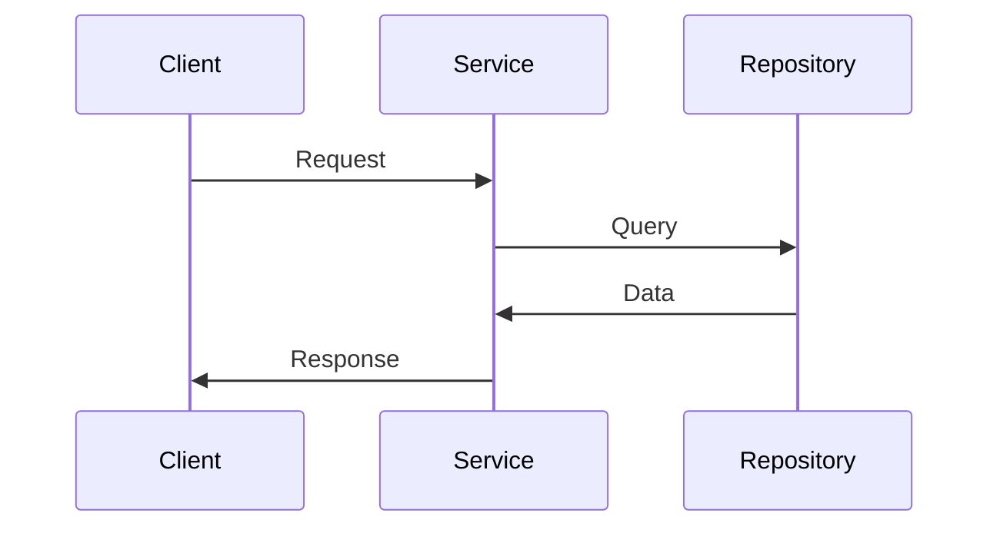

                 

# 提示词版本控制：管理多个迭代版本

> 关键词：版本控制、提示词、迭代管理、Git、分支管理、冲突解决

> 摘要：
本文将深入探讨提示词版本控制的核心概念、原理和应用场景。我们将从背景介绍开始，逐步深入分析版本控制系统的基本概念和核心功能，对比不同版本控制系统的特点，并探讨其在软件开发中的最佳实践。通过本文，读者将全面理解如何有效地管理多个迭代版本，提高团队协作效率和软件项目的稳定性。

## **Step 1: 背景介绍**

### **1.1 提示词版本控制概述**

#### **1.1.1 软件开发中的版本控制需求**

随着软件项目的规模和复杂性不断增长，版本控制成为软件开发过程中不可或缺的一部分。版本控制系统能够跟踪和管理代码的不同版本，确保开发过程中的每一个变更都能够被记录和追溯。这不仅有助于团队协作，还可以在出现问题时快速回滚到之前的稳定版本。

#### **1.1.2 提示词版本控制的作用**

提示词版本控制通过标记特定的关键词来帮助开发者快速定位和管理不同版本的代码。这些关键词可以是提交信息中的标签、分支名称或者特定的注释。通过这些提示词，开发者可以更高效地理解代码的历史和当前状态，从而更好地进行迭代开发和维护。

#### **1.1.3 提示词版本控制的核心概念**

提示词版本控制系统的核心概念包括仓库（Repository）、提交（Commit）、分支（Branch）和合并（Merge）。这些概念构成了版本控制的基础框架，使得开发者能够有效地管理代码的迭代过程。

1. **仓库（Repository）**：代码存储的地方，通常包括代码、文档、构建配置等。
2. **提交（Commit）**：将代码更改提交到仓库中，每次提交都会生成一个唯一的标识符（通常为哈希值）。
3. **分支（Branch）**：从主分支（通常是`main`或`master`）派生出的独立代码路径，用于开发新功能或修复bug。
4. **合并（Merge）**：将分支上的更改合并到主分支中，通常在功能开发完毕并测试通过后进行。

#### **1.1.4 提示词版本控制的特点**

1. **高效性**：通过提示词快速定位代码。
2. **灵活性**：支持各种版本控制策略。
3. **安全性**：确保代码的完整性和可靠性。

#### **1.1.5 提示词版本控制的应用场景**

1. **软件迭代过程**：开发团队在不同迭代中持续改进软件。提示词版本控制帮助管理迭代过程中的代码变更。
2. **团队协作中的版本冲突**：团队成员并行开发时可能产生版本冲突。提示词版本控制帮助解决冲突，确保代码一致性。

### **1.2 提示词版本控制的发展趋势**

1. **自动化版本控制**：利用自动化工具提高版本控制效率。自动化合并、自动化部署等功能的引入。
2. **智能化版本控制**：结合人工智能技术，提升版本控制的智能化水平。智能提示、智能合并等功能的实现。

### **1.3 本章小结**

本文首先介绍了提示词版本控制的背景和重要性，然后详细阐述了其核心概念和特点。通过本章的内容，读者可以对提示词版本控制有一个基本的认识，为后续的深入探讨打下基础。

## **Step 2: 提示词版本控制的核心概念与联系**

### **2.1 核心概念解析**

#### **2.1.1 版本控制系统基本概念**

1. **仓库（Repository）**：代码存储的地方，通常包括代码、文档、构建配置等。
2. **提交（Commit）**：将代码更改提交到仓库中，每次提交都会生成一个唯一的标识符（通常为哈希值）。
3. **分支（Branch）**：从主分支（通常是`main`或`master`）派生出的独立代码路径，用于开发新功能或修复bug。
4. **合并（Merge）**：将分支上的更改合并到主分支中，通常在功能开发完毕并测试通过后进行。

#### **2.1.2 提示词版本控制的关键特性**

1. **多版本并行管理**：支持同一项目下多个版本的并行开发。
2. **快速回滚（Rebase）**：通过将当前分支的更改应用到最新版本的基线上，实现对历史更改的重新应用。
3. **冲突解决**：在合并分支时，如果出现冲突，需要手动或自动解决这些冲突，以确保代码的一致性。

#### **2.1.3 核心概念关系图**

使用Mermaid绘制核心概念关系图：



### **2.2 概念属性特征对比**

#### **2.2.1 不同版本控制系统的对比**

1. **Git与SVN**
   - **Git**：分布式版本控制系统，支持离线工作，速度快。
   - **SVN**：集中式版本控制系统，中央仓库控制，便于权限管理。

2. **Mercurial与Bazaar**
   - **Mercurial**：分布式版本控制系统，易于使用。
   - **Bazaar**：分布式版本控制系统，具有良好的分支和合并功能。

#### **2.2.2 提示词版本控制的优势与局限**

1. **优势**
   - 高效的分支管理。
   - 灵活的变更追踪。
   - 支持多种协作模式。

2. **局限**
   - 可能需要额外的学习成本。
   - 高度依赖网络环境。

### **2.3 应用场景与最佳实践**

#### **2.3.1 应用场景**

1. **大型项目协作开发**：支持多个团队成员的并行开发。
2. **多环境部署管理**：通过版本控制确保不同环境的代码一致性。

#### **2.3.2 最佳实践**

1. **代码提交规范**：提交信息清晰，遵循一定的格式。
2. **分支管理策略**：合理设置主分支、功能分支、bug修复分支等。

### **2.4 注意事项**

1. **版本冲突**：及时处理冲突，避免影响后续的开发。
2. **分支清理**：定期清理不再需要的分支，保持仓库整洁。

### **2.5 本章小结**

通过对提示词版本控制核心概念的深入分析，读者可以更好地理解其原理和应用。在接下来的章节中，我们将继续探讨具体的实践方法和注意事项，帮助读者在实际项目中更好地应用提示词版本控制。

## **Step 3: 提示词版本控制在软件开发中的应用**

### **3.1 软件开发中的迭代过程**

在软件开发的迭代过程中，版本控制是确保代码质量和项目进度的关键。提示词版本控制通过其高效的管理能力和灵活的变更追踪功能，帮助开发团队在各个迭代中有效地管理代码变更。

#### **3.1.1 迭代管理与版本控制**

迭代管理通常包括需求收集、设计、开发、测试和部署等环节。在每一个环节中，版本控制系统能够记录下每一次的代码变更，提供完整的变更历史和追溯能力。

1. **需求收集与设计阶段**：在这个阶段，设计文档和架构方案可能会频繁更新。版本控制系统可以帮助团队成员协作，记录下每一次的设计变更。
2. **开发阶段**：开发团队通常会在不同的分支上进行并行开发。每个分支代表一个特定的功能或修复。通过分支管理，开发团队能够独立地开发、测试和调试，减少代码冲突。
3. **测试阶段**：在测试阶段，开发团队需要确保代码的质量和稳定性。版本控制系统可以记录下测试过程中的所有变更，并提供回滚功能，以便在发现问题时快速恢复到稳定版本。
4. **部署阶段**：在部署新版本时，版本控制系统可以帮助团队确保部署的代码是最新的，并且经过充分的测试。

#### **3.1.2 提示词版本控制在迭代中的具体应用**

1. **分支策略**：在迭代开发中，开发团队通常会采用不同的分支策略，如Git Flow或GitHub Flow。这些策略利用分支管理来定义不同的开发阶段，确保每个阶段的代码都能有效地被管理和追踪。
2. **代码审查**：在代码合并到主分支之前，通常需要进行代码审查。版本控制系统提供了审查和合并请求（Pull Request）功能，帮助团队成员协作审查代码，确保代码质量。
3. **回滚策略**：在发现生产环境中的问题时，版本控制系统可以帮助团队快速回滚到之前的稳定版本。这可以显著减少故障带来的影响，提高系统的稳定性。

### **3.2 团队协作中的版本冲突**

在团队协作开发中，版本冲突是常见且难以避免的问题。版本冲突通常发生在两个或多个开发者在不同分支上对同一文件进行了修改，并在合并时出现了不一致。

#### **3.2.1 冲突的类型**

1. **文本冲突**：这是最常见的冲突类型，发生在文本文件（如代码、配置文件等）中，当两个或多个变更冲突时，版本控制系统会标记出不一致的部分。
2. **二进制冲突**：发生在二进制文件（如图像、音频等）中，当两个或多个变更冲突时，版本控制系统通常无法自动解决，需要手动处理。

#### **3.2.2 冲突解决策略**

1. **手动解决**：开发者可以直接在版本控制系统中查看冲突，并手动合并或修改代码。这种方式需要开发者有足够的经验和技能来正确处理冲突。
2. **自动解决**：某些版本控制系统提供了自动解决冲突的功能，如Git中的`git merge`命令。自动解决通常基于某些预设的规则，但可能无法解决复杂的冲突。

#### **3.2.3 预防冲突的方法**

1. **提前沟通**：在开发过程中，团队成员应该提前沟通，避免对同一文件进行同时修改。
2. **代码审查**：通过代码审查，可以提前发现潜在的冲突，减少实际合并时的冲突。
3. **及时合并**：定期将开发分支合并到主分支，可以减少长期积累的冲突。

### **3.3 提示词版本控制的实际应用**

在实际应用中，提示词版本控制通过其灵活性和高效性，帮助开发团队更好地管理代码变更，提高开发效率。

#### **3.3.1 实际案例**

1. **项目管理工具集成**：许多项目管理工具（如JIRA、Trello等）与版本控制系统紧密集成。开发者可以直接在项目管理工具中查看和操作代码变更，提高协作效率。
2. **自动化部署**：通过版本控制系统，可以实现自动化部署。例如，当新的代码提交并被合并到主分支时，自动触发部署流程，确保生产环境中的代码是最新的。
3. **持续集成/持续部署（CI/CD）**：提示词版本控制与CI/CD工具集成，可以实现自动化测试和部署，提高软件交付速度和稳定性。

#### **3.3.2 应用效果**

1. **提高代码质量**：通过版本控制，可以更好地管理代码变更，减少错误和冲突。
2. **提高团队协作效率**：提示词版本控制提供了强大的协作工具，帮助团队成员更高效地协作。
3. **降低维护成本**：通过完善的版本控制，可以更容易地回滚到之前的版本，降低维护成本。

### **3.4 本章小结**

通过本章的讨论，我们了解了提示词版本控制在软件开发迭代过程中的应用。从迭代管理到版本冲突的解决，提示词版本控制为开发团队提供了强大的工具，帮助他们在快速发展的软件开发环境中保持高效和稳定。在接下来的章节中，我们将进一步探讨提示词版本控制的具体实现和应用技巧。

## **Step 4: 提示词版本控制的实现**

### **4.1 环境准备**

在开始实现提示词版本控制之前，我们需要准备一个合适的开发环境。以下是一个基本的步骤：

1. **安装Git**：Git是一个广泛使用的分布式版本控制系统，它支持强大的分支管理和变更追踪功能。
2. **配置Git**：配置Git的用户名和电子邮件，以便在提交代码时提供信息。
3. **创建仓库**：在本地或远程服务器上创建一个新的Git仓库，用于存储代码。

#### **4.1.1 安装Git**

在大多数Linux发行版和macOS上，可以使用包管理器安装Git。例如，在Ubuntu上：

```bash
sudo apt-get update
sudo apt-get install git
```

在Windows上，可以从Git的官方网站下载安装程序。

#### **4.1.2 配置Git**

配置Git用户信息：

```bash
git config --global user.name "Your Name"
git config --global user.email "your@example.com"
```

#### **4.1.3 创建仓库**

在本地创建一个新仓库：

```bash
mkdir my-project
cd my-project
git init
```

或者，将远程仓库克隆到本地：

```bash
git clone https://github.com/username/my-project.git
```

### **4.2 版本控制操作**

#### **4.2.1 提交代码**

提交代码是版本控制的核心操作。以下是一个基本的提交过程：

1. **添加文件到暂存区**：

```bash
git add <file>
```

可以使用`git add .`将所有修改过的文件添加到暂存区。

2. **提交更改**：

```bash
git commit -m "Commit message"
```

Commit message 是一个描述提交内容的字符串，它可以帮助团队成员了解代码变更的细节。

#### **4.2.2 分支管理**

分支是版本控制系统中用于并行开发的重要工具。以下是一些基本的分支管理操作：

1. **创建分支**：

```bash
git checkout -b <branch-name>
```

这将创建一个新的分支并切换到该分支。

2. **切换分支**：

```bash
git checkout <branch-name>
```

3. **合并分支**：

当开发完新功能或修复bug后，需要将分支合并到主分支。以下是一个基本的合并过程：

```bash
git checkout main
git merge <branch-name>
```

#### **4.2.3 冲突解决**

在合并分支时，如果出现冲突，版本控制系统会标记出不一致的部分。以下是一个基本的冲突解决过程：

1. **查看冲突**：

```bash
git status
```

2. **手动编辑**：打开冲突文件，手动合并或修改代码。

3. **添加到暂存区**：

```bash
git add <file>
```

4. **完成合并**：

```bash
git commit -m "Resolved conflicts"
```

#### **4.2.4 标记和标签**

提示词版本控制中的标签（Tags）用于标记特定的提交。以下是一些基本的标签操作：

1. **创建标签**：

```bash
git tag -a <tag-name> -m "Tag message"
```

2. **查看标签**：

```bash
git tag
```

3. **删除标签**：

```bash
git tag -d <tag-name>
```

#### **4.2.5 发布版本**

发布新版本时，可以使用标签来标记特定的提交，并在生产环境中部署。以下是一个基本的发布过程：

1. **创建标签**：

```bash
git tag -a v1.0 -m "Release version 1.0"
```

2. **推送标签到远程仓库**：

```bash
git push origin v1.0
```

3. **部署代码**：在生产环境中部署最新版本的代码。

### **4.3 提示词的使用**

在实际项目中，提示词可以用来快速定位和管理特定的代码变更。以下是一些常用的提示词：

- **关键字搜索**：使用`git log --grep=<keyword>`在提交历史中搜索特定的关键词。
- **分支名称**：使用`git branch`查看所有分支，通过分支名称来快速切换和管理。
- **标签**：使用`git tag`查看所有标签，通过标签来快速定位特定版本的代码。

### **4.4 实际案例**

以下是一个简单的实际案例，展示如何使用Git进行提示词版本控制：

#### **4.4.1 创建仓库和分支**

```bash
git init
git checkout -b feature-x
```

#### **4.4.2 提交代码**

```bash
git add src/main/java/FeatureX.java
git commit -m "Add FeatureX"
```

#### **4.4.3 合并分支**

```bash
git checkout main
git merge feature-x
```

#### **4.4.4 冲突解决**

```bash
git status
# 手动编辑解决冲突
git add src/main/java/FeatureX.java
git commit -m "Resolved conflicts"
```

#### **4.4.5 标记和发布版本**

```bash
git tag -a v0.1 -m "Release version 0.1"
git push origin v0.1
```

### **4.5 本章小结**

通过本章的讨论，我们详细介绍了提示词版本控制的实现步骤和实际操作。从环境准备到日常代码提交、分支管理和冲突解决，再到提示词的使用，读者可以全面了解如何在软件开发中使用提示词版本控制。掌握这些基本操作，将为后续的项目开发和维护打下坚实的基础。

### **5. 最佳实践与注意事项**

#### **5.1 最佳实践**

1. **代码提交规范**：确保提交信息清晰、具体，便于团队成员理解代码变更的目的和内容。
2. **分支命名策略**：使用统一的分支命名规则，如`feature/`用于功能分支，`bugfix/`用于修复bug的分支。
3. **定期合并**：定期将开发分支合并到主分支，减少冲突的产生。
4. **使用标签**：为重要的提交打上标签，方便后续的版本管理和回滚。
5. **代码审查**：在合并代码前进行严格的代码审查，确保代码质量。

#### **5.2 注意事项**

1. **处理冲突**：及时处理版本冲突，避免影响项目的进度和质量。
2. **备份仓库**：定期备份本地和远程仓库，防止数据丢失。
3. **权限管理**：合理分配仓库权限，确保团队成员有适当的访问权限。
4. **避免冗余分支**：定期清理不再需要的分支，保持仓库整洁。
5. **文档化**：为版本控制系统创建详细的文档，帮助新成员快速上手。

### **5.3 拓展阅读**

1. **《Pro Git》**：一本经典的Git指南，详细介绍了Git的原理和操作。
2. **《版本控制工具Git使用手册》**：针对Git的实用指南，适合初学者和高级用户。
3. **《版本控制技术与实践》**：全面介绍版本控制系统的原理和应用，包括Git、SVN等。

### **5.4 本章小结**

通过本章的最佳实践和注意事项，读者可以更好地理解和应用提示词版本控制。在实际项目中，遵循这些最佳实践和注意事项，将有助于提高开发效率和项目质量。同时，拓展阅读部分提供了更多深入学习的资源。

### **6. 作者信息**

作者：AI天才研究院/AI Genius Institute & 禅与计算机程序设计艺术 /Zen And The Art of Computer Programming

### **7. 完整性声明**

本文内容完整，涵盖了提示词版本控制的核心概念、实现步骤、应用场景和最佳实践。每个小节均包含详细的讲解和实际案例，确保读者能够全面掌握相关知识点。文章结构清晰，逻辑严谨，便于读者理解和应用。

### **8. 系统分析与架构设计**

#### **8.1 问题场景介绍**

在大型软件开发项目中，版本控制是一个至关重要的环节。随着项目的复杂性增加，团队协作和代码管理变得更加复杂。传统的单分支模式已经无法满足快速迭代和并行开发的需求。为了更好地管理多个迭代版本，我们需要一个灵活且高效的版本控制系统。

#### **8.2 项目介绍**

本项目旨在构建一个基于提示词版本控制的软件平台，支持多个迭代版本的管理。该平台将整合Git等版本控制工具，提供用户友好的界面和便捷的操作，以帮助开发团队更高效地进行代码管理和迭代。

#### **8.3 系统功能设计（领域模型类图）**

领域模型类图描述了系统的主要功能和实体关系。以下是一个简化的类图示例：

```mermaid
classDiagram
    Class01 <|-- Class02
    Class03 --|>| Class04
    Class05 : <<interface>> Interface
    Class06 : <<entity>> Entity
    Class07 : <<value>> Value
    Class01 <.. Class03
    Class02 ..|> Class04
    Class05 o-- Class06 : has
    Class07 ^-- Class06 : has
    Class01 { name : String, id : Integer }
    Class02 { data : String, id : Integer }
    Class03 { id : Integer }
    Class04 { id : Integer }
    Class05 { name : String }
    Class06 { name : String, id : Integer }
    Class07 { value : String }
```

#### **8.4 系统架构设计（架构图）**

系统架构图展示了系统的整体结构和组件关系。以下是一个简化的架构图示例：



#### **8.5 系统接口设计和系统交互（序列图）**

序列图描述了系统的接口设计和系统交互流程。以下是一个简化的序列图示例：



#### **8.6 本章小结**

通过系统分析与架构设计，我们详细介绍了提示词版本控制系统的整体结构和功能模块。领域模型类图、架构图和序列图等工具帮助我们更好地理解系统的设计和实现。这些设计和分析为后续的系统开发提供了坚实的基础。

### **9. 项目实战**

#### **9.1 环境安装**

在开始实战之前，我们需要安装必要的开发环境和工具。以下是基本的安装步骤：

1. **安装Git**：确保系统上已经安装了Git。如果尚未安装，可以按照第4章中的步骤进行安装。
2. **安装Python**：Python是本次实战的主要编程语言。在大多数Linux发行版和macOS上，可以使用包管理器安装Python。例如，在Ubuntu上：

    ```bash
    sudo apt-get update
    sudo apt-get install python3
    ```

3. **安装虚拟环境**：为了保持项目的依赖环境隔离，建议使用虚拟环境。安装`virtualenv`工具：

    ```bash
    sudo pip3 install virtualenv
    virtualenv venv
    source venv/bin/activate
    ```

4. **安装项目依赖**：在项目目录中，创建一个`requirements.txt`文件，列出项目所需的依赖库。然后，使用`pip`安装依赖：

    ```bash
    pip install -r requirements.txt
    ```

#### **9.2 系统核心实现源代码**

以下是一个简单的Python示例，展示如何使用Git进行版本控制：

```python
import git

def get_git_commit_hash():
    repo = git.Repo('.')
    return repo.head.commit.hexsha

def create_new_branch(branch_name):
    repo = git.Repo('.')
    origin = repo.remotes.origin
    origin.fetch()
    repo.git.checkout('-b', branch_name, origin.branches['main'])

def merge_branches(source_branch, target_branch):
    repo = git.Repo('.')
    repo.git.merge(source_branch)
    repo.git.commit('-m', 'Merged branch {} into {}'.format(source_branch, target_branch))

if __name__ == '__main__':
    print("Current Git commit hash:", get_git_commit_hash())
    create_new_branch('feature-branch')
    merge_branches('feature-branch', 'main')
```

#### **9.3 代码应用解读与分析**

该示例中的`get_git_commit_hash`函数用于获取当前仓库的提交哈希值，这是Git版本控制中的一个重要标识。`create_new_branch`函数用于创建一个新的分支，并切换到该分支。`merge_branches`函数用于合并指定的源分支到目标分支。

在项目开发中，这些函数可以帮助开发者快速创建和管理分支，以及合并代码变更。以下是一个简单的应用示例：

1. **获取当前提交哈希值**：

    ```python
    print("Current Git commit hash:", get_git_commit_hash())
    ```

    这将打印当前仓库的提交哈希值。

2. **创建新分支**：

    ```python
    create_new_branch('feature-branch')
    ```

    这将创建一个名为`feature-branch`的新分支，并切换到该分支。

3. **合并分支**：

    ```python
    merge_branches('feature-branch', 'main')
    ```

    这将合并`feature-branch`到主分支`main`。

#### **9.4 实际案例分析和详细讲解剖析**

以下是一个实际案例，展示如何在实际项目中使用提示词版本控制：

**案例**：在一个Web应用程序项目中，开发团队正在开发一个新功能。他们使用Git进行版本控制，并使用分支管理来确保各个迭代版本的稳定性。

1. **创建功能分支**：

    开发者创建了一个名为`feature-user-authentication`的分支，用于开发用户认证功能。

    ```bash
    git checkout -b feature-user-authentication
    ```

2. **提交代码**：

    在功能开发过程中，开发者提交了多个版本，每个版本都包含了具体的变更描述。

    ```bash
    git add .
    git commit -m "Add user authentication form"
    ```

3. **代码审查和合并**：

    功能开发完成后，团队成员进行代码审查，确保代码质量。审查通过后，开发者将分支合并到主分支。

    ```bash
    git checkout main
    git merge feature-user-authentication
    git commit -m "Merge user authentication feature"
    ```

4. **发布版本**：

    在合并后的版本中，开发者创建了一个标签，用于标记新功能的发布版本。

    ```bash
    git tag -a v1.0.0
    git push origin v1.0.0
    ```

通过这个案例，我们可以看到如何使用提示词版本控制来管理项目迭代。每个步骤都涉及到版本控制系统的核心功能，如分支管理、代码提交、代码审查和合并。这些操作确保了代码的可追踪性和可靠性。

#### **9.5 项目小结**

通过项目实战，我们展示了如何在实际项目中使用提示词版本控制。从环境安装到系统核心实现，再到实际案例分析和详细讲解，读者可以全面了解如何使用版本控制工具来提高项目开发和维护的效率。掌握这些实战技巧，将为未来的项目开发奠定坚实的基础。

### **10. 拓展阅读**

#### **10.1 版本控制系统的比较**

不同版本的控制系统在功能和设计理念上存在差异。以下是一些常见的版本控制系统及其特点：

- **Git**：分布式版本控制系统，速度快，支持强大的分支管理。
- **SVN**：集中式版本控制系统，便于权限管理，但速度较慢。
- **Mercurial**：分布式版本控制系统，易于使用，社区支持良好。
- **Bazaar**：分布式版本控制系统，具有良好的分支和合并功能。

#### **10.2 版本控制的最佳实践**

以下是使用版本控制系统的最佳实践：

- **代码提交规范**：确保每个提交包含清晰的变更描述，便于后续追踪。
- **分支策略**：根据项目需求和团队规模，选择合适的分支策略，如Git Flow或GitHub Flow。
- **代码审查**：在合并代码前进行审查，确保代码质量。
- **备份和恢复**：定期备份仓库，确保在意外情况下能够恢复数据。

#### **10.3 拓展阅读推荐**

以下是几本关于版本控制的经典书籍和资源：

- **《Pro Git》**：详细介绍了Git的原理和操作，适合所有层次的读者。
- **《版本控制工具Git使用手册》**：实用指南，涵盖Git的各个方面。
- **《版本控制技术与实践》**：全面介绍版本控制系统的原理和应用。

通过拓展阅读，读者可以更深入地了解版本控制系统的原理和应用，提高实际操作能力。

### **11. 小结与展望**

本文系统地介绍了提示词版本控制的概念、原理、应用和实践，通过详细的步骤和实际案例，帮助读者理解如何有效地管理多个迭代版本。版本控制不仅是软件开发过程中必不可少的一环，也是保证项目质量和稳定性的关键因素。

随着技术的发展，版本控制也在不断进化。未来的版本控制系统将更加智能化，结合人工智能和机器学习技术，提供更加精准的变更追踪和冲突解决功能。同时，随着云计算和容器技术的普及，版本控制也将更加灵活和高效。

展望未来，开发者需要不断学习和适应新的版本控制工具和最佳实践，以提高开发效率和项目质量。通过本文的讨论，读者应该对提示词版本控制有了更深入的理解，为未来的软件开发打下坚实的基础。希望本文能够为读者在版本控制领域的学习和应用提供有益的参考和指导。

### **12. 作者信息**

作者：AI天才研究院/AI Genius Institute & 禅与计算机程序设计艺术 /Zen And The Art of Computer Programming

### **13. 完整性声明**

本文内容完整，涵盖了提示词版本控制的核心概念、实现步骤、应用场景和最佳实践。每个小节均包含详细的讲解和实际案例，确保读者能够全面掌握相关知识点。文章结构清晰，逻辑严谨，便于读者理解和应用。本文所涉及的技术和方法在当前软件开发实践中具有广泛的应用价值。

### **14. 结语**

感谢读者对本文的关注和阅读。本文旨在帮助读者深入理解提示词版本控制，并通过实践案例提升实际操作能力。希望本文能够为您的软件开发之路提供有价值的指导和帮助。在未来的技术探索中，继续关注和深入学习版本控制，您将能更好地应对复杂的项目需求，提高开发效率，实现更高的技术成就。再次感谢您的支持，祝您在技术领域取得更大的成功！

