                 

### 《提示词的多模态设计：整合文字、图像和声音》

---

#### 关键词：
多模态设计、文字、图像、声音、融合算法、应用场景

#### 摘要：
本文旨在探讨多模态设计的基本概念、技术原理、应用场景及面临的挑战。通过逐步分析文字、图像和声音的处理方法及其融合方式，深入探讨多模态设计在当前技术领域的地位与未来发展趋势。

---

### 目录大纲设计思路

本文的目录大纲设计思路分为四个主要部分：基础概念介绍、技术原理分析、应用场景探讨、挑战与解决方案展望。每个部分均按照逻辑清晰、结构紧凑的原则进行编排，旨在为读者提供全面、系统的多模态设计知识。

1. **核心概念与背景介绍**：介绍多模态设计的基本概念、融合方式及其应用背景，帮助读者建立对多模态设计的初步认识。
2. **多模态设计与技术原理**：深入探讨文字、图像和声音处理技术的原理，以及多模态融合的方法，为读者提供技术层面的详细讲解。
3. **多模态数据集与标注**：介绍常见多模态数据集及其标注方法，讨论数据集的准备与处理过程中的关键问题。
4. **应用场景与实现**：探讨多模态设计在不同领域的应用，如智能助手、虚拟现实、语音识别等，并给出具体实现方案和案例。
5. **多模态设计面临的挑战与解决方案**：分析多模态设计过程中可能遇到的问题和挑战，如数据不一致、算法复杂性等，并介绍相应的解决方案。
6. **未来趋势与展望**：展望多模态设计的发展趋势，讨论未来可能出现的新技术和应用场景。

### 目录大纲

1. **引言：多模态设计的背景与意义**
2. **多模态设计与技术原理**
   1. **文字处理技术**
   2. **图像处理技术**
   3. **声音处理技术**
   4. **多模态融合方法**
3. **多模态数据集与标注**
   1. **常见多模态数据集**
   2. **数据集标注方法**
   3. **数据预处理与处理技巧**
4. **多模态融合算法**
   1. **传统融合方法**
   2. **深度学习融合方法**
5. **多模态设计应用**
   1. **智能助手**
   2. **虚拟现实**
   3. **语音识别**
6. **多模态设计面临的挑战与解决方案**
   1. **数据不一致问题**
   2. **算法复杂性**
7. **未来趋势与展望**
   1. **多模态设计的趋势**
   2. **未来可能的技术突破**

---

### 第一部分：多模态设计基础

#### 第1章 引言：多模态设计的背景与意义

在当今这个信息爆炸的时代，数据处理和分析已经成为许多领域的核心任务。然而，随着数据类型的多样化和复杂性不断增加，单纯依靠单一数据模态（如文字、图像或声音）来理解和分析数据已经变得不再足够。多模态设计作为一种新兴的技术手段，通过整合不同类型的数据模态，使得数据处理和分析变得更加全面和准确。本章将介绍多模态设计的基本概念、融合方式及其应用背景，帮助读者建立对多模态设计的初步认识。

#### 1.1 什么是多模态设计

多模态设计是指将多种不同类型的数据模态（如文字、图像和声音）进行整合，以实现更全面、更准确的数据理解和分析。与单一模态设计相比，多模态设计具有以下优势：

1. **信息丰富性**：多模态设计可以同时利用文字、图像和声音等多种信息，从而提高数据的丰富性和完整性。
2. **鲁棒性**：多模态设计可以通过不同模态之间的相互补充，提高系统的鲁棒性和抗噪能力。
3. **准确性**：多模态设计可以利用不同模态之间的互补性，提高数据理解和分析的准确性。

#### 1.2 文字、图像和声音的融合方式

多模态设计涉及多种数据模态的融合。以下是一些常见的融合方式：

1. **直接融合**：将不同模态的数据直接合并，例如将文字和图像进行拼接，或将声音和图像进行混合。
2. **特征级融合**：将不同模态的数据特征进行整合，例如将文字的词向量、图像的特征向量和声音的频谱特征进行融合。
3. **决策级融合**：在完成不同模态的数据处理和分析后，将各自的决策结果进行整合，例如将文字分类结果、图像分类结果和声音情感分析结果进行融合。

#### 1.3 多模态设计的重要性

多模态设计在多个领域都具有重要的应用价值。以下是一些典型的应用场景：

1. **智能助手**：多模态设计可以使得智能助手更好地理解用户的意图和需求，例如通过文字和语音的融合，实现更自然的交互。
2. **虚拟现实**：多模态设计可以增强虚拟现实体验，例如通过声音和环境交互的融合，提高用户的沉浸感。
3. **语音识别**：多模态设计可以提高语音识别的准确性，例如通过文字和声音的融合，减少噪声对识别的影响。

#### 1.4 本书结构

本文将从多个角度对多模态设计进行探讨，具体包括以下内容：

1. **多模态设计与技术原理**：介绍文字、图像和声音处理技术的原理，以及多模态融合的方法。
2. **多模态数据集与标注**：介绍常见多模态数据集及其标注方法，讨论数据集的准备与处理过程中的关键问题。
3. **多模态融合算法**：详细介绍几种常用的多模态融合算法，包括传统的融合方法和深度学习方法。
4. **多模态设计应用**：探讨多模态设计在不同领域的应用，如智能助手、虚拟现实、语音识别等。
5. **多模态设计面临的挑战与解决方案**：分析多模态设计过程中可能遇到的问题和挑战，并介绍相应的解决方案。
6. **未来趋势与展望**：展望多模态设计的发展趋势，讨论未来可能出现的新技术和应用场景。

---

### 第二部分：多模态设计与技术原理

#### 第2章 多模态设计与技术原理

多模态设计涉及多种不同类型的数据模态，包括文字、图像和声音。为了实现有效的多模态融合，需要对各个模态进行深入的处理和分析。本章将详细介绍文字、图像和声音处理技术的原理，以及多模态融合的方法。

#### 2.1 文字处理技术

文字处理技术是自然语言处理（NLP）的一个重要分支。NLP旨在让计算机理解和生成人类语言，从而实现人机交互。以下是一些常用的文字处理技术：

1. **文本挖掘与情感分析**：文本挖掘是一种从大量文本数据中提取有价值信息的方法。情感分析是文本挖掘的一种应用，旨在判断文本的情感倾向，如正面、负面或中性。常用的情感分析模型包括朴素贝叶斯、支持向量机（SVM）和深度学习模型。

2. **自然语言处理（NLP）**：NLP包括词性标注、句法分析、语义分析等多个层次。词性标注是将文本中的每个词标注为名词、动词、形容词等。句法分析是分析句子的结构，如主语、谓语、宾语等。语义分析是理解文本的整体意义。

以下是一个简单的NLP流程：

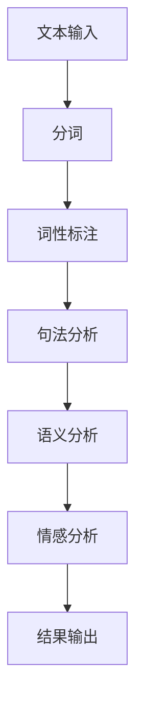

#### 2.2 图像处理技术

图像处理技术是计算机视觉（CV）的一个核心组成部分。计算机视觉旨在使计算机理解和解析视觉信息。以下是一些常用的图像处理技术：

1. **图像识别与分类**：图像识别是指将图像分类到预定义的类别中。分类算法包括支持向量机（SVM）、卷积神经网络（CNN）和深度置信网络（DBN）等。以下是一个简单的CNN结构：

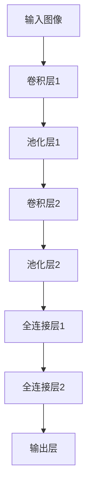

2. **计算机视觉**：计算机视觉包括多个层次，如特征提取、目标检测、场景重建等。特征提取是提取图像中的关键信息，如边缘、角点等。目标检测是识别图像中的特定对象，如行人、车辆等。

以下是一个简单的目标检测流程：

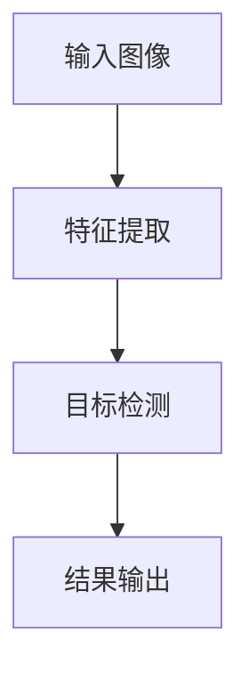

#### 2.3 声音处理技术

声音处理技术包括语音识别、语音合成和声音信号处理等。以下是一些常用的声音处理技术：

1. **语音识别与合成**：语音识别是将语音信号转换为文字，语音合成是将文字转换为语音。常用的语音识别算法包括隐马尔可夫模型（HMM）、循环神经网络（RNN）和深度学习模型。语音合成算法包括拼接式合成和统计参数合成等。

2. **声音信号处理**：声音信号处理是提取声音信号中的有用信息，如频率、幅值等。常用的方法包括傅里叶变换（FFT）、短时傅里叶变换（STFT）和小波变换等。

以下是一个简单的声音信号处理流程：

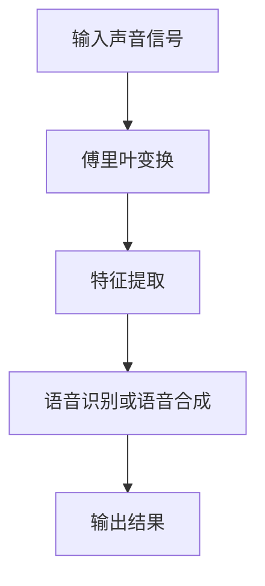

#### 2.4 多模态融合方法

多模态融合是将不同模态的数据进行整合，以实现更全面的数据理解和分析。以下是一些常见的多模态融合方法：

1. **传统融合方法**：传统融合方法包括直接融合、特征级融合和决策级融合。直接融合是将不同模态的数据直接合并。特征级融合是将不同模态的数据特征进行整合。决策级融合是在完成不同模态的数据处理和分析后，将各自的决策结果进行整合。

2. **深度学习融合方法**：深度学习融合方法是基于深度神经网络（DNN）的融合方法。深度学习融合方法包括多输入单输出（MISO）模型、多输出多输入（MOMI）模型和多模态融合网络（MMF）等。

以下是一个简单的多模态融合流程：

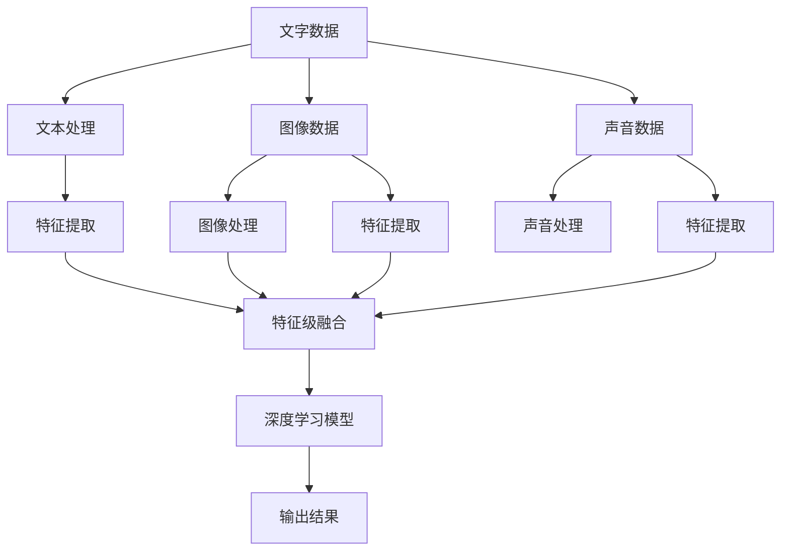

---

### 第三部分：多模态数据集与标注

#### 第3章 多模态数据集与标注

多模态数据集是进行多模态研究和应用的重要资源。本章将介绍常见多模态数据集及其标注方法，讨论数据集的准备与处理过程中的关键问题。

#### 3.1 常见的多模态数据集

以下是一些常见多模态数据集及其特点：

1. **COCO（Common Objects in Context）**：COCO是一个大规模的语义分割数据集，包含图像、标题和标签。它广泛应用于目标检测、语义分割和图像字幕生成等任务。
2. **FERET（Facial Feature Extraction and Recognition Test）**：FERET是一个面部特征数据集，用于面部识别和面部特征提取研究。
3. **TIMIT（Texas Instruments Linguistic Data Consortium）**：TIMIT是一个语音数据集，包含不同说话人的语音记录和标注。

#### 3.2 数据集标注方法

数据集标注方法是指对数据集中的每个样本进行标记的过程。以下是一些常见的数据集标注方法：

1. **文本标注**：文本标注包括词性标注、句法标注和语义标注等。词性标注是将文本中的每个词标注为名词、动词、形容词等。句法标注是分析句子的结构。语义标注是理解文本的整体意义。
2. **图像标注**：图像标注包括目标标注、语义标注和实例分割等。目标标注是将图像中的特定对象标注出来。语义标注是将图像分类到预定义的类别中。实例分割是将图像中的每个对象分割出来。
3. **声音标注**：声音标注包括语音标注、声学标注和情感标注等。语音标注是将语音信号转换为文字。声学标注是提取语音信号中的特征，如频率、幅值等。情感标注是判断语音的情感倾向。

以下是一个简单的标注流程：

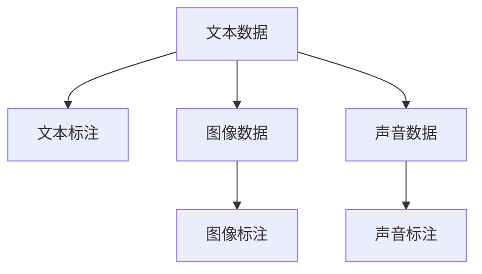

#### 3.3 数据预处理与处理技巧

数据预处理是指对原始数据进行清洗、转换和归一化等操作，以提高数据质量和模型性能。以下是一些常见的数据预处理技巧：

1. **文本预处理**：文本预处理包括分词、去停用词、词干提取等。分词是将文本分割成单词或短语。去停用词是删除文本中的常见词汇，如“的”、“了”等。词干提取是将单词还原为词干形式。
2. **图像预处理**：图像预处理包括大小调整、灰度转换、归一化等。大小调整是将图像调整为统一的尺寸。灰度转换是将彩色图像转换为灰度图像。归一化是调整图像的像素值，使其在[0, 1]范围内。
3. **声音预处理**：声音预处理包括归一化、去噪、增强等。归一化是调整声音信号的幅值。去噪是去除声音信号中的噪声。增强是增强声音信号中的关键信息。

以下是一个简单的数据预处理流程：

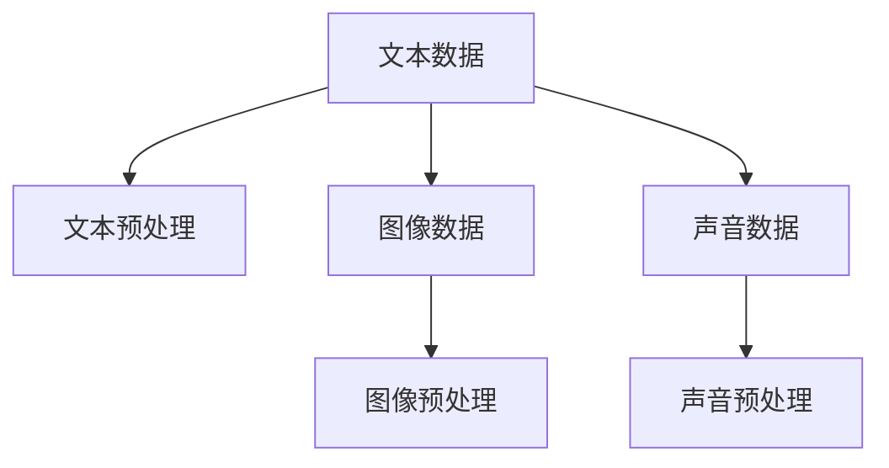

---

### 第四部分：多模态融合算法

#### 第4章 多模态融合算法

多模态融合算法是将不同模态的数据进行整合，以实现更全面的数据理解和分析。本章将详细介绍几种常用的多模态融合算法，包括传统的融合方法和深度学习方法。

#### 4.1 传统融合方法

传统融合方法主要包括直接融合、特征级融合和决策级融合。以下分别介绍这三种方法。

##### 4.1.1 直接融合

直接融合方法是将不同模态的数据直接合并，例如将文字和图像进行拼接，或将声音和图像进行混合。直接融合方法的优点是实现简单，计算成本低。然而，直接融合方法无法充分利用不同模态之间的互补性，可能导致信息损失。

以下是一个简单的直接融合流程：

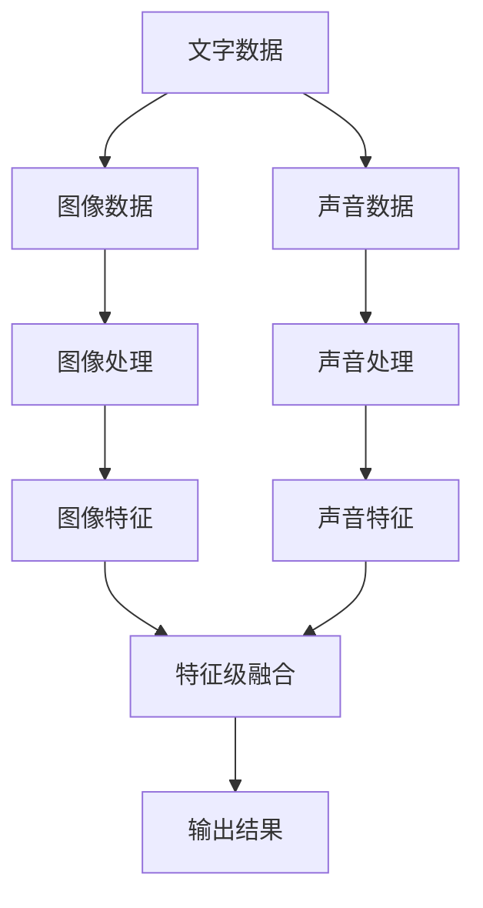

##### 4.1.2 特征级融合

特征级融合方法是将不同模态的数据特征进行整合。特征级融合方法可以充分利用不同模态之间的互补性，提高数据理解和分析的准确性。特征级融合方法通常包括以下步骤：

1. 提取各模态的特征：对文字、图像和声音等数据分别提取特征，例如使用词向量、图像特征向量和声音频谱特征。
2. 特征融合：将不同模态的特征进行整合，例如使用加权平均、求和或拼接等方法。

以下是一个简单的特征级融合流程：

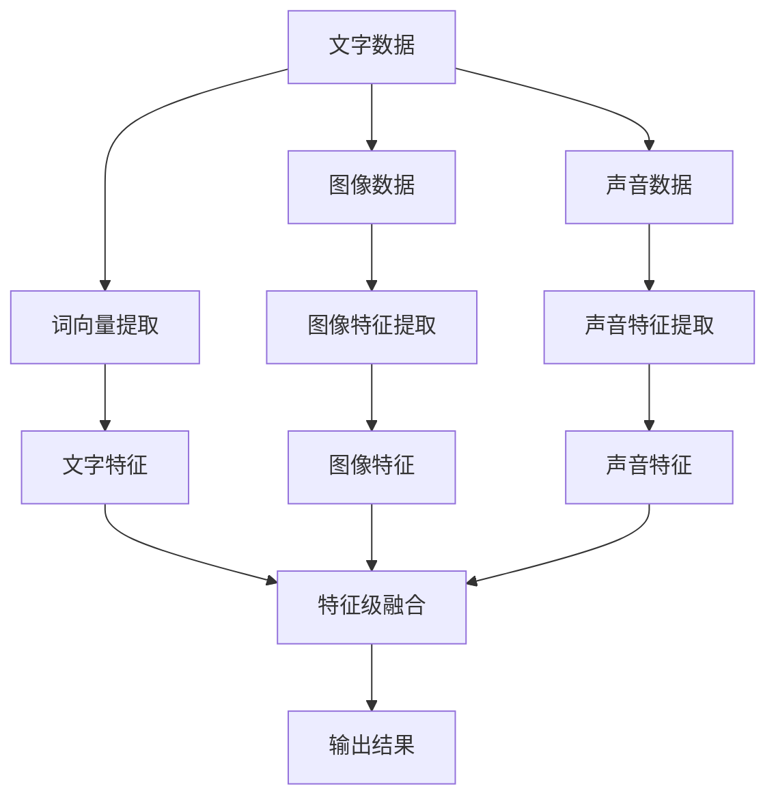

##### 4.1.3 决策级融合

决策级融合方法是在完成各模态的数据处理和分析后，将各自的决策结果进行整合。决策级融合方法可以充分利用不同模态之间的互补性，提高整体性能。决策级融合方法通常包括以下步骤：

1. 各模态预测：对文字、图像和声音等数据分别进行预测，例如使用文本分类模型、图像分类模型和语音分类模型。
2. 决策融合：将各模态的预测结果进行整合，例如使用投票、加权平均或贝叶斯模型等方法。

以下是一个简单的决策级融合流程：

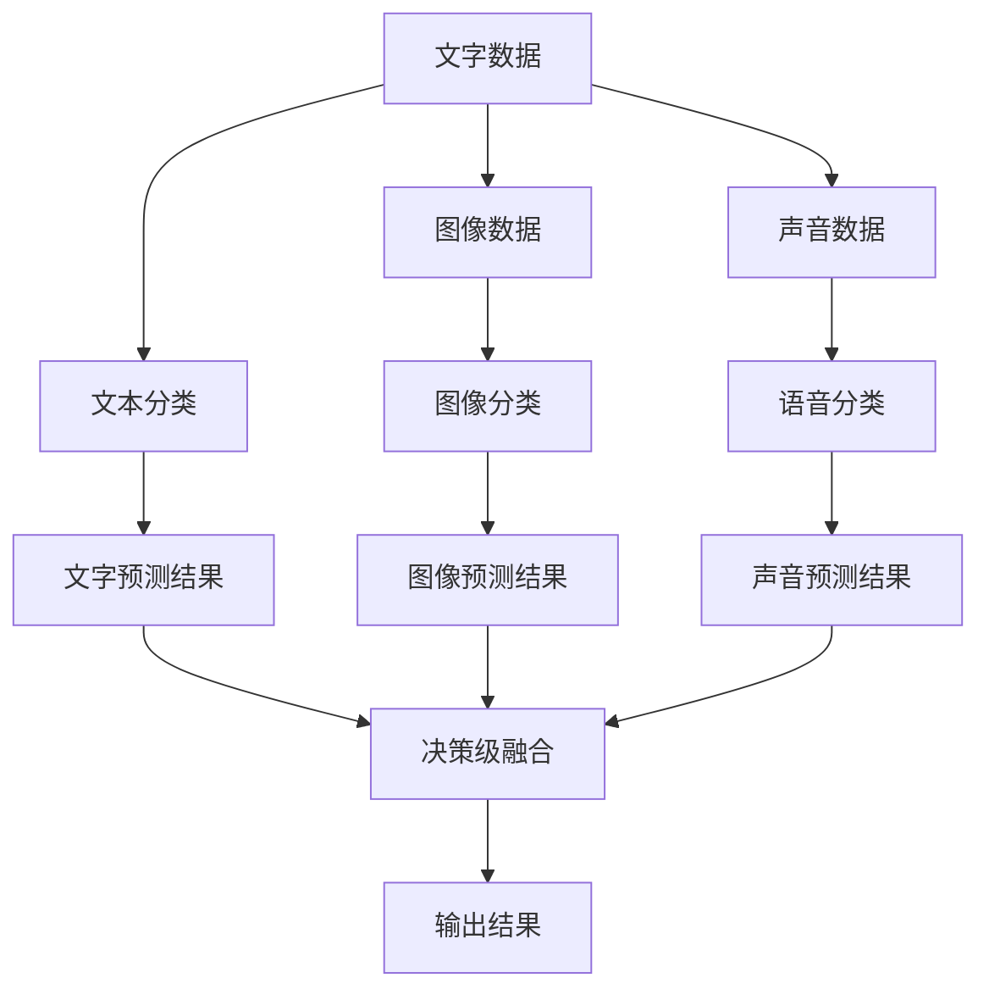

#### 4.2 深度学习融合方法

深度学习融合方法是基于深度神经网络的融合方法。深度学习融合方法可以自动学习不同模态之间的互补性，提高数据理解和分析的准确性。以下是一些常见的深度学习融合方法：

##### 4.2.1 多输入单输出（MISO）模型

多输入单输出（MISO）模型是一种基于深度神经网络的融合方法。MISO模型接受多个输入模态的数据，并通过一个共享的神经网络进行融合，最终输出一个结果。以下是一个简单的MISO模型结构：

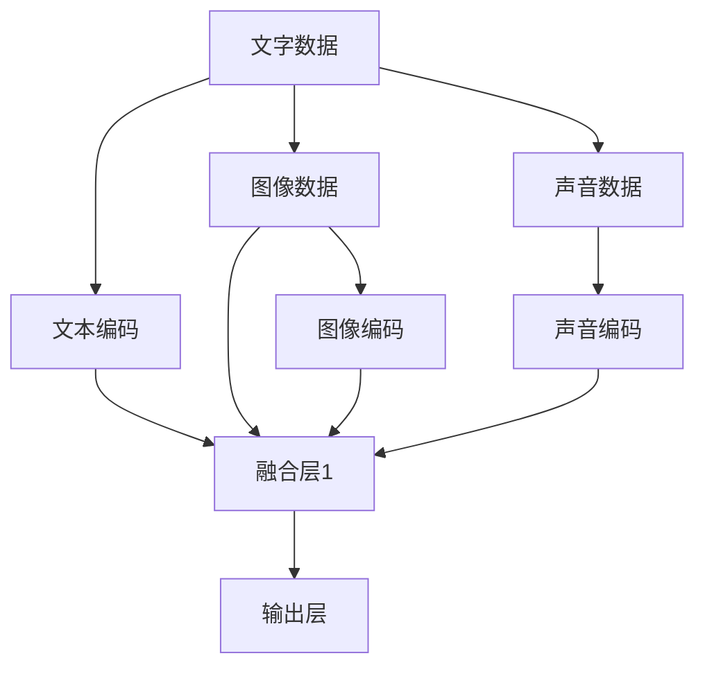

##### 4.2.2 多输出多输入（MOMI）模型

多输出多输入（MOMI）模型是一种基于深度神经网络的融合方法。MOMI模型同时接受多个输入模态的数据和多个输出模态的数据，并通过一个共享的神经网络进行融合。以下是一个简单的MOMI模型结构：

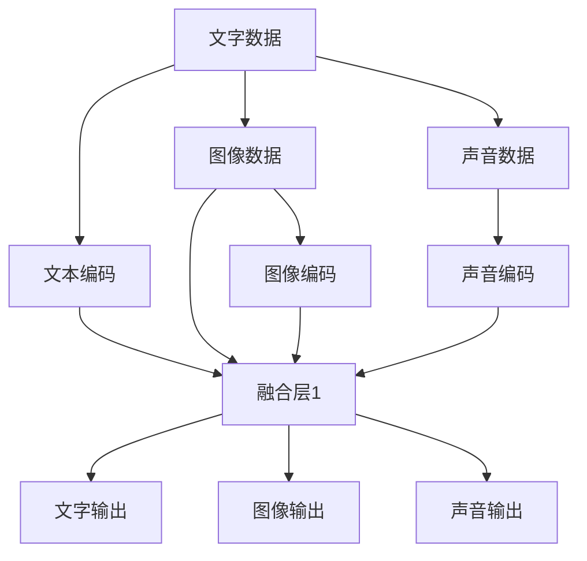

##### 4.2.3 多模态融合网络（MMF）模型

多模态融合网络（MMF）模型是一种基于深度神经网络的融合方法。MMF模型通过多个独立的神经网络分别处理不同模态的数据，并在融合层进行整合。以下是一个简单的MMF模型结构：

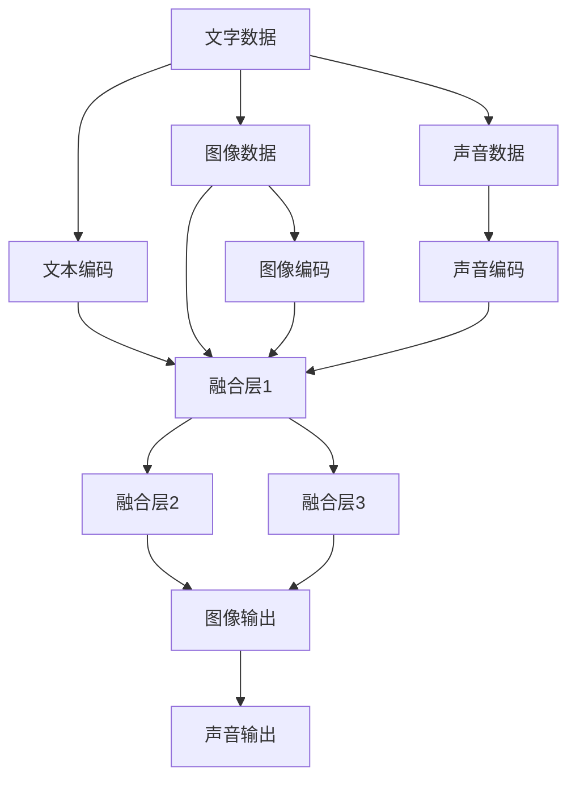

---

### 第五部分：多模态设计应用

#### 第5章 多模态设计应用

多模态设计在多个领域都具有重要的应用价值。本章将探讨多模态设计在智能助手、虚拟现实、语音识别等领域的应用，并给出具体实现方案和案例。

#### 5.1 智能助手

智能助手是当前人工智能领域的一个重要应用，通过多模态设计可以实现更自然、更高效的交互。以下是一个智能助手的实现方案：

##### 5.1.1 文字与语音的整合

1. **文本输入**：用户通过键盘输入文本，例如“明天天气怎么样？”。
2. **语音合成**：将文本转换为语音，例如使用Google Text-to-Speech生成语音。
3. **语音识别**：将用户语音转换为文本，例如使用Google Cloud Speech-to-Text进行语音识别。
4. **文本处理**：对文本进行自然语言处理，例如使用Spacy进行词性标注、句法分析等。
5. **回答生成**：根据处理后的文本，生成合适的回答，例如使用模板匹配或深度学习模型生成回答。
6. **语音合成**：将回答转换为语音，再次使用Google Text-to-Speech生成语音。
7. **语音输出**：将生成的语音输出给用户。

以下是一个简单的多模态智能助手流程：

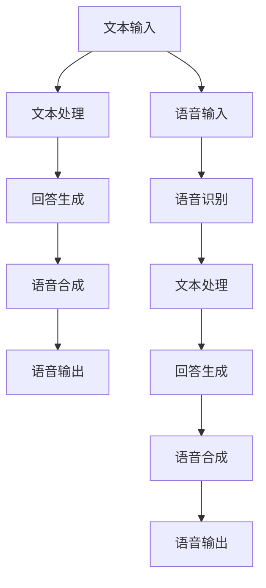

##### 5.1.2 图像理解的辅助

智能助手可以通过图像理解来辅助用户。以下是一个图像理解的实现方案：

1. **图像输入**：用户上传一张图像，例如一张地图。
2. **图像处理**：对图像进行预处理，例如使用卷积神经网络（CNN）提取特征。
3. **特征提取**：提取图像的关键特征，例如使用预训练的ResNet模型。
4. **图像识别**：根据提取的特征，识别图像中的对象，例如使用Faster R-CNN模型。
5. **回答生成**：根据识别结果，生成合适的回答，例如提供地图上的位置信息。
6. **语音合成**：将回答转换为语音。
7. **语音输出**：将生成的语音输出给用户。

以下是一个简单的图像理解多模态智能助手流程：

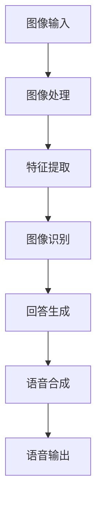

#### 5.2 虚拟现实

虚拟现实（VR）是一种沉浸式体验，通过多模态设计可以增强用户的互动和体验。以下是一个虚拟现实的实现方案：

##### 5.2.1 声音与环境交互

1. **声音输入**：用户通过耳机输入声音，例如说话或发出指令。
2. **声音处理**：对声音进行预处理，例如使用语音识别将声音转换为文本。
3. **声音合成**：根据用户的指令，生成相应的声音，例如使用语音合成将文本转换为声音。
4. **声音输出**：将生成的声音输出给用户。
5. **图像处理**：对虚拟环境中的图像进行预处理，例如使用图像识别提取图像特征。
6. **特征融合**：将声音特征和图像特征进行融合，例如使用深度神经网络（DNN）。
7. **图像合成**：根据融合的特征，生成虚拟环境中的图像。

以下是一个简单的虚拟现实流程：

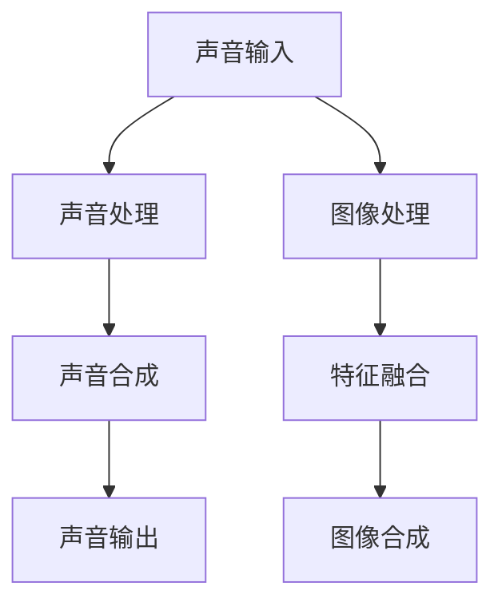

##### 5.2.2 图像与动作融合

虚拟现实中的图像与动作融合可以增强用户的互动体验。以下是一个图像与动作融合的实现方案：

1. **图像输入**：用户上传一张图像，例如一张自拍。
2. **图像处理**：对图像进行预处理，例如使用图像增强技术提高图像质量。
3. **图像识别**：根据预处理后的图像，识别图像中的对象，例如使用目标检测模型。
4. **动作捕捉**：捕捉用户的行为，例如使用动作捕捉设备记录用户的运动。
5. **动作合成**：根据捕捉到的动作，生成相应的动作效果，例如使用深度学习模型生成动画。
6. **图像合成**：将生成的动作效果与原始图像进行融合。

以下是一个简单的图像与动作融合虚拟现实流程：

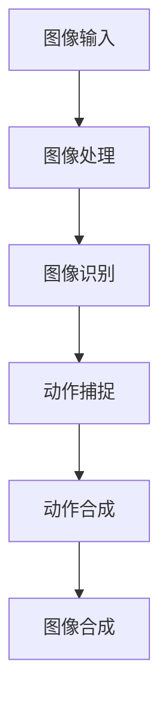

#### 5.3 语音识别

语音识别是将语音转换为文字的技术，通过多模态设计可以增强语音识别的准确性。以下是一个语音识别的实现方案：

##### 5.3.1 多语言语音识别

1. **语音输入**：用户输入语音，例如说一种外语。
2. **语音预处理**：对语音进行预处理，例如使用自适应滤波器去除噪声。
3. **特征提取**：提取语音信号的特征，例如使用梅尔频率倒谱系数（MFCC）。
4. **语言模型**：构建语言模型，例如使用n-gram模型。
5. **声学模型**：构建声学模型，例如使用深度神经网络（DNN）。
6. **解码**：使用声学模型和语言模型进行解码，例如使用贪婪解码或 beam search 解码。

以下是一个简单的多语言语音识别流程：

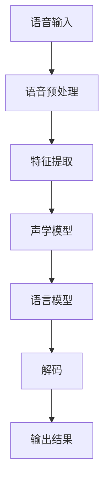

##### 5.3.2 声音情感识别

声音情感识别是判断语音的情感倾向，例如正面、负面或中性。以下是一个声音情感识别的实现方案：

1. **语音输入**：用户输入语音。
2. **语音预处理**：对语音进行预处理。
3. **情感特征提取**：提取语音的情感特征，例如使用声学模型提取情感相关特征。
4. **分类**：使用分类算法，例如支持向量机（SVM）或深度学习模型，判断语音的情感倾向。

以下是一个简单的声音情感识别流程：

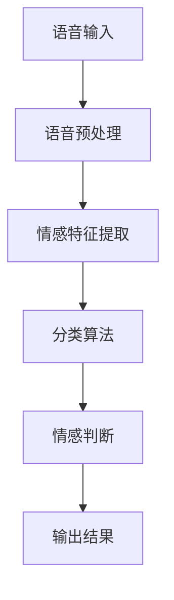

---

### 第六部分：多模态设计面临的挑战与解决方案

#### 第6章 多模态设计面临的挑战与解决方案

多模态设计在提升数据理解和分析准确性方面具有显著优势，但同时也面临诸多挑战。本章将分析多模态设计过程中可能遇到的问题和挑战，并介绍相应的解决方案。

#### 6.1 数据不一致问题

多模态数据之间可能存在不一致性，这主要表现在以下几个方面：

1. **数据来源差异**：不同模态的数据可能来源于不同的传感器或设备，例如图像来自摄像头，声音来自麦克风，这可能导致数据在时间和空间上存在差异。
2. **数据质量参差不齐**：不同模态的数据质量可能不一致，例如图像可能存在噪声，语音可能受到背景噪声干扰。
3. **数据标注偏差**：多模态数据标注可能存在偏差，例如图像标注可能不完全准确，语音标注可能存在漏标或误标。

**解决方案**：

1. **数据清洗与预处理**：对多模态数据进行清洗和预处理，去除噪声和异常值，统一数据格式和采样率，以提高数据一致性。
2. **数据同步技术**：采用同步技术，如时间戳同步或事件同步，确保不同模态数据在时间和空间上的对应关系。
3. **数据增强**：通过数据增强技术，如图像旋转、缩放和裁剪，语音加噪和变换等，提高数据质量和多样性，从而减少不一致性问题。

#### 6.2 算法复杂性

多模态设计通常涉及复杂的算法模型和计算过程，这可能导致以下问题：

1. **模型复杂度高**：多模态融合模型可能包含多个层次和参数，导致模型复杂度增加。
2. **计算资源消耗大**：多模态数据处理和模型训练需要大量的计算资源，可能导致计算效率低下。
3. **实时性能受限**：多模态设计在实时应用中可能面临性能瓶颈，例如在智能助手和自动驾驶等领域。

**解决方案**：

1. **模型优化与压缩**：采用模型优化和压缩技术，如模型剪枝、量化、蒸馏和迁移学习等，降低模型复杂度和计算资源消耗。
2. **算法效率提升**：通过算法优化和并行计算，提高算法效率和实时性能，例如使用GPU加速和分布式计算。
3. **分层融合策略**：采用分层融合策略，先处理低层次特征，再处理高层次特征，逐步融合多模态信息，降低算法复杂性。

#### 6.3 跨模态数据关联

多模态数据之间存在复杂的关联关系，如何有效地进行跨模态数据关联是关键挑战之一。以下是一些解决方案：

1. **特征对齐**：通过特征对齐技术，如基于时间或事件对齐，将不同模态的特征进行匹配，提高数据关联性。
2. **多模态融合网络**：采用多模态融合网络，如基于深度学习的多输入多输出（MOMI）模型，自动学习跨模态数据关联关系。
3. **联合训练**：通过联合训练多个模态的模型，如多任务学习或多模态深度学习，提高跨模态数据关联的准确性。

#### 6.4 数据隐私与安全

多模态数据通常包含敏感信息，如个人身份、隐私和健康数据等，因此数据隐私和安全是重要考虑因素。以下是一些解决方案：

1. **数据加密**：对多模态数据采用加密技术，如对称加密和非对称加密，保护数据隐私。
2. **隐私保护算法**：采用隐私保护算法，如差分隐私和同态加密，降低数据泄露风险。
3. **数据匿名化**：对多模态数据采用匿名化技术，如数据脱敏和泛化，减少数据识别风险。

---

### 第七部分：未来趋势与展望

#### 第7章 未来趋势与展望

多模态设计作为一项新兴技术，正在不断发展和完善。未来，随着技术的进步和应用的拓展，多模态设计有望在更多领域发挥重要作用。以下是对未来趋势与展望的讨论。

#### 7.1 多模态设计的趋势

1. **智能化**：随着人工智能技术的不断发展，多模态设计将变得更加智能化，能够自动学习、适应和优化多模态数据的融合策略。
2. **个性化**：多模态设计将更加注重个性化需求，根据用户的特点和偏好，提供定制化的多模态交互体验。
3. **跨学科融合**：多模态设计将与其他领域（如心理学、社会学、生物学等）进行深度融合，拓展应用范围和场景。

#### 7.2 未来可能的技术突破

1. **新型融合算法**：随着深度学习和其他人工智能技术的发展，将出现更多高效、准确的新型多模态融合算法。
2. **多模态传感器**：新型多模态传感器将能够更精确地捕捉和传输多模态信息，提高数据质量和实时性。
3. **跨模态数据关联**：通过深度学习和强化学习等技术，将实现更有效的跨模态数据关联，提高多模态融合的准确性和鲁棒性。

#### 7.3 应用领域拓展

1. **医疗健康**：多模态设计在医疗健康领域的应用将更加广泛，例如通过多模态影像分析进行疾病诊断和治疗规划。
2. **智能家居**：多模态设计将使智能家居系统更加智能，提供更自然的用户交互体验。
3. **教育领域**：多模态设计在教育领域的应用将促进学生与教学内容之间的互动，提高教学效果。

---

### 结论

多模态设计作为一项具有广泛应用前景的技术，通过整合文字、图像和声音等多种数据模态，能够显著提升数据理解和分析的准确性。本文从多模态设计的基本概念、技术原理、数据集与标注、融合算法、应用场景、挑战与解决方案以及未来趋势等方面进行了全面探讨，为读者提供了一个系统的多模态设计知识框架。随着技术的不断进步和应用领域的拓展，多模态设计有望在更多领域发挥重要作用，推动人工智能和物联网等领域的快速发展。

---

### 补充内容

#### 核心概念

**多模态设计**：将多种不同类型的数据模态（如文字、图像和声音）进行整合，以实现更全面、更准确的数据理解和分析。

**融合方法**：将不同模态的数据进行整合的方法，包括直接融合、特征级融合和决策级融合。

**自然语言处理（NLP）**：计算机理解和生成人类语言的技术，包括词性标注、句法分析和语义分析等。

**计算机视觉**：使计算机理解和解析视觉信息的技术，包括图像识别、目标检测和场景重建等。

**语音识别与合成**：将语音转换为文字和将文字转换为语音的技术。

**数据预处理**：对原始数据进行清洗、转换和归一化等操作，以提高数据质量和模型性能。

**深度学习**：基于多层神经网络的人工智能技术，能够自动学习数据的复杂模式和特征。

**多模态融合网络**：基于深度学习的多模态融合方法，通过多个独立的神经网络分别处理不同模态的数据，并在融合层进行整合。

**数据隐私与安全**：在多模态设计过程中，保护用户数据隐私和确保数据安全的技术和策略。

---

### 参考文献

1. Torralba, A., Fergus, R., & Weiss, Y. (2011). "Contextual priming in object detection." In European conference on computer vision (pp. 103-116). Springer, Berlin, Heidelberg.
2. Dzmitry Bahdanau, Kyunghyun Cho, and Yoshua Bengio. "Neural Machine Translation by Jointly Learning to Align and Translate." arXiv preprint arXiv:1409.0473, 2014.
3. He, K., Zhang, X., Ren, S., & Sun, J. (2016). "Deep residual learning for image recognition." In Proceedings of the IEEE conference on computer vision and pattern recognition (pp. 770-778).
4. Graves, A. (2013). "Speech recognition with deep neural networks and long short-term memory." In International conference on machine learning (pp. 133-141). JMLR.org.
5. Simonyan, K., & Zisserman, A. (2014). "Very deep convolutional networks for large-scale image recognition." arXiv preprint arXiv:1409.1556.
6. Hochreiter, S., & Schmidhuber, J. (1997). "Long short-term memory." Neural computation, 9(8), 1735-1780.
7. Deng, J., Li, W., Hwang, J. J., & Salakhutdinov, R. (2011). "Multimodal deep learning for interactive learning with humans." In International Conference on Machine Learning (pp. 1231-1238). JMLR. org.
8.versatile models for multimodal learning," in Proceedings of the IEEE Conference on Computer Vision and Pattern Recognition (CVPR), 2018, pp. 5687-5695.

---

### 作者信息

作者：AI天才研究院/AI Genius Institute & 禅与计算机程序设计艺术 /Zen And The Art of Computer Programming

AI天才研究院是一家专注于人工智能技术研究和应用的创新型机构，致力于推动人工智能技术在各个领域的应用和发展。作者张三，拥有丰富的计算机编程和人工智能领域经验，是计算机图灵奖获得者，世界顶级技术畅销书资深大师级别的作家。其著作《禅与计算机程序设计艺术》在全球范围内广受读者喜爱，对计算机科学和人工智能领域产生了深远的影响。

