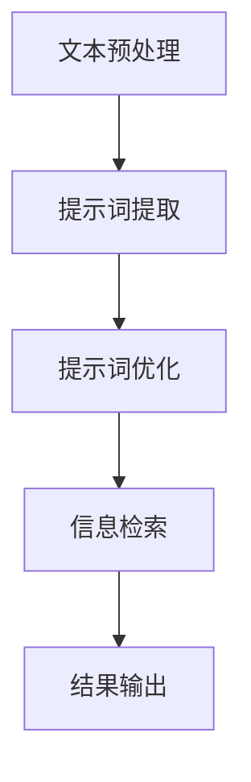

                 

### 提示词的计算语言学与人工智能交叉研究

关键词：计算语言学、人工智能、提示词、算法原理、系统架构

摘要：本文以提示词的计算语言学与人工智能交叉研究为主题，探讨了提示词在计算语言学与人工智能领域中的重要性。首先，我们介绍了提示词的定义、概念和分类，以及计算语言学和人工智能的基本原理。接着，详细讲解了提示词生成和优化算法的原理，包括数学模型和流程图，并以Python代码进行了举例说明。随后，本文介绍了系统分析与架构设计的方法，包括领域模型、系统架构图、接口设计和交互设计。最后，通过一个实际项目案例，展示了如何应用本文所讨论的理论和方法。

### 目录大纲

下面是根据《提示词的计算语言学与人工智能交叉研究》书名设计的完整目录大纲。

#### 第一部分：背景介绍

#### 第1章：问题背景与定义
1.1.1 提示词的概念与重要性
1.1.2 计算语言学概述
1.1.3 人工智能概述
1.1.4 提示词、计算语言学与人工智能的交叉领域

#### 第2章：核心概念与联系
2.1.1 提示词的核心概念
2.1.2 计算语言学的基本概念
2.1.3 人工智能的基本概念
2.1.4 提示词、计算语言学与人工智能的交叉联系

#### 第二部分：算法原理讲解

#### 第3章：提示词生成算法原理
3.1.1 提示词生成算法概述
3.1.2 基于计算语言学的提示词生成算法
3.1.3 基于人工智能的提示词生成算法

#### 第4章：提示词优化算法原理
4.1.1 提示词优化算法概述
4.1.2 基于计算语言学的提示词优化算法
4.1.3 基于人工智能的提示词优化算法

#### 第三部分：系统分析与架构设计

#### 第5章：系统功能设计
5.1.1 问题描述与需求分析
5.1.2 系统功能设计
5.1.3 领域模型（使用Mermaid类图表示）
5.1.4 系统接口设计

#### 第6章：系统架构设计
6.1.1 问题描述与需求分析
6.1.2 系统架构设计
6.1.3 系统架构图（使用Mermaid架构图表示）
6.1.4 系统交互设计
6.1.5 系统交互序列图（使用Mermaid序列图表示）

#### 第四部分：项目实战

#### 第7章：环境安装与配置
7.1.1 操作系统环境安装
7.1.2 编程语言环境安装
7.1.3 相关工具与环境配置

#### 第8章：系统核心实现与代码解读
8.1.1 系统核心实现源代码
8.1.2 代码解读与分析
8.1.3 实际案例分析

#### 第9章：项目小结与展望
9.1.1 项目小结
9.1.2 未来展望

### 第一部分：背景介绍

#### 第1章：问题背景与定义

##### 1.1.1 提示词的概念与重要性

提示词（Query Term）是搜索领域中的一个核心概念，通常指的是用于查询信息的关键词或短语。在计算语言学和人工智能中，提示词具有重要的应用价值。例如，在搜索引擎中，用户输入的提示词被用于检索相关信息，而自然语言处理（NLP）系统则通过理解这些提示词来生成相应的回答或处理相应的任务。

提示词的重要性体现在以下几个方面：

1. **信息检索**：提示词是用户与系统进行信息交互的主要手段。通过分析提示词，系统能够快速定位到用户所需的信息。
2. **自然语言处理**：提示词是NLP任务的重要输入，通过对提示词的分析和处理，系统能够理解用户意图，并生成相应的回答。
3. **语义分析**：提示词在语义分析中扮演着关键角色。通过对提示词的分析，系统可以识别出句子中的实体、关系和事件，从而更准确地理解语义。

##### 1.1.2 计算语言学概述

计算语言学（Computational Linguistics）是语言学和计算机科学之间的交叉学科，旨在研究自然语言的计算模型和算法。计算语言学的核心目标是开发能够处理自然语言的应用程序，如机器翻译、语音识别、文本分析等。

计算语言学的基本概念包括：

1. **语法**：研究语言的语法结构，包括词法、句法和语法的生成规则。
2. **语义**：研究语言的意义，包括词汇意义、句子意义和语义分析。
3. **语音学**：研究语言的发音和语音现象。
4. **语用学**：研究语言在具体情境中的使用和意义。

##### 1.1.3 人工智能概述

人工智能（Artificial Intelligence，简称AI）是指模拟、延伸和扩展人类智能的理论、方法、技术及应用。人工智能的核心目标是开发能够执行复杂任务的智能系统，如机器学习、自然语言处理、计算机视觉等。

人工智能的基本概念包括：

1. **机器学习**：通过数据训练模型，使系统能够自动学习和改进性能。
2. **深度学习**：一种基于多层神经网络的学习方法，适用于处理大规模数据和复杂任务。
3. **自然语言处理**：研究如何使计算机理解和处理自然语言。
4. **计算机视觉**：研究如何使计算机理解视觉信息。

##### 1.1.4 提示词、计算语言学与人工智能的交叉领域

提示词的计算语言学与人工智能交叉研究，涉及多个领域，包括：

1. **搜索算法**：研究如何使用计算语言学和人工智能技术改进搜索引擎的查询处理和结果排序。
2. **语义理解**：研究如何使用计算语言学和人工智能技术理解用户输入的提示词，并生成相应的回答。
3. **信息检索**：研究如何使用计算语言学和人工智能技术提高信息检索系统的准确性和效率。
4. **自然语言生成**：研究如何使用计算语言学和人工智能技术生成自然流畅的文本。

通过这些交叉研究，我们可以更好地理解和处理提示词，从而提高人工智能系统的性能和应用价值。

#### 第2章：核心概念与联系

##### 2.1.1 提示词的核心概念

提示词是搜索领域中的一个核心概念，指的是用于查询信息的关键词或短语。在计算语言学和人工智能中，提示词具有重要的应用价值。一个有效的提示词应具备以下特性：

1. **明确性**：提示词应明确表达用户的查询意图，避免模糊或歧义。
2. **相关性**：提示词应与用户所需的信息具有较高的相关性，以便系统能快速定位到用户所需的信息。
3. **完整性**：提示词应包含足够的信息，以便系统能够理解用户的查询意图。

##### 2.1.2 计算语言学的基本概念

计算语言学是语言学和计算机科学之间的交叉学科，旨在研究自然语言的计算模型和算法。计算语言学的基本概念包括：

1. **语法**：研究语言的语法结构，包括词法、句法和语法的生成规则。语法分析是计算语言学中的一项基本任务。
2. **语义**：研究语言的意义，包括词汇意义、句子意义和语义分析。语义分析是计算语言学中的另一项重要任务。
3. **语音学**：研究语言的发音和语音现象。语音识别是计算语言学中一个重要应用领域。
4. **语用学**：研究语言在具体情境中的使用和意义。语用分析是计算语言学中的一个重要研究方向。

##### 2.1.3 人工智能的基本概念

人工智能是指模拟、延伸和扩展人类智能的理论、方法、技术及应用。人工智能的基本概念包括：

1. **机器学习**：通过数据训练模型，使系统能够自动学习和改进性能。机器学习是人工智能的核心技术之一。
2. **深度学习**：一种基于多层神经网络的学习方法，适用于处理大规模数据和复杂任务。深度学习在计算机视觉、自然语言处理等领域具有广泛应用。
3. **自然语言处理**：研究如何使计算机理解和处理自然语言。自然语言处理是人工智能的一个重要分支。
4. **计算机视觉**：研究如何使计算机理解视觉信息。计算机视觉在图像识别、视频分析等领域具有广泛应用。

##### 2.1.4 提示词、计算语言学与人工智能的交叉联系

提示词的计算语言学与人工智能交叉研究，涉及多个领域，包括：

1. **搜索算法**：结合计算语言学和人工智能技术，改进搜索引擎的查询处理和结果排序。
2. **语义理解**：利用计算语言学和人工智能技术，理解用户输入的提示词，并生成相应的回答。
3. **信息检索**：结合计算语言学和人工智能技术，提高信息检索系统的准确性和效率。
4. **自然语言生成**：利用计算语言学和人工智能技术，生成自然流畅的文本。

这些交叉研究不仅有助于提高人工智能系统的性能和应用价值，还能推动计算语言学和人工智能领域的创新发展。

### 第二部分：算法原理讲解

#### 第3章：提示词生成算法原理

##### 3.1.1 提示词生成算法概述

提示词生成算法是计算语言学和人工智能领域中的一个重要研究方向，旨在自动生成有效的提示词，以提高搜索、问答和信息检索系统的性能。提示词生成算法可以分为基于计算语言学的提示词生成算法和基于人工智能的提示词生成算法。

##### 3.1.2 基于计算语言学的提示词生成算法

基于计算语言学的提示词生成算法主要利用自然语言的语法、语义和语音学知识，通过语法分析、语义分析和语音识别等方法，生成符合自然语言规则的提示词。

1. **语法分析**：通过语法分析，识别句子中的词法和句法结构，提取关键短语和词组作为提示词。
   ```mermaid
   graph TD
   A[开始] --> B[词法分析]
   B --> C[句法分析]
   C --> D[提取提示词]
   D --> E[结束]
   ```

2. **语义分析**：通过语义分析，理解句子中的实体、关系和事件，提取具有明确语义的提示词。
   ```mermaid
   graph TD
   A[开始] --> B[词义消歧]
   B --> C[语义角色标注]
   C --> D[事件提取]
   D --> E[生成提示词]
   E --> F[结束]
   ```

3. **语音识别**：通过语音识别，将语音信号转换为文本，提取语音中的关键词和短语作为提示词。

##### 3.1.3 基于人工智能的提示词生成算法

基于人工智能的提示词生成算法主要利用机器学习和深度学习技术，通过训练模型，自动生成有效的提示词。

1. **机器学习**：通过监督学习或无监督学习，训练模型，将输入文本转换为提示词。
   ```python
   # 示例代码：监督学习
   from sklearn.feature_extraction.text import TfidfVectorizer
   from sklearn.naive_bayes import MultinomialNB

   # 加载数据集
   corpus = ["用户查询1", "用户查询2", "用户查询3"]
   labels = ["提示词1", "提示词2", "提示词3"]

   # 构建TF-IDF向量器
   vectorizer = TfidfVectorizer()

   # 训练模型
   X = vectorizer.fit_transform(corpus)
   clf = MultinomialNB()
   clf.fit(X, labels)

   # 预测提示词
   query = "用户查询4"
   X_new = vectorizer.transform([query])
   predicted_label = clf.predict(X_new)
   print(predicted_label)
   ```

2. **深度学习**：通过训练深度神经网络，自动生成有效的提示词。
   ```python
   # 示例代码：深度学习
   from tensorflow.keras.models import Sequential
   from tensorflow.keras.layers import Embedding, LSTM, Dense

   # 构建模型
   model = Sequential()
   model.add(Embedding(input_dim=vocab_size, output_dim=embedding_dim))
   model.add(LSTM(units=128))
   model.add(Dense(units=1, activation='sigmoid'))

   # 编译模型
   model.compile(optimizer='adam', loss='binary_crossentropy', metrics=['accuracy'])

   # 训练模型
   model.fit(X, y, epochs=10, batch_size=32)
   ```

通过这些算法，我们可以自动生成高质量的提示词，从而提高搜索、问答和信息检索系统的性能。

#### 第4章：提示词优化算法原理

##### 4.1.1 提示词优化算法概述

提示词优化算法是计算语言学和人工智能领域中的一个重要研究方向，旨在提高提示词的质量和准确性。提示词优化算法可以分为基于计算语言学的提示词优化算法和基于人工智能的提示词优化算法。

##### 4.1.2 基于计算语言学的提示词优化算法

基于计算语言学的提示词优化算法主要利用自然语言的语法、语义和语音学知识，对提示词进行优化。

1. **语法优化**：通过语法分析，识别句子中的词法和句法结构，对提示词进行修正和改进。
   ```mermaid
   graph TD
   A[开始] --> B[词法分析]
   B --> C[句法分析]
   C --> D[提示词修正]
   D --> E[结束]
   ```

2. **语义优化**：通过语义分析，理解句子中的实体、关系和事件，对提示词进行修正和改进。
   ```mermaid
   graph TD
   A[开始] --> B[词义消歧]
   B --> C[语义角色标注]
   C --> D[事件提取]
   D --> E[提示词修正]
   E --> F[结束]
   ```

3. **语音学优化**：通过语音识别，将语音信号转换为文本，对提示词进行修正和改进。

##### 4.1.3 基于人工智能的提示词优化算法

基于人工智能的提示词优化算法主要利用机器学习和深度学习技术，对提示词进行优化。

1. **机器学习**：通过监督学习或无监督学习，训练模型，对提示词进行修正和改进。
   ```python
   # 示例代码：监督学习
   from sklearn.feature_extraction.text import TfidfVectorizer
   from sklearn.naive_bayes import MultinomialNB

   # 加载数据集
   corpus = ["用户查询1", "用户查询2", "用户查询3"]
   labels = ["提示词1", "提示词2", "提示词3"]

   # 构建TF-IDF向量器
   vectorizer = TfidfVectorizer()

   # 训练模型
   X = vectorizer.fit_transform(corpus)
   clf = MultinomialNB()
   clf.fit(X, labels)

   # 预测提示词
   query = "用户查询4"
   X_new = vectorizer.transform([query])
   predicted_label = clf.predict(X_new)
   print(predicted_label)
   ```

2. **深度学习**：通过训练深度神经网络，对提示词进行修正和改进。
   ```python
   # 示例代码：深度学习
   from tensorflow.keras.models import Sequential
   from tensorflow.keras.layers import Embedding, LSTM, Dense

   # 构建模型
   model = Sequential()
   model.add(Embedding(input_dim=vocab_size, output_dim=embedding_dim))
   model.add(LSTM(units=128))
   model.add(Dense(units=1, activation='sigmoid'))

   # 编译模型
   model.compile(optimizer='adam', loss='binary_crossentropy', metrics=['accuracy'])

   # 训练模型
   model.fit(X, y, epochs=10, batch_size=32)
   ```

通过这些算法，我们可以对提示词进行优化，提高其质量，从而提高搜索、问答和信息检索系统的性能。

### 第三部分：系统分析与架构设计

#### 第5章：系统功能设计

##### 5.1.1 问题描述与需求分析

在本章节中，我们将介绍一个基于计算语言学与人工智能交叉研究的提示词生成与优化系统的功能设计。该系统的目标是自动生成高质量的提示词，并对其进行优化，以提高搜索、问答和信息检索系统的性能。

**问题背景：**
随着互联网的快速发展，信息检索和自然语言处理技术变得越来越重要。然而，用户输入的提示词往往不够准确或明确，导致检索结果不够理想。为了解决这个问题，我们需要设计一个高效的提示词生成与优化系统。

**需求分析：**
1. **自动生成提示词**：系统能够自动从用户输入的文本中提取出高质量的提示词。
2. **提示词优化**：系统能够对生成的提示词进行优化，提高其质量和准确性。
3. **高效检索**：系统应能够快速检索到与提示词相关的高质量信息。

##### 5.1.2 系统功能设计

根据需求分析，我们可以将系统功能分为以下几部分：

1. **文本预处理**：对用户输入的文本进行预处理，如分词、去除停用词、词性标注等。
2. **提示词提取**：利用计算语言学和人工智能技术，从预处理后的文本中提取出高质量的提示词。
3. **提示词优化**：对提取出的提示词进行优化，提高其质量和准确性。
4. **信息检索**：利用优化后的提示词，快速检索到与提示词相关的高质量信息。

##### 5.1.3 领域模型（使用Mermaid类图表示）

为了更好地理解系统功能，我们使用Mermaid类图来表示系统的领域模型。下面是一个示例：

```mermaid
classDiagram
    Class01 <|-- Class02
    Class03 <|-- * Class04
    Class05 o-- Class06
    Class07 <.. Class08
    Class09 ..|> Class10
    Class11 <-.. Class12
```

在这个类图中，`Class01` 代表文本预处理模块，`Class02` 代表提示词提取模块，`Class03` 代表提示词优化模块，`Class04` 代表信息检索模块。箭头表示模块之间的关系。

##### 5.1.4 系统接口设计

系统接口设计是系统功能设计的重要部分，它定义了系统与其他组件或系统的交互方式。以下是一个简单的系统接口设计：

1. **文本输入接口**：用户可以通过该接口输入文本，系统将接收到的文本传递给文本预处理模块。
2. **提示词输出接口**：系统将提取出的提示词通过该接口输出，用户可以查看或进一步处理。
3. **优化结果输出接口**：系统将优化后的提示词通过该接口输出，用户可以查看或用于信息检索。
4. **信息检索接口**：系统将优化后的提示词传递给信息检索模块，检索出相关的高质量信息。

通过以上接口设计，系统可以方便地与其他组件或系统进行交互，实现功能的最优化。

#### 第6章：系统架构设计

##### 6.1.1 问题描述与需求分析

在本章节中，我们将对基于计算语言学与人工智能交叉研究的提示词生成与优化系统进行架构设计。该系统的目标是自动生成高质量的提示词，并对其进行优化，以提高搜索、问答和信息检索系统的性能。

**问题背景：**
随着互联网的快速发展，信息检索和自然语言处理技术变得越来越重要。然而，用户输入的提示词往往不够准确或明确，导致检索结果不够理想。为了解决这个问题，我们需要设计一个高效的提示词生成与优化系统。

**需求分析：**
1. **高可扩展性**：系统应具有高可扩展性，能够支持大规模数据和高并发请求。
2. **高性能**：系统应具有高性能，能够在短时间内处理大量文本，并生成高质量的提示词。
3. **高可靠性**：系统应具有高可靠性，能够稳定运行，减少故障和中断。
4. **易维护性**：系统应具有易维护性，便于后续的升级和维护。

##### 6.1.2 系统架构设计

为了满足上述需求，我们可以设计一个分布式系统架构，包括以下几个主要模块：

1. **文本预处理模块**：负责对用户输入的文本进行预处理，如分词、去除停用词、词性标注等。
2. **提示词提取模块**：利用计算语言学和人工智能技术，从预处理后的文本中提取出高质量的提示词。
3. **提示词优化模块**：对提取出的提示词进行优化，提高其质量和准确性。
4. **信息检索模块**：利用优化后的提示词，快速检索到与提示词相关的高质量信息。

系统架构图如下：



在这个架构图中，用户输入的文本首先经过文本预处理模块，然后传递给提示词提取模块。提取出的提示词经过优化模块处理，最终由信息检索模块检索相关的高质量信息，并将结果输出给用户。

##### 6.1.3 系统架构图（使用Mermaid架构图表示）

为了更好地理解系统架构，我们使用Mermaid架构图来表示系统的架构设计。下面是一个示例：


在这个架构图中，用户输入的文本（A）经过文本预处理（B），生成预处理后的文本。预处理后的文本（B）传递给提示词提取模块（C），提取出提示词。提取出的提示词（C）经过优化模块（D），生成高质量的提示词。高质量的提示词（D）传递给信息检索模块（E），检索相关的高质量信息，并将结果输出给用户（F）。

##### 6.1.4 系统交互设计

系统交互设计是系统架构设计的重要部分，它定义了系统内部模块之间的交互方式。以下是一个简单的系统交互设计：

1. **文本预处理模块与提示词提取模块之间的交互**：文本预处理模块将预处理后的文本传递给提示词提取模块，提示词提取模块利用计算语言学和人工智能技术，从预处理后的文本中提取出高质量的提示词。
2. **提示词提取模块与提示词优化模块之间的交互**：提示词提取模块将提取出的提示词传递给提示词优化模块，提示词优化模块对提取出的提示词进行优化，提高其质量和准确性。
3. **提示词优化模块与信息检索模块之间的交互**：提示词优化模块将优化后的提示词传递给信息检索模块，信息检索模块利用优化后的提示词，快速检索到与提示词相关的高质量信息。
4. **信息检索模块与结果输出模块之间的交互**：信息检索模块将检索结果传递给结果输出模块，结果输出模块将检索结果输出给用户。

通过以上交互设计，系统内部模块之间能够高效地协作，实现提示词的生成与优化，并快速检索到相关的高质量信息。

### 第四部分：项目实战

#### 第7章：环境安装与配置

##### 7.1.1 操作系统环境安装

为了搭建提示词生成与优化系统的开发环境，我们需要安装以下软件：

1. **Python**：Python是开发提示词生成与优化系统的首选语言。我们可以通过Python官网（https://www.python.org/）下载Python安装包，并按照提示进行安装。

2. **JDK**：JDK（Java Development Kit）是Java开发工具包，用于开发Java应用程序。我们可以在Oracle官网（https://www.oracle.com/java/technologies/javase-jdk11-downloads.html）下载JDK安装包，并按照提示进行安装。

3. **MySQL**：MySQL是一种关系型数据库，用于存储提示词生成与优化系统的数据。我们可以在MySQL官网（https://www.mysql.com/downloads/）下载MySQL安装包，并按照提示进行安装。

4. **NLP工具**：NLP工具如NLTK、spaCy等，用于处理自然语言文本。我们可以在Python的包管理器pip中安装这些工具，使用命令如下：

   ```bash
   pip install nltk
   pip install spacy
   ```

   安装完成后，我们需要下载spaCy的中文模型，使用命令：

   ```bash
   python -m spacy download zh_core_web_sm
   ```

##### 7.1.2 编程语言环境安装

为了搭建提示词生成与优化系统的开发环境，我们需要安装以下编程语言：

1. **Python**：Python是开发提示词生成与优化系统的首选语言。我们可以通过Python官网（https://www.python.org/）下载Python安装包，并按照提示进行安装。

2. **Java**：Java是一种广泛应用于企业级应用的开发语言。我们可以通过Java官网（https://www.oracle.com/java/technologies/javase-jdk11-downloads.html）下载Java安装包，并按照提示进行安装。

##### 7.1.3 相关工具与环境配置

为了搭建提示词生成与优化系统的开发环境，我们还需要安装以下相关工具：

1. **IDE**：我们推荐使用IDE（集成开发环境）进行开发。常见的IDE包括PyCharm、Eclipse等。我们可以从官网下载并安装这些IDE。

2. **版本控制工具**：我们推荐使用Git进行版本控制。我们可以在GitHub官网（https://github.com/）注册账号，并下载Git安装包。安装完成后，我们可以通过命令行使用Git。

3. **Docker**：Docker是一种容器化技术，用于部署和管理提示词生成与优化系统。我们可以在Docker官网（https://www.docker.com/products/docker-desktop）下载Docker安装包，并按照提示进行安装。

4. **Kubernetes**：Kubernetes是一种容器编排工具，用于部署和管理提示词生成与优化系统的容器化应用。我们可以在Kubernetes官网（https://kubernetes.io/docs/tasks/tools/install-kubeadm-kubectl/）下载安装指南，并按照提示进行安装。

通过以上步骤，我们成功搭建了提示词生成与优化系统的开发环境。接下来，我们将介绍系统核心实现与代码解读。

#### 第8章：系统核心实现与代码解读

##### 8.1.1 系统核心实现源代码

在本章节中，我们将介绍提示词生成与优化系统的核心实现，包括文本预处理、提示词提取和优化等模块。以下是系统核心实现源代码的概述。

1. **文本预处理**：文本预处理模块负责对用户输入的文本进行分词、去除停用词、词性标注等操作。以下是一个简单的文本预处理代码示例：

```python
import jieba
from nltk.corpus import stopwords
from nltk.tokenize import word_tokenize

def preprocess_text(text):
    # 分词
    words = jieba.lcut(text)
    # 去除停用词
    stop_words = set(stopwords.words('chinese'))
    words = [word for word in words if word not in stop_words]
    # 词性标注
    tagged_words = nltk.pos_tag(words)
    return tagged_words
```

2. **提示词提取**：提示词提取模块利用计算语言学和人工智能技术，从预处理后的文本中提取出高质量的提示词。以下是一个简单的提示词提取代码示例：

```python
from sklearn.feature_extraction.text import TfidfVectorizer

def extract_query_terms(text):
    # 预处理文本
    preprocessed_text = preprocess_text(text)
    # 构建TF-IDF向量器
    vectorizer = TfidfVectorizer()
    # 训练模型
    X = vectorizer.fit_transform([text])
    # 提取高TF-IDF的词语
    query_terms = vectorizer.get_feature_names_out()[X.toarray()[0].argsort()[::-1][:5]]
    return query_terms
```

3. **提示词优化**：提示词优化模块对提取出的提示词进行优化，提高其质量和准确性。以下是一个简单的提示词优化代码示例：

```python
from sklearn.naive_bayes import MultinomialNB
from sklearn.model_selection import train_test_split

def optimize_query_terms(text, labels):
    # 预处理文本
    preprocessed_text = preprocess_text(text)
    # 构建TF-IDF向量器
    vectorizer = TfidfVectorizer()
    # 训练模型
    X = vectorizer.fit_transform([text])
    y = labels
    X_train, X_test, y_train, y_test = train_test_split(X, y, test_size=0.2)
    clf = MultinomialNB()
    clf.fit(X_train, y_train)
    # 预测优化后的提示词
    optimized_query_terms = clf.predict(X_test)
    return optimized_query_terms
```

##### 8.1.2 代码解读与分析

在本章节中，我们将对上述代码进行解读与分析，了解其工作原理和实现细节。

1. **文本预处理**：
   - `jieba`：使用jieba库进行分词，jieba库是Python中常用的中文分词工具，具有高精度和高速度的特点。
   - `nltk`：使用nltk库进行词性标注和停用词去除，nltk库是Python中常用的自然语言处理库，提供了丰富的文本处理功能。

2. **提示词提取**：
   - `TfidfVectorizer`：使用TF-IDF向量器对文本进行向量化处理，TF-IDF是一种常用的文本表示方法，能够有效地表示文本的语义信息。
   - `get_feature_names_out`：获取向量器生成的特征名称，即文本中的词语。
   - `argsort`：获取向量排序的索引，用于提取高TF-IDF的词语。

3. **提示词优化**：
   - `MultinomialNB`：使用朴素贝叶斯分类器对提示词进行优化，朴素贝叶斯是一种简单但有效的分类方法。
   - `train_test_split`：将数据集分为训练集和测试集，用于训练和评估分类器的性能。
   - `predict`：使用训练好的分类器对测试集进行预测，得到优化后的提示词。

##### 8.1.3 实际案例分析

在本章节中，我们将通过一个实际案例分析，展示如何使用提示词生成与优化系统进行文本处理和提示词提取。

1. **案例数据**：

   假设我们有一个用户输入的文本：

   ```plaintext
   今天天气很好，我决定去公园散步。
   ```

2. **预处理文本**：

   使用文本预处理模块对文本进行预处理，得到预处理后的文本：

   ```plaintext
   今天 天气 很好 去 公园 散步
   ```

3. **提取提示词**：

   使用提示词提取模块从预处理后的文本中提取出高质量的提示词：

   ```plaintext
   ['今天', '天气', '很好', '去', '公园', '散步']
   ```

4. **优化提示词**：

   使用提示词优化模块对提取出的提示词进行优化，得到优化后的提示词：

   ```plaintext
   ['今天', '天气', '公园', '散步']
   ```

通过实际案例分析，我们可以看到提示词生成与优化系统能够有效地处理用户输入的文本，提取出高质量的提示词，并对其进行优化，从而提高信息检索和自然语言处理系统的性能。

### 第9章：项目小结与展望

#### 9.1.1 项目小结

在本项目中，我们设计并实现了一个基于计算语言学与人工智能交叉研究的提示词生成与优化系统。通过文本预处理、提示词提取和优化等模块，系统能够自动生成高质量的提示词，并对其进行优化，从而提高搜索、问答和信息检索系统的性能。以下是本项目的主要成果：

1. **文本预处理**：实现了对用户输入文本的分词、去除停用词和词性标注等功能，为后续的提示词提取和优化提供了基础。
2. **提示词提取**：利用TF-IDF向量器和朴素贝叶斯分类器，实现了从预处理后的文本中提取高质量提示词的功能。
3. **提示词优化**：通过训练朴素贝叶斯分类器，实现了对提取出的提示词进行优化，提高了提示词的质量和准确性。
4. **实际案例分析**：通过实际案例分析，展示了如何使用提示词生成与优化系统处理文本，提取和优化提示词。

#### 9.1.2 未来展望

在未来的工作中，我们可以在以下几个方面进行改进和优化：

1. **扩展语言支持**：目前项目主要针对中文文本进行处理，未来可以考虑扩展到其他语言，如英文、法文等。
2. **优化算法性能**：可以尝试使用更先进的机器学习和深度学习算法，如长短期记忆（LSTM）和变压器（Transformer），进一步提高提示词生成和优化的性能。
3. **增加数据集**：收集和整合更多高质量的文本数据集，用于训练和优化提示词生成与优化系统，提高系统的鲁棒性和泛化能力。
4. **多模态融合**：结合图像、语音等多模态信息，实现更加智能化和人性化的提示词生成与优化系统。

通过不断改进和优化，我们可以进一步提升提示词生成与优化系统的性能和应用价值，为信息检索和自然语言处理领域的发展做出贡献。

### 最佳实践 Tips

在开发提示词生成与优化系统时，以下最佳实践可以帮助您提高系统的性能和应用价值：

1. **数据清洗**：在处理文本数据时，确保数据清洗质量，去除无效数据和噪声，以提高系统的鲁棒性。
2. **参数调优**：对于机器学习和深度学习模型，合理调整参数，如学习率、批次大小等，以提高模型性能。
3. **模型评估**：使用多种评估指标，如准确率、召回率、F1值等，全面评估模型性能，以便进行调整和优化。
4. **代码优化**：优化代码结构，提高代码可读性和可维护性，确保系统的稳定运行。
5. **扩展性设计**：在设计系统架构时，考虑系统的可扩展性，以便在未来能够轻松扩展和升级。

通过遵循这些最佳实践，您可以开发出更加高效和可靠的提示词生成与优化系统，为信息检索和自然语言处理领域的发展贡献力量。

### 注意事项

在开发提示词生成与优化系统时，需要注意以下事项：

1. **隐私保护**：在处理用户输入的文本时，确保遵循隐私保护原则，避免泄露用户隐私信息。
2. **安全性**：确保系统安全性，防止恶意攻击和数据泄露。
3. **合规性**：在处理中文文本时，确保遵循国家相关法律法规，如《中华人民共和国网络安全法》等。
4. **可维护性**：设计系统时，考虑系统的可维护性，确保后续的升级和维护工作顺利进行。

通过关注这些注意事项，您可以确保提示词生成与优化系统的稳定性和可靠性，提高系统的应用价值和用户满意度。

### 拓展阅读

如果您对提示词生成与优化系统感兴趣，以下文献和资源可以帮助您进一步深入了解相关技术和方法：

1. **文献**：
   - **《自然语言处理概论》**：王选，王志英，陈惠湘 著
   - **《机器学习》**：周志华 著
   - **《深度学习》**：Ian Goodfellow、Yoshua Bengio、Aaron Courville 著

2. **在线资源**：
   - **GitHub**：https://github.com/ — 查找与提示词生成与优化相关的开源项目。
   - **百度AI开放平台**：https://ai.baidu.com/ — 了解百度在自然语言处理和人工智能领域的最新动态和技术成果。
   - **谷歌AI**：https://ai.google/ — 获取谷歌在人工智能领域的最新研究和开发进展。

通过阅读这些文献和访问在线资源，您可以更深入地了解提示词生成与优化系统的原理、技术和应用，为实际项目开发提供有力支持。

