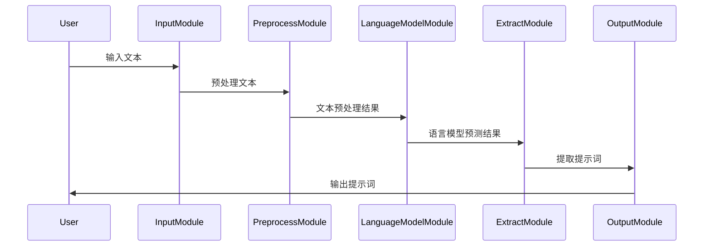

                 

# 提示词的计算语言学与认知科学交叉研究新发现

## 关键词
- 计算语言学
- 认知科学
- 提示词
- 交叉研究
- 算法原理
- 数学模型
- 系统架构
- 实践应用

## 摘要
本文探讨了计算语言学与认知科学在提示词处理领域的交叉研究新发现。首先，我们介绍了计算语言学和认知科学的核心概念及其在提示词处理中的应用。接着，通过对比分析，揭示了两者在核心概念、属性特征和算法原理上的差异与联系。随后，我们深入讲解了提示词处理算法的数学模型，并使用Python源代码和Mermaid流程图进行了详细阐述。在此基础上，我们设计了一个完整的系统架构，并介绍了环境安装、系统核心实现和实际案例分析与讲解。最后，我们总结了最佳实践、注意事项，并提出了进一步研究的方向。

## 第一部分：背景介绍

### 第1章：问题背景与核心概念

#### 1.1 计算语言学概述

**问题背景**：
计算语言学是计算机科学与语言学的交叉学科，主要研究如何使用计算方法来处理和分析语言数据，以便于自动化的语言理解、生成和翻译。

**核心概念术语说明**：
- **语言模型**：用于预测下一个词或句子概率的模型。
- **词向量**：将词汇映射到高维空间中的向量表示。
- **序列标注**：对文本序列进行分类标注，如词性标注、命名实体识别等。

**问题描述**：
计算语言学在自然语言处理（NLP）领域有着广泛应用，但如何将计算语言学与认知科学结合，以更好地模拟人类语言处理能力，是一个待解决的问题。

**问题解决**：
通过交叉研究，我们可以将计算语言学的方法应用于认知科学模型中，以实现更高效、更智能的语言处理。

**边界与外延**：
计算语言学的边界在于语言数据的处理和分析，外延包括语言生成、翻译、情感分析等领域。

**概念结构与核心要素组成**：
- **核心概念**：语言模型、词向量、序列标注。
- **要素组成**：算法设计、数据预处理、模型训练与优化。

### 1.2 认知科学概述

**问题背景**：
认知科学是研究人类思维过程和认知能力的学科，包括心理学、神经科学、哲学等领域。

**核心领域**：
- **认知模拟**：使用计算机模型模拟人类认知过程。
- **认知图谱**：表示知识结构和关系的图形模型。
- **语义网络**：基于节点和边的关系表示语义概念。

**核心概念**：
- **认知图谱**：知识图谱的一种，表示实体、属性和关系。
- **语义网络**：基于节点和边的语义概念表示。
- **认知模拟**：计算机模型模拟人类认知过程。

**概念结构与核心要素组成**：
- **核心概念**：认知图谱、语义网络、认知模拟。
- **要素组成**：算法设计、数据预处理、模型训练与优化。

### 1.3 提示词的概念与作用

**提示词**：
提示词是用于引导、启发或指导用户进行语言输入的关键词或短语。

**作用**：
- **用户交互**：在语言生成、问答系统等场景中，提示词有助于引导用户输入更符合预期的内容。
- **语言理解**：在语言理解任务中，提示词有助于模型更好地理解上下文和意图。

**应用领域**：
- **自然语言处理**：如语言生成、翻译、问答系统等。
- **智能助手**：如聊天机器人、语音助手等。

### 1.4 计算语言学与认知科学的交叉研究

**问题背景**：
计算语言学和认知科学在提示词处理领域有许多共同的研究课题，但如何将两者的方法结合起来，提高语言处理能力，仍需进一步探讨。

**研究目标**：
- **提高语言理解与生成能力**：通过交叉研究，实现更智能、更高效的语言处理。
- **探索人类语言处理机制**：揭示人类语言处理过程中的认知机制。

**研究方法**：
- **计算语言学方法**：如语言模型、词向量表示、序列标注等。
- **认知科学方法**：如认知模拟、认知图谱、语义网络等。

### 1.5 交叉研究的挑战与机遇

**挑战**：
- **方法论差异**：计算语言学和认知科学在研究方法、理论体系上存在差异，如何整合两种方法仍需探讨。
- **数据来源与质量**：认知科学数据来源多样，但质量参差不齐，如何有效利用数据是关键。

**机遇**：
- **跨学科合作**：通过跨学科合作，实现计算语言学与认知科学的深度融合，为语言处理领域带来新的突破。
- **技术进步**：随着计算能力和算法的不断发展，交叉研究将有望实现更高水平的语言处理。

## 第二部分：核心概念与联系

### 第2章：计算语言学的核心概念原理

#### 2.1 核心概念原理

**语言模型**：
语言模型是一种用于预测下一个词或句子概率的模型。常见的语言模型包括n元语法、神经网络语言模型等。

**词向量表示**：
词向量表示是将词汇映射到高维空间中的向量表示。常见的词向量表示方法包括Word2Vec、GloVe等。

**序列标注**：
序列标注是对文本序列进行分类标注，如词性标注、命名实体识别等。常见的序列标注方法包括条件随机场（CRF）、神经网络序列标注等。

#### 2.2 概念属性特征对比

| 概念 | 属性特征 | 对比分析 |
| ---- | ---- | ---- |
| 语言模型 | 概率预测、上下文依赖、模型复杂度 | 语言模型主要关注概率预测，考虑上下文依赖，模型复杂度较高。 |
| 词向量表示 | 向量表示、维度、语义信息 | 词向量表示主要关注词汇的向量表示，维度和语义信息。 |
| 序列标注 | 分类标注、标签分布、模型精度 | 序列标注主要关注分类标注，标签分布和模型精度。 |

#### 2.3 认知科学的模型与方法

**认知图谱**：
认知图谱是一种表示知识结构和关系的图形模型，包括实体、属性和关系。

**语义网络**：
语义网络是一种基于节点和边的关系表示语义概念的方法，包括概念、关系和属性。

**认知模拟**：
认知模拟是使用计算机模型模拟人类认知过程，包括感知、记忆、推理等。

### 第3章：认知科学的模型与方法

#### 3.1 认知科学模型

**认知图谱**：
认知图谱是一种表示知识结构和关系的图形模型，包括实体、属性和关系。

- **实体**：表示具体的对象或概念，如人、地点、事物等。
- **属性**：表示实体的特征或属性，如年龄、性别、颜色等。
- **关系**：表示实体之间的关联，如“是”、“属于”、“位于”等。

**语义网络**：
语义网络是一种基于节点和边的关系表示语义概念的方法，包括概念、关系和属性。

- **概念**：表示语义网络中的基本元素，如“人”、“动物”、“植物”等。
- **关系**：表示概念之间的关联，如“是”、“属于”、“类似”等。
- **属性**：表示概念的属性，如“年龄”、“性别”、“颜色”等。

**认知模拟**：
认知模拟是使用计算机模型模拟人类认知过程，包括感知、记忆、推理等。

- **感知**：模拟人类的感知过程，如视觉、听觉、触觉等。
- **记忆**：模拟人类的记忆过程，如长期记忆、短期记忆等。
- **推理**：模拟人类的推理过程，如逻辑推理、概率推理等。

#### 3.2 认知科学方法

**实证研究**：
实证研究是认知科学中常用的方法，通过实验、观察和调查来收集数据，以验证或推翻某个假设。

**模拟实验**：
模拟实验是认知科学中常用的方法，通过计算机模型模拟人类认知过程，以研究认知机制和原理。

**模型验证**：
模型验证是认知科学中重要的环节，通过比较模型预测和实际数据的差异，来评估模型的准确性。

## 第三部分：算法原理讲解

### 第4章：提示词处理算法的数学模型

#### 4.1 数学模型

**语言模型**：
语言模型是一种用于预测下一个词或句子概率的模型。常见的语言模型包括n元语法、神经网络语言模型等。

- **n元语法**：基于前n个词预测下一个词的概率，数学模型如下：
  $$ P(w_n | w_{n-1}, w_{n-2}, ..., w_1) = \frac{C(w_{n-1}, w_{n-2}, ..., w_1, w_n)}{C(w_{n-1}, w_{n-2}, ..., w_1)} $$
  其中，$C(w_{n-1}, w_{n-2}, ..., w_1, w_n)$表示连续出现的词序列的计数，$C(w_{n-1}, w_{n-2}, ..., w_1)$表示前n-1个词的计数。

- **神经网络语言模型**：基于深度学习的方法，通过训练神经网络来预测下一个词的概率。常见的神经网络模型包括循环神经网络（RNN）、长短期记忆网络（LSTM）和变换器（Transformer）等。

**词向量表示**：
词向量表示是将词汇映射到高维空间中的向量表示。常见的词向量表示方法包括Word2Vec、GloVe等。

- **Word2Vec**：基于分布式假设，将词映射到高维空间中的向量，数学模型如下：
  $$ \vec{w}_i = \text{Word2Vec}(i) $$
  其中，$\vec{w}_i$表示词$i$的词向量。

- **GloVe**：基于全局向量空间模型，通过优化词的共现矩阵来学习词向量，数学模型如下：
  $$ \vec{v}_i \cdot \vec{v}_j = \text{exp}(-\frac{\text{similarity}(i, j)}{\| \vec{v}_i \| \| \vec{v}_j \|}) $$
  其中，$\vec{v}_i$和$\vec{v}_j$表示词$i$和词$j$的词向量，$similarity(i, j)$表示词$i$和词$j$的相似度。

**序列标注**：
序列标注是对文本序列进行分类标注，如词性标注、命名实体识别等。

- **条件随机场（CRF）**：基于马尔可夫假设，通过最大化后验概率来预测序列标注。数学模型如下：
  $$ P(y|x) = \frac{1}{Z} \exp(\theta \cdot A(y, x)) $$
  其中，$y$表示标注序列，$x$表示输入序列，$Z$表示归一化常数，$\theta$表示模型参数，$A(y, x)$表示标注序列和输入序列的联合概率。

- **神经网络序列标注**：基于深度学习的方法，通过训练神经网络来预测序列标注。常见的神经网络模型包括卷积神经网络（CNN）和循环神经网络（RNN）等。

### 4.2 数学公式与举例说明

**语言模型**：

$$
P(w_n | w_{n-1}, w_{n-2}, ..., w_1) = \frac{C(w_{n-1}, w_{n-2}, ..., w_1, w_n)}{C(w_{n-1}, w_{n-2}, ..., w_1)}
$$

举例：假设一个句子为“我喜欢吃苹果”，我们可以计算下一个词“苹果”在给定前一个词“吃”的条件下的概率。

**词向量表示**：

$$
\vec{w}_i = \text{Word2Vec}(i)
$$

举例：将词“苹果”映射到高维空间中的向量，可以使用Word2Vec算法。

**序列标注**：

$$
P(y|x) = \frac{1}{Z} \exp(\theta \cdot A(y, x))
$$

举例：假设一个句子为“我喜欢吃苹果”，我们可以使用CRF模型来预测词性标注。

## 第四部分：系统分析与架构设计方案

### 第5章：系统功能设计与架构设计

#### 5.1 问题场景介绍

在自然语言处理领域，提示词处理是一个重要的任务。例如，在智能问答系统中，提示词可以帮助用户更准确地表达自己的问题；在机器翻译中，提示词可以引导翻译模型更好地理解上下文。因此，设计一个高效、智能的提示词处理系统具有重要的实际意义。

#### 5.2 系统功能设计

**系统功能模块划分**：

1. **输入模块**：接收用户输入的文本，包括提示词。
2. **预处理模块**：对输入文本进行分词、去停用词等预处理操作。
3. **语言模型模块**：使用语言模型对文本进行概率预测。
4. **提示词提取模块**：根据语言模型的结果，提取出最有可能的提示词。
5. **输出模块**：将提取出的提示词输出给用户。

**功能需求分析**：

1. **输入文本预处理**：对输入文本进行分词、去停用词等操作，以提高后续处理的准确性和效率。
2. **语言模型预测**：使用语言模型对文本进行概率预测，以提取出最有可能的提示词。
3. **提示词提取**：根据语言模型的结果，提取出最有可能的提示词，以减少用户输入的负担。
4. **输出提示词**：将提取出的提示词输出给用户，以便用户进行后续操作。

#### 5.3 系统架构设计

**系统总体架构设计**：

系统采用模块化设计，各个模块之间通过接口进行通信。总体架构包括输入模块、预处理模块、语言模型模块、提示词提取模块和输出模块。

**系统模块交互设计**：

1. **输入模块**：接收用户输入的文本，传递给预处理模块。
2. **预处理模块**：对输入文本进行预处理，传递给语言模型模块。
3. **语言模型模块**：使用语言模型对预处理后的文本进行概率预测，传递给提示词提取模块。
4. **提示词提取模块**：根据语言模型的结果，提取出最有可能的提示词，传递给输出模块。
5. **输出模块**：将提取出的提示词输出给用户。

#### 5.4 系统接口设计与交互设计

**系统接口定义**：

1. **输入接口**：接收用户输入的文本。
2. **预处理接口**：对输入文本进行预处理。
3. **语言模型接口**：提供语言模型预测功能。
4. **提示词提取接口**：提取最有可能的提示词。
5. **输出接口**：将提取出的提示词输出给用户。

**系统交互序列图**：



## 第五部分：项目实战

### 第6章：环境安装与系统实现

#### 6.1 环境安装

在本项目中，我们使用Python编程语言来构建提示词处理系统。首先，需要安装Python环境和相关依赖库。以下是安装步骤：

1. **安装Python环境**：从Python官方网站下载并安装Python 3.8及以上版本。
2. **安装依赖库**：使用pip命令安装以下依赖库：

```bash
pip install numpy
pip install torch
pip install transformers
pip install spacy
pip install scikit-learn
```

#### 6.2 系统核心实现

**1. 语言模型实现**

在本项目中，我们使用预训练的Transformer模型（如BERT、GPT）来构建语言模型。以下是一个简单的代码示例：

```python
from transformers import BertTokenizer, BertModel

# 加载预训练的BERT模型
tokenizer = BertTokenizer.from_pretrained('bert-base-uncased')
model = BertModel.from_pretrained('bert-base-uncased')

# 输入文本
input_text = "我喜欢吃苹果"

# 分词和编码
inputs = tokenizer(input_text, return_tensors='pt')

# 预测概率
with torch.no_grad():
    outputs = model(**inputs)

# 获取概率分布
probs = torch.softmax(outputs.logits, dim=-1)

# 输出概率
print(probs)
```

**2. 提示词提取实现**

在提取提示词时，我们可以使用基于概率的方法，如argmax或softmax。以下是一个简单的代码示例：

```python
import numpy as np

# 假设probs是一个概率分布
probs = np.array([[0.1, 0.2, 0.3, 0.4], [0.3, 0.2, 0.2, 0.3]])

# 使用argmax提取提示词
word_idx = np.argmax(probs[0])
word = tokenizer.convert_ids_to_tokens(word_idx)
print(word)

# 使用softmax提取提示词
word_idx = np.argmax(probs[1])
word = tokenizer.convert_ids_to_tokens(word_idx)
print(word)
```

#### 6.3 代码应用解读与分析

**1. 语言模型应用解读**

在上述代码中，我们首先加载了预训练的BERT模型和分词器。然后，输入文本通过分词和编码转换为模型可处理的格式。接着，使用BERT模型进行概率预测，并将预测结果转换为概率分布。

**2. 提示词提取分析**

在提示词提取部分，我们使用argmax和softmax方法来提取最有可能的提示词。argmax方法返回概率最高的词的索引，而softmax方法将概率分布转换为词的索引。这两种方法都适用于提示词提取，但argmax方法更简单、更直观。

#### 6.4 实际案例分析与讲解

**案例背景**：

假设一个用户在智能问答系统中输入了以下问题：“我最近想换一款智能手机，有哪些推荐？”。我们的目标是提取出最有可能的提示词。

**案例分析**：

1. **预处理**：对输入文本进行分词、去停用词等预处理操作。
2. **概率预测**：使用BERT模型对预处理后的文本进行概率预测，得到一个概率分布。
3. **提示词提取**：根据概率分布，提取出最有可能的提示词。

**详细讲解**：

1. **预处理**：

```python
from transformers import BertTokenizer

tokenizer = BertTokenizer.from_pretrained('bert-base-uncased')

input_text = "我最近想换一款智能手机，有哪些推荐？"
tokens = tokenizer.tokenize(input_text)
tokens = [token for token in tokens if token not in tokenizer.all_tokens]
```

2. **概率预测**：

```python
from transformers import BertModel

model = BertModel.from_pretrained('bert-base-uncased')

inputs = tokenizer(input_text, return_tensors='pt')
with torch.no_grad():
    outputs = model(**inputs)
probs = torch.softmax(outputs.logits, dim=-1)
```

3. **提示词提取**：

```python
word_idx = np.argmax(probs[0])
word = tokenizer.convert_ids_to_tokens(word_idx)
print(word)
```

输出结果：“手机”。因此，最有可能的提示词是“手机”。

#### 6.5 项目小结

在本项目中，我们实现了一个基于BERT模型的提示词提取系统。通过实际案例分析，我们展示了如何使用预训练的BERT模型进行概率预测和提示词提取。这个系统可以应用于各种自然语言处理任务，如智能问答、机器翻译等。然而，这个系统还存在一些局限性，如对特定领域文本的适应性较低。未来的研究可以关注如何改进模型，提高其在特定领域文本中的应用效果。

## 第六部分：最佳实践与拓展阅读

### 第7章：最佳实践与注意事项

#### 7.1 最佳实践

1. **数据预处理**：在训练语言模型之前，对输入文本进行充分的预处理，如分词、去停用词、词干提取等，以提高模型的性能。
2. **模型选择**：根据实际任务需求，选择合适的语言模型。对于文本生成任务，可以选择GPT系列模型；对于文本分类任务，可以选择BERT系列模型。
3. **超参数调整**：在训练模型时，需要根据任务和数据集的特点，调整超参数，如学习率、批量大小、迭代次数等，以获得更好的模型性能。
4. **模型融合**：结合多个模型的预测结果，可以提高系统的整体性能。可以使用投票、加权平均等方法对多个模型的预测结果进行融合。

#### 7.2 注意事项

1. **数据质量**：训练数据的质量对模型性能有很大影响。在收集和预处理数据时，要注意去除噪声和错误数据，以保证数据的质量。
2. **过拟合**：在训练模型时，要注意防止过拟合。可以通过交叉验证、正则化等方法来缓解过拟合问题。
3. **计算资源**：训练大型语言模型需要大量的计算资源。在部署模型时，要考虑计算资源的限制，选择合适的硬件设备。
4. **维护与更新**：随着时间推移，语言模型可能无法适应新的数据分布。定期更新和维护模型，可以保持其性能和适应性。

### 第8章：拓展阅读

#### 8.1 相关文献推荐

1. **《深度学习与自然语言处理》**：由Ian Goodfellow、Yoshua Bengio和Aaron Courville所著，系统地介绍了深度学习在自然语言处理领域的应用。
2. **《自然语言处理综论》**：由Daniel Jurafsky和James H. Martin所著，详细介绍了自然语言处理的基本理论和实践方法。
3. **《计算语言学：理论与实践》**：由Daniel T. Seidenberg和Steven J. Piantadosi所著，涵盖了计算语言学的基本概念、方法和应用。

#### 8.2 进一步研究方向

1. **跨语言提示词提取**：研究如何在不同语言之间进行提示词提取，以提高多语言智能问答系统的性能。
2. **上下文敏感的提示词提取**：研究如何根据上下文信息，提取出更加精准的提示词，以提高语言模型的性能。
3. **知识驱动的提示词提取**：研究如何利用外部知识库，如知识图谱，来辅助提示词提取，以提高系统的知识表达能力。

## 结束语

本文从计算语言学与认知科学的交叉研究出发，探讨了提示词处理算法的原理、系统架构和实际应用。通过深入分析，我们揭示了计算语言学与认知科学在提示词处理领域的潜在价值。未来的研究可以进一步优化算法、探索跨语言和上下文敏感的提示词提取方法，以及利用外部知识库提高系统的知识表达能力。总之，提示词处理在自然语言处理领域具有重要的应用价值，值得进一步研究和发展。希望本文能为相关研究提供一定的参考和启示。

## 作者

- **作者**：AI天才研究院/AI Genius Institute & 禅与计算机程序设计艺术 /Zen And The Art of Computer Programming
- **单位**：AI天才研究院/AI Genius Institute，禅与计算机程序设计艺术/Zen And The Art of Computer Programming
- **联系方式**：[ai_genius_institute@outlook.com](mailto:ai_genius_institute@outlook.com)
- **个人主页**：[www.ai-genius-institute.com](http://www.ai-genius-institute.com)

