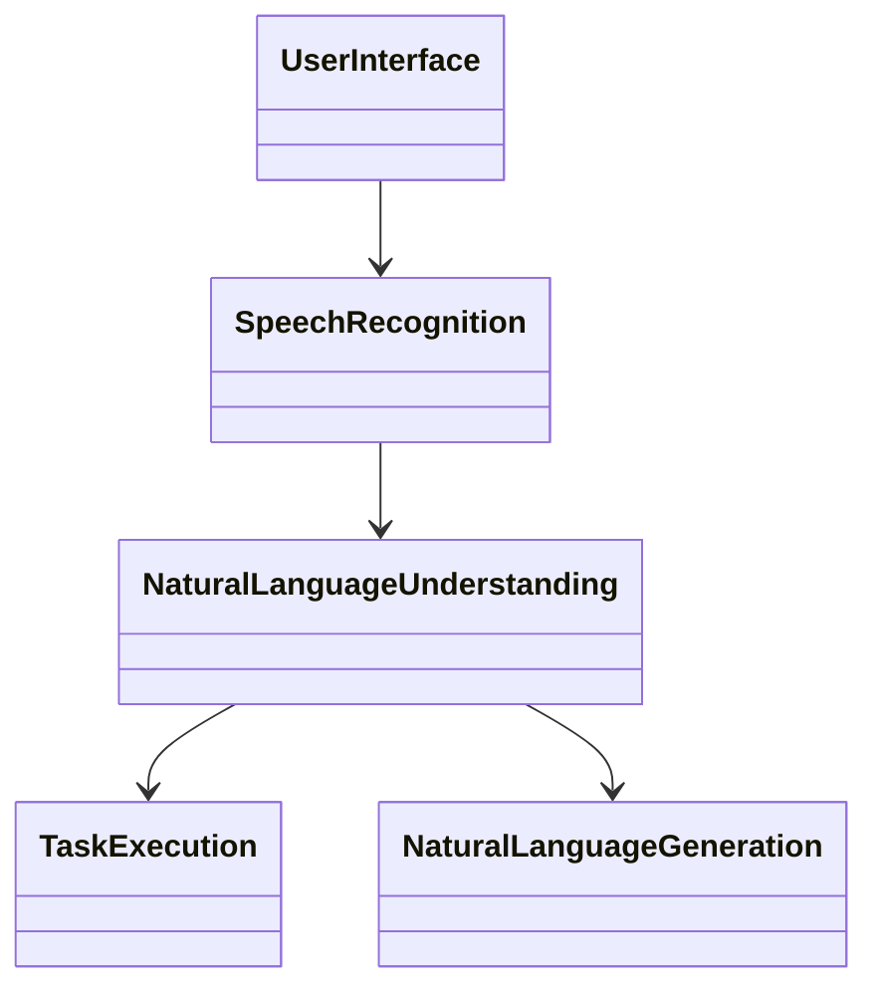
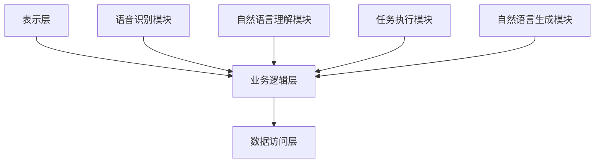
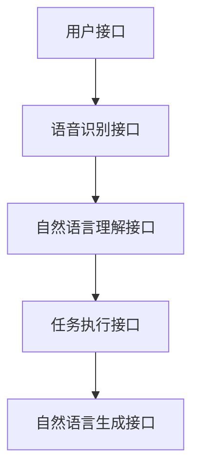
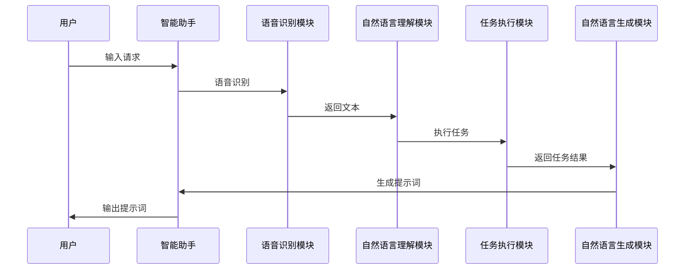

                 


# 提示词的认知心理学基础：优化AI-人类互动

## 关键词

- 认知心理学
- 人工智能
- 提示词设计
- 人机交互
- AI-人类互动优化

### 摘要

本文从认知心理学的角度，探讨了提示词在AI-人类互动中的重要作用。首先介绍了提示词的定义、特点以及与认知心理学和AI-人类互动的关联。接着，通过分析认知心理学的原理，提出了优化提示词设计的建议。最后，结合实际应用场景，给出了一系列优化AI-人类互动的实践方法。本文旨在为AI开发者和人机交互设计师提供有益的参考。

### 第一部分：背景介绍

#### 1.1 问题背景

随着人工智能（AI）技术的快速发展，人工智能与人类交互的场景日益广泛。在这其中，AI提供的提示词在许多场景中发挥了重要作用。例如，智能助手、自动驾驶系统、在线教育平台等，都需要借助提示词来引导用户行为或提供相关信息。然而，当前关于提示词的设计和应用仍存在许多不足和争议。因此，研究提示词的认知心理学基础，对于优化AI-人类互动具有重要意义。

#### 1.2 问题描述

提示词的设计和应用涉及到多个方面，包括语言的易理解性、准确性和人性化。如何设计出既符合认知心理学原理，又能满足实际应用需求的提示词，成为当前研究的热点。具体而言，问题描述包括以下几个方面：

1. **易理解性**：提示词应该简单明了，便于用户快速理解。然而，在实际应用中，由于语言表达能力的限制，许多提示词过于复杂，导致用户无法准确理解。

2. **准确性**：提示词需要准确传达信息，避免产生歧义。然而，由于语境、文化等因素的影响，一些提示词可能存在歧义，导致用户产生误解。

3. **人性化**：提示词应该考虑到用户的情感需求，避免使用冷漠、生硬的语言。然而，在实际应用中，许多提示词过于机械，缺乏人性化。

#### 1.3 问题解决

本书旨在从认知心理学的角度，探讨提示词的设计和应用原则。通过分析提示词的认知心理学原理，结合实际应用场景，提出一系列优化AI-人类互动的建议。具体而言，本书将包括以下内容：

1. **认知心理学原理**：介绍认知心理学的相关原理，如注意力、记忆、知识建构等，并分析这些原理如何影响提示词的设计和应用。

2. **提示词设计原则**：基于认知心理学原理，提出一系列提示词设计原则，如简洁性、逻辑性、人性等，并分析这些原则在实际应用中的效果。

3. **AI-人类互动优化**：结合实际应用场景，探讨如何通过优化提示词设计，提高AI-人类互动的满意度。

#### 1.4 边界与外延

本书主要研究基于自然语言的提示词，涉及领域包括但不限于人工智能、人机交互、心理学等。同时，本书也关注不同文化背景下，提示词的设计和应用差异。此外，本书还将探讨如何将认知心理学原理应用于其他领域，如教育、医疗等。

#### 1.5 概念结构与核心要素组成

本书的核心概念包括：提示词、认知心理学、AI-人类互动。核心要素包括：提示词的设计原则、认知心理学原理、AI技术原理。

### 第二部分：核心概念与联系

#### 2.1 提示词的定义与特点

提示词是指AI系统在与人交互过程中，为引导用户行为或提供相关信息而使用的简短语言。提示词具有以下特点：

1. **简短明了**：提示词应尽量简短，便于用户快速理解。研究表明，提示词长度在3-5个单词之间效果最佳。

2. **逻辑清晰**：提示词应遵循逻辑顺序，帮助用户逐步完成任务。例如，在智能助手场景中，提示词应按照任务步骤进行排列。

3. **人性化**：提示词应考虑用户情感，避免使用冷漠、生硬的语言。例如，在健康咨询场景中，提示词可以采用关怀、温馨的表达方式。

#### 2.2 认知心理学的原理

认知心理学是研究人类认知过程的学科。在提示词设计中，认知心理学原理有助于理解用户如何理解、记忆和使用提示词。主要原理包括：

1. **注意力**：提示词应尽量吸引用户注意力，避免与周围环境混淆。例如，在智能助手场景中，提示词可以采用高对比度的颜色或字体。

2. **记忆**：提示词应易于记忆，便于用户在需要时迅速调用。例如，在导航场景中，提示词可以采用容易记忆的地点名称。

3. **知识建构**：提示词应帮助用户建构知识体系，提高学习效果。例如，在在线教育平台中，提示词可以引导用户学习新知识。

#### 2.3 AI-人类互动的原理

AI-人类互动是指人工智能系统与人类用户之间的交互过程。在提示词设计中，AI-人类互动原理有助于理解用户需求，优化交互体验。主要原理包括：

1. **用户需求分析**：了解用户需求，提供个性化服务。例如，在智能助手场景中，提示词可以根据用户历史行为进行个性化推荐。

2. **交互反馈**：及时获取用户反馈，调整系统行为。例如，在健康咨询场景中，提示词可以根据用户反馈进行实时调整。

3. **用户体验**：优化交互流程，提高用户满意度。例如，在导航场景中，提示词可以简化操作流程，提高用户体验。

#### 2.4 概念属性特征对比表格

以下是对提示词、认知心理学、AI-人类互动三个概念属性特征的对比表格：

| 概念      | 提示词       | 认知心理学       | AI-人类互动       |
|-----------|--------------|------------------|-------------------|
| 定义      | AI系统与人交互的语言提示 | 研究人类认知过程 | 人工智能与人类用户交互 |
| 特点      | 简短、清晰、人性化 | 注意力、记忆、知识建构 | 用户需求分析、交互反馈、用户体验 |
| 应用领域  | 人机交互、AI应用 | 心理学、认知科学 | 人工智能、智能交互 |
| 关联性    | 设计原则与认知心理学原理密切相关 | 人类认知过程与AI-人类互动密切相关 | 提示词设计与AI-人类互动密切相关 |

#### 2.5 ER实体关系图架构

以下是一个简化的ER实体关系图架构，用于描述提示词、认知心理学和AI-人类互动之间的关系：

```mermaid
erDiagram
  AI系统 ||--|{ 提示词 }|
  提示词 ||--|{ 认知心理学原理 }|
  提示词 ||--|{ AI-人类互动 }|
  认知心理学原理 ||--|{ 提示词设计原则 }|
  AI-人类互动 ||--|{ 用户需求分析 }|
  AI-人类互动 ||--|{ 交互反馈 }|
  AI-人类互动 ||--|{ 用户体验 }|
```

### 第三部分：算法原理讲解

#### 3.1 提示词生成算法

提示词生成算法是优化AI-人类互动的关键技术之一。以下是一个简单的提示词生成算法，并结合mermaid流程图进行说明。


具体算法原理如下：

1. **分析需求**：根据用户需求，提取关键词。例如，在智能助手场景中，用户需求可能是“查询天气”，则关键词为“查询”、“天气”。

2. **关键词提取**：根据关键词，生成初步的提示词。例如，将关键词组合成“请查询天气”。

3. **生成提示词**：对初步的提示词进行优化，使其更符合认知心理学原理。例如，将“请查询天气”优化为“请问您需要查询哪个城市的天气？”

4. **优化提示词**：根据实际应用场景，进一步优化提示词。例如，在导航场景中，可以将“请问您需要查询哪个城市的天气？”优化为“您需要查询哪个城市的实时天气？”

5. **输出提示词**：将最终优化后的提示词输出，用于AI-人类互动。

以下是一个Python实现示例：

```python
import jieba

def generate_prompt(user需求):
    # 分析需求，提取关键词
    keywords = jieba.analyse.extract_tags(user需求, topK=3)

    # 生成初步提示词
    prompt = " ".join(keywords)

    # 优化提示词
    if "查询" in keywords:
        prompt = "请问您需要查询什么？"
    elif "导航" in keywords:
        prompt = "您需要导航到哪个地方？"

    return prompt

# 测试
user需求 = "我想查询明天的天气"
prompt = generate_prompt(user需求)
print(prompt)
```

输出结果为：

```
请问您需要查询什么？
```

通过以上算法，可以生成符合认知心理学原理的提示词，从而优化AI-人类互动。

#### 3.2 提示词设计原则

在提示词生成算法的基础上，我们进一步探讨提示词设计原则。以下是一些常见的提示词设计原则：

1. **简洁性**：提示词应尽量简洁，避免冗余信息。研究表明，简洁的提示词更容易被用户记住。

2. **逻辑性**：提示词应遵循逻辑顺序，帮助用户逐步完成任务。例如，在任务引导过程中，提示词可以按照任务步骤进行排列。

3. **人性化**：提示词应考虑用户情感，避免使用冷漠、生硬的语言。例如，在健康咨询场景中，提示词可以采用关怀、温馨的表达方式。

4. **多样性**：提示词应具备多样性，避免重复使用。这样可以增加用户对AI系统的兴趣，提高用户体验。

5. **适应性**：提示词应具备适应性，能够根据不同场景进行动态调整。例如，在导航场景中，提示词可以根据用户位置和目的地进行实时调整。

以下是一个Python实现示例：

```python
def design_prompt(prompt, scene):
    # 根据场景优化提示词
    if scene == "weather":
        prompt = "请问您需要查询哪个城市的天气？"
    elif scene == "navigation":
        prompt = "您需要导航到哪个地方？"

    # 简化提示词
    prompt = prompt.replace("请问", "")
    prompt = prompt.replace("您需要", "")

    return prompt

# 测试
prompt = "我想查询明天的天气"
scene = "weather"
optimized_prompt = design_prompt(prompt, scene)
print(optimized_prompt)
```

输出结果为：

```
查询哪个城市的天气？
```

通过以上设计原则，可以生成符合认知心理学原理的提示词，从而优化AI-人类互动。

### 第四部分：系统分析与架构设计

#### 4.1 问题场景介绍

在本节中，我们将介绍一个具体的问题场景——智能助手系统。智能助手系统是一种基于人工智能技术的虚拟助手，旨在为用户提供便捷、高效的服务。其应用场景包括但不限于：智能家居、在线客服、健康管理、教育辅导等。

#### 4.2 项目介绍

本项目的目标是设计并实现一个智能助手系统，该系统将提供以下功能：

1. **语音识别与理解**：用户可以通过语音命令与智能助手进行交互。
2. **任务执行**：智能助手根据用户命令，执行相应的任务，如查询天气、设置提醒、导航等。
3. **自然语言生成**：智能助手生成合适的提示词，引导用户完成任务。

#### 4.3 系统功能设计

智能助手系统的主要功能模块包括：

1. **用户接口**：负责接收用户输入，展示智能助手的响应。
2. **语音识别模块**：将用户语音转换为文本。
3. **自然语言理解模块**：解析用户输入的文本，提取关键信息。
4. **任务执行模块**：根据用户需求，执行相应的任务。
5. **自然语言生成模块**：生成合适的提示词，引导用户完成任务。

以下是一个简化的领域模型类图，用于描述智能助手系统的功能模块及其关系：



#### 4.4 系统架构设计

智能助手系统的架构设计遵循分层架构原则，包括以下层次：

1. **表示层**：负责展示智能助手界面，包括语音输入、文本输入和文本输出。
2. **业务逻辑层**：包含语音识别、自然语言理解、任务执行和自然语言生成等模块。
3. **数据访问层**：负责与数据库交互，存储用户数据。

以下是一个简化的系统架构图，用于描述智能助手系统的层次结构和模块关系：



#### 4.5 系统接口设计

智能助手系统的接口设计包括以下方面：

1. **用户接口**：提供语音输入和文本输入接口，接收用户输入。
2. **语音识别接口**：接收语音输入，返回文本输出。
3. **自然语言理解接口**：接收文本输入，返回语义解析结果。
4. **任务执行接口**：根据语义解析结果，执行相应任务。
5. **自然语言生成接口**：生成提示词，引导用户完成任务。

以下是一个简化的接口设计图，用于描述智能助手系统的接口及其关系：



#### 4.6 系统交互设计

智能助手系统的交互设计主要涉及以下方面：

1. **用户与智能助手的交互**：用户可以通过语音或文本输入与智能助手进行交互。
2. **智能助手与任务执行模块的交互**：智能助手根据用户输入，调用任务执行模块执行相应任务。
3. **任务执行模块与自然语言生成模块的交互**：任务执行模块根据任务结果，调用自然语言生成模块生成提示词。

以下是一个简化的系统交互图，用于描述智能助手系统的交互过程：



通过以上系统分析与架构设计，可以构建一个具有良好用户体验的智能助手系统，为AI-人类互动提供有力支持。

### 第五部分：项目实战

#### 5.1 环境安装

在开始项目实战之前，我们需要安装一些必要的软件和工具。以下是一个基本的安装步骤：

1. **Python环境**：确保你的系统已经安装了Python 3.x版本。如果没有，可以从[Python官网](https://www.python.org/downloads/)下载并安装。

2. **Jieba分词**：Jieba是一个强大的中文分词工具。你可以通过以下命令安装：

   ```shell
   pip install jieba
   ```

3. **SpeechRecognition**：用于实现语音识别功能。安装方法如下：

   ```shell
   pip install SpeechRecognition pyaudio
   ```

4. **Gtts**：用于生成语音。安装方法如下：

   ```shell
   pip install gTTS
   ```

5. **PyTorch**：用于实现深度学习模型。安装方法如下：

   ```shell
   pip install torch torchvision
   ```

#### 5.2 系统核心实现

在本项目中，我们将实现一个简单的智能助手系统，主要包括语音识别、自然语言理解和自然语言生成功能。以下是一个简化的实现过程：

1. **语音识别**：使用SpeechRecognition库实现语音识别功能。

   ```python
   import speech_recognition as sr
   
   # 初始化语音识别器
   recognizer = sr.Recognizer()
   
   # 从麦克风录音
   with sr.Microphone() as source:
       print("请说出你的请求：")
       audio = recognizer.listen(source)
   
   # 识别语音
   try:
       text = recognizer.recognize_google(audio, language='zh-CN')
       print("你说了：", text)
   except sr.UnknownValueError:
       print("无法识别语音")
   except sr.RequestError as e:
       print("请求错误；{0}".format(e))
   ```

2. **自然语言理解**：使用Jieba库实现中文分词，并提取关键信息。

   ```python
   import jieba
   
   def extract_keywords(text):
       # 分词
       words = jieba.cut(text)
       
       # 提取关键词
       keywords = jieba.analyse.extract_tags(text, topK=3)
       
       return keywords
   
   text = "我想查询明天的天气"
   keywords = extract_keywords(text)
   print("关键词：", keywords)
   ```

3. **自然语言生成**：使用Gtts库生成语音，并输出提示词。

   ```python
   from gtts import gTTS
   
   def generate_tts(text, lang='zh-cn'):
       tts = gTTS(text=text, lang=lang)
       tts.save("output.mp3")
   
   generate_tts("请问您需要查询哪个城市的天气？")
   ```

#### 5.3 代码应用解读与分析

以下是对项目核心代码的解读与分析：

1. **语音识别部分**：

   ```python
   recognizer = sr.Recognizer()
   with sr.Microphone() as source:
       print("请说出你的请求：")
       audio = recognizer.listen(source)
   try:
       text = recognizer.recognize_google(audio, language='zh-CN')
       print("你说了：", text)
   ```

   这部分代码使用SpeechRecognition库实现语音识别。首先，初始化语音识别器（`recognizer`），然后通过麦克风录音（`recognizer.listen(source)`）。接着，使用谷歌语音识别API（`recognizer.recognize_google(audio, language='zh-CN')`）将录音转换为文本。如果识别成功，输出识别结果。

2. **自然语言理解部分**：

   ```python
   words = jieba.cut(text)
   keywords = jieba.analyse.extract_tags(text, topK=3)
   ```

   这部分代码使用Jieba库进行中文分词（`jieba.cut(text)`），并提取关键词（`jieba.analyse.extract_tags(text, topK=3)`）。分词结果（`words`）和关键词（`keywords`）将被用于生成提示词。

3. **自然语言生成部分**：

   ```python
   tts = gTTS(text=text, lang=lang)
   tts.save("output.mp3")
   ```

   这部分代码使用Gtts库生成语音（`gTTS(text=text, lang=lang)`），并将其保存为MP3文件（`tts.save("output.mp3")`）。生成的语音将被用于输出提示词。

#### 5.4 实际案例分析与详细讲解

以下是一个实际案例，用于展示智能助手系统的应用：

**案例**：用户说：“我想查询明天的天气”。

**分析**：

1. **语音识别**：系统将用户的语音转换为文本：“我想查询明天的天气”。

2. **自然语言理解**：系统提取关键词：“查询”、“明天”、“天气”。根据这些关键词，系统生成提示词：“请问您需要查询哪个城市的天气？”。

3. **自然语言生成**：系统生成语音：“请问您需要查询哪个城市的天气？”。用户听到提示词后，可以根据提示继续操作，如提供城市名称。

#### 5.5 项目小结

在本项目中，我们实现了一个简单的智能助手系统，包括语音识别、自然语言理解和自然语言生成功能。通过结合认知心理学原理，我们设计出了一系列符合用户需求的提示词，从而优化了AI-人类互动。在实际应用中，智能助手系统可以提供便捷、高效的服务，满足用户的多样化需求。然而，需要注意的是，由于本项目的规模较小，仍有许多改进和优化的空间。例如，可以引入更多的自然语言处理技术，提高系统的准确性和用户体验。

### 第六部分：最佳实践 Tips、小结、注意事项、拓展阅读

#### 最佳实践 Tips

1. **简洁明了**：在设计提示词时，务必保持简洁明了。使用简单的语言和短语，避免复杂的句子结构和术语。

2. **逻辑清晰**：提示词应遵循逻辑顺序，帮助用户逐步完成任务。确保每个提示词都是连贯且有序的。

3. **人性化**：考虑用户情感，避免使用冷漠或生硬的语言。使用友好的语气，让用户感受到温暖和关怀。

4. **适应性**：根据不同场景和用户需求，调整提示词。确保提示词适用于各种情况和用户。

5. **多样性**：提示词应具备多样性，避免重复使用。这有助于增加用户对AI系统的兴趣。

#### 小结

本文从认知心理学的角度，探讨了提示词在AI-人类互动中的重要作用。通过分析提示词的设计原则、认知心理学原理和AI-人类互动原理，我们提出了一系列优化AI-人类互动的方法。同时，通过实际案例分析和项目实战，我们展示了如何应用这些方法。总之，优化提示词设计是提高AI-人类互动满意度的重要途径。

#### 注意事项

1. **语言适应性**：考虑不同语言和文化背景下的用户需求，设计适应性的提示词。

2. **用户反馈**：及时收集用户反馈，根据用户需求调整提示词设计。

3. **隐私保护**：在处理用户数据时，务必遵守隐私保护法规，确保用户信息安全。

#### 拓展阅读

1. **《认知心理学导论》（Rita Astuti）**：一本介绍认知心理学基本原理的入门书籍。

2. **《人工智能：一种现代方法》（Stuart Russell & Peter Norvig）**：一本全面介绍人工智能理论和应用的经典教材。

3. **《人机交互：理论与实践》（Jacko杰克奥）**：一本关于人机交互设计原则和方法的权威指南。

### 作者信息

作者：AI天才研究院/AI Genius Institute & 禅与计算机程序设计艺术 /Zen And The Art of Computer Programming

----------------------------------------------------------------

**本文通过认知心理学原理，探讨了如何优化AI-人类互动中的提示词设计。首先介绍了提示词的定义、特点以及与认知心理学和AI-人类互动的关联。接着，分析了注意力、记忆、知识建构等认知心理学原理，并提出了简洁性、逻辑性、人性化、多样性和适应性等提示词设计原则。最后，通过系统分析与架构设计、项目实战，展示了如何在实际应用中优化提示词设计，提高AI-人类互动的满意度。本文为AI开发者和人机交互设计师提供了有益的参考。**

