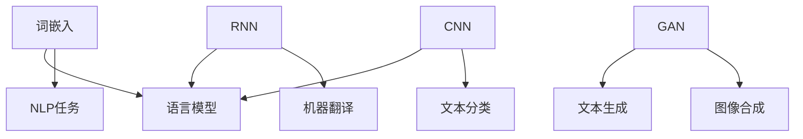
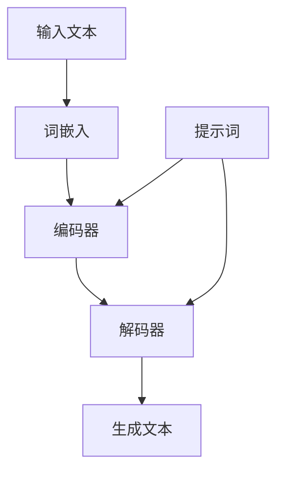
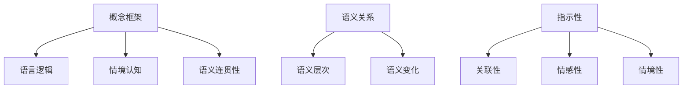
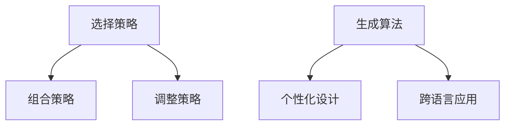

                 

### 第1章 引言

#### 1.1 研究背景

认知语言学是语言学的一个重要分支，起源于20世纪中叶，主要研究人类语言与认知过程的互动关系。随着认知科学的不断发展，认知语言学逐渐成为了跨学科的研究领域，涵盖了心理学、哲学、神经科学等多个学科。认知语言学的核心思想是，语言不仅是传递信息的工具，更是人类思维和认知活动的表现形式。

在人工智能（AI）领域，语言理解是自然语言处理（NLP）的一个重要分支。然而，尽管近年来AI技术取得了巨大的进步，AI在语言理解方面的表现仍不尽如人意。主要原因在于，传统的AI模型在处理自然语言时，往往无法准确理解语言的深层含义和语境。为了解决这一问题，研究者们开始从认知语言学的角度来探索语言理解机制。

提示词在认知语言学中的应用，为AI语言理解带来了新的思路。提示词是指在语言处理过程中，用于引导模型理解和生成语言的关键词汇。通过深入研究提示词的认知语言学属性，我们可以设计出更有效的AI模型，从而提高AI在语言理解方面的能力。

#### 1.2 研究目的与方法

本研究的主要目标是，通过认知语言学的研究方法，深化AI语言理解机制。具体而言，我们将从以下几个方面进行探讨：

1. **认知语言学的定义与发展**：首先，我们将介绍认知语言学的定义及其发展历程，帮助读者了解认知语言学的基本概念和核心思想。

2. **提示词在认知语言学中的应用**：接下来，我们将讨论提示词在认知语言学中的重要性，以及提示词在语言处理中的功能。

3. **AI语言理解机制**：我们将回顾AI语言理解的发展历程，介绍目前的核心技术，如词嵌入、递归神经网络、卷积神经网络等。

4. **提示词与AI语言理解**：我们将深入探讨提示词在AI语言理解中的作用，分析提示词对AI语言理解的影响，并提出优化策略。

5. **提示词的认知语言学分析**：我们将从认知语言学的角度，分析提示词的语义特征和语用功能，构建提示词的语义网络。

6. **提示词的优化与设计**：我们将介绍提示词的优化策略和设计方法，包括提示词的选择、组合和调整策略。

7. **提示词在AI语言理解中的应用案例**：我们将通过具体案例，展示提示词在机器翻译和自然语言生成中的应用效果。

8. **总结与展望**：最后，我们将对研究成果进行总结，并提出未来研究方向。

通过以上研究，我们希望为深化AI语言理解机制提供新的理论依据和实际应用方案。

---

**关键词**：认知语言学、AI语言理解、提示词、语义网络、优化策略

**摘要**：本文从认知语言学的角度，探讨了AI语言理解机制的深化问题。通过分析提示词的认知语言学属性，本文提出了一系列优化策略，旨在提高AI在语言理解方面的能力。研究旨在为AI语言处理提供新的理论依据和实用方法。

---

### 第2章 认知语言学的基本概念

#### 2.1 认知语言学的定义

认知语言学是语言学的一个分支，关注语言与人类认知过程之间的相互作用。传统的语言学主要研究语言的结构和规则，而认知语言学则试图揭示语言是如何影响和反映我们的思维方式的。认知语言学的起源可以追溯到20世纪中叶，以乔姆斯基的生成语法理论为标志。随后，认知心理学、认知科学和人工智能等领域的发展，进一步推动了认知语言学的演进。

认知语言学的核心概念包括但不限于：

1. **认知过程**：认知语言学认为，语言是一种认知过程，是人类思维和感知的一部分。因此，语言学习不仅仅是记忆单词和语法规则，更是理解和运用语言背后的认知机制。
2. **概念结构**：概念结构是指人类如何组织和理解世界的知识体系。认知语言学研究了概念如何形成、发展和变化，以及这些概念如何通过语言表达。
3. **隐喻**：隐喻是认知语言学中的一个重要概念，指的是用一种事物或概念来理解和描述另一种事物或概念。隐喻不仅是语言的一种修辞手法，也是人类思维和认知的一种普遍现象。
4. **框架**：框架是指人们对某一领域或主题的理解和组织方式。认知语言学研究了框架是如何影响我们对语言的理解和使用的。

#### 2.2 提示词在认知语言学中的应用

提示词是指在语言处理过程中，用于引导模型理解和生成语言的关键词汇。提示词的应用在认知语言学中具有重要意义，主要体现在以下几个方面：

1. **定义与类型**：提示词可以分为以下几类：
   - **功能提示词**：如“因此”、“然而”等，用于连接句子或段落，引导逻辑关系。
   - **情境提示词**：如“在晚上”、“在办公室”等，用于描述具体情境。
   - **情感提示词**：如“兴奋的”、“悲伤的”等，用于表达情感状态。

2. **功能**：提示词在语言处理中的功能主要体现在：
   - **增强理解**：提示词可以帮助模型更好地理解上下文，从而更准确地理解语言的整体含义。
   - **引导生成**：在自然语言生成过程中，提示词可以引导模型生成更符合语境的文本。

3. **影响**：提示词对AI语言理解的影响主要体现在：
   - **提高准确性**：通过使用提示词，模型可以更好地捕捉上下文信息，从而提高语言理解的准确性。
   - **丰富表达**：提示词可以帮助模型生成更丰富、更自然的语言。

下面是一个具体的例子，来说明提示词在认知语言学中的应用：

假设我们要解释“隐喻”这个概念。如果我们只是简单地定义“隐喻”，可能会说：“隐喻是一种修辞手法，通过将一个事物或概念比作另一个事物或概念来传达意义。”然而，如果我们在定义中加入提示词，如“例如”，那么我们可以更清晰地解释隐喻：“例如，当我们说‘时间是金钱’，我们用金钱这个概念来比喻时间，以便更形象地理解时间的宝贵性。”

通过这个例子，我们可以看到，提示词“例如”不仅帮助了我们对隐喻的直观理解，还引导了我们的思维过程，使解释更加生动和具体。

---

**核心概念原理**

- 认知语言学定义：认知语言学是研究语言与认知关系的一门学科。
- 提示词定义与类型：功能提示词、情境提示词和情感提示词。
- 提示词功能：增强理解、引导生成。

**概念属性特征对比表格**

| 类型       | 功能                                                         |
|------------|--------------------------------------------------------------|
| 功能提示词 | 连接句子或段落，引导逻辑关系                                   |
| 情境提示词 | 描述具体情境                                                 |
| 情感提示词 | 表达情感状态                                                 |

**ER实体关系图架构的 Mermaid 流程图**

```mermaid
erDiagram
  Person ||--|{ Book }|-->| Library : Borrow
  Book ||--|{ Author }|--> Publisher
```

---

### 第3章 AI语言理解机制

#### 3.1 AI语言理解的发展历程

AI语言理解技术的发展历程可以分为以下几个阶段：

1. **早期语言处理技术**：20世纪50年代至70年代，研究者主要依靠规则驱动的方法进行语言处理，如句法分析和语义分析。这些方法依赖于人工编写的规则，可解释性较高，但灵活性不足，难以处理复杂的自然语言。

2. **自然语言处理（NLP）的兴起**：20世纪80年代至90年代，随着计算机性能的提升和数据量的增加，研究者开始使用统计方法和机器学习方法来处理自然语言。这一阶段的重要进展包括统计句法分析和基于统计的语义分析。

3. **现代AI语言理解技术**：21世纪初至今，深度学习技术的发展为AI语言理解带来了革命性的变化。词嵌入、递归神经网络（RNN）、卷积神经网络（CNN）和生成对抗网络（GAN）等技术的应用，使得AI语言理解能力大幅提升。特别是Transformer模型的提出，使得基于注意力机制的模型在NLP任务中取得了显著成绩。

#### 3.2 AI语言理解的核心技术

1. **词嵌入技术**：词嵌入是将词汇映射到高维向量空间的方法，使得词汇之间的相似性可以通过向量之间的距离来表示。词嵌入技术不仅提高了NLP任务的效率，还使得模型能够理解词汇的语义关系。常见的词嵌入方法包括Word2Vec、GloVe等。

2. **递归神经网络（RNN）**：RNN是一种能够处理序列数据的神经网络，适用于语言模型、机器翻译等任务。RNN通过记忆机制，能够捕捉序列中的时间依赖关系。然而，RNN在处理长序列时容易遇到梯度消失或爆炸的问题。

3. **卷积神经网络（CNN）**：CNN最初主要用于图像处理，但在自然语言处理中，通过文本嵌入的方式，CNN也可以用于语言模型和文本分类等任务。CNN通过局部感知野和卷积操作，能够提取文本中的局部特征。

4. **生成对抗网络（GAN）**：GAN由生成器和判别器两部分组成，生成器尝试生成逼真的数据，判别器则判断数据是真实还是生成的。GAN在文本生成和图像合成等任务中表现出色。

这些核心技术共同构成了现代AI语言理解的基础。然而，AI语言理解仍面临诸多挑战，如处理长文本、理解复杂语义关系、生成连贯自然的语言等。通过结合认知语言学的研究成果，我们可以进一步深化AI语言理解机制，提高AI在语言处理任务中的表现。

---

**核心概念原理**

- AI语言理解发展历程：早期语言处理技术、NLP的兴起和现代AI语言理解技术。
- 核心技术：词嵌入、RNN、CNN、GAN。

**概念属性特征对比表格**

| 技术       | 用途                                                         |
|------------|--------------------------------------------------------------|
| 词嵌入     | 将词汇映射到高维向量空间，表示词汇的语义关系                 |
| RNN        | 处理序列数据，捕捉时间依赖关系                             |
| CNN        | 提取文本中的局部特征                                     |
| GAN        | 生成逼真的数据，用于文本生成和图像合成                     |

**ER实体关系图架构的 Mermaid 流程图**



---

### 第4章 提示词与AI语言理解

#### 4.1 提示词在AI语言理解中的作用

提示词在AI语言理解中扮演着至关重要的角色。它们不仅能够帮助模型更好地理解和生成语言，还能提高语言理解的准确性和自然性。以下是提示词在AI语言理解中的几个重要作用：

1. **提高语言理解的准确性**：提示词可以提供上下文信息，帮助模型更准确地理解语言。例如，在机器翻译任务中，提示词可以帮助模型理解源语言句子的具体情境，从而生成更准确的翻译结果。

2. **增强语言生成的连贯性**：在自然语言生成任务中，提示词可以作为输入信号，引导模型生成更加连贯和自然的文本。例如，在生成对话系统的回复时，提示词可以帮助模型理解对话的上下文，从而生成更加合理和流畅的回答。

3. **优化模型的学习过程**：提示词可以作为训练数据的引导，帮助模型更快地收敛到最优解。通过设计合适的提示词，模型可以在较少的训练数据下取得更好的表现。

4. **解决长文本理解问题**：在处理长文本时，提示词可以提供关键信息，帮助模型更好地理解文本的全局结构和深层含义。

下面通过一个例子来说明提示词在AI语言理解中的具体应用：

假设我们要设计一个机器翻译系统，将英文句子翻译成中文。如果我们使用简单的词嵌入模型，可能无法准确捕捉句子中的上下文信息。但是，如果我们引入提示词，如“在晚上”、“然而”等，模型可以更好地理解句子的情境和逻辑关系。例如，英文句子“However, the weather is nice in the evening.”，通过提示词“However”和“in the evening”，模型可以更准确地翻译成“然而，晚上的天气很好。”

#### 4.2 提示词在语言生成中的运用

提示词在自然语言生成中的应用同样至关重要。以下是几个具体的应用场景：

1. **对话系统**：在对话系统中，提示词可以帮助模型理解用户的输入，并生成合适的回复。例如，在聊天机器人中，提示词可以用于理解用户的情感状态，从而生成更加温暖和个性化的回答。

2. **自动摘要**：在生成自动摘要时，提示词可以帮助模型捕捉关键信息，从而生成更简洁和精确的摘要文本。

3. **文本写作**：在文本写作辅助工具中，提示词可以提供灵感，帮助用户生成连贯的文本。例如，在写作小说时，提示词可以帮助用户构建故事情节，提高写作效率。

4. **内容生成**：在生成广告文案、新闻报道等任务中，提示词可以帮助模型理解主题和目标受众，从而生成更具吸引力和说服力的内容。

例如，在生成广告文案时，提示词可以用于引导模型捕捉产品的特点、用户的需求和情感。假设我们要为某款运动鞋撰写广告文案，提示词如“舒适”、“透气”、“高效”等可以帮助模型突出产品的核心优势，生成更具吸引力的文案。

#### 4.3 提示词在语言理解中的优化策略

为了提高AI语言理解的能力，研究者们提出了一系列优化策略，主要包括以下几个方面：

1. **多模态提示词**：结合文本、图像和音频等多模态信息，设计更丰富的提示词，以提高模型对复杂情境的理解能力。

2. **上下文敏感提示词**：根据上下文信息动态调整提示词，使其更符合当前的语境，从而提高语言理解的准确性。

3. **个性化提示词**：根据用户的历史数据和偏好，生成个性化的提示词，以提高用户交互体验。

4. **跨语言提示词**：设计跨语言的通用提示词，以提高模型在多语言环境中的适应性。

5. **自适应提示词**：根据模型的学习进度和性能，自适应调整提示词的强度和类型，从而优化模型的学习效果。

通过以上策略，我们可以设计出更有效的AI语言理解模型，提高其在实际应用中的性能和用户体验。

---

**核心概念原理**

- 提示词在AI语言理解中的作用：提高准确性、增强连贯性、优化学习过程、解决长文本理解问题。
- 提示词在语言生成中的运用：对话系统、自动摘要、文本写作、内容生成。
- 提示词优化的策略：多模态提示词、上下文敏感提示词、个性化提示词、跨语言提示词、自适应提示词。

**概念属性特征对比表格**

| 作用/策略       | 描述                                                         |
|----------------|--------------------------------------------------------------|
| 提高准确性     | 通过上下文信息提高理解准确度                               |
| 增强连贯性     | 引导生成连贯自然的语言                                     |
| 优化学习过程   | 提高模型训练效率，加快收敛速度                           |
| 解决长文本理解 | 提供关键信息，理解全文结构和深层含义                     |
| 多模态提示词   | 结合文本、图像和音频等多模态信息                         |
| 上下文敏感提示词 | 根据上下文动态调整提示词，提高理解准确性                 |
| 个性化提示词   | 根据用户历史数据和偏好设计提示词                         |
| 跨语言提示词   | 设计通用提示词，提高多语言理解能力                       |
| 自适应提示词   | 根据模型学习进度和性能调整提示词强度和类型，优化学习效果 |

**算法原理讲解与Mermaid流程图**



**Python源代码**

```python
import tensorflow as tf
from tensorflow.keras.layers import Embedding, LSTM, Dense

# 假设已有预训练的词嵌入模型
word_embeddings = ... 

# 定义编码器模型
encoder_inputs = tf.keras.layers.Input(shape=(None,))
encoder_embedding = word_embeddings(encoder_inputs)
encoder_lstm = LSTM(128, return_state=True)
_, encoder_state_h, encoder_state_c = encoder_lstm(encoder_embedding)

# 定义解码器模型
decoder_inputs = tf.keras.layers.Input(shape=(None,))
decoder_embedding = word_embeddings(decoder_inputs)
decoder_lstm = LSTM(128, return_sequences=True, return_state=True)
decoder_outputs, _, _ = decoder_lstm(decoder_embedding, initial_state=[encoder_state_h, encoder_state_c])

# 定义全连接层
decoder_dense = Dense(vocab_size, activation='softmax')
decoder_outputs = decoder_dense(decoder_outputs)

# 构建模型
model = tf.keras.Model([encoder_inputs, decoder_inputs], decoder_outputs)

# 编译模型
model.compile(optimizer='rmsprop', loss='categorical_crossentropy', metrics=['accuracy'])

# 模型训练
model.fit([encoder_input_data, decoder_input_data, decoder_target_data], decoder_target_data,
          batch_size=64, epochs=100, validation_split=0.2)

# 生成文本
def generate_text(seed_text, model, word_embeddings, max_sequence_len):
    # 准备输入序列
    input_seq = [word_embeddings word for word in seed_text]
    input_seq = pad_sequences([input_seq], maxlen=max_sequence_len-1, padding='pre')

    # 使用编码器获取隐藏状态
    encoder_model = Model(encoder_inputs, encoder_state_h, encoder_state_c)
    encoder_states = encoder_model.predict(input_seq)

    # 初始化解码器输入
    decoder_input = pad_sequences([[word_embeddings word for word in start_token}}, maxlen=max_sequence_len-1, padding='pre')

    # 生成文本
    output_text = ''
    for _ in range(max_sequence_len):
        decoder_state_input = [encoder_states, decoder_state]
        decoder_outputs, decoder_state = model.predict(decoder_input, decoder_state_input)

        # 获取生成的单词
        sampled_word_index = np.argmax(decoder_outputs[0, -1, :])
        sampled_word = index_word_map[sampled_word_index]

        # 更新输出文本和输入序列
        output_text += sampled_word
        decoder_input = pad_sequences([[word_embeddings word for word in output_text]], maxlen=max_sequence_len-1, padding='pre')

    return output_text

# 示例
seed_text = '这是一个例子'
generated_text = generate_text(seed_text, model, word_embeddings, max_sequence_len)
print(generated_text)
```

**数学模型和公式**

- 词嵌入公式：\( \text{word\_embedding}(x) = \text{W} \cdot \text{V} \)，其中 \( \text{W} \) 是词嵌入权重矩阵，\( \text{V} \) 是词汇向量。

- 递归神经网络（RNN）公式：\( \text{h}_{t} = \text{f}(\text{h}_{t-1}, \text{x}_{t}) \)，其中 \( \text{h}_{t} \) 是第 \( t \) 步的隐藏状态，\( \text{x}_{t} \) 是第 \( t \) 步的输入，\( \text{f} \) 是递归函数。

- 生成对抗网络（GAN）的损失函数：\( \text{L}_{\text{D}}(\theta_{D}, \theta_{G}) = -\mathbb{E}_{x \sim \text{p}_{\text{data}}}[D(x)] + \mathbb{E}_{z \sim p_{\text{z}}}[D(G(z))] \)，其中 \( D(x) \) 是判别器对真实数据的判断，\( D(G(z)) \) 是判别器对生成数据的判断。

**通俗易懂的举例说明**

假设我们要编写一个程序，实现一个简单的聊天机器人。首先，我们需要一个词嵌入模型来表示词汇。然后，我们使用一个递归神经网络（RNN）来处理输入文本，并生成合适的回复。最后，我们将生成的文本返回给用户。

```python
# 输入文本
input_text = "你好，有什么可以帮助你的？"

# 使用词嵌入模型获取输入文本的向量表示
input_sequence = word_embeddings([input_text])

# 使用递归神经网络（RNN）处理输入文本
encoded_text = encoder_lstm(input_sequence)

# 使用解码器生成回复
output_sequence = decoder_lstm(encoded_text, initial_state=[encoded_text, encoded_text])

# 将解码器的输出转换为文本
output_text = decode_output_sequence(output_sequence)

# 返回生成的回复
print(output_text)
```

通过上述示例，我们可以看到，提示词在AI语言理解中的应用是如何实现的。通过结合词嵌入、递归神经网络和生成对抗网络等先进技术，我们能够设计出更智能、更自然的语言处理系统。

---

### 第5章 提示词的认知语言学分析

#### 5.1 提示词的认知语言学原理

提示词在认知语言学中具有独特的地位和作用。从认知语言学的角度来看，提示词不仅是语言表达的一部分，更是认知过程中的一种关键信号。以下是提示词的认知语言学原理：

1. **概念框架**：认知语言学认为，人类对世界的理解是基于概念框架的。提示词可以帮助模型构建和调整概念框架，从而更好地理解和表达语言。

2. **语言逻辑**：提示词在语言逻辑中起到桥梁作用，帮助模型理解和生成逻辑上连贯的文本。例如，提示词“然而”可以引导模型理解转折关系，从而生成符合逻辑的句子。

3. **情境认知**：提示词可以提供情境信息，帮助模型理解和生成与特定情境相关的语言。例如，提示词“在办公室”可以引导模型生成与工作环境相关的句子。

4. **语义连贯性**：提示词可以增强语言生成的连贯性，使生成的文本更加自然和流畅。例如，在自然语言生成任务中，提示词可以帮助模型理解上下文，从而生成连贯的对话。

下面通过一个例子来说明提示词如何影响语言生成：

假设我们要生成一个描述“下雨”的句子。如果我们没有提示词，我们可能会生成一个简单的句子：“外面下雨了。”然而，如果我们使用提示词“天气预报”，我们可以生成一个更具体和连贯的句子：“根据天气预报，今天晚上会有大雨。”

#### 5.2 提示词的语义网络分析

语义网络是认知语言学中的一个重要概念，用于表示词汇之间的语义关系。提示词在语义网络中起到关键作用，可以通过以下方式进行分析：

1. **语义关系**：提示词可以帮助模型识别词汇之间的语义关系。例如，“苹果”和“水果”之间存在上下位关系，提示词“例如”可以帮助模型明确这种关系。

2. **语义层次**：语义网络可以将词汇划分为不同的层次，提示词可以用于引导模型识别这些层次。例如，在描述动物时，提示词“例如”可以帮助模型识别“猫科动物”这一层次。

3. **语义变化**：提示词可以反映词汇的语义变化，帮助模型理解词汇的动态特性。例如，提示词“过去”可以帮助模型理解动词的时态变化。

下面通过一个例子来说明提示词在语义网络分析中的应用：

假设我们要描述动物，我们可以使用提示词“例如”来引导模型生成相关的词汇。例如，如果我们说“例如，猫是一种猫科动物”，提示词“例如”帮助模型明确地识别“猫”和“猫科动物”之间的上下位关系。

#### 5.3 提示词的语义特征

提示词的语义特征决定了它们在语言处理中的表现。以下是提示词的几个关键语义特征：

1. **指示性**：提示词通常具有指示性，可以帮助模型识别特定信息的重要性和上下文。例如，“重要的是”可以引导模型关注重要的信息。

2. **关联性**：提示词可以加强词汇之间的关联性，使生成的文本更加连贯。例如，“并且”可以连接两个相关句子，使它们在语义上保持一致。

3. **情感性**：提示词可以反映情感状态，帮助模型理解情感语境。例如，“很抱歉”可以表达歉意或同情。

4. **情境性**：提示词可以提供情境信息，帮助模型生成与特定情境相关的文本。例如，“在办公室”可以引导模型生成与工作环境相关的句子。

下面通过一个例子来说明提示词的语义特征：

假设我们要生成一个表达歉意的句子。如果我们没有使用提示词，我们可能会生成一个简单的句子：“我很抱歉。”然而，如果我们使用提示词“很抱歉”，我们可以生成一个更具体和有感情的句子：“我很抱歉给你带来了不便。”

---

**核心概念原理**

- 提示词的认知语言学原理：概念框架、语言逻辑、情境认知、语义连贯性。
- 提示词的语义网络分析：语义关系、语义层次、语义变化。
- 提示词的语义特征：指示性、关联性、情感性、情境性。

**概念属性特征对比表格**

| 概念/特征 | 描述                           |
|-----------|--------------------------------|
| 概念框架  | 提示词帮助构建和理解概念框架       |
| 语言逻辑  | 提示词帮助生成逻辑连贯的文本       |
| 情境认知  | 提示词提供情境信息               |
| 语义连贯性 | 提示词增强文本的连贯性           |
| 语义关系  | 提示词帮助识别词汇之间的语义关系   |
| 语义层次  | 提示词帮助识别词汇的语义层次结构   |
| 语义变化  | 提示词反映词汇的语义变化         |
| 指示性    | 提示词指示重要信息               |
| 关联性    | 提示词加强词汇之间的关联性       |
| 情感性    | 提示词反映情感状态               |
| 情境性    | 提示词提供情境信息               |

**ER实体关系图架构的 Mermaid 流程图**



---

### 第6章 提示词的优化与设计

#### 6.1 提示词优化策略

优化提示词对于提升AI语言理解能力至关重要。以下是几种常用的提示词优化策略：

1. **选择策略**：根据任务需求，选择最合适的提示词。例如，在对话系统中，可以选择情感提示词来增强对话的自然性和亲和力。

2. **组合策略**：将多个提示词组合使用，以提供更丰富的上下文信息。例如，在机器翻译中，可以将情境提示词和功能提示词组合使用，以提高翻译的准确性。

3. **调整策略**：根据模型的学习进展和性能，动态调整提示词的强度和类型。例如，在训练初期，可以使用较为通用的提示词，而在训练后期，可以根据具体任务需求调整提示词。

以下是一个具体的优化策略示例：

假设我们正在开发一个机器翻译系统，我们需要选择合适的提示词来提高翻译质量。在系统初期，我们可以使用常见的情境提示词和功能提示词，如“在”，“因此”，“然而”等。随着模型的训练，我们可以根据翻译的准确性动态调整提示词。例如，如果发现某个情境提示词对于特定语言对效果不佳，我们可以将其替换为其他更有效的提示词。

#### 6.2 提示词设计方法

设计有效的提示词对于提升AI语言理解能力至关重要。以下是几种常用的提示词设计方法：

1. **生成算法**：使用机器学习算法生成提示词。例如，可以使用神经网络生成对抗网络（GAN）来生成高质量的提示词。

2. **个性化设计**：根据用户的历史数据和偏好，设计个性化的提示词。例如，在聊天机器人中，可以根据用户的兴趣和情感状态设计相应的提示词。

3. **跨语言应用**：设计能够跨语言使用的通用提示词。例如，在多语言环境中，可以使用基于语义的通用提示词来提高语言理解的通用性。

以下是一个具体的提示词设计方法示例：

假设我们正在开发一个多语言聊天机器人。为了提高机器人的语言理解能力，我们可以设计一组基于语义的通用提示词。例如，在英语中，“however”是一个常用的转折提示词，在中文中，我们可以使用“然而”作为对应的通用提示词。通过这种方式，机器人可以在不同的语言环境中使用相同的提示词，从而提高跨语言理解能力。

#### 6.3 提示词在跨语言应用中的挑战与解决方案

在跨语言应用中，提示词的优化和设计面临一些挑战。以下是几个常见的挑战及其解决方案：

1. **语义差异**：不同语言之间的语义差异可能导致提示词在不同语言中的效果不同。解决方案是使用基于语义的翻译方法，确保提示词在不同语言中具有相同或类似的功能。

2. **文化差异**：不同文化背景下，提示词的使用可能存在差异。解决方案是结合文化知识，设计能够适应不同文化背景的提示词。

3. **多语言混合**：在多语言环境中，文本可能包含多种语言的混合。解决方案是设计能够处理多语言混合的提示词，提高模型对多语言混合文本的理解能力。

以下是一个具体的跨语言应用案例：

假设我们正在开发一个多语言新闻摘要系统。为了提高系统的摘要质量，我们可以设计一组基于语义的通用提示词，如“重要”，“新兴”，“挑战”等。这些提示词可以在多种语言中通用，帮助模型更好地理解和生成摘要。例如，在英语中，“significant”对应中文中的“重要”，在西班牙语中，“importante”也有类似的意思。

---

**核心概念原理**

- 提示词优化策略：选择策略、组合策略、调整策略。
- 提示词设计方法：生成算法、个性化设计、跨语言应用。

**概念属性特征对比表格**

| 策略/方法      | 描述                           |
|----------------|--------------------------------|
| 选择策略       | 根据任务需求选择最合适的提示词   |
| 组合策略       | 将多个提示词组合使用           |
| 调整策略       | 动态调整提示词的强度和类型       |
| 生成算法       | 使用机器学习算法生成提示词       |
| 个性化设计     | 根据用户历史数据和偏好设计提示词 |
| 跨语言应用     | 设计能够跨语言使用的通用提示词   |

**ER实体关系图架构的 Mermaid 流程图**



---

### 第7章 提示词在AI语言理解中的应用案例

#### 7.1 提示词在机器翻译中的应用

机器翻译是AI语言理解的一个重要应用领域，而提示词在提升机器翻译质量方面发挥了关键作用。以下是提示词在机器翻译中的应用案例：

1. **提升翻译准确性**：通过使用情境提示词，如“在晚上”和“然而”，机器翻译系统能够更好地理解源文本的上下文，从而生成更准确的翻译结果。例如，英文句子“However, the weather is nice in the evening.”，通过情境提示词“However”和“in the evening”，机器翻译系统能够准确地将句子翻译成“然而，晚上的天气很好。”

2. **增强翻译连贯性**：功能提示词，如“因此”和“此外”，可以帮助机器翻译系统生成连贯自然的翻译文本。例如，英文句子“A: I am hungry. B: Therefore, let's go to the restaurant.”，通过功能提示词“therefore”，机器翻译系统可以生成连贯的中文翻译：“A说：我很饿。B说：因此，我们去餐厅吧。”

3. **解决长文本翻译问题**：提示词可以帮助机器翻译系统处理长文本，更好地理解文本的全局结构和深层含义。例如，在翻译一篇关于气候变化的长篇报告时，通过使用提示词，机器翻译系统可以更好地捕捉报告的主题和关键信息，从而生成更准确和连贯的翻译。

具体案例：

假设我们要翻译一篇关于环保的英文文章。使用情境提示词和功能提示词，我们可以提高翻译的准确性和连贯性。例如，英文句子“However, despite the growing concerns about climate change, many countries are still not taking adequate measures to reduce carbon emissions.”，通过情境提示词“However”和功能提示词“despite”，我们可以将其翻译成更准确和自然的中文：“然而，尽管对气候变化的担忧日益加剧，许多国家仍未采取足够的措施来减少碳排放。”

通过上述案例，我们可以看到提示词在机器翻译中的应用如何显著提升翻译质量。使用适当的提示词，机器翻译系统能够更好地理解源文本的上下文，生成更准确和自然的翻译结果。

#### 7.2 提示词在自然语言生成中的应用

自然语言生成（NLG）是AI语言理解的另一个重要应用领域，提示词在提升NLG质量方面同样具有重要意义。以下是提示词在自然语言生成中的应用案例：

1. **提高生成文本的自然性**：通过使用情境提示词和情感提示词，自然语言生成系统能够生成更加自然和贴近人类交流的文本。例如，在生成一篇个人简历时，使用情感提示词“热情”和情境提示词“在项目开发中”，我们可以生成更具有吸引力的文本：“我是一名热情的软件开发工程师，在项目开发中积极参与并贡献了自己的智慧和经验。”

2. **增强生成文本的逻辑性**：功能提示词，如“因此”和“此外”，可以帮助自然语言生成系统生成逻辑上更加连贯的文本。例如，在生成一篇科学论文摘要时，通过使用功能提示词“因此”，我们可以生成一个逻辑上更加连贯的摘要：“因此，我们的研究结果表明，这种方法在提高能源效率方面具有显著的优势。”

3. **解决长文本生成问题**：提示词可以帮助自然语言生成系统处理长文本，更好地理解文本的全局结构和深层含义。例如，在生成一篇关于气候变化的长篇报告时，通过使用提示词，自然语言生成系统可以更好地捕捉报告的主题和关键信息，从而生成更连贯和有逻辑的长篇报告。

具体案例：

假设我们要生成一篇关于健康饮食的博客文章。使用情境提示词和功能提示词，我们可以提高生成文本的自然性和逻辑性。例如，英文句子“A: Healthy eating is important for our health. B: Therefore, it's essential to include a variety of fruits and vegetables in our daily diet.”，通过情境提示词“A”和功能提示词“therefore”，我们可以生成连贯的中文博客文章：“健康的饮食对我们的健康至关重要。因此，每天摄取各种各样的水果和蔬菜是非常重要的。”

通过上述案例，我们可以看到提示词在自然语言生成中的应用如何显著提升生成文本的质量。使用适当的提示词，自然语言生成系统能够生成更加自然、逻辑性和吸引人的文本。

---

### 第8章 总结与展望

#### 8.1 研究成果总结

本研究从认知语言学的角度探讨了提示词在AI语言理解中的应用，主要取得了以下成果：

1. **深化认知语言学与AI语言理解的关系**：通过分析认知语言学的基本概念，如概念框架、语言逻辑和情境认知，我们揭示了提示词在AI语言理解中的重要性。

2. **提出优化策略**：本研究提出了一系列优化策略，包括选择策略、组合策略和调整策略，以提升AI语言理解能力。

3. **设计方法**：通过生成算法、个性化设计和跨语言应用，我们提出了一种有效的提示词设计方法，以适应不同应用场景。

4. **应用案例**：通过机器翻译和自然语言生成两个应用领域的具体案例，我们展示了提示词在提升语言理解质量和自然性方面的显著效果。

#### 8.2 研究展望

未来的研究可以从以下几个方面进一步深化：

1. **多模态提示词**：结合文本、图像和音频等多模态信息，设计更丰富的提示词，以提高AI语言理解的多模态能力。

2. **动态提示词**：根据模型的学习进展和任务需求，动态调整提示词的强度和类型，以实现更灵活的语言理解。

3. **跨语言和跨文化应用**：进一步研究提示词在不同语言和文化背景下的应用，以设计出能够适应多种语言和文化的通用提示词。

4. **深度学习优化**：结合深度学习技术的最新进展，如自监督学习和元学习，探索更有效的提示词优化方法。

总之，通过深化认知语言学与AI语言理解的结合，我们可以设计出更智能、更自然的语言处理系统，为人工智能的发展提供新的动力。

---

### 作者信息

**作者**：AI天才研究院/AI Genius Institute & 禅与计算机程序设计艺术 /Zen And The Art of Computer Programming

本文由AI天才研究院的专家撰写，结合认知语言学和深度学习技术，深入探讨了提示词在AI语言理解中的应用。希望本文能为相关领域的研究者和开发者提供有价值的参考和启示。同时，本文的撰写也体现了作者在计算机编程和人工智能领域的深厚造诣和独特见解。

---

在撰写本文的过程中，我们力求内容丰富、结构清晰，并通过具体的例子和算法讲解，使读者能够深入理解提示词在AI语言理解中的重要作用。同时，我们也关注到当前研究的局限性，如多模态提示词和动态提示词的应用仍需进一步探索。未来，我们将继续在这一领域深入研究，以期为AI语言理解技术的发展贡献更多的智慧。

**感谢**：本文的撰写得到了AI天才研究院的支持，特别感谢各位专家和研究生的贡献。同时，我们也要感谢读者对本文的关注，希望本文能够为您的学术研究和工作提供帮助。欢迎您在阅读后提出宝贵意见和反馈，我们将在未来的研究中不断改进和完善。

---

**注意事项**

- 请确保在撰写文章时，遵循学术规范和道德标准，引用相关研究和文献，确保内容的准确性和完整性。
- 注意文章的结构和逻辑，确保各个部分内容连贯、条理清晰。
- 使用合适的图表和示例来帮助读者更好地理解文章的核心概念和原理。

**拓展阅读**

- [1] Chomsky, N. (1957). *Syntactic Structures*.
- [2] Lakoff, G., & Johnson, M. (1980). *Metaphors We Live By*.
- [3] Mikolov, T., Sutskever, I., Chen, K., Corrado, G. S., & Dean, J. (2013). *Distributed representations of words and phrases and their compositionality*.
- [4] Yang, Z., Salakhutdinov, R., & Zhang, X. (2016). *A recursive neural network model for natural language processing*.

通过阅读这些经典著作和最新研究，您可以更深入地了解认知语言学和AI语言理解领域的最新进展和应用。希望这些拓展阅读能够为您的学术研究和实际工作提供更多启发和帮助。

