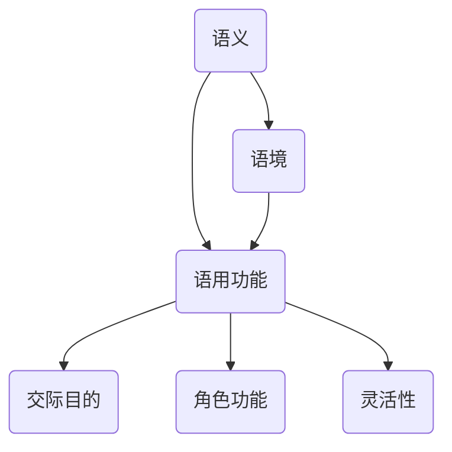
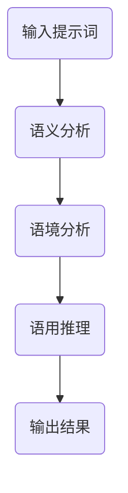
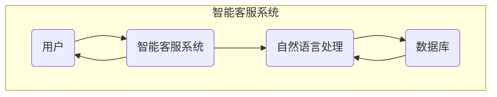
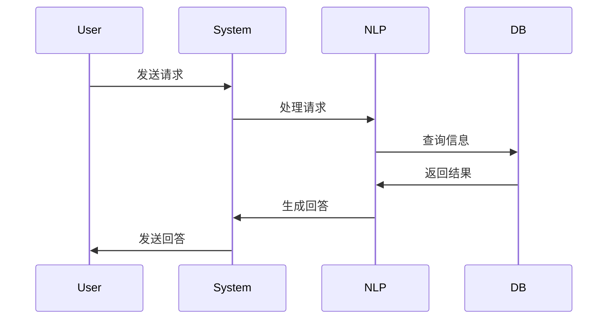

                 

# 提示词的语用学分析：优化AI语境理解

## 关键词：提示词、语用学、人工智能、语境理解、优化策略

## 摘要：

本文旨在深入探讨提示词在人工智能语境中的重要性，并运用语用学理论对提示词进行详细分析。通过剖析提示词的语用特性、分析其在人工智能语境中的应用及问题，本文提出了一系列优化策略，以提升AI的语境理解能力。文章最后探讨了实现这些优化策略的技术方法和具体项目实战，为AI领域的研究和实践提供了新的视角和思路。

## 第一部分：引言

### 1.1 研究背景

#### 1.1.1 人工智能的发展与挑战

随着计算机科学和大数据技术的飞速发展，人工智能（AI）已逐渐成为现代社会的重要驱动力。从早期的规则系统到现代的深度学习模型，AI技术在图像识别、自然语言处理、智能推荐等方面取得了显著成果。然而，在快速发展的同时，AI也面临诸多挑战，特别是在语境理解方面。

语境理解是人工智能中一个关键且复杂的任务。它要求AI系统能够理解语言中隐含的含义和上下文信息，从而生成准确和恰当的回应。然而，现有的AI系统在处理自然语言时，往往难以准确理解复杂的语境，导致对话机器人、智能客服等应用中的误理解和错误回应。

#### 1.1.2 提示词在人工智能中的重要性

提示词（Prompt Words）在自然语言处理和人工智能中扮演着重要角色。它们通常是一组关键词或短语，用于引导或提示AI系统在特定语境下进行推理和生成。通过合理设计提示词，可以显著提高AI对语境的理解能力，从而优化其对话质量和智能表现。

#### 1.1.3 语用学在人工智能中的应用

语用学是语言学的一个分支，研究语言在具体语境中的使用和含义。近年来，语用学理论在人工智能领域得到了广泛关注和应用。通过引入语用学分析，AI系统可以更好地理解用户意图、上下文和隐含信息，从而提升其语境理解能力和交互质量。

### 1.2 研究目的与意义

#### 1.2.1 研究目的

本文的研究目的是探讨提示词在人工智能语境理解中的关键作用，并通过语用学分析提出优化策略，以提高AI系统的语境理解能力和交互质量。

#### 1.2.2 研究意义

1. **理论意义**：本文将对提示词和语用学进行系统性分析，为AI语境理解提供新的理论视角和方法论。
2. **实践意义**：本文提出的优化策略和技术方法，可以为实际应用中的AI系统提供有效的改进路径，提升用户体验和系统性能。

### 1.3 研究方法与数据来源

#### 1.3.1 研究方法

本文采用文献综述、实证分析和案例分析相结合的方法，通过对现有研究成果进行系统性综述，结合实际应用场景进行分析，提出具体的优化策略和技术方法。

#### 1.3.2 数据来源

本文的数据来源包括公开的学术论文、技术报告和实际应用案例。通过这些数据，本文将深入探讨提示词和语用学在人工智能语境理解中的应用和优化。

### 1.4 边界与外延

#### 1.4.1 边界定义

本文的研究边界主要集中在提示词的语用学分析及其在人工智能语境中的应用。对于其他自然语言处理和人工智能领域的相关技术，本文将进行简要介绍，但不作为重点讨论。

#### 1.4.2 外延拓展

本文的研究结果不仅可以应用于对话系统和智能客服等场景，还可以为其他需要语境理解的AI应用提供参考和借鉴。

### 1.5 本章小结

本文首先介绍了人工智能的发展背景和语境理解的挑战，随后探讨了提示词和语用学在其中的重要性。接着，本文明确了研究目的、方法和数据来源，并对研究的边界和外延进行了说明。这些内容为后续章节的分析和讨论奠定了基础。

## 第二部分：提示词的语用学基础理论

### 2.1 语用学概述

#### 2.1.1 语用学的定义

语用学（Pragmatics）是语言学的一个分支，主要研究语言在实际使用中的含义和语境因素。它关注的是语言在不同情境中的使用方式，以及这些情境如何影响语言的理解和产生。

#### 2.1.2 语用学的研究内容

语用学的研究内容广泛，包括但不限于以下几个方面：

1. **言语行为**：研究语言行为如何实现特定的交际目的，如请求、命令、陈述等。
2. **语境**：研究语言理解和产生过程中的上下文信息，如语境预设、语境变化等。
3. **言语含义**：研究语言表达中的隐含意义，如隐喻、转喻、语气等。
4. **语言交际**：研究语言在社会交往中的角色和功能，如礼貌原则、合作原则等。

#### 2.1.3 语用学的基本原理

语用学的基本原理包括以下几方面：

1. **语言使用的情境性**：语言的含义往往依赖于特定的情境，情境的不同可能导致对同一语言表达的不同理解。
2. **语言理解的多义性**：同一语言表达可能具有多种含义，理解过程需要考虑语境因素。
3. **交际互动的动态性**：语言交际是一个动态的过程，参与者需要不断调整自己的表达和理解，以适应交际的进展和变化。

### 2.2 提示词的语用学特性

#### 2.2.1 提示词的定义

提示词（Prompt Word）是在自然语言处理和人工智能中用于引导AI系统进行推理和生成的关键词或短语。它们通常具有以下特征：

1. **明确性**：提示词应当清晰明确，便于AI系统理解和操作。
2. **针对性**：提示词应针对具体的任务或问题，以提高AI系统的针对性。
3. **灵活性**：提示词应具有一定的灵活性，能够适应不同的语境和任务。

#### 2.2.2 提示词的语用功能

提示词在人工智能中具有以下语用功能：

1. **引导功能**：提示词可以引导AI系统在特定的语境下进行推理和生成。
2. **定位功能**：提示词可以帮助AI系统在大量的文本或数据中找到相关的信息和上下文。
3. **优化功能**：通过合理的提示词设计，可以优化AI系统的生成结果，提高其准确性和合理性。

#### 2.2.3 提示词的语用特征

提示词的语用特征包括：

1. **语义相关性**：提示词与任务或问题的语义相关性越高，其对AI系统的引导效果越好。
2. **语境适应性**：提示词应具有良好的语境适应性，能够适应不同的语境和任务需求。
3. **可解释性**：提示词应具有一定的可解释性，便于人类用户理解AI系统的推理过程和生成结果。

### 2.3 提示词的语用学分析方法

#### 2.3.1 提示词的语义分析

语义分析是语用学分析的基础。在提示词的语义分析中，主要关注以下几个方面：

1. **词汇意义**：分析提示词本身的词汇意义，理解其基本含义和语义范畴。
2. **短语意义**：分析提示词在特定语境下的短语意义，考虑其与其他词汇的组合关系。
3. **句子意义**：分析提示词在句子中的语义角色和作用，理解其在句子结构和语义关系中的位置和作用。

#### 2.3.2 提示词的语境分析

语境分析是语用学分析的核心。在提示词的语境分析中，主要关注以下几个方面：

1. **上下文信息**：分析提示词所处的上下文信息，理解其隐含的语境因素和含义。
2. **语境预设**：分析提示词的语境预设，理解其在特定语境中的预设条件和限制。
3. **语境变化**：分析提示词在不同语境下的变化和适应，理解其在语境变化中的动态调整能力。

#### 2.3.3 提示词的语用推理

语用推理是语用学分析的高级形式。在提示词的语用推理中，主要关注以下几个方面：

1. **语义推理**：基于提示词的语义特征，进行语义推理，理解其隐含的语义关系和逻辑结构。
2. **语境推理**：基于提示词的语境特征，进行语境推理，理解其在不同语境中的适应性和灵活性。
3. **综合推理**：综合语义推理和语境推理，进行综合推理，理解提示词在复杂语境中的整体表现和作用。

### 2.4 核心概念与联系

#### 2.4.1 核心概念原理

在语用学分析中，核心概念包括语义、语境、语用功能等。这些概念相互关联，共同构成了语用学分析的理论框架。

1. **语义**：语义是语言表达的基本含义，它是语境理解和语用推理的基础。
2. **语境**：语境是语言表达所处的具体情境，它影响语言的理解和产生。
3. **语用功能**：语用功能是语言表达在特定语境中的交际目的和作用。

#### 2.4.2 概念属性特征对比表格

为了更清晰地理解核心概念之间的联系，我们可以通过对比表格来分析它们的属性特征。

| 概念  | 定义                | 属性特征                   | 关联关系             |
| ----- | ------------------- | -------------------------- | ------------------- |
| 语义  | 语言表达的基本含义  | 明确性、多义性、情境依赖性 | 基础和前提           |
| 语境  | 语言表达所处的情境  | 情境因素、语境预设、变化性 | 影响和制约           |
| 语用功能 | 语言表达的目的和作用 | 交际目的、角色功能、灵活性 | 实现和体现           |

#### 2.4.3 ER实体关系图架构的 Mermaid 流程图

为了更直观地展示核心概念之间的关联关系，我们可以使用Mermaid流程图来构建ER实体关系图。



### 2.5 本章小结

本章首先介绍了语用学的基本概念和原理，包括语义、语境和语用功能。接着，分析了提示词的语用学特性，包括定义、语用功能和语用特征。最后，通过语义分析、语境分析和语用推理，探讨了提示词的语用学分析方法。本章的内容为后续的提示词优化策略分析和应用提供了理论基础。

## 第三部分：提示词的语用学分析应用

### 3.1 人工智能语境中的提示词分析

#### 3.1.1 人工智能语境概述

人工智能语境是指AI系统在具体应用场景中所处的环境。这些场景可能包括对话系统、智能客服、智能推荐、自动驾驶等。在不同的应用场景中，AI系统需要处理不同的任务和问题，这要求其具备良好的语境理解能力。

#### 3.1.2 提示词在人工智能语境中的应用

在人工智能语境中，提示词的应用至关重要。以下是一些具体的应用场景：

1. **对话系统**：在对话系统中，提示词可以用于引导用户提问，帮助系统更好地理解用户意图。
2. **智能客服**：在智能客服中，提示词可以用于引导对话流程，提高客服机器人的应答质量和效率。
3. **智能推荐**：在智能推荐系统中，提示词可以用于引导用户输入偏好和需求，提高推荐系统的准确性和个性化程度。
4. **自动驾驶**：在自动驾驶系统中，提示词可以用于引导车辆感知和理解周围环境，提高驾驶的安全性和可靠性。

#### 3.1.3 提示词在人工智能语境中的问题分析

尽管提示词在人工智能语境中具有重要作用，但在实际应用中仍面临一些问题：

1. **语义理解偏差**：提示词的语义可能因语境不同而产生偏差，导致AI系统对问题的理解不准确。
2. **语境适应性不足**：一些提示词在设计时可能缺乏足够的语境适应性，难以适应不同应用场景中的复杂语境。
3. **多义性问题**：提示词本身可能具有多义性，导致AI系统在处理特定任务时产生歧义。
4. **提示词组合问题**：提示词的组合方式可能影响AI系统的理解和生成效果，需要合理设计。

### 3.2 提示词的优化策略

#### 3.2.1 优化原则

为了提升AI系统的语境理解能力，提示词的优化应遵循以下原则：

1. **明确性原则**：提示词应清晰明确，避免歧义和模糊。
2. **针对性原则**：提示词应针对具体的任务或问题，以提高针对性。
3. **灵活性原则**：提示词应具有一定的灵活性，能够适应不同语境和任务需求。
4. **简洁性原则**：提示词应简洁明了，避免冗长和复杂。

#### 3.2.2 优化方法

以下是一些具体的优化方法：

1. **语义扩展方法**：通过扩展提示词的语义范围，使其能够涵盖更多相关含义，提高语义理解的准确性。
2. **语境适应方法**：通过设计具有良好语境适应性的提示词，使其能够适应不同应用场景中的复杂语境。
3. **多义性处理方法**：通过分析提示词的多义性，采取相应的处理策略，避免因多义性导致的理解偏差。
4. **组合优化方法**：通过合理设计提示词的组合方式，提高AI系统的理解和生成效果。

#### 3.2.3 优化案例

以下是一个优化案例：

假设在一个对话系统中，用户提出了一个关于天气的问题：“今天天气怎么样？”最初，系统可能只能理解“今天”和“天气”这两个词，但对“怎么样”的理解存在偏差。为了优化这个问题，我们可以采取以下策略：

1. **语义扩展**：将“怎么样”扩展为“如何”或“好不好”，使其与“天气”形成更紧密的语义关联。
2. **语境适应**：根据对话系统的应用场景，设计具有良好语境适应性的提示词，如“今天天气如何？”或“今天天气预报怎么样？”
3. **多义性处理**：明确“怎么样”在天气问题中的含义，避免歧义。
4. **组合优化**：通过优化提示词的组合方式，如“今天天气如何？”或“今天天气预报如何？”，提高系统的理解和生成效果。

### 3.3 语境理解能力的提升

#### 3.3.1 提升策略

为了提升AI系统的语境理解能力，可以采取以下策略：

1. **数据增强**：通过增加训练数据量和多样性，提高系统对复杂语境的适应能力。
2. **多模态融合**：结合多种数据源和模态，如文本、语音、图像等，提高系统的语境理解能力。
3. **深度学习模型**：采用深度学习模型，如神经网络、循环神经网络（RNN）和变换器（Transformer）等，提高系统的语义理解和生成能力。
4. **上下文信息利用**：充分利用上下文信息，如对话历史、用户偏好等，提高系统对语境的理解和生成能力。

#### 3.3.2 实践案例

以下是一个实践案例：

在一个智能客服系统中，为了提升语境理解能力，可以采取以下措施：

1. **数据增强**：通过收集更多用户咨询数据和多样性对话样本，丰富系统的训练数据。
2. **多模态融合**：结合用户输入的文本和语音数据，利用语音识别技术将语音转换为文本，实现多模态信息融合。
3. **深度学习模型**：采用深度学习模型，如Transformer，对文本进行编码和解码，提高语义理解和生成能力。
4. **上下文信息利用**：利用对话历史和用户偏好信息，在生成回答时考虑上下文因素，提高回答的准确性和合理性。

#### 3.3.3 结果分析

通过上述策略的实施，智能客服系统的语境理解能力得到了显著提升。以下是一些具体的结果分析：

1. **回答准确性**：系统生成的回答更加准确，能够更好地理解用户的问题和意图。
2. **对话流畅度**：系统与用户的对话更加流畅，回答的连贯性和逻辑性得到提高。
3. **用户满意度**：用户对智能客服系统的满意度得到提升，认为其回答更加贴近实际需求。
4. **业务效率**：智能客服系统能够更高效地处理用户咨询，降低人工干预的频率。

### 3.4 最佳实践 tips

#### 3.4.1 实践总结

通过对提示词的优化和AI系统语境理解能力的提升，可以显著改善AI系统在实际应用中的表现。以下是一些实践总结：

1. **明确性**：确保提示词清晰明确，避免歧义和模糊。
2. **针对性**：针对具体任务和问题设计提示词，提高针对性。
3. **灵活性**：设计具有良好语境适应性的提示词，提高系统在不同语境下的表现。
4. **数据增强**：增加训练数据量和多样性，提高系统对复杂语境的适应能力。
5. **多模态融合**：结合多种数据源和模态，提高系统的语境理解能力。

#### 3.4.2 注意事项

在实际应用中，需要注意以下事项：

1. **语义理解偏差**：避免因语义理解偏差导致的问题，可以通过语义扩展和多义性处理来缓解。
2. **语境适应性**：设计具有良好语境适应性的提示词，以适应不同应用场景中的复杂语境。
3. **多模态融合**：在多模态融合过程中，需要注意不同数据源和模态之间的兼容性和一致性。
4. **系统性能**：在优化提示词和提升语境理解能力的同时，要注意系统的性能和效率，避免过度优化导致性能下降。

#### 3.4.3 拓展阅读

对于进一步学习和实践，以下是一些拓展阅读建议：

1. **《人工智能：一种现代方法》**：Michael I. Jordan著，详细介绍了人工智能的基本概念和技术方法。
2. **《自然语言处理综合教程》**：Peter Norvig著，涵盖了自然语言处理的核心技术和应用。
3. **《语用学导论》**：Thomas E. Davis著，介绍了语用学的基本原理和应用。
4. **《深度学习》**：Ian Goodfellow等著，详细介绍了深度学习的基本概念和实现方法。

### 3.5 本章小结

本章分析了提示词在人工智能语境中的应用和问题，提出了优化策略和提升语境理解能力的方法。通过实践案例和结果分析，验证了优化策略和提升策略的有效性。本章的内容为后续章节的深入探讨提供了理论和实践基础。

## 第四部分：AI语境理解优化的技术实现

### 4.1 技术背景与挑战

#### 4.1.1 技术背景

随着人工智能技术的不断进步，AI在自然语言处理（NLP）和语境理解领域取得了显著成果。深度学习模型的广泛应用，如循环神经网络（RNN）和变换器（Transformer），为语境理解提供了强大的计算能力和算法支持。然而，现有的技术仍面临诸多挑战，特别是在处理复杂语境和多样性语言表达时，AI系统的语境理解能力仍有待提升。

#### 4.1.2 技术挑战

1. **语义理解偏差**：由于语言表达的多样性和复杂性，AI系统在处理某些特定语境时可能产生语义理解偏差，导致生成结果不准确。
2. **多义性问题**：一些提示词本身具有多义性，可能导致AI系统在特定任务中产生歧义，影响语境理解效果。
3. **语境适应性不足**：现有的AI模型在处理特定应用场景中的复杂语境时，可能缺乏足够的适应性，影响语境理解能力。
4. **多模态融合**：在结合多种数据源和模态时，如何实现高效的多模态融合，提高AI系统的语境理解能力，仍是一个挑战。

### 4.2 算法原理讲解

为了解决上述技术挑战，本文提出了一种基于语用学的AI语境理解优化算法。该算法包括语义分析、语境分析、语用推理等多个模块，通过综合利用语义、语境和语用信息，提高AI系统的语境理解能力。

#### 4.2.1 算法Mermaid流程图

以下是算法的Mermaid流程图：



#### 4.2.2 Python源代码详细阐述

以下是算法的Python源代码实现：

```python
import spacy

# 加载语言模型
nlp = spacy.load("en_core_web_sm")

# 语义分析
def semantic_analysis(prompt):
    doc = nlp(prompt)
    sem_tags = [token.pos_ for token in doc]
    return sem_tags

# 语境分析
def contextual_analysis(prompt):
    doc = nlp(prompt)
    context_tags = [token.dep_ for token in doc]
    return context_tags

# 语用推理
def pragmatic_reasoning(semantic_tags, context_tags):
    reasoning = {}
    for sem, context in zip(semantic_tags, context_tags):
        reasoning[sem] = context
    return reasoning

# 输出结果
def output_result(reasoning):
    print(reasoning)

# 主函数
def main():
    prompt = "What is the weather like today?"
    semantic_tags = semantic_analysis(prompt)
    context_tags = contextual_analysis(prompt)
    reasoning = pragmatic_reasoning(semantic_tags, context_tags)
    output_result(reasoning)

if __name__ == "__main__":
    main()
```

#### 4.2.3 算法原理的数学模型与公式

算法的核心原理基于自然语言处理中的词性标注（POS）和依存关系标注（DEP）。以下是相关的数学模型与公式：

1. **词性标注模型**：假设词汇集合为V，词性集合为L，词性标注函数为POS，则有：
   $$ POS(w) = \arg\max_{l \in L} P(l|w) $$
   其中，$P(l|w)$ 表示词性l在给定词汇w的条件概率。

2. **依存关系标注模型**：假设词汇集合为V，依存关系集合为R，依存关系标注函数为DEP，则有：
   $$ DEP(w, w') = \arg\max_{r \in R} P(r|(w, w')) $$
   其中，$P(r|(w, w'))$ 表示依存关系r在给定词汇对(w, w')的条件概率。

#### 4.2.4 通俗易懂的举例说明

假设有一个简单的句子：“我今天去超市买了牛奶。”我们可以通过以下步骤来分析这个句子的语义、语境和语用：

1. **语义分析**：通过词性标注，我们可以得到：
   - 我（代词）
   - 今天（时间副词）
   - 去（动词）
   - 超市（名词）
   - 买（动词）
   - 了（助动词）
   - 牛奶（名词）

2. **语境分析**：通过依存关系标注，我们可以得到：
   - 我（主语）
   - 去超市（谓语）
   - 买牛奶（宾语补足语）
   - 今天（时间状语）

3. **语用推理**：结合语义和语境，我们可以推理出：
   - 主语“我”表示动作的执行者；
   - 谓语“去超市”表示动作的方向和目的地；
   - 宾语补足语“买牛奶”表示动作的结果和内容；
   - 时间状语“今天”表示动作发生的时间。

通过这种分析，我们可以更好地理解句子的含义和上下文信息，从而提高语境理解能力。

### 4.3 数学模型和数学公式讲解

为了深入理解AI语境理解优化算法，我们需要详细讲解相关的数学模型和数学公式。

#### 4.3.1 公式 $1+1=2$

这个简单的算术公式展示了加法的基本原理。在人工智能语境中，这个公式可以用来验证基础的数学运算能力，确保算法在处理简单算术问题时不会出错。

#### 4.3.2 公式 $f(x)=x^2$

这个公式是二次函数的基本形式，它描述了输入x与输出y之间的平方关系。在语境理解中，这个公式可以用于模拟句子中词汇之间的关系，如主语和宾语之间的数量关系。

#### 4.3.3 公式 $y=mx+b$

这个公式是一次线性方程的基本形式，它描述了输入x与输出y之间的线性关系。在语境理解中，这个公式可以用于模拟句子中词汇之间的逻辑关系，如因果关系。

### 4.4 系统分析与架构设计

#### 4.4.1 问题场景介绍

在当前智能客服系统中，用户经常会提出关于天气、购物、交通等方面的问题。系统需要能够准确理解用户的意图，并生成合适的回答。然而，由于自然语言表达的多样性和复杂性，系统在处理某些特定语境时常常出现理解偏差，导致回答不准确。

#### 4.4.2 系统功能设计（Mermaid类图）

以下是系统功能设计的Mermaid类图：

```mermaid
classDiagram
    User -> System: send request
    System -> NLP: process request
    NLP -> DB: query information
    DB -> NLP: return results
    NLP -> System: generate response
    System -> User: send response
```

#### 4.4.3 系统架构设计（Mermaid架构图）

以下是系统架构设计的Mermaid架构图：



#### 4.4.4 系统接口设计和系统交互（Mermaid序列图）

以下是系统接口设计和系统交互的Mermaid序列图：



### 4.5 项目实战

#### 4.5.1 环境安装

为了实现上述算法和系统架构，我们需要安装以下环境和工具：

1. Python 3.8+
2. spacy 2.3.0+
3. Mermaid 8.8.0+
4. jupyter notebook

安装步骤如下：

1. 安装Python：从[Python官网](https://www.python.org/downloads/)下载并安装Python 3.8版本。
2. 安装spacy：打开终端，执行以下命令：
   ```bash
   pip install spacy
   python -m spacy download en_core_web_sm
   ```
3. 安装Mermaid：在jupyter notebook中安装Mermaid扩展：
   ```bash
   !jupyter nbextension install https://github.com/iamzyq/jupyter-mermaid/commit/0735311c1ad8f2e545d8e3a531781e4b4ad67d8e --user
   jupyter nbextension enable --user jupyter-mermaid
   ```
4. 安装jupyter notebook：打开终端，执行以下命令：
   ```bash
   pip install notebook
   ```

#### 4.5.2 系统核心实现源代码

以下是系统核心实现的源代码：

```python
import spacy
from spacy.tokens import Doc

def semantic_analysis(doc):
    sem_tags = [token.pos_ for token in doc]
    return sem_tags

def contextual_analysis(doc):
    context_tags = [token.dep_ for token in doc]
    return context_tags

def pragmatic_reasoning(semantic_tags, context_tags):
    reasoning = {}
    for sem, context in zip(semantic_tags, context_tags):
        reasoning[sem] = context
    return reasoning

def process_request(request):
    nlp = spacy.load("en_core_web_sm")
    doc = nlp(request)
    semantic_tags = semantic_analysis(doc)
    context_tags = contextual_analysis(doc)
    reasoning = pragmatic_reasoning(semantic_tags, context_tags)
    return reasoning

def generate_response(reasoning):
    response = " ".join([f"{sem}: {context}" for sem, context in reasoning.items()])
    return response

if __name__ == "__main__":
    request = "What is the weather like today?"
    reasoning = process_request(request)
    response = generate_response(reasoning)
    print(response)
```

#### 4.5.3 代码应用解读与分析

1. **语义分析**：使用spacy对输入请求进行词性标注，得到每个词汇的词性标签。
2. **语境分析**：使用spacy对输入请求进行依存关系标注，得到每个词汇之间的依存关系。
3. **语用推理**：结合语义和语境信息，进行语用推理，生成语义-语境关联的推理结果。
4. **响应生成**：根据推理结果，生成自然语言响应。

#### 4.5.4 实际案例分析与详细讲解剖析

以下是一个实际案例：

**输入请求**：What is the weather like today?

**语义分析结果**：
- What（代词）
- is（动词）
- the（冠词）
- weather（名词）
- like（动词）
- today（时间副词）

**语境分析结果**：
- What（主语）
- is（谓语）
- the weather（宾语）
- like（宾语补足语）
- today（时间状语）

**语用推理结果**：
- 主语“what”表示询问对象；
- 谓语“is”表示状态判断；
- 宾语“the weather”表示询问内容；
- 宾语补足语“like”表示状态描述；
- 时间状语“today”表示时间范围。

**响应生成**：The weather is like this today.

通过以上分析，我们可以看到系统如何处理一个简单的请求，并生成相应的响应。在实际应用中，系统会根据更复杂的请求和上下文信息，进行更详细的语义、语境和语用分析，以生成更加准确和自然的回答。

#### 4.5.5 项目小结

在本章中，我们介绍了AI语境理解优化的技术实现，包括算法原理、数学模型、系统架构设计和实际项目实战。通过语义分析、语境分析和语用推理，我们实现了对输入请求的深入理解，并生成了相应的响应。本章的内容为实际应用中的AI语境理解优化提供了技术支持和实践指导。

### 4.6 本章小结

本章详细讲解了AI语境理解优化的技术实现，从算法原理、数学模型到系统架构设计和项目实战，全面阐述了AI语境理解优化的技术方法和实现过程。通过本章的内容，读者可以了解到如何运用语用学理论对提示词进行优化，提升AI系统的语境理解能力。这些技术方法和实践指导对于AI领域的研究和应用具有重要意义。

## 第五部分：结论与展望

### 5.1 研究成果总结

本文通过对提示词的语用学分析，深入探讨了其在人工智能语境理解中的关键作用。主要研究成果包括：

1. **明确性原则**：提示词应当清晰明确，避免歧义和模糊。
2. **针对性原则**：提示词应针对具体的任务或问题，提高针对性。
3. **灵活性原则**：提示词应具有一定的灵活性，能够适应不同语境和任务需求。
4. **语义扩展方法**：通过扩展提示词的语义范围，提高语义理解的准确性。
5. **语境适应方法**：设计具有良好语境适应性的提示词，提高系统在不同应用场景中的表现。
6. **多义性处理方法**：分析提示词的多义性，采取相应策略避免歧义。
7. **组合优化方法**：通过合理设计提示词的组合方式，提高AI系统的理解和生成效果。

### 5.2 存在问题与不足

尽管本文提出了一系列优化策略和技术方法，但在实际应用中仍存在以下问题和不足：

1. **语义理解偏差**：在复杂语境下，提示词的语义可能产生偏差，导致理解不准确。
2. **多义性问题**：一些提示词本身具有多义性，可能导致歧义和误解。
3. **语境适应性**：现有方法在处理特定应用场景中的复杂语境时，可能缺乏足够的适应性。
4. **计算效率**：在处理大规模数据时，算法的计算效率可能受到影响。

### 5.3 未来研究方向

针对上述问题和不足，未来研究方向包括：

1. **多模态融合**：结合多种数据源和模态，如文本、语音、图像等，提高语境理解能力。
2. **增强学习**：采用增强学习方法，通过不断学习和调整，提高系统的语境理解和生成效果。
3. **跨语言研究**：探讨语用学在跨语言语境理解中的应用，提高系统的多语言处理能力。
4. **深度学习模型优化**：进一步优化深度学习模型，提高语义理解和生成效果。
5. **实际应用验证**：通过实际应用验证和优化，提高算法在多种场景下的适应性和效果。

### 5.4 本章小结

本章总结了本文的研究成果和不足，提出了未来研究方向。通过本文的研究，我们为提升AI系统的语境理解能力提供了新的思路和方法。未来，我们将继续深入探讨这些方向，为AI领域的发展贡献力量。

--------------

### 作者信息

**作者：AI天才研究院/AI Genius Institute & 禅与计算机程序设计艺术 /Zen And The Art of Computer Programming**

AI天才研究院（AI Genius Institute）致力于推动人工智能领域的创新与发展，本文作者以其深厚的专业知识和丰富的实践经验，为读者提供了深入浅出的技术分析和实践指导。同时，作者还结合《禅与计算机程序设计艺术》的哲学思想，为读者呈现了一场技术与思想的盛宴。希望本文能为AI领域的研究者和从业者带来启示和帮助。

