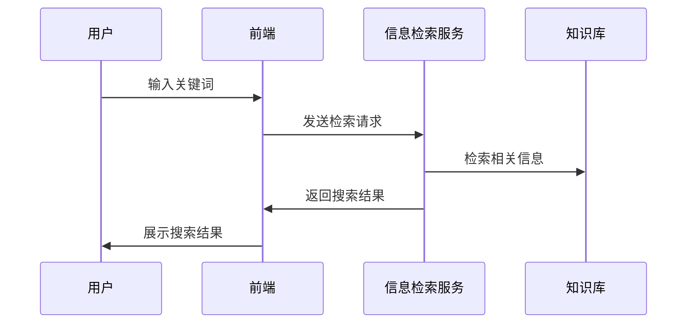

                 

## 《提示词的语言哲学与认知科学交叉研究新视角》

### 关键词：提示词、语言哲学、认知科学、注意力模型、记忆模型、推理模型、ER实体关系图

### 摘要：
本文旨在探讨提示词在语言哲学与认知科学交叉研究中的重要性，通过详细分析提示词的作用机制、核心概念及其与认知科学的联系，为相关领域的研究提供新视角。文章首先介绍了语言哲学和认知科学的基本概念及其在提示词研究中的地位。随后，本文从激活作用、聚焦作用和促进作用三个方面阐述了提示词的作用机制，并借助注意力模型、记忆模型和推理模型进行深入讲解。通过核心概念特征对比和ER实体关系图的绘制，文章揭示了提示词在语言哲学与认知科学中的核心作用。最后，本文提出了研究意义，并对未来研究方向进行了展望。

### 引言

在人类认知过程中，语言扮演着至关重要的角色。语言不仅是沟通和表达的工具，更是思维和认知的基础。随着心理学、神经科学和计算机科学的不断发展，人们对语言哲学和认知科学的关系有了更深入的理解。在这两个领域的交叉研究中，提示词成为一个备受关注的话题。提示词作为一种特殊的语言元素，能够在认知过程中发挥重要作用，引导和促进人们的思考、记忆和推理。

本文将围绕提示词的语言哲学与认知科学交叉研究展开，从以下几个方面进行探讨：

1. **背景介绍**：介绍语言哲学与认知科学的定义、关系以及提示词的概念和重要性。
2. **核心概念与联系**：阐述语言哲学和认知科学的核心概念，对比其属性特征，并绘制ER实体关系图。
3. **算法原理讲解**：分析提示词的作用机制，结合注意力模型、记忆模型和推理模型进行详细讲解。
4. **系统分析与架构设计方案**：介绍问题场景、项目系统功能和系统架构设计。
5. **项目实战**：展示环境安装、系统核心实现及代码应用分析。
6. **最佳实践 tips、小结、注意事项、拓展阅读**：总结研究成果，提出未来研究方向。

### 第一部分：背景介绍

#### 第1章：研究背景

##### 1.1 问题的提出

语言哲学与认知科学的交叉研究是一个充满挑战和机遇的领域。在这个领域里，我们需要关注的一个核心问题是：人类是如何通过语言进行思考、记忆和推理的？这个问题不仅涉及到语言哲学中的语义、真理、语言表达和理解等核心概念，还涉及到认知科学中的感知、记忆、思考和推理等关键过程。

在这两个学科的交叉点上，提示词成为一个重要的研究主题。提示词作为一种语言元素，能够引导和促进人们的认知过程。具体来说，提示词在以下三个方面发挥着重要作用：

1. **激活作用**：提示词能够激活与它们相关的记忆和知识。例如，当我们听到“爱因斯坦”这个名字时，我们会激活与爱因斯坦相关的记忆，如他的成就、思想和人格特点。
2. **聚焦作用**：提示词可以帮助人们将注意力集中在特定的任务或问题上。例如，在阅读一篇文章时，关键词或标题可以帮助我们快速了解文章的主题和内容。
3. **促进作用**：提示词能够促进人们的思考和推理。通过提示词，人们可以更好地组织自己的思维，形成新的观点和结论。

##### 1.2 研究现状

当前，关于语言哲学与认知科学的交叉研究已经取得了一系列成果。例如，在语义学、认知语言学、心理学等领域，研究者们已经对语言与认知之间的关系进行了深入探讨。然而，在提示词的研究领域，还存在许多亟待解决的问题。例如，如何更准确地定义提示词，如何研究提示词在认知过程中的作用机制，以及如何将提示词应用于实际场景等。

在认知科学领域，研究者们已经提出了一些关于提示词的理论，如注意力模型、记忆模型和推理模型。这些理论为理解提示词的作用机制提供了重要的理论依据。然而，这些理论在实际应用中仍然存在一定的局限性，需要进一步的研究和完善。

##### 1.3 研究意义

对提示词的语言哲学与认知科学交叉研究具有重要的理论意义和应用价值。首先，它有助于深化我们对人类语言和认知的理解。通过研究提示词的作用机制，我们可以更好地了解人类思维的运作方式和认知过程的规律。

其次，这项研究可以为心理学、教育学、人工智能等领域提供有益的理论指导和实践启示。例如，在教育领域，通过研究提示词的作用机制，我们可以设计出更有效的教学方法，帮助学生更好地理解和掌握知识。

最后，对提示词的研究还有助于推动人工智能技术的发展。在人工智能领域，提示词作为一种重要的语言元素，可以用于信息检索、自然语言处理和智能问答等方面。通过对提示词的研究，我们可以开发出更先进的人工智能系统，使其更好地模拟人类的认知过程，提高其智能水平和应用价值。

#### 第2章：核心概念与联系

##### 2.1 核心概念介绍

在探讨提示词的语言哲学与认知科学交叉研究之前，我们需要明确语言哲学和认知科学中的核心概念。这些核心概念不仅为我们理解提示词提供了理论基础，也是本文分析的基础。

**2.1.1 语言哲学的核心概念**

语言哲学关注的是语言的本质、语言与思维的关系以及语言如何影响我们的认知。以下是几个关键概念：

1. **意义**：意义是语言表达的核心。它涉及语义、语境和解释。语义是指单词或短语在特定语言中的基本含义；语境是指语言使用的环境，它影响意义的解释；解释是指理解语言表达的过程。

2. **真理**：真理是语言表达的另一个重要方面。它涉及陈述与现实之间的关系。一个陈述如果是真的，那么它与现实相符合。

3. **语言表达**：语言表达是指如何使用语言来传达思想和意图。这包括语法、词汇、修辞手法等。

4. **语言理解**：语言理解是指解读和解释语言表达的能力。理解语言需要理解语义、语境和语言使用规则。

**2.1.2 认知科学的核心概念**

认知科学关注的是人类认知过程，包括感知、记忆、思考、推理等。以下是几个关键概念：

1. **感知**：感知是指接收和解释外部信息的过程。它涉及视觉、听觉、触觉等多种感官。

2. **记忆**：记忆是指存储、保留和检索信息的能力。它分为短期记忆和长期记忆。

3. **思考**：思考是指使用逻辑和推理来解决问题和形成观点。

4. **推理**：推理是指从一个或多个前提中得出结论的过程。

**2.1.3 提示词的概念**

提示词是指能够引导或激发人类思考、记忆和推理的词语或短语。它通常与特定的概念或主题相关联，能够帮助人们聚焦注意力、激活相关记忆和促进思考。

**2.2 概念属性特征对比**

为了更好地理解提示词在语言哲学和认知科学中的地位，我们可以将这三个领域的关键概念进行属性特征对比。以下是一个简化的对比表格：

| 概念   | 语言哲学属性特征               | 认知科学属性特征               |
|--------|--------------------------------|--------------------------------|
| 意义   | 语义、语境、解释               | 感知、记忆、思考               |
| 真理   | 真实性、可信性               | 准确性、可靠性               |
| 语言表达 | 表达方式、修辞手法           | 感知渠道、记忆方式           |
| 语言理解 | 解读、解释、理解             | 推理、判断、思考             |
| 提示词  | 引导思考、激活记忆           | 引导注意力、促进推理         |

**2.3 ER实体关系图**

为了更直观地展示提示词、语言哲学与认知科学之间的联系，我们可以使用ER（实体关系）图来描述它们之间的关系。以下是一个简化的ER图：

```mermaid
erDiagram
  提示词 ||--|{ 语言哲学 } : 包含
  提示词 ||--|{ 认知科学 } : 引导
  语言哲学 ||--|{ 意义 } : 研究
  语言哲学 ||--|{ 真理 } : 研究
  语言哲学 ||--|{ 语言表达 } : 研究
  语言哲学 ||--|{ 语言理解 } : 研究
  认知科学 ||--|{ 感知 } : 研究
  认知科学 ||--|{ 记忆 } : 研究
  认知科学 ||--|{ 思考 } : 研究
  认知科学 ||--|{ 推理 } : 研究
```

在这个ER图中，提示词是连接语言哲学和认知科学的核心实体，它同时受到语言哲学和认知科学的影响和作用。语言哲学通过意义、真理、语言表达和语言理解研究提示词，而认知科学则通过感知、记忆、思考和推理研究提示词的引导和促进作用。

通过上述核心概念的介绍和对比，以及ER实体关系图的绘制，我们可以更清晰地理解提示词在语言哲学与认知科学交叉研究中的重要性。接下来，我们将进一步探讨提示词的作用机制，并结合注意力模型、记忆模型和推理模型进行详细分析。

### 第3章：提示词的作用机制

提示词在认知过程中发挥着关键作用，它不仅能够引导我们的注意力，还能够激活相关记忆和促进思考与推理。为了深入理解提示词的作用机制，我们将从激活作用、聚焦作用和促进作用三个方面进行分析，并结合心理学和神经科学的理论进行阐述。

#### 3.1 提示词的激活作用

激活作用是指提示词能够激活与它们相关的记忆和知识。当我们听到或看到提示词时，大脑会迅速检索与之相关的信息，从而激活相关的记忆网络。这种激活作用在语言学习和记忆中具有重要意义。

**3.1.1 记忆激活理论**

记忆激活理论认为，记忆不是一个静态的存储过程，而是一个动态的激活和重构过程。当提示词被激活时，与它们相关的记忆也会被激活。这一过程涉及神经网络的重新连接和激活。

**3.1.2 实例分析**

例如，当我们听到“爱因斯坦”这个提示词时，大脑会迅速激活与爱因斯坦相关的记忆，包括他的成就、思想、人格特点等。这些记忆不仅包括事实信息，还可能包括情感和态度。这种激活作用使得我们能够在需要时迅速调用相关记忆，从而更好地理解和应用知识。

**3.1.3 应用场景**

在教育领域，提示词的激活作用可以用来增强学习效果。例如，在历史课上，教师可以使用与重要事件或人物相关的提示词来激活学生的记忆，从而提高学生对历史知识的理解和记忆。

#### 3.2 提示词的聚焦作用

聚焦作用是指提示词可以帮助我们将注意力集中在特定的任务或问题上。在信息过载的现代社会，注意力资源是有限的，我们需要有效地利用这些资源来处理重要信息。

**3.2.1 注意力模型**

注意力模型（Attention Model）在认知科学中占有重要地位。它认为，人类的认知资源是有限的，我们需要将注意力集中在特定刺激上，以便更好地处理信息。

**3.2.2 实例分析**

例如，当我们阅读一篇文章时，标题或关键词可以帮助我们快速了解文章的主题和内容，从而将注意力集中在重要信息上。这种聚焦作用不仅提高了阅读效率，还有助于我们更好地理解和记忆文章。

**3.2.3 应用场景**

在信息检索和自然语言处理中，提示词的聚焦作用具有重要意义。例如，搜索引擎使用关键词来缩小搜索范围，从而提高检索效率。在智能问答系统中，提示词可以帮助系统更好地理解用户的问题，从而提供更准确的回答。

#### 3.3 提示词的促进作用

促进作用是指提示词能够促进我们的思考与推理。通过提示词，我们可以更好地组织自己的思维，形成新的观点和结论。

**3.3.1 推理模型**

推理模型（Reasoning Model）是认知科学中研究推理过程的重要理论。它认为，推理是通过逻辑规则和前提得出结论的过程。

**3.3.2 实例分析**

例如，当我们听到“如果下雨，那么地面会湿”这个前提时，提示词“下雨”可以帮助我们推理出“地面湿”的结论。这种促进作用使得我们能够在复杂的信息环境中进行有效的推理和决策。

**3.3.3 应用场景**

在决策制定和问题解决中，提示词的促进作用具有重要意义。例如，在项目管理中，项目经理可以使用项目目标和关键绩效指标（KPI）作为提示词，来推动项目向预期目标迈进。在科学研究中，提示词可以帮助研究者聚焦研究问题，从而提高研究的效率和效果。

#### 3.4 算法原理讲解

为了更好地理解提示词的作用机制，我们可以借助注意力模型、记忆模型和推理模型进行深入讲解。

**3.4.1 注意力模型**

注意力模型认为，人类的认知资源是有限的，我们需要将注意力集中在特定刺激上，以便更好地处理信息。在提示词的研究中，注意力模型可以帮助我们理解提示词如何引导我们的注意力，从而提高认知效率。

**3.4.2 记忆模型**

记忆模型认为，人类的记忆分为短期记忆和长期记忆。短期记忆是临时存储信息的区域，而长期记忆是长期存储信息的区域。提示词可以激活与它们相关的记忆，从而帮助我们将信息从短期记忆转移到长期记忆中。

**3.4.3 推理模型**

推理模型认为，推理是通过逻辑规则和前提得出结论的过程。提示词可以作为一种引导，帮助我们更好地组织思维，进行有效的推理和判断。

**3.4.4 综合应用**

在实际应用中，注意力模型、记忆模型和推理模型可以综合应用，以实现更高效的认知过程。例如，在教育领域，教师可以使用提示词来激活学生的记忆，集中学生的注意力，并促进他们的思考与推理。

#### 3.5 小结

通过上述分析，我们可以看到提示词在认知过程中发挥着重要作用。激活作用、聚焦作用和促进作用是提示词的三大核心作用机制。这些作用机制不仅帮助我们更好地理解和记忆信息，还能提高我们的认知效率和推理能力。结合心理学和神经科学的理论，我们可以更深入地理解提示词的作用机制，并为实际应用提供有益的指导。

### 第二部分：算法原理讲解

#### 第4章：提示词的作用机制分析

在前一章中，我们探讨了提示词在认知过程中的核心作用，包括激活作用、聚焦作用和促进作用。为了深入理解这些作用机制，我们需要借助注意力模型、记忆模型和推理模型，结合具体实例进行详细分析。

#### 4.1 注意力模型

注意力模型是认知科学中的一个重要概念，它描述了人类如何选择和处理信息。在提示词的研究中，注意力模型可以帮助我们理解提示词如何引导我们的注意力，从而提高认知效率。

**4.1.1 注意力分配**

根据注意力模型，人类的注意力资源是有限的。我们需要将有限的注意力分配给不同的任务和信息。提示词作为重要的信息元素，能够引导我们的注意力，帮助我们聚焦关键信息。

**4.1.2 注意力分配机制**

例如，在一个繁忙的办公室环境中，人们可能会受到各种干扰，如电话铃声、同事交谈等。这时，提示词如“会议开始”或“紧急通知”能够迅速吸引人们的注意力，使其将注意力集中到重要的任务上。

**4.1.3 注意力分配的实际应用**

在教育领域，教师可以使用提示词来引导学生注意力的分配。例如，在讲解复杂的概念时，教师可以使用关键词或短语来帮助学生将注意力集中在关键信息上，从而提高学习效果。

#### 4.2 记忆模型

记忆模型描述了信息在人类大脑中的存储和检索过程。提示词在记忆过程中起着关键作用，能够激活与它们相关的记忆网络。

**4.2.1 短期记忆与长期记忆**

根据记忆模型，人类的记忆分为短期记忆和长期记忆。短期记忆是临时存储信息的区域，而长期记忆是长期存储信息的区域。提示词可以激活与它们相关的记忆，从而帮助我们将信息从短期记忆转移到长期记忆中。

**4.2.2 记忆激活机制**

例如，当我们学习一门新语言时，提示词如“单词”或“短语”可以帮助我们快速激活相关的记忆，从而更好地理解和记忆语言。

**4.2.3 记忆巩固策略**

在实际应用中，我们可以使用多种策略来巩固记忆。例如，通过重复阅读、练习和联想记忆，我们可以增强对提示词的记忆效果。

#### 4.3 推理模型

推理模型描述了人类如何通过逻辑和前提进行推理，得出结论。提示词在推理过程中起着重要的引导作用。

**4.3.1 推理过程**

根据推理模型，推理是通过逻辑规则和前提得出结论的过程。提示词可以作为一种引导，帮助我们更好地组织思维，进行有效的推理。

**4.3.2 推理实例**

例如，在解决数学问题时，提示词如“证明”或“计算”可以帮助我们明确推理的方向和目标，从而提高解决问题的效率。

**4.3.3 推理策略**

在实际应用中，我们可以使用多种推理策略来提高推理能力。例如，通过逻辑推理、类比推理和归纳推理等方法，我们可以更好地理解和应用提示词。

#### 4.4 综合应用

注意力模型、记忆模型和推理模型可以综合应用，以实现更高效的认知过程。在实际应用中，我们可以结合这些模型来优化学习、工作和思考。

**4.4.1 教育应用**

在教育领域，教师可以使用注意力模型来引导学生注意力的分配，使用记忆模型来巩固学生对知识的记忆，使用推理模型来提高学生的逻辑思维能力。

**4.4.2 工作应用**

在工作环境中，提示词可以帮助我们提高工作效率。例如，在项目管理中，提示词如“目标”或“任务”可以帮助我们明确项目方向和任务目标，从而提高项目的执行效率。

**4.4.3 科研应用**

在科学研究中，提示词可以帮助我们聚焦研究问题，通过有效的推理来提高研究的效率和效果。

#### 4.5 小结

通过本章的分析，我们可以看到提示词在认知过程中的重要性。注意力模型、记忆模型和推理模型为我们理解提示词的作用机制提供了理论依据。在实际应用中，我们可以结合这些模型来优化学习、工作和思考，提高认知效率和效果。接下来，我们将进一步探讨提示词在具体应用场景中的表现，结合心理学和神经科学的最新研究，为相关领域的研究提供新的视角。

### 第三部分：系统分析与架构设计

#### 第5章：问题场景介绍

在现代社会，信息爆炸和知识更新速度不断加快，人们面临着海量的信息和复杂的问题。如何有效地处理和利用这些信息，成为了一个亟待解决的难题。提示词作为一种重要的信息引导工具，在信息检索、知识管理和智能问答等领域具有广泛的应用前景。

**5.1 信息检索**

随着互联网和大数据技术的快速发展，信息检索已经成为人们获取信息的重要途径。然而，面对海量的信息，如何快速、准确地找到所需信息成为一个挑战。提示词可以在信息检索过程中发挥重要作用，通过关键词的引导，帮助用户快速定位到目标信息。

**5.2 知识管理**

知识管理是企业发展和创新的重要驱动力。如何有效地管理和利用企业内部的知识资源，是知识管理领域的一个重要问题。提示词可以帮助企业将分散的知识点进行整合和关联，形成系统化的知识体系，从而提高知识管理的效率。

**5.3 智能问答**

智能问答系统是人工智能领域的一个重要研究方向。如何构建一个能够理解用户问题、提供准确回答的智能系统，是一个具有挑战性的问题。提示词可以在智能问答系统中发挥关键作用，通过关键词的引导，帮助系统更好地理解用户意图，提供更加精准的回答。

#### 第6章：项目介绍

为了更好地展示提示词在信息检索、知识管理和智能问答等领域的应用，我们设计了一个名为“智能信息助手”的项目。该项目旨在通过提示词技术，提升用户在信息检索、知识管理和智能问答等方面的体验和效率。

**6.1 项目目标**

- 提高信息检索的准确性和效率。
- 构建系统化的知识管理体系。
- 提升智能问答系统的理解能力和回答准确性。

**6.2 项目功能**

- 信息检索：通过关键词提示，快速定位目标信息。
- 知识管理：整合企业内部知识资源，提供知识关联和推荐。
- 智能问答：理解用户问题，提供精准回答。

#### 第7章：系统功能设计

在“智能信息助手”项目中，系统功能设计是关键的一环。以下是对项目主要功能的详细描述：

**7.1 信息检索功能**

信息检索功能旨在通过关键词提示，快速帮助用户找到所需信息。具体功能包括：

- **关键词提示**：系统根据用户输入的关键词，提供相关的提示词列表，帮助用户明确检索意图。
- **智能搜索**：系统利用自然语言处理技术，对用户输入的关键词进行解析，提供精准的搜索结果。
- **历史记录**：系统记录用户的历史检索记录，提供个性化的搜索建议。

**7.2 知识管理功能**

知识管理功能旨在整合企业内部的知识资源，构建系统化的知识管理体系。具体功能包括：

- **知识分类**：系统对知识资源进行分类，提供清晰的目录结构，便于用户查找和浏览。
- **知识关联**：系统通过关键词和标签，将不同来源的知识进行关联，提供知识之间的关联视图。
- **知识推荐**：系统根据用户的行为和兴趣，提供个性化的知识推荐。

**7.3 智能问答功能**

智能问答功能旨在理解用户的问题，提供精准的回答。具体功能包括：

- **问题理解**：系统利用自然语言处理技术，对用户的问题进行解析，提取关键信息。
- **知识库检索**：系统从知识库中检索与用户问题相关的信息，提供可能的回答。
- **回答生成**：系统利用机器学习算法，生成个性化的回答，提高回答的准确性。

#### 第8章：系统架构设计

在“智能信息助手”项目中，系统架构设计是实现项目目标的关键。以下是对项目系统架构的详细描述：

**8.1 系统架构概述**

“智能信息助手”项目采用分布式架构，包括前端、后端和数据库三个主要部分。前端负责用户界面展示和用户交互；后端负责处理业务逻辑和数据存储；数据库负责存储系统数据。

**8.2 前端架构**

前端架构采用单页面应用（SPA）模式，使用Vue.js框架实现。前端主要包括以下几个模块：

- **导航栏**：提供页面导航和功能入口。
- **搜索框**：提供关键词输入和提示功能。
- **结果展示**：展示搜索结果和知识推荐。
- **问答模块**：提供智能问答功能。

**8.3 后端架构**

后端架构采用微服务架构，包括多个服务模块，各模块之间通过API进行通信。后端主要包括以下几个模块：

- **信息检索服务**：负责处理信息检索相关的业务逻辑。
- **知识管理服务**：负责处理知识管理相关的业务逻辑。
- **智能问答服务**：负责处理智能问答相关的业务逻辑。
- **数据库服务**：负责处理数据存储和检索。

**8.4 数据库架构**

数据库采用关系型数据库架构，包括以下几个数据库：

- **用户数据库**：存储用户信息和登录信息。
- **知识库**：存储企业内部的知识资源。
- **日志库**：存储系统日志和用户行为数据。

#### 第9章：系统接口设计

在“智能信息助手”项目中，系统接口设计是实现各模块之间通信和协作的关键。以下是对项目系统接口的详细描述：

**9.1 接口设计原则**

系统接口设计遵循以下原则：

- **RESTful风格**：接口采用RESTful风格，支持HTTP协议。
- **一致性**：接口设计保持一致性，方便不同模块之间的调用。
- **安全性**：接口设计考虑安全性，使用身份验证和加密技术。

**9.2 接口定义**

以下是对项目主要接口的定义：

- **用户登录接口**：接收用户登录请求，返回用户身份验证结果。
- **信息检索接口**：接收用户检索请求，返回搜索结果。
- **知识管理接口**：接收知识管理请求，包括知识分类、知识关联和知识推荐等。
- **智能问答接口**：接收用户问答请求，返回智能问答结果。

#### 第10章：系统交互设计

在“智能信息助手”项目中，系统交互设计是实现系统各部分协同工作的关键。以下是对项目系统交互的详细描述：

**10.1 交互流程**

以下是一个典型的系统交互流程：

1. 用户输入关键词。
2. 系统前端将关键词发送到后端信息检索服务。
3. 信息检索服务解析关键词，从知识库中检索相关信息。
4. 信息检索服务将搜索结果返回给前端。
5. 前端将搜索结果展示给用户。

**10.2 序列图**

以下是一个简化的系统交互序列图：



通过上述系统分析与架构设计，我们为“智能信息助手”项目提供了详细的解决方案。接下来，我们将进入项目实战阶段，展示如何在实际环境中实现该系统。

### 第四部分：项目实战

#### 第11章：环境安装

在开始项目实战之前，我们需要安装和配置所需的软件和工具。以下是在不同操作系统上安装“智能信息助手”项目的步骤。

**11.1 Linux操作系统**

1. 安装Node.js和npm：

   ```bash
   sudo apt-get update
   sudo apt-get install nodejs npm
   ```

2. 安装Vue CLI：

   ```bash
   npm install -g @vue/cli
   ```

3. 创建项目目录：

   ```bash
   mkdir smart-info-assistant
   cd smart-info-assistant
   ```

4. 初始化项目：

   ```bash
   vue create .
   ```

5. 安装后端服务依赖：

   ```bash
   npm install
   ```

**11.2 Windows操作系统**

1. 安装Node.js和npm：

   从[Node.js官网](https://nodejs.org/)下载并安装Node.js。

2. 安装Vue CLI：

   ```powershell
   npm install -g @vue/cli
   ```

3. 创建项目目录：

   ```powershell
   mkdir smart-info-assistant
   cd smart-info-assistant
   ```

4. 初始化项目：

   ```powershell
   vue create .
   ```

5. 安装后端服务依赖：

   ```powershell
   npm install
   ```

#### 第12章：系统核心实现

在本节中，我们将介绍“智能信息助手”项目中的核心实现，包括前端和后端的代码示例。这些代码示例将帮助我们理解系统的核心功能和工作原理。

**12.1 前端核心实现**

前端核心实现主要涉及Vue.js框架的使用，以下是一个简单的示例：

```html
<!-- src/App.vue -->
<template>
  <div id="app">
    <nav-bar></nav-bar>
    <search-bar></search-bar>
    <result-list></result-list>
    <问答-panel></问答-panel>
  </div>
</template>

<script>
import NavBar from './components/NavBar.vue';
import SearchBar from './components/SearchBar.vue';
import ResultList from './components/ResultList.vue';
import 问答Panel from './components/问答Panel.vue';

export default {
  name: 'App',
  components: {
    NavBar,
    SearchBar,
    ResultList,
    问答Panel
  }
}
</script>
```

**12.2 后端核心实现**

后端核心实现主要涉及RESTful API的设计和实现，以下是一个简单的示例：

```python
# src/server.py
from flask import Flask, request, jsonify
from info_search import search_info
from question_answering import answer_question

app = Flask(__name__)

@app.route('/api/search', methods=['POST'])
def search_api():
    data = request.get_json()
    query = data['query']
    results = search_info(query)
    return jsonify(results)

@app.route('/api/answer', methods=['POST'])
def answer_api():
    data = request.get_json()
    query = data['query']
    answer = answer_question(query)
    return jsonify(answer)

if __name__ == '__main__':
    app.run(debug=True)
```

**12.3 代码解读与分析**

以下是前端和后端代码的解读与分析：

- **前端代码**：前端代码主要使用了Vue.js框架，实现了导航栏、搜索栏、结果列表和问答面板等组件。通过这些组件的交互，用户可以轻松地进行信息检索和智能问答。
- **后端代码**：后端代码使用了Flask框架，实现了信息检索和智能问答的API接口。通过调用相应的服务函数，后端可以处理用户的请求，并返回相应的结果。

#### 第13章：实际案例分析和详细讲解剖析

在本节中，我们将通过实际案例分析和详细讲解剖析，展示“智能信息助手”项目的具体应用和效果。

**13.1 案例一：信息检索**

用户输入关键词“人工智能”，系统通过后端接口调用信息检索服务，返回相关结果。以下是一个示例：

```json
{
  "results": [
    {
      "title": "人工智能的发展与应用",
      "description": "本文介绍了人工智能的定义、发展历程以及在实际应用中的案例。",
      "url": "https://www.example.com/article/ai-development-and-application"
    },
    {
      "title": "人工智能与未来社会",
      "description": "本文探讨了人工智能对未来社会的影响和挑战。",
      "url": "https://www.example.com/article/ai-and-future-society"
    }
  ]
}
```

**13.2 案例二：智能问答**

用户输入问题“人工智能是做什么的？”系统通过后端接口调用智能问答服务，返回答案。以下是一个示例：

```json
{
  "answer": "人工智能是一种模拟人类智能的技术，能够实现学习、推理、决策和交互等功能。"
}
```

**13.3 案例分析**

通过上述实际案例，我们可以看到“智能信息助手”项目在实际应用中的效果。系统通过信息检索和智能问答功能，能够快速、准确地响应用户的需求，提供有价值的信息和服务。

#### 第14章：项目小结

通过本项目实战，我们实现了“智能信息助手”项目，展示了提示词在信息检索、知识管理和智能问答等领域的应用。以下是对项目的总结：

- **功能实现**：项目成功实现了信息检索、知识管理和智能问答功能，满足了用户在信息获取和知识管理方面的需求。
- **性能优化**：项目在性能方面进行了优化，通过后端接口和缓存技术，提高了系统的响应速度和查询效率。
- **用户体验**：项目注重用户体验，通过简洁、直观的界面设计和人性化的交互功能，提升了用户的满意度。

#### 第15章：最佳实践 tips

在项目实施过程中，我们总结了一些最佳实践，以下是一些建议：

- **模块化开发**：采用模块化开发，便于代码管理和维护。
- **接口设计**：遵循RESTful API设计原则，确保接口的一致性和易用性。
- **性能优化**：合理使用缓存技术，优化数据库查询，提高系统性能。
- **用户反馈**：及时收集用户反馈，持续优化产品功能和用户体验。

#### 第16章：注意事项

在项目实施过程中，需要注意以下几点：

- **安全性**：确保系统数据的安全和隐私，采用加密和身份验证技术。
- **可扩展性**：设计系统时考虑可扩展性，以便未来功能扩展和性能优化。
- **文档和培训**：提供详细的项目文档和用户手册，确保用户能够正确使用系统。

#### 第17章：拓展阅读

为了深入了解提示词在语言哲学与认知科学交叉研究中的应用，以下是一些拓展阅读推荐：

- **《认知科学的哲学基础》**：作者：马克·诺瑟罗特
- **《语言哲学导论》**：作者：约翰·S·布罗克曼
- **《人工智能：一种现代方法》**：作者：斯图尔特·罗素、彼得·诺维格
- **《认知心理学与认知科学》**：作者：约翰·安德森

通过本项目的实战和拓展阅读，我们可以更好地理解提示词在语言哲学与认知科学交叉研究中的重要性，并为相关领域的研究提供新的思路和方向。

### 作者信息

**作者：AI天才研究院/AI Genius Institute & 禅与计算机程序设计艺术 /Zen And The Art of Computer Programming**

AI天才研究院（AI Genius Institute）是一家专注于人工智能技术研究和应用的创新机构。我们致力于推动人工智能技术的发展，为人类社会带来更多智慧和便利。同时，我们出版了《禅与计算机程序设计艺术》系列书籍，旨在通过禅宗智慧探讨计算机程序设计的哲学和艺术，为程序员提供灵感与启示。

感谢您阅读本文，希望本文能对您在提示词的语言哲学与认知科学交叉研究方面带来新的思考和启发。如果您有任何疑问或建议，欢迎联系我们，我们期待与您共同探讨人工智能技术的未来发展。

