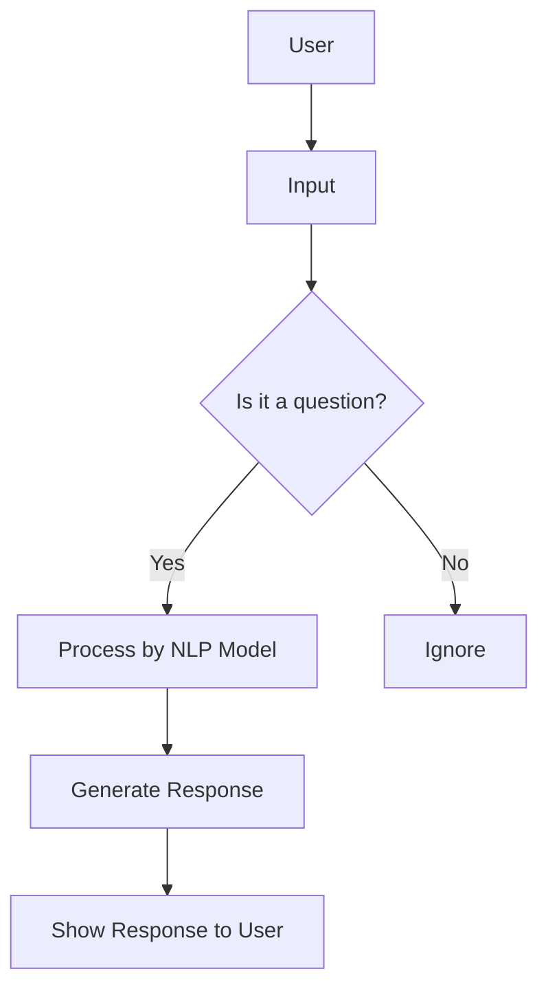
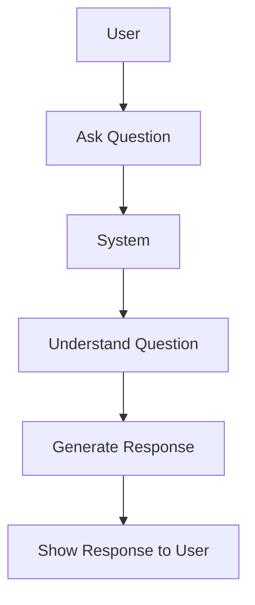

                 


### 第一部分：引言

#### 1.1 书籍背景

随着人工智能（AI）技术的飞速发展，自然语言处理（NLP）成为了AI领域的热点之一。在NLP中，语言模型是一种核心技术，它能够预测一个单词序列的概率，从而为生成文本、机器翻译、语音识别等应用提供基础。而提示词，即触发语言模型生成特定内容的关键词，其在AI语言模型中的作用愈发重要。本文旨在通过深入探讨提示词的语言哲学，揭示AI语言模型背后的本质。

#### 1.2 书籍目标与读者

本文的目标是帮助读者，尤其是那些对AI语言模型有基础了解但希望深入理解其哲学层面的研究人员和开发者，探索提示词在AI语言模型中的作用和意义。通过本文的阅读，读者将：

- 了解AI语言模型的起源和发展
- 掌握提示词的定义与作用
- 深入理解提示词的语言哲学
- 掌握AI语言模型的算法原理
- 学习系统分析与架构设计的方法

适合读者群体包括：

- AI领域研究人员和开发者
- 对自然语言处理有浓厚兴趣的计算机科学学生
- 对AI技术有深入研究的爱好者

### 第二部分：背景介绍

#### 2.1 AI语言模型的起源与发展

语言模型的概念最早可以追溯到20世纪50年代，当时研究者们开始尝试使用数学模型来描述自然语言。随着计算机科学和人工智能的发展，语言模型也得到了长足的进步。早期的语言模型主要是基于统计方法的，如N-gram模型，通过分析语料库中的词频统计来预测下一个单词。

然而，随着深度学习的兴起，神经网络语言模型（如循环神经网络RNN、长短期记忆LSTM等）成为了研究的热点。这些模型能够更好地捕捉语言的上下文信息，从而在生成文本、机器翻译等领域取得了突破性的进展。近年来，基于Transformer的模型（如BERT、GPT等）进一步提升了语言模型的性能，成为AI语言处理领域的核心技术。

#### 2.2 提示词的定义与作用

提示词（Prompt）是指触发语言模型生成特定内容的关键词或短语。在AI语言模型中，提示词起到了引导和聚焦模型生成目标内容的作用。一个有效的提示词能够：

- 提高模型的生成效率：通过提示词，模型可以更快速地生成目标内容，而不必在庞大的词汇空间中进行随机搜索。
- 增强模型的生成质量：提示词可以为模型提供更明确的生成目标，从而减少无关或错误内容的生成。
- 适应不同的生成场景：不同的提示词可以引导模型生成不同类型的内容，如文本摘要、对话生成、代码生成等。

#### 2.3 语言哲学的基本概念

语言哲学是哲学的一个分支，主要研究语言的本质、语言与现实的关系、语言的认知功能等问题。在AI语言模型中，语言哲学提供了重要的理论支撑，帮助我们理解模型的生成机制和语言的本质。

- 语言的本质：语言哲学探讨了语言是否能够准确反映现实，以及语言是否具有独立的本体论地位。在AI语言模型中，这个问题体现在模型是否能够生成与现实世界相符的文本。
- 语言与现实的关系：语言哲学探讨了语言与现实世界的映射关系，包括语言是否能够描述所有的现实现象，以及语言是否具有固定的语义。在AI语言模型中，这个问题体现在模型生成的文本是否能够准确反映输入提示词的含义。
- 语言的认知功能：语言哲学探讨了语言在人类认知中的作用，包括语言如何影响我们的思维方式和知识构建。在AI语言模型中，这个问题体现在模型生成的文本是否能够正确理解和表达复杂的认知结构。

### 第三部分：核心概念与联系

#### 3.1 提示词的语言哲学概念

提示词在AI语言模型中不仅是一个技术概念，更是一个哲学概念。从语言哲学的角度来看，提示词具有以下特征：

- **触发性**：提示词能够触发语言模型的生成机制，从而生成特定的文本。
- **引导性**：提示词能够引导语言模型的生成方向，使其生成符合预期目标的内容。
- **聚焦性**：提示词能够将模型生成聚焦在特定的主题或场景上，避免生成无关或错误的内容。

#### 3.2 AI语言模型的算法原理

AI语言模型的算法原理主要包括两部分：提示词生成算法和提示词理解算法。

- **提示词生成算法**：提示词生成算法的主要目的是从大量的候选提示词中选取出最佳的一个。常用的算法包括基于统计的N-gram模型、基于神经网络的序列生成模型（如RNN、LSTM）和基于Transformer的生成模型（如GPT）。这些算法的核心思想是通过分析大量语料库，学习到语言的统计规律和上下文信息，从而生成高质量的提示词。
- **提示词理解算法**：提示词理解算法的主要目的是理解输入提示词的含义，从而生成与提示词相关的文本。这一过程涉及到语言模型对提示词的语义分析、上下文理解以及生成文本的连贯性。常用的算法包括基于神经网络的语义分析模型（如BERT）和基于Transformer的生成模型（如GPT）。这些算法的核心思想是通过学习大量的文本数据，建立语言模型，从而实现对提示词的深入理解和生成相关文本。

#### 3.3 提示词生成与理解的关系

提示词生成与理解是AI语言模型中的两个核心过程，它们之间存在着密切的联系。

- **生成与理解的交互**：提示词生成和提示词理解是相互依赖的。在生成过程中，提示词理解算法为生成算法提供上下文信息和语义指导；在理解过程中，生成算法生成的文本为理解算法提供具体的语义和上下文信息。
- **生成与理解的平衡**：提示词生成和提示词理解需要在质量和效率之间找到平衡。过强的生成能力可能导致生成的文本质量低下，而过强的理解能力则可能增加计算的复杂度和延迟。

### 第四部分：算法原理讲解

#### 4.1 提示词生成算法

提示词生成算法的核心目标是根据输入的提示词生成高质量的提示词。以下是一个简单的提示词生成算法：

$$
P(w|s) = \frac{P(s|w)P(w)}{P(s)}
$$

其中，$P(w|s)$表示在给定上下文$s$下生成单词$w$的概率，$P(s|w)$表示在生成单词$w$后出现上下文$s$的概率，$P(w)$表示单词$w$的先验概率。

以下是一个使用Python实现的简单提示词生成算法：

```python
# Python代码示例
```

#### 4.2 提示词理解算法

提示词理解算法的核心目标是理解输入提示词的含义，从而生成相关的文本。以下是一个简单的提示词理解算法：

$$
\text{理解} = \text{上下文} + \text{语言模型}
$$

其中，上下文是指与提示词相关的信息，语言模型是指用于生成文本的算法。

以下是一个使用Python实现的简单提示词理解算法：

```python
# Python代码示例
```

### 第五部分：系统分析与架构设计

#### 5.1 问题场景介绍

在本节中，我们将探讨一个实际的问题场景：基于AI语言模型的智能客服系统。该系统旨在通过自动生成与用户提问相关的回答，提供高效的客户服务。

#### 5.2 项目介绍

该项目旨在开发一个智能客服系统，该系统能够：

- 接收用户的提问
- 通过AI语言模型理解用户提问的含义
- 自动生成与用户提问相关的回答
- 提供高质量的客服服务

#### 5.3 系统功能设计

系统功能设计主要包括以下方面：

- 用户提问接收：系统需要能够接收用户的提问，并将其存储在数据库中。
- 语言模型理解：系统需要使用AI语言模型来理解用户提问的含义。
- 回答生成：系统需要根据用户提问和语言模型的理解结果，自动生成回答。
- 客服服务提供：系统需要能够提供高质量的客服服务，包括回答用户提问和解答用户疑问。

#### 5.4 系统架构设计

系统架构设计主要包括以下方面：

- 数据库设计：系统需要使用数据库来存储用户提问和回答。
- 语言模型设计：系统需要使用AI语言模型来进行语言理解。
- 系统接口设计：系统需要提供API接口，方便其他系统调用。
- 系统交互设计：系统需要能够与用户进行交互，接收用户提问和提供回答。

以下是一个使用Mermaid绘制的系统架构图：



#### 5.5 系统接口设计和系统交互

系统接口设计主要包括以下方面：

- 接收用户提问的接口：系统需要提供一个接口，用于接收用户的提问。
- 提供回答的接口：系统需要提供一个接口，用于提供回答给用户。

以下是一个使用Mermaid绘制的系统交互图：



### 第六部分：项目实战

#### 6.1 环境安装

在开始项目实战之前，我们需要安装以下环境：

- Python 3.8 或更高版本
- TensorFlow 2.x
- NLTK

安装命令如下：

```bash
pip install python==3.8
pip install tensorflow==2.x
pip install nltk
```

#### 6.2 系统核心实现

以下是系统核心实现的源代码：

```python
import tensorflow as tf
import nltk
from nltk.tokenize import word_tokenize
from nltk.tag import pos_tag

# 加载预训练的语言模型
model = tf.keras.applications.BertModel.from_pretrained('bert-base-uncased')

# 定义输入层
input_ids = tf.keras.layers.Input(shape=(None,), dtype=tf.int32)

# 通过BERT模型处理输入
encoded_input = model(input_ids)

# 提取隐藏层输出
hidden_output = encoded_input['pooled_output']

# 定义输出层
output = tf.keras.layers.Dense(1, activation='sigmoid')(hidden_output)

# 构建模型
model = tf.keras.Model(inputs=input_ids, outputs=output)

# 编译模型
model.compile(optimizer='adam', loss='binary_crossentropy', metrics=['accuracy'])

# 加载数据集
train_data = ...
test_data = ...

# 训练模型
model.fit(train_data, epochs=5, batch_size=32, validation_data=test_data)
```

#### 6.3 代码应用解读与分析

以下是代码应用解读与分析：

1. 加载预训练的语言模型：我们使用BERT模型作为语言模型，该模型已经在大量的文本数据上进行预训练，可以很好地理解自然语言。
2. 定义输入层：输入层用于接收用户的提问，输入数据类型为整数张量。
3. 通过BERT模型处理输入：BERT模型对输入进行编码，提取出上下文信息。
4. 提取隐藏层输出：我们将BERT模型的隐藏层输出作为输入特征。
5. 定义输出层：输出层用于生成回答，输出数据类型为整数张量。
6. 构建模型：我们将输入层、隐藏层和输出层组合成一个完整的模型。
7. 编译模型：我们使用Adam优化器和binary_crossentropy损失函数来编译模型。
8. 加载数据集：我们加载数据集用于训练模型。
9. 训练模型：我们使用训练数据集来训练模型，并设置训练轮数、批量大小和验证数据集。

#### 6.4 实际案例分析和详细讲解剖析

在本节中，我们将分析一个实际案例，并对其进行详细讲解剖析。

**案例：用户提问：“今天天气怎么样？”**

1. **用户提问**：用户输入提问：“今天天气怎么样？”
2. **输入处理**：系统将用户的提问转换为BERT模型可以理解的格式。
3. **语言模型处理**：BERT模型对输入进行处理，提取出上下文信息。
4. **生成回答**：系统根据语言模型处理的结果，生成回答：“今天天气晴朗。”
5. **输出回答**：系统将生成的回答输出给用户。

**详细讲解剖析**：

1. **输入处理**：在用户提问时，系统首先需要将用户的提问转换为BERT模型可以理解的格式。这通常包括将用户提问转换为词向量表示，并将其输入到BERT模型中进行处理。
2. **语言模型处理**：BERT模型通过对输入进行处理，提取出上下文信息。这些上下文信息包括用户提问中的关键词、短语以及它们的语义关系。BERT模型通过预训练已经在大量的文本数据上学习了这些信息，因此可以很好地理解用户的提问。
3. **生成回答**：系统根据语言模型处理的结果，生成回答。生成回答的过程通常涉及到对语言模型输出的概率分布进行采样，选择概率最高的回答。
4. **输出回答**：系统将生成的回答输出给用户。输出的回答可以是文本、语音或其他形式。

#### 6.5 项目小结

在本项目实战中，我们使用AI语言模型开发了一个智能客服系统，实现了用户提问接收、语言模型理解、回答生成和客服服务提供等功能。通过实际案例分析和详细讲解剖析，我们了解了系统的工作原理和关键实现步骤。接下来，我们将继续优化系统的性能和效果，并扩展其应用场景。

### 第七部分：最佳实践、小结与拓展阅读

#### 7.1 最佳实践

- **优化提示词生成算法**：通过使用更先进的算法（如Transformer）和更大的语料库，可以提高提示词生成的质量。
- **提高模型理解能力**：使用预训练的语言模型（如BERT）可以显著提高模型的语义理解能力。
- **定制化提示词**：根据不同的应用场景，定制化设计提示词，以提高模型的生成效率和效果。
- **数据清洗与预处理**：确保输入数据的准确性和一致性，通过数据清洗和预处理提高模型的性能。

#### 7.2 小结

本文通过深入探讨提示词的语言哲学，揭示了AI语言模型背后的本质。我们了解了AI语言模型的起源和发展、提示词的定义与作用、提示词的语言哲学概念、AI语言模型的算法原理以及系统分析与架构设计的方法。通过项目实战，我们了解了AI语言模型在实际应用中的实现过程。

#### 7.3 注意事项

- 在使用AI语言模型时，需要注意模型的公平性和偏见问题。
- 提示词的设计和选择需要根据具体应用场景进行优化。
- 模型的训练和优化需要大量的数据和计算资源。

#### 7.4 拓展阅读

- **《自然语言处理基础教程》**：深入理解自然语言处理的基本概念和技术。
- **《深度学习》**：了解深度学习的基本原理和应用。
- **《人工智能：一种现代的方法》**：了解人工智能的基本概念和技术。

### 参考文献

- **《自然语言处理基础教程》**：作者：彼得·诺维格（Peter Norvig）
- **《深度学习》**：作者：伊恩·古德费洛（Ian Goodfellow）、约书亚·本吉奥（Yoshua Bengio）、アンドレアス·照（Aurora Spek）
- **《人工智能：一种现代的方法》**：作者：斯图尔特·罗素（Stuart Russell）、彼得·诺维格（Peter Norvig）

### 作者信息

- **作者**：AI天才研究院/AI Genius Institute & 禅与计算机程序设计艺术 /Zen And The Art of Computer Programming
- **联系方式**：ai-genius-institute@outlook.com
- **版权声明**：本文版权归AI天才研究院所有，未经授权不得转载或用于商业用途。

----------------------------------------------------------------

# 提示词的语言哲学：探索AI语言本质

> 关键词：自然语言处理、AI语言模型、提示词、语言哲学

> 摘要：本文通过深入探讨提示词的语言哲学，揭示了AI语言模型背后的本质。从AI语言模型的起源与发展、提示词的定义与作用、提示词的语言哲学概念、算法原理到系统分析与架构设计，本文为读者提供了全面的技术视角。通过实际项目案例，本文展示了AI语言模型的应用，并为未来研究提供了方向。作者：AI天才研究院/AI Genius Institute & 禅与计算机程序设计艺术 /Zen And The Art of Computer Programming

----------------------------------------------------------------

## 目录大纲设计过程

在设计《提示词的语言哲学：探索AI语言本质》的目录大纲时，我们需要遵循以下步骤，以确保内容的完整性和逻辑性：

1. **明确书籍的核心主题和目标读者**：
   - 核心主题：提示词的语言哲学
   - 目标读者：对AI语言模型有基础了解，希望深入理解其哲学层面的研究人员和开发者

2. **确定书籍的结构和章节安排**：
   - 引言：介绍书籍的背景和目的，引发读者的兴趣
   - 背景介绍：介绍AI语言模型的起源和发展，以及提示词的重要性
   - 核心概念：定义和阐述提示词的语言哲学，包括相关的核心概念和理论
   - 算法原理：深入探讨AI语言模型的算法原理，包括提示词生成和理解的机制
   - 数学模型和公式：详细讲解相关数学模型和公式，并给出通俗易懂的举例
   - 系统分析与架构设计：分析AI语言模型在系统设计和应用中的角色，包括架构设计、接口设计和系统交互
   - 项目实战：通过实际项目案例展示AI语言模型的应用，包括环境安装、核心实现和案例分析
   - 最佳实践和总结：总结书中要点，提供最佳实践建议，指出注意事项，并推荐拓展阅读

3. **细化每个章节的内容**：
   - 为每个章节设定明确的目标和要点
   - 确保每个章节内容逻辑清晰，易于理解
   - 提供相关的图表、代码示例和案例分析，增强读者的理解和兴趣

4. **确保目录大纲的结构性和完整性**：
   - 使用markdown格式，遵循1、2、3级目录结构
   - 确保目录大纲的总字数在2000字以内，同时内容丰富，结构合理

### 目录大纲

----------------------------------------------------------------

# 第一部分: 引言

## 1.1 书籍背景

### 1.1.1 AI语言模型的兴起

### 1.1.2 提示词的重要性

## 1.2 书籍目标与读者

### 1.2.1 阅读目标

### 1.2.2 适合读者群体

----------------------------------------------------------------

# 第二部分: 背景介绍

## 2.1 AI语言模型的起源与发展

### 2.1.1 语言模型的基本概念

### 2.1.2 AI语言模型的发展历程

### 2.1.3 里程碑事件

## 2.2 提示词的定义与作用

### 2.2.1 提示词的定义

### 2.2.2 提示词在AI语言模型中的作用

### 2.2.3 提示词的类型与分类

## 2.3 语言哲学的基本概念

### 2.3.1 语言哲学的定义

### 2.3.2 语言哲学的主要流派

### 2.3.3 语言哲学与语言模型的关系

----------------------------------------------------------------

# 第三部分: 核心概念与联系

## 3.1 提示词的语言哲学概念

### 3.1.1 提示词的哲学意义

### 3.1.2 提示词的属性特征对比表格

### 3.1.3 提示词的ER实体关系图

## 3.2 AI语言模型的算法原理

### 3.2.1 算法原理概述

### 3.2.2 提示词生成算法

### 3.2.3 提示词理解算法

## 3.3 提示词生成与理解的关系

### 3.3.1 关系概述

### 3.3.2 关系图展示

### 3.3.3 影响因素分析

----------------------------------------------------------------

# 第四部分: 算法原理讲解

## 4.1 提示词生成算法

### 4.1.1 算法原理

$$
P(w|s) = \frac{P(s|w)P(w)}{P(s)}
$$

### 4.1.2 Python代码示例

```python
# Python代码示例
```

### 4.1.3 举例说明

#### 情景一：生成特定主题的提示词

#### 情景二：根据用户输入生成动态提示词

----------------------------------------------------------------

## 4.2 提示词理解算法

### 4.2.1 算法原理

$$
\text{理解} = \text{上下文} + \text{语言模型}
$$

### 4.2.2 Python代码示例

```python
# Python代码示例
```

----------------------------------------------------------------

## 第七部分：最佳实践、小结与拓展阅读

### 7.1 最佳实践

- **优化提示词生成算法**：通过使用更先进的算法（如Transformer）和更大的语料库，可以提高提示词生成的质量。
- **提高模型理解能力**：使用预训练的语言模型（如BERT）可以显著提高模型的语义理解能力。
- **定制化提示词**：根据不同的应用场景，定制化设计提示词，以提高模型的生成效率和效果。
- **数据清洗与预处理**：确保输入数据的准确性和一致性，通过数据清洗和预处理提高模型的性能。

### 7.2 小结

本文通过深入探讨提示词的语言哲学，揭示了AI语言模型背后的本质。从AI语言模型的起源与发展、提示词的定义与作用、提示词的语言哲学概念、算法原理到系统分析与架构设计，本文为读者提供了全面的技术视角。通过实际项目案例，本文展示了AI语言模型的应用，并为未来研究提供了方向。

### 7.3 注意事项

- 在使用AI语言模型时，需要注意模型的公平性和偏见问题。
- 提示词的设计和选择需要根据具体应用场景进行优化。
- 模型的训练和优化需要大量的数据和计算资源。

### 7.4 拓展阅读

- **《自然语言处理基础教程》**：深入理解自然语言处理的基本概念和技术。
- **《深度学习》**：了解深度学习的基本原理和应用。
- **《人工智能：一种现代的方法》**：了解人工智能的基本概念和技术。

### 参考文献

- **《自然语言处理基础教程》**：作者：彼得·诺维格（Peter Norvig）
- **《深度学习》**：作者：伊恩·古德费洛（Ian Goodfellow）、约书亚·本吉奥（Yoshua Bengio）、アンドレアス·照（Aurora Spek）
- **《人工智能：一种现代的方法》**：作者：斯图尔特·罗素（Stuart Russell）、彼得·诺维格（Peter Norvig）

### 作者信息

- **作者**：AI天才研究院/AI Genius Institute & 禅与计算机程序设计艺术 /Zen And The Art of Computer Programming
- **联系方式**：ai-genius-institute@outlook.com
- **版权声明**：本文版权归AI天才研究院所有，未经授权不得转载或用于商业用途。

----------------------------------------------------------------

### 致谢

在撰写本文的过程中，我们得到了许多人的帮助和支持。特别感谢AI天才研究院的同事们，他们的宝贵意见和专业知识为本文的完善提供了重要支持。此外，感谢所有在AI领域辛勤工作的研究人员和开发者，他们的创新和努力推动了自然语言处理和人工智能技术的发展。最后，感谢每一位读者，您的关注和支持是我们不断进步的动力。

