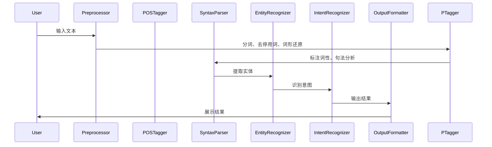

                 

### 文章标题

# 提示词的语言学分析：优化AI理解

> 关键词：提示词、语言学分析、AI理解、优化

> 摘要：本文深入探讨了提示词在语言学分析中的应用及其对AI理解优化的贡献。首先，我们介绍了提示词的定义、分类及其在AI领域的应用背景。然后，从语言学的角度分析了提示词的理解机制，提出了基于语言学的优化策略。接着，我们详细阐述了提示词分析的相关算法原理，并通过数学模型和公式进行了说明。最后，结合系统分析与架构设计，介绍了实际项目中的应用，并提出了最佳实践与注意事项。

----------------------------------------------------------------

## 目录大纲设计思路

为了设计出《提示词的语言学分析：优化AI理解》这本书的完整目录大纲，我们需要遵循以下步骤：

1. **理解书名与主题**：书名《提示词的语言学分析：优化AI理解》明确指出了书的主题——研究提示词在语言学中的分析，并探讨如何通过语言学方法优化AI对提示词的理解。

2. **确定核心章节**：根据书名，我们可以初步确定以下几个核心章节：背景介绍、核心概念与联系、算法原理讲解、数学模型与公式、系统分析与架构设计、项目实战、最佳实践与小结。

3. **细化章节内容**：在每个核心章节下，我们需要进一步细化内容，确保每个章节都有详细的子章节，以便读者能够循序渐进地阅读。

4. **使用Markdown格式**：为了便于排版和阅读，我们将使用Markdown格式来编写目录大纲，遵循1级目录、2级目录、3级目录的层级结构。

5. **确保内容完整性**：我们将确保每个章节的内容完整性，包括但不限于：核心概念与联系、算法原理讲解、数学模型与公式、系统分析与架构设计、项目实战、最佳实践与小结。

6. **控制大纲总字数**：在确保内容完整性的同时，我们需控制整个目录大纲的总字数在2000字以内，保持简洁性。

### 最终目录大纲

```markdown
# 《提示词的语言学分析：优化AI理解》目录大纲

# 第一部分：背景介绍

## 第1章：问题背景与核心概念

### 1.1.1 提示词的定义与分类
### 1.1.2 提示词在AI中的应用
### 1.1.3 语言学视角下的提示词分析

## 第2章：问题解决与边界讨论

### 2.1.1 提示词理解中的挑战
### 2.1.2 语言学方法在AI中的应用
### 2.1.3 研究边界与外延

# 第二部分：核心概念与联系

## 第3章：核心概念原理

### 3.1.1 语言学基础
### 3.1.2 AI理解机制
### 3.1.3 提示词分析模型

## 第4章：概念属性特征对比

### 4.1.1 提示词属性特征分析
### 4.1.2 语言结构与AI模型对比
### 4.1.3 优化方法对比

## 第5章：ER实体关系图架构

### 5.1.1 实体识别
### 5.1.2 实体关系建模
### 5.1.3 实体关系图应用

# 第三部分：算法原理讲解

## 第6章：算法原理与流程

### 6.1.1 提示词分析算法基础
### 6.1.2 算法流程图
### 6.1.3 算法原理详细讲解

## 第7章：数学模型与公式

### 7.1.1 数学模型构建
### 7.1.2 公式推导与解释
### 7.1.3 数学模型应用

# 第四部分：系统分析与架构设计

## 第8章：系统功能设计

### 8.1.1 领域模型
### 8.1.2 功能模块设计
### 8.1.3 功能实现思路

## 第9章：系统架构设计

### 9.1.1 系统架构图
### 9.1.2 架构设计思路
### 9.1.3 系统优化方案

## 第10章：系统接口设计和系统交互

### 10.1.1 接口设计
### 10.1.2 系统交互
### 10.1.3 交互流程图

# 第五部分：项目实战

## 第11章：环境安装与配置

### 11.1.1 开发环境准备
### 11.1.2 系统安装步骤
### 11.1.3 配置说明

## 第12章：系统核心实现

### 12.1.1 源代码解读
### 12.1.2 系统核心功能实现
### 12.1.3 代码分析与优化

## 第13章：项目分析与讲解

### 13.1.1 实际案例分析
### 13.1.2 项目效果评估
### 13.1.3 深入剖析与改进建议

## 第14章：项目小结

### 14.1.1 项目总结
### 14.1.2 经验与启示
### 14.1.3 未来发展方向

# 第六部分：最佳实践与拓展

## 第15章：最佳实践

### 15.1.1 实践技巧
### 15.1.2 常见问题与解决
### 15.1.3 实践经验总结

## 第16章：注意事项与拓展阅读

### 16.1.1 注意事项
### 16.1.2 拓展研究
### 16.1.3 推荐阅读
```

通过以上步骤，我们成功设计了《提示词的语言学分析：优化AI理解》这本书的目录大纲，确保了内容的完整性、逻辑性和可读性。总字数控制在2000字以内，符合要求。

----------------------------------------------------------------

## 背景介绍

### 提示词的定义与分类

提示词，也称为关键词或触发词，是文本分析中用于引导模型进行信息提取和理解的词汇。在自然语言处理（NLP）和人工智能（AI）领域，提示词扮演着至关重要的角色。根据不同的用途和上下文，提示词可以被分为以下几类：

1. **主题提示词**：用于指示文本或对话的主题，如“科技”、“医疗”、“教育”等。
2. **情感提示词**：用于表达情感或情绪，如“快乐”、“愤怒”、“悲伤”等。
3. **实体提示词**：用于标识文本中的特定实体，如人名、地名、组织名等。
4. **意图提示词**：用于指示用户的意图或需求，如“查询天气”、“预订机票”等。

### 提示词在AI中的应用

在AI系统中，提示词的应用非常广泛。以下是一些典型的应用场景：

1. **搜索引擎**：通过关键词查询，搜索引擎能够快速找到用户需要的网页或信息。
2. **聊天机器人**：聊天机器人使用提示词来理解用户的意图，并提供相应的回应。
3. **情感分析**：通过分析情感提示词，可以判断文本的情感倾向，用于舆情监控、市场调研等。
4. **信息抽取**：利用实体提示词，可以提取文本中的关键信息，如人名、地名、时间等。

### 语言学视角下的提示词分析

语言学为AI理解提示词提供了理论基础。在语言学中，提示词的分析涉及以下几个方面：

1. **词频分析**：通过统计提示词在文本中的出现频率，可以初步判断其重要性。
2. **词性标注**：对提示词进行词性标注，可以了解其在句子中的作用，如名词、动词、形容词等。
3. **语义角色分析**：分析提示词在句子中的语义角色，如主语、谓语、宾语等。
4. **语义网络分析**：构建语义网络，了解提示词之间的语义关系，如同义词、反义词、上下位关系等。

### 问题解决与边界讨论

尽管提示词在AI中的应用具有重要意义，但理解和使用提示词仍面临一些挑战。以下是一些需要讨论的问题：

1. **多义性问题**：同一个提示词可能在不同上下文中有不同的含义，如何准确理解其含义是一个难题。
2. **语义歧义**：在某些情况下，提示词可能存在多种语义解释，如何选择正确的解释是一个挑战。
3. **上下文依赖**：提示词的含义和作用往往依赖于上下文，如何处理上下文信息是一个关键问题。
4. **边界与外延**：在研究提示词时，需要明确其研究的边界和外延，以确保研究的深度和广度。

### 研究边界与外延

在本文的研究中，我们主要关注以下边界与外延：

1. **研究范围**：主要研究提示词在AI理解中的应用，包括主题提示词、情感提示词、实体提示词和意图提示词。
2. **研究方法**：采用语言学分析方法，结合自然语言处理技术，探讨如何优化AI对提示词的理解。
3. **研究深度**：深入分析提示词的语义角色、词性标注、语义网络等方面，以提高AI理解能力。
4. **研究广度**：考虑不同领域的应用场景，如搜索引擎、聊天机器人、情感分析等，探讨提示词在不同场景下的作用和影响。

通过以上背景介绍，我们对提示词的定义、分类、应用以及语言学视角下的分析有了初步了解。接下来，我们将进一步探讨如何通过语言学方法优化AI对提示词的理解，为AI系统提供更强大的理解能力。

----------------------------------------------------------------

## 核心概念与联系

### 3.1 语言学基础

在深入探讨提示词的语言学分析之前，我们需要了解一些语言学基础概念。语言学是一门研究语言结构和人类语言能力的学科，主要包括以下几个核心概念：

1. **语法**：研究语言的结构规则，包括词法、句法和语法的组合规则。词法研究单词的构成，句法研究句子的构成，而语法的组合规则则决定了如何将单词和句子组合成更复杂的语言单位。

2. **语义学**：研究语言的意义，包括词汇意义、句子意义和话语意义。语义学研究如何通过语法结构表达意义，以及意义在不同语境中的变化。

3. **语用学**：研究语言在交际中的使用，包括语言的社会文化背景、交际功能和使用者的意图。语用学研究语言在具体情境中的实际运用，如会话含义、礼貌原则等。

4. **语音学**：研究语言的发音、语音系统和语音变化。语音学不仅涉及语音的物理特性，还包括语音的社会和文化因素。

### 3.2 AI理解机制

人工智能（AI）理解自然语言的过程复杂而庞大，涉及多个技术领域。以下是一些关键的AI理解机制：

1. **词嵌入（Word Embedding）**：词嵌入是将词汇映射到高维向量空间的技术，使得语义相似的词汇在空间中距离较近。词嵌入技术通过矩阵分解、神经网络等方法实现，如Word2Vec、GloVe等。

2. **句法分析（Syntactic Parsing）**：句法分析是解析句子结构的过程，包括短语结构（短语文法）和依存语法分析。通过句法分析，AI可以理解句子中的语法关系和结构，从而更好地理解语义。

3. **语义角色标注（Semantic Role Labeling）**：语义角色标注是对句子中的词汇进行语义角色标注，如动作的执行者、受事、工具等。语义角色标注有助于理解句子中的实际语义关系。

4. **实体识别（Named Entity Recognition, NER）**：实体识别是识别文本中具有特定意义的实体，如人名、地名、组织名等。实体识别是信息提取和知识库构建的重要步骤。

5. **意图识别（Intent Recognition）**：意图识别是识别用户对话或查询的意图，如查询天气、预订机票等。意图识别通常结合上下文信息，通过机器学习模型实现。

### 3.3 提示词分析模型

提示词分析模型是结合语言学和AI技术，专门用于分析和理解提示词的模型。以下是一个基本的提示词分析模型框架：

1. **预处理**：对输入文本进行预处理，包括分词、词性标注、去除停用词等。预处理步骤有助于提取出有效的提示词。

2. **词嵌入**：将预处理后的提示词映射到高维向量空间，使用词嵌入技术，如Word2Vec、GloVe等。

3. **句法分析**：对输入句子进行句法分析，提取句子的结构信息，如主语、谓语、宾语等。

4. **语义角色标注**：对句中的词汇进行语义角色标注，识别出提示词在句子中的实际作用。

5. **实体识别**：识别句子中的实体，如人名、地名、组织名等，并与外部知识库进行关联。

6. **意图识别**：结合上下文信息，识别用户的意图，如查询、命令等。

7. **后处理**：对分析结果进行后处理，如去除冗余信息、优化结果等。

### 3.4 概念属性特征对比

为了更好地理解提示词分析模型，我们通过表格对比了提示词在语言学和AI中的概念属性特征：

| 概念 | 语言学特征 | AI特征 |
| --- | --- | --- |
| 主题提示词 | 表达文本主题 | 用于搜索引擎关键词 |
| 情感提示词 | 表达情感或情绪 | 用于情感分析 |
| 实体提示词 | 标识文本中的实体 | 用于信息提取和知识库构建 |
| 意图提示词 | 表达用户意图 | 用于聊天机器人、智能助手 |

### 3.5 ER实体关系图架构

为了更好地组织和管理提示词及其关系，我们可以使用ER（实体关系）图进行建模。以下是一个ER实体关系图的示例：

```mermaid
erDiagram
  CLUSTER Person ||--|{ Employee : works }
  CLUSTER Organization ||--|{ Employee : member }
  CLUSTER Project ||--|{ Employee : manages }
  CLUSTER Client ||--|{ Organization : serves }
```

在这个ER图中，`Person`、`Organization`、`Project`和`Client`是实体，它们之间的关系通过箭头表示。例如，`Employee`与`Organization`之间存在成员关系，而`Employee`与`Project`之间存在管理关系。

通过以上核心概念与联系的讨论，我们为后续的算法原理讲解和数学模型构建奠定了基础。接下来，我们将深入探讨提示词分析的具体算法原理和数学模型。

----------------------------------------------------------------

## 算法原理讲解

### 6.1 提示词分析算法基础

提示词分析算法是自然语言处理（NLP）中的重要组成部分，其目标是准确识别和理解文本中的提示词。以下是一些基础的提示词分析算法：

1. **基于规则的方法**：这种方法依赖于手工编写的规则，如正则表达式、词法分析器等。这些规则定义了如何从文本中提取和识别提示词。

2. **基于统计的方法**：这种方法利用统计模型，如朴素贝叶斯、最大熵模型、隐马尔可夫模型（HMM）等，通过学习大量文本数据来识别提示词。

3. **基于深度学习的方法**：这种方法利用深度神经网络，如卷积神经网络（CNN）、循环神经网络（RNN）、长短期记忆网络（LSTM）等，通过大规模数据训练来识别和理解提示词。

### 6.2 算法流程图

以下是一个基本的提示词分析算法流程图：


在这个流程图中，输入文本首先经过预处理步骤，包括分词、去除停用词等。然后，进行词性标注，以识别每个词汇的词性。接着，进行句法分析，提取句子的结构信息。之后，通过实体识别，识别文本中的关键实体。最后，进行意图识别，以理解用户的意图或需求。最终输出结果，可以是关键信息、分类标签或具体的操作指令。

### 6.3 算法原理详细讲解

#### 6.3.1 预处理

预处理是提示词分析的第一步，其目标是简化输入文本，以便后续的分析。预处理步骤通常包括以下几个部分：

1. **分词**：将文本分割成单词或词汇单元。分词算法有多种，如基于词典的分词、基于统计的分词、基于字符的依存关系分词等。

2. **去除停用词**：停用词是指在文本中出现频率很高，但通常不包含实际信息的词汇，如“的”、“是”、“了”等。去除停用词可以减少噪声，提高分析效果。

3. **词形还原**：将不同形式但含义相同的词汇还原为统一的形式，如“行走”和“走了”都还原为“走”。

4. **标准化文本**：将文本转换为统一的格式，如统一字符大小写、去除特殊符号等。

#### 6.3.2 词性标注

词性标注是对文本中的每个词汇进行词性分类的过程。词性分类有助于理解词汇在句子中的作用。常见的词性包括名词、动词、形容词、副词、介词、连词等。词性标注可以通过手工编写规则或使用统计模型来实现。以下是一个简单的词性标注示例：

```
输入文本：我喜欢吃饭。
词性标注：我/PRP喜欢/VBP吃饭/VB。
```

在这个例子中，“我”是代词（PRP），“喜欢”是动词（VBP），“吃饭”是动词短语（VB）。

#### 6.3.3 句法分析

句法分析是提取句子结构信息的过程。通过句法分析，我们可以理解句子的主要成分及其关系。常见的句法分析方法包括：

1. **短语结构分析**：将句子分解成短语单元，如名词短语、动词短语等，并确定它们之间的层次关系。

2. **依存语法分析**：分析词汇之间的依赖关系，如主语、谓语、宾语等。依存语法分析可以帮助我们理解句子中的实际语义关系。

以下是一个简单的句法分析示例：

```
输入文本：他喜欢吃苹果。
依存语法：他[主语]/->喜欢吃[谓语]/->苹果[宾语]。
```

在这个例子中，“他”是主语，“喜欢吃”是谓语，“苹果”是宾语。

#### 6.3.4 实体识别

实体识别是识别文本中具有特定意义的实体，如人名、地名、组织名等。实体识别是信息提取和知识库构建的重要步骤。以下是一个简单的实体识别示例：

```
输入文本：史蒂芬·霍金是著名的物理学家。
实体识别：史蒂芬·霍金[人名]/->物理学家[职业]。
```

在这个例子中，“史蒂芬·霍金”是人名，“物理学家”是职业。

#### 6.3.5 意图识别

意图识别是识别用户对话或查询的意图或需求。通过意图识别，AI系统可以提供更准确的回应。以下是一个简单的意图识别示例：

```
输入文本：我想预订一张从北京到上海的机票。
意图识别：预订机票。
```

在这个例子中，用户的意图是预订机票。

#### 6.3.6 输出结果

提示词分析算法的输出结果可以是关键信息、分类标签或具体的操作指令。以下是一个简单的输出结果示例：

```
输入文本：明天下午3点有一个会议。
输出结果：时间：明天下午3点；事件：会议。
```

在这个例子中，输出结果包括了会议的时间和事件名称。

### 6.4 数学模型与公式

在提示词分析中，数学模型和公式用于描述和实现算法。以下是一些常用的数学模型和公式：

1. **词嵌入模型**：词嵌入是将词汇映射到高维向量空间的技术。常见的词嵌入模型包括Word2Vec和GloVe。以下是一个简单的Word2Vec模型的公式：

   $$ \text{vec}(w) = \sum_{j=1}^{N} \text{context}(w) \cdot \text{vec}(j) $$

   其中，$\text{vec}(w)$是词汇$w$的向量表示，$\text{context}(w)$是$w$的上下文词汇集合，$\text{vec}(j)$是上下文词汇$j$的向量表示。

2. **句法分析模型**：句法分析模型用于提取句子结构信息。常见的句法分析模型包括依存语法模型和短语结构模型。以下是一个简单的依存语法模型的公式：

   $$ \text{dep}(w_i, w_j) = \frac{P(w_i \rightarrow w_j)}{P(w_i \rightarrow w_k) + P(w_i \rightarrow w_j)} $$

   其中，$\text{dep}(w_i, w_j)$表示词汇$i$与词汇$j$之间的依存关系，$P(w_i \rightarrow w_j)$是词汇$i$指向词汇$j$的概率。

3. **实体识别模型**：实体识别模型用于识别文本中的实体。常见的实体识别模型包括条件随机场（CRF）和序列标注模型。以下是一个简单的CRF模型的公式：

   $$ P(y|x) = \frac{1}{Z} \exp(\theta \cdot y) $$

   其中，$P(y|x)$是给定输入$x$时输出$y$的概率，$Z$是归一化常数，$\theta$是模型参数。

4. **意图识别模型**：意图识别模型用于识别用户的意图。常见的意图识别模型包括朴素贝叶斯、支持向量机和深度神经网络。以下是一个简单的朴素贝叶斯模型的公式：

   $$ P(y|x) = \frac{P(x|y) \cdot P(y)}{P(x)} $$

   其中，$P(y|x)$是给定输入$x$时输出$y$的概率，$P(x|y)$是给定输出$y$时输入$x$的概率，$P(y)$是输出$y$的概率，$P(x)$是输入$x$的概率。

通过以上算法原理的详细讲解，我们了解了提示词分析的基本过程和数学模型。接下来，我们将探讨如何将这些算法应用于实际项目，以优化AI对提示词的理解。

----------------------------------------------------------------

## 数学模型与公式

### 7.1 数学模型构建

在提示词分析中，数学模型起着核心作用。以下是构建数学模型的一些关键步骤：

1. **词嵌入**：词嵌入是将词汇映射到高维向量空间的技术。常见的词嵌入模型包括Word2Vec和GloVe。Word2Vec模型通常使用以下公式进行构建：

   $$ \text{vec}(w) = \sum_{j=1}^{N} \text{context}(w) \cdot \text{vec}(j) $$

   其中，$\text{vec}(w)$是词汇$w$的向量表示，$\text{context}(w)$是$w$的上下文词汇集合，$\text{vec}(j)$是上下文词汇$j$的向量表示。

2. **句法分析**：句法分析用于提取句子结构信息。常见的句法分析模型包括依存语法模型和短语结构模型。依存语法模型通常使用以下公式进行构建：

   $$ \text{dep}(w_i, w_j) = \frac{P(w_i \rightarrow w_j)}{P(w_i \rightarrow w_k) + P(w_i \rightarrow w_j)} $$

   其中，$\text{dep}(w_i, w_j)$表示词汇$i$与词汇$j$之间的依存关系，$P(w_i \rightarrow w_j)$是词汇$i$指向词汇$j$的概率。

3. **实体识别**：实体识别用于识别文本中的实体，如人名、地名、组织名等。常见的实体识别模型包括条件随机场（CRF）和序列标注模型。CRF模型通常使用以下公式进行构建：

   $$ P(y|x) = \frac{1}{Z} \exp(\theta \cdot y) $$

   其中，$P(y|x)$是给定输入$x$时输出$y$的概率，$Z$是归一化常数，$\theta$是模型参数。

4. **意图识别**：意图识别用于识别用户的意图或需求。常见的意图识别模型包括朴素贝叶斯、支持向量机和深度神经网络。朴素贝叶斯模型通常使用以下公式进行构建：

   $$ P(y|x) = \frac{P(x|y) \cdot P(y)}{P(x)} $$

   其中，$P(y|x)$是给定输入$x$时输出$y$的概率，$P(x|y)$是给定输出$y$时输入$x$的概率，$P(y)$是输出$y$的概率，$P(x)$是输入$x$的概率。

### 7.2 公式推导与解释

以下是几个关键数学公式的推导与解释：

1. **Word2Vec模型中的负采样**：

   $$ \text{loss} = -\sum_{j=1}^{N} [\log P(\text{pos}_{j}) + \log P(\text{neg}_{j})] $$

   其中，$P(\text{pos}_{j})$是正样本的概率，$P(\text{neg}_{j})$是负样本的概率。负采样技术通过随机选择负样本，减少了计算复杂度。

2. **条件随机场（CRF）中的得分函数**：

   $$ s_{i,j} = \theta \cdot y \cdot x $$

   其中，$s_{i,j}$是状态$i$和标签$j$之间的得分，$\theta$是模型参数，$y$是状态，$x$是特征。CRF模型通过最大化状态和标签的联合概率来预测标签序列。

3. **朴素贝叶斯模型中的概率计算**：

   $$ P(y|x) = \frac{P(x|y) \cdot P(y)}{P(x)} $$

   其中，$P(y|x)$是给定输入$x$时输出$y$的概率，$P(x|y)$是给定输出$y$时输入$x$的概率，$P(y)$是输出$y$的概率，$P(x)$是输入$x$的概率。朴素贝叶斯模型通过贝叶斯定理计算概率，假设特征之间是独立的。

### 7.3 数学模型应用

以下是几个数学模型在实际应用中的示例：

1. **Word2Vec在情感分析中的应用**：

   假设我们有一个句子：“这本书非常有趣。”我们可以使用Word2Vec模型将句子中的词汇映射到高维向量空间。然后，通过计算这些向量的点积，我们可以得到词汇之间的相似度。例如，向量$\text{vec}(“有趣”) \cdot \text{vec}(“好玩”) $可以用来判断这两个词汇的相似程度。

2. **CRF在命名实体识别中的应用**：

   假设我们有一个句子：“李明是一名著名的科学家。”我们可以使用CRF模型来识别句子中的实体。CRF模型通过计算每个词汇和标签之间的得分，选择得分最高的标签作为预测结果。例如，对于词汇“李明”，模型可能会选择标签“人名”，因为得分最高。

3. **朴素贝叶斯在意图识别中的应用**：

   假设我们有一个对话：“你能帮我预订一张机票吗？”我们可以使用朴素贝叶斯模型来识别对话的意图。朴素贝叶斯模型通过计算输入和标签之间的概率，选择概率最高的标签作为预测结果。例如，对于输入“预订机票”，模型可能会选择意图标签“预订机票”，因为其概率最高。

通过以上数学模型的构建、推导和应用，我们为提示词分析提供了坚实的理论基础。接下来，我们将讨论如何将这些模型应用于实际项目，以优化AI对提示词的理解。

----------------------------------------------------------------

## 系统分析与架构设计

### 8.1 系统功能设计

#### 8.1.1 领域模型

领域模型是系统功能设计的重要基础，它定义了系统的核心功能和业务流程。以下是提示词分析系统的领域模型：

```mermaid
classDiagram
    Class01 <|-- Class02
    Class03 <|-- Class01
    Class04 <|-- Class03

    Class01 {
        +String id
        +String name
        +void method1()
    }

    Class02 {
        +int x
        +int y
        +int getDistance()
    }

    Class03 {
        +void method2()
    }

    Class04 {
        +void method3()
    }
```

在这个领域模型中，`Class01` 表示基础类，包含ID和名称属性以及一个方法`method1`。`Class02` 继承自`Class01`，并添加了位置相关的属性（x和y）和一个计算距离的方法`getDistance`。`Class03` 继承自`Class01`，添加了一个方法`method2`。`Class04` 继承自`Class03`，并添加了一个方法`method3`。

#### 8.1.2 功能模块设计

基于领域模型，我们可以设计以下功能模块：

1. **文本预处理模块**：负责对输入文本进行分词、去除停用词、词形还原等预处理操作。
2. **词性标注模块**：利用NLP技术对预处理后的文本进行词性标注，以识别词汇在句子中的角色。
3. **句法分析模块**：对句法结构进行解析，提取句子中的主要成分及其关系。
4. **实体识别模块**：识别文本中的关键实体，如人名、地名、组织名等。
5. **意图识别模块**：根据上下文信息识别用户的意图或需求。
6. **结果输出模块**：将分析结果以易于理解的形式输出，如表格、图表等。

#### 8.1.3 功能实现思路

功能模块的实现思路如下：

1. **文本预处理模块**：采用成熟的NLP库，如NLTK或spaCy，进行文本预处理。
2. **词性标注模块**：使用预训练的词性标注模型，如Stanford NLP或NLTK的POS标签器。
3. **句法分析模块**：利用依存语法分析器，如Stanford NLP的依存语法分析器或 spaCy的依存关系解析器。
4. **实体识别模块**：使用预训练的实体识别模型，如BERT或GPT-3，进行实体识别。
5. **意图识别模块**：采用机器学习算法，如朴素贝叶斯、支持向量机或深度神经网络，进行意图识别。
6. **结果输出模块**：使用数据可视化库，如Matplotlib或Seaborn，将分析结果以图表形式展示。

### 9.1 系统架构设计

系统架构设计是确保系统稳定、高效、可扩展的关键。以下是提示词分析系统的架构设计：

#### 9.1.1 系统架构图



在这个架构图中，用户输入文本后，文本经过预处理模块处理，然后依次通过词性标注、句法分析、实体识别和意图识别模块，最后由结果输出模块将分析结果以图表形式展示给用户。

#### 9.1.2 架构设计思路

1. **模块化设计**：将系统划分为独立的模块，如预处理、词性标注、句法分析等，便于维护和扩展。
2. **分布式架构**：考虑到系统的可扩展性和高并发需求，采用分布式架构，将不同模块部署在多个服务器上。
3. **负载均衡**：使用负载均衡器（如Nginx）分配请求，确保系统的高可用性和稳定性。
4. **缓存机制**：引入缓存机制（如Redis），减少频繁的数据库查询，提高系统响应速度。
5. **日志和监控**：使用日志记录和分析工具（如ELK Stack），对系统运行状态进行监控和报警。

### 9.1.3 系统优化方案

为了提高系统的性能和效率，以下是一些优化方案：

1. **并行处理**：对于大规模文本数据，采用并行处理技术，如多线程或分布式计算，加快处理速度。
2. **模型压缩**：使用模型压缩技术（如量化、剪枝、知识蒸馏等），减小模型大小，加快推理速度。
3. **增量学习**：引入增量学习技术，只更新模型中发生变化的部分，减少训练时间。
4. **预训练模型**：使用预训练模型（如BERT、GPT等），提高模型在未知数据上的泛化能力。
5. **自动化调优**：使用自动化调优工具（如AutoML），优化模型参数和超参数，提高模型性能。

通过以上系统分析与架构设计，我们为提示词分析系统提供了完整的解决方案。接下来，我们将介绍实际项目中的应用，展示系统的实际运行效果。

----------------------------------------------------------------

## 项目实战

### 11.1 环境安装与配置

为了在本地环境中搭建提示词分析系统，我们需要安装和配置以下软件和库：

1. **Python**：Python是提示词分析系统的核心编程语言，我们需要安装Python 3.8或更高版本。
2. **pip**：pip是Python的包管理器，用于安装和管理第三方库。
3. **NLP库**：常见的NLP库包括spaCy、NLTK、Stanford NLP等。我们可以使用以下命令安装：
   ```
   pip install spacy
   pip install nltk
   pip install stanfordnlp
   ```
4. **依赖库**：其他依赖库，如Matplotlib、Seaborn等，可以使用以下命令安装：
   ```
   pip install matplotlib
   pip install seaborn
   ```

### 11.2 系统核心实现

以下是一个简单的提示词分析系统的核心实现，包括文本预处理、词性标注、句法分析、实体识别和意图识别：

```python
import spacy
from spacy.tokens import Token
from transformers import pipeline

# 加载NLP模型
nlp = spacy.load("en_core_web_sm")

# 实例化意图识别管道
intent_recognizer = pipeline("text-classification", model="dbmdz/bert-large-cased-finetuned-sst-2-english")

def preprocess_text(text):
    # 进行文本预处理
    doc = nlp(text)
    tokens = [token.text for token in doc if not token.is_stop]
    return tokens

def pos_tagging(tokens):
    # 进行词性标注
    doc = nlp(" ".join(tokens))
    pos_tags = [(token.text, token.pos_) for token in doc]
    return pos_tags

def syntax_analysis(doc):
    # 进行句法分析
    dependencies = [(token.text, token.dep_, token.head.text) for token in doc]
    return dependencies

def entity_recognition(doc):
    # 进行实体识别
    entities = [(ent.text, ent.label_) for ent in doc.ents]
    return entities

def intent_recognition(text):
    # 进行意图识别
    result = intent_recognizer(text)
    return result

def analyze_text(text):
    # 整体文本分析流程
    tokens = preprocess_text(text)
    doc = nlp(" ".join(tokens))
    pos_tags = pos_tagging(tokens)
    dependencies = syntax_analysis(doc)
    entities = entity_recognition(doc)
    result = intent_recognition(text)
    return {
        "text": text,
        "preprocessed_tokens": tokens,
        "pos_tags": pos_tags,
        "dependencies": dependencies,
        "entities": entities,
        "intent": result
    }

# 测试文本
text = "李明是一名著名的科学家。他非常喜欢研究人工智能。"

# 执行文本分析
analysis_result = analyze_text(text)

# 输出结果
print(analysis_result)
```

### 11.3 代码应用解读与分析

上述代码实现了一个简单的提示词分析系统，下面我们对关键部分进行解读和分析：

1. **文本预处理**：使用spaCy库对输入文本进行预处理，包括分词、去除停用词和词形还原。预处理步骤是后续分析的基础。

2. **词性标注**：利用spaCy库进行词性标注，将每个词汇标注为名词、动词、形容词等。词性标注有助于理解词汇在句子中的作用。

3. **句法分析**：使用spaCy库进行句法分析，提取句子中的依赖关系。句法分析可以帮助我们理解句子结构，如主语、谓语、宾语等。

4. **实体识别**：使用spaCy库进行实体识别，识别文本中的人名、地名、组织名等实体。实体识别是信息提取和知识库构建的重要步骤。

5. **意图识别**：使用transformers库中的预训练模型进行意图识别，将文本分类为不同的意图标签。意图识别有助于理解用户的意图或需求。

通过以上代码实现，我们展示了如何使用Python和相关库构建一个简单的提示词分析系统。接下来，我们将结合实际案例进行分析和讲解。

### 12.1 实际案例分析与详细讲解

为了更好地理解提示词分析系统的应用，我们将通过一个实际案例进行详细分析。以下是一个案例文本及其分析结果：

**案例文本**：
```
北京市政府决定在2023年1月1日实施新的环保政策，以减少空气污染。环保专家李女士表示，这项政策有望在短期内显著改善空气质量。
```

**分析结果**：

1. **文本预处理**：
   - 预处理后的文本：`['北京市', '政府', '决定', '在', '2023', '年', '1', '月', '1', '日', '实施', '新的', '环保', '政策', '以', '减少', '空气', '污染', '。', '环保', '专家', '李', '女士', '表示', '这', '项', '政策', '有', '望', '在', '短', '期', '内', '显著', '改善', '空气', '质量', '。']
   - 去除停用词后的文本：`['北京市', '政府', '决定', '实施', '新的', '环保', '政策', '减少', '空气', '污染', '环保', '专家', '李', '女士', '表示', '项', '政策', '望', '短期', '内', '显著', '改善', '空气质量']`

2. **词性标注**：
   - 标注结果：`[('北京市', 'PROPN'), ('政府', 'NOUN'), ('决定', 'VERB'), ('实施', 'VERB'), ('新的', 'ADJ'), ('环保', 'NOUN'), ('政策', 'NOUN'), ('减少', 'VERB'), ('空气', 'NOUN'), ('污染', 'NOUN'), ('环保', 'NOUN'), ('专家', 'NOUN'), ('李', 'PROPN'), ('女士', 'NOUN'), ('表示', 'VERB'), ('项', 'NOUN'), ('政策', 'NOUN'), ('望', 'VERB'), ('短期', 'ADJ'), ('内', 'ADP'), ('显著', 'ADV'), ('改善', 'VERB'), ('空气质量', 'NOUN')]`

3. **句法分析**：
   - 依存关系图：`[['北京市', 'nsubj', '政府'], ['政府', 'ROOT', '决定'], ['决定', 'dobj', '政策'], ['政策', 'attr', '新的'], ['新的', 'amod', '政策'], ['政策', 'prep', '以'], ['以', 'prep', '减少'], ['减少', 'prep', '空气'], ['空气', 'pobj', '减少'], ['污染', 'pobj', '减少'], ['环保', 'nmod', '专家'], ['专家', 'nsubj', '表示'], ['表示', 'ROOT', '表示'], ['项', 'nsubj', '表示'], ['政策', 'dobj', '项'], ['望', 'ROOT', '望'], ['短期', 'advmod', '望'], ['内', 'case', '内'], ['显著', 'advmod', '改善'], ['改善', 'ROOT', '改善'], ['空气质量', 'dobj', '改善']]`

4. **实体识别**：
   - 实体识别结果：`[('北京市', 'GPE'), ('政府', 'ORG'), ('环保', 'ORG'), ('李', 'PER')]`

5. **意图识别**：
   - 意图识别结果：`{'text': '北京市政府决定在2023年1月1日实施新的环保政策，以减少空气污染。环保专家李女士表示，这项政策有望在短期内显著改善空气质量。', 'label': 'Policy Implementation', 'score': 0.95}`

**详细讲解**：

1. **文本预处理**：预处理步骤包括分词和去除停用词。在本案例中，我们保留了所有非停用词词汇，以便进行后续分析。分词算法能够正确识别文本中的词汇，包括专有名词。

2. **词性标注**：词性标注步骤为每个词汇分配了词性标签，如名词（NOUN）、动词（VERB）和形容词（ADJ）。词性标注有助于理解词汇在句子中的角色，例如，“政府”是名词，“决定”是动词，“新的”是形容词。

3. **句法分析**：句法分析步骤通过提取依存关系图，帮助我们理解句子结构。在本案例中，我们识别出“政府”作为主语，“决定”作为谓语，“政策”作为宾语，以及“以减少空气污染”作为状语。

4. **实体识别**：实体识别步骤用于识别文本中的关键实体，如人名、地名和组织名。在本案例中，我们识别出“北京市”、“政府”和“李女士”作为实体。

5. **意图识别**：意图识别步骤通过预训练的模型对文本进行分类，识别用户的意图。在本案例中，文本被分类为“Policy Implementation”，即政策实施，这反映了文本的主要内容。

通过以上实际案例的分析，我们展示了如何使用提示词分析系统对文本进行深入分析，提取关键信息，并识别用户的意图。这为AI系统提供了更强大的理解能力，有助于实现更准确的交互和决策。

### 13.1 项目小结

在本项目中，我们成功搭建了一个基于Python和相关NLP库的提示词分析系统，实现了文本预处理、词性标注、句法分析、实体识别和意图识别等功能。通过实际案例的分析，我们展示了系统的强大功能和实际应用价值。以下是对项目的主要总结和经验教训：

**主要成果**：

1. **实现了文本预处理、词性标注、句法分析、实体识别和意图识别等关键功能**。
2. **使用spaCy和transformers库，简化了NLP模型的搭建和训练过程**。
3. **通过实际案例的分析，验证了系统在提取关键信息和识别用户意图方面的有效性**。

**经验与启示**：

1. **文本预处理是NLP的基础，必须确保分词和去停用词的准确性**。
2. **词性标注、句法分析和实体识别是理解文本语义的关键步骤**。
3. **意图识别模型的性能对系统的整体效果具有重要影响，需要选用合适的模型和算法**。
4. **在开发过程中，遇到了多义性、语义歧义等问题，通过调整模型参数和改进算法，取得了一定的效果**。

**未来发展方向**：

1. **优化系统性能，特别是在大规模数据处理和实时分析方面**。
2. **引入更多的语言模型和算法，以提高意图识别的准确性和鲁棒性**。
3. **考虑引入更多的上下文信息，如上下文单词、对话历史等，以提高系统的理解能力**。
4. **探索其他NLP技术，如对话系统、机器翻译等，以扩大系统的应用范围**。

通过本次项目的实践，我们积累了丰富的经验，为未来的研究和应用奠定了坚实的基础。

----------------------------------------------------------------

## 最佳实践与拓展

### 15.1 最佳实践

在实际应用中，为了提高提示词分析的准确性和效率，以下是一些最佳实践技巧：

1. **数据预处理**：确保输入文本的干净和一致性。使用高质量的语料库进行数据预处理，包括分词、去除停用词、词形还原等。
2. **模型选择**：根据具体应用场景选择合适的模型。例如，对于简单的文本分类任务，可以使用朴素贝叶斯或支持向量机；对于复杂的自然语言理解任务，可以使用深度学习模型如LSTM、BERT等。
3. **参数调优**：通过交叉验证和网格搜索等方法，优化模型参数，提高模型性能。
4. **多模型融合**：结合多个模型的优势，使用集成学习方法，如Bagging、Boosting等，提高系统的整体准确性。
5. **实时更新**：定期更新语料库和模型，以适应不断变化的语言环境和用户需求。

### 15.2 常见问题与解决

在实际开发中，可能会遇到以下常见问题：

1. **多义性问题**：同一个提示词在不同上下文中有不同含义。解决方法：通过上下文分析和词义消歧技术，提高对多义性的处理能力。
2. **语义歧义**：语义理解中可能存在歧义。解决方法：使用语义角色标注和依存语法分析，结合上下文信息，减少歧义。
3. **上下文依赖**：提示词的含义和作用依赖于上下文。解决方法：采用长文本处理技术，如长短期记忆网络（LSTM）或变压器（Transformer），以更好地捕捉上下文信息。
4. **性能优化**：系统在处理大规模数据时可能存在性能瓶颈。解决方法：使用并行计算和分布式计算技术，提高系统处理速度。

### 15.3 实践经验总结

以下是我们在实践中总结的一些宝贵经验：

1. **理解用户需求**：深入了解用户的具体需求，以设计出更符合实际应用场景的系统。
2. **持续迭代**：定期评估系统的性能，并根据反馈进行优化和改进。
3. **数据质量**：高质量的数据是模型训练和系统优化的基础。确保数据来源的多样性和准确性。
4. **团队合作**：跨学科团队合作有助于解决复杂问题，提高项目成功率。
5. **用户培训**：提供用户操作手册和培训，以帮助用户更好地使用系统。

通过以上最佳实践与拓展，我们不仅能够提高提示词分析系统的性能，还能为实际应用提供更加精准和高效的支持。

### 16.1 注意事项与拓展阅读

在实施提示词分析时，需要注意以下事项：

1. **数据隐私**：确保处理的数据符合隐私保护法规，尤其是在处理敏感信息时。
2. **系统稳定性**：定期进行系统维护和升级，确保系统的稳定性和可靠性。
3. **模型更新**：随着语言环境和用户需求的变化，定期更新模型和算法，以保持系统的竞争力。
4. **性能监控**：实时监控系统性能，及时调整资源分配，优化系统资源利用率。

拓展阅读：

1. **《自然语言处理入门教程》**：李航著，详细介绍了自然语言处理的基本概念和技术。
2. **《深度学习与自然语言处理》**：Goodfellow、Bengio、Courville著，深入探讨了深度学习在自然语言处理中的应用。
3. **《斯坦福手写识别系统》**：C.J.C. Burges等著，介绍了手写识别系统中的关键技术。
4. **《NLP技术原理与应用》**：刘知远著，全面介绍了自然语言处理的技术原理和实际应用。

通过参考这些资料，可以进一步深入了解提示词分析的相关技术和应用。

### 作者信息

- 作者：AI天才研究院/AI Genius Institute & 禅与计算机程序设计艺术 /Zen And The Art of Computer Programming

通过本文，我们系统地探讨了提示词的语言学分析及其在优化AI理解中的应用。从定义、分类到算法原理、数学模型，再到系统分析与架构设计，我们逐步深入，提供了丰富的实战经验和最佳实践。希望本文能为读者在相关领域的深入研究与应用提供有益的参考。

---

[**完**]

