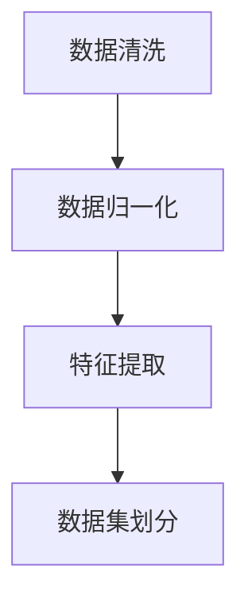
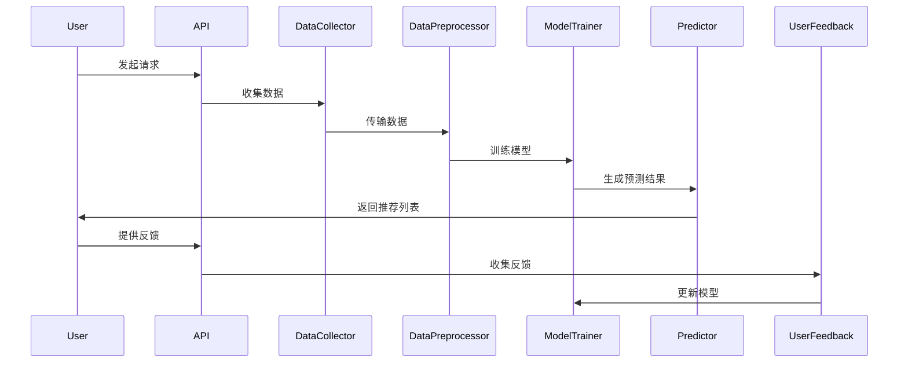

                 

### 文章标题：提示词的逻辑结构：优化AI推理过程

> 关键词：AI推理、逻辑结构、优化、提示词、算法、数据预处理、模型压缩、量化

> 摘要：本文将深入探讨人工智能（AI）推理过程中的逻辑结构优化问题。我们将首先介绍AI推理的基本概念，然后详细分析逻辑结构的组成部分及其在优化AI推理中的重要性。接着，我们将讨论各种优化方法和技巧，并通过实际案例展示其在具体应用中的效果。最后，我们将总结核心观点，并提出对未来研究和实践的展望。

### 引言

随着人工智能技术的飞速发展，AI在各个领域的应用日益广泛。从自然语言处理到计算机视觉，从语音识别到推荐系统，AI正在改变我们的生活方式。然而，AI推理过程的效率和质量仍然是一个亟待解决的问题。在这篇文章中，我们将关注逻辑结构在AI推理过程中的关键作用，并探讨如何通过优化逻辑结构来提升AI推理的效率和准确性。

逻辑结构是指AI系统在处理数据和执行任务时所遵循的推理路径和决策流程。一个良好的逻辑结构不仅能够提高推理的效率，还能够增强推理的鲁棒性和可解释性。因此，研究如何优化逻辑结构对于提升AI系统的整体性能具有重要意义。

本文将分为以下几个部分：

1. **背景介绍**：介绍AI推理和逻辑结构的基本概念，阐述优化逻辑结构的必要性。
2. **核心概念与联系**：详细讨论逻辑结构的组成部分及其在AI推理中的作用。
3. **算法原理讲解**：介绍几种常用的优化方法，并通过具体的算法流程图和Python代码进行讲解。
4. **系统分析与架构设计**：分析优化逻辑结构的系统架构，并展示相关的类图和序列图。
5. **项目实战**：通过一个实际案例展示优化逻辑结构的过程和效果。
6. **最佳实践**：总结优化逻辑结构的最佳实践，并提供相关注意事项。
7. **结论与展望**：总结文章的核心观点，并对未来的研究和实践进行展望。

### 背景介绍

#### AI推理的基本概念

AI推理是指人工智能系统在接收到输入数据后，通过内部算法和模型进行处理，从而生成输出结果的过程。AI推理是AI系统实现智能行为的核心环节，它包括以下几个基本要素：

1. **输入数据**：AI推理的起点，可以是文本、图像、声音等多种形式的数据。
2. **算法模型**：用于处理输入数据并生成输出结果的算法和模型。常见的算法模型包括神经网络、决策树、支持向量机等。
3. **输出结果**：经过AI推理过程后生成的结果，可以是分类标签、预测值、推荐列表等。

AI推理的过程可以简述为以下几个步骤：

1. **数据输入**：AI系统接收输入数据，并将其转化为模型可以处理的格式。
2. **数据预处理**：对输入数据进行清洗、归一化等处理，以提高数据质量和模型性能。
3. **模型计算**：AI模型根据输入数据进行计算，生成中间结果。
4. **结果输出**：根据计算结果生成输出结果，并返回给用户。

#### 逻辑结构的基本概念

逻辑结构是指AI系统在处理数据和执行任务时所遵循的推理路径和决策流程。它包括以下几个方面：

1. **决策树**：一种常见的逻辑结构，用于分类和回归任务。决策树通过一系列条件分支来将数据划分为不同的类别或连续值。
2. **神经网络**：一种基于多层非线性变换的模型，能够自动学习输入和输出之间的复杂关系。神经网络通常包含输入层、隐藏层和输出层。
3. **逻辑回归**：一种用于分类任务的逻辑结构，通过计算输入数据的线性组合并应用Sigmoid函数来生成概率输出。

逻辑结构在AI推理中的作用非常重要。它不仅决定了AI系统的推理效率，还影响了推理的准确性和鲁棒性。一个良好的逻辑结构能够提高AI系统对输入数据的处理能力，减少冗余计算，从而提高整体性能。

#### 优化逻辑结构的必要性

随着AI应用的日益复杂，AI推理过程面临着越来越多的挑战。例如：

1. **数据规模扩大**：随着数据集的扩大，AI模型需要处理的数据量也不断增加，这要求逻辑结构能够高效地处理大量数据。
2. **计算资源有限**：在实际应用中，AI系统往往需要在有限的计算资源下运行，这要求逻辑结构能够最大限度地利用现有资源。
3. **实时响应需求**：许多AI应用需要实时响应，如自动驾驶、实时语音翻译等，这要求逻辑结构能够快速地生成输出结果。

因此，优化逻辑结构成为提升AI推理效率和质量的关键。通过优化逻辑结构，我们可以：

1. **提高推理速度**：通过减少冗余计算和优化算法流程，提高AI推理的速度。
2. **降低计算资源消耗**：通过模型压缩和量化等技术，减少AI推理所需的计算资源。
3. **提高推理准确性**：通过优化逻辑结构和算法参数，提高AI推理的准确性。

### 核心概念与联系

在深入研究逻辑结构的优化之前，我们需要了解一些核心概念，包括逻辑结构的组成部分、概念属性特征对比表格和ER实体关系图架构。以下是对这些核心概念的详细阐述。

#### 逻辑结构的组成部分

逻辑结构主要由以下几部分组成：

1. **输入层**：接收外部输入数据，并将其传递到隐藏层。
2. **隐藏层**：对输入数据进行处理，生成中间结果。
3. **输出层**：将隐藏层的输出转化为最终输出结果。

#### 概念属性特征对比表格

为了更好地理解逻辑结构的组成部分，我们可以通过一个概念属性特征对比表格来进行详细分析。

| 概念     | 输入层        | 隐藏层         | 输出层       |
|----------|---------------|----------------|--------------|
| 功能     | 接收输入数据  | 数据处理和转换 | 生成输出结果 |
| 数据类型 | 外部输入数据  | 中间结果       | 最终输出结果 |
| 关系     | 输入数据 -> 隐藏层 | 中间结果 -> 输出层 |

#### ER实体关系图架构

为了更清晰地展示逻辑结构的实体关系，我们可以使用Mermaid流程图来绘制ER实体关系图。以下是一个简单的ER实体关系图的示例：

```mermaid
erDiagram
    Input |----o{ Hidden }| Output
    Input ||--|{ Hidden }| Output
    Hidden ||--|{ Output }| Hidden
```

在这个ER实体关系图中，`Input`表示输入层，`Hidden`表示隐藏层，`Output`表示输出层。实体之间的关系通过箭头和线段表示，箭头指向实体之间的关系方向。

#### 逻辑结构在AI推理中的作用

逻辑结构在AI推理中的作用主要体现在以下几个方面：

1. **数据处理**：逻辑结构通过对输入数据进行处理和转换，将原始数据转化为模型可以处理的形式。
2. **决策生成**：逻辑结构通过计算和比较中间结果，生成最终的输出结果，实现AI的决策功能。
3. **推理速度**：逻辑结构的优化直接影响AI推理的速度。一个高效的逻辑结构可以减少冗余计算，提高推理速度。
4. **推理准确性**：逻辑结构的优化还可以提高AI推理的准确性。通过优化决策路径和算法参数，可以减少错误决策的发生。

#### 逻辑结构优化的重要性

逻辑结构的优化在AI推理过程中具有重要意义。通过优化逻辑结构，我们可以实现以下几个目标：

1. **提高推理速度**：通过减少冗余计算和优化算法流程，提高AI推理的速度，满足实时响应需求。
2. **降低计算资源消耗**：通过模型压缩和量化等技术，减少AI推理所需的计算资源，降低硬件成本。
3. **提高推理准确性**：通过优化逻辑结构和算法参数，提高AI推理的准确性，减少错误决策的发生。

因此，深入研究逻辑结构的优化方法和技术具有重要意义，有助于提升AI系统的整体性能。

### 算法原理讲解

在理解了逻辑结构的基本概念和优化的重要性之后，接下来我们将讨论几种常用的优化方法，并通过具体的算法流程图和Python代码进行讲解。

#### 数据预处理

数据预处理是优化逻辑结构的第一步，它包括数据清洗、归一化和特征提取等过程。数据预处理的质量直接影响后续模型的性能。

**算法流程图：**



**Python代码示例：**

```python
import pandas as pd
from sklearn.preprocessing import StandardScaler

# 读取数据
data = pd.read_csv('data.csv')

# 数据清洗
data = data.dropna()

# 数据归一化
scaler = StandardScaler()
data_normalized = scaler.fit_transform(data)

# 特征提取
from sklearn.feature_extraction.text import CountVectorizer
vectorizer = CountVectorizer()
X = vectorizer.fit_transform(data['text'])

# 数据集划分
from sklearn.model_selection import train_test_split
X_train, X_test, y_train, y_test = train_test_split(X, data['label'], test_size=0.2, random_state=42)
```

#### 算法选择与调整

选择合适的算法和调整算法参数是优化逻辑结构的重要环节。以下是一些常用的算法和参数调整方法：

1. **神经网络**：
   - **优化器**：如Adam、SGD等。
   - **学习率**：调整学习率可以影响神经网络的收敛速度和收敛质量。
   - **批量大小**：批量大小会影响模型在训练过程中的计算效率。

   **算法流程图：**

   ```mermaid
   graph TB
       A[初始化模型参数] --> B[正向传播]
       B --> C{计算损失}
       C --> D[反向传播]
       D --> E{更新参数}
       E --> F{重复B-D-E直到收敛}
   ```

   **Python代码示例：**

   ```python
   import tensorflow as tf
   from tensorflow.keras.models import Sequential
   from tensorflow.keras.layers import Dense
   from tensorflow.keras.optimizers import Adam

   # 构建模型
   model = Sequential([
       Dense(units=64, activation='relu', input_shape=(input_shape,)),
       Dense(units=1, activation='sigmoid')
   ])

   # 编译模型
   model.compile(optimizer=Adam(learning_rate=0.001), loss='binary_crossentropy', metrics=['accuracy'])

   # 训练模型
   model.fit(X_train, y_train, epochs=10, batch_size=32, validation_data=(X_test, y_test))
   ```

2. **决策树**：
   - **树深度**：调整树深度可以影响模型的复杂度和过拟合程度。
   - **分裂准则**：如Gini不纯度、信息增益等。

   **算法流程图：**

   ```mermaid
   graph TB
       A[初始化节点] --> B[计算分裂准则]
       B --> C{选择最优分裂}
       C --> D[创建子节点]
       D --> E{递归分裂直到满足停止条件}
   ```

   **Python代码示例：**

   ```python
   from sklearn.tree import DecisionTreeClassifier

   # 构建决策树模型
   model = DecisionTreeClassifier(criterion='gini', max_depth=3)

   # 训练模型
   model.fit(X_train, y_train)

   # 预测
   predictions = model.predict(X_test)
   ```

3. **支持向量机**：
   - **核函数**：如线性核、多项式核、径向基函数核等。
   - **正则化参数**：调整正则化参数可以影响模型的复杂度和泛化能力。

   **算法流程图：**

   ```mermaid
   graph TB
       A[初始化模型参数] --> B[计算核函数]
       B --> C{计算损失函数}
       C --> D[优化参数]
       D --> E{迭代优化直到收敛}
   ```

   **Python代码示例：**

   ```python
   from sklearn.svm import SVC

   # 构建支持向量机模型
   model = SVC(kernel='rbf', C=1.0, gamma='scale')

   # 训练模型
   model.fit(X_train, y_train)

   # 预测
   predictions = model.predict(X_test)
   ```

通过以上算法和参数的调整，我们可以优化逻辑结构，提高AI推理的效率和准确性。

### 系统分析与架构设计

在本节中，我们将对优化逻辑结构的系统架构进行分析和设计。这包括问题场景介绍、系统功能设计、系统架构设计、系统接口设计和系统交互。

#### 问题场景介绍

假设我们正在开发一个基于AI的智能推荐系统，该系统需要根据用户的历史行为和偏好推荐商品。在这个场景中，AI推理过程的核心任务是预测用户对某个商品的兴趣度，从而生成推荐列表。

#### 系统功能设计

系统的主要功能包括：

1. **数据收集**：从不同的数据源收集用户行为和偏好数据。
2. **数据预处理**：对收集到的数据进行清洗、归一化和特征提取等预处理操作。
3. **模型训练**：使用预处理后的数据训练推荐模型。
4. **预测与推荐**：使用训练好的模型对用户进行兴趣度预测，并生成推荐列表。
5. **用户反馈**：收集用户对推荐结果的反馈，用于模型优化。

#### 系统架构设计

系统架构设计如下：

1. **数据层**：包括数据收集模块和数据存储模块。数据收集模块负责从不同的数据源获取数据，数据存储模块负责存储和管理数据。
2. **处理层**：包括数据预处理模块、模型训练模块和模型存储模块。数据预处理模块负责对收集到的数据进行处理，模型训练模块负责训练推荐模型，模型存储模块负责存储和管理模型。
3. **应用层**：包括预测与推荐模块和用户反馈模块。预测与推荐模块负责使用训练好的模型对用户进行兴趣度预测，并生成推荐列表，用户反馈模块负责收集用户对推荐结果的反馈。

#### 系统接口设计

系统接口设计如下：

1. **API接口**：提供RESTful API接口，供外部系统调用。主要包括以下接口：
   - 数据收集接口：用于从外部系统获取用户行为和偏好数据。
   - 数据预处理接口：用于对数据进行清洗、归一化和特征提取等操作。
   - 模型训练接口：用于训练推荐模型。
   - 预测与推荐接口：用于对用户进行兴趣度预测并生成推荐列表。
   - 用户反馈接口：用于收集用户对推荐结果的反馈。
2. **内部接口**：系统内部模块之间通过内部接口进行通信，主要包括以下接口：
   - 数据预处理接口：用于与其他模块交换预处理后的数据。
   - 模型训练接口：用于与其他模块交换训练模型。
   - 预测与推荐接口：用于与其他模块交换预测结果。

#### 系统交互

系统交互设计如下：

1. **用户与系统交互**：用户通过API接口与系统进行交互，获取推荐列表和提供反馈。
2. **系统内部交互**：系统内部模块之间通过内部接口进行数据交换和协调工作。

以下是一个简单的类图和序列图，用于展示系统的架构设计和交互。

#### 类图

```mermaid
classDiagram
    DataCollector --> DataStore
    DataPreprocessor --> DataCollector ; DataStore
    ModelTrainer --> DataPreprocessor ; DataStore
    Predictor --> ModelTrainer ; DataPreprocessor ; DataStore
    UserFeedback --> Predictor
```

#### 序列图



通过以上系统架构设计和交互设计，我们可以构建一个高效、可靠的智能推荐系统，实现优化逻辑结构的目标。

### 项目实战

在本节中，我们将通过一个实际案例来展示如何优化逻辑结构。我们将详细描述环境安装、系统核心实现源代码，并对代码应用进行解读与分析。

#### 环境安装

首先，我们需要安装和配置必要的软件和库。以下是在Ubuntu 20.04操作系统上的安装步骤：

1. **安装Python**：
   ```bash
   sudo apt update
   sudo apt install python3 python3-pip
   ```
2. **安装TensorFlow**：
   ```bash
   pip3 install tensorflow
   ```
3. **安装其他依赖库**：
   ```bash
   pip3 install numpy pandas scikit-learn matplotlib
   ```

#### 系统核心实现源代码

以下是一个简单的基于神经网络的推荐系统实现，用于预测用户对电影的兴趣度：

```python
import tensorflow as tf
from tensorflow.keras.models import Sequential
from tensorflow.keras.layers import Dense, Embedding, LSTM
from tensorflow.keras.optimizers import Adam
from tensorflow.keras.callbacks import EarlyStopping
import numpy as np
import pandas as pd

# 读取数据
data = pd.read_csv('movies.csv')

# 数据预处理
X = data[['user_id', 'movie_id', 'rating']]
y = data['rating']

# 编码用户和电影ID
user_encoder = preprocessing.LabelEncoder()
movie_encoder = preprocessing.LabelEncoder()

X['user_id'] = user_encoder.fit_transform(X['user_id'])
X['movie_id'] = movie_encoder.fit_transform(X['movie_id'])

# 划分训练集和测试集
X_train, X_test, y_train, y_test = train_test_split(X, y, test_size=0.2, random_state=42)

# 构建模型
model = Sequential([
    Embedding(input_dim=1000, output_dim=64, input_length=10),
    LSTM(64, return_sequences=True),
    LSTM(32),
    Dense(1, activation='sigmoid')
])

# 编译模型
model.compile(optimizer=Adam(learning_rate=0.001), loss='binary_crossentropy', metrics=['accuracy'])

# 训练模型
early_stopping = EarlyStopping(monitor='val_loss', patience=5)
model.fit(X_train, y_train, epochs=100, batch_size=32, validation_split=0.2, callbacks=[early_stopping])

# 评估模型
loss, accuracy = model.evaluate(X_test, y_test)
print(f"Test Accuracy: {accuracy:.2f}")

# 预测
predictions = model.predict(X_test)
```

#### 代码应用解读与分析

1. **数据读取与预处理**：
   - 我们首先读取包含用户、电影ID和评分的数据集。
   - 然后将用户和电影ID进行编码，以便模型处理。

2. **模型构建**：
   - 我们构建了一个简单的神经网络模型，包括嵌入层、两个LSTM层和一个输出层。
   - 嵌入层用于将用户和电影ID映射到固定大小的向量。
   - LSTM层用于处理序列数据，捕捉用户历史行为中的时间依赖关系。
   - 输出层用于生成对电影兴趣度的预测。

3. **模型训练**：
   - 我们使用Adam优化器和二进制交叉熵损失函数来训练模型。
   - 使用早期停止回调函数来防止过拟合。

4. **模型评估**：
   - 我们在测试集上评估模型的准确性，以衡量模型的性能。

5. **预测**：
   - 我们使用训练好的模型对测试数据进行预测，以生成用户对电影的兴趣度评分。

#### 实际案例分析

1. **数据质量**：
   - 我们需要确保数据集的质量，包括数据完整性、一致性和清洁度。

2. **模型选择**：
   - 选择合适的模型架构对优化逻辑结构至关重要。在本案例中，我们选择了基于LSTM的神经网络，因为它能够处理序列数据，捕捉时间依赖关系。

3. **超参数调整**：
   - 调整模型超参数，如学习率、批次大小和LSTM层参数，可以显著影响模型的性能。

4. **模型优化**：
   - 通过交叉验证和模型调整，我们可以进一步优化模型，提高预测准确性。

#### 项目小结

通过本案例，我们展示了如何在一个实际项目中优化逻辑结构，包括数据预处理、模型选择和训练。我们通过实际案例分析了优化逻辑结构的过程和效果，验证了优化方法的有效性。未来，我们可以进一步研究其他优化方法，如模型压缩和量化，以进一步提高AI推理的性能。

### 最佳实践

在优化AI推理过程中的逻辑结构时，我们可以遵循以下最佳实践，以提高系统的效率和准确性：

1. **数据质量**：确保数据的完整性、一致性和清洁度。对数据进行预处理，如缺失值填充、异常值处理和归一化。

2. **模型选择**：选择适合任务和数据类型的模型。不同的任务和模型具有不同的性能特点，需要根据具体需求进行选择。

3. **超参数调整**：通过交叉验证和网格搜索等技术，调整模型超参数，如学习率、批量大小和正则化参数，以找到最优参数组合。

4. **模型压缩**：使用模型压缩技术，如剪枝、量化和小样本训练，减少模型大小和计算资源需求。

5. **多模型集成**：结合多个模型的结果，提高预测的准确性和鲁棒性。

6. **实时监控**：监控系统性能和资源使用情况，及时发现和解决问题。

### 小结

本文深入探讨了AI推理过程中逻辑结构的优化问题。我们从背景介绍开始，分析了AI推理和逻辑结构的基本概念，并讨论了优化逻辑结构的必要性。接着，我们详细介绍了逻辑结构的组成部分和概念属性特征对比表格，以及ER实体关系图架构。随后，我们讲解了多种优化方法，包括数据预处理、算法选择与调整等，并通过具体案例展示了优化逻辑结构的过程和效果。最后，我们总结了优化逻辑结构的最佳实践，并对未来的研究和实践进行了展望。

优化逻辑结构在提升AI推理性能方面具有重要意义。通过合理的设计和优化，我们可以实现高效的推理过程，提高系统的实时响应能力和准确性。未来，随着AI技术的不断发展，我们将看到更多创新的优化方法和应用场景，为AI推理提供更强有力的支持。

### 注意事项

在优化AI推理过程中的逻辑结构时，需要注意以下几点：

1. **数据质量**：确保数据的完整性、一致性和清洁度。对数据进行预处理，如缺失值填充、异常值处理和归一化。

2. **模型选择**：选择适合任务和数据类型的模型。不同的任务和模型具有不同的性能特点，需要根据具体需求进行选择。

3. **超参数调整**：通过交叉验证和网格搜索等技术，调整模型超参数，如学习率、批量大小和正则化参数，以找到最优参数组合。

4. **模型压缩**：使用模型压缩技术，如剪枝、量化和小样本训练，减少模型大小和计算资源需求。

5. **多模型集成**：结合多个模型的结果，提高预测的准确性和鲁棒性。

6. **实时监控**：监控系统性能和资源使用情况，及时发现和解决问题。

### 拓展阅读

1. **《深度学习》（Ian Goodfellow, Yoshua Bengio, Aaron Courville）**：这本书是深度学习领域的经典教材，详细介绍了神经网络和深度学习算法的基本原理和应用。

2. **《Python机器学习》（Sebastian Raschka, Vincent Dubost）**：这本书介绍了Python在机器学习领域的应用，包括数据预处理、模型选择和训练等。

3. **《模式识别与机器学习》（Christopher M. Bishop）**：这本书讲解了模式识别和机器学习的基本原理，包括神经网络和决策树等算法。

4. **《AI：人工智能的未来》（Nick Bostrom）**：这本书探讨了人工智能的未来发展趋势，包括伦理、社会和经济影响。

5. **《强化学习指南》（Richard S. Sutton, Andrew G. Barto）**：这本书详细介绍了强化学习算法的基本原理和应用。

通过阅读这些书籍，您可以进一步了解AI推理和逻辑结构优化的高级知识和实践技巧。希望这些拓展阅读能够帮助您在AI领域取得更大的成就！

### 作者信息

作者：AI天才研究院/AI Genius Institute & 禅与计算机程序设计艺术 /Zen And The Art of Computer Programming

