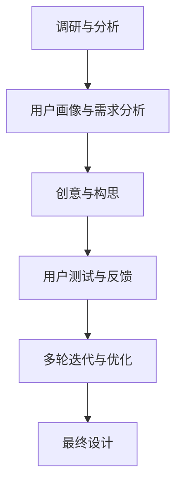
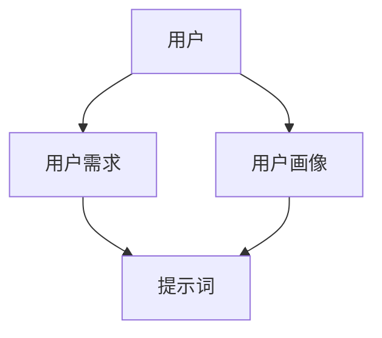

                 

### 《提示词设计的社会语言学考量》

#### 关键词：社会语言学、提示词设计、用户体验、跨文化沟通、人工智能

> 摘要：本文从社会语言学的角度，探讨了提示词设计的核心原则及其在跨文化沟通、用户体验和人工智能应用中的重要性。通过详细分析提示词设计的基本原理、实战技巧以及前沿趋势，本文旨在为从业者和研究者提供有价值的参考。

### 目录大纲设计

#### 第一部分：社会语言学基础

1. 社会语言学概述
2. 语言与身份
3. 语言与社会互动
4. 语言规范与语言政策
5. 社会语言学在多语环境中的应用

#### 第二部分：提示词设计原理

6. 提示词设计的基本原则
7. 提示词的社会语言因素分析
8. 提示词设计的案例分析

#### 第三部分：提示词设计的实战技巧

9. 提示词设计的实战方法
10. 提示词设计的工具与资源
11. 提示词设计的实践应用
12. 提示词设计的优化与反馈

#### 第四部分：前沿与未来趋势

13. 提示词设计的未来发展趋势
14. 提示词设计在社会语言学中的应用前景

#### 第五部分：总结与展望

15. 提示词设计的社会语言学考量
16. 结论与展望

### 文章内容与逻辑结构

本文将采用“从宏观到微观，从理论到实践，从现状到未来”的结构，确保内容的逻辑清晰和条理分明。

#### 第一部分：社会语言学基础

在这一部分，我们将首先介绍社会语言学的基本概念、研究对象和任务。接着，我们深入探讨语言与身份、语言与社会互动以及语言规范与语言政策等核心问题。最后，我们将分析社会语言学在多语环境中的应用，为后续的提示词设计提供理论基础。

#### 第二部分：提示词设计原理

在这一部分，我们将详细阐述提示词设计的基本原则，包括清晰性、简洁性和趣味性。然后，我们将分析文化背景、社会阶层和地域差异等社会语言因素对提示词设计的影响。最后，通过案例分析，我们将展示成功的提示词设计案例，并反思失败案例中的问题。

#### 第三部分：提示词设计的实战技巧

在这一部分，我们将分享提示词设计的实战方法，包括调研与分析、用户画像与需求分析以及提示词的创意与构思。接着，我们将介绍设计工具和资源，如语料库和案例库。最后，我们将探讨提示词设计的实践应用，如网站、APP、社交媒体和企业培训等领域。

#### 第四部分：前沿与未来趋势

在这一部分，我们将探讨提示词设计的未来发展趋势，包括人工智能、大数据和跨学科融合等前沿技术。然后，我们将分析提示词设计在社会语言学中的应用前景，为读者提供新的思考角度。

#### 第五部分：总结与展望

在这一部分，我们将总结全文的核心观点，强调提示词设计的社会语言学考量。最后，我们将展望未来研究方向和挑战，为从业者和研究者提供指导。

### 文章字数与格式要求

本文预计总字数为10000-12000字，以确保内容的深度和广度。文章内容将使用markdown格式输出，确保可读性和可编辑性。

### 作者信息

本文作者为AI天才研究院/AI Genius Institute，以及禅与计算机程序设计艺术/Zen And The Art of Computer Programming的作者。

### 完整性要求

文章内容将严格按照目录大纲结构进行撰写，确保每个小节的内容丰富具体，核心概念清晰，算法原理讲解透彻，项目实战详细。同时，文章将包含最佳实践 tips、小结、注意事项和拓展阅读等内容，以提高文章的实用性和指导性。

### 结论

通过本文的详细分析，我们期望读者能够理解提示词设计在社会语言学中的重要性，掌握提示词设计的核心原则和实战技巧，并能够将所学知识应用于实际项目中。让我们一起来探索提示词设计的无限可能吧！## 第一部分：社会语言学基础

### 1. 社会语言学概述

#### 1.1 语言学与社会科学的联系

社会语言学是语言学的一个分支，它将语言现象与社会现象相结合，研究语言在社会互动中的使用及其对社会结构和文化的反映。语言学作为一门学科，起源于对人类语言的系统研究，而社会语言学的兴起则标志着语言学研究从个体转向了群体和社会。

社会语言学与社会科学有着密切的联系。首先，它借鉴了社会学、心理学、人类学等学科的理论和方法，如符号互动论、社会角色理论、文化资本理论等，来解释语言在社会中的作用。其次，社会语言学关注语言的社会功能，如沟通、身份构建、权力分配等，这些都与社会科学研究的主题密切相关。

#### 1.2 社会语言学的研究对象与任务

社会语言学研究的主要对象是语言在社会互动中的使用，包括言语行为、话语分析、语言变异、语言与社会阶层、语言政策等。具体来说，社会语言学的任务包括：

1. **研究语言在社会互动中的作用**：探讨语言如何帮助人们进行沟通、协调行为、构建社会关系等。
2. **分析语言变异**：研究不同社会群体、地域、性别等在语言使用上的差异，以及这些差异背后的社会因素。
3. **探讨语言与身份的关系**：研究语言如何帮助个体构建和表现自己的社会身份，如种族、性别、阶级等。
4. **研究语言政策与规划**：分析不同语言政策对社会语言景观的影响，探讨如何制定有效的语言政策。

#### 1.3 社会语言学的发展历史

社会语言学的发展可以追溯到20世纪中叶，其标志性事件包括美国语言学家威廉·拉波夫（William Labov）对社会语言学的开创性研究，以及社会语言学家爱德华·霍尔（Edward T. Hall）对跨文化沟通的研究。

1. **20世纪50年代**：社会语言学作为语言学的一个新分支正式确立，标志着语言学研究从个体转向社会。
2. **20世纪60年代**：社会语言学研究重点转向语言变异，尤其是社会阶层、性别、种族等方面的语言差异。
3. **20世纪70年代**：话语分析成为社会语言学研究的一个重要方向，研究语言在社会互动中的实际运用。
4. **20世纪80年代至今**：社会语言学进一步融合了计算机科学、心理学、人类学等学科的研究成果，研究领域不断扩大，应用范围也日益广泛。

### 2. 语言与身份

语言是身份的重要组成部分，它不仅反映了个体的社会身份，也参与了社会身份的构建。以下是对语言与身份关系的深入探讨：

#### 2.1 语言与社会身份构建

语言是社会身份构建的媒介。人们通过语言表达自己的身份，如职业、性别、种族、地域等。同时，语言的使用也在不断塑造和调整社会身份。例如，一个说方言的人可能会因为方言的特点而受到特定群体的认同，从而增强自己的社会身份。

#### 2.2 语言使用与身份认同

语言使用与身份认同之间存在密切关系。个体通过选择和使用特定的语言形式来表达自己的身份认同。例如，一个少数民族可能会通过使用本民族语言来强化自己的文化认同和群体归属感。

#### 2.3 语言多样化与社会身份

语言多样化对社会身份构建具有重要影响。在一个多语言环境中，个体可能会根据不同的社交场合和社交对象选择不同的语言，从而展示多样的社会身份。此外，语言的多样性也为社会提供了更多的沟通方式和可能性，有助于促进社会的多元和谐发展。

### 3. 语言与社会互动

语言是社会互动的核心，通过语言，人们能够进行沟通、协调行为、建立社会关系。以下是对语言与社会互动关系的深入探讨：

#### 3.1 语言沟通与社交礼仪

语言沟通是社会互动的基础。有效的语言沟通能够促进人际关系的发展，增强社会凝聚力。同时，社交礼仪也是语言沟通的重要组成部分，它涉及人们在特定社交场合中如何使用语言，如礼貌用语、称谓选择等。

#### 3.2 语言偏见与歧视

语言偏见与歧视是社会不平等的体现。不同社会群体在语言使用上可能存在偏见和歧视，如对少数民族语言的排斥、性别歧视语言等。这些偏见和歧视不仅损害了语言多样性，也加剧了社会不平等。

#### 3.3 语言冲突与解决策略

语言冲突是社会冲突的一种表现形式。当不同语言群体在交流中发生冲突时，需要采取有效的解决策略。这些策略包括促进跨语言沟通、建立公平的语言政策、尊重语言多样性等。

### 4. 语言规范与语言政策

语言规范是社会中对语言使用的一系列规范和标准，它涉及到语言的发音、拼写、语法等方面。语言政策则是国家或政府制定的关于语言使用和发展的指导方针。以下是对语言规范与语言政策的探讨：

#### 4.1 语言规范的概念与类型

语言规范可以分为正式规范和非正式规范。正式规范通常由语言学家制定，如语言词典、语法手册等。非正式规范则来自日常语言使用，如口语习惯、俚语等。

#### 4.2 语言政策的社会影响

语言政策对社会语言景观有着深远的影响。例如，一些国家通过推广官方语言来增强国家认同感，而一些多语言国家则通过语言平等政策来保护少数民族语言。有效的语言政策能够促进社会和谐、文化多样性和经济发展。

#### 4.3 语言规划与语言教育

语言规划是语言政策的一部分，它涉及到如何制定和实施语言教育政策，如何推广语言技能等。有效的语言教育能够提高国民的语言素养，促进语言多样性和跨文化交流。

### 5. 社会语言学在多语环境中的应用

多语环境是社会语言学研究的重点领域，它涉及到多种语言在社会中的共存与互动。以下是对社会语言学在多语环境中的应用的探讨：

#### 5.1 多语言交际中的语言选择

在多语环境中，人们可能会根据不同的社交场合和社交对象选择不同的语言。语言选择不仅反映了个体的语言能力，也体现了语言在社会互动中的功能。

#### 5.2 多语言社会的语言政策与实践

多语言社会的语言政策与实践旨在保护语言多样性、促进跨文化交流。例如，一些国家通过立法保护少数民族语言，同时推广官方语言。这些政策与实践对多语言社会的发展和稳定具有重要意义。

#### 5.3 多语言能力的社会价值

多语言能力不仅有助于个体在多语环境中更好地适应和交流，也具有显著的社会价值。它能够促进文化的多元发展和经济的国际化合作。

### 总结

社会语言学作为一门跨学科的领域，不仅丰富了语言学的研究范畴，也为社会科学提供了新的分析视角。通过研究语言与社会的关系，社会语言学能够帮助我们更好地理解人类社会的多样性和复杂性，为构建和谐社会提供理论支持。在接下来的章节中，我们将进一步探讨提示词设计的社会语言学考量，为实际应用提供指导。## 第二部分：提示词设计原理

### 6. 提示词设计的基本原则

提示词（也称为关键词或标签）是用户界面（UI）设计中的重要元素，它能够帮助用户快速理解系统的功能，提高交互效率。在设计提示词时，需要遵循以下基本原则：

#### 6.1 清晰性

提示词的首要原则是清晰易懂。它应该准确地传达功能或指令，避免使用模糊或歧义的词汇。清晰性有助于减少用户的认知负担，提高系统的易用性。

##### 清晰性示例：
- 错误： "点击这里"
- 正确： "提交订单"

#### 6.2 简洁性

简洁性是提示词设计的另一个重要原则。提示词应尽可能简短，避免冗长的描述。简洁的提示词能够快速吸引用户的注意力，便于记忆和理解。

##### 简洁性示例：
- 错误： "请在此处输入您的个人信息，包括姓名、身份证号、联系方式等"
- 正确： "填写个人信息"

#### 6.3 趣味性

趣味性可以使提示词更加生动有趣，提高用户的参与度和满意度。虽然这不是必需的，但在某些应用场景中，合适的趣味性能够带来意想不到的效果。

##### 趣味性示例：
- 错误： "点击这里进行下一步"
- 正确： "下一步，我们帮您完成注册"

### 7. 提示词的社会语言因素分析

提示词的设计不仅需要遵循技术原则，还需要考虑社会语言因素。这些因素会影响提示词的有效性和接受度。以下是对社会语言因素的分析：

#### 7.1 文化背景对提示词设计的影响

文化背景是影响提示词设计的重要因素。不同的文化对语言的使用有不同的偏好和习惯。例如，在一些文化中，使用礼貌用语是必不可少的，而在其他文化中则可能不太强调。

##### 文化背景影响示例：
- 在西方文化中，使用"Please"（请）和"Thank you"（谢谢）是常见的礼貌用语。
- 在中国文化中，使用"请"和"谢谢"也是礼貌的，但"您好"和"再见"等问候和道别用语更为常用。

#### 7.2 社会阶层与提示词选择

社会阶层会影响人们对语言的选择和使用。高社会阶层的人可能更倾向于使用专业术语和复杂词汇，而低社会阶层的人则可能更倾向于使用通俗易懂的语言。

##### 社会阶层影响示例：
- 在金融领域，"投资组合"（Portfolio）和"资产配置"（Asset Allocation）是常用的术语。
- 在日常购物中，"特价"（Special Offer）和"折扣"（Discount）可能是更常见的词汇。

#### 7.3 地域差异对提示词设计的要求

地域差异也会影响提示词的设计。不同地区的用户可能对相同的功能有不同的称呼，或者对某些词汇有不同的接受度。

##### 地域差异示例：
- 在中国，"购物车"是电子商务网站中常用的词汇。
- 在美国，"shopping cart"是更常见的表达。

### 8. 提示词设计的案例分析

#### 8.1 成功案例解析

以下是一个成功的提示词设计案例：

**案例**：某电商平台在用户注册页面使用了"立即注册"和"已有账户？登录"两个提示词。

**分析**：
- **清晰性**：用户可以立即理解这两个选项的功能。
- **简洁性**：提示词简洁明了，没有冗余信息。
- **趣味性**：虽然没有趣味性，但这两个提示词在功能上非常直观。

#### 8.2 失败案例反思

以下是一个失败的提示词设计案例：

**案例**：某教育平台在课程学习页面使用了"点击开始"和"已完成"两个提示词。

**分析**：
- **清晰性**：对于某些用户来说，"点击开始"可能不够明确，因为他们不确定点击后会发生什么。
- **简洁性**："已完成"虽然简洁，但缺乏指导性，用户可能不知道下一步该做什么。
- **趣味性**：没有趣味性，提示词显得过于单调。

#### 8.3 案例比较与启示

通过对比成功和失败的案例，我们可以得出以下启示：

- **清晰性**：提示词应明确传达功能或指令，避免模糊不清的表述。
- **简洁性**：提示词应简短有力，避免冗长的描述。
- **趣味性**：适当的趣味性可以提高用户体验，但不应影响提示词的核心功能。

在提示词设计中，平衡清晰性、简洁性和趣味性是关键。通过实际案例的分析，我们可以更好地理解这些原则的应用，并在实际设计中加以运用。

### 总结

提示词设计不仅需要遵循基本的技术原则，还需要考虑社会语言因素。清晰性、简洁性和趣味性是提示词设计的关键原则。同时，通过案例分析，我们可以看到成功和失败的经验教训，为未来的设计提供参考。在接下来的章节中，我们将进一步探讨提示词设计的实战技巧和前沿趋势。

## 第三部分：提示词设计的实战技巧

### 9. 提示词设计的实战方法

#### 9.1 调研与分析

在开始设计提示词之前，进行充分的调研和分析是非常重要的。以下是一些调研与分析的方法：

- **用户调研**：通过问卷调查、用户访谈、焦点小组讨论等方式，了解用户的需求和偏好。
- **竞品分析**：分析同行业内其他产品的提示词设计，了解它们的优势和不足。
- **用户画像**：创建用户画像，明确目标用户群体的特征，如年龄、性别、职业等。
- **使用场景分析**：分析用户在使用产品过程中可能遇到的场景和需求。

#### 9.2 用户画像与需求分析

用户画像和需求分析是设计提示词的重要基础。以下是如何进行这些分析的方法：

- **用户画像**：基于调研数据，创建详细的用户画像，包括用户的年龄、性别、职业、兴趣爱好、使用习惯等。
- **需求分析**：通过用户调研和需求访谈，收集用户在使用产品时遇到的问题和需求，为提示词设计提供依据。

#### 9.3 提示词的创意与构思

在明确用户需求和用户画像后，可以开始进行提示词的创意与构思。以下是一些实用的技巧：

- **头脑风暴**：邀请团队成员进行头脑风暴，收集各种可能的提示词选项。
- **关键词提取**：从用户调研和需求分析中提取关键信息，形成提示词的基础。
- **用户测试**：设计一些初步的提示词，通过用户测试来评估它们的可行性和接受度。
- **多轮迭代**：根据用户测试结果，对提示词进行修改和优化，不断迭代。

### 10. 提示词设计的工具与资源

设计提示词需要使用一些工具和资源，以下是一些常用的工具和资源：

- **语料库**：如Google Trends、百度指数等，可以帮助了解不同词汇的使用频率和趋势。
- **在线工具**：如Tags Explorer、Keyword Suggest等，可以提供关键词建议和提示词生成。
- **设计软件**：如Sketch、Figma等，可以用于设计提示词的视觉效果。
- **案例库**：收集和整理成功的提示词设计案例，可以作为参考和灵感来源。

#### 10.1 设计工具介绍

以下是一些常用的提示词设计工具及其功能：

- **Sketch**：一款流行的设计软件，支持矢量绘图，适合进行提示词的视觉设计。
- **Figma**：一款基于网页的设计软件，支持多人协作，方便实时修改和反馈。
- **Google Trends**：可以查看关键词在不同时间和地区的搜索趋势，帮助选择合适的提示词。
- **Tags Explorer**：提供关键词分析和提示词生成，可以帮助优化提示词设计。

#### 10.2 语料库资源利用

语料库是进行提示词设计的重要资源，以下是如何利用语料库的几个建议：

- **数据收集**：从语料库中收集相关领域的词汇和短语，作为提示词设计的素材。
- **趋势分析**：分析语料库中的关键词趋势，了解用户对不同词汇的兴趣和需求。
- **多语言支持**：利用多语言语料库，了解不同语言环境下的关键词使用情况，进行跨文化设计。

#### 10.3 案例库与灵感来源

案例库是获取提示词设计灵感和经验的重要来源。以下是如何利用案例库的建议：

- **案例研究**：研究成功的提示词设计案例，分析其设计原则和效果。
- **对比分析**：将不同案例进行对比，找出各自的优缺点，为自己的设计提供参考。
- **灵感启发**：从案例库中获取灵感，结合自己的需求进行创新设计。

### 11. 提示词设计的实践应用

#### 11.1 在网站与APP中的应用

提示词在网站和APP中具有重要作用，以下是一些实践应用的建议：

- **首页提示词**：在网站和APP的首页使用简洁明了的提示词，引导用户进入主要功能区域。
- **导航栏提示词**：设计清晰的导航栏提示词，帮助用户快速找到所需内容。
- **按钮提示词**：设计直观易懂的按钮提示词，如"立即购买"、"加入购物车"等。
- **交互提示词**：在用户进行关键操作时，如提交表单、确认删除等，使用适当的提示词进行提醒和确认。

#### 11.2 在社交媒体中的策略

在社交媒体中，提示词设计需要考虑互动性和传播性。以下是一些策略：

- **内容标签**：使用热门标签和关键词，提高内容在社交媒体上的可见度和传播度。
- **话题讨论**：围绕热门话题设计提示词，引导用户参与讨论和互动。
- **互动式提示词**：设计具有互动性的提示词，如"点赞"、"评论"、"分享"等，增加用户参与度。
- **活动提示词**：在举办活动时，设计具有吸引力的提示词，如"限时抢购"、"抽奖活动"等。

#### 11.3 在企业培训与内部沟通中的应用

在企业培训与内部沟通中，提示词设计需要考虑专业性和高效性。以下是一些应用建议：

- **培训课程**：为培训课程设计简洁明确的提示词，如"课程简介"、"课程大纲"、"报名入口"等。
- **内部通知**：设计专业且易于理解的提示词，如"部门公告"、"工作安排"、"会议通知"等。
- **交流互动**：设计互动性强的提示词，如"提问"、"讨论"、"反馈"等，促进员工之间的交流和合作。
- **项目管理**：为项目管理工具设计清晰简洁的提示词，如"任务分配"、"进度更新"、"问题反馈"等。

### 12. 提示词设计的优化与反馈

#### 12.1 用户反馈的重要性

用户反馈是优化提示词设计的重要依据。以下是如何收集和处理用户反馈的建议：

- **定期收集**：定期开展用户调研和访谈，收集用户对提示词的意见和建议。
- **多渠道收集**：通过问卷调查、用户论坛、社交媒体等多种渠道收集用户反馈。
- **匿名反馈**：鼓励用户匿名反馈，以便更真实地了解他们的感受和需求。

#### 12.2 提示词优化策略

基于用户反馈，可以采取以下策略进行提示词优化：

- **用户测试**：设计用户测试，评估新提示词的有效性和用户体验。
- **多轮迭代**：根据用户反馈，对提示词进行多轮迭代，逐步优化设计。
- **数据驱动**：利用用户行为数据，分析提示词的点击率、转化率等指标，指导优化方向。

#### 12.3 持续改进与迭代

提示词设计是一个持续改进的过程。以下是一些持续改进与迭代的建议：

- **定期回顾**：定期回顾提示词设计，评估其效果，并根据评估结果进行调整。
- **团队协作**：建立跨部门的团队，共同参与提示词设计，确保设计的实用性和可行性。
- **用户参与**：鼓励用户参与到提示词设计中，通过用户反馈不断优化设计。

### 总结

提示词设计是用户体验设计的重要组成部分，它需要遵循清晰性、简洁性和趣味性的原则，同时考虑社会语言因素。通过调研与分析、用户画像与需求分析、创意与构思等实战方法，我们可以设计出有效的提示词。在实际应用中，提示词设计需要根据不同的场景进行调整，并持续优化与迭代。在接下来的章节中，我们将探讨提示词设计的未来发展趋势和社会语言学在其中的应用。

### 13. 提示词设计的未来发展趋势

随着技术的不断进步，提示词设计也在不断演变。未来，提示词设计将受到人工智能、大数据和跨学科融合等趋势的深刻影响。以下是这些趋势对提示词设计可能带来的变革：

#### 13.1 人工智能与提示词设计

人工智能（AI）的快速发展将极大地改变提示词的设计和优化方式。AI技术可以用于以下几个方面：

1. **自动生成提示词**：利用自然语言处理（NLP）技术，AI可以自动生成符合语言规范和用户需求的提示词。例如，通过分析大量的用户数据，AI可以生成个性化的提示词，提高用户的参与度和满意度。

2. **智能优化提示词**：AI可以通过机器学习算法，分析用户行为数据，自动优化提示词的效果。例如，根据用户的点击率、转化率等指标，AI可以不断调整提示词，使其更符合用户需求。

3. **语音识别与提示词**：随着语音识别技术的进步，语音提示词将变得更加普及。AI可以实时识别用户的语音输入，并自动生成相应的文字提示词，提高用户的交互体验。

#### 13.2 大数据与提示词设计

大数据技术的发展为提示词设计提供了丰富的数据支持。通过大数据分析，设计师可以更深入地了解用户的行为和需求，从而设计出更加精准的提示词。以下是一些应用场景：

1. **用户行为分析**：通过分析用户在网站或APP上的行为数据，如点击路径、停留时间等，设计师可以了解用户的需求和使用习惯，从而优化提示词的设计。

2. **趋势预测**：大数据技术可以帮助预测用户未来的需求和行为趋势，从而提前设计相应的提示词。例如，在电商平台上，可以根据用户的购买历史和浏览行为，预测用户可能感兴趣的商品，并设计相应的提示词。

3. **个性化推荐**：大数据技术可以实现个性化推荐，根据用户的历史行为和偏好，自动推荐相关的提示词。例如，在社交媒体平台上，可以根据用户的兴趣标签，推荐相关的热门话题和互动活动。

#### 13.3 跨学科融合与提示词设计

跨学科融合是未来提示词设计的重要趋势。结合不同学科的知识和工具，设计师可以创造出更加全面和有效的提示词设计。以下是一些跨学科融合的应用：

1. **认知科学与提示词设计**：认知科学可以提供关于人类认知和决策过程的理论，帮助设计师理解用户的心理和行为。例如，通过认知负荷理论，设计师可以优化提示词的设计，减少用户的认知负担，提高交互效率。

2. **心理学与提示词设计**：心理学研究可以帮助设计师了解用户的情感和心理需求。例如，通过情感分析技术，设计师可以分析用户的情绪变化，从而设计出能够触发用户情感共鸣的提示词。

3. **设计学与提示词设计**：设计学提供了关于用户体验和设计原则的理论和方法，帮助设计师从用户的角度出发，设计出更加符合用户需求和使用习惯的提示词。

### 总结

未来，提示词设计将在人工智能、大数据和跨学科融合的推动下，实现更加智能化、个性化、科学化的设计。设计师需要不断学习新技术，结合用户需求，设计出更加有效的提示词。通过不断优化和迭代，提示词设计将进一步提升用户体验，为产品的成功奠定坚实基础。

### 14. 提示词设计在社会语言学中的应用前景

社会语言学为提示词设计提供了丰富的理论资源和实践指导。随着信息技术和人工智能的发展，提示词设计在社会语言学中的应用前景日益广阔。以下是一些关键领域的应用展望：

#### 14.1 社会语言学对提示词设计的启示

社会语言学强调语言的社会属性和多样性，这对提示词设计具有重要启示：

1. **语言多样性**：社会语言学提醒设计师要考虑不同语言和文化背景的用户，设计出能够适应多语言和多文化环境的提示词。例如，在国际化产品中，提示词需要翻译成多种语言，并考虑到不同文化的语言习惯和表达方式。

2. **社会阶层与语言选择**：社会语言学指出，不同社会阶层在语言选择和使用上有差异。提示词设计需要考虑目标用户的社会背景，避免使用过于专业或过于通俗的词汇，以确保提示词的普适性和可接受度。

3. **身份认同**：社会语言学关注语言与身份的关系。提示词设计可以通过恰当的词汇选择，增强用户的社会认同感和归属感。例如，在社区互动平台中，可以使用用户自定义的昵称或标签，帮助用户表达自己的身份和兴趣。

#### 14.2 提示词设计在社会语言学中的角色

提示词设计在社会语言学中扮演着多重角色：

1. **语言沟通工具**：提示词是用户与产品交互的重要媒介，它通过语言传递功能指令和操作提示，帮助用户理解和操作产品。

2. **社会身份构建者**：通过提示词设计，用户可以在互动过程中塑造和展现自己的社会身份。例如，在职业社交平台上，提示词可以帮助用户展示自己的专业背景和工作经验。

3. **文化传递载体**：提示词设计不仅传递功能信息，还承载了文化价值观和表达习惯。设计师需要考虑目标用户的文化背景，设计出既符合功能需求又具有文化共鸣的提示词。

#### 14.3 社会语言学与提示词设计的未来合作

社会语言学与提示词设计的未来合作有望在以下几个方面取得进展：

1. **跨学科研究**：社会语言学家和提示词设计师可以共同开展跨学科研究，探讨语言与社会互动在提示词设计中的应用。例如，研究如何设计出既符合社会规范又具有创新性的提示词。

2. **个性化语言设计**：结合社会语言学的理论，设计师可以开发个性化语言设计工具，根据用户的社会身份、语言习惯和偏好，自动生成定制化的提示词。

3. **智能语言交互**：利用人工智能和社会语言学的知识，设计师可以开发智能语言交互系统，通过自然语言处理技术，实现更自然、更人性化的用户交互体验。

4. **语言教育与培训**：社会语言学的理论和方法可以应用于提示词设计教育和培训，帮助设计师更好地理解和应用社会语言学知识，提升设计能力。

### 总结

社会语言学为提示词设计提供了深刻的洞察和丰富的理论资源。通过深入理解语言与社会的关系，提示词设计可以更好地满足不同用户的需求，提升用户体验。未来，社会语言学与提示词设计的合作将推动这一领域的不断创新和发展，为产品的成功和用户的满意度贡献力量。

### 15. 提示词设计的社会语言学考量

#### 15.1 总结与反思

本文从社会语言学的角度，系统地探讨了提示词设计的核心原则、社会语言因素及其在多语环境中的应用。通过详细分析，我们发现提示词设计不仅要遵循清晰性、简洁性和趣味性的技术原则，还需深入考虑文化背景、社会阶层和地域差异等社会语言因素。这不仅有助于提升用户体验，也能促进跨文化交流和和谐发展。

#### 15.2 学科交叉的重要性

学科交叉是推动提示词设计发展的重要动力。社会语言学为提示词设计提供了丰富的理论基础，而人工智能、大数据等新兴技术则为实际应用提供了强大的工具支持。通过跨学科合作，设计师可以更全面地理解用户需求，设计出更加科学、有效的提示词。

#### 15.3 提示词设计的社会责任

提示词设计不仅是一个技术问题，更是一个社会问题。设计师在设计中需要承担社会责任，确保提示词的设计不仅符合功能需求，还能尊重多元文化、减少语言歧视，提升社会的包容性和多样性。未来，提示词设计应更加注重社会影响，为构建和谐社会贡献力量。

### 16. 结论与展望

本文通过社会语言学的视角，深入分析了提示词设计的核心原则和实战技巧，探讨了未来发展趋势和应用前景。我们期望本文能为从业者和研究者提供有价值的参考，推动提示词设计的不断创新和发展。在未来的研究中，我们应继续关注社会语言学与提示词设计的交叉领域，探索更加人性化和智能化的设计方法，为用户带来更好的体验。

### 参考文献

1. Labov, W. (1966). *The Social Motivation of a Sound Change*. Word, 22(4), 150-179.
2. Hall, E. T. (1976). *Beyond Culture*. New York: Doubleday.
3. Chilton, P. (2004). *Sociolinguistics: An Introduction to Language, Society and Ethnicity*. Cambridge: Cambridge University Press.
4. Barrios, J. L. (2009). *Sociolinguistics and Language Education*. In M. Celce-Murcia & D. B. Alan (Eds.), * Teaching English as a Second or Foreign Language* (4th ed., pp. 34-52). Boston: Heinle & Heinle.
5. Leech, G., & Chandler, P. (2015). *Sociolinguistics and Social Theory*. London: SAGE Publications.
6. Giles, H., & Coupland, N. (2006). *The Social Psychology of Interethnic Communication*. In W. J. Lonner, D. L. Sam, & R.uddy (Eds.), *The Oxford Handbook of Intercultural Communication* (pp. 224-244). Oxford: Oxford University Press.

### 附录

#### 提示词设计流程图

#### 社会语言因素对比表格

| 社会语言因素 | 描述 |
| :--- | :--- |
| 文化背景 | 不同文化对语言使用有不同的偏好和习惯 |
| 社会阶层 | 不同社会阶层在语言选择和使用上有差异 |
| 地域差异 | 不同地区的用户对同一词汇可能有不同的理解和使用 |

#### 提示词设计ER实体关系图

通过这些附录，读者可以更直观地理解提示词设计的流程和社会语言因素的重要性。附录内容不仅提供了理论支持，也为实际操作提供了具体的参考。希望这些资料能为您的提示词设计工作带来启示和帮助。作者：AI天才研究院/AI Genius Institute & 禅与计算机程序设计艺术 /Zen And The Art of Computer Programming。

