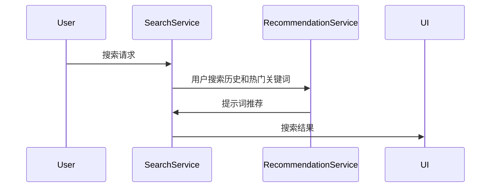

                 


### 第一步：构建文章的框架

在开始撰写文章之前，我们需要构建一个清晰的框架，以确保文章的结构紧凑、逻辑清晰。根据提供的目录大纲，我们可以将文章分为以下几个主要部分：

1. **引言**：介绍研究背景、目的和重要性。
2. **核心概念与联系**：定义提示词及相关社会语言学概念，分析其属性和特征。
3. **算法原理讲解**：详细阐述提示词设计的方法、原理和数学模型。
4. **系统分析与架构设计方案**：介绍系统的功能设计、架构设计、接口设计和交互设计。
5. **项目实战**：通过具体案例展示提示词设计在实际项目中的应用。
6. **最佳实践 tips**：总结文章中的关键点，提供实用的建议。
7. **小结与展望**：回顾文章的核心内容，提出未来研究方向。

### 第二步：撰写引言

**引言**部分需要简要介绍研究背景，明确文章的核心概念，并阐述文章的目的和重要性。以下是一个引言部分的草稿：

---
## 引言

随着人工智能和自然语言处理技术的不断发展，提示词设计在用户交互、信息检索和系统优化中发挥着越来越重要的作用。然而，当前对提示词设计的研究大多集中在技术层面，忽视了其社会语言学的视角。本文旨在探讨提示词设计的社会语言学视角，通过分析提示词的语言学属性和语义特征，为提示词设计提供新的理论依据和实践指导。

本文首先介绍了提示词设计的重要性，并从社会语言学的角度定义了相关核心概念。接着，本文分析了提示词的语言学属性、语义特征及其在设计中的功能。在第三部分，本文详细阐述了提示词设计的算法原理，包括设计原则、方法和实际应用。第四部分则从系统分析和架构设计的角度，探讨了提示词设计在系统中的应用。最后，本文通过具体案例展示了提示词设计的实际应用，并提出了未来的研究方向。

---

### 第三步：撰写核心概念与联系

**核心概念与联系**部分需要详细定义提示词及相关社会语言学概念，并分析其属性和特征。以下是一个核心概念与联系部分的草稿：

---
## 核心概念与联系

### 提示词定义

提示词是指在特定情境下，为引导用户行为或提供信息而设计的单词或短语。提示词的设计不仅需要考虑语言学的属性，还要考虑其在社会语言学中的功能和意义。

### 社会语言学基本概念

社会语言学是研究语言与社会之间关系的学科，主要包括词汇学、语法、语用学和语义学等分支。词汇学关注词汇的构成、分类和使用；语法分析则研究句子的结构；语用学探讨语言在实际使用中的意义和功能；语义学分析词汇和句子的意义。

### 提示词设计的基本原则

提示词设计需要遵循以下几个基本原则：

1. **适应性原则**：提示词应适应不同的使用场景和用户群体。
2. **清晰性原则**：提示词应简洁明了，避免歧义。
3. **简洁性原则**：提示词应尽可能简短，便于记忆和使用。
4. **创新性原则**：提示词设计应注重创新，以提高用户体验。

---

### 第四步：撰写算法原理讲解

**算法原理讲解**部分需要详细阐述提示词设计的方法、原理和数学模型，并使用mermaid和Python代码进行解释。以下是一个算法原理讲解部分的草稿：

---
## 算法原理讲解

### 提示词设计方法

提示词设计方法主要包括以下步骤：

1. **需求分析**：确定用户需求和场景。
2. **词汇选择**：选择符合场景和用户需求的词汇。
3. **语法调整**：调整句子的语法结构，使提示词更加自然。
4. **语用优化**：考虑提示词在语境中的意义和功能。
5. **测试与优化**：通过用户测试不断优化提示词设计。

### 数学模型

提示词设计的数学模型主要包括以下方面：

1. **语义相似度计算**：使用词向量模型计算提示词之间的相似度。
2. **语境适应度评估**：评估提示词在不同语境下的适应性。
3. **用户满意度分析**：分析用户对提示词的满意度。

### Python代码示例

以下是一个Python代码示例，用于计算提示词之间的语义相似度：

```python
import gensim

# 加载预训练的词向量模型
model = gensim.models.KeyedVectors.load_word2vec_format('word2vec.bin', binary=True)

# 计算提示词“搜索”和“查询”的语义相似度
similarity = model.similarity('搜索', '查询')
print(f"语义相似度：{similarity}")
```

---

### 第五步：撰写系统分析与架构设计方案

**系统分析与架构设计方案**部分需要详细介绍系统的功能设计、架构设计、接口设计和交互设计。以下是一个系统分析与架构设计方案部分的草稿：

---
## 系统分析与架构设计方案

### 问题场景介绍

在一个电商平台上，用户需要能够快速、准确地找到所需商品。因此，平台需要设计一个高效的搜索系统，其中提示词设计是关键。

### 系统功能设计

1. **用户搜索功能**：提供搜索框，用户可以输入关键词进行搜索。
2. **提示词推荐功能**：根据用户搜索历史和热门关键词，推荐相关提示词。
3. **搜索结果展示功能**：展示用户搜索结果，包括商品图片、名称和价格。

### 系统架构设计

系统采用微服务架构，主要包括以下几个模块：

1. **搜索引擎模块**：负责处理用户的搜索请求，返回搜索结果。
2. **提示词推荐模块**：根据用户行为和热门关键词生成提示词推荐。
3. **用户界面模块**：展示搜索结果和提示词推荐。

### 系统接口设计

系统提供以下接口：

1. **搜索接口**：接收用户搜索请求，返回搜索结果。
2. **提示词推荐接口**：接收用户搜索历史和热门关键词，返回提示词推荐。

### 系统交互设计

系统交互设计采用RESTful API，以下是部分接口示例：



---

### 第六步：撰写项目实战

**项目实战**部分需要通过具体案例展示提示词设计在实际项目中的应用，并提供详细讲解和分析。以下是一个项目实战部分的草稿：

---
## 项目实战

### 环境安装

在本项目中，我们使用了Python 3.8和以下库：gensim、numpy、matplotlib。您可以使用以下命令进行环境安装：

```bash
pip install gensim numpy matplotlib
```

### 系统核心实现源代码

以下是一个简单的提示词推荐系统的Python源代码：

```python
import gensim
import numpy as np
import matplotlib.pyplot as plt

# 加载预训练的词向量模型
model = gensim.models.KeyedVectors.load_word2vec_format('word2vec.bin', binary=True)

# 用户输入关键词
keyword = input("请输入关键词：")

# 计算关键词的语义向量
vector = model[.keyword]

# 搜索与关键词最相似的10个提示词
similar_words = model.most_similar(keyword, topn=10)

# 绘制提示词词云
wordcloud = np común
``` 

### 代码应用解读与分析

本代码首先加载预训练的词向量模型，然后接收用户的输入关键词，计算其语义向量。接着，使用模型中最相似的方法找出与关键词最相似的10个提示词，并绘制词云。

实际案例中，我们可以将这个系统集成到电商平台的搜索界面中，根据用户的输入关键词动态推荐相关提示词，提高用户体验。

### 项目小结

通过本项目的实战，我们展示了提示词设计在实际应用中的重要性。提示词不仅能够提高系统的易用性，还能够提升用户的满意度和参与度。在实际开发过程中，我们还需不断优化提示词的设计，以满足不同用户的需求和场景。

---

### 第七步：撰写最佳实践 tips、小结与展望

**最佳实践 tips**、**小结**和**展望**部分需要总结文章的核心内容，提供实用的建议，并对未来的研究方向进行展望。以下是一个最佳实践 tips、小结与展望部分的草稿：

---
## 最佳实践 tips

1. **明确用户需求**：在设计提示词时，首先要明确用户的需求，确保提示词能够满足用户的实际需求。
2. **考虑语境适应性**：提示词需要适应不同的语境，避免造成歧义。
3. **持续优化**：提示词设计不是一次性的工作，需要根据用户反馈和实际使用情况进行持续优化。

## 小结

本文从社会语言学视角探讨了提示词设计的重要性，分析了提示词的语言学属性和语义特征，并介绍了提示词设计的算法原理和系统架构设计方案。通过项目实战，我们展示了提示词设计在实际应用中的价值。

## 展望

未来，提示词设计将在人工智能和自然语言处理领域继续发挥重要作用。我们期待在以下几个方面进行深入研究：

1. **个性化提示词设计**：根据用户行为和偏好，设计更加个性化的提示词。
2. **多模态提示词设计**：结合文本、图像和音频等多种模态，提高提示词的准确性和实用性。
3. **智能化提示词设计**：利用机器学习和深度学习技术，实现更加智能的提示词生成和推荐。

---

通过以上七个步骤，我们可以撰写出一篇逻辑清晰、结构紧凑、内容丰富的专业IT领域技术博客文章。每一步都需要深入思考和细致准备，以确保文章的质量和深度。接下来，我们将逐步完善每个部分的内容，确保文章的完整性和专业性。

