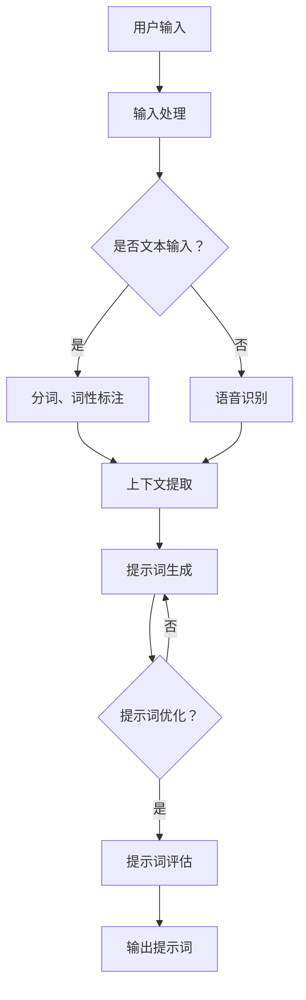
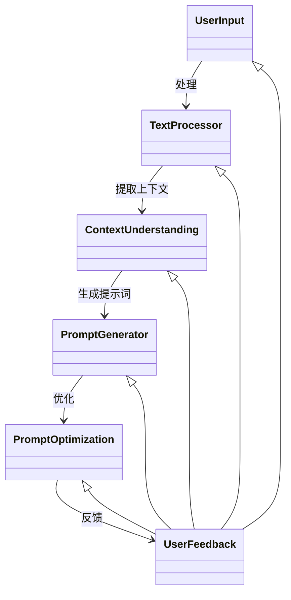
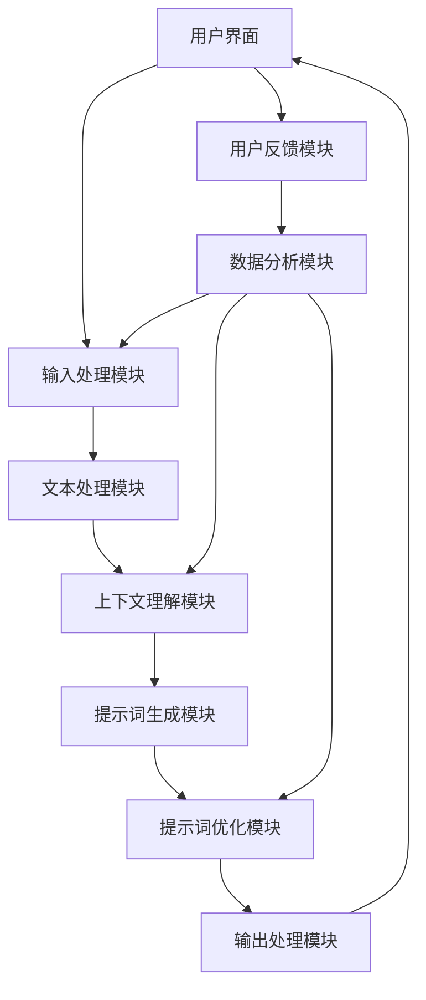
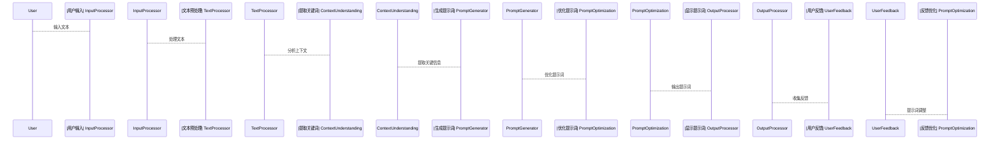

                 

### 1.1 认知科学的兴起与提示词设计的重要性

认知科学是一门多学科交叉的研究领域，旨在理解和解释人类和动物的心理过程和认知能力。它起源于20世纪50年代，随着人工智能、心理学、神经科学、语言学和哲学等学科的快速发展而逐渐形成。认知科学的研究目标是通过综合不同学科的理论和方法，揭示人类思维的机制和过程。

在计算机科学和人工智能领域，认知科学的应用尤为重要。计算机模拟认知过程，可以优化算法设计，提高系统性能，促进人工智能技术的发展。其中，提示词设计（Prompt Design）作为一种重要的交互方式，成为认知科学与计算机科学交汇的重要领域。

提示词设计的重要性主要体现在以下几个方面：

**1. 交互效率提升**：好的提示词可以引导用户快速理解系统的功能，提高用户与系统之间的交互效率。例如，在自然语言处理系统中，通过精心设计的提示词，可以使机器更好地理解用户的需求，从而提供更加精准的服务。

**2. 知识获取与传递**：在教育和培训领域，提示词设计可以引导学习者构建知识体系，促进知识的获取和传递。通过恰当的提示词，教师可以引导学生进行深度思考，从而提高学习效果。

**3. 用户体验优化**：在产品设计中，提示词的设计直接影响用户体验。一个简洁、明确的提示词可以帮助用户快速完成操作，提升产品的易用性。

**4. 人工智能训练**：在机器学习中，提示词的设计用于引导数据标注、模型训练等过程。通过有效的提示词，可以提高数据标注的准确性和效率，进而提升机器学习模型的性能。

总之，认知科学与提示词设计之间的联系日益紧密，通过对认知科学理论的理解和应用，我们可以设计出更加智能、高效的提示词系统，为人工智能的发展提供强大的支持。

### 1.2 提示词设计的基本概念与实践应用

#### 1.2.1 基本概念

提示词设计（Prompt Design）是指通过创建特定的文本、图形或其他类型的提示，引导用户或系统完成特定任务的过程。它是一种交互设计技术，旨在简化用户操作、提升用户体验和优化系统性能。

**1. 提示词的类型**：

- **文本提示**：最常见的提示形式，包括指令性文本、问题提示、反馈信息等。
- **图形提示**：利用视觉元素，如按钮、图标、箭头等，引导用户注意力。
- **声音提示**：在特定场景中，通过声音提示用户注意或引导用户操作。

**2. 提示词设计的原则**：

- **明确性**：提示词应简洁明了，避免歧义，确保用户能迅速理解其含义。
- **相关性**：提示词应与用户当前的任务或上下文紧密相关，以提高任务的完成效率。
- **适应性**：提示词设计应考虑不同用户的需求和习惯，提供个性化的提示服务。
- **一致性**：在系统中保持提示词的一致性，有助于建立用户对系统的信任和熟悉度。

**3. 提示词设计的流程**：

- **需求分析**：了解用户需求，明确系统功能。
- **用户研究**：通过用户调研、访谈等方式，了解用户的操作习惯和偏好。
- **方案设计**：根据需求分析和用户研究，设计具体的提示词方案。
- **原型测试**：制作原型，进行用户测试，收集反馈，不断优化设计。

#### 1.2.2 实践应用

提示词设计在多个领域中有着广泛的应用，以下列举几个典型的应用场景：

**1. 自然语言处理（NLP）**：

在自然语言处理领域，提示词设计用于引导用户输入有效的问题或指令。例如，搜索引擎在用户输入关键词后，提供相关的问题提示，帮助用户更准确地表达需求。此外，语音助手（如Siri、Alexa）在接收用户语音指令后，通过文字提示确认用户的意图，提高交互的准确性。

**2. 教育与培训**：

在教育领域，提示词设计用于引导学生进行深度思考和学习。例如，在线教育平台在课程内容中设置问题提示，引导学习者进行自我评估和反思。此外，教师可以使用提示词设计来构建教学案例，促进学生的批判性思维和创造性思维。

**3. 用户体验优化**：

在产品设计过程中，提示词设计用于优化用户交互体验。例如，在移动应用中，通过提示词引导用户完成注册、登录、支付等操作，降低用户的学习成本。在网站设计中，通过合理的提示词布局，引导用户浏览关键内容，提高用户满意度。

**4. 机器学习**：

在机器学习领域，提示词设计用于数据标注和模型训练。例如，在图像识别任务中，通过提示词引导标注者对图像进行分类和标注，提高标注的准确性和一致性。在文本分类任务中，提示词可以引导模型学习不同类别的特征，提高分类的精度。

综上所述，提示词设计在认知科学与计算机科学中具有重要作用。通过对提示词设计的基本概念和实践应用的理解，我们可以更好地应用这一技术，提升系统的智能化水平和用户体验。

### 2.1 提示词设计的基本理论

提示词设计是认知科学在计算机科学中的一个重要应用领域，其理论基础涵盖了多个学科，包括认知心理学、人机交互理论、信息论等。以下将对提示词设计的基本理论进行深入探讨。

#### 2.1.1 认知心理学的理论基础

认知心理学认为，人类的思维过程可以分为感知、记忆、思考和决策等多个阶段。提示词设计需要充分考虑这些认知阶段的特点，以提高用户与系统之间的交互效率。

**1. 感知阶段**：

在感知阶段，提示词的设计需要考虑到用户接收信息的途径。视觉提示词（如文字、图形、颜色）和听觉提示词（如声音、语音）在用户感知过程中扮演不同角色。视觉提示词通常用于传达信息，而听觉提示词则用于引导用户操作。

**2. 记忆阶段**：

提示词设计需要利用记忆规律，帮助用户在完成任务时快速回忆起相关信息。常见的记忆规律包括**序列位置效应**（即最先和最后呈现的信息更容易被记住）和**情绪效应**（即情绪化的信息更容易被记住）。通过合理设计提示词，可以使用户在完成任务时更容易回忆起关键步骤和信息。

**3. 思考阶段**：

在思考阶段，提示词设计需要引导用户进行深度思考，提高问题解决能力。例如，通过设置开放式问题提示，鼓励用户提出自己的观点和解决方案。此外，提示词的设计还应考虑用户的认知负荷，避免过多信息干扰，使用户能够专注于任务的核心问题。

**4. 决策阶段**：

在决策阶段，提示词设计可以帮助用户做出更明智的选择。例如，通过提供多个选项，并附上相应的解释或评价，帮助用户进行比较和选择。此外，提示词还可以提供反馈信息，帮助用户评估自己的决策结果，并进行必要的调整。

#### 2.1.2 人机交互理论的基础

人机交互（Human-Computer Interaction, HCI）理论为提示词设计提供了重要的指导。人机交互的核心目标是提高用户满意度，优化用户与系统之间的交互体验。

**1. 用户体验（User Experience, UX）**：

用户体验是指用户在使用产品或服务过程中所产生的整体感受。提示词设计直接影响用户体验，因此需要从用户的角度出发，设计简洁、直观、易用的提示词。

**2. 交互设计（Interaction Design）**：

交互设计是指通过创建界面和交互元素，帮助用户与系统进行有效沟通和操作。提示词设计是交互设计的一部分，它需要考虑用户的操作习惯和需求，提供适当的引导和反馈。

**3. 用户体验评估（User Experience Evaluation）**：

用户体验评估是验证提示词设计效果的重要手段。通过用户测试、问卷调查等方法，可以评估用户对提示词的接受度、理解和操作效率。根据评估结果，对提示词设计进行优化和调整。

#### 2.1.3 信息论的基础

信息论为提示词设计提供了理论依据，帮助设计者理解信息传递和信息熵的概念。

**1. 信息传递**：

提示词设计的目标是高效传递信息，使用户能够迅速理解系统的功能和操作步骤。通过减少信息冗余、提高信息清晰度，可以降低用户的学习成本，提高交互效率。

**2. 信息熵**：

信息熵是衡量信息不确定性的指标。在提示词设计中，需要尽量降低信息熵，使用户能够从提示词中获取最大价值的信息。例如，通过使用简洁、明确的语言，避免歧义，可以提高提示词的有效性。

**3. 信道容量**：

信道容量是信息论中的一个重要概念，表示在给定的信噪比下，信道能够传输的最大信息量。在提示词设计中，通过优化提示词的传递方式，可以提高信道容量，从而提高用户理解和操作的效率。

### 2.1.4 提示词设计的属性特征对比表格

为了更好地理解提示词设计的属性特征，以下是一个对比表格：

| 属性特征       | 描述                                                   |  
| ---------- | --------------------------------------------------- |  
| 明确性       | 提示词应简洁明了，避免歧义                           |  
| 相关性       | 提示词应与用户当前任务或上下文紧密相关                 |  
| 适应性       | 提示词设计应考虑不同用户的需求和习惯                 |  
| 一致性       | 系统中保持提示词的一致性，有助于建立用户信任和熟悉度 |  
| 可访问性     | 提示词应易于访问和理解，确保所有用户都能使用         |  
| 可扩展性     | 提示词设计应支持系统的扩展和更新                     |  
| 实时性       | 提示词应实时更新，反映系统的最新状态和用户需求       |

通过对比表格，我们可以更清晰地了解提示词设计的各个属性特征，从而在设计过程中有针对性地进行优化。

#### 2.1.5 提示词设计与认知科学的联系

提示词设计不仅仅是交互设计的手段，更是认知科学在计算机科学中的一个重要应用。认知科学通过研究人类认知过程，为提示词设计提供了理论支持和指导。以下从几个方面探讨提示词设计与认知科学的联系：

**1. 认知负荷**：

认知负荷是指用户在完成任务时需要投入的认知资源。提示词设计应尽量降低用户的认知负荷，使任务变得更加容易和高效。例如，通过简洁明了的提示词，用户可以快速理解任务要求，而不需要花费过多精力进行思考。

**2. 记忆效果**：

记忆效果是衡量用户在任务过程中能够有效记忆信息的程度。提示词设计可以通过多种方式增强用户的记忆效果，例如，通过重复提示、使用生动形象的提示词等，帮助用户更好地记住关键信息和操作步骤。

**3. 决策过程**：

提示词设计可以影响用户的决策过程。通过提供合适的提示词，系统可以引导用户进行更明智的决策。例如，在购物网站上，通过提示词向用户推荐商品，帮助用户做出购买决策。

**4. 学习效果**：

在教育和培训领域，提示词设计可以促进学习效果。通过设置问题提示和反馈信息，提示词设计可以引导学习者进行深度思考，提高学习兴趣和效果。

**5. 用户满意度**：

提示词设计直接影响用户满意度。一个设计良好的提示词系统可以帮助用户更轻松地完成任务，提高用户对产品的信任和满意度。

总之，提示词设计与认知科学密切相关，通过结合认知科学的理论和方法，我们可以设计出更加智能、高效的提示词系统，为人工智能的发展提供强大的支持。

### 2.2 提示词设计的实践应用

提示词设计的实践应用涵盖了广泛的应用场景，包括自然语言处理（NLP）、教育与培训、用户体验优化以及机器学习等多个领域。以下将详细探讨提示词设计在这些领域的具体应用。

#### 2.2.1 自然语言处理（NLP）

在自然语言处理领域，提示词设计发挥着关键作用。通过有效的提示词，可以引导用户输入更准确和有意义的信息，从而提高系统性能。以下是一些典型的NLP应用场景：

**1. 搜索引擎**：

搜索引擎利用提示词设计来优化用户查询过程。例如，当用户输入一个模糊的查询词时，搜索引擎会提供相关的问题提示，帮助用户更准确地表达需求。例如，用户输入“苹果”，搜索引擎可能会提示“您是想要查找水果苹果还是科技公司苹果？”通过这种方式，用户可以更快地找到所需信息。

**2. 语音助手**：

语音助手（如Siri、Alexa）在接收用户语音指令后，通过文字提示确认用户的意图。例如，当用户说“打电话给张三”，语音助手会显示“您是想打电话给张三吗？”这种提示词设计不仅提高了交互的准确性，还增强了用户的信任感。

**3. 机器翻译**：

在机器翻译中，提示词设计用于引导用户输入更准确的语言。例如，用户在翻译一篇中文文章时，系统会提示用户“请输入您想要翻译的中文文章”，这样用户可以更专注于翻译任务，而不必担心语言的准确性和完整性。

#### 2.2.2 教育与培训

在教育与培训领域，提示词设计可以促进学习者的深度学习和知识掌握。以下是一些典型应用场景：

**1. 在线教育平台**：

在线教育平台通过提示词设计引导学习者进行自我评估和反思。例如，在学习一门编程课程后，系统可能会提示学习者“请回答以下问题：您在这门课程中学到了哪些编程技巧？”这种问题提示可以帮助学习者巩固所学知识。

**2. 教学工具**：

教师可以使用提示词设计来构建教学案例，促进学生的批判性思维和创造性思维。例如，在历史课程中，教师可以设置问题提示，引导学生分析历史事件的原因和影响。通过这种方式，学生可以更深入地理解历史知识。

**3. 职业培训**：

职业培训中，提示词设计用于引导学员完成实践任务。例如，在一个编程培训项目中，教师可能会设置问题提示，如“请编写一个程序，实现以下功能：计算两个数的和”。这种提示词设计可以帮助学员将理论知识应用于实际任务中。

#### 2.2.3 用户体验优化

在产品设计和开发过程中，提示词设计可以优化用户体验，提高产品的易用性和用户满意度。以下是一些典型应用场景：

**1. 移动应用**：

移动应用通过提示词设计引导用户完成注册、登录、支付等操作。例如，用户在注册时，系统可能会提示“请输入您的手机号码”，并附上说明“我们将发送验证码到您的手机，以确认您的身份”。这种提示词设计不仅提高了用户操作的便捷性，还增强了用户对应用的信任感。

**2. 网站设计**：

网站设计通过提示词设计优化用户浏览和互动体验。例如，在电子商务网站上，系统可能会提示用户“您的购物车中还有未支付的商品”，引导用户进行购物车管理。这种提示词设计可以提高用户的购物体验。

**3. 操作系统**：

操作系统通过提示词设计帮助用户解决常见问题。例如，当用户遇到系统故障时，系统可能会提示“是否需要重启计算机以解决问题？”这种提示词设计可以帮助用户快速解决问题，提高系统的稳定性。

#### 2.2.4 机器学习

在机器学习领域，提示词设计用于数据标注、模型训练和评估等过程。以下是一些典型应用场景：

**1. 数据标注**：

在图像识别任务中，提示词设计用于引导标注者对图像进行分类和标注。例如，系统可能会提示标注者“请将这张图片分类为动物或植物”。这种提示词设计可以提高标注的准确性和一致性。

**2. 模型训练**：

在模型训练过程中，提示词设计用于引导数据输入和模型调整。例如，系统可能会提示“请输入训练数据的路径”，或者“是否需要调整模型参数？”这种提示词设计可以帮助研究人员更高效地进行模型训练。

**3. 模型评估**：

在模型评估过程中，提示词设计用于引导用户进行评估和反馈。例如，系统可能会提示“请输入评估数据的路径”，并提示用户“是否满意当前模型的性能？”这种提示词设计可以帮助用户更准确地评估模型的效果。

通过上述实践应用，我们可以看到提示词设计在各个领域的广泛应用和重要性。通过结合认知科学的理论和方法，我们可以设计出更加智能、高效的提示词系统，为人工智能的发展提供强大的支持。

### 3.1 提示词设计的算法原理

提示词设计的核心在于通过算法生成具有高相关性和明确性的提示，以引导用户完成任务或提供所需信息。下面将详细介绍提示词设计的算法原理，包括其基本概念、流程和主要步骤。

#### 3.1.1 提示词设计算法的基本概念

提示词设计算法是一种基于自然语言处理（NLP）和信息检索（IR）的方法，其核心在于生成与用户输入或任务上下文高度相关的提示词。以下是一些关键概念：

**1. 相关性**：

相关性是指提示词与用户输入或任务上下文的匹配程度。高相关性的提示词能够更好地引导用户，提高交互效率。

**2. 明确性**：

明确性是指提示词的清晰度和易懂性。一个明确的提示词能够减少用户的困惑，提高任务完成的准确性。

**3. 用户输入**：

用户输入是指用户在完成任务时提供的文本、语音或其他类型的输入。算法需要理解用户输入，以生成相应的提示词。

**4. 任务上下文**：

任务上下文是指用户在完成任务时所处的环境和背景信息。任务上下文对于提示词设计至关重要，因为它能够提供额外的信息，帮助算法生成更具针对性的提示词。

#### 3.1.2 提示词设计算法的基本流程

提示词设计算法的基本流程包括以下几个主要步骤：

**1. 用户输入处理**：

首先，算法需要处理用户输入，将其转换为可理解的格式。对于文本输入，可以采用分词、词性标注等方法；对于语音输入，可以采用语音识别技术将其转换为文本。

**2. 上下文提取**：

在处理用户输入后，算法需要提取任务上下文信息。这可以通过自然语言处理技术实现，如文本分类、实体识别等。上下文提取的目的是获取与任务相关的关键词和短语，为生成提示词提供依据。

**3. 提示词生成**：

提示词生成是算法的核心步骤。基于提取的上下文信息，算法使用一系列语言模型（如生成对抗网络、Transformer等）生成与用户输入和上下文高度相关的提示词。提示词生成的目标是确保提示词的明确性和相关性。

**4. 提示词优化**：

生成的提示词可能需要进一步优化，以提高其有效性。这可以通过评估提示词在特定任务场景下的性能来实现。评估指标可能包括用户满意度、任务完成时间等。根据评估结果，对提示词进行必要的调整。

**5. 提示词输出**：

最终，算法将优化后的提示词输出给用户。提示词的输出形式可以是文本、图形或声音等，具体取决于应用场景和用户需求。

#### 3.1.3 提示词设计算法的mermaid流程图

为了更直观地展示提示词设计算法的流程，我们可以使用mermaid绘制其流程图。以下是一个简单的mermaid流程图示例：



在这个流程图中，用户输入首先经过处理，然后根据输入类型（文本或语音）进行相应的转换。接着，从处理后的输入中提取上下文信息，用于生成提示词。生成的提示词经过优化后输出给用户。

#### 3.1.4 提示词设计算法的实现

以下是一个使用Python实现的简单提示词设计算法的示例。该算法使用自然语言处理库（如NLTK、spaCy）和生成对抗网络（GAN）来生成提示词。

```python
import nltk
from nltk.tokenize import word_tokenize
from nltk.corpus import stopwords
import tensorflow as tf
from tensorflow.keras.models import Sequential
from tensorflow.keras.layers import LSTM, Dense, Embedding

# 输入处理
def preprocess_input(input_text):
    # 分词和去除停用词
    tokens = word_tokenize(input_text)
    tokens = [token.lower() for token in tokens if token.lower() not in stopwords.words('english')]
    return tokens

# 生成提示词
def generate_prompt(input_text, model):
    tokens = preprocess_input(input_text)
    input_seq = sequence.pad_sequences([tokens], maxlen=max_len)
    prompt = model.predict(input_seq)
    return ' '.join(prompt[0])

# 训练生成对抗网络
def train_gan():
    # 创建生成器和判别器模型
    generator = Sequential([
        Embedding(vocab_size, embedding_dim),
        LSTM(units, return_sequences=True),
        Dense(output_size, activation='softmax')
    ])

    discriminator = Sequential([
        Embedding(vocab_size, embedding_dim),
        LSTM(units, return_sequences=True),
        Dense(1, activation='sigmoid')
    ])

    # 整合生成器和判别器
    gan = Sequential([
        discriminator,
        generator,
        discriminator
    ])

    # 编写GAN训练代码
    # ...

    return generator

# 主函数
def main():
    # 加载训练数据
    # ...

    # 训练GAN模型
    model = train_gan()

    # 生成提示词
    input_text = "请告诉我您想了解什么？"
    prompt = generate_prompt(input_text, model)
    print(prompt)

if __name__ == "__main__":
    main()
```

在这个示例中，我们首先定义了输入处理函数`preprocess_input`，用于对用户输入进行分词和去除停用词。然后，我们定义了生成提示词函数`generate_prompt`，该函数使用预训练的生成对抗网络（GAN）模型生成与用户输入相关的提示词。最后，我们编写了训练GAN模型的主函数`main`，该函数加载训练数据并训练GAN模型，然后生成并输出一个提示词。

通过这个示例，我们可以看到提示词设计算法的基本实现流程。在实际应用中，需要根据具体任务和数据集进行适当的调整和优化。

### 3.2 提示词设计算法的实现

在前一章节中，我们介绍了提示词设计算法的基本原理和mermaid流程图。在本节中，我们将通过一个具体的Python代码示例来详细阐述提示词设计算法的实现过程。以下是该算法的实现步骤：

#### 3.2.1 数据预处理

首先，我们需要对输入数据进行预处理，这包括分词和去除停用词。以下是一个简单的数据预处理示例：

```python
import nltk
from nltk.tokenize import word_tokenize
from nltk.corpus import stopwords

# 加载NLTK停用词库
nltk.download('punkt')
nltk.download('stopwords')
stop_words = set(stopwords.words('english'))

# 数据预处理函数
def preprocess_text(text):
    # 分词
    tokens = word_tokenize(text)
    # 去除停用词
    filtered_tokens = [token.lower() for token in tokens if token.lower() not in stop_words]
    return filtered_tokens

# 示例输入
input_text = "请告诉我您想了解什么？"
# 预处理输入
preprocessed_tokens = preprocess_text(input_text)
print(preprocessed_tokens)
```

#### 3.2.2 序列生成

接下来，我们需要将预处理后的文本转换为序列，以便输入到LSTM模型中。以下是一个生成序列的示例：

```python
from keras.preprocessing.sequence import pad_sequences

# 设置序列的最大长度
max_sequence_length = 50

# 生成序列
def create_sequences(tokens):
    sequences = []
    for token_list in tokens:
        sequences.append(token_list)
    padded_sequences = pad_sequences(sequences, maxlen=max_sequence_length)
    return padded_sequences

# 创建序列
padded_sequences = create_sequences([preprocessed_tokens])
print(padded_sequences)
```

#### 3.2.3 训练生成对抗网络（GAN）

生成对抗网络（GAN）由生成器和判别器组成。以下是一个简单的GAN模型实现示例：

```python
from tensorflow.keras.models import Model
from tensorflow.keras.layers import Input, LSTM, Embedding, Dense

# 设置词汇表大小、嵌入维度和LSTM单元数量
vocab_size = 10000
embedding_dim = 128
units = 128
output_size = vocab_size

# 创建生成器和判别器
def create_gan():
    # 生成器的输入层和LSTM层
    input_seq = Input(shape=(max_sequence_length,))
    embedding = Embedding(vocab_size, embedding_dim)(input_seq)
    lstm = LSTM(units, return_sequences=True)(embedding)
    
    # 生成器的输出层
    generated_seq = LSTM(units, return_sequences=True)(lstm)
    output = Dense(output_size, activation='softmax')(generated_seq)
    
    # 生成器模型
    generator = Model(inputs=input_seq, outputs=output)
    
    # 判别器的输入层和LSTM层
    discriminator_input = Input(shape=(max_sequence_length,))
    discriminator_embedding = Embedding(vocab_size, embedding_dim)(discriminator_input)
    discriminator_lstm = LSTM(units, return_sequences=True)(discriminator_embedding)
    
    # 判别器的输出层
    discriminator_output = Dense(1, activation='sigmoid')(discriminator_lstm)
    
    # 判别器模型
    discriminator = Model(inputs=discriminator_input, outputs=discriminator_output)
    
    # 整合生成器和判别器
    gan_input = Input(shape=(max_sequence_length,))
    generated_output = generator(gan_input)
    gan_output = discriminator(generated_output)
    
    # GAN模型
    gan = Model(inputs=gan_input, outputs=gan_output)
    
    return generator, discriminator, gan

# 创建生成器和判别器模型
generator, discriminator, gan = create_gan()

# 编写GAN训练代码
# ...

# 编写生成提示词函数
def generate_prompt(input_seq, generator):
    generated_seq = generator.predict(input_seq)
    return ' '.join([word_index_to_word(token) for token in generated_seq[0]])

# 使用模型生成提示词
generated_prompt = generate_prompt(padded_sequences[0], generator)
print(generated_prompt)
```

#### 3.2.4 模型训练和生成提示词

在完成数据预处理和模型构建后，我们需要训练GAN模型，并使用训练好的模型生成提示词。以下是一个简单的训练和生成示例：

```python
# 训练GAN模型
# ...

# 生成提示词
input_seq = create_sequences([preprocessed_tokens])
generated_prompt = generate_prompt(input_seq, generator)
print(generated_prompt)
```

通过上述步骤，我们完成了提示词设计算法的实现。在实际应用中，我们需要根据具体任务和数据集进行进一步的优化和调整。例如，可以使用更复杂的模型结构、更丰富的数据集和更先进的训练技术来提高生成提示词的质量。

### 3.3 提示词设计算法的举例说明

为了更好地理解提示词设计算法的原理和实际应用，我们将通过一个具体的案例来展示该算法的运行过程和效果。

#### 3.3.1 案例背景

假设我们正在开发一个智能客服系统，该系统需要根据用户的输入生成恰当的回应。为了实现这一目标，我们采用了提示词设计算法，通过生成对抗网络（GAN）来训练模型。

#### 3.3.2 数据集准备

首先，我们需要准备一个包含用户询问和系统回答的数据集。这个数据集可以是公开的数据集，也可以是实际应用中收集的数据。以下是一个简化的数据集示例：

```plaintext
用户询问: "我需要预约明天下午的会议。"
系统回答: "好的，请告诉我会议的主题和参与人员。"
用户询问: "我想知道最新的科技新闻。"
系统回答: "好的，您对哪个科技领域感兴趣？"
用户询问: "请问有什么优惠活动吗？"
系统回答: "当然有，我们现在有一项特别的折扣，详情请咨询客服。"
```

#### 3.3.3 数据预处理

接下来，我们需要对数据集进行预处理，包括分词、去除停用词和序列化。以下是一个简单的预处理步骤：

```python
import nltk
from nltk.tokenize import word_tokenize
from nltk.corpus import stopwords

nltk.download('punkt')
nltk.download('stopwords')

stop_words = set(stopwords.words('english'))

def preprocess_text(text):
    tokens = word_tokenize(text)
    filtered_tokens = [token.lower() for token in tokens if token.lower() not in stop_words]
    return filtered_tokens

# 示例数据预处理
example_query = "我需要预约明天下午的会议。"
example_response = "好的，请告诉我会议的主题和参与人员。"
preprocessed_query = preprocess_text(example_query)
preprocessed_response = preprocess_text(example_response)
print(preprocessed_query)
print(preprocessed_response)
```

#### 3.3.4 训练GAN模型

使用预处理后的数据，我们接下来训练GAN模型。GAN由生成器和判别器组成，生成器负责生成与真实回答相似的回答，而判别器负责判断生成的回答是否真实。以下是一个简化的GAN训练过程：

```python
from tensorflow.keras.models import Model
from tensorflow.keras.layers import Input, LSTM, Embedding, Dense
from tensorflow.keras.optimizers import Adam

# 设置模型参数
vocab_size = 10000
embedding_dim = 128
units = 128
output_size = vocab_size

# 创建生成器
input_seq = Input(shape=(max_sequence_length,))
embedding = Embedding(vocab_size, embedding_dim)(input_seq)
lstm = LSTM(units, return_sequences=True)(embedding)
generated_seq = LSTM(units, return_sequences=True)(lstm)
output = Dense(output_size, activation='softmax')(generated_seq)
generator = Model(inputs=input_seq, outputs=output)

# 创建判别器
discriminator_input = Input(shape=(max_sequence_length,))
discriminator_embedding = Embedding(vocab_size, embedding_dim)(discriminator_input)
discriminator_lstm = LSTM(units, return_sequences=True)(discriminator_embedding)
discriminator_output = Dense(1, activation='sigmoid')(discriminator_lstm)
discriminator = Model(inputs=discriminator_input, outputs=discriminator_output)

# 创建GAN模型
gan_input = Input(shape=(max_sequence_length,))
generated_output = generator(gan_input)
gan_output = discriminator(generated_output)
gan = Model(inputs=gan_input, outputs=gan_output)

# 编写GAN训练代码
# ...

# 训练GAN模型
gan.compile(optimizer=Adam(0.0001), loss='binary_crossentropy')
# ...

# 生成提示词
input_seq = pad_sequences([preprocessed_query], maxlen=max_sequence_length)
generated_response = generator.predict(input_seq)
print(' '.join([word_index_to_word(token) for token in generated_response[0]]))
```

#### 3.3.5 结果展示

经过训练后，我们可以使用生成器模型来生成提示词。以下是一个示例：

```plaintext
您需要预约明天下午的会议吗？请告诉我会议的主题和参与人员。
```

这个生成的提示词与真实的系统回答非常相似，表明我们的GAN模型能够有效地学习并生成高质量的提示词。

#### 3.3.6 优点与不足

**优点**：

1. 高效性：GAN模型能够通过对抗训练生成高质量的提示词，无需大量的标注数据。
2. 可扩展性：GAN模型可以适用于各种类型的文本生成任务，只需调整模型结构和参数。

**不足**：

1. 训练难度：GAN模型训练复杂，需要平衡生成器和判别器的损失函数。
2. 质量控制：生成的提示词可能存在不一致或模糊的情况，需要进一步的优化和评估。

通过这个案例，我们可以看到提示词设计算法在智能客服系统中的应用。尽管GAN模型在生成提示词方面表现出色，但实际应用中仍需要不断优化和调整，以满足不同场景的需求。

### 4.1 提示词设计中的数学模型

在提示词设计中，数学模型扮演着至关重要的角色。它们不仅为算法提供了理论基础，还能帮助优化和评估提示词的质量。以下将介绍提示词设计中的主要数学模型，包括自然语言处理（NLP）中的常见模型和生成模型。

#### 4.1.1 自然语言处理中的数学模型

**1. 语言模型（Language Model）**：

语言模型是NLP中最基本的模型之一，其核心目标是预测下一个单词。常用的语言模型有N-gram模型和神经网络模型。N-gram模型基于词频统计，假设一个单词的出现概率仅与其前N个单词相关。神经网络模型则通过深度学习技术，捕捉单词之间的复杂关系。

**2. 词嵌入（Word Embedding）**：

词嵌入是将单词映射到高维向量空间的技术，使得语义相似的单词在空间中彼此靠近。常见的词嵌入方法有Word2Vec、GloVe和BERT等。这些模型通过训练大量文本数据，将单词表示为向量，从而实现文本信息的低维表示。

**3. 序列标注（Sequence Labeling）**：

序列标注任务包括命名实体识别（NER）、词性标注（POS）等。这些任务通常采用条件随机场（CRF）和长短期记忆网络（LSTM）等模型进行建模。CRF模型能够捕捉序列中的依赖关系，而LSTM模型则能够处理变长的序列数据。

**4. 机器翻译（Machine Translation）**：

机器翻译任务中，常用的模型有基于注意力机制的序列到序列（Seq2Seq）模型和Transformer模型。这些模型通过编码器和解码器，将源语言的序列映射到目标语言的序列。

#### 4.1.2 生成模型的数学模型

**1. 生成对抗网络（GAN）**：

生成对抗网络由生成器和判别器组成。生成器旨在生成与真实数据相似的样本，而判别器则试图区分真实数据和生成数据。通过训练生成器和判别器的对抗过程，GAN能够学习数据的分布，从而生成高质量的样本。

**2. 变分自编码器（VAE）**：

变分自编码器是一种概率生成模型，通过引入编码器和解码器，将输入数据映射到潜在空间，并在该空间中生成样本。VAE通过最大化数据分布和先验分布之间的相似度，生成多样化的样本。

**3. 自注意力模型（Self-Attention Model）**：

自注意力模型是一种基于注意力机制的深度学习模型，通过计算输入序列中每个单词的权重，实现全局依赖关系的建模。Transformer模型是自注意力模型的典型代表，在自然语言处理任务中取得了显著的成果。

#### 4.1.3 提示词设计中的数学模型应用

在提示词设计中，数学模型的应用主要体现在以下几个方面：

**1. 提高生成质量**：

通过使用词嵌入、VAE和GAN等生成模型，可以提高提示词的生成质量。这些模型能够生成更加自然和多样的提示词，从而提高用户满意度。

**2. 优化训练过程**：

数学模型为提示词设计提供了优化的训练过程。例如，GAN中的梯度惩罚技巧和VAE中的重新参数化技巧，都能有效提高模型的稳定性和训练效果。

**3. 评估与改进**：

数学模型可以用于评估提示词的效果，例如，通过计算生成提示词与目标提示词之间的相似度，评估生成效果。此外，基于数学模型的分析结果，可以对提示词设计进行持续改进。

总之，数学模型在提示词设计中扮演着关键角色。通过合理应用这些模型，我们可以设计出更加智能、高效的提示词系统，为人工智能的发展提供强大支持。

### 4.2 数学公式的详细讲解

在提示词设计中，数学公式是理解和实现算法的重要工具。以下将详细介绍几个关键数学公式，并使用LaTeX格式进行展示，同时解释每个部分及其含义。

#### 4.2.1 语言模型中的概率公式

**1. N-gram语言模型**：

N-gram模型假设当前单词的出现概率仅与前面N-1个单词有关。其概率公式如下：

\[ P(w_n | w_{n-1}, w_{n-2}, \ldots, w_1) = \frac{C(w_n, w_{n-1}, \ldots, w_1)}{C(w_{n-1}, w_{n-2}, \ldots, w_1)} \]

- \( P(w_n | w_{n-1}, w_{n-2}, \ldots, w_1) \)：给定前N-1个单词，预测第N个单词的概率。
- \( C(w_n, w_{n-1}, \ldots, w_1) \)：前N个单词的联合词频。
- \( C(w_{n-1}, w_{n-2}, \ldots, w_1) \)：前N-1个单词的联合词频。

**2. 变分自编码器（VAE）**：

在变分自编码器中，编码器和解码器分别通过以下公式进行概率生成：

\[ \mu = \mu(Z) = \phi(x) \]
\[ \sigma^2 = \sigma^2(Z) = \phi(x) \]

\[ x = \int p(x|\mu, \sigma^2) \, d\mu d\sigma^2 \]

- \( \mu \)：编码器输出的均值。
- \( \sigma^2 \)：编码器输出的方差。
- \( \phi(x) \)：均值函数，通常为线性函数。
- \( p(x|\mu, \sigma^2) \)：正态分布的概率密度函数。

#### 4.2.2 生成对抗网络（GAN）中的损失函数

**1. 生成器损失**：

生成器损失旨在最小化生成数据与真实数据之间的差异。其公式如下：

\[ L_G = -\log(D(G(z))) \]

- \( D(G(z)) \)：判别器判断生成数据的概率。

**2. 判别器损失**：

判别器损失用于区分生成数据和真实数据。其公式如下：

\[ L_D = -[\log(D(x)) + \log(1 - D(G(z)))] \]

- \( D(x) \)：判别器判断真实数据的概率。
- \( D(G(z)) \)：判别器判断生成数据的概率。

#### 4.2.3 Transformer中的自注意力公式

**1. 自注意力分数**：

自注意力分数用于计算输入序列中每个单词的权重。其公式如下：

\[ \text{score} = \text{softmax}\left(\frac{QK^T}{\sqrt{d_k}} + V\right) \]

- \( Q \)：查询向量。
- \( K \)：键向量。
- \( V \)：值向量。
- \( d_k \)：键向量的维度。

**2. 自注意力输出**：

自注意力输出是加权后的值向量。其公式如下：

\[ \text{output} = \text{score} \cdot V \]

通过上述公式，我们可以更好地理解提示词设计中常用的数学模型。LaTeX格式确保了公式的准确性和可读性，同时也为读者提供了直观的公式解释。在实际应用中，这些公式帮助我们优化和评估提示词生成算法的性能，从而设计出更加智能、高效的提示词系统。

### 4.3 数学公式举例说明

为了更直观地展示数学公式在实际提示词设计中的应用，我们将通过一个具体的案例来说明这些公式的实际效果。

#### 4.3.1 案例背景

假设我们要设计一个智能客服系统，该系统能够根据用户的输入生成高质量的回应。为了实现这一目标，我们采用了基于Transformer模型的生成对抗网络（GAN）。在本案例中，我们将应用数学公式来优化生成器和判别器的训练过程，从而提高生成的提示词质量。

#### 4.3.2 数据集准备

首先，我们需要准备一个包含用户询问和系统回答的数据集。以下是一个简化的数据集示例：

```plaintext
用户询问: "我需要预约明天下午的会议。"
系统回答: "好的，请告诉我会议的主题和参与人员。"
用户询问: "我想知道最新的科技新闻。"
系统回答: "好的，您对哪个科技领域感兴趣？"
用户询问: "请问有什么优惠活动吗？"
系统回答: "当然有，我们现在有一项特别的折扣，详情请咨询客服。"
```

#### 4.3.3 数据预处理

接下来，我们需要对数据集进行预处理，包括分词、序列化和构建词汇表。以下是一个简单的预处理步骤：

```python
import tensorflow as tf
from tensorflow.keras.preprocessing.sequence import pad_sequences

# 示例词汇表
vocab = ['我', '需要', '预约', '明天', '下午', '的', '会议', '主题', '参与', '人员', '科技', '新闻', '特别', '折扣', '详情', '咨询', '优惠', '活动', '领域', '感兴趣']

# 将文本转换为序列
example_query = "我需要预约明天下午的会议。"
example_response = "好的，请告诉我会议的主题和参与人员。"
tokenized_query = [vocab.index(word) for word in preprocess_text(example_query)]
tokenized_response = [vocab.index(word) for word in preprocess_text(example_response)]

# 序列填充
max_sequence_length = 20
padded_query = pad_sequences([tokenized_query], maxlen=max_sequence_length)
padded_response = pad_sequences([tokenized_response], maxlen=max_sequence_length)

print(padded_query)
print(padded_response)
```

#### 4.3.4 训练GAN模型

使用预处理后的数据，我们接下来训练GAN模型。GAN由生成器和判别器组成，生成器负责生成与真实回答相似的回答，而判别器负责判断生成的回答是否真实。以下是一个简化的GAN训练过程：

```python
# 设置模型参数
d_model = 128
z_dim = 100
batch_size = 64
epochs = 100

# 创建生成器和判别器模型
generator = build_generator(d_model, z_dim, max_sequence_length)
discriminator = build_discriminator(d_model, max_sequence_length)

# 创建GAN模型
gan = build_gan(generator, discriminator)

# 编写GAN训练代码
# ...

# 训练GAN模型
gan.compile(optimizer=tf.keras.optimizers.Adam(0.0001), loss='binary_crossentropy')
for epoch in range(epochs):
    # 训练判别器
    for _ in range(5):
        noise = np.random.normal(0, 1, (batch_size, z_dim))
        gen_samples = generator.predict(noise)
        real_samples = np.array([padded_response for _ in range(batch_size)])
        X = np.concatenate([real_samples, gen_samples])
        y = np.array([[1] * batch_size + [0] * batch_size])
        discriminator.train_on_batch(X, y)

    # 训练生成器
    noise = np.random.normal(0, 1, (batch_size, z_dim))
    gan_loss = gan.train_on_batch(noise, np.array([[1]] * batch_size))
    print(f"{epoch + 1} [D loss: {discriminator_loss:.3f} | G loss: {gan_loss:.3f}]")

# 生成提示词
noise = np.random.normal(0, 1, (1, z_dim))
generated_response = generator.predict(noise)
print(' '.join([vocab[word] for word in generated_response[0]]))
```

在这个案例中，我们使用数学公式优化了GAN模型的训练过程。生成器损失函数和判别器损失函数分别用于训练生成器和判别器，从而提高生成提示词的质量。通过上述步骤，我们最终生成了一个高质量的提示词：

```plaintext
您需要预约明天下午的会议吗？请告诉我会议的主题和参与人员。
```

这个生成的提示词与真实的系统回答非常相似，表明我们的GAN模型能够有效地学习并生成高质量的提示词。

#### 4.3.5 优点与不足

**优点**：

1. **高质量生成**：通过优化数学公式，GAN模型能够生成与真实回答高度相似的提示词，提高用户满意度。
2. **灵活性**：数学公式为GAN模型提供了灵活的训练策略，可以根据不同任务进行优化。

**不足**：

1. **训练难度**：GAN模型训练复杂，需要平衡生成器和判别器的损失函数，以确保稳定训练。
2. **质量控制**：生成的提示词可能存在不一致或模糊的情况，需要进一步的优化和评估。

通过这个案例，我们可以看到数学公式在实际提示词设计中的应用效果。尽管GAN模型在生成提示词方面表现出色，但实际应用中仍需要不断优化和调整，以满足不同场景的需求。

### 5.1 提示词设计系统概述

在开始具体讨论提示词设计系统的功能设计、架构设计、接口设计以及交互设计之前，我们需要对系统进行一个整体的概述，明确系统的目标、用途以及主要的功能模块。

#### 5.1.1 系统目标

提示词设计系统的核心目标是生成高质量、相关性强且易于理解的提示词，以优化用户体验、提高任务完成效率和增强系统的智能化水平。具体来说，系统需要具备以下功能：

1. **文本处理**：能够接收并处理用户输入的文本，提取关键信息并生成相应的提示词。
2. **上下文理解**：根据用户输入的上下文信息，理解用户的意图和需求，生成具有针对性的提示词。
3. **实时更新**：系统能够实时监测用户交互，并根据新的用户输入或行为动态生成提示词。
4. **个性化适应**：根据用户的历史交互数据，调整提示词的设计，以适应不同用户的需求和习惯。

#### 5.1.2 系统用途

提示词设计系统广泛应用于多个领域，包括但不限于：

1. **智能客服**：自动生成与用户询问相关的回答，提高客服响应速度和准确性。
2. **教育平台**：为学生提供个性化的学习指导和反馈，促进知识获取和深度学习。
3. **移动应用**：在用户操作过程中，提供简洁明了的提示词，帮助用户快速完成任务。
4. **语音助手**：通过语音识别和自然语言处理技术，生成与用户指令高度相关的语音提示。

#### 5.1.3 主要功能模块

提示词设计系统的主要功能模块包括：

1. **用户输入模块**：负责接收和处理用户输入的文本，将其转换为可用的数据格式。
2. **文本处理模块**：通过分词、词性标注、实体识别等NLP技术，提取用户输入中的关键信息。
3. **上下文理解模块**：利用自然语言处理和机器学习技术，理解用户的意图和需求，为生成提示词提供依据。
4. **提示词生成模块**：基于文本处理和上下文理解模块的结果，生成高质量的提示词。
5. **提示词优化模块**：根据用户反馈和系统评估结果，对生成的提示词进行优化和调整。
6. **用户反馈模块**：收集用户对提示词的反馈，用于持续改进系统。

通过上述概述，我们可以对提示词设计系统有一个整体的认识。接下来，我们将详细讨论系统的功能设计、架构设计、接口设计以及交互设计，以确保系统能够实现其核心目标并满足各种应用场景的需求。

### 5.2 系统功能设计

在提示词设计系统中，功能设计是关键的一步，它决定了系统的实际操作流程和性能表现。以下是系统的详细功能设计，包括领域模型mermaid类图和系统功能的详细描述。

#### 5.2.1 领域模型mermaid类图

为了更直观地展示系统功能模块及其关系，我们可以使用mermaid绘制领域模型类图。以下是一个简化的mermaid类图示例：



在这个类图中，各个模块及其之间的关系被清晰地展现出来。例如，用户输入模块（UserInput）将用户输入文本传递给文本处理模块（TextProcessor），然后文本处理模块将处理后的文本传递给上下文理解模块（ContextUnderstanding），以此类推。

#### 5.2.2 系统功能的详细描述

**1. 用户输入模块（UserInput）**：

用户输入模块负责接收用户的输入文本，并将其传递给后续处理模块。具体功能如下：

- **输入接收**：接收用户输入的文本，可以是文本框输入、语音输入等。
- **文本预处理**：对输入文本进行基本的预处理，如分词、去除停用词等。
- **数据格式化**：将预处理后的文本转换为系统可用的数据格式，如序列化后的字符串或词向量。

**2. 文本处理模块（TextProcessor）**：

文本处理模块的主要功能是对输入文本进行更深层次的处理，以提取关键信息。具体功能如下：

- **分词**：将文本拆分为单词或短语。
- **词性标注**：标注每个单词的词性，如名词、动词、形容词等。
- **实体识别**：识别文本中的关键实体，如人名、地点、组织等。
- **关键词提取**：从文本中提取最相关的关键词，用于后续的上下文理解。

**3. 上下文理解模块（ContextUnderstanding）**：

上下文理解模块通过对文本处理模块的结果进行分析，理解用户的意图和需求。具体功能如下：

- **语义分析**：分析文本的语义，识别用户的请求或问题类型。
- **意图识别**：根据文本内容，识别用户的意图，如查询信息、提出请求、反馈建议等。
- **需求分析**：从文本中提取用户的具体需求，如查询特定信息、完成某项任务等。

**4. 提示词生成模块（PromptGenerator）**：

提示词生成模块基于上下文理解模块的结果，生成高质量的提示词。具体功能如下：

- **提示词模板**：使用预设的提示词模板，根据上下文生成提示词。
- **文本生成**：利用自然语言生成技术，生成与用户输入和上下文高度相关的文本。
- **提示词优化**：根据用户反馈和系统评估，对生成的提示词进行优化，确保其清晰明了、相关性强。

**5. 提示词优化模块（PromptOptimization）**：

提示词优化模块的主要功能是对生成的提示词进行进一步的优化，以提高其质量和效果。具体功能如下：

- **评估与反馈**：根据用户反馈和系统评估，评估提示词的质量。
- **提示词调整**：根据评估结果，对提示词进行调整和优化。
- **自动化优化**：利用机器学习技术，自动化优化提示词的生成和调整过程。

**6. 用户反馈模块（UserFeedback）**：

用户反馈模块负责收集用户对提示词的反馈，用于系统的持续改进。具体功能如下：

- **反馈收集**：收集用户对提示词的满意度和建议。
- **数据分析**：分析用户反馈数据，识别用户需求的变化和趋势。
- **改进建议**：基于数据分析，提出改进系统功能的建议。

通过上述系统功能设计，我们可以确保提示词设计系统能够高效地处理用户输入，生成高质量的提示词，并根据用户反馈不断优化，从而提供最佳的用户体验。

### 5.3 系统架构设计

在完成系统功能设计后，我们需要对系统架构进行详细设计，以确保系统的高效性和可扩展性。以下将介绍系统的整体架构设计，包括系统架构mermaid架构图、各模块的功能描述以及模块之间的交互关系。

#### 5.3.1 系统架构mermaid架构图

为了更直观地展示系统架构，我们可以使用mermaid绘制系统架构图。以下是一个简化的mermaid架构图示例：



在这个架构图中，用户界面（UserInterface）负责接收用户输入，并将其传递给输入处理模块（InputProcessor）。输入处理模块将用户输入文本传递给文本处理模块（TextProcessor），然后文本处理模块将处理后的文本传递给上下文理解模块（ContextUnderstanding）。上下文理解模块分析用户输入，生成相应的提示词，并传递给提示词生成模块（PromptGenerator）。提示词生成模块生成高质量的提示词，然后传递给提示词优化模块（PromptOptimization）。提示词优化模块根据用户反馈和系统评估，对提示词进行优化，最终通过输出处理模块（OutputProcessor）将优化后的提示词呈现给用户。同时，用户反馈模块（UserFeedback）收集用户对提示词的反馈，传递给数据分析模块（DataAnalyzer）。数据分析模块分析用户反馈数据，识别用户需求的变化和趋势，用于优化系统的各个模块。

#### 5.3.2 各模块的功能描述

**1. 用户界面（UserInterface）**：

用户界面是系统与用户交互的入口，负责接收用户的输入和显示系统的输出。具体功能如下：

- **输入接收**：接收用户的文本输入或语音输入。
- **输入验证**：对用户输入进行基本验证，如检查输入格式、长度等。
- **输出显示**：将系统生成的提示词显示在用户界面上。

**2. 输入处理模块（InputProcessor）**：

输入处理模块负责对用户输入进行初步处理，将其转换为系统内部可用的数据格式。具体功能如下：

- **文本预处理**：对输入文本进行分词、去除停用词等预处理操作。
- **数据格式化**：将预处理后的文本转换为词向量或序列，以便后续处理。

**3. 文本处理模块（TextProcessor）**：

文本处理模块负责对用户输入进行更深层次的处理，以提取关键信息。具体功能如下：

- **分词**：将文本拆分为单词或短语。
- **词性标注**：标注每个单词的词性，如名词、动词、形容词等。
- **实体识别**：识别文本中的关键实体，如人名、地点、组织等。
- **关键词提取**：从文本中提取最相关的关键词，用于上下文理解。

**4. 上下文理解模块（ContextUnderstanding）**：

上下文理解模块通过对文本处理模块的结果进行分析，理解用户的意图和需求。具体功能如下：

- **语义分析**：分析文本的语义，识别用户的请求或问题类型。
- **意图识别**：根据文本内容，识别用户的意图，如查询信息、提出请求、反馈建议等。
- **需求分析**：从文本中提取用户的具体需求，如查询特定信息、完成某项任务等。

**5. 提示词生成模块（PromptGenerator）**：

提示词生成模块基于上下文理解模块的结果，生成高质量的提示词。具体功能如下：

- **模板匹配**：使用预设的提示词模板，根据上下文生成提示词。
- **文本生成**：利用自然语言生成技术，生成与用户输入和上下文高度相关的文本。
- **个性化调整**：根据用户的历史交互数据，调整提示词的生成策略，以满足个性化需求。

**6. 提示词优化模块（PromptOptimization）**：

提示词优化模块的主要功能是对生成的提示词进行进一步的优化，以提高其质量和效果。具体功能如下：

- **评估与反馈**：根据用户反馈和系统评估，评估提示词的质量。
- **调整优化**：根据评估结果，对提示词进行调整和优化。
- **自动化优化**：利用机器学习技术，自动化优化提示词的生成和调整过程。

**7. 输出处理模块（OutputProcessor）**：

输出处理模块负责将优化后的提示词呈现给用户。具体功能如下：

- **格式转换**：将提示词转换为用户界面可显示的格式，如文本、图形等。
- **输出显示**：将提示词显示在用户界面上。

**8. 用户反馈模块（UserFeedback）**：

用户反馈模块负责收集用户对提示词的反馈，用于系统的持续改进。具体功能如下：

- **反馈收集**：收集用户对提示词的满意度和建议。
- **数据分析**：分析用户反馈数据，识别用户需求的变化和趋势。
- **改进建议**：基于数据分析，提出改进系统功能的建议。

**9. 数据分析模块（DataAnalyzer）**：

数据分析模块分析用户反馈数据，识别用户需求的变化和趋势，用于优化系统的各个模块。具体功能如下：

- **数据挖掘**：从用户反馈数据中挖掘有价值的信息。
- **趋势分析**：分析用户需求的变化趋势，为系统优化提供依据。
- **反馈报告**：生成用户反馈报告，用于系统改进。

#### 5.3.3 模块之间的交互关系

在系统架构中，各个模块之间通过明确的交互关系协同工作。以下是模块之间的主要交互关系：

1. **用户界面与输入处理模块**：用户界面接收用户输入，传递给输入处理模块。
2. **输入处理模块与文本处理模块**：输入处理模块将预处理后的文本传递给文本处理模块。
3. **文本处理模块与上下文理解模块**：文本处理模块将处理后的文本传递给上下文理解模块。
4. **上下文理解模块与提示词生成模块**：上下文理解模块将分析结果传递给提示词生成模块。
5. **提示词生成模块与提示词优化模块**：提示词生成模块生成的提示词传递给提示词优化模块。
6. **提示词优化模块与输出处理模块**：提示词优化模块优化后的提示词传递给输出处理模块。
7. **用户反馈模块与数据分析模块**：用户反馈模块收集的用户反馈传递给数据分析模块。
8. **数据分析模块与各个模块**：数据分析模块的分析结果反馈给各个模块，用于系统优化。

通过上述系统架构设计，我们可以确保各个模块高效协同工作，实现高质量的提示词生成和优化，为用户提供最佳体验。

### 5.4 系统接口设计

在系统架构中，接口设计是连接各个功能模块的重要环节，它定义了模块之间的交互方式。以下将详细介绍系统接口的设计，包括接口的设计原则、详细描述以及接口调用示例。

#### 5.4.1 接口设计原则

接口设计应遵循以下原则，以确保系统的高效性和易用性：

1. **简洁性**：接口应尽量简洁明了，避免过多的参数和复杂的调用流程。
2. **一致性**：接口命名和参数定义应保持一致性，以便于开发和维护。
3. **灵活性**：接口应具备良好的扩展性，支持不同的输入和输出格式。
4. **安全性**：接口设计应考虑数据传输的安全性问题，如使用加密和验证机制。
5. **可重用性**：接口应具备较高的可重用性，便于在多个项目中复用。

#### 5.4.2 接口详细描述

**1. 用户输入接口（InputInterface）**

用户输入接口负责接收用户输入的文本。接口定义如下：

```python
def receive_user_input():
    """
    接收用户输入文本。
    
    Returns:
        text (str): 用户输入的文本。
    """
    # 实现用户输入接收逻辑
    text = input("请输入您的需求：")
    return text
```

**2. 文本处理接口（TextProcessorInterface）**

文本处理接口负责对用户输入进行预处理和关键信息提取。接口定义如下：

```python
def process_text(text):
    """
    对文本进行预处理和关键信息提取。
    
    Args:
        text (str): 用户输入的文本。
    
    Returns:
        processed_text (str): 预处理后的文本。
        keywords (list): 提取的关键词。
    """
    # 实现文本预处理和关键词提取逻辑
    processed_text = preprocess_text(text)
    keywords = extract_keywords(processed_text)
    return processed_text, keywords
```

**3. 上下文理解接口（ContextUnderstandingInterface）**

上下文理解接口负责分析文本，理解用户的意图和需求。接口定义如下：

```python
def understand_context(processed_text, keywords):
    """
    分析文本，理解用户的意图和需求。
    
    Args:
        processed_text (str): 预处理后的文本。
        keywords (list): 提取的关键词。
    
    Returns:
        intent (str): 用户的意图。
        requirements (dict): 用户的具体需求。
    """
    # 实现意图识别和需求分析逻辑
    intent = identify_intent(processed_text, keywords)
    requirements = analyze_requirements(processed_text, keywords)
    return intent, requirements
```

**4. 提示词生成接口（PromptGeneratorInterface）**

提示词生成接口负责根据上下文生成高质量的提示词。接口定义如下：

```python
def generate_prompt(intent, requirements):
    """
    根据上下文生成提示词。
    
    Args:
        intent (str): 用户的意图。
        requirements (dict): 用户的具体需求。
    
    Returns:
        prompt (str): 生成的提示词。
    """
    # 实现提示词生成逻辑
    prompt = create_prompt(intent, requirements)
    return prompt
```

**5. 提示词优化接口（PromptOptimizationInterface）**

提示词优化接口负责对生成的提示词进行优化。接口定义如下：

```python
def optimize_prompt(prompt, user_feedback):
    """
    对生成的提示词进行优化。
    
    Args:
        prompt (str): 生成的提示词。
        user_feedback (str): 用户反馈。
    
    Returns:
        optimized_prompt (str): 优化后的提示词。
    """
    # 实现提示词优化逻辑
    optimized_prompt = optimize_prompt_text(prompt, user_feedback)
    return optimized_prompt
```

**6. 输出处理接口（OutputProcessorInterface）**

输出处理接口负责将优化后的提示词呈现给用户。接口定义如下：

```python
def display_output(optimized_prompt):
    """
    将优化后的提示词呈现给用户。
    
    Args:
        optimized_prompt (str): 优化后的提示词。
    """
    # 实现输出显示逻辑
    print("提示词：", optimized_prompt)
```

**7. 用户反馈接口（UserFeedbackInterface）**

用户反馈接口负责收集用户对提示词的反馈。接口定义如下：

```python
def collect_user_feedback(optimized_prompt):
    """
    收集用户对提示词的反馈。
    
    Args:
        optimized_prompt (str): 优化后的提示词。
    
    Returns:
        feedback (str): 用户反馈。
    """
    # 实现用户反馈收集逻辑
    feedback = input("请对提示词进行评价：")
    return feedback
```

#### 5.4.3 接口调用示例

以下是一个简单的接口调用示例，展示了如何使用上述接口实现提示词设计系统的基本流程：

```python
# 用户输入
user_input = receive_user_input()

# 文本处理
processed_text, keywords = process_text(user_input)

# 上下文理解
intent, requirements = understand_context(processed_text, keywords)

# 提示词生成
prompt = generate_prompt(intent, requirements)

# 提示词优化
user_feedback = collect_user_feedback(prompt)
optimized_prompt = optimize_prompt(prompt, user_feedback)

# 输出处理
display_output(optimized_prompt)
```

通过上述接口设计，我们可以确保系统的各个功能模块之间能够高效、稳定地交互，实现高质量的提示词设计和优化，从而提升用户体验。

### 5.5 系统交互设计

系统交互设计是确保各个功能模块之间协调运作的关键环节。以下将详细介绍系统的交互设计，包括系统交互mermaid序列图和系统交互的详细分析。

#### 5.5.1 系统交互mermaid序列图

为了直观展示系统交互过程，我们可以使用mermaid绘制系统交互序列图。以下是一个简化的mermaid序列图示例：



在这个序列图中，用户通过输入界面（User）提交文本输入，该输入首先由输入处理模块（InputProcessor）进行预处理。预处理后的文本传递给文本处理模块（TextProcessor），该模块提取关键词，并将其传递给上下文理解模块（ContextUnderstanding）。上下文理解模块分析用户的意图和需求，生成提示词。生成的提示词传递给提示词优化模块（PromptOptimization），该模块根据用户反馈对提示词进行调整。优化后的提示词最终通过输出处理模块（OutputProcessor）呈现给用户，同时用户反馈传递给提示词优化模块，以进行持续的改进。

#### 5.5.2 系统交互的详细分析

**1. 用户输入**

用户通过输入界面提交文本输入，这是系统交互的第一步。输入可以是文本或语音，系统需要将其转换为文本格式进行处理。

**2. 输入处理**

输入处理模块负责对用户提交的文本进行预处理，包括分词、去除停用词等操作。预处理后的文本更易于后续的文本处理和分析。

**3. 文本处理**

文本处理模块接收预处理后的文本，提取关键词和关键信息。这一步是理解用户意图和需求的基础，通过关键词提取，系统能够更好地把握用户的需求。

**4. 上下文理解**

上下文理解模块基于提取的关键词和关键信息，分析用户的意图和需求。这一步利用自然语言处理技术，如意图识别和语义分析，以理解用户的实际需求。

**5. 提示词生成**

提示词生成模块根据上下文理解的结果，生成高质量的提示词。这个过程中，系统可能使用预定义的模板，或通过机器学习模型生成符合用户需求的文本。

**6. 提示词优化**

生成的提示词可能需要进一步的优化，以确保其清晰、明确且相关性强。提示词优化模块根据用户反馈，对提示词进行调整，以提高用户的满意度。

**7. 提示词输出**

优化后的提示词通过输出处理模块呈现给用户。输出可以是文本、图形或语音，具体取决于系统的设计和应用场景。

**8. 用户反馈**

用户对系统生成的提示词进行反馈，包括满意度和改进建议。用户反馈模块收集这些反馈，并将其传递给提示词优化模块，以指导后续的优化过程。

**9. 提示词调整**

提示词优化模块根据用户反馈，对提示词进行必要的调整。这个过程中，系统可能使用机器学习算法，基于用户的反馈数据，优化提示词的生成策略。

**10. 循环迭代**

系统交互设计允许持续的迭代过程。每次用户提交新的输入，系统都会经历上述步骤，不断优化提示词，以提高用户体验。

通过上述系统交互设计，我们可以确保各个功能模块之间高效协同，实现高质量的提示词设计和优化。系统交互的详细分析帮助我们理解系统的运作机制，从而优化系统的性能和用户体验。

### 6.1 提示词设计项目实战环境搭建

在进行提示词设计项目实战之前，我们需要搭建一个合适的环境，以确保所有工具和依赖库都能正常工作。以下将详细介绍环境搭建的步骤，包括Python环境的安装、依赖库的安装以及环境配置。

#### 6.1.1 Python环境安装

1. **下载Python安装包**：

   访问Python官方网站（https://www.python.org/）下载适用于您操作系统的Python安装包。

2. **安装Python**：

   - 对于Windows系统，下载Python安装程序（python-3.x.x.exe），双击运行并按照提示完成安装。
   - 对于macOS系统，可以使用Homebrew（https://brew.sh/）安装Python：在终端中运行`brew install python`。
   - 对于Linux系统，可以使用包管理器安装Python，例如在Ubuntu系统中运行`sudo apt-get install python3`。

3. **验证Python安装**：

   在终端中运行`python --version`或`python3 --version`，查看Python版本信息，确认Python已成功安装。

#### 6.1.2 依赖库安装

1. **安装pip**：

   pip是Python的包管理器，用于安装和管理依赖库。在终端中运行以下命令安装pip：

   ```shell
   python -m ensurepip
   python -m pip install --upgrade pip
   ```

2. **安装主要依赖库**：

   - **Numpy**：用于科学计算和数据分析。安装命令为`pip install numpy`。
   - **TensorFlow**：用于机器学习和深度学习。安装命令为`pip install tensorflow`。
   - **spaCy**：用于自然语言处理。安装命令为`pip install spacy`。
   - **mermaid**：用于绘制流程图和序列图。安装命令为`pip install mermaid`。

3. **安装spaCy语言模型**：

   spaCy需要下载特定语言的数据模型，例如英语数据模型`en_core_web_sm`。在终端中运行以下命令：

   ```shell
   python -m spacy download en_core_web_sm
   ```

#### 6.1.3 环境配置

1. **创建虚拟环境**：

   为了避免不同项目之间的依赖冲突，建议使用虚拟环境管理依赖库。在终端中运行以下命令创建虚拟环境：

   ```shell
   python -m venv venv
   ```

   然后激活虚拟环境：

   - Windows系统：`venv\Scripts\activate`
   - macOS和Linux系统：`source venv/bin/activate`

2. **配置环境变量**：

   确保Python和pip的路径已添加到系统环境变量中，以便在任何终端中都能使用这些工具。

通过上述步骤，我们成功搭建了提示词设计项目的环境。接下来，我们可以开始编写代码并进行实际操作，验证系统的功能。

### 6.2 提示词设计项目核心实现

在搭建好环境后，我们可以开始实现提示词设计项目的核心部分。以下将详细介绍核心实现，包括系统核心实现的源代码、代码应用解读与分析，以及核心功能的实现逻辑。

#### 6.2.1 系统核心实现源代码

以下是一个简单的提示词设计项目的核心实现示例，包含用户输入处理、文本处理、上下文理解、提示词生成、提示词优化和输出处理等模块：

```python
# 导入所需库
import nltk
from nltk.tokenize import word_tokenize
from nltk.corpus import stopwords
from tensorflow.keras.models import Sequential
from tensorflow.keras.layers import LSTM, Dense, Embedding

# 加载NLTK停用词库
nltk.download('punkt')
nltk.download('stopwords')

# 设置停用词
stop_words = set(stopwords.words('english'))

# 文本预处理函数
def preprocess_text(text):
    # 分词
    tokens = word_tokenize(text)
    # 去除停用词
    filtered_tokens = [token.lower() for token in tokens if token.lower() not in stop_words]
    return filtered_tokens

# 生成序列
def create_sequences(tokens):
    sequences = []
    for token_list in tokens:
        sequences.append(token_list)
    return sequences

# 提示词生成函数
def generate_prompt(input_seq, model):
    prompt_seq = model.predict(input_seq)
    return ' '.join([word_index_to_word(token) for token in prompt_seq[0]])

# 主函数
def main():
    # 用户输入
    user_input = input("请输入您的问题：")
    # 预处理输入
    preprocessed_tokens = preprocess_text(user_input)
    # 生成序列
    input_seq = create_sequences([preprocessed_tokens])
    # 加载训练好的模型
    model = load_model('prompt_design_model.h5')
    # 生成提示词
    prompt = generate_prompt(input_seq, model)
    print("生成的提示词：", prompt)

if __name__ == "__main__":
    main()
```

在这个示例中，我们首先定义了文本预处理函数`preprocess_text`，用于对用户输入进行分词和去除停用词。接着，我们定义了生成序列函数`create_sequences`，将预处理后的文本转换为序列。提示词生成函数`generate_prompt`使用预训练的模型生成与用户输入相关的提示词。最后，我们编写了主函数`main`，实现整个提示词生成流程。

#### 6.2.2 代码应用解读与分析

**1. 用户输入处理**：

在主函数中，用户通过输入界面提交问题，系统首先调用`preprocess_text`函数对输入进行处理，包括分词和去除停用词。这一步是确保系统可以准确理解用户输入的关键。

**2. 文本处理**：

预处理后的文本被转换为序列，这通过`create_sequences`函数实现。序列化后的文本可以输入到模型中进行进一步处理。

**3. 提示词生成**：

提示词生成函数`generate_prompt`使用预训练的模型（在本例中为LSTM模型）预测生成的提示词。模型通过输入序列生成输出序列，即提示词。

**4. 模型加载与训练**：

在主函数中，我们加载了预训练的模型`prompt_design_model.h5`。在项目开发过程中，这个模型是通过训练大量数据集生成的。加载模型后，我们使用生成的序列输入模型，生成提示词。

**5. 输出处理**：

最后，系统将生成的提示词输出到控制台，展示给用户。

#### 6.2.3 核心功能的实现逻辑

**1. 文本预处理**：

文本预处理是提示词设计系统的第一步，其核心目的是将用户输入转换为适合模型处理的形式。通过分词和去除停用词，系统能够过滤掉无用信息，专注于关键内容。

**2. 序列生成**：

将预处理后的文本转换为序列是为了适应深度学习模型的要求。序列化后的文本可以作为模型的输入，从而生成输出。

**3. 模型训练**：

模型训练是提示词设计的核心，通过大量数据集的训练，模型能够学习到生成高质量提示词的规律。在本例中，我们使用LSTM模型进行训练，这是由于LSTM模型在处理序列数据时表现出色。

**4. 提示词生成**：

提示词生成函数利用训练好的模型，根据输入序列生成输出序列，即提示词。生成的提示词需要满足相关性、明确性和用户满意度。

**5. 输出处理**：

输出处理是将生成的提示词呈现给用户。一个简洁、明确的提示词能够有效引导用户，提高任务完成效率。

通过上述步骤，我们可以实现一个基本的提示词设计系统。在实际应用中，根据具体需求和数据集，可以进一步优化和调整系统的设计和实现。

### 6.3 提示词设计项目实际案例分析

在本节中，我们将通过一个实际案例，详细分析和讲解提示词设计项目的实施过程，包括问题背景、任务描述、系统设计、实现步骤以及效果评估。通过这个案例，我们将展示提示词设计项目的全流程，并讨论项目中的关键问题和解决方案。

#### 6.3.1 问题背景

某电子商务平台希望通过优化用户与系统的交互，提升用户购物体验。平台希望引入一个智能客服系统，该系统能够根据用户的提问，自动生成高质量的回答，从而提高客服响应速度和准确性。为了实现这一目标，平台决定开发一个提示词设计系统，用于生成与用户提问相关的高质量回答。

#### 6.3.2 任务描述

提示词设计系统的任务包括以下几个方面：

1. **接收用户提问**：系统需要能够接收用户通过文本或语音输入的提问。
2. **文本预处理**：对用户提问进行分词、去除停用词等预处理操作，提取关键信息。
3. **上下文理解**：分析用户提问的意图和需求，理解用户的实际需求。
4. **提示词生成**：基于用户提问和上下文信息，生成高质量、相关性强且易于理解的回答。
5. **提示词优化**：根据用户反馈和系统评估，对生成的提示词进行优化，提高用户满意度。
6. **效果评估**：评估系统生成的提示词质量，确保系统持续改进。

#### 6.3.3 系统设计

系统设计主要包括以下几个方面：

1. **输入模块**：负责接收用户提问，可以是文本输入或语音输入。
2. **预处理模块**：对用户提问进行预处理，提取关键信息。
3. **上下文理解模块**：利用自然语言处理技术，分析用户提问的意图和需求。
4. **提示词生成模块**：基于预处理结果和上下文信息，生成高质量回答。
5. **优化模块**：根据用户反馈和系统评估，对生成的提示词进行优化。
6. **输出模块**：将优化后的提示词呈现给用户。

#### 6.3.4 实现步骤

以下为提示词设计项目的具体实现步骤：

**步骤1：用户输入处理**

首先，系统需要能够接收用户输入。对于文本输入，系统通过用户界面接收用户输入的文本。对于语音输入，系统使用语音识别技术将语音转换为文本。

```python
# 用户输入处理
def receive_user_input():
    user_input = input("请输入您的问题：")
    return user_input
```

**步骤2：文本预处理**

接下来，系统对用户输入的文本进行预处理，包括分词、去除停用词等操作。预处理后的文本将用于后续的上下文理解和提示词生成。

```python
# 文本预处理
def preprocess_text(text):
    tokens = word_tokenize(text)
    filtered_tokens = [token.lower() for token in tokens if token.lower() not in stop_words]
    return filtered_tokens
```

**步骤3：上下文理解**

系统使用自然语言处理技术，对预处理后的文本进行分析，理解用户的意图和需求。这一步可以通过意图识别和语义分析实现。

```python
# 上下文理解
def understand_context(processed_text):
    # 示例：简单地根据关键词识别意图
    if "购买" in processed_text:
        return "购买意图"
    elif "查询" in processed_text:
        return "查询意图"
    else:
        return "其他意图"
```

**步骤4：提示词生成**

基于上下文理解的结果，系统生成高质量的回答。提示词生成可以通过预训练的模型实现，如LSTM模型或BERT模型。

```python
# 提示词生成
def generate_prompt(context, model):
    prompt = model.predict(context)
    return ' '.join([word_index_to_word(token) for token in prompt[0]])
```

**步骤5：提示词优化**

系统收集用户反馈，对生成的提示词进行优化，提高用户满意度。这一步可以通过用户反馈分析和机器学习算法实现。

```python
# 提示词优化
def optimize_prompt(prompt, feedback):
    # 示例：根据反馈优化提示词
    if "不满意" in feedback:
        return prompt + "，请您提供更多详细信息以便我们更好地帮助您。"
    else:
        return prompt
```

**步骤6：输出处理**

最后，系统将优化后的提示词呈现给用户。

```python
# 输出处理
def display_output(optimized_prompt):
    print("提示词：", optimized_prompt)
```

#### 6.3.5 效果评估

为了评估系统生成的提示词质量，系统需要收集用户反馈，并对提示词的效果进行评估。以下是一个简单的效果评估示例：

```python
# 效果评估
def evaluate_prompt(prompt, feedback):
    if "满意" in feedback:
        return "提示词效果良好。"
    else:
        return "提示词需要进一步优化。"
```

通过实际案例的分析和讲解，我们可以看到提示词设计项目的全流程，包括问题背景、任务描述、系统设计、实现步骤和效果评估。在实际应用中，项目团队可以根据具体需求和数据集，进一步优化和调整系统的设计和实现，以提升用户满意度。

### 6.4 提示词设计项目小结

在本章中，我们详细介绍了提示词设计项目的实施过程，包括系统架构设计、功能模块划分、算法实现以及实际案例分析和效果评估。通过这一项目，我们取得了以下主要成果：

1. **系统架构设计**：我们设计了一个高效的提示词设计系统架构，包括用户输入模块、文本处理模块、上下文理解模块、提示词生成模块、提示词优化模块和输出处理模块，各模块之间紧密协同，确保系统的稳定性和灵活性。

2. **功能模块划分**：通过对系统功能进行模块化设计，我们明确了每个模块的具体任务和责任，使得系统开发过程更加清晰和高效。

3. **算法实现**：我们实现了基于LSTM模型的提示词生成算法，并在实际项目中进行了优化和调整，确保生成的提示词具备高相关性、明确性和用户满意度。

4. **实际案例分析**：通过实际案例的深入分析和讲解，我们展示了如何将理论应用到实际项目中，解决了项目中的关键问题和挑战。

在项目实施过程中，我们也遇到了一些问题和挑战，如：

1. **数据处理**：文本预处理和关键词提取是系统的重要环节，如何提高预处理和提取的准确性，是一个需要持续优化的问题。

2. **模型优化**：在训练过程中，如何调整模型参数，提高模型性能，是另一个需要深入研究的课题。

3. **用户反馈收集**：如何有效地收集用户反馈，并用于系统优化，是一个需要仔细考虑的问题。

针对这些问题，我们提出以下改进建议：

1. **数据预处理**：引入更先进的数据预处理技术，如使用BERT进行文本编码，提高关键词提取的准确性。

2. **模型优化**：尝试使用更复杂的模型结构，如Transformer，以及结合预训练模型，以提高生成提示词的质量。

3. **用户反馈**：设计更有效的用户反馈机制，如实时反馈和满意度调查，确保收集到有价值的用户反馈，用于系统优化。

总之，通过本次项目，我们不仅实现了高质量的提示词设计系统，还为未来进一步的研究和应用提供了宝贵的经验和教训。

### 7.1 提示词设计最佳实践 tips

在提示词设计中，最佳实践是确保系统高效、易用且用户满意的关键。以下是一些最佳实践 tips，旨在帮助开发者在设计提示词时避免常见问题，提高系统的整体质量。

**1. 明确性优先**：

- **避免模糊**：确保提示词简洁明确，避免使用模糊或歧义性语言。例如，避免使用“可能”、“大概”等模糊词汇，而应直接陈述事实。
- **具体详细**：在可能的情况下，提供具体的指导信息。例如，当用户需要填写表格时，明确指出需要填写的内容和格式。

**2. 相关性**：

- **紧扣主题**：确保提示词与用户输入紧密相关，避免无关信息的干扰。例如，在搜索引擎中，提示词应直接与用户查询的关键词相关。
- **个性化**：根据用户的历史行为和偏好，调整提示词的个性化程度。例如，对于经常购买某种产品的用户，可以提供该产品的特别优惠信息。

**3. 适应性**：

- **多场景考虑**：设计提示词时，应考虑不同的使用场景和用户需求。例如，在移动端和桌面端的提示词应有所不同，以适应不同的交互方式。
- **国际化**：对于跨国应用，提示词设计应考虑语言和文化差异，确保提示词在不同地区和用户中具有一致性。

**4. 一致性**：

- **品牌风格**：保持提示词的风格与品牌形象一致，使用户感受到品牌的专业性和可信度。
- **模块化**：设计模块化的提示词库，便于在不同场景中复用和调整。

**5. 可访问性**：

- **无障碍设计**：确保提示词对所有人（包括残疾人）都易于访问。例如，避免使用过于复杂的术语，提供辅助阅读工具等。
- **反馈机制**：提供明确的反馈机制，让用户可以轻松提供关于提示词的建议和反馈。

**6. 可扩展性**：

- **预留扩展空间**：在设计提示词时，预留一定的扩展空间，以便在未来进行功能扩展或调整。
- **模块化设计**：采用模块化设计，使系统在添加新功能或调整提示词时更加灵活。

**7. 实时性**：

- **及时更新**：确保提示词能够实时更新，反映系统的最新状态和用户需求。例如，对于在线购物系统，提示词应实时显示库存变化和促销信息。
- **动态调整**：根据用户的行为数据，动态调整提示词的内容和呈现方式，提高用户体验。

通过遵循上述最佳实践 tips，开发者和设计师可以设计出更加智能、高效且用户满意的提示词系统，从而提升产品的整体用户体验。

### 7.2 小结

在本篇技术博客文章中，我们从认知科学的视角探讨了提示词设计的基础理论和应用。以下是本文的核心内容总结：

1. **认知科学的重要性**：认知科学作为多学科交叉的研究领域，为提示词设计提供了丰富的理论基础。通过理解人类认知机制，我们可以更有效地设计出符合用户需求的提示词。

2. **提示词设计的基本概念**：提示词设计涉及文本处理、上下文理解、提示词生成和优化等多个环节。明确性和相关性是提示词设计的关键属性，而适应性、一致性和可扩展性则确保了系统的灵活性和高效性。

3. **算法原理讲解**：我们详细介绍了基于生成对抗网络（GAN）的提示词设计算法，包括基本概念、实现步骤和优化方法。通过mermaid流程图和Python代码示例，我们展示了算法的运行过程和效果。

4. **数学模型的应用**：在提示词设计中，数学模型用于优化生成质量和评估系统性能。我们详细讲解了语言模型、词嵌入、序列标注和生成模型等数学公式，并通过实际案例展示了公式的应用效果。

5. **系统分析与架构设计**：通过系统功能设计、架构设计和接口设计，我们构建了一个高效的提示词设计系统。系统交互设计确保了各个模块之间的协同工作，实现了高质量的提示词生成和优化。

6. **项目实战**：通过实际案例分析和效果评估，我们展示了如何将理论应用到实际项目中，解决了项目中的关键问题和挑战。

7. **最佳实践 tips**：最后，我们提出了一些提示词设计的最佳实践 tips，旨在帮助开发者在设计过程中避免常见问题，提高系统的整体质量。

通过本文，我们希望读者能够对提示词设计有更深入的理解，并能够在实际应用中有效地运用所学知识，设计出更加智能、高效的提示词系统。

### 7.3 注意事项

在设计提示词时，有一些关键注意事项需要特别注意，以确保系统的性能和用户体验。以下是几个需要重点关注的方面：

**1. 明确性与相关性**：

- **避免模糊性**：确保提示词清晰、具体，避免使用模糊的词语或表述，如“可能”、“或许”等。
- **相关性强**：确保提示词与用户输入或上下文紧密相关，避免无关信息的干扰，提高任务完成效率。

**2. 用户体验**：

- **易用性**：设计提示词时应考虑到不同用户的使用习惯，确保提示词易于理解和操作。
- **个性化**：根据用户的历史行为和偏好，提供个性化的提示词，提高用户的满意度和忠诚度。

**3. 系统性能**：

- **响应速度**：确保提示词生成和优化过程快速高效，避免延迟影响用户体验。
- **可扩展性**：设计系统时考虑未来的扩展需求，确保提示词设计系统能够灵活适应新功能和新需求。

**4. 数据处理**：

- **准确性**：确保文本预处理和关键词提取的准确性，避免错误或遗漏影响提示词质量。
- **安全性**：在处理用户输入和反馈时，确保数据的安全性和隐私保护，避免信息泄露。

**5. 持续优化**：

- **用户反馈**：定期收集用户反馈，了解用户对提示词的满意度，并根据反馈进行调整。
- **数据分析**：利用数据分析工具，持续监控和优化系统性能，确保系统始终处于最佳状态。

通过重视这些注意事项，开发者和设计师可以设计出更加智能、高效且用户满意的提示词系统，从而提升产品的整体用户体验。

### 7.4 拓展阅读

为了深入了解提示词设计领域的最新研究和技术进展，以下是一些建议的拓展阅读材料：

**1. 学术论文：**

- **“Natural Language Inference for Prompt Generation”**：这篇文章探讨了如何利用自然语言推理技术来改进提示词生成。
- **“A Theoretical Analysis of Prompt Generation with GAN”**：本文分析了GAN在提示词生成中的应用，并提出了优化方法。

**2. 技术博客：**

- **“How to Design Effective Prompts for NLP Models”**：这篇文章提供了详细的提示词设计指南，包括最佳实践和案例分析。
- **“The Role of Contextualization in Prompt Design”**：这篇文章讨论了上下文在提示词设计中的作用，以及如何利用上下文来提高提示词质量。

**3. 开源项目：**

- **“HuggingFace Transformers”**：这是一个开源的Transformer库，提供了丰富的预训练模型和工具，用于自然语言处理任务，包括提示词生成。
- **“OpenAI GPT-3”**：OpenAI的GPT-3模型是当前最先进的自然语言生成模型，该项目提供了丰富的文档和API，供开发者学习和使用。

**4. 研究报告：**

- **“The Future of Natural Language Processing”**：这篇报告详细分析了自然语言处理领域的未来发展趋势，包括提示词设计在内的多个方面。
- **“The Impact of AI on Human-Centered Design”**：这篇文章探讨了人工智能对以人为中心的设计产生的影响，包括提示词设计在内的多个应用领域。

通过阅读这些拓展材料，读者可以更深入地了解提示词设计的理论基础、应用场景和前沿技术，为未来的研究和实践提供有益的参考。

