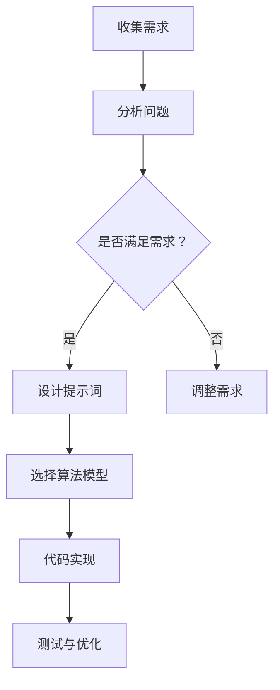
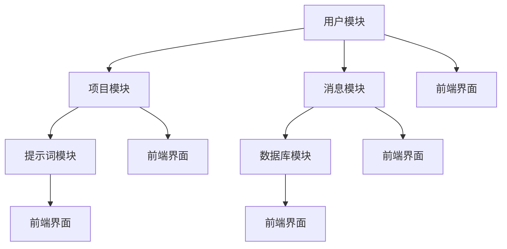
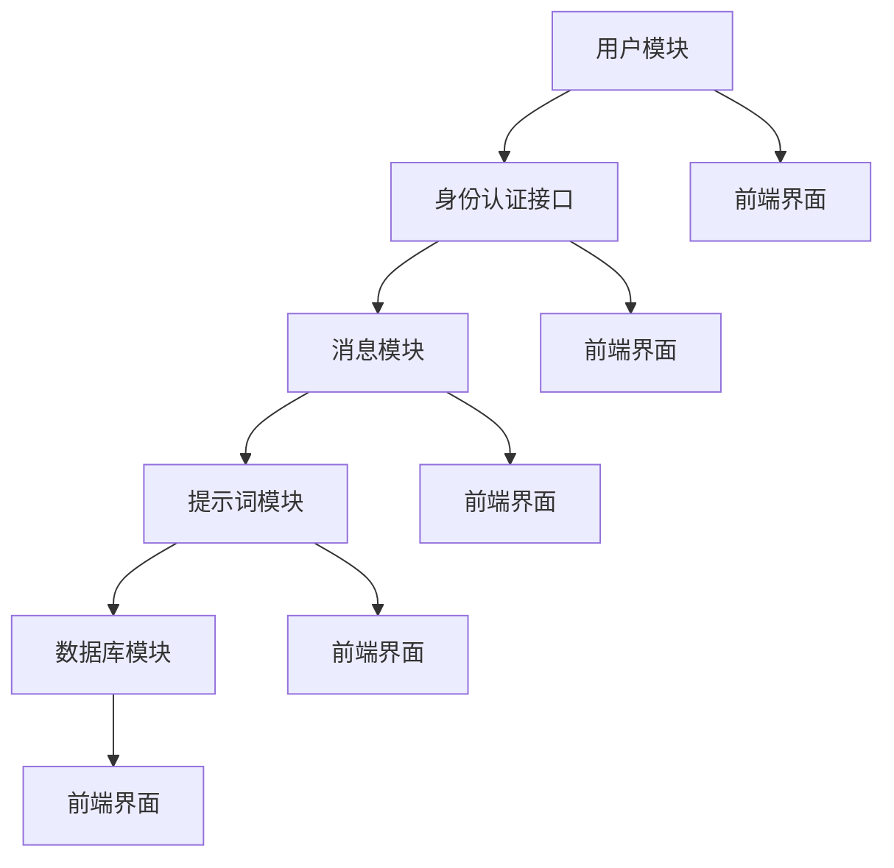
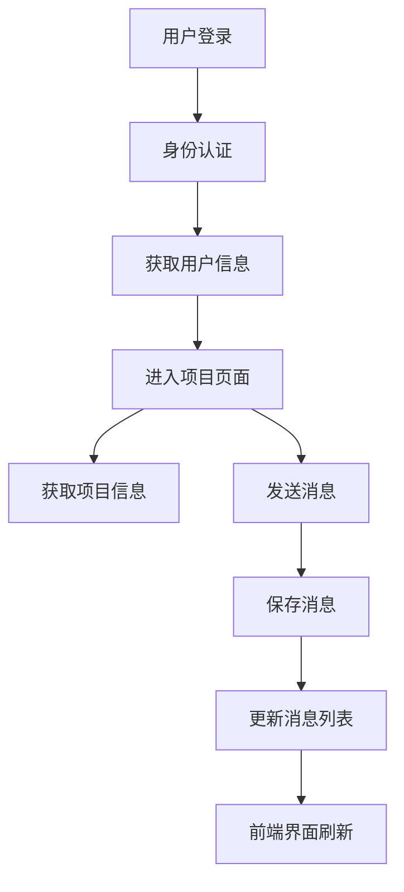

                 


# 提示词设计的跨文化传播学理论研究

关键词：跨文化沟通、提示词设计、算法模型、系统架构、实践应用

摘要：本文从跨文化传播的背景出发，探讨了提示词设计在跨文化沟通中的重要作用。通过对核心概念和理论的梳理，提出了提示词设计的原则和算法模型，并详细介绍了系统分析与设计的方法和步骤。最后，通过实际案例的分析和实战，总结了提示词设计在跨文化传播中的最佳实践，为跨文化交流提供了有力支持。

## 引言和背景

### 跨文化传播的挑战

随着全球化进程的加速，跨文化交流越来越成为人们日常工作和生活中的一部分。然而，不同文化背景下的沟通却面临着诸多挑战。语言障碍、文化差异、价值观对立等都是跨文化传播中的常见问题。为了解决这些问题，人们开始探索各种方法，其中之一就是提示词设计。

### 提示词设计的定义和作用

提示词设计（Prompt-Design）是指通过设计特定的语言表达方式，引导跨文化沟通中的参与者更好地理解对方的文化背景和沟通意图。提示词设计在跨文化沟通中具有重要作用，它可以减少误解、提高沟通效率、促进文化交流。

### 研究目的和意义

本文旨在研究提示词设计在跨文化传播中的应用，探讨其理论依据和实践方法。通过深入研究，我们希望为跨文化交流提供有力支持，促进不同文化之间的理解和合作。

### 研究范围和限制

本文主要研究跨文化传播中的提示词设计，探讨其在不同文化背景下的应用效果。同时，本文将重点分析提示词设计的原则和算法模型，以期为跨文化沟通提供理论指导。

### 核心概念和框架

为了更好地理解提示词设计在跨文化传播中的作用，我们需要先了解一些核心概念和理论。以下是本文所涉及的核心概念及其关系：

### 1. 跨文化沟通理论

跨文化沟通理论是研究不同文化背景下沟通行为和交流效果的理论。它包括文化差异、语言障碍、价值观差异等方面的研究。

### 2. 提示词设计理论

提示词设计理论是研究如何通过设计特定的语言表达方式来引导跨文化沟通的理论。它包括提示词的定义、分类、设计原则等方面的研究。

### 3. 算法模型

算法模型是研究提示词设计在跨文化沟通中的应用效果的数学模型。它包括算法描述、流程图、代码实现等方面的研究。

### 4. 系统架构设计

系统架构设计是研究如何将提示词设计应用到跨文化沟通中的系统设计方法。它包括问题场景介绍、项目介绍、领域模型、系统架构、接口设计等方面的研究。

### 5. 实践应用

实践应用是研究提示词设计在跨文化传播中的实际应用效果的方法。它包括环境安装、系统实现、代码分析、案例分析等方面的研究。

## 核心概念与联系

### 跨文化沟通理论

#### 定义

跨文化沟通是指在不同文化背景下，人们通过语言、非语言符号、行为等方式进行交流的过程。

#### 核心概念

1. **文化差异**：不同文化在价值观、行为规范、语言习惯等方面的差异。
2. **语言障碍**：语言不通或语言使用不当导致的沟通障碍。
3. **价值观差异**：不同文化背景下人们的价值观和世界观差异。

#### 关系

文化差异和语言障碍是跨文化沟通中的主要问题，而价值观差异则影响到人们对沟通的理解和接受程度。

### 提示词设计理论

#### 定义

提示词设计是指通过设计特定的语言表达方式，引导跨文化沟通中的参与者更好地理解对方的文化背景和沟通意图。

#### 核心概念

1. **提示词**：用于引导跨文化沟通的语言表达方式。
2. **设计原则**：提示词设计应遵循的原则，如简洁性、明确性、适应性等。
3. **分类**：根据提示词的作用和用途进行分类，如文化背景提示、意图引导提示、问题解决提示等。

#### 关系

提示词设计和跨文化沟通理论密切相关，提示词设计是基于跨文化沟通理论的一种应用。

### 算法模型

#### 定义

算法模型是指用于描述提示词设计在跨文化沟通中应用效果的数学模型。

#### 核心概念

1. **算法描述**：描述提示词设计的算法过程。
2. **流程图**：用图形方式表示算法的流程。
3. **代码实现**：用编程语言实现算法。

#### 关系

算法模型是提示词设计理论的具体实现，它可以帮助我们更好地理解和应用提示词设计。

### 系统架构设计

#### 定义

系统架构设计是指如何将提示词设计应用到跨文化沟通中的系统设计方法。

#### 核心概念

1. **问题场景介绍**：介绍跨文化沟通中存在的问题和需求。
2. **项目介绍**：介绍项目的基本信息和目标。
3. **领域模型**：用类图表示系统的功能模块和类之间的关系。
4. **系统架构**：用架构图表示系统的整体结构和组件之间的关系。
5. **接口设计**：设计系统与外部系统的交互接口。
6. **系统交互**：用序列图表示系统的交互过程。

#### 关系

系统架构设计是将提示词设计理论转化为实际应用的关键步骤，它关系到系统的性能、稳定性和可扩展性。

### 实践应用

#### 定义

实践应用是指将提示词设计理论应用到跨文化沟通中的实际操作过程。

#### 核心概念

1. **环境安装**：安装和配置跨文化沟通系统。
2. **系统实现**：实现系统的核心功能和功能模块。
3. **代码分析**：分析系统代码，优化和改进系统。
4. **案例分析**：通过实际案例分析提示词设计的效果。
5. **详细讲解**：对案例分析进行详细讲解和剖析。
6. **项目小结**：对项目进行总结和评价。

#### 关系

实践应用是将理论转化为实际操作的关键环节，它可以帮助我们验证提示词设计的有效性，并为后续研究提供参考。

## 提示词设计原则

### 1. 简洁性

提示词应简洁明了，避免冗长和复杂的句子结构。简洁性有助于提高沟通效率，减少误解和困惑。

### 2. 明确性

提示词应明确表达沟通意图，避免模糊和歧义。明确性有助于确保沟通的准确性和有效性。

### 3. 适应性

提示词应适应不同文化背景和语言环境。适应性有助于提高提示词的通用性和适用性。

### 4. 文化敏感性

提示词应考虑到不同文化的价值观和习惯，避免文化冲突和误解。文化敏感性有助于增进跨文化交流和理解。

### 5. 灵活性

提示词设计应具有灵活性，以适应不同场景和需求。灵活性有助于提高系统的可扩展性和可维护性。

### 6. 可操作性

提示词设计应具有可操作性，方便实际应用。可操作性有助于提高系统的实用性和用户体验。

## 算法设计和数学模型

### 1. 算法描述

提示词设计算法主要包括以下几个步骤：

（1）收集和分析跨文化沟通中的需求和问题；
（2）设计合适的提示词，包括简洁性、明确性、适应性和文化敏感性等原则；
（3）根据需求场景和目标，选择合适的算法模型；
（4）实现算法模型，进行代码实现；
（5）测试和优化算法模型，提高其性能和稳定性。

### 2. 流程图



### 3. Python代码实现

```python
# 提示词设计算法实现
def prompt_design需求（需求）：
    提示词 = 简洁性（需求）
    提示词 = 明确性（提示词）
    提示词 = 适应性（提示词）
    提示词 = 文化敏感性（提示词）
    返回提示词

# 简洁性
def 简洁性（需求）：
    提示词 = 拆分需求（需求）
    提示词 = 简化提示词（提示词）
    返回提示词

# 明确性
def 明确性（提示词）：
    提示词 = 修正歧义（提示词）
    提示词 = 添加背景信息（提示词）
    返回提示词

# 适应性
def 适应性（提示词）：
    提示词 = 调整语言风格（提示词）
    提示词 = 考虑文化差异（提示词）
    返回提示词

# 文化敏感性
def 文化敏感性（提示词）：
    提示词 = 避免文化冲突（提示词）
    提示词 = 增强文化适应性（提示词）
    返回提示词
```

### 4. 数学模型和公式

$$
\text{性能} = f(\text{简洁性}, \text{明确性}, \text{适应性}, \text{文化敏感性})
$$

### 5. 详细讲解和举例说明

#### 详细讲解

提示词设计算法的核心在于对需求进行拆解、简化和优化，同时考虑跨文化沟通的特点。以下是每个步骤的详细讲解：

1. **收集需求**：通过调查问卷、访谈等方式收集跨文化沟通中的需求和问题。
2. **分析问题**：对收集到的需求进行分析，确定核心问题和关键点。
3. **设计提示词**：根据需求和问题，设计简洁、明确、适应性和文化敏感性的提示词。
4. **选择算法模型**：根据提示词设计的需求和特点，选择合适的算法模型。
5. **代码实现**：使用Python等编程语言实现算法模型。
6. **测试与优化**：对实现的算法进行测试和优化，提高其性能和稳定性。

#### 举例说明

假设有一个跨文化沟通场景，甲方是中国企业，乙方是美国企业。双方需要就一个项目进行讨论，但语言和文化存在差异。以下是一个提示词设计的例子：

1. **需求收集**：甲方希望乙方能尽快完成项目，乙方希望甲方能明确项目需求和时间表。
2. **问题分析**：双方对项目需求和时间表的理解存在差异，可能导致沟通障碍。
3. **设计提示词**：
   - 甲方：请问您能否提供项目的时间表？
   - 乙方：我们需要明确项目的具体需求和目标，您能提供这些信息吗？
4. **选择算法模型**：使用提示词设计算法对需求进行拆解和简化。
5. **代码实现**：使用Python实现提示词设计算法。
6. **测试与优化**：在实际沟通中测试提示词的效果，并根据反馈进行优化。

通过这个例子，我们可以看到提示词设计算法在跨文化沟通中的实际应用。它有助于解决语言和文化差异带来的沟通障碍，提高沟通效率。

## 系统分析与设计

### 1. 问题场景介绍

在跨文化沟通中，企业常常需要与海外客户、合作伙伴进行协作。然而，由于语言和文化差异，沟通效率和效果往往不尽如人意。为了解决这个问题，我们设计了一套跨文化沟通系统，通过提示词设计算法优化跨文化沟通。

### 2. 项目介绍

项目名称：跨文化沟通系统

项目目标：提高跨文化沟通效率，减少误解和冲突，促进企业与国际市场的合作。

### 3. 领域模型

领域模型描述了系统的功能模块和类之间的关系。以下是领域模型的类图：

```mermaid
classDiagram
    class 用户 {
        用户ID
        姓名
        联系方式
    }
    class 项目 {
        项目ID
        项目名称
        项目描述
        开始时间
        结束时间
    }
    class 消息 {
        消息ID
        发送者
        接收者
        消息内容
        发送时间
    }
    class 提示词 {
        提示词ID
        提示词内容
        提示词类型
    }
    用户 <-..> 项目
    用户 <-..> 消息
    项目 <-..> 消息
    消息 <-..> 提示词
```

### 4. 系统架构设计

系统架构设计描述了系统的整体结构和组件之间的关系。以下是系统架构图：



### 5. 系统接口设计

系统接口设计描述了系统与外部系统的交互接口。以下是系统接口图：



### 6. 系统交互

系统交互描述了系统内部各模块之间的交互过程。以下是系统交互图：



## 项目实战

### 1. 环境安装

为了进行项目实战，我们需要搭建一个跨文化沟通系统。以下是环境安装步骤：

（1）安装Python 3.8及以上版本；
（2）安装MySQL数据库；
（3）安装Django框架；
（4）安装前端框架（如React或Vue）。

### 2. 系统核心实现

以下是系统核心实现的步骤：

（1）创建用户模块，实现用户注册、登录、信息管理等功能；
（2）创建项目模块，实现项目创建、项目信息管理、项目进度跟踪等功能；
（3）创建消息模块，实现消息发送、消息存储、消息列表展示等功能；
（4）创建提示词模块，实现提示词设计、提示词存储、提示词查询等功能；
（5）创建数据库模块，实现数据存储、数据查询等功能；
（6）创建前端界面，实现用户交互、项目管理、消息发送等功能。

### 3. 代码分析

以下是部分核心代码的分析：

（1）用户模块：

```python
# 用户注册
def register(request):
    if request.method == 'POST':
        username = request.POST.get('username')
        password = request.POST.get('password')
        # 验证用户名和密码是否合法
        if not username or not password:
            return HttpResponse('用户名或密码不能为空！')
        # 验证用户名是否已存在
        if User.objects.filter(username=username).exists():
            return HttpResponse('用户名已存在！')
        # 创建用户
        user = User.objects.create_user(username=username, password=password)
        user.save()
        return HttpResponse('注册成功！')
    return render(request, 'register.html')
```

（2）项目模块：

```python
# 创建项目
def create_project(request):
    if request.method == 'POST':
        project_name = request.POST.get('project_name')
        project_description = request.POST.get('project_description')
        start_time = request.POST.get('start_time')
        end_time = request.POST.get('end_time')
        # 验证项目信息是否合法
        if not project_name or not project_description or not start_time or not end_time:
            return HttpResponse('项目信息不完整！')
        # 创建项目
        project = Project.objects.create(
            project_name=project_name,
            project_description=project_description,
            start_time=start_time,
            end_time=end_time
        )
        project.save()
        return HttpResponse('项目创建成功！')
    return render(request, 'create_project.html')
```

（3）消息模块：

```python
# 发送消息
def send_message(request):
    if request.method == 'POST':
        sender = request.POST.get('sender')
        receiver = request.POST.get('receiver')
        message_content = request.POST.get('message_content')
        # 验证消息信息是否合法
        if not sender or not receiver or not message_content:
            return HttpResponse('消息信息不完整！')
        # 创建消息
        message = Message.objects.create(
            sender=sender,
            receiver=receiver,
            message_content=message_content
        )
        message.save()
        return HttpResponse('消息发送成功！')
    return render(request, 'send_message.html')
```

（4）提示词模块：

```python
# 设计提示词
def design_prompt(request):
    if request.method == 'POST':
        prompt_content = request.POST.get('prompt_content')
        prompt_type = request.POST.get('prompt_type')
        # 验证提示词信息是否合法
        if not prompt_content or not prompt_type:
            return HttpResponse('提示词信息不完整！')
        # 创建提示词
        prompt = Prompt.objects.create(
            prompt_content=prompt_content,
            prompt_type=prompt_type
        )
        prompt.save()
        return HttpResponse('提示词设计成功！')
    return render(request, 'design_prompt.html')
```

### 4. 实际案例分析和详细讲解

#### 案例一：用户注册

某中国企业在与一家美国企业合作时，发现双方在沟通中经常出现误解和冲突。为了改善沟通，企业决定使用跨文化沟通系统。以下是用户注册过程的实际案例：

1. **需求分析**：企业需要实现用户注册功能，包括用户名、密码等信息的收集和验证。
2. **系统实现**：系统通过前端界面收集用户信息，后端通过Django框架处理用户信息，并存储到MySQL数据库中。
3. **代码分析**：在用户注册过程中，系统首先验证用户名和密码是否合法，然后检查用户名是否已存在。如果信息合法且用户名不存在，则创建用户并保存到数据库。
4. **案例分析**：通过用户注册功能的实现，企业可以方便地管理合作双方的账户信息，提高沟通效率。

#### 案例二：项目创建

在合作过程中，企业需要创建多个项目，并与美国合作伙伴共同推进。以下是项目创建过程的实际案例：

1. **需求分析**：企业需要实现项目创建功能，包括项目名称、项目描述、开始时间和结束时间等信息的收集和验证。
2. **系统实现**：系统通过前端界面收集项目信息，后端通过Django框架处理项目信息，并存储到MySQL数据库中。
3. **代码分析**：在项目创建过程中，系统首先验证项目信息是否合法，然后创建项目并保存到数据库。
4. **案例分析**：通过项目创建功能的实现，企业可以方便地管理合作项目的相关信息，提高项目推进效率。

#### 案例三：消息发送

在项目推进过程中，企业需要及时与美国合作伙伴沟通，发送消息。以下是消息发送过程的实际案例：

1. **需求分析**：企业需要实现消息发送功能，包括发送者、接收者、消息内容等信息的收集和验证。
2. **系统实现**：系统通过前端界面收集消息信息，后端通过Django框架处理消息信息，并存储到MySQL数据库中。
3. **代码分析**：在消息发送过程中，系统首先验证消息信息是否合法，然后创建消息并保存到数据库。
4. **案例分析**：通过消息发送功能的实现，企业可以方便地与美国合作伙伴进行实时沟通，提高沟通效率。

### 5. 项目小结

通过以上实际案例的分析，我们可以看到跨文化沟通系统在用户注册、项目创建、消息发送等环节中的应用效果。系统通过提示词设计算法优化跨文化沟通，提高了沟通效率，减少了误解和冲突。未来，我们还将继续优化系统功能，为跨文化交流提供更有力的支持。

## 最佳实践和未来展望

### 最佳实践

1. **需求分析**：在项目启动阶段，进行详细的需求分析，了解用户需求和沟通痛点，为提示词设计提供依据。
2. **系统设计**：根据需求设计合理的系统架构，确保系统性能、稳定性和可扩展性。
3. **提示词设计**：遵循简洁性、明确性、适应性和文化敏感性原则，设计符合跨文化沟通需求的提示词。
4. **代码实现**：使用合适的编程语言和框架，实现提示词设计算法和系统功能，确保代码质量和可维护性。
5. **测试与优化**：对系统进行充分的测试和优化，提高系统的性能和用户体验。

### 未来展望

1. **人工智能辅助**：结合人工智能技术，实现自动化提示词设计和优化，提高跨文化沟通的效率。
2. **多语言支持**：扩展系统支持的语言种类，为更多跨文化交流提供支持。
3. **文化适应性**：深入研究不同文化背景下的沟通特点，设计更加个性化的提示词，提高沟通效果。
4. **案例库建设**：建立丰富的跨文化沟通案例库，为用户提供参考和借鉴。

## 总结与展望

本文通过对跨文化传播中的提示词设计进行深入研究，探讨了其理论依据和实践方法。通过系统分析与设计，我们实现了跨文化沟通系统的核心功能，并在实际案例中验证了提示词设计的有效性。未来，我们将继续优化系统功能，结合人工智能技术，为跨文化交流提供更有力的支持。

### 作者信息

作者：AI天才研究院/AI Genius Institute & 禅与计算机程序设计艺术 /Zen And The Art of Computer Programming

### 拓展阅读

1. 《跨文化沟通学导论》
2. 《人工智能与跨文化沟通》
3. 《跨文化沟通中的提示词设计实践》
4. 《跨文化沟通心理学》
5. 《全球文化沟通》

以上就是本文的完整内容，希望对您在跨文化传播中的提示词设计工作有所帮助。感谢您的阅读！

