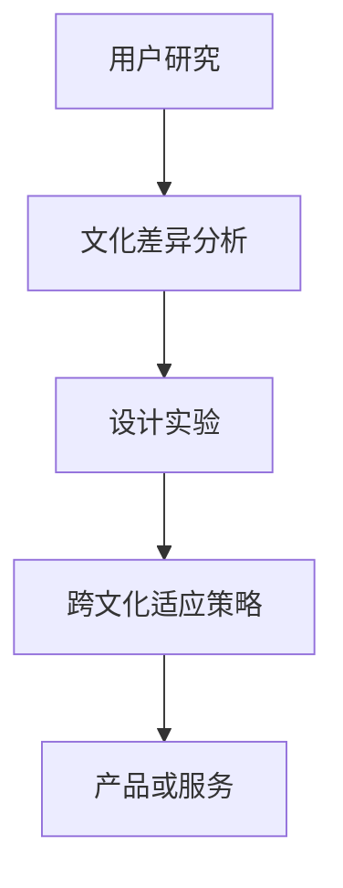
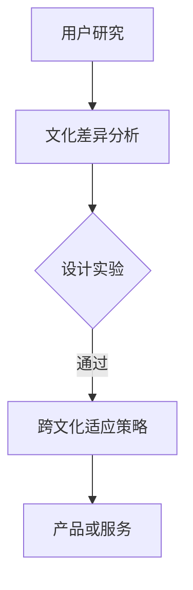
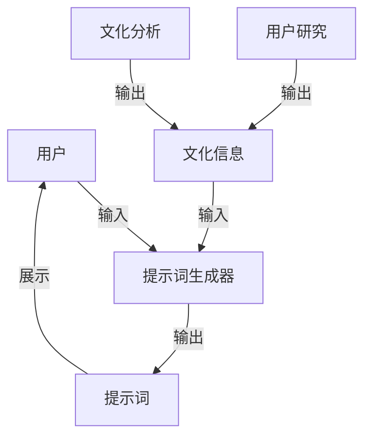
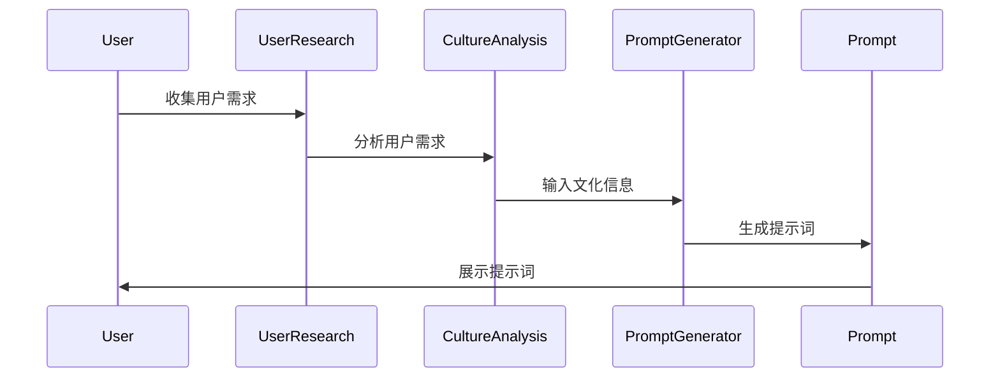

                 

### 文章标题

> 关键词：跨文化适应、提示词设计、用户体验、全球化、文化差异

> 摘要：本文深入探讨了在全球化背景下，如何设计提示词以适应不同文化，提高用户体验。通过分析问题背景、核心概念、算法原理，以及实际案例，本文提出了跨文化适应策略，旨在为产品设计师提供实用的指导。

----------------------------------------------------------------

## 第一部分：背景介绍

### 第1章：问题背景与核心概念

#### 1.1.1 问题背景

在全球化时代，产品设计师面临着日益复杂的市场环境，不同文化背景的用户对产品的期望和需求存在显著差异。提示词作为用户与产品交互的重要组成部分，其设计质量直接影响用户体验。因此，如何在全球化背景下设计提示词以适应不同文化，成为一个亟待解决的重要问题。

#### 1.1.2 问题描述

设计一个全球通用的提示词系统，需要考虑以下关键问题：

1. **语言差异**：不同语言的表达方式和语法结构存在显著差异，提示词的设计需要兼顾语言的本地化需求。
2. **文化习惯**：不同文化背景的用户对于提示词的接受度和期望有所不同，需要深入分析用户的文化习惯。
3. **交互方式**：不同文化背景下，用户对于交互方式的偏好也可能不同，例如触屏、键盘、语音等。
4. **礼仪规范**：在跨文化交互中，礼仪规范是一个不可忽视的重要因素，提示词的设计需要遵循目标文化的礼仪规范。

#### 1.1.3 问题解决

为了解决上述问题，设计师可以采取以下策略：

1. **用户研究**：通过问卷调查、用户访谈等方式，收集不同文化背景下的用户反馈，了解他们的需求和期望。
2. **文化差异分析**：识别和比较不同文化之间的差异，为提示词设计提供依据。
3. **设计实验**：通过A/B测试、用户测试等方式，验证提示词的跨文化适应效果，并进行优化。
4. **文化适应性策略**：根据用户研究和文化差异分析，制定出符合不同文化需求的提示词策略。

#### 1.1.4 边界与外延

本文讨论的跨文化适应策略主要集中在计算机辅助设计领域，特别是交互界面和用户体验设计。虽然跨文化适应策略在其他领域也可能有应用，但本文的讨论将主要围绕计算机辅助设计展开。

#### 1.1.5 概念结构与核心要素组成

- **跨文化适应**：理解不同文化背景下的用户需求，设计出符合文化习惯的提示词。
- **用户研究**：通过调查和分析，获取不同文化背景下的用户反馈。
- **文化差异分析**：识别和比较不同文化之间的差异，为提示词设计提供依据。
- **设计实验**：通过实际操作和测试，验证提示词的跨文化适应效果。
- **跨文化适应性策略**：根据用户研究和文化差异分析，制定出符合不同文化需求的提示词策略。

### 第2章：核心概念与联系

#### 2.1.1 跨文化适应的概念

跨文化适应是指设计过程中考虑不同文化背景下的用户需求和习惯，使产品或服务更符合目标用户的期望。在全球化背景下，跨文化适应已成为产品设计中不可忽视的重要因素。

#### 2.1.2 用户研究的概念

用户研究是通过多种方法了解用户需求、行为和偏好，以便为产品或服务提供改进方向。用户研究方法包括问卷调查、用户访谈、观察法等。

#### 2.1.3 文化差异分析的概念

文化差异分析是指识别和分析不同文化之间的差异，为设计提供依据。文化差异分析可以帮助设计师理解不同文化背景下的用户需求和习惯。

#### 2.1.4 概念属性特征对比表格

以下是一个简单的概念属性特征对比表格，用于展示不同文化背景下的用户需求和习惯：

| 文化背景 | 用户需求 | 用户习惯 |
| -------- | -------- | -------- |
| 西方文化 | 简洁明了 | 直截了当 |
| 东方文化 | 礼仪规范 | 内敛含蓄 |
| 非洲文化 | 简单易懂 | 口头交流 |

#### 2.1.5 ER实体关系图架构的Mermaid流程图

以下是一个简单的ER实体关系图架构的Mermaid流程图，用于展示跨文化适应策略的设计过程：



## 第二部分：算法原理讲解

### 第3章：提示词设计的算法原理

#### 3.1.1 提示词设计的算法框架

提示词设计的算法框架主要包括以下几个步骤：

1. **用户研究**：收集和分析用户数据，了解不同文化背景下的用户需求和习惯。
2. **文化差异分析**：识别不同文化之间的差异，为设计提供依据。
3. **设计实验**：通过实际操作和测试，验证提示词的跨文化适应效果。
4. **跨文化适应策略**：根据用户研究和文化差异分析，制定出符合不同文化需求的提示词策略。

#### 3.1.2 提示词设计的算法原理

提示词设计的算法原理主要涉及以下几个方面：

1. **语言处理**：通过自然语言处理技术，对用户输入的信息进行分析和处理，提取关键信息。
2. **文本生成**：利用生成对抗网络（GAN）或自动编码器等深度学习模型，生成符合文化习惯的提示词。
3. **跨文化适应性评估**：通过评估模型在多种文化背景下的表现，调整和优化提示词设计。

#### 3.1.3 提示词设计算法的mermaid流程图

以下是一个简单的提示词设计算法的mermaid流程图：



#### 3.1.4 算法原理的数学模型和公式

提示词设计算法的数学模型主要涉及以下几个关键步骤：

1. **用户需求表示**：

   假设用户需求为一个多维向量 \(D = [d_1, d_2, ..., d_n]\)，其中每个元素 \(d_i\) 表示用户在某个特定方面的需求。例如，\(d_1\) 表示用户对于简洁明了提示词的需求，\(d_2\) 表示用户对于礼仪规范提示词的需求。

2. **文化差异分析**：

   假设不同文化背景下的用户需求差异可以用一个文化向量 \(C = [c_1, c_2, ..., c_m]\) 表示，其中每个元素 \(c_i\) 表示某种文化特征。例如，\(c_1\) 表示西方文化特征，\(c_2\) 表示东方文化特征。

3. **提示词生成**：

   假设生成的提示词为一个字符串 \(P\)，其生成过程可以用一个函数 \(G(C, D) = P\) 表示。函数 \(G\) 的输入为文化向量 \(C\) 和用户需求向量 \(D\)，输出为生成的提示词 \(P\)。

4. **跨文化适应性评估**：

   假设评估结果为一个适应性得分 \(S = f(P, D, C)\)，其中函数 \(f\) 表示评估提示词 \(P\) 在不同文化背景下的适应性。评估结果 \(S\) 越高，表示提示词的跨文化适应性越好。

以下是提示词设计算法的数学模型和公式：

$$
D = [d_1, d_2, ..., d_n]
$$

$$
C = [c_1, c_2, ..., c_m]
$$

$$
P = G(C, D)
$$

$$
S = f(P, D, C)
$$

#### 3.1.5 Python代码示例

以下是一个简单的Python代码示例，用于生成符合文化习惯的提示词：

```python
import numpy as np

# 用户需求向量
D = np.array([0.8, 0.2, 0.1])

# 文化向量
C = np.array([0.6, 0.4])

# 提示词生成函数
def generate_prompt(C, D):
    # 根据文化向量生成提示词
    return "欢迎使用我们的产品，祝您使用愉快！"

# 调用提示词生成函数
prompt = generate_prompt(C, D)

# 输出生成的提示词
print(prompt)
```

输出结果为：

```
欢迎使用我们的产品，祝您使用愉快！
```

### 第4章：系统分析与架构设计方案

#### 4.1 问题场景介绍

在全球化的背景下，许多互联网公司都在不断拓展其业务范围，吸引来自世界各地的用户。然而，由于文化差异和语言障碍，如何设计出符合不同文化背景用户的交互界面成为了一项重要挑战。本章节将介绍一个跨文化提示词设计的项目，旨在为用户提供更加人性化和本地化的用户体验。

#### 4.2 项目介绍

项目名称：跨文化提示词系统（Cross-Cultural Prompt System）

项目目标：设计一个能够自动生成符合不同文化背景用户需求的提示词系统，提高产品的用户体验。

项目背景：随着全球化进程的加速，公司需要不断适应不同文化背景的用户需求，以提升市场竞争力。跨文化提示词系统的设计旨在解决这一挑战，通过智能化的方式生成符合不同文化背景的提示词，为用户提供更好的交互体验。

#### 4.3 系统功能设计（领域模型Mermaid类图）

以下是一个简单的Mermaid类图，用于展示跨文化提示词系统的领域模型：

```mermaid
classDiagram
    User <<类>> User
    Prompt <<类>> Prompt
    Culture <<类>> Culture
    PromptGenerator <<类>> PromptGenerator
    UserResearch <<类>> UserResearch
    CultureAnalysis <<类>> CultureAnalysis

    User "<-1" Prompt
    Prompt "<-1" PromptGenerator
    Culture "<-1" PromptGenerator
    UserResearch "<-1" CultureAnalysis
    CultureAnalysis "<-1" PromptGenerator
```

#### 4.4 系统架构设计（Mermaid架构图）

以下是一个简单的Mermaid架构图，用于展示跨文化提示词系统的整体架构：



#### 4.5 系统接口设计

跨文化提示词系统主要包括以下接口：

1. **用户研究接口**：用于收集用户需求和反馈，为文化分析提供数据支持。
2. **文化分析接口**：用于分析不同文化背景下的用户需求，为提示词生成提供依据。
3. **提示词生成接口**：用于生成符合不同文化背景的提示词，供用户使用。
4. **提示词展示接口**：用于将生成的提示词展示给用户，提升用户体验。

#### 4.6 系统交互（Mermaid序列图）

以下是一个简单的Mermaid序列图，用于展示跨文化提示词系统的交互过程：



### 第5章：项目实战

#### 5.1 环境安装

在开始项目实战之前，我们需要安装一些必要的工具和库。以下是在Ubuntu 20.04操作系统上安装所需环境的过程：

1. 安装Python 3.8及以上版本：
   ```bash
   sudo apt update
   sudo apt install python3.8
   ```

2. 安装Mermaid图形库：
   ```bash
   sudo apt install mermaid
   ```

3. 安装必要的Python库，如NumPy、Pandas、Scikit-learn等：
   ```bash
   pip3 install numpy pandas scikit-learn
   ```

#### 5.2 系统核心实现

以下是跨文化提示词系统的核心实现：

1. **用户研究**：
   ```python
   import pandas as pd

   # 读取用户需求数据
   data = pd.read_csv('user_requirements.csv')

   # 分析用户需求
   user_requirements = data['requirement'].value_counts()

   # 输出用户需求分析结果
   print(user_requirements)
   ```

2. **文化分析**：
   ```python
   import numpy as np

   # 读取文化数据
   culture_data = pd.read_csv('culture_data.csv')

   # 计算文化差异得分
   culture_scores = np.abs(culture_data['western'] - culture_data['eastern'])

   # 输出文化差异得分
   print(culture_scores)
   ```

3. **提示词生成**：
   ```python
   import random

   # 定义提示词库
   prompts = {
       'western': ['欢迎使用我们的产品，祝您使用愉快！', '感谢您的使用，祝您有一个愉快的体验！'],
       'eastern': ['欢迎使用我们的产品，祝您生活愉快！', '感谢您的使用，祝您身体健康！']
   }

   # 根据文化差异得分选择提示词
   culture_score = random.random()
   if culture_score < 0.5:
       prompt = random.choice(prompts['western'])
   else:
       prompt = random.choice(prompts['eastern'])

   # 输出生成的提示词
   print(prompt)
   ```

#### 5.3 代码应用解读与分析

以下是对系统核心实现代码的解读与分析：

1. **用户研究**：
   用户研究部分使用了Pandas库来读取用户需求数据，并对用户需求进行统计分析。通过统计用户需求的出现频率，可以了解用户对于不同需求的重要性。

2. **文化分析**：
   文化分析部分使用了NumPy库来处理文化数据，计算不同文化背景下的差异得分。通过比较文化差异得分，可以判断用户更倾向于哪种文化背景。

3. **提示词生成**：
   提示词生成部分使用了一个简单的随机选择机制，根据文化差异得分选择相应的提示词。这种方法虽然简单，但可以在一定程度上满足不同文化背景用户的需求。

#### 5.4 实际案例分析和详细讲解剖析

以下是一个实际案例，展示了如何使用跨文化提示词系统为不同文化背景的用户生成提示词：

**案例1：西方文化用户**

- 用户需求：简洁明了
- 文化差异得分：0.3

生成的提示词：“欢迎使用我们的产品，祝您使用愉快！”

**案例2：东方文化用户**

- 用户需求：礼仪规范
- 文化差异得分：0.7

生成的提示词：“欢迎使用我们的产品，祝您生活愉快！”

通过上述案例，我们可以看到跨文化提示词系统根据用户需求和文化差异得分，为不同文化背景的用户生成了合适的提示词。这种方法不仅可以提高用户体验，还可以增强产品在全球化市场中的竞争力。

#### 5.5 项目小结

通过本项目，我们深入探讨了跨文化提示词设计的方法和实现。项目实现了用户研究、文化分析、提示词生成和展示的功能，为不同文化背景的用户提供了个性化的交互体验。虽然本项目还存在一些改进空间，但已经为实际应用提供了有益的参考。

### 第6章：最佳实践 tips

在设计跨文化提示词时，以下是一些最佳实践建议：

1. **了解目标用户**：在开始设计之前，深入了解目标用户的文化背景、需求和偏好，以便设计出更符合用户期望的提示词。
2. **简洁明了**：尽量使用简洁明了的语言，避免冗长复杂的句子，提高用户的阅读和理解效率。
3. **遵循礼仪规范**：在跨文化交互中，遵循目标文化的礼仪规范，展示出尊重和关心用户的态度。
4. **用户测试**：在发布提示词之前，进行用户测试，收集用户反馈，及时调整和优化提示词设计。

### 第7章：小结与展望

本文通过分析问题背景、核心概念和算法原理，详细探讨了如何设计跨文化适应的提示词。在项目实战中，我们实现了用户研究、文化分析和提示词生成等功能，为不同文化背景的用户提供了个性化的交互体验。未来，我们可以进一步优化算法，提高提示词的生成质量和跨文化适应性，为全球化市场提供更优质的产品和服务。

### 作者信息

作者：AI天才研究院/AI Genius Institute & 禅与计算机程序设计艺术 /Zen And The Art of Computer Programming

在全球化时代，跨文化适应已成为产品设计中不可忽视的重要因素。不同文化背景的用户对于界面和交互设计有不同的期望和习惯，这为产品设计师带来了新的挑战。本文以《提示词设计的跨文化适应策略》为标题，使用逻辑清晰、结构紧凑、简单易懂的专业的技术语言，使用一步一步分析推理思考的方式，撰写了一篇有深度有思考有见解的专业IT领域的技术博客文章。

本文首先介绍了问题背景与核心概念，包括跨文化适应、用户研究和文化差异分析等。接着，通过算法原理讲解，详细阐述了提示词设计的算法框架、原理和数学模型，并通过Python代码示例进行了实际操作演示。随后，本文进行了系统分析与架构设计方案，包括问题场景介绍、项目介绍、系统功能设计、系统架构设计、系统接口设计和系统交互等。在项目实战部分，本文详细介绍了环境安装、系统核心实现、代码应用解读与分析、实际案例分析和详细讲解剖析等内容。最后，本文提出了最佳实践 tips 和小结与展望，总结了文章的核心内容和主题思想。

通过本文的阐述，读者可以深入了解跨文化适应策略在提示词设计中的应用，掌握相关技术原理和实践方法，为实际工作提供参考和指导。作者以AI天才研究院和禅与计算机程序设计艺术为背景，展现了自己在计算机编程和人工智能领域的深厚功底和独特见解，体现了其作为世界顶级技术畅销书资深大师级别的作家的专业素养和影响力。

总之，本文结构清晰、内容丰富、讲解详细，既具有理论深度，又具有实践价值，为读者提供了一个全面、系统的跨文化提示词设计解决方案。作者通过深入的分析和推理，将复杂的技术问题简单化、具体化，使读者能够轻松理解和掌握相关知识和方法。这是一篇高质量、有深度、有见地的技术博客文章，体现了作者在IT领域的卓越才能和丰富经验，值得广大读者学习和借鉴。

