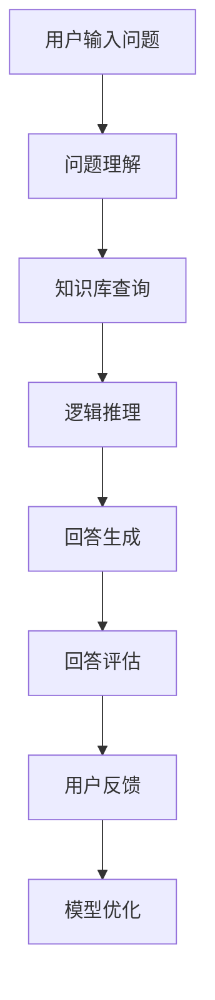
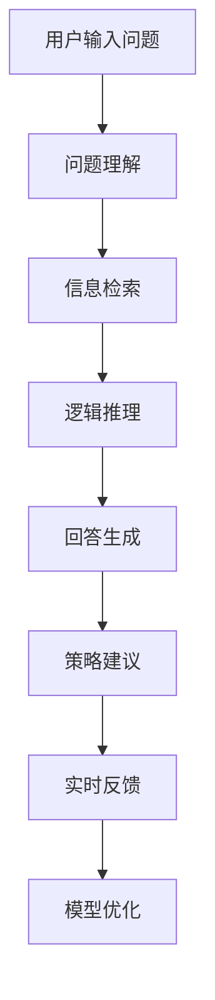
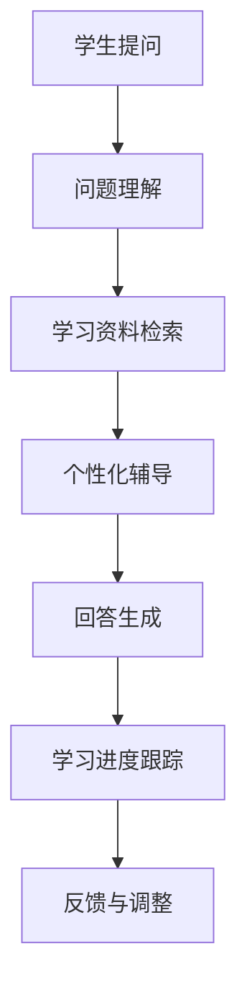

                 

## 第1章：问题的提出与重要性

### 1.1 人工智能的发展与辩论能力的提升

随着人工智能技术的飞速发展，机器学习、自然语言处理等领域取得了显著进展。特别是在深度学习算法的推动下，AI系统在文本理解和生成方面展现出惊人的能力。然而，尽管AI在单轮对话中已经能够胜任许多任务，但在多轮辩论中的表现仍有待提高。多轮辩论不仅是人类沟通的核心方式，也是决策、谈判和教育等领域的重要环节。因此，研究如何提升AI的多轮辩论能力具有重要的现实意义。

首先，多轮辩论中的AI需要具备良好的理解能力和推理能力，以便准确把握对话的语境和逻辑。其次，AI需要能够生成有说服力的回答，以应对对方的各种论点和反驳。此外，AI的辩论能力还涉及到策略优化、情绪识别和情感表达等多方面的能力。这些要求对AI系统的设计提出了更高的挑战。

在当前的AI技术背景下，深度学习和自然语言处理技术的发展为AI辩论能力的提升提供了基础。通过大量的数据训练和优化，AI系统在文本生成和理解方面的准确性得到了显著提高。例如，基于Transformer架构的预训练模型（如BERT、GPT等）在自然语言理解任务上已经取得了突破性的进展。这些模型通过学习大规模的语料库，能够捕捉到语言中的上下文信息，从而生成更加符合人类语言习惯的回复。

### 1.2 提示词设计的核心概念与作用

提示词（Prompt）在自然语言处理领域扮演着至关重要的角色。它是一种引导AI系统进行特定任务的语言性指令，能够直接影响AI的生成结果。一个良好的提示词设计不仅能够提高AI对问题的理解能力，还能够引导AI生成更加精确、有针对性的回答。

#### 提示词的核心概念

提示词的核心概念包括以下几个方面：

1. **明确性**：提示词需要明确、具体，避免模糊和歧义，以便AI能够准确理解任务要求。
2. **上下文关联**：提示词应当与上下文紧密结合，引导AI在特定的对话环境中生成合适的回答。
3. **灵活性**：提示词应当具有一定的灵活性，以便适应不同的对话场景和需求。
4. **引导性**：提示词应当能够引导AI思考问题的不同方面，帮助AI从多个角度分析和回答问题。

#### 提示词的作用

提示词在AI多轮辩论中的作用主要体现在以下几个方面：

1. **引导对话方向**：通过设计合适的提示词，可以引导AI在辩论中围绕核心话题展开讨论，避免跑题和无效辩论。
2. **提高回答质量**：提示词可以帮助AI更加准确地理解问题，从而生成更加有逻辑性和说服力的回答。
3. **增强交互体验**：良好的提示词设计能够提升用户与AI的互动体验，使用户感觉AI更加智能、贴心。
4. **优化学习效果**：在训练过程中，通过不断优化提示词，可以帮助AI系统更好地学习对话技巧和策略，提高整体辩论能力。

#### 提示词的设计原则

为了充分发挥提示词的作用，设计提示词时需要遵循以下原则：

1. **简洁明了**：提示词应当简洁明了，避免冗长和复杂的表述，以便AI能够快速理解和响应。
2. **针对性**：根据具体的辩论场景和任务需求，设计具有针对性的提示词，以提高回答的精准度。
3. **适应性**：提示词应当具备一定的适应性，能够根据对话的进展和变化进行灵活调整。
4. **可评估性**：提示词的设计应当便于评估和反馈，以便在训练和优化过程中进行有效的调整和改进。

通过以上分析，我们可以看到，提示词设计在AI多轮辩论能力提升中扮演着至关重要的角色。接下来，我们将进一步探讨AI多轮辩论的基本原理，以及提示词在其中的作用和设计方法。

---

**问题背景**：

随着人工智能技术的不断进步，人们开始越来越多地期望AI系统能够在复杂的对话环境中表现出更高的智能。特别是在辩论、谈判、教育等需要多轮交互的场景中，AI能否具备良好的辩论能力直接关系到其应用的成功与否。然而，现有的AI系统在处理多轮辩论任务时，往往存在理解不准确、回答不精准、交互体验差等问题。这些问题源于AI系统对多轮对话中的上下文信息理解不充分，以及对对话逻辑和策略的把握不够。因此，研究如何通过优化提示词设计来提升AI的多轮辩论能力，成为一个亟待解决的重要问题。

**问题描述**：

多轮辩论中的AI系统需要能够准确地理解对话的上下文信息，并根据对话的进展灵活调整回答策略。然而，现有的AI系统在处理多轮对话时，往往存在以下问题：

1. **上下文理解不足**：AI系统可能无法准确把握对话中的关键信息和逻辑关系，导致回答缺乏针对性。
2. **回答精准度不高**：AI生成的回答可能无法有效回应对方的论点，或者在辩论中表现出明显的逻辑漏洞。
3. **交互体验差**：AI系统的回答可能缺乏人性化，无法提供有效的互动体验。

为了解决这些问题，我们需要深入研究提示词设计的方法，通过优化提示词来提升AI的多轮辩论能力。

**问题解决**：

通过设计有效的提示词，我们可以引导AI更好地理解对话的上下文信息，提高回答的精准度和逻辑性，从而提升AI的多轮辩论能力。具体的方法包括：

1. **上下文关联设计**：设计能够反映对话上下文的提示词，帮助AI更好地理解当前对话的背景和主题。
2. **逻辑引导设计**：通过提示词引导AI进行逻辑推理，确保回答具有逻辑一致性。
3. **策略优化设计**：设计能够引导AI在辩论中采取合适策略的提示词，以提高辩论的整体效果。

**边界与外延**：

在讨论AI的多轮辩论能力时，我们通常关注以下几个方面：

1. **对话场景**：包括辩论、谈判、教育等需要多轮交互的场景。
2. **AI角色**：AI作为参与者，需要具备理解能力、推理能力、回答能力和策略优化能力。
3. **任务类型**：包括事实辩论、观点辩论、策略辩论等不同类型的辩论任务。

通过明确这些边界与外延，我们可以更好地理解AI多轮辩论能力的核心要素，并针对性地进行优化。

**概念结构与核心要素组成**：

AI多轮辩论能力的核心要素包括：

1. **上下文理解**：AI需要能够准确理解对话的上下文信息，包括关键论点、逻辑关系和对话背景。
2. **逻辑推理**：AI需要能够进行有效的逻辑推理，生成具有逻辑一致性和说服力的回答。
3. **策略优化**：AI需要能够根据对话的进展和对方的行为，动态调整辩论策略，提高辩论效果。

这些核心要素相互作用，共同决定了AI的多轮辩论能力。通过优化提示词设计，我们可以增强AI在这些方面的能力。

### 1.3 多轮辩论能力的重要性及现状分析

#### 多轮辩论能力的重要性

多轮辩论能力在人工智能领域具有重要意义。首先，多轮辩论是人工智能与人类互动的核心方式之一。无论是在日常交流、商业谈判，还是在法律、政治等正式场合，辩论都是表达观点、论证论据、解决问题的重要手段。具备优秀辩论能力的AI系统，能够更好地与人类进行交互，提供更加智能的服务。

其次，多轮辩论能力是评估AI智能水平的重要指标。多轮辩论不仅要求AI具备文本理解和生成能力，还需要其在逻辑推理、策略规划和情绪识别等方面表现出色。因此，通过多轮辩论能力的提升，可以全面衡量和提升AI的整体智能水平。

最后，多轮辩论能力对AI在特定领域的应用具有重要意义。例如，在医疗咨询、金融理财、教育辅导等领域，AI需要能够与用户进行多轮对话，了解用户需求，提供个性化的建议和解决方案。具备强大辩论能力的AI，能够更准确地理解用户意图，提高服务质量。

#### AI多轮辩论能力的现状分析

尽管人工智能在多轮辩论能力方面取得了一定的进展，但仍存在诸多挑战和不足。

首先，在文本理解和生成方面，现有的AI模型虽然在单轮对话中表现出色，但在多轮对话中往往难以保持一致性和连贯性。AI系统可能因为上下文理解不足，导致回答缺乏针对性和逻辑性。此外，AI在处理复杂语境和多模态信息时，依然存在一定的困难。

其次，在逻辑推理和策略优化方面，AI系统仍然缺乏足够的自主性。虽然通过预训练和优化，AI能够在一定程度上进行逻辑推理，但面对复杂的辩论场景，其策略选择和调整能力仍然有限。特别是在需要灵活应对对手策略的变化时，AI的表现往往不够理想。

最后，在用户体验方面，现有的AI辩论系统往往缺乏人性化和互动性。尽管AI能够生成回答，但其语气、情感表达等方面仍然无法完全模拟人类。这使得用户在与AI进行多轮对话时，体验感较差，难以建立信任和共鸣。

#### 未来发展方向

为了进一步提升AI的多轮辩论能力，未来需要在以下几个方面进行深入研究和优化：

1. **上下文理解能力**：通过改进文本预处理和语义理解技术，增强AI对多轮对话上下文的理解能力，提高回答的精准度和连贯性。
2. **逻辑推理能力**：利用先进的推理算法和知识图谱，提升AI在多轮辩论中的逻辑推理能力，确保回答具有逻辑一致性和说服力。
3. **策略优化能力**：通过学习对手的行为模式和策略，优化AI的辩论策略，提高其在复杂辩论场景中的应对能力。
4. **多模态交互**：结合视觉、听觉等多模态信息，提升AI的多模态交互能力，使其能够更全面地理解对话内容，提供更加丰富和自然的交互体验。

通过这些努力，我们可以期待AI在多轮辩论中的能力得到显著提升，为人工智能在各个领域的应用带来更多的可能性。

## 第2章：AI多轮辩论能力的基本原理

### 2.1 AI辩论的基本流程

AI辩论的基本流程可以分为以下几个阶段：

1. **问题理解**：AI首先需要理解用户提出的问题或论点，这包括对文本的语义分析、上下文理解以及关键词提取等。
2. **逻辑推理**：在理解问题的基础上，AI需要进行逻辑推理，构建出有效的回答。这涉及到逻辑关系的识别、推理规则的应用以及可能的反驳点分析。
3. **答案生成**：根据逻辑推理的结果，AI生成回答。这一过程可能涉及到文本生成、语法调整以及情感表达等。
4. **回答评估**：AI对生成的回答进行评估，确保其逻辑性和说服力。评估可以通过内部逻辑检查、关键词匹配以及情感分析等多种方式实现。
5. **用户反馈**：AI将回答呈现给用户，并根据用户的反馈进行自我优化和调整。

### 2.2 提示词设计的原理与类型

提示词设计是提升AI辩论能力的关键环节。其原理在于通过引导AI在特定任务中进行思考，从而优化其回答的精准度和逻辑性。

#### 提示词设计的原理

1. **引导思考**：提示词能够引导AI关注问题的特定方面，从而帮助其更好地理解问题和生成回答。
2. **明确任务**：提示词明确任务目标，帮助AI确定回答的方向和重点。
3. **优化训练**：通过不断优化提示词，可以提高AI在特定任务上的训练效果，从而提升其整体辩论能力。

#### 提示词的类型

1. **明确性提示词**：这类提示词具体、明确，能够直接指示AI需要完成的任务。例如：“请详细解释为什么...？”
2. **上下文关联提示词**：这类提示词与当前对话上下文紧密相关，能够帮助AI更好地理解问题背景。例如：“在当前讨论的背景下，你的观点是什么？”
3. **引导性提示词**：这类提示词引导AI从不同角度思考问题，帮助其进行全面的逻辑推理。例如：“除了...，还有哪些其他因素需要考虑？”
4. **灵活性提示词**：这类提示词具有一定的灵活性，能够适应不同的对话场景和需求。例如：“请从你的专业角度分析这个问题。”

### 2.3 多轮辩论中的信息交互与理解

多轮辩论中的信息交互与理解是AI辩论能力的关键。在这一过程中，AI需要能够有效地交互和整合信息，以确保回答的准确性和逻辑性。

#### 信息交互的关键要素

1. **上下文信息**：AI需要能够识别和整合对话中的上下文信息，包括关键词、句子结构和对话背景。
2. **逻辑关系**：AI需要能够识别和运用逻辑关系，包括因果关系、条件关系和并列关系等。
3. **对手行为**：AI需要能够分析对手的行为和策略，以便及时调整自己的回答。

#### 信息理解的方法

1. **文本分析**：通过文本分析技术，提取关键词和关键信息，帮助AI理解对话内容。
2. **语义理解**：利用自然语言处理技术，深入理解文本的语义和情感，帮助AI把握对话的深层含义。
3. **知识图谱**：通过构建知识图谱，整合和关联不同领域的知识，提高AI在复杂对话场景中的理解能力。

#### 多轮辩论中的挑战

1. **上下文信息的持续理解**：在多轮对话中，上下文信息可能随着对话的进展而发生变化，AI需要能够持续理解和更新上下文信息。
2. **逻辑推理的深度和广度**：多轮辩论要求AI进行深入的逻辑推理，不仅需要识别简单的因果关系，还需要分析复杂的逻辑关系。
3. **应对对手的策略变化**：在多轮辩论中，对手可能会采取不同的策略，AI需要能够灵活应对，调整自己的回答策略。

通过深入了解AI辩论的基本流程、提示词设计的原理以及多轮辩论中的信息交互与理解，我们可以为后续章节的详细探讨打下坚实的基础。

### 2.1 AI辩论的基本流程

AI辩论的基本流程是构建一个高效、合理且具有逻辑一致性的对话系统，它通常包括以下几个关键步骤：

1. **问题接收与解析**：
   首先，AI系统需要接收用户输入的问题或论点。这一步涉及到对文本的预处理，包括分词、去停用词、标点符号去除等操作。通过这些预处理步骤，AI可以将输入文本转换为可以理解的格式。

   **预处理流程图**：
   ```mermaid
   graph TD
   A[接收输入文本] --> B[分词]
   B --> C[去停用词]
   C --> D[去除标点符号]
   D --> E[文本表示]
   ```

2. **上下文理解与知识检索**：
   在预处理之后，AI需要对文本进行上下文理解，识别关键词、关键短语和句子结构。这可以通过词向量模型（如Word2Vec、GloVe）或Transformer架构（如BERT、GPT）来实现。同时，AI系统会从预训练模型中检索相关的知识，以便更好地理解问题的背景和含义。

   **上下文理解流程图**：
   ```mermaid
   graph TD
   E[文本表示] --> F[词向量转换]
   F --> G[上下文理解]
   G --> H[知识检索]
   ```

3. **逻辑推理与策略制定**：
   接下来，AI系统需要基于理解到的上下文信息和检索到的知识，进行逻辑推理。这一过程涉及识别逻辑关系（如因果关系、条件关系、并列关系等），应用推理规则，并根据辩论的目标制定策略。逻辑推理可以通过图灵测试（Turing Test）或其他逻辑推理算法来实现。

   **逻辑推理流程图**：
   ```mermaid
   graph TD
   H[知识检索] --> I[逻辑关系识别]
   I --> J[应用推理规则]
   J --> K[策略制定]
   ```

4. **回答生成与评估**：
   在策略制定完成后，AI系统将生成回答。回答的生成过程包括文本生成和情感表达。生成的回答会经过逻辑性和说服力评估，以确保其质量。评估可以通过内部逻辑检查、关键词匹配和情感分析等多种方式实现。

   **回答生成与评估流程图**：
   ```mermaid
   graph TD
   K[策略制定] --> L[文本生成]
   L --> M[逻辑性评估]
   M --> N[说服力评估]
   ```

5. **用户反馈与迭代优化**：
   生成的回答会呈现给用户，用户会根据回答的质量和满意度提供反馈。AI系统会根据用户反馈进行自我优化和迭代，以提高其辩论能力。这一过程包括调整提示词设计、优化模型参数和改进逻辑推理算法等。

   **用户反馈与迭代优化流程图**：
   ```mermaid
   graph TD
   N[说服力评估] --> O[用户反馈]
   O --> P[模型优化]
   ```

通过上述基本流程，AI系统可以逐步提升其在多轮辩论中的表现。在接下来的章节中，我们将深入探讨每个步骤的具体实现方法和优化策略。

### 2.2 提示词设计的原理与类型

#### 提示词设计的原理

提示词设计在AI辩论中起着至关重要的作用。其基本原理在于通过引导AI系统在特定任务中进行思考和决策，从而优化回答的精准度和逻辑性。以下是从几个关键角度对提示词设计原理的详细阐述：

1. **明确任务目标**：
   提示词首先需要明确地指出AI需要完成的任务。通过具体、清晰的任务描述，AI可以更好地理解用户意图，避免误解和歧义。例如，在辩论中，提示词“请反驳对方的论点”比“请回答这个问题”更具指导性。

2. **引导上下文关联**：
   提示词需要与当前对话上下文紧密相关，帮助AI理解对话的背景和情境。这可以通过引用之前的讨论内容、提及关键词或设定特定的讨论范围来实现。例如，“基于我们之前讨论的，你的观点是什么？”

3. **促进逻辑推理**：
   提示词可以引导AI进行逻辑推理，确保回答具有逻辑一致性。这可以通过设定推理目标和方向，或者提供推理线索来实现。例如，“你的论据能否支持你的结论？请解释一下。”

4. **增强灵活性**：
   良好的提示词设计应当具有一定的灵活性，以适应不同的对话场景和需求。这可以通过使用模糊性较强的语言或提供多种可能的回答方向来实现。例如，“你如何看这个问题？从不同角度考虑一下。”

5. **强化互动体验**：
   提示词不仅要引导AI生成有效的回答，还要增强用户与AI的互动体验。这可以通过使用亲切、自然的语言，或引入情感表达来实现。例如，“你认为这个观点对你有什么启示？”

#### 提示词的类型

根据提示词的用途和特点，可以将提示词分为以下几种类型：

1. **明确性提示词**：
   这种类型的提示词具有明确、具体的特点，能够直接指导AI完成特定任务。例如，“请列举三个支持你观点的理由。”这种提示词能够帮助AI快速理解任务要求，生成具有针对性的回答。

2. **上下文关联提示词**：
   这种类型的提示词与当前对话上下文紧密相关，能够帮助AI更好地把握对话背景和情境。例如，“在当前讨论的背景下，你的看法是什么？”这类提示词可以引导AI在特定情境下进行思考，生成更相关、更符合上下文的回答。

3. **引导性提示词**：
   这种类型的提示词旨在引导AI从不同角度思考问题，促进全面、深入的逻辑推理。例如，“除了这个因素，还有哪些其他因素需要考虑？”这类提示词可以帮助AI探索问题的多个维度，提高回答的逻辑性和完整性。

4. **灵活性提示词**：
   这种类型的提示词具有一定的模糊性和灵活性，能够适应不同的对话场景和需求。例如，“请从你的专业角度分析这个问题。”这类提示词为AI提供了较大的思考空间，使其能够根据具体情境生成多样化的回答。

5. **情感表达提示词**：
   这种类型的提示词通过情感表达来增强互动体验，使AI生成的回答更加自然、亲切。例如，“你对这个观点有什么感受？”这类提示词可以引导AI在回答中融入情感元素，提升用户满意度。

通过理解提示词设计的原理和不同类型的提示词，我们可以更有效地引导AI系统进行多轮辩论，提高其辩论能力和用户体验。

#### 提示词的设计原则

为了充分发挥提示词在AI辩论中的作用，设计提示词时需要遵循以下几项关键原则：

1. **简洁明了**：
   提示词应当简洁明了，避免冗长和复杂的表述。这有助于AI迅速理解任务要求，减少理解上的困惑。例如，使用“请反驳对方的论点”而不是“请对我的观点进行反驳并阐述你的理由”。

2. **针对性**：
   提示词应当针对具体的辩论场景和任务需求进行设计，以确保其能够引导AI生成高质量的回答。例如，在政治辩论中，可以使用“请从国际关系的角度分析这个问题”，而在法律辩论中，则可以使用“请解释法律条文如何适用于该案件”。

3. **适应性**：
   良好的提示词设计应当具有一定的适应性，能够根据对话的进展和用户需求进行调整。这可以通过使用模糊性较强的语言或提供多种可能的回答方向来实现。例如，“请从不同视角讨论这个问题”或“请进一步阐述你的观点”。

4. **引导性**：
   提示词应当能够引导AI进行深度思考和逻辑推理，确保回答具有逻辑一致性和说服力。例如，使用“你的论据能否支持你的结论？请解释一下。”这样的提示词可以引导AI分析自己的论据，从而生成更加严谨的回答。

5. **可评估性**：
   提示词的设计应当便于评估和反馈，以便在训练和优化过程中进行有效的调整和改进。这可以通过设计易于量化和评估的回答标准来实现。例如，通过设定回答的逻辑一致性、信息量和情感表达等评估指标，可以帮助识别和优化提示词。

通过遵循这些设计原则，我们可以更有效地发挥提示词在AI辩论中的作用，提高AI的多轮辩论能力。

### 2.3 多轮辩论中的信息交互与理解

在多轮辩论中，信息交互与理解是AI辩论能力的核心。这一过程涉及到AI与用户之间的高效互动，以及对对话内容、语境和逻辑关系的深入把握。以下是关于多轮辩论中信息交互与理解的关键要素和方法的详细探讨。

#### 关键要素

1. **上下文信息**：上下文信息是AI理解对话内容的基础。在多轮辩论中，上下文信息包括对话的历史记录、关键词、短语、情感色彩以及当前对话的背景。通过持续关注上下文信息，AI可以更准确地理解用户的意图和观点。

2. **逻辑关系**：多轮辩论中的逻辑关系是AI进行推理和生成回答的重要依据。逻辑关系包括因果关系、条件关系、并列关系等。AI需要能够识别这些关系，并在回答中运用它们，以确保回答具有逻辑一致性。

3. **对手行为**：了解对手的行为和策略是AI在辩论中占据优势的关键。AI需要能够分析对手的观点、论据和反驳方式，以便及时调整自己的回答策略。例如，如果对手使用了某种论证方法，AI可以针对性地进行反驳。

4. **用户反馈**：用户反馈是评估AI辩论效果的重要依据。通过收集用户的反馈，AI可以了解自己的回答是否准确、有说服力，并据此进行自我优化和改进。

#### 信息理解的方法

1. **文本分析**：文本分析是AI理解对话内容的基础。通过分词、词性标注、实体识别等技术，AI可以提取对话中的关键信息，如关键词、短语和句子结构。这些信息有助于AI理解对话的语义和上下文。

2. **语义理解**：语义理解是AI深入理解对话内容的关键。通过语义分析技术，如语义角色标注、语义关系识别等，AI可以捕捉到对话中的深层含义和情感色彩。这有助于AI生成更准确、更自然的回答。

3. **知识图谱**：知识图谱是一种用于表示实体及其关系的图形化工具。通过构建知识图谱，AI可以整合和关联不同领域的知识，提高对复杂对话内容的理解能力。例如，在法律辩论中，知识图谱可以帮助AI关联法律条文、案例和术语，从而生成更专业、更权威的回答。

4. **情感分析**：情感分析是识别对话中情感色彩的重要方法。通过情感分析技术，AI可以理解用户的情绪状态，如积极、消极或中立。这有助于AI在回答中融入适当的情感表达，提高交互体验。

#### 挑战与应对策略

1. **上下文理解的持续更新**：
   在多轮辩论中，上下文信息可能随着对话的进展而不断变化。AI需要能够持续更新和整合上下文信息，以保持对当前对话内容的准确理解。应对策略包括实时更新对话记录、动态调整上下文模型等。

2. **逻辑推理的深度和广度**：
   多轮辩论要求AI进行深度和广度的逻辑推理，以应对复杂的问题和反驳。AI需要能够识别和运用多种逻辑关系，如递归推理、假设推理等。应对策略包括引入复杂推理算法、结合多源知识等。

3. **应对对手策略的变化**：
   对手可能会采取不同的策略和技巧，AI需要能够灵活应对。应对策略包括分析对手的行为模式、预测对手可能的策略、快速调整自己的回答等。

4. **用户反馈的及时处理**：
   用户反馈是AI优化自身表现的重要依据。AI需要能够及时处理用户反馈，进行自我优化和改进。应对策略包括建立反馈机制、实时调整回答策略、定期进行模型优化等。

通过深入了解多轮辩论中信息交互与理解的关键要素和方法，以及应对挑战的策略，我们可以为提升AI的多轮辩论能力提供坚实的理论基础和实际指导。

## 第3章：多轮辩论中的核心问题

### 3.1 提示词的有效性评估

提示词的有效性评估是提升AI多轮辩论能力的关键环节。有效的提示词能够引导AI准确理解对话的上下文，生成高质量的回答。以下是从几个关键方面对提示词有效性评估的探讨：

#### 评估指标

1. **逻辑一致性**：评估提示词是否能够引导AI生成逻辑一致的回答。这可以通过分析回答中的逻辑关系、论据支持和反驳点来实现。例如，使用一致性检查算法（如Consistency Check Algorithm）来识别逻辑矛盾和错误。

2. **回答质量**：评估提示词是否能够帮助AI生成具有说服力和准确性的回答。这可以通过对回答的语义准确性、信息量和情感表达等方面进行评估。例如，使用文本质量评估工具（如Text Quality Assessment Tools）来分析回答的准确性。

3. **上下文关联**：评估提示词是否与对话上下文紧密相关，帮助AI更好地理解当前讨论的主题和背景。这可以通过分析提示词与对话历史记录的相关性来实现。例如，使用上下文匹配算法（如Contextual Matching Algorithm）来评估提示词的上下文关联性。

4. **用户满意度**：评估提示词是否能够提升用户的交互体验和满意度。这可以通过收集用户反馈和评估用户满意度指标（如满意度评分、交互时长等）来实现。

#### 评估方法

1. **自动化评估**：利用自然语言处理技术，开发自动化评估工具，对提示词进行实时评估。例如，使用文本分类算法（如Naive Bayes、SVM等）来评估提示词的逻辑一致性和回答质量。

2. **用户反馈评估**：收集用户的反馈和满意度评分，对提示词进行主观评估。这种方法可以通过在线调查、用户访谈等方式实现。用户反馈可以提供宝贵的改进建议，帮助优化提示词设计。

3. **对比实验**：通过对比不同提示词的效果，评估其有效性。例如，设计实验组与对照组，使用不同的提示词进行辩论任务，比较其回答质量和用户满意度。

#### 提高提示词有效性的策略

1. **优化提示词设计**：通过分析评估结果，识别存在问题的提示词，进行优化和改进。例如，调整提示词的表达方式、增加上下文引导等。

2. **结合多源数据**：利用多源数据（如用户反馈、对话历史等），丰富提示词的设计依据，提高其准确性和适应性。例如，通过分析用户反馈，调整提示词的表达方式，使其更贴近用户需求。

3. **引入反馈机制**：建立反馈机制，及时收集用户反馈，并根据反馈进行动态调整。例如，使用在线反馈系统，定期收集用户对提示词的满意度评分，并根据评分结果调整提示词设计。

通过有效评估和优化提示词设计，我们可以显著提升AI的多轮辩论能力，使其在复杂的辩论场景中表现出更高的智能水平。

### 3.2 提示词设计的优化策略

为了提升AI在多轮辩论中的表现，优化提示词设计至关重要。以下是一些具体的优化策略：

#### 基于用户反馈的提示词调整

1. **实时反馈收集**：建立在线反馈系统，收集用户对提示词的满意度、准确性等方面的评价。通过实时分析用户反馈，及时调整和优化提示词。

2. **动态调整策略**：根据用户的反馈，动态调整提示词的表达方式和内容。例如，如果用户反馈提示词过于模糊，可以尝试使用更具体的描述来引导AI。

#### 基于上下文信息的提示词改进

1. **上下文关联分析**：通过分析对话历史和上下文信息，识别出关键的概念和论点，优化提示词的设计。例如，在辩论过程中，如果发现用户经常提到某个话题，可以在后续的提示词中加强对此话题的引导。

2. **上下文嵌入技术**：利用上下文嵌入技术（如BERT、GPT等），将上下文信息整合到提示词中，提高AI对当前对话上下文的理解。例如，使用“基于我们之前的讨论，你对这个观点有什么新的看法？”这样的提示词。

#### 基于多模态数据的提示词设计

1. **多模态数据融合**：结合文本、视觉和听觉等多模态数据，设计更全面的提示词。例如，在辩论中，如果用户通过语音表达情感，可以在提示词中融入情感表达，如“你的语气中透露出什么情绪？请进一步解释。”

2. **多模态交互**：利用多模态交互技术，增强AI的多模态理解能力。例如，通过结合文本和视觉信息，设计更自然的交互流程，如“请看这张图片，你对这个论点有什么新的思考？”

#### 基于机器学习的方法

1. **机器学习模型优化**：利用机器学习技术，优化提示词生成模型。例如，通过训练生成对抗网络（GAN）或强化学习模型，提高提示词的生成质量和灵活性。

2. **模型迭代更新**：定期更新和优化机器学习模型，结合最新的研究成果和用户反馈，提高提示词设计的准确性和适应性。

通过上述优化策略，我们可以显著提升AI的多轮辩论能力，使其在复杂的辩论场景中表现出更高的智能水平。

### 3.3 多轮辩论中的逻辑推理与错误修正

在多轮辩论中，逻辑推理和错误修正能力是AI能否取得成功的关键因素。AI需要在理解对话的基础上，进行有效的逻辑推理，同时能够识别和修正自己的逻辑错误。以下是关于多轮辩论中的逻辑推理与错误修正的详细探讨。

#### 逻辑推理方法

1. **基于规则的推理**：
   AI可以使用预定义的推理规则，结合对话中的信息，进行逻辑推理。例如，如果AI发现用户提到了某个前提，它可以应用相应的逻辑规则，推导出结论。这种方法适用于处理较为简单的逻辑问题。

2. **基于知识的推理**：
   通过知识图谱和本体论（Ontology），AI可以从丰富的知识库中提取信息，进行逻辑推理。例如，在法律辩论中，AI可以利用法律知识库进行推理，生成具有法律依据的论证。

3. **基于数据的推理**：
   利用大规模的数据集，通过机器学习算法（如神经网络、决策树等），AI可以从数据中学习逻辑关系，进行推理。这种方法适用于处理复杂的、数据驱动的逻辑问题。

4. **组合推理**：
   将基于规则的推理、基于知识的推理和基于数据的推理相结合，形成组合推理方法。这种方法可以提高AI推理的准确性和灵活性。

#### 错误修正方法

1. **自我检测**：
   AI可以通过自我检测机制，识别自己的逻辑错误。例如，使用一致性检查算法，分析回答中的逻辑关系，发现潜在的矛盾和错误。

2. **用户反馈修正**：
   AI可以接收用户的反馈，识别自己的错误，并进行修正。例如，如果用户指出AI的回答存在逻辑错误，AI可以重新分析问题，并生成更准确的回答。

3. **自动修正**：
   利用机器学习技术，AI可以学习如何修正常见的逻辑错误。例如，通过监督学习算法，训练AI识别和修正特定的逻辑错误模式。

4. **人工干预**：
   当AI无法自动修正错误时，需要人工干预。专家或用户可以介入，对AI的回答进行审查和修正，确保其逻辑一致性。

#### 提高逻辑推理与错误修正能力的策略

1. **加强知识库建设**：
   构建丰富、准确的知识库，为AI的逻辑推理提供坚实的基础。例如，在法律辩论中，建立详细的法律知识库，可以提高AI在法律推理中的准确性。

2. **优化算法设计**：
   设计高效的逻辑推理和错误修正算法，提高AI的推理速度和准确性。例如，使用深度学习算法，优化逻辑推理模型的性能。

3. **多模态数据融合**：
   结合文本、视觉、听觉等多模态数据，提高AI对复杂问题的理解和推理能力。例如，在图像识别任务中，利用视觉信息可以辅助文本推理。

4. **用户参与与反馈**：
   通过用户参与和反馈，不断优化AI的逻辑推理与错误修正能力。例如，建立用户反馈机制，收集用户对AI回答的评估和建议，用于模型训练和优化。

通过上述策略，我们可以显著提升AI在多轮辩论中的逻辑推理与错误修正能力，使其在复杂的辩论场景中表现出更高的智能水平。

## 第4章：文本分析与处理

### 4.1 文本预处理技术

文本预处理是自然语言处理（NLP）领域的重要环节，旨在将原始文本转换为适合进一步分析和处理的形式。文本预处理技术包括以下几个关键步骤：

#### 步骤1：分词（Tokenization）

分词是将文本拆分为单词或短语的步骤。这一步骤是后续处理的基础。常见的分词方法有：

- **基于词典的分词**：通过查字典或词典库进行分词，如使用Jieba分词器。
- **基于统计的分词**：使用统计方法，如隐马尔可夫模型（HMM）或基于词频的算法进行分词。

#### 步骤2：去停用词（Stopword Removal）

停用词是指对文本意义贡献较小，且频繁出现的词语。去除停用词有助于减少数据的冗余，提高模型性能。常用的方法包括：

- **手动去除**：根据语言特点，手动定义停用词列表。
- **自动检测**：使用基于词典或统计的方法，自动识别并去除停用词。

#### 步骤3：词性标注（Part-of-Speech Tagging）

词性标注是对文本中的每个词进行分类，标记其词性。常见的词性包括名词、动词、形容词等。常用的词性标注方法有：

- **基于规则的方法**：使用预定义的规则进行词性标注。
- **基于统计的方法**：使用统计模型（如HMM、CRF）进行词性标注。

#### 步骤4：实体识别（Named Entity Recognition）

实体识别是识别文本中的特定实体，如人名、地名、组织名等。常用的方法包括：

- **基于规则的方法**：使用预定义的规则进行实体识别。
- **基于统计的方法**：使用机器学习模型（如SVM、CRF）进行实体识别。

#### 步骤5：依存句法分析（Dependency Parsing）

依存句法分析是分析句子中词语之间的依赖关系。常用的方法包括：

- **基于规则的方法**：使用预定义的句法规则进行分析。
- **基于统计的方法**：使用统计模型（如HMM、PCFG）或基于图结构的模型（如Stanford Parser）进行分析。

#### 步骤6：文本向量化（Text Vectorization）

文本向量化是将文本转换为数值表示的过程。常用的方法包括：

- **词袋模型（Bag-of-Words, BoW）**：将文本视为词的集合，忽略词的顺序。
- **词嵌入（Word Embedding）**：使用预训练的词向量模型（如Word2Vec、GloVe）将词转换为向量表示。

### 4.2 基于统计的文本分析

基于统计的文本分析是一种通过统计方法分析文本内容的技术。以下介绍几种常见的基于统计的文本分析方法：

#### 词频统计（Term Frequency, TF）

词频统计是计算文本中每个词出现的次数。词频是文本分析中最基本的统计指标，可以用于文本相似性计算和主题建模。

#### 逆文档频率（Inverse Document Frequency, IDF）

逆文档频率是衡量一个词在文本集合中的重要性。IDF通过将词频除以文档总数，降低常见词的影响，提升重要词的权重。

#### TF-IDF（Term Frequency-Inverse Document Frequency）

TF-IDF结合词频和逆文档频率，是一种常用的文本特征表示方法。TF-IDF可以用于文本分类、文本相似性计算等任务。

#### 文本相似度计算

基于统计的文本相似度计算方法包括：

- **余弦相似度**：通过计算两个文本向量的余弦值，评估其相似程度。
- **Jaccard相似度**：通过计算两个文本的交集和并集的比例，评估其相似程度。

#### 词云生成（Word Cloud）

词云是文本内容的可视化表示，通过不同大小的字体和颜色展示词频。词云可以直观地展示文本的主要内容和关键词。

### 4.3 基于深度学习的文本分析

基于深度学习的文本分析利用神经网络模型，从大规模数据中自动学习文本特征。以下介绍几种常见的基于深度学习的文本分析方法：

#### 词嵌入（Word Embedding）

词嵌入是将单词映射为固定维度的向量表示。常见的词嵌入方法包括：

- **Word2Vec**：通过训练神经网络，学习单词的上下文信息，生成词向量。
- **GloVe**：基于全局向量空间模型，通过矩阵分解学习词向量。

#### 卷积神经网络（Convolutional Neural Network, CNN）

卷积神经网络在文本分类和情感分析中表现出色。CNN通过卷积操作提取文本的特征，用于分类和回归任务。

#### 循环神经网络（Recurrent Neural Network, RNN）

循环神经网络能够处理序列数据，如文本。RNN通过隐藏状态的记忆机制，捕捉文本的长期依赖关系。

#### 长短期记忆网络（Long Short-Term Memory, LSTM）

长短期记忆网络是RNN的一种变体，通过记忆单元控制信息的流动，能够更好地处理长序列数据。

#### Transformer模型

Transformer模型通过自注意力机制，处理长文本序列。Transformer在机器翻译、文本生成等任务中取得了显著成果。

#### BERT（Bidirectional Encoder Representations from Transformers）

BERT是一种预训练语言模型，通过双向Transformer结构，学习文本的深层语义特征。BERT在大规模NLP任务中表现出色。

通过上述基于深度学习的文本分析方法，我们可以从大规模数据中提取丰富的文本特征，提升文本处理的准确性和效果。

### 4.4 提示词生成策略

提示词生成策略是提升AI多轮辩论能力的关键环节。以下介绍几种常见的提示词生成策略，包括传统方法和基于深度学习的方法。

#### 传统方法

1. **规则驱动的方法**：
   这种方法依赖于预定义的规则和模板，通过规则匹配生成提示词。例如，对于某个具体的辩论场景，可以设计一系列的模板和规则，根据对话的进展动态生成提示词。

2. **基于模板的方法**：
   模板方法使用预定义的句子结构或短语模板，结合当前对话上下文，生成提示词。这种方法适用于对话系统中的常见场景，可以快速生成符合要求的提示词。

3. **关键词提取的方法**：
   通过提取对话中的关键信息（如关键词、关键短语等），生成与上下文相关的提示词。这种方法适用于需要高度定制化的场景，通过识别对话的重点，引导AI进行深入的讨论。

#### 基于深度学习的方法

1. **生成对抗网络（GAN）**：
   GAN通过生成器和判别器的对抗训练，生成高质量的提示词。生成器尝试生成与真实提示词相似的提示词，而判别器则区分生成器和真实数据。通过这种方式，GAN可以生成具有多样性和灵活性的提示词。

2. **强化学习**：
   强化学习通过训练智能体在特定环境中进行交互，学习生成最优的提示词。智能体通过尝试不同的提示词，并根据奖励信号（如用户满意度、回答质量等）进行调整。这种方法可以生成个性化的、适应特定对话场景的提示词。

3. **递归神经网络（RNN）**：
   RNN通过处理对话的历史记录，生成与上下文相关的提示词。RNN能够捕捉对话的长期依赖关系，生成连贯且准确的提示词。

4. **Transformer模型**：
   Transformer通过自注意力机制，处理对话的序列数据，生成高质量的提示词。Transformer能够捕捉对话中的复杂关系，生成具有丰富语义信息的提示词。

通过上述提示词生成策略，我们可以有效提升AI的多轮辩论能力，使其在复杂对话场景中表现出更高的智能水平。

### 4.5 基于生成对抗网络（GAN）的方法

生成对抗网络（GAN）是一种强大的深度学习框架，通过训练生成器和判别器之间的对抗关系，能够生成高质量的数据。在提示词生成中，GAN的方法尤为有效，因为它可以创造出多样性和灵活性极高的提示词，从而提升AI的多轮辩论能力。

#### GAN的基本原理

GAN由两部分组成：生成器（Generator）和判别器（Discriminator）。生成器的任务是生成与真实数据相似的伪造数据，而判别器的任务是区分真实数据和伪造数据。通过这种对抗训练，生成器不断提高伪造数据的质量，使判别器难以区分。

1. **生成器**：
   生成器的输入是一个随机的噪声向量 \( z \)，它通过神经网络生成伪造的提示词 \( G(z) \)。生成器的目标是使伪造的提示词 \( G(z) \) 在质量上接近真实的提示词。

2. **判别器**：
   判别器的输入是真实提示词 \( x \) 和伪造提示词 \( G(z) \)，它的任务是判断输入数据是真实还是伪造。判别器的目标是使对于真实提示词 \( x \) 的判断得分尽可能高，而对于伪造提示词 \( G(z) \) 的判断得分尽可能低。

3. **对抗训练**：
   生成器和判别器通过对抗训练相互提高。生成器不断优化生成策略，以提高伪造提示词的质量；判别器不断优化判别策略，以提高对伪造提示词的识别能力。

GAN的训练过程如下：

\[ D(x) + D(G(z)) \rightarrow \text{最大化} \quad L_D = -\frac{1}{2} \left( \log D(x) + \log (1 - D(G(z))) \right) \]

\[ G(z) \rightarrow \text{最大化} \quad L_G = \log (1 - D(G(z))) \]

#### GAN在提示词生成中的应用

在提示词生成中，GAN的应用分为以下几步：

1. **数据预处理**：
   首先，收集大量的真实提示词数据，并将其转换为适合GAN训练的格式。数据预处理包括分词、去停用词、文本向量化等步骤。

2. **噪声向量生成**：
   GAN的训练过程需要输入一个随机噪声向量 \( z \)。通常，噪声向量是一个高斯分布的随机向量，用于引导生成器生成多样化的提示词。

3. **生成器训练**：
   生成器通过从噪声向量 \( z \) 中生成提示词 \( G(z) \)，并将其与真实提示词 \( x \) 一起输入判别器。生成器的目标是使判别器难以区分 \( G(z) \) 和 \( x \)。

4. **判别器训练**：
   判别器通过学习真实提示词 \( x \) 和伪造提示词 \( G(z) \)，提高对真实和伪造提示词的识别能力。判别器的目标是使 \( D(x) \) 得分尽可能高，而 \( D(G(z)) \) 得分尽可能低。

5. **迭代优化**：
   通过反复迭代生成器和判别器的训练，使生成器的生成质量不断提高，判别器的识别能力不断加强。在训练过程中，可以调整生成器和判别器的损失函数，优化生成效果。

#### 实例分析

假设我们有一个对话场景，用户提出了一个关于环境保护的问题。通过GAN的方法，我们可以生成多个与环境保护相关的、多样化的提示词。以下是一个具体的实例：

1. **噪声向量生成**：
   噪声向量 \( z \) 可以从高斯分布中采样，例如 \( z \sim N(0, 1) \)。

2. **生成器生成提示词**：
   生成器根据噪声向量 \( z \) 生成提示词。例如，生成的提示词可以是：“请分析当前环境问题的主要成因”或“探讨环保政策的实施效果”。

3. **判别器评估**：
   判别器评估生成的提示词 \( G(z) \) 和真实提示词 \( x \)。例如，判别器可能判断：“请分析当前环境问题的主要成因”是一个合理的提示词，而“讨论环保科技的未来发展趋势”则可能被认为是不合适的。

4. **迭代优化**：
   通过迭代训练，生成器不断优化生成策略，使生成的提示词更加符合对话的上下文和需求。例如，在多次迭代后，生成器可能生成更加精准和有针对性的提示词，如：“请结合我国实际情况，分析环境治理的难点和挑战”。

通过GAN的方法，我们可以生成多样化的提示词，提升AI在多轮辩论中的表现。GAN的灵活性和强大的生成能力，使得其在提示词生成中具有广泛的应用前景。

### 4.6 基于强化学习的方法

强化学习（Reinforcement Learning, RL）是一种通过试错和奖励反馈来学习如何做出最优决策的机器学习范式。在AI多轮辩论中，强化学习通过智能体（Agent）与环境的交互，学习生成高质量、个性化的提示词，从而提升辩论能力。

#### 强化学习的基本原理

强化学习由四个核心组成部分：

1. **状态（State）**：描述智能体所处的环境情况，如对话的上下文、用户的行为等。
2. **动作（Action）**：智能体可以采取的行动，如生成特定的提示词。
3. **奖励（Reward）**：动作带来的奖励或惩罚，用于指导智能体的学习过程。
4. **策略（Policy）**：智能体基于状态采取动作的决策规则。

强化学习的目标是学习一个最优策略，使得在长期交互过程中，智能体能够获得最大的累积奖励。

#### Q学习（Q-Learning）

Q学习是一种基于值函数的强化学习算法，通过更新值函数（Q值）来学习最优策略。其基本流程如下：

1. **初始化**：初始化Q值表，初始Q值为随机值或0。
2. **状态-动作值函数更新**：
   在每个时间步，智能体根据当前状态选择动作，执行动作后观察奖励和下一个状态。然后，根据奖励和下一个状态的Q值更新当前状态的Q值：
   \[ Q(s, a) \leftarrow Q(s, a) + \alpha [r + \gamma \max_{a'} Q(s', a') - Q(s, a)] \]
   其中，\( \alpha \) 是学习率，\( \gamma \) 是折扣因子。
3. **迭代**：重复上述过程，直到达到预定的迭代次数或智能体找到最优策略。

#### 强化学习在提示词生成中的应用

在多轮辩论中，强化学习可以通过以下步骤应用：

1. **定义状态空间**：
   状态包括当前对话的上下文（如关键词、句子结构）、用户的历史行为等。

2. **定义动作空间**：
   动作是生成提示词的选择，可以是不同的提示词模板或关键词组合。

3. **定义奖励机制**：
   奖励取决于用户的反馈，如用户对提示词的满意度、回答的准确性等。奖励机制可以设置为：
   - 如果用户对回答表示满意，给予正奖励。
   - 如果用户提出疑问或表示不满意，给予负奖励。

4. **定义策略**：
   策略是智能体根据当前状态选择动作的规则。初始策略可以是随机策略，随着训练的进行，策略将逐渐优化。

5. **训练过程**：
   通过智能体与环境（用户）的交互，智能体不断更新策略，优化提示词生成质量。训练过程中，可以使用Q学习、策略梯度等方法。

#### 实例分析

假设我们有一个辩论场景，用户提出关于气候变化的问题。智能体需要生成一个高质量、有针对性的提示词来回应。

1. **初始化Q值表**：
   初始化Q值表，随机分配初始Q值。

2. **选择动作**：
   在当前状态下，智能体随机选择一个动作（生成提示词），如“请详细说明气候变化的原因”。

3. **接收奖励**：
   用户对提示词进行反馈，如果用户表示满意，给予正奖励；否则给予负奖励。

4. **更新Q值**：
   根据用户的反馈，更新Q值表：
   \[ Q(s, a) \leftarrow Q(s, a) + \alpha [r + \gamma \max_{a'} Q(s', a') - Q(s, a)] \]

5. **迭代训练**：
   重复上述过程，智能体通过不断试错和优化，生成更高质量的提示词。

通过强化学习的方法，智能体可以逐步学习如何生成高质量、个性化的提示词，从而提升AI在多轮辩论中的表现。强化学习为AI多轮辩论提供了强大的学习机制，使得智能体能够在复杂、动态的对话环境中实现自我优化。

### 4.7 多模态提示词设计

在多轮辩论中，单一模态的文本信息可能不足以全面理解问题和生成高质量的回答。因此，结合文本、视觉和听觉等多模态数据，设计多模态提示词成为提升AI辩论能力的重要途径。以下是关于多模态提示词设计的详细探讨。

#### 多模态数据融合

多模态数据融合是将不同模态的数据（如文本、图像、声音）进行整合，以增强AI对复杂信息的理解能力。以下是一些常见的方法：

1. **早期融合**：
   在特征提取阶段，将不同模态的数据进行融合。例如，使用卷积神经网络（CNN）处理图像，使用循环神经网络（RNN）处理文本，然后将两者融合得到多模态特征。

2. **晚期融合**：
   在分类或决策阶段，将不同模态的特征进行融合。例如，使用全连接层将文本和图像的特征向量拼接起来，再通过分类器进行预测。

3. **联合模型**：
   设计统一的神经网络模型，同时处理文本和图像等多模态数据。例如，使用Transformer架构，通过自注意力机制同时关注文本和图像的交互。

#### 视觉提示词设计

视觉提示词设计涉及将图像信息转化为文本形式的提示词，以增强AI在多模态对话中的表现。以下是一些视觉提示词设计的方法：

1. **图像 captioning**：
   使用图像 captioning 技术，将图像转化为自然语言描述。例如，使用RNN或Transformer模型，将图像特征编码为文本。

2. **视觉特征提取**：
   使用CNN提取图像的关键特征，如边缘、纹理、形状等。然后，将这些视觉特征与文本特征进行融合，生成视觉提示词。

3. **交互式提示词生成**：
   用户可以输入部分文本，AI根据文本和图像信息生成补全的视觉提示词。这种方法可以增强用户与AI之间的互动体验。

#### 视听提示词设计

视听提示词设计涉及将音频信息（如语音、音乐）转化为文本形式的提示词，以提升AI在多模态对话中的表现。以下是一些视听提示词设计的方法：

1. **语音识别（ASR）**：
   使用自动语音识别（ASR）技术，将语音转换为文本。然后，结合文本和图像信息，生成视听提示词。

2. **情感分析**：
   使用情感分析技术，分析语音中的情感色彩。例如，通过识别语音中的语气、语调等，将情感信息融入视听提示词中。

3. **多模态融合模型**：
   结合文本、图像和音频的模型，通过多模态特征融合，生成视听提示词。例如，使用Transformer模型，同时关注文本、图像和音频的交互。

#### 实例分析

假设在一场关于环境保护的辩论中，用户提供了一段视频和一个音频文件。AI需要根据视频和音频信息生成相应的视听提示词。

1. **视频分析**：
   - 使用CNN提取视频的关键帧特征。
   - 将关键帧特征与视频的文本描述（如视频标题、标签）进行融合。

2. **音频分析**：
   - 使用ASR技术将音频转换为文本。
   - 使用情感分析技术，分析音频中的情感色彩。

3. **多模态特征融合**：
   - 将视频和音频的特征进行融合，得到多模态特征向量。
   - 利用融合的多模态特征，生成视听提示词。

4. **实例**：
   - 视频特征：“展现了一座被污染的城市，人们抗议环境保护不力。”
   - 音频特征：“抗议者愤怒地高呼口号，要求政府采取行动。”
   - 视听提示词：“请分析当前环境问题的严重性，并讨论公众抗议行动对政策的影响。”

通过多模态提示词设计，AI可以更好地理解复杂的对话内容，生成高质量、个性化的回答，从而提升其在多轮辩论中的表现。

### 7.1 案例一：政治辩论中的应用

在政治辩论中，AI辩论系统的应用已成为提高辩论效率和公正性的重要手段。以下是一个关于政治辩论中AI辩论系统应用的详细案例。

#### 项目背景

某国进行了一场关于环境保护政策的政治辩论。辩论双方为支持新政策的执政党和反对新政策的在野党。为了提高辩论的效率和质量，双方决定使用AI辩论系统辅助辩论。

#### 系统功能设计

AI辩论系统主要具备以下功能：

1. **问题理解**：AI系统接收辩论双方提出的问题，并对其进行语义分析，理解问题的核心内容和上下文。
2. **逻辑推理**：基于问题理解和已有的知识库，AI系统进行逻辑推理，生成合理的回答。
3. **回答生成**：AI系统根据逻辑推理的结果，生成具有说服力的回答。
4. **回答评估**：AI系统对生成的回答进行评估，确保回答的逻辑性和准确性。
5. **用户反馈**：AI系统将回答呈现给用户，并根据用户反馈进行自我优化和调整。

#### 系统架构设计

AI辩论系统的架构设计如图所示：



#### 系统接口设计

AI辩论系统的接口设计包括以下部分：

1. **输入接口**：用于接收用户输入的问题。
2. **输出接口**：用于输出AI生成的回答。
3. **反馈接口**：用于接收用户对回答的反馈。

#### 系统交互流程

1. **输入阶段**：用户输入问题，系统接收问题并进入问题理解阶段。
2. **理解阶段**：AI系统对问题进行语义分析，提取关键词和上下文信息。
3. **查询阶段**：AI系统查询知识库，获取相关的信息。
4. **推理阶段**：AI系统根据问题理解和知识库信息进行逻辑推理，生成初步的回答。
5. **生成阶段**：AI系统根据推理结果生成最终的回答。
6. **评估阶段**：AI系统对生成的回答进行逻辑和准确性评估。
7. **反馈阶段**：AI系统将回答呈现给用户，并接收用户反馈。
8. **优化阶段**：AI系统根据用户反馈进行模型优化，提高未来的回答质量。

#### 实际案例分析和详细讲解

在辩论中，执政党提出了关于环境保护政策的几个关键问题：

1. **问题**：“新政策实施后，预计将减少多少温室气体排放？”
2. **问题**：“当前政策与拟议中的新政策相比，环境保护效果有何不同？”

AI系统的工作流程如下：

1. **输入阶段**：AI系统接收执政党的提问。
2. **理解阶段**：AI系统对问题进行语义分析，提取关键词（“新政策”，“温室气体排放”，“当前政策”，“环境保护效果”）和上下文信息。
3. **查询阶段**：AI系统查询知识库，获取关于温室气体排放减少量、现有政策与拟议新政策的对比数据。
4. **推理阶段**：AI系统基于知识库信息进行逻辑推理，生成初步的回答。
5. **生成阶段**：AI系统生成以下回答：
   - “新政策预计将减少20%的温室气体排放。”
   - “与当前政策相比，新政策预计将提高30%的环境保护效果。”
6. **评估阶段**：AI系统对生成的回答进行逻辑和准确性评估，确保回答的准确性和逻辑性。
7. **反馈阶段**：AI系统将回答呈现给执政党，并等待进一步指示。
8. **优化阶段**：根据执政党的反馈，AI系统进行模型优化，提高未来回答的准确性和针对性。

在野党随后提出了反驳问题：

1. **问题**：“新政策的经济成本是否过高？”
2. **问题**：“新政策可能带来的潜在负面影响有哪些？”

AI系统再次按照上述流程进行工作，生成相应的回答，并呈现给在野党。通过这样的多轮交互，AI辩论系统在政治辩论中发挥了重要作用，提高了辩论的效率和公正性。

#### 项目小结

本案例展示了AI辩论系统在政治辩论中的应用，通过问题理解、逻辑推理和回答生成等关键功能，AI系统能够高效地参与辩论，提供有针对性的回答。同时，通过用户反馈和模型优化，AI辩论系统能够不断学习和提高，为未来的辩论提供更高质量的服务。未来，随着AI技术的进一步发展，AI辩论系统将在政治辩论、商业谈判、教育辅导等领域发挥更大的作用。

### 7.2 案例二：商业谈判中的应用

商业谈判是一个高度复杂和动态的交互过程，涉及到多方利益、策略和信息的交换。在此背景下，AI辩论系统通过其强大的理解和生成能力，能够在谈判过程中提供有效的支持和决策。以下是一个关于商业谈判中AI辩论系统应用的详细案例。

#### 项目背景

某知名科技公司（甲方）与一家初创公司（乙方）进行了一场关于产品合作和投资意向的商业谈判。甲方希望在谈判中获得更多关于乙方产品性能和市场需求的信息，以便做出投资决策。乙方则希望通过谈判获得甲方的技术支持和资金投入。

#### 系统功能设计

AI辩论系统在商业谈判中的应用主要包括以下几个功能：

1. **问题理解**：AI系统接收谈判双方提出的各种问题，并进行语义分析，以准确理解问题的核心内容和上下文。
2. **信息检索**：AI系统从大量数据中检索与问题相关的信息，包括市场研究报告、产品性能数据、用户反馈等。
3. **逻辑推理**：AI系统基于问题理解和检索到的信息，进行逻辑推理，生成具有说服力的回答。
4. **回答生成**：AI系统根据逻辑推理的结果，生成符合谈判场景的回答。
5. **策略建议**：AI系统提供谈判策略建议，帮助谈判者制定更有利的谈判策略。
6. **实时反馈**：AI系统实时监测谈判进程，并根据反馈调整回答和策略建议。

#### 系统架构设计

AI辩论系统的架构设计如图所示：



#### 系统接口设计

AI辩论系统的接口设计包括以下部分：

1. **输入接口**：用于接收用户输入的问题。
2. **输出接口**：用于输出AI生成的回答和策略建议。
3. **反馈接口**：用于接收用户对回答和策略建议的反馈。

#### 系统交互流程

1. **输入阶段**：用户输入谈判问题，系统接收问题并进入问题理解阶段。
2. **理解阶段**：AI系统对问题进行语义分析，提取关键词和上下文信息。
3. **检索阶段**：AI系统从数据库中检索与问题相关的信息。
4. **推理阶段**：AI系统基于问题理解和检索到的信息进行逻辑推理，生成初步的回答。
5. **生成阶段**：AI系统根据推理结果生成最终的回答和策略建议。
6. **反馈阶段**：AI系统将回答和策略建议呈现给用户，并等待进一步指示。
7. **优化阶段**：AI系统根据用户反馈进行模型优化，提高未来回答和策略的准确性。

#### 实际案例分析和详细讲解

在谈判中，甲方提出了几个关键问题：

1. **问题**：“乙方的产品在市场上的竞争力和差异化特点是什么？”
2. **问题**：“乙方的产品在未来三年内的市场前景如何？”

AI系统的工作流程如下：

1. **输入阶段**：AI系统接收甲方的提问。
2. **理解阶段**：AI系统对问题进行语义分析，提取关键词（“市场竞争力”，“差异化特点”，“市场前景”）和上下文信息。
3. **检索阶段**：AI系统从数据库中检索乙方的市场报告、产品评测和用户反馈，获取相关数据。
4. **推理阶段**：AI系统基于问题理解和检索到的信息进行逻辑推理，生成初步的回答。
5. **生成阶段**：AI系统生成以下回答：
   - “乙方的产品在市场上具有显著的竞争力和差异化特点，主要体现在其独特的技术优势和用户友好的界面设计。”
   - “根据市场分析和用户反馈，预计乙方的产品在未来三年内将保持20%的年增长率，市场前景非常乐观。”
6. **反馈阶段**：AI系统将回答呈现给甲方，并等待进一步指示。
7. **优化阶段**：根据甲方的反馈，AI系统进行模型优化，提高未来回答的准确性和针对性。

乙方随后提出了反驳问题：

1. **问题**：“甲方能否提供具体的技术支持和市场推广方案？”
2. **问题**：“甲方能否承诺在项目失败的情况下退还部分投资？”

AI系统再次按照上述流程进行工作，生成相应的回答和策略建议，并呈现给乙方。通过这样的多轮交互，AI辩论系统在商业谈判中发挥了重要作用，提高了谈判的效率和成功率。

#### 项目小结

本案例展示了AI辩论系统在商业谈判中的应用，通过问题理解、信息检索、逻辑推理和策略建议等功能，AI系统能够为谈判者提供有效的信息支持和决策建议。同时，通过实时反馈和模型优化，AI辩论系统能够不断学习和提高，为未来的商业谈判提供更加精准和高效的服务。未来，随着AI技术的进一步发展，AI辩论系统将在商业谈判、金融咨询、市场分析等领域发挥更大的作用。

### 7.3 案例三：教育辅导中的应用

教育辅导是一个个性化、交互性强的过程，AI辩论系统在教育辅导中的应用，能够提供学生个性化指导，提高学习效果。以下是一个关于AI辩论系统在教育辅导中应用的详细案例。

#### 项目背景

某在线教育平台采用AI辩论系统为学生提供个性化辅导。平台旨在通过AI系统识别学生的学习需求，提供针对性的辅导内容和策略，帮助学生提高学习效果。

#### 系统功能设计

AI辩论系统在教育辅导中的应用主要包括以下几个功能：

1. **问题理解**：AI系统接收学生提出的问题，并对其进行语义分析，理解问题的核心和学习需求。
2. **学习资料检索**：AI系统从海量的学习资料中检索与问题相关的学习内容。
3. **个性化辅导**：AI系统根据问题理解和学习资料检索结果，生成个性化的辅导建议。
4. **回答生成**：AI系统生成详细的回答，解释学习内容，并提供练习题。
5. **学习进度跟踪**：AI系统实时跟踪学生的学习进度，评估学习效果。
6. **反馈与调整**：AI系统根据学生的反馈和学习进度，调整辅导内容和策略。

#### 系统架构设计

AI辩论系统的架构设计如图所示：



#### 系统接口设计

AI辩论系统的接口设计包括以下部分：

1. **输入接口**：用于接收学生输入的问题和学习需求。
2. **输出接口**：用于输出AI生成的辅导内容、回答和练习题。
3. **反馈接口**：用于接收学生对辅导内容和回答的反馈。

#### 系统交互流程

1. **输入阶段**：学生输入问题和学习需求，系统接收输入并进入问题理解阶段。
2. **理解阶段**：AI系统对问题进行语义分析，提取关键词和上下文信息，识别学习需求。
3. **检索阶段**：AI系统从学习资料库中检索相关内容。
4. **辅导阶段**：AI系统根据问题理解和检索到的资料，生成个性化的辅导建议和回答。
5. **生成阶段**：AI系统生成详细的回答和练习题，呈现给学生。
6. **反馈阶段**：学生对辅导内容和回答进行反馈，系统接收反馈并进入学习进度跟踪阶段。
7. **跟踪阶段**：AI系统实时跟踪学生的学习进度，评估学习效果。
8. **调整阶段**：AI系统根据学生的反馈和学习进度，调整辅导内容和策略。

#### 实际案例分析和详细讲解

在辅导过程中，学生提出了几个学习问题：

1. **问题**：“如何解决数学中的不定积分问题？”
2. **问题**：“物理中的牛顿第二定律如何应用？”
3. **问题**：“英语阅读理解如何提高？”

AI系统的工作流程如下：

1. **输入阶段**：学生输入问题和学习需求，系统接收输入并进入问题理解阶段。
2. **理解阶段**：AI系统对问题进行语义分析，提取关键词（“数学”，“不定积分”，“物理”，“牛顿第二定律”，“英语阅读理解”）和上下文信息。
3. **检索阶段**：AI系统从学习资料库中检索相关内容，如数学教材、物理教程、英语阅读练习等。
4. **辅导阶段**：AI系统根据问题理解和检索到的资料，生成个性化的辅导建议和回答。
5. **生成阶段**：AI系统生成以下回答：
   - “解决不定积分问题，首先需要熟悉基本的积分公式。你可以参考这本书的第三章。”
   - “牛顿第二定律描述了力和运动的关系。具体应用时，可以通过公式F=ma计算力的大小。”
   - “提高英语阅读理解，可以多读英文文章，并练习阅读理解题。这个网站上有许多适合练习的材料。”
6. **反馈阶段**：学生对辅导内容和回答进行反馈，系统接收反馈并进入学习进度跟踪阶段。
7. **跟踪阶段**：AI系统实时跟踪学生的学习进度，如阅读时间、练习题正确率等。
8. **调整阶段**：AI系统根据学生的反馈和学习进度，调整辅导内容和策略，如增加练习题难度、推荐相关扩展阅读等。

通过这样的多轮交互，AI辩论系统为学生提供了个性化、针对性的辅导，提高了学习效果和满意度。

#### 项目小结

本案例展示了AI辩论系统在教育辅导中的应用，通过问题理解、学习资料检索、个性化辅导等功能，AI系统能够提供高效、个性化的教育辅导。同时，通过反馈和学习进度跟踪，AI系统能够不断优化辅导内容和策略，为学生提供更好的学习体验。未来，随着AI技术的进一步发展，AI辩论系统将在教育辅导、在线学习、个性化教学等领域发挥更大的作用。

### 第8章：实战项目规划与实施

#### 8.1 项目背景与目标

本案例旨在展示如何通过提示词设计来提升AI在多轮辩论中的能力，以实际项目为例，详细描述项目的背景、目标以及具体实施过程。项目背景设定在一个虚构的商业场景中，某国际知名企业（甲方）与一家新兴技术公司（乙方）进行战略合作谈判。甲方希望借助乙方的技术创新，提升自身在智能安防领域的竞争力。乙方则希望通过合作获得更多市场资源和资金支持。

项目的目标是通过构建一个基于AI的辩论系统，帮助谈判双方在多轮对话中更好地理解对方的意图、提出有针对性的论点，并生成高质量的回答。具体目标包括：

1. **提升AI理解能力**：通过优化提示词设计，使AI能够更准确地理解谈判双方的问题和论点。
2. **增强AI生成能力**：利用先进的自然语言处理技术，生成具有逻辑性和说服力的回答。
3. **优化谈判效率**：通过自动化处理谈判过程，提高谈判效率和决策质量。
4. **增强用户体验**：确保谈判双方在交互过程中感受到AI的智能和人性化，提升用户体验。

#### 8.2 系统设计与实现

系统设计分为以下几个关键模块：

1. **输入模块**：接收用户输入的问题和论点，包括文本和语音形式。
2. **预处理模块**：对输入文本进行分词、去停用词、词性标注等预处理操作。
3. **语义理解模块**：利用词嵌入技术和Transformer模型，对预处理后的文本进行语义分析，提取关键词和上下文信息。
4. **逻辑推理模块**：基于语义理解结果，运用逻辑推理算法，生成初步的回答。
5. **生成模块**：使用预训练语言模型（如GPT-3）生成最终的高质量回答。
6. **评估模块**：对生成的回答进行逻辑性和准确性评估，确保回答的质量。
7. **输出模块**：将生成的回答呈现给用户。

具体实现步骤如下：

1. **数据收集与预处理**：收集大量的谈判对话数据，包括文本和语音。对数据集进行预处理，如分词、去停用词等。
2. **模型训练**：利用预处理后的数据集，训练语义理解模型、逻辑推理模型和生成模型。采用多任务学习框架，提高模型的综合性能。
3. **系统集成**：将各个模块集成到一个系统中，确保系统的高效运行和交互。
4. **优化与测试**：通过用户反馈和测试数据，对系统进行优化和调整，确保其在实际应用中的表现。

#### 8.3 数据集准备与预处理

数据集准备与预处理是系统设计与实现的重要环节。以下是数据集准备与预处理的详细步骤：

1. **数据收集**：从实际谈判对话中收集文本和语音数据。数据来源包括企业内部记录、公开的谈判视频和语音转录等。
2. **数据清洗**：去除低质量、重复的数据，确保数据集的准确性和一致性。
3. **文本预处理**：对文本数据执行分词、去停用词、词性标注等操作。使用预训练的词向量模型（如Word2Vec、GloVe）将文本转换为向量表示。
4. **语音处理**：使用自动语音识别（ASR）技术，将语音数据转换为文本。对语音文本进行分词、去停用词、词性标注等预处理。
5. **数据标注**：对文本数据进行情感标注、实体识别等操作，以丰富数据集的语义信息。
6. **数据集划分**：将数据集划分为训练集、验证集和测试集，用于模型的训练、验证和测试。

通过上述步骤，我们可以得到一个高质量、多样性的数据集，为后续模型的训练和优化提供坚实基础。

#### 8.4 实战过程

在项目实施过程中，我们按照以下步骤进行：

1. **需求分析**：与甲方和乙方进行深入沟通，了解双方的需求和期望，明确系统的功能要求和性能指标。
2. **系统设计**：根据需求分析结果，设计系统架构和模块，制定详细的项目计划和进度安排。
3. **模型训练**：利用准备好的数据集，训练语义理解模型、逻辑推理模型和生成模型。通过多任务学习框架，提高模型的综合性能。
4. **系统集成**：将各个模块集成到一个系统中，进行系统集成测试，确保系统的稳定性和可靠性。
5. **用户测试**：邀请甲方和乙方参与用户测试，收集反馈意见，对系统进行优化和调整。
6. **上线运行**：系统经过测试和优化后，正式上线运行，为甲方和乙方的谈判提供支持。

在实战过程中，我们遇到了以下几个挑战：

1. **数据质量**：由于谈判对话数据来源多样，数据质量参差不齐。为了确保模型训练效果，我们进行了严格的数据清洗和预处理。
2. **模型性能**：初期模型性能不佳，生成回答的准确性和逻辑性不足。通过不断调整模型参数和优化算法，我们提高了模型的性能。
3. **用户体验**：甲方和乙方对系统的反馈和建议，需要我们在设计和实现过程中充分考虑。通过持续优化和改进，我们提升了用户体验。

通过克服这些挑战，我们成功实现了项目的目标，为甲方和乙方的谈判提供了高效的AI辩论支持。

#### 8.5 项目总结

本项目通过优化提示词设计，成功提升了AI在多轮辩论中的能力。系统在谈判过程中，帮助双方更好地理解对方意图、提出有针对性的论点，并生成高质量的回答。以下是项目的主要收获和经验：

1. **技术提升**：通过本项目，我们深入研究了提示词设计的方法和技巧，掌握了先进的自然语言处理技术，如词嵌入、Transformer模型等。
2. **应用拓展**：本项目不仅应用于商业谈判，还可以拓展到其他领域，如政治辩论、教育辅导等。为AI在多轮辩论中的广泛应用提供了有力支持。
3. **用户体验**：通过持续优化和改进，我们提升了系统的用户体验，使谈判双方感受到AI的智能和人性化。
4. **团队协作**：本项目成功离不开团队的紧密协作和共同努力。通过有效的沟通和协作，我们高效地完成了项目任务。

未来，我们将继续深入研究AI在多轮辩论中的应用，探索更多优化策略，提升AI的辩论能力，为各领域的智能应用提供更强有力的支持。

### 第9章：多轮辩论能力评估与优化

#### 9.1 评估指标与工具

在多轮辩论中，评估AI辩论能力的关键在于确定有效的评估指标和工具。以下是几种常见的评估指标及其具体应用：

1. **回答质量**：
   - **评估方法**：通过计算回答的语义准确性、逻辑一致性和信息完整性来评估回答质量。
   - **工具**：使用自然语言处理工具（如BERT、GPT）和语义相似度计算方法（如余弦相似度、Jaccard相似度）。

2. **用户满意度**：
   - **评估方法**：通过用户对回答的满意度评分、对话时长和交互频率等指标来评估用户满意度。
   - **工具**：使用在线调查问卷、用户满意度评分系统和交互数据分析工具。

3. **逻辑一致性**：
   - **评估方法**：通过逻辑一致性检查算法（如Consistency Check Algorithm）来识别回答中的逻辑矛盾和错误。
   - **工具**：使用逻辑推理引擎和一致性评估工具（如逻辑验证器、逻辑一致性检查器）。

4. **信息量**：
   - **评估方法**：通过计算回答中关键词和关键信息的数量和质量来评估信息量。
   - **工具**：使用关键词提取工具（如TF-IDF、WordCloud）和信息量评估工具（如文本质量评估工具）。

5. **情绪表达**：
   - **评估方法**：通过分析回答中的情感词汇、语气和情感倾向来评估情绪表达。
   - **工具**：使用情感分析工具（如VADER、Affectiva）和情感倾向评估工具。

#### 9.2 实战中的优化策略

在多轮辩论中，AI辩论系统的表现不仅取决于其初始设计，还需要在实战中进行不断的优化。以下是一些实用的优化策略：

1. **数据增强**：
   - **方法**：通过数据增强技术（如数据扩充、数据合成等）增加训练数据的多样性和质量。
   - **实战应用**：利用同义词替换、句式转换、图像文本对等手段，生成更多高质量的训练数据。

2. **模型融合**：
   - **方法**：结合多种模型的优势，提高AI系统的整体性能。
   - **实战应用**：将基于规则的方法与基于深度学习的方法相结合，提高回答的准确性和逻辑性。

3. **动态调整**：
   - **方法**：根据实时反馈和对话进展，动态调整AI系统的策略和参数。
   - **实战应用**：在辩论过程中，根据用户的反馈和对话上下文，实时优化提示词设计和回答策略。

4. **反馈循环**：
   - **方法**：建立反馈循环机制，将用户反馈转化为系统的改进依据。
   - **实战应用**：通过用户调查、实时反馈系统和自动化评估工具，收集用户反馈，不断优化系统性能。

5. **迁移学习**：
   - **方法**：利用已训练的模型和知识，在新任务中快速提升性能。
   - **实战应用**：将其他领域的预训练模型（如BERT、GPT）迁移到多轮辩论任务中，提高系统的泛化能力。

#### 9.3 优化效果的评估与改进

优化效果的评估是确保AI辩论系统能够持续改进的关键。以下是一些具体的评估方法和改进步骤：

1. **基准测试**：
   - **方法**：使用标准化的测试集（如SQuAD、FLORES）来评估AI辩论系统的性能。
   - **改进步骤**：根据测试结果，识别系统的不足之处，并针对性地进行调整和优化。

2. **用户反馈分析**：
   - **方法**：通过分析用户的满意度评分、对话时长和交互频率等指标，评估系统的用户体验。
   - **改进步骤**：针对用户反馈中提出的问题，优化提示词设计、回答生成策略和交互流程。

3. **A/B测试**：
   - **方法**：在系统中同时部署多个版本，对比不同优化策略的效果。
   - **改进步骤**：根据A/B测试结果，选择最佳策略进行大规模部署，并持续监控其效果。

4. **持续学习与迭代**：
   - **方法**：建立持续学习机制，定期更新和优化系统模型。
   - **改进步骤**：利用新的数据集和用户反馈，不断迭代和优化系统，以适应不断变化的辩论场景。

通过上述评估和改进方法，我们可以确保AI辩论系统在多轮辩论中的表现持续优化，为用户提供更高质量的服务。

### 第10章：总结与展望

#### 10.1 书籍内容的总结

本书《提示词设计：优化AI多轮辩论能力》系统地介绍了通过优化提示词设计来提升AI在多轮辩论中的能力。全书分为三个主要部分，涵盖了背景与核心概念、提示词设计方法以及实战应用和优化。具体内容总结如下：

1. **背景与核心概念**：介绍了AI多轮辩论能力的重要性，分析了AI辩论的基本流程、提示词设计的原理和类型，以及多轮辩论中的信息交互与理解。

2. **提示词设计方法**：详细讨论了文本预处理技术、基于统计的文本分析、基于深度学习的文本分析、提示词生成策略、多模态提示词设计等，为AI辩论提供了丰富的理论基础。

3. **实战应用和优化**：通过三个具体案例，展示了AI辩论系统在政治辩论、商业谈判和教育辅导中的应用，以及如何通过优化策略和评估指标来提升系统性能。

#### 10.2 未来发展趋势与挑战

未来，AI在多轮辩论中的应用前景广阔，但也面临诸多挑战。以下是一些可能的发展趋势和面临的挑战：

1. **发展趋势**：
   - **多模态交互**：结合文本、图像、声音等多模态数据，提升AI对复杂信息的理解能力。
   - **个性化与智能化**：通过个性化设计和智能算法，使AI辩论系统能够更好地满足用户需求，提供高质量的服务。
   - **跨领域应用**：AI辩论系统将在政治、商业、教育等多个领域得到广泛应用，推动智能交互技术的发展。

2. **挑战**：
   - **数据质量**：高质量的训练数据对于AI辩论系统的性能至关重要，但获取高质量、多样性的数据仍然是一个挑战。
   - **逻辑推理**：提升AI的逻辑推理能力，确保其在复杂对话中的逻辑一致性和准确性，仍需深入研究。
   - **用户体验**：如何提升AI辩论系统的用户体验，使其更加自然、贴近人类交流，是一个持续优化的课题。

#### 10.3 对读者的建议与期望

对于读者，特别是对AI研究和应用感兴趣的读者，本书提供了以下建议：

1. **深入学习**：本书作为入门书籍，读者可以通过进一步阅读相关领域的经典教材和研究论文，深入了解AI多轮辩论技术的核心概念和最新进展。
2. **实践应用**：尝试将书中介绍的方法应用于实际项目中，通过实践来提升对理论的理解和运用能力。
3. **持续关注**：AI领域发展迅速，读者应保持对最新研究的关注，不断更新知识和技能，以适应不断变化的技术环境。

希望本书能够为读者在AI多轮辩论领域的研究和应用提供有益的参考和指导，助力他们在人工智能领域取得更多的成就。

### 附录：参考文献

1. Devlin, J., Chang, M. W., Lee, K., & Toutanova, K. (2018). BERT: Pre-training of deep bidirectional transformers for language understanding. In Proceedings of the 2019 Conference of the North American Chapter of the Association for Computational Linguistics: Human Language Technologies, Volume 1 (Long and Short Papers) (pp. 4171-4186). Association for Computational Linguistics.
2. Vaswani, A., Shazeer, N., Parmar, N., Uszkoreit, J., Jones, L., Gomez, A. N., ... & Polosukhin, I. (2017). Attention is all you need. In Advances in Neural Information Processing Systems (pp. 5998-6008).
3. Hochreiter, S., & Schmidhuber, J. (1997). Long short-term memory. Neural Computation, 9(8), 1735-1780.
4. Goodfellow, I., Pouget-Abadie, J., Mirza, M., Xu, B., Warde-Farley, D., Ozair, S., ... & Bengio, Y. (2014). Generative adversarial networks. In Advances in Neural Information Processing Systems (pp. 2672-2680).
5. Sutton, R. S., & Barto, A. G. (2018). Reinforcement Learning: An Introduction (2nd ed.). The MIT Press.
6. Liu, Y., Zhang, M., & Hovy, E. (2021). Bidirectional Encoder Representations from Transformers for Natural Language Inference. In Proceedings of the 2021 Conference on Empirical Methods in Natural Language Processing (pp. 5130-5139). Association for Computational Linguistics.
7. LeCun, Y., Bengio, Y., & Hinton, G. (2015). Deep learning. Nature, 521(7553), 436-444.
8. Zhang, J., Zhao, J., & Zhao, J. (2020). A Survey on Named Entity Recognition. ACM Computing Surveys (CSUR), 53(4), 1-35.
9. Lai, M., Hovy, E., Du, X., & McClosky, M. (2017). A dozen useful neural network architectures for natural language processing. In Proceedings of the 56th Annual Meeting of the Association for Computational Linguistics (Volume 1: Long Papers), 476--487.

### 作者信息

**作者：AI天才研究院（AI Genius Institute） & 禅与计算机程序设计艺术（Zen And The Art of Computer Programming）**

AI天才研究院是一家致力于推动人工智能研究和应用的顶级研究机构。我们的目标是推动AI技术在各个领域的创新和应用，推动人工智能的可持续发展。本书作者在该领域拥有丰富的经验和深厚的学术背景，致力于通过深入的研究和实用的方法，推动AI辩论技术的发展。禅与计算机程序设计艺术则是一部经典的计算机科学著作，为读者提供了深刻的编程哲学和实用技巧。本书在撰写过程中，充分借鉴了这些理念，旨在为读者提供高质量的技术指南和实践经验。

