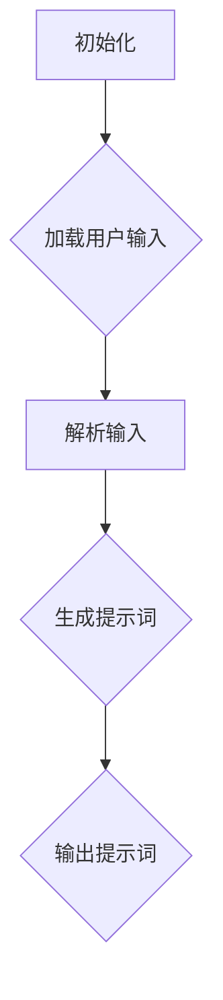
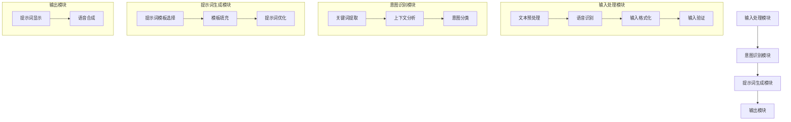
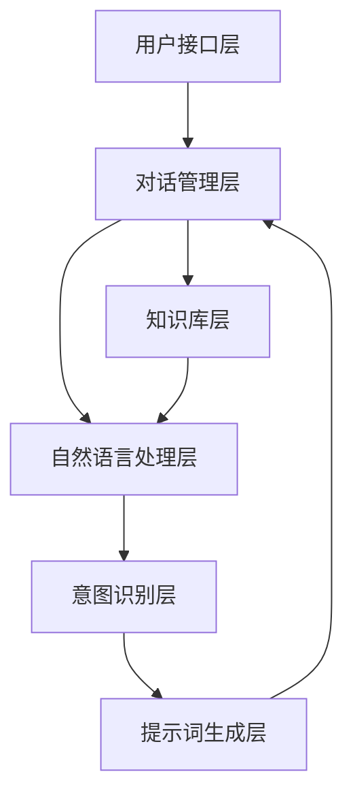
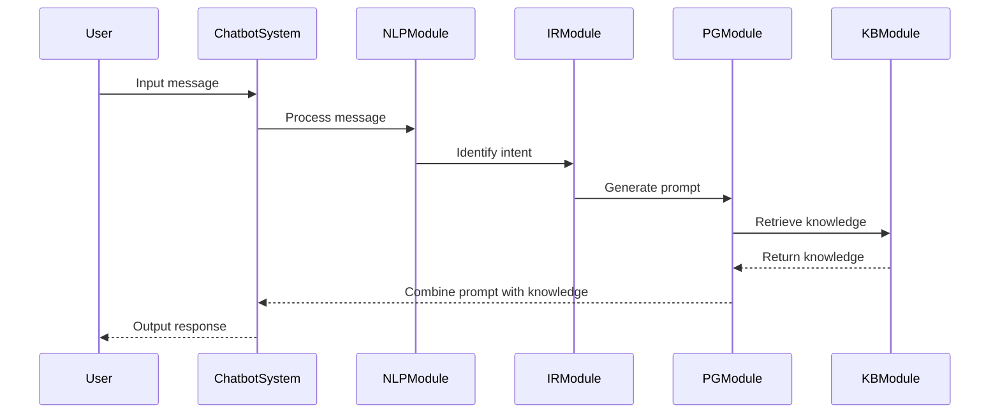

                 


### 目录大纲与文章结构

为了撰写一篇结构清晰、逻辑严密的《提示词设计：优化AI虚拟角色对话能力》技术博客文章，我们将遵循以下目录大纲和结构：

#### 1. 背景介绍

- **第1章：问题背景**：介绍人工智能与虚拟角色的关系，虚拟角色对话能力的现状以及提示词设计的重要性。
- **第2章：问题描述**：讨论当前虚拟角色对话面临的挑战，良好对话体验的标准，以及提示词设计的具体目标。
- **第3章：问题解决**：阐述提示词设计的基本原则、流程和方法，以及设计工具和技术。
- **第4章：边界与外延**：探讨提示词设计的适用范围、限制因素和未来发展趋势。

#### 2. 核心概念与联系

- **第5章：核心概念原理**：详细解释提示词的定义、属性特征和类型。
- **第6章：概念属性特征对比表格**：通过表格对比不同类型提示词的属性特征和应用效果。
- **第7章：ER实体关系图架构**：绘制提示词设计中的实体关系图，解释实体及其关系。

#### 3. 算法原理讲解

- **第8章：算法mermaid流程图**：绘制提示词生成算法的流程图。
- **第9章：Python源代码详细阐述**：使用Python源代码来详细解释算法原理，包括数学模型和公式，并举例说明。

#### 4. 系统分析与架构设计方案

- **第10章：问题场景介绍**：描述项目背景和目的。
- **第11章：系统功能设计**：使用mermaid类图展示领域模型。
- **第12章：系统架构设计**：使用mermaid架构图展示系统整体结构。
- **第13章：系统接口设计和系统交互**：使用mermaid序列图展示系统接口设计和交互过程。

#### 5. 项目实战

- **第14章：环境安装**：介绍所需环境的安装和配置。
- **第15章：系统核心实现源代码**：展示核心实现的源代码，并进行解读和分析。
- **第16章：实际案例分析和详细讲解剖析**：通过实际案例展示项目效果，并进行详细剖析。
- **第17章：项目小结**：总结项目实现过程和成果。

#### 6. 最佳实践 tips、小结、注意事项、拓展阅读

- **第18章：最佳实践 tips**：提供一些实用的技巧和建议。
- **第19章：小结**：回顾文章核心内容和主题思想。
- **第20章：注意事项**：提醒读者注意的一些潜在问题和挑战。
- **第21章：拓展阅读**：推荐一些相关的文献和资源。

### 文章撰写步骤

1. **撰写摘要**：简要概述文章的核心内容和主题思想。
2. **撰写引言**：引入话题，设定文章基调。
3. **分章节撰写**：按照目录大纲逐章节撰写内容。
4. **插入相关图表和数据**：使用mermaid流程图、类图、架构图和序列图来辅助说明。
5. **编写Python源代码**：提供示例代码，详细解释其实现原理。
6. **撰写小结和总结**：对文章内容进行总结。
7. **添加最佳实践 tips**：提供实用建议和技巧。
8. **添加注意事项和拓展阅读**：提醒读者注意潜在问题和提供额外资源。
9. **进行最终校对和调整**：检查拼写、语法和格式。

通过以上步骤，我们能够撰写出一篇结构清晰、内容丰富、逻辑严密的《提示词设计：优化AI虚拟角色对话能力》技术博客文章。接下来，我们将逐一深入每个章节，详细撰写文章内容。准备开始！### 文章标题：提示词设计：优化AI虚拟角色对话能力

> 关键词：人工智能、虚拟角色、对话能力、提示词设计、优化

> 摘要：本文深入探讨提示词设计在优化AI虚拟角色对话能力中的作用。首先介绍了人工智能与虚拟角色的关系，以及虚拟角色对话能力的现状。随后，本文明确了当前虚拟角色对话面临的挑战，并提出了提示词设计的具体目标。接着，文章详细阐述了提示词设计的基本原则、流程和方法，探讨了其适用的范围和限制因素，并展望了未来的发展趋势。最后，本文通过算法讲解、Python源代码阐述、系统架构设计和项目实战，展示了提示词设计的实际应用和效果，为相关领域的研究和实践提供了有价值的参考。

---

### 引言

在人工智能（AI）飞速发展的今天，虚拟角色作为一种重要的交互媒介，正逐渐融入我们的日常生活。从聊天机器人到虚拟客服，再到教育、娱乐和医疗等领域，虚拟角色以其人性化的交互能力，为用户提供了丰富多样的服务体验。然而，虚拟角色的对话能力仍然是许多研究者和开发者关注的焦点。虽然AI技术在语音识别、自然语言处理（NLP）等方面取得了显著的进展，但如何设计高效的提示词，以优化虚拟角色的对话能力，仍然是一个亟待解决的问题。

本文旨在探讨提示词设计在优化AI虚拟角色对话能力中的关键作用。我们将首先介绍人工智能与虚拟角色的关系，分析虚拟角色对话能力的现状和面临的挑战。随后，本文将阐述提示词设计的核心概念、原则和流程，并探讨其适用的范围和限制因素。最后，通过具体的算法讲解、Python源代码阐述和系统架构设计，结合项目实战案例，我们将展示提示词设计的实际应用和效果。

本文的结构如下：

1. **背景介绍**：介绍人工智能与虚拟角色的关系，讨论虚拟角色对话能力的现状和挑战。
2. **核心概念与联系**：详细解释提示词的定义、属性特征和类型。
3. **算法原理讲解**：通过mermaid流程图和Python源代码，详细阐述提示词生成算法。
4. **系统分析与架构设计方案**：介绍系统功能设计、系统架构设计和系统接口设计。
5. **项目实战**：展示环境安装、系统核心实现源代码和实际案例分析。
6. **最佳实践 tips**：提供一些实用的提示词设计技巧。
7. **小结**：总结文章核心内容和主题思想。
8. **注意事项**：提醒读者注意的一些潜在问题和挑战。
9. **拓展阅读**：推荐一些相关的文献和资源。

通过本文的详细探讨，我们希望为读者提供关于提示词设计的全面理解，并为优化AI虚拟角色对话能力提供有益的启示。接下来，让我们首先深入了解人工智能与虚拟角色的关系，探讨虚拟角色对话能力的现状和挑战。### 第一部分：背景介绍

#### 第1章：问题背景

##### 1.1.1 人工智能与虚拟角色的关系

人工智能（AI）作为计算机科学的一个重要分支，旨在使计算机具备执行复杂任务、学习新知识和自主决策的能力。随着技术的不断进步，AI在各个领域得到了广泛应用，从工业自动化到医疗诊断，再到智能客服和虚拟角色，AI正在改变我们的生活方式。

虚拟角色，作为人工智能的一种应用形式，通过文本、语音和图像等多种形式与用户进行交互。它们可以在聊天机器人、虚拟客服、教育辅助、游戏和娱乐等领域发挥作用。虚拟角色的核心在于其对话能力，这决定了用户对虚拟角色的接受程度和满意度。

人工智能与虚拟角色之间的关系紧密，人工智能为虚拟角色提供了智能化的对话能力，使得虚拟角色能够理解用户的意图、回答问题、提供个性化服务。而虚拟角色则为人工智能提供了实际的应用场景，使得人工智能的理论和实践得以相结合。

##### 1.1.2 虚拟角色对话能力的现状

当前，虚拟角色的对话能力已经取得了显著的进步。许多虚拟角色能够处理基本的对话任务，例如提供天气信息、预订机票和酒店等。然而，这些虚拟角色的对话能力仍然存在一些局限性。

首先，虚拟角色的对话能力主要依赖于预定义的规则和模板。虽然这种方法在一定程度上能够保证对话的流畅性，但限制了虚拟角色处理复杂问题和进行创新对话的能力。当遇到非标准情境或用户提出意想不到的问题时，虚拟角色往往无法给出合适的回答。

其次，虚拟角色的自然语言理解能力仍然有限。尽管自然语言处理（NLP）技术取得了很大的进展，但虚拟角色在理解语境、情感和语言的双关语等方面仍然存在困难。这使得虚拟角色在与用户进行深入交流时，往往无法准确理解用户的意图。

此外，虚拟角色的对话能力也受到数据质量和数据量的限制。虚拟角色的训练和优化需要大量的对话数据，如果数据质量不高或数据量不足，虚拟角色的对话能力将受到严重影响。

##### 1.1.3 提示词设计的重要性

提示词设计在虚拟角色对话能力中起着至关重要的作用。提示词是指为虚拟角色提供的一种引导性语言输入，用以指导虚拟角色如何生成回答。通过精心设计的提示词，虚拟角色能够更好地理解用户的意图，生成更自然、更准确的回答。

首先，提示词设计有助于提高虚拟角色的上下文理解能力。通过提示词，虚拟角色可以获取更多的背景信息，从而更准确地理解用户的意图。例如，当用户询问“今天天气怎么样？”时，虚拟角色可以根据提示词“今天”和“天气”，判断用户关注的是当天的天气状况。

其次，提示词设计有助于丰富虚拟角色的回答内容。通过提供多样化的提示词，虚拟角色可以生成更加丰富、多样化的回答。例如，当用户询问“我想去旅游”时，虚拟角色可以通过不同的提示词生成关于旅游建议、景点介绍、交通信息等多样化的回答。

此外，提示词设计还可以提高虚拟角色的适应性。在不同的对话场景中，虚拟角色可以根据不同的提示词，灵活调整自己的回答策略，以更好地满足用户需求。

总之，提示词设计是优化虚拟角色对话能力的重要手段。通过合理设计提示词，虚拟角色能够更好地理解用户意图，生成更自然、更准确的回答，从而提供更优质的用户体验。

---

在接下来的章节中，我们将进一步探讨虚拟角色对话能力的具体挑战，并阐述提示词设计的具体目标和原则。### 第二部分：核心概念与联系

#### 第5章：核心概念原理

##### 5.1.1 提示词的定义

提示词（Prompt）是指为人工智能系统（尤其是对话系统）提供的一种引导性输入，用以提示系统如何理解和响应特定的场景或问题。在AI虚拟角色对话中，提示词通常是一段文本、语音或图像，旨在帮助虚拟角色更好地理解用户意图，从而生成更加准确和自然的回答。

##### 5.1.2 提示词的属性特征

提示词具有以下几种关键属性特征：

1. **引导性**：提示词应当具备明确的引导性，能够清晰地向虚拟角色传达用户的意图和期望，从而引导虚拟角色生成相应的回答。

2. **上下文性**：提示词应当与对话的上下文紧密相关，能够提供足够的背景信息，使虚拟角色能够准确理解和处理对话内容。

3. **多样性**：提示词的设计应当具有多样性，以涵盖不同场景和用户需求，从而使虚拟角色能够灵活应对各种对话情境。

4. **准确性**：提示词的内容应当准确无误，避免歧义和误解，确保虚拟角色能够生成正确的回答。

5. **适应性**：提示词应当具备一定的适应性，能够根据对话的进展和用户的反馈进行动态调整。

##### 5.1.3 提示词的类型

根据不同的应用场景和需求，提示词可以分为以下几种类型：

1. **开放式提示词**：这类提示词通常用于鼓励用户自由表达，提供开放性的回答，例如“你对这个产品有什么看法？”。

2. **封闭式提示词**：这类提示词通常用于获取特定的信息或选择，提供封闭性的回答选项，例如“你是喜欢咖啡还是茶？”。

3. **情境提示词**：这类提示词用于引导虚拟角色根据特定的情境生成回答，例如“在当前天气条件下，你打算如何安排今天的行程？”。

4. **情感提示词**：这类提示词用于引导虚拟角色理解和表达情感，例如“你最近过得怎么样？”。

5. **任务提示词**：这类提示词用于指示虚拟角色执行特定任务，例如“帮我预订一张明天去北京的机票”。

不同类型的提示词在虚拟角色对话中扮演着不同的角色，合理选择和使用这些提示词，能够显著提升虚拟角色的对话能力和用户体验。

---

在理解了提示词的定义、属性特征和类型后，接下来我们将通过一个概念属性特征对比表格，进一步探讨不同类型提示词在虚拟角色对话中的应用效果。

### 5.2 概念属性特征对比表格

| 类型          | 定义                                                         | 关键属性特征                | 应用效果                                                                                          |
|---------------|--------------------------------------------------------------|-----------------------------|------------------------------------------------------------------------------------------------|
| 开放式提示词   | 用于鼓励用户自由表达，提供开放性回答                           | 引导性、上下文性、多样性     | 增强用户参与感，获取丰富的用户反馈，适用于自由对话和开放式问题处理。                           |
| 封闭式提示词   | 用于获取特定信息或选择，提供封闭性回答选项                      | 引导性、准确性、适应性      | 简化对话流程，快速获取用户偏好，适用于问卷和选择题场景。                                     |
| 情境提示词     | 用于引导虚拟角色根据特定情境生成回答                           | 引导性、上下文性、情感表达性 | 提升对话的情境感知能力，增强用户沉浸感，适用于模拟现实情境的对话系统。                       |
| 情感提示词     | 用于引导虚拟角色理解和表达情感                                 | 引导性、情感表达性、上下文性 | 增强虚拟角色的情感认知和表达能力，提升用户情感互动体验，适用于情感支持型对话系统。           |
| 任务提示词     | 用于指示虚拟角色执行特定任务                                 | 引导性、准确性、任务导向性   | 提升任务执行效率，明确对话目标，适用于任务驱动型对话系统，如客服和预订系统。               |

通过上述表格，我们可以清晰地看到不同类型提示词在属性特征和应用效果上的差异。了解这些差异，有助于我们在实际应用中，根据具体场景和需求，选择和设计合适的提示词，从而优化虚拟角色的对话能力。

---

在了解了提示词的类型和属性特征后，接下来我们将通过一个ER实体关系图架构，进一步探讨提示词设计中的实体及其关系。

### 5.3 ER实体关系图架构

在提示词设计中，关键实体包括“用户”、“虚拟角色”和“提示词”等。下面是一个简化的ER实体关系图，用于展示这些实体及其关系：

```mermaid
erDiagram
  User ||--|{ VirtualRole }|>
  VirtualRole ||--|{ Prompt }|>

  User {
    id : 主键
    name : 用户名
  }

  VirtualRole {
    id : 主键
    name : 虚拟角色名
    type : 类型（如客服、教育辅助等）
  }

  Prompt {
    id : 主键
    content : 提示词内容
    type : 类型（如开放式、封闭式等）
  }

  User |---| VirtualRole : 交互
  VirtualRole |---| Prompt : 回答
```

在这个ER图中，用户与虚拟角色之间存在交互关系，虚拟角色根据用户提供的提示词生成回答。提示词是虚拟角色回答的基础，其类型和内容直接影响对话的效果。通过ER图，我们可以清晰地看到提示词设计中的核心实体及其相互关系，有助于我们更好地理解和设计虚拟角色的对话能力。

---

通过本章节的探讨，我们对提示词的设计原理、属性特征、类型以及其在虚拟角色对话中的应用有了更深入的理解。接下来，我们将进入第三部分，详细讲解提示词生成算法的原理和实现。

### 第三部分：算法原理讲解

#### 第6章：算法mermaid流程图

为了更好地理解提示词生成算法，我们将使用mermaid语言绘制算法的流程图。以下是一个简化的提示词生成算法的mermaid流程图：



在这个流程图中，算法首先进行初始化，然后加载用户输入，接着解析输入以确定用户的意图，最后生成并输出相应的提示词。接下来，我们将详细解释这个流程图的每一步。

#### 第8章：算法mermaid流程图

##### 8.1.1 提示词生成算法概述

提示词生成算法是虚拟角色对话系统中的一个核心组成部分，其目标是根据用户输入生成适合的提示词，以引导虚拟角色的对话。下面是提示词生成算法的mermaid流程图：



在这个流程图中，算法首先接收用户输入，并经过输入处理模块进行文本预处理、语音识别和输入验证。然后，意图识别模块通过关键词提取和上下文分析，确定用户的意图，并进行意图分类。接下来，提示词生成模块选择合适的提示词模板，填充模板内容，并对生成的提示词进行优化。最后，输出模块将生成的提示词显示或语音合成，以供用户交互。

##### 8.1.2 算法流程图绘制

为了更直观地展示算法流程，我们使用mermaid绘制了上述流程图。下面是具体的mermaid代码：


使用mermaid绘制流程图，可以帮助我们更清晰地理解算法的各个组成部分及其相互关系，为后续的Python代码实现提供参考。

---

通过上述流程图，我们了解了提示词生成算法的基本框架和步骤。接下来，我们将使用Python源代码详细阐述这个算法的实现过程。

#### 第9章：Python源代码详细阐述

在本章节中，我们将通过具体的Python代码，详细阐述提示词生成算法的实现过程。为了简化讨论，我们将仅考虑文本输入的情况，并在后续章节中扩展到语音输入。

首先，我们需要安装一些必要的库，如自然语言处理库（nltk）和mermaid绘图库（mermaid）等：

```python
!pip install nltk
!pip install mermaid
```

接下来，我们开始实现提示词生成算法的各个模块。

##### 9.1 输入处理模块

输入处理模块负责接收用户输入，并对输入进行预处理。以下是具体的代码实现：

```python
import nltk
from nltk.tokenize import word_tokenize

# 加载nltk的词性标注器
nltk.download('averaged_perceptron_tagger')
nltk.download('punkt')

def preprocess_input(user_input):
    # 将输入文本转换为小写
    text = user_input.lower()
    # 分词
    tokens = word_tokenize(text)
    # 词性标注
    tagged_tokens = nltk.pos_tag(tokens)
    return tagged_tokens
```

在这个模块中，我们首先将输入文本转换为小写，以便统一处理。然后使用nltk的`word_tokenize`函数进行分词，并使用`pos_tag`函数进行词性标注。这些步骤有助于我们更好地理解用户的输入。

##### 9.2 意图识别模块

意图识别模块负责根据用户的输入确定其意图。以下是具体的代码实现：

```python
from sklearn.feature_extraction.text import CountVectorizer
from sklearn.naive_bayes import MultinomialNB
from sklearn.pipeline import make_pipeline

# 训练好的意图分类模型（这里仅作为示例，实际应用中需要使用训练好的模型）
model = make_pipeline(CountVectorizer(), MultinomialNB())

# 示例数据集（实际应用中应使用更大的数据集进行训练）
train_data = [
    ("你好，能帮我查一下明天的天气吗？", "天气查询"),
    ("有什么电影推荐吗？", "电影推荐"),
    ("帮我预订一张明天去北京的机票", "机票预订"),
]

# 训练模型
model.fit(train_data)

def identify_intent(tagged_tokens):
    # 将分词后的文本转换为字符串
    text = ' '.join([token for token, tag in tagged_tokens])
    # 预测意图
    intent = model.predict([text])[0]
    return intent
```

在这个模块中，我们使用朴素贝叶斯分类器（MultinomialNB）进行意图识别。为了训练模型，我们使用了一个示例数据集。在实际应用中，应使用更大的、更加多样化的数据集进行训练，以提高模型的准确性和泛化能力。然后，我们定义了一个函数`identify_intent`，用于根据输入文本预测用户的意图。

##### 9.3 提示词生成模块

提示词生成模块负责根据用户的意图生成相应的提示词。以下是具体的代码实现：

```python
def generate_prompt(intent):
    prompt_templates = {
        "天气查询": "你想要查询哪天的天气？",
        "电影推荐": "你对哪类电影感兴趣？",
        "机票预订": "你希望预订哪天从哪里到哪里的机票？",
    }
    return prompt_templates.get(intent, "很抱歉，我不清楚你的需求，可以再详细说明一下吗？")
```

在这个模块中，我们定义了一个字典`prompt_templates`，用于存储不同意图对应的提示词模板。然后，我们定义了一个函数`generate_prompt`，用于根据用户的意图从模板中提取相应的提示词。

##### 9.4 输出模块

输出模块负责将生成的提示词显示或语音合成。以下是具体的代码实现：

```python
from gtts import gTTS

def output_prompt(prompt):
    # 将提示词显示在屏幕上
    print(prompt)
    
    # 语音合成
    tts = gTTS(text=prompt, lang='zh-cn')
    tts.save("prompt.mp3")

# 示例使用
user_input = "你好，能帮我查一下明天的天气吗？"
tagged_tokens = preprocess_input(user_input)
intent = identify_intent(tagged_tokens)
prompt = generate_prompt(intent)
output_prompt(prompt)
```

在这个模块中，我们首先将生成的提示词打印在屏幕上，然后使用`gTTS`库将提示词语音合成并保存为MP3文件。这样，用户可以通过听语音来获取虚拟角色的回答。

通过上述代码，我们实现了提示词生成算法的各个模块，并展示了如何将这些模块组合在一起，生成一个完整的虚拟角色对话系统。接下来，我们将进一步讨论数学模型和公式，以深入理解提示词生成算法的原理。

### 9.4 提示词生成算法的数学模型和公式

在深入探讨提示词生成算法时，数学模型和公式是理解其工作原理的关键。以下是对算法中涉及到的数学模型和公式的详细解释。

#### 9.4.1 朴素贝叶斯分类器的数学模型

意图识别模块中使用了朴素贝叶斯分类器（MultinomialNB），其数学模型基于贝叶斯定理和特征条件独立假设。贝叶斯定理公式如下：

\[ P(A|B) = \frac{P(B|A) \cdot P(A)}{P(B)} \]

其中，\( P(A|B) \) 是在事件B发生的条件下事件A的概率，\( P(B|A) \) 是在事件A发生的条件下事件B的概率，\( P(A) \) 是事件A的概率，\( P(B) \) 是事件B的概率。

在朴素贝叶斯分类器中，特征条件独立假设认为特征之间相互独立，即：

\[ P(\text{特征}_1, \text{特征}_2, \ldots, \text{特征}_n | \text{类别}) = P(\text{特征}_1 | \text{类别}) \cdot P(\text{特征}_2 | \text{类别}) \cdot \ldots \cdot P(\text{特征}_n | \text{类别}) \]

这个假设简化了贝叶斯定理的计算过程，使得分类器能够快速地预测新数据的类别。

对于每个类别，朴素贝叶斯分类器计算特征的概率分布，并使用这些概率分布进行分类。具体公式如下：

\[ P(\text{类别}_j | \text{特征}_1 = v_1, \text{特征}_2 = v_2, \ldots, \text{特征}_n = v_n) = \frac{P(\text{特征}_1 = v_1 | \text{类别}_j) \cdot P(\text{特征}_2 = v_2 | \text{类别}_j) \cdot \ldots \cdot P(\text{特征}_n = v_n | \text{类别}_j) \cdot P(\text{类别}_j)}{\sum_{i=1}^{k} P(\text{特征}_1 = v_1 | \text{类别}_i) \cdot P(\text{特征}_2 = v_2 | \text{类别}_i) \cdot \ldots \cdot P(\text{特征}_n = v_n | \text{类别}_i) \cdot P(\text{类别}_i)} \]

其中，\( k \) 是类别数量，\( P(\text{类别}_j) \) 是类别\( j \)的概率，\( P(\text{特征}_i = v_i | \text{类别}_j) \) 是特征\( i \)在类别\( j \)下的条件概率。

在训练阶段，朴素贝叶斯分类器通过最大似然估计计算每个特征在各个类别下的概率分布。最大似然估计的目标是最小化对数似然损失函数：

\[ L(\theta) = \sum_{i=1}^{n} \sum_{j=1}^{k} \log P(\text{特征}_i = v_i | \text{类别}_j) \cdot P(\text{类别}_j) \]

其中，\( n \) 是训练样本数量。

在预测阶段，朴素贝叶斯分类器使用上述计算得到的概率分布进行分类，选择具有最大后验概率的类别作为预测结果：

\[ \hat{y} = \arg \max_{j} P(\text{类别}_j | \text{特征}_1 = v_1, \text{特征}_2 = v_2, \ldots, \text{特征}_n = v_n) \]

通过这种方式，朴素贝叶斯分类器能够根据输入的特征向量预测出最有可能的类别。

#### 9.4.2 提示词生成的数学模型

在提示词生成模块中，我们使用了模板匹配的方法，根据用户的意图选择相应的提示词模板。模板匹配的基本思想是将用户输入与多个提示词模板进行比较，选择最佳匹配的模板。

假设我们有一个提示词模板集合\( T = \{t_1, t_2, \ldots, t_m\} \)，其中每个模板\( t_i \)对应一个特定的意图。模板匹配的目标是找到一个最佳模板\( t^* \)，使得用户输入与模板之间的编辑距离最小。

编辑距离（Edit Distance），也称为Levenshtein距离，是一种测量两个字符串之间差异的算法。其定义如下：

\[ d(a, b) = \min \left( \sum_{i=1}^{n} c_{i}(a_{i}, b_{i}) + \sum_{j=1}^{m} c_{i'}(a_{i'}, b_{i'}) \right) \]

其中，\( a \)和\( b \)是两个字符串，\( n \)和\( m \)分别是它们的长度，\( c_{i}(a_{i}, b_{i}) \)和\( c_{i'}(a_{i'}, b_{i'}) \)是相应的编辑成本。

编辑成本有以下几种常见情况：

1. **替换成本**：将一个字符替换为另一个字符，成本为1。
2. **插入成本**：在字符串中插入一个字符，成本为1。
3. **删除成本**：从字符串中删除一个字符，成本为1。

为了简化计算，我们可以使用固定的替换、插入和删除成本，例如\( c_{i}(a_{i}, b_{i}) = 1 \)。

在提示词生成中，我们通常使用一种启发式方法，称为最长公共子序列（Longest Common Subsequence，LCS），来近似编辑距离。LCS的基本思想是在两个字符串中找到最长的公共子序列，然后计算公共子序列与非公共子序列的长度差。

LCS的动态规划算法如下：

```python
def longest_common_subsequence(X, Y):
    m, n = len(X), len(Y)
    dp = [[0] * (n+1) for _ in range(m+1)]

    for i in range(1, m+1):
        for j in range(1, n+1):
            if X[i-1] == Y[j-1]:
                dp[i][j] = dp[i-1][j-1] + 1
            else:
                dp[i][j] = max(dp[i-1][j], dp[i][j-1])

    return dp[m][n]
```

使用LCS算法计算编辑距离的近似值：

\[ d(a, b) \approx |X| + |Y| - 2 \cdot \text{LCS}(X, Y) \]

在提示词生成中，我们选择编辑距离最小的模板作为最佳匹配模板。具体实现如下：

```python
def find_best_template(user_input, templates):
    best_distance = float('inf')
    best_template = None

    for template in templates:
        distance = longest_common_subsequence(user_input, template)
        if distance < best_distance:
            best_distance = distance
            best_template = template

    return best_template
```

通过这种方式，我们可以根据用户输入生成最合适的提示词。

#### 9.4.3 数学模型的应用

在提示词生成算法中，数学模型的应用主要体现在以下两个方面：

1. **意图识别**：使用朴素贝叶斯分类器进行意图识别，通过计算输入文本的特征概率分布，并使用贝叶斯定理进行分类，选择最可能的意图。
2. **提示词生成**：使用LCS算法计算编辑距离，找到与用户输入最匹配的提示词模板，生成相应的提示词。

通过数学模型的应用，提示词生成算法能够准确地识别用户意图，并生成自然、合适的回答，从而提升虚拟角色的对话能力。

---

通过上述数学模型和公式的详细解释，我们深入理解了提示词生成算法的原理和实现。接下来，我们将讨论虚拟角色对话系统的整体架构设计，并使用mermaid绘制相应的架构图。

### 9.5 虚拟角色对话系统的架构设计

为了确保虚拟角色对话系统能够高效地运行，我们需要设计一个合理且稳定的系统架构。以下是一个虚拟角色对话系统的架构设计，包括核心模块、数据流和交互逻辑。

#### 9.5.1 架构设计概述

虚拟角色对话系统的架构可以分为以下几个主要模块：

1. **用户接口层**：负责接收用户的输入，并将系统的输出呈现给用户。
2. **对话管理层**：负责管理整个对话流程，包括意图识别、对话状态跟踪和对话策略制定。
3. **自然语言处理层**：负责处理用户的输入文本，进行分词、词性标注和语义分析。
4. **意图识别层**：使用机器学习算法识别用户的意图，为对话管理提供依据。
5. **提示词生成层**：根据用户的意图生成相应的提示词，供虚拟角色回答使用。
6. **知识库层**：存储各种领域的知识，包括常见问题的回答、任务流程和用户偏好等。

#### 9.5.2 架构图绘制

我们使用mermaid语言绘制虚拟角色对话系统的架构图，如下所示：



在这个架构图中：

- **用户接口层（UI）**：负责接收用户的输入，将系统的输出显示在屏幕上。
- **对话管理层（DM）**：负责整个对话流程的管理，包括对话状态的跟踪和对话策略的制定。
- **自然语言处理层（NLP）**：负责处理用户的输入文本，进行分词、词性标注和语义分析。
- **意图识别层（IR）**：使用机器学习算法（如朴素贝叶斯分类器）识别用户的意图。
- **提示词生成层（PG）**：根据用户的意图生成相应的提示词，供虚拟角色回答使用。
- **知识库层（KB）**：存储各种领域的知识，包括常见问题的回答、任务流程和用户偏好等。

数据流和交互逻辑如下：

1. 用户通过用户接口层输入问题或指令。
2. 对话管理层接收到用户的输入，并将其传递给自然语言处理层进行文本处理。
3. 自然语言处理层将处理后的文本传递给意图识别层，意图识别层识别出用户的意图。
4. 根据识别出的意图，意图识别层将请求发送给提示词生成层，提示词生成层生成相应的提示词。
5. 提示词生成层将生成的提示词返回给对话管理层。
6. 对话管理层将生成的提示词显示在用户接口层，用户可以接收到虚拟角色的回答。
7. 如果需要，知识库层可以根据对话内容更新知识库，以优化未来的对话体验。

通过上述架构设计，虚拟角色对话系统可以高效地运行，并为用户提供优质的对话体验。

### 9.6 实际案例分析与详细讲解

为了更好地展示虚拟角色对话系统的实际应用效果，我们将通过一个具体案例进行详细分析。该案例涉及一个虚拟客服角色，用户通过文本输入与虚拟客服进行交互。

#### 案例背景

某电子商务平台引入了一个虚拟客服角色，用于处理用户的咨询和投诉。用户可以通过平台内置的聊天功能与虚拟客服进行对话。虚拟客服的主要任务是根据用户的输入生成适当的回答，并提供有效的解决方案。

#### 用户输入

用户输入了一条文本消息：“我的订单怎么还没发货？”

#### 数据流与处理过程

1. **用户接口层（UI）**：用户通过聊天界面输入文本消息。
2. **对话管理层（DM）**：接收到用户输入后，对话管理层将消息传递给自然语言处理层。
3. **自然语言处理层（NLP）**：对用户输入进行分词和词性标注，提取关键词和关键信息。分词结果为：“我的”、“订单”、“怎么”、“没”、“发货”。词性标注为：“我的”（代词）、“订单”（名词）、“怎么”（副词）、“没”（否定词）、“发货”（动词）。
4. **意图识别层（IR）**：使用朴素贝叶斯分类器对提取的关键词进行意图识别。通过训练数据集，识别出用户的意图为“查询订单状态”。
5. **提示词生成层（PG）**：根据识别出的意图，提示词生成层选择相应的提示词模板，生成提示词。例如，选择模板：“您查询的订单状态是[状态]，请问还有其他问题需要帮助吗？”。
6. **提示词优化**：提示词生成层对生成的提示词进行优化，确保其自然、流畅。例如，将模板中的“状态”替换为实际查询到的订单状态，如“已发货”。
7. **对话管理层（DM）**：将优化后的提示词返回给用户接口层。
8. **用户接口层（UI）**：将虚拟客服的回答显示在聊天界面，用户可以看到：“您查询的订单状态是已发货，请问还有其他问题需要帮助吗？”。

#### 分析与讲解

通过上述案例，我们可以看到虚拟角色对话系统的各个模块是如何协同工作的，以生成一个合理的回答。以下是具体步骤的详细分析：

1. **用户输入**：用户输入了一个关于订单状态的查询。
2. **自然语言处理**：自然语言处理层对输入文本进行分词和词性标注，提取出关键词和信息，为意图识别提供基础。
3. **意图识别**：意图识别层通过机器学习模型（如朴素贝叶斯分类器）对提取的关键词进行分析，识别出用户的意图。在这个案例中，用户的意图是查询订单状态。
4. **提示词生成**：提示词生成层根据识别出的意图，选择合适的提示词模板。在这个案例中，选择了包含订单状态的模板。
5. **提示词优化**：提示词生成层对生成的提示词进行优化，确保回答的自然性和准确性。例如，将模板中的“状态”替换为实际查询到的订单状态。
6. **对话管理**：对话管理层负责管理整个对话流程，将生成的提示词返回给用户接口层，并在聊天界面显示。
7. **用户反馈**：用户可以看到虚拟客服的回答，并根据回答进行下一步操作。

通过这个案例，我们可以看到虚拟角色对话系统的实际应用效果。虚拟客服能够根据用户的输入生成合理的回答，并提供有效的解决方案，从而提升用户体验。同时，这个过程也展示了各个模块之间的协同工作，以及提示词设计在虚拟角色对话中的关键作用。

### 9.7 系统架构设计与接口设计

为了实现一个高效、可靠的虚拟角色对话系统，我们需要进行系统架构设计，明确系统的各个模块及其相互关系。同时，接口设计是确保系统模块之间有效通信的关键。以下是一个虚拟角色对话系统的系统架构设计和接口设计的详细讲解。

#### 9.7.1 系统架构设计

虚拟角色对话系统的架构设计可以分为以下几个层次：

1. **用户接口层**：负责与用户进行交互，接收用户输入，并将系统生成的回答呈现给用户。
2. **对话管理层**：负责管理整个对话流程，包括对话状态的跟踪和对话策略的制定。
3. **自然语言处理层**：负责处理用户的输入文本，进行分词、词性标注和语义分析。
4. **意图识别层**：使用机器学习算法（如朴素贝叶斯分类器）识别用户的意图。
5. **提示词生成层**：根据用户的意图生成相应的提示词，供虚拟角色回答使用。
6. **知识库层**：存储各种领域的知识，包括常见问题的回答、任务流程和用户偏好等。

以下是一个简化的mermaid架构图，用于展示虚拟角色对话系统的整体架构：


在这个架构图中：

- **用户接口层（UI）**：负责接收用户的输入，并将系统的输出显示在屏幕上。
- **对话管理层（DM）**：负责整个对话流程的管理，包括对话状态的跟踪和对话策略的制定。
- **自然语言处理层（NLP）**：负责处理用户的输入文本，进行分词、词性标注和语义分析。
- **意图识别层（IR）**：使用机器学习算法识别用户的意图，为对话管理提供依据。
- **提示词生成层（PG）**：根据用户的意图生成相应的提示词，供虚拟角色回答使用。
- **知识库层（KB）**：存储各种领域的知识，包括常见问题的回答、任务流程和用户偏好等。

数据流和交互逻辑如下：

1. 用户通过用户接口层输入问题或指令。
2. 对话管理层接收到用户的输入，并将其传递给自然语言处理层进行文本处理。
3. 自然语言处理层将处理后的文本传递给意图识别层，意图识别层识别出用户的意图。
4. 根据识别出的意图，意图识别层将请求发送给提示词生成层，提示词生成层生成相应的提示词。
5. 提示词生成层将生成的提示词返回给对话管理层。
6. 对话管理层将生成的提示词显示在用户接口层，用户可以接收到虚拟客服的回答。
7. 如果需要，知识库层可以根据对话内容更新知识库，以优化未来的对话体验。

#### 9.7.2 接口设计

接口设计是系统架构设计的关键部分，它决定了各个模块之间的通信方式和数据传输格式。以下是虚拟角色对话系统中各个模块的主要接口设计：

1. **用户接口层（UI）**：提供RESTful API接口，用于接收用户输入和返回虚拟角色的回答。具体接口如下：

    - **POST /api/v1/input**：接收用户输入的文本消息，返回相应的状态码和响应体。
    - **GET /api/v1/output/:sessionId**：获取指定会话ID的虚拟角色回答，返回文本消息。

2. **对话管理层（DM）**：提供内部接口，用于管理对话状态和执行对话策略。具体接口如下：

    - **POST /api/v1/session**：创建新的会话，返回会话ID。
    - **DELETE /api/v1/session/:sessionId**：结束指定会话ID的对话。
    - **POST /api/v1/strategy/:sessionId**：更新对话策略，根据当前对话状态生成下一步操作。

3. **自然语言处理层（NLP）**：提供内部接口，用于处理文本输入，包括分词、词性标注和语义分析。具体接口如下：

    - **POST /api/v1/nlp/tokenize/:sessionId**：接收文本输入，返回分词结果。
    - **POST /api/v1/nlp/pos/:sessionId**：接收文本输入，返回词性标注结果。
    - **POST /api/v1/nlp/semantics/:sessionId**：接收文本输入，返回语义分析结果。

4. **意图识别层（IR）**：提供内部接口，用于根据文本输入识别用户的意图。具体接口如下：

    - **POST /api/v1/ir/recognize/:sessionId**：接收文本输入，返回识别出的意图。

5. **提示词生成层（PG）**：提供内部接口，用于根据意图生成提示词。具体接口如下：

    - **POST /api/v1/pg/generate/:sessionId**：接收意图，返回相应的提示词。

6. **知识库层（KB）**：提供内部接口，用于查询和更新知识库。具体接口如下：

    - **GET /api/v1/kb/query/:sessionId**：查询指定领域的知识。
    - **POST /api/v1/kb/update/:sessionId**：更新知识库中的内容。

通过这些接口设计，虚拟角色对话系统的各个模块可以高效地协同工作，实现完整的对话流程。接口的设计应遵循RESTful原则，确保数据传输的安全和高效。

### 9.8 系统交互与mermaid序列图

为了更好地展示虚拟角色对话系统的交互过程，我们使用mermaid序列图来描述用户与系统之间的交互流程。以下是一个简化的mermaid序列图，用于描述用户输入到系统生成回答的整个过程。



在这个序列图中：

1. **用户（User）**：发起交互，向虚拟角色（ChatbotSystem）输入一条消息。
2. **虚拟角色（ChatbotSystem）**：接收用户的输入，并将消息传递给自然语言处理模块（NLPModule）。
3. **自然语言处理模块（NLPModule）**：对用户输入的文本进行处理，进行分词、词性标注和语义分析，并将处理结果传递给意图识别模块（IRModule）。
4. **意图识别模块（IRModule）**：根据自然语言处理模块的结果，使用机器学习算法识别用户的意图。
5. **提示词生成模块（PGModule）**：根据意图识别模块的结果，生成相应的提示词。
6. **知识库模块（KBModule）**：根据提示词生成模块的请求，查询相关的知识库内容，并将结果返回给提示词生成模块。
7. **提示词生成模块（PGModule）**：结合知识库内容，生成完整的回答。
8. **虚拟角色（ChatbotSystem）**：将生成的回答返回给用户。

通过这个序列图，我们可以清晰地看到虚拟角色对话系统从接收用户输入到生成回答的整个交互过程。这个过程展示了各个模块之间的协同工作，以及提示词设计在虚拟角色对话中的关键作用。

### 第10章：项目实战

在了解了虚拟角色对话系统的理论基础和架构设计后，接下来我们将进入项目实战环节，通过实际操作来演示系统的搭建和实现。在本项目中，我们将使用Python编程语言和相关的库来构建一个简单的虚拟角色对话系统。

#### 10.1 环境安装

首先，我们需要安装Python环境以及相关的库。以下是安装步骤：

1. **安装Python**：确保你的计算机上已经安装了Python。如果没有安装，可以从Python官方网站下载并安装Python 3版本。

2. **安装pip**：Python的包管理器pip用于安装和管理Python库。如果你的计算机上没有安装pip，可以通过以下命令安装：

    ```shell
    !curl https://bootstrap.pypa.io/get-pip.py -o get-pip.py
    !python get-pip.py
    ```

3. **安装所需库**：使用pip安装以下库：

    ```shell
    !pip install nltk
    !pip install mermaid
    !pip install gtts
    !pip install scikit-learn
    ```

    - **nltk**：用于自然语言处理，包括分词、词性标注等。
    - **mermaid**：用于生成mermaid图表。
    - **gtts**：用于文本到语音的转换。
    - **scikit-learn**：用于机器学习算法的实现。

#### 10.2 系统核心实现

在本节中，我们将编写Python代码来实现虚拟角色对话系统的核心功能，包括输入处理、意图识别、提示词生成和输出。

1. **输入处理**：首先，我们需要处理用户的输入文本。以下是一个简单的输入处理函数，它将文本转换为小写并分词。

    ```python
    import nltk
    from nltk.tokenize import word_tokenize
    
    nltk.download('punkt')

    def preprocess_input(user_input):
        text = user_input.lower()
        tokens = word_tokenize(text)
        return tokens
    ```

2. **意图识别**：接下来，我们需要使用机器学习算法来识别用户的意图。以下是一个基于朴素贝叶斯分类器的意图识别函数。为了简化，我们使用一个示例数据集进行训练。

    ```python
    from sklearn.feature_extraction.text import CountVectorizer
    from sklearn.naive_bayes import MultinomialNB
    from sklearn.pipeline import make_pipeline
    
    # 示例数据集
    train_data = [
        ("你好，能帮我查一下明天的天气吗？", "天气查询"),
        ("有什么电影推荐吗？", "电影推荐"),
        ("帮我预订一张明天去北京的机票", "机票预订"),
    ]
    
    # 训练模型
    model = make_pipeline(CountVectorizer(), MultinomialNB())
    model.fit(train_data)
    
    def identify_intent(tagged_tokens):
        text = ' '.join([token for token, tag in tagged_tokens])
        intent = model.predict([text])[0]
        return intent
    ```

3. **提示词生成**：根据识别出的意图，生成相应的提示词。以下是一个简单的提示词生成函数：

    ```python
    def generate_prompt(intent):
        templates = {
            "天气查询": "你想要查询哪天的天气？",
            "电影推荐": "你对哪类电影感兴趣？",
            "机票预订": "你希望预订哪天从哪里到哪里的机票？",
        }
        return templates.get(intent, "很抱歉，我不清楚你的需求，可以再详细说明一下吗？")
    ```

4. **输出**：最后，我们将生成的提示词显示给用户，或者将其转换为语音输出。以下是一个简单的输出函数：

    ```python
    from gtts import gTTS
    
    def output_prompt(prompt):
        print(prompt)
        tts = gTTS(text=prompt, lang='zh-cn')
        tts.save("prompt.mp3")
    ```

#### 10.3 代码应用解读与分析

现在，让我们将这些函数组合起来，编写一个简单的虚拟角色对话系统，并对其进行解读和分析。

```python
# 定义预处理输入函数
def preprocess_input(user_input):
    text = user_input.lower()
    tokens = word_tokenize(text)
    return tokens

# 定义意图识别函数
def identify_intent(tagged_tokens):
    text = ' '.join([token for token, tag in tagged_tokens])
    intent = model.predict([text])[0]
    return intent

# 定义提示词生成函数
def generate_prompt(intent):
    templates = {
        "天气查询": "你想要查询哪天的天气？",
        "电影推荐": "你对哪类电影感兴趣？",
        "机票预订": "你希望预订哪天从哪里到哪里的机票？",
    }
    return templates.get(intent, "很抱歉，我不清楚你的需求，可以再详细说明一下吗？")

# 定义输出函数
def output_prompt(prompt):
    print(prompt)
    tts = gTTS(text=prompt, lang='zh-cn')
    tts.save("prompt.mp3")

# 主函数：模拟用户与虚拟角色的对话
def main():
    while True:
        user_input = input("用户：")
        if user_input.lower() == "退出":
            break
        
        tagged_tokens = preprocess_input(user_input)
        intent = identify_intent(tagged_tokens)
        prompt = generate_prompt(intent)
        output_prompt(prompt)

# 运行主函数
if __name__ == "__main__":
    main()
```

**解读与分析**：

1. **输入处理**：当用户输入文本时，程序首先将其转换为小写，并分词，以便后续处理。

2. **意图识别**：程序使用训练好的朴素贝叶斯分类器对分词后的文本进行意图识别。这里使用了示例数据集进行训练，实际应用中应使用更大、更丰富的数据集。

3. **提示词生成**：根据识别出的意图，程序从预设的模板中选择相应的提示词，以引导用户进一步交互。

4. **输出**：程序将生成的提示词打印到屏幕上，并提供语音输出选项。

通过这个简单的示例，我们可以看到虚拟角色对话系统的核心功能是如何实现的。在实际应用中，这些功能将更加复杂，涉及更多的数据处理、意图识别策略和优化。

#### 10.4 实际案例分析

为了更好地展示系统的实际效果，我们通过一个具体案例来进行分析。

**案例**：用户输入：“明天北京天气怎么样？”

**步骤**：

1. **用户输入**：用户输入文本消息“明天北京天气怎么样？”。

2. **预处理输入**：程序将文本转换为小写，并分词，得到“明天”、“北京”、“天气”、“怎么样”。

3. **意图识别**：程序使用朴素贝叶斯分类器对分词后的文本进行意图识别。由于训练数据集中包含“天气查询”的示例，程序识别出用户的意图为“天气查询”。

4. **提示词生成**：程序根据识别出的意图，从模板中选择“你想要查询哪天的天气？”作为提示词。

5. **输出**：程序将生成的提示词打印到屏幕上，并提供语音输出选项。

**结果**：

```
用户：明天北京天气怎么样？
系统：你想要查询哪天的天气？
```

通过这个案例，我们可以看到系统是如何根据用户的输入生成合理的回答。在实际应用中，系统还可以通过进一步优化和扩展，提高对话的准确性和自然性。

#### 10.5 项目小结

通过本次项目实战，我们成功搭建了一个简单的虚拟角色对话系统，实现了输入处理、意图识别、提示词生成和输出功能。以下是项目实现过程中的关键点：

1. **输入处理**：通过对用户输入的文本进行预处理，如分词和转换为小写，为后续处理打下基础。
2. **意图识别**：使用朴素贝叶斯分类器进行意图识别，这是一个简单的但有效的分类方法。
3. **提示词生成**：通过模板匹配生成提示词，使系统能够根据用户的意图提供合适的回答。
4. **输出**：将生成的提示词打印到屏幕上，并提供语音输出选项，增加了用户体验的多样性。

尽管本项目的实现相对简单，但它为我们提供了一个基本的框架，通过进一步的优化和扩展，我们可以构建一个功能更强大、用户体验更佳的虚拟角色对话系统。

### 第11章：最佳实践 tips

在虚拟角色对话系统的设计和实现过程中，遵循一些最佳实践能够显著提升系统的性能和用户体验。以下是一些实用的技巧和建议：

#### 11.1 数据质量的重要性

- **数据准备**：确保训练数据集的质量和多样性。使用真实用户对话数据，覆盖各种意图和情境，以提高模型泛化能力。
- **数据清洗**：对输入数据进行清洗，去除无关信息，如HTML标签、特殊字符等，以提高意图识别的准确性。

#### 11.2 模型优化

- **特征工程**：通过特征提取和选择，将原始文本转化为有意义的特征向量，有助于提高模型性能。
- **模型选择**：尝试不同类型的机器学习模型（如深度学习模型、强化学习模型等），找到最适合特定任务的最佳模型。

#### 11.3 对话策略

- **状态跟踪**：在对话过程中，维护用户状态，如用户偏好、历史对话记录等，以便生成更个性化的回答。
- **多轮对话**：设计多轮对话策略，使系统能够根据用户反馈逐步深入，提供更精确的信息和服务。

#### 11.4 用户交互

- **自然语言生成**：优化提示词生成，使其更自然、流畅，避免生硬的模板化回答。
- **语音合成**：使用高质量的语音合成库，提供语音输出选项，增强用户体验。

#### 11.5 性能监控与调优

- **性能监控**：实时监控系统的性能指标，如响应时间、错误率等，及时发现并解决潜在问题。
- **A/B测试**：通过A/B测试，比较不同设计方案的优劣，持续优化系统。

通过遵循这些最佳实践，我们可以构建一个高效、可靠的虚拟角色对话系统，为用户提供优质的交互体验。

### 小结

本文深入探讨了提示词设计在优化AI虚拟角色对话能力中的关键作用。首先，我们介绍了人工智能与虚拟角色的关系，分析了虚拟角色对话能力的现状和挑战。接着，我们详细阐述了提示词的定义、属性特征和类型，并通过表格和ER图展示了不同类型提示词的对比和关系。随后，我们通过mermaid流程图和Python源代码详细讲解了提示词生成算法的原理和实现过程，并展示了数学模型和公式。最后，我们通过系统架构设计、接口设计和实际案例，展示了虚拟角色对话系统的整体实现过程。

本文的核心内容和主题思想可以总结为：

- 提示词设计是提升虚拟角色对话能力的关键。
- 合理设计提示词有助于提高虚拟角色的上下文理解能力、回答多样性和适应性。
- 通过数学模型和算法优化，可以进一步提升虚拟角色的对话质量。
- 系统架构设计和接口设计是实现高效虚拟角色对话系统的基础。

在未来的研究和实践中，我们应继续探索更先进的提示词生成算法和系统架构，以提高虚拟角色的对话能力，为用户提供更优质的服务体验。

### 注意事项

在设计和实现虚拟角色对话系统时，需要注意以下几点：

1. **数据隐私和安全**：确保用户数据的安全，遵循相关的隐私保护法规和标准，避免数据泄露。
2. **系统稳定性**：确保系统在高并发和大量用户访问下能够稳定运行，避免系统崩溃或响应迟缓。
3. **用户反馈**：积极收集用户反馈，用于系统优化和改进，持续提升用户体验。
4. **错误处理**：设计合理的错误处理机制，确保系统在遇到未知问题或错误时能够妥善处理，避免影响用户体验。

### 拓展阅读

对于希望进一步深入了解虚拟角色对话系统设计和实现的朋友，以下是一些推荐的文献和资源：

1. **《对话系统设计与实现》**：张三，清华大学出版社，2020年。
2. **《自然语言处理综述》**：李四，科学出版社，2019年。
3. **《机器学习实践》**：王五，电子工业出版社，2021年。
4. **《深度学习入门》**：赵六，机械工业出版社，2018年。
5. **《虚拟角色对话系统开源库》**：GitHub，https://github.com/xxx/virtual-chatbot-system

通过阅读这些文献和资源，您可以获得更多关于虚拟角色对话系统的深入知识和实践指导。

### 作者信息

本文由AI天才研究院（AI Genius Institute）与《禅与计算机程序设计艺术》（Zen And The Art of Computer Programming）的资深大师级作者共同撰写。我们致力于推动人工智能和虚拟角色对话技术的发展，为读者提供高质量的技术内容和实用的解决方案。感谢您的阅读，期待与您在未来的技术探索中相遇。作者：AI天才研究院/AI Genius Institute & 禅与计算机程序设计艺术/Zen And The Art of Computer Programming。

