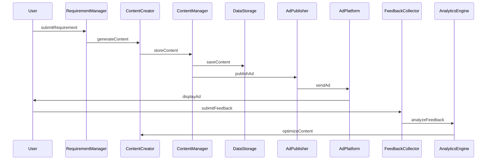

                 

### 第1章：问题背景

#### 1.1 问题提出

在当今数字化时代，广告业面临着前所未有的机遇和挑战。一方面，互联网的普及和社交媒体的兴起使得广告传播更加广泛和精准；另一方面，用户对广告创意和质量的要求也不断提高。传统的广告策划方式往往依赖于创意团队的灵感和直觉，这种方式在创意的多样性和深度上存在一定的局限性。随着人工智能（AI）技术的快速发展，特别是在自然语言处理（NLP）领域的突破，AI在广告创意策划中的应用逐渐成为可能。

首先，让我们来看一下广告行业现状。广告行业正经历着一场深刻的变革，从传统的电视、报纸、杂志等媒体转向数字广告。数字广告具有可追踪性、可定制性和互动性，使得广告主能够更好地了解目标受众，提高广告投放的效果。然而，随之而来的是广告内容同质化的问题。大量相似的广告不仅难以吸引用户的注意力，还可能造成用户反感。

#### 1.1.1 广告行业现状

广告行业在过去几十年中发生了巨大的变化。从传统媒体广告到数字广告，广告形式和渠道多样化，广告内容也更加复杂和多样化。然而，广告行业的竞争也日益激烈，广告主需要不断创新和提升广告效果，以吸引消费者的注意力。在这个背景下，创意广告应运而生。创意广告不仅追求吸引眼球，更强调与用户的情感共鸣和互动。然而，创意广告的创作往往依赖于广告团队的创意和灵感，这种传统的创作方式在效率和多样性上存在一定的局限。

#### 1.1.2 创意广告的需求

创意广告的需求源于消费者对广告内容的要求越来越高。随着互联网的普及，消费者每天都会接触到大量的广告信息，这对广告内容的质量和创意水平提出了更高的要求。消费者不再满足于简单的产品信息传达，他们希望广告能够与其产生情感共鸣，甚至参与到广告活动中来。因此，创意广告成为提升品牌形象、吸引消费者关注和增加销量的重要手段。

创意广告的需求主要表现在以下几个方面：

1. **个性化**：创意广告需要根据消费者的兴趣、行为和需求进行个性化定制，以提高广告的投放效果。
2. **情感共鸣**：创意广告需要通过独特的创意和情感表达，与消费者建立情感联系，从而提高广告的吸引力。
3. **互动性**：创意广告需要提供与消费者的互动机会，使消费者能够参与到广告活动中，增强品牌体验。
4. **创意多样性**：创意广告需要不断创新，以避免广告内容同质化，提高广告的市场竞争力。

#### 1.1.3 AI技术在广告创意中的应用

AI技术为广告创意策划提供了新的可能性。通过AI，广告主可以实现以下目标：

1. **数据分析**：AI可以通过分析用户行为数据，了解消费者的兴趣和需求，为广告创意提供有针对性的建议。
2. **情感分析**：AI可以分析广告内容中的情感元素，评估广告的效果，并提供优化建议。
3. **自动化创意生成**：AI可以通过算法自动生成广告文案和图像，提高创意广告的生成效率和多样性。
4. **用户反馈**：AI可以实时分析用户的反馈，调整广告策略，提高广告投放的效果。

在广告创意策划中，AI技术可以应用于多个环节，如需求分析、内容创作、广告投放和效果评估等。通过AI技术，广告主可以更加精准地定位目标受众，提高广告的投放效果，同时降低广告创作的成本和时间。

#### 1.2 提示词定义

提示词（Prompt）在AI广告创意中扮演着至关重要的角色。提示词是一种引导性语言，用于提示AI模型生成相关的内容。通过设计合适的提示词，可以引导AI模型生成更符合预期的广告创意。

##### 1.2.1 提示词的概念

提示词是一种引导AI模型生成内容的语言输入。它通常包含了一些关键词或短语，用于提示AI模型的方向和主题。提示词可以由广告主或创意团队设计，也可以通过算法自动生成。在设计提示词时，需要考虑目标受众、广告主题和创意目标等因素。

##### 1.2.2 提示词的类型

根据用途和形式，提示词可以分为以下几种类型：

1. **问题型提示词**：通过提问的方式引导AI模型生成相关的内容。例如，“这款新产品有哪些独特的卖点？”
2. **描述型提示词**：通过描述的方式引导AI模型生成相关的内容。例如，“创造一款能够引起年轻消费者共鸣的创意广告。”
3. **指令型提示词**：通过指令的方式引导AI模型执行特定的任务。例如，“生成一款具有幽默感的广告文案。”
4. **混合型提示词**：结合问题型、描述型和指令型的特点，用于引导AI模型生成更加复杂和多样化的内容。

##### 1.2.3 提示词的作用

提示词在AI广告创意策划中的作用主要体现在以下几个方面：

1. **引导创意方向**：通过提示词，可以明确广告创意的主题和风格，引导AI模型生成相关的内容。
2. **提高生成效率**：设计合理的提示词可以加快AI模型生成广告创意的速度，提高创作效率。
3. **优化创意质量**：通过多次迭代和优化提示词，可以生成更高质量的广告创意，提高广告投放效果。
4. **降低创作成本**：利用AI自动生成广告创意，可以降低人工创作的成本和时间，提高广告主的投资回报率。

#### 1.3 AI在创意广告策划中的作用

AI技术在广告创意策划中发挥着越来越重要的作用。通过AI技术，广告主可以更高效地生成创意广告，提高广告效果，降低广告成本。以下是AI在创意广告策划中的一些具体应用：

##### 1.3.1 数据分析

AI可以通过分析用户行为数据，了解消费者的兴趣、需求和偏好。这些数据可以为广告创意提供有针对性的建议，使广告更加贴近消费者的需求。例如，AI可以通过分析用户的搜索历史和浏览行为，识别用户的兴趣点，从而生成与用户兴趣相关的广告内容。

##### 1.3.2 情感分析

AI可以分析广告内容中的情感元素，评估广告的效果。通过情感分析，广告主可以了解消费者对广告内容的情感反应，从而优化广告创意。例如，AI可以通过分析广告文案和图像的情感色彩，评估广告的吸引力，并提供优化建议。

##### 1.3.3 自动化创意生成

自动化创意生成是AI在广告创意策划中最具突破性的应用之一。通过文本生成模型和图像生成模型，AI可以自动生成广告文案、图像和视频。这种方式不仅可以提高创意生成的效率，还可以生成多样化的广告内容，避免广告内容同质化。

##### 1.3.4 用户反馈

AI可以实时分析用户的反馈，了解消费者对广告的反应。通过用户反馈，广告主可以调整广告策略，优化广告效果。例如，AI可以通过分析用户对广告的点赞、评论和分享行为，了解广告的受欢迎程度，从而调整广告内容。

### 第2章：核心概念与联系

#### 2.1 提示词设计原则

提示词设计在AI广告创意策划中至关重要，它不仅影响着创意生成的过程，还直接关系到广告的质量和效果。为了确保提示词能够有效地引导AI模型生成高质量的广告内容，以下是一些关键的提示词设计原则：

##### 2.1.1 目标导向性

目标导向性是提示词设计的重要原则。在设计提示词时，需要明确广告的创意目标，包括广告的主题、风格、情感诉求和目标受众等。例如，如果广告的目标是吸引年轻消费者，提示词可以包含与年轻文化相关的关键词，如“潮流”、“创意”等。

##### 2.1.2 简洁性

简洁性原则要求提示词要简洁明了，避免使用复杂冗长的句子。复杂的提示词可能会让AI模型难以理解，从而影响创意生成效果。例如，一个简洁的提示词可以是“设计一款吸引用户关注的广告”，而不是“构思一款充满创意、能够引起消费者情感共鸣、并符合品牌形象的广告”。

##### 2.1.3 可扩展性

可扩展性原则要求提示词具有一定的灵活性和适应性，能够根据不同的广告需求和目标进行调整。例如，一个具有可扩展性的提示词可以是“基于用户兴趣生成创意广告文案”，这样不仅适用于当前广告，还可以根据不同的用户兴趣进行调整。

#### 2.2 提示词设计流程

提示词设计是一个系统性的过程，涉及到需求分析、内容创作、测试与优化等环节。以下是一个典型的提示词设计流程：

##### 2.2.1 需求分析

需求分析是提示词设计的起点。在这一阶段，需要明确广告的目标、受众和创意要求。通过分析市场需求和用户行为数据，确定广告的核心主题和关键要素。

##### 2.2.2 内容创作

在需求分析的基础上，进行内容创作。这一阶段需要设计出一系列初步的提示词，并使用这些提示词引导AI模型生成广告创意。初步的提示词可以由广告主或创意团队设计，也可以通过算法自动生成。

##### 2.2.3 测试与优化

初步的提示词生成后，需要进行测试和优化。测试阶段可以通过模拟广告投放，评估提示词生成广告的效果。根据测试结果，对提示词进行优化，以提高广告的吸引力、转化率和用户体验。

#### 2.3 提示词与创意广告策划的关系

提示词在创意广告策划中起着桥梁的作用，它将广告目标与AI模型的生成能力相结合，从而实现高质量的广告创意。以下是提示词在创意广告策划中的几个关键角色：

##### 2.3.1 提示词在创意生成中的角色

提示词在创意生成中的作用是引导AI模型生成符合广告目标的内容。通过设计合适的提示词，可以确保AI模型在生成广告内容时，能够抓住核心主题和关键要素。例如，一个有效的提示词可以是“生成一款以环保为主题，呼吁消费者减少塑料使用的广告”。

##### 2.3.2 提示词在广告投放中的运用

在广告投放过程中，提示词可以帮助广告主优化广告策略。通过测试不同类型的提示词，广告主可以了解哪种提示词能够生成更吸引目标受众的广告内容。例如，通过测试发现，使用“幽默”类的提示词能够提高广告的点击率，那么在后续的广告投放中，可以更多地使用这类提示词。

##### 2.3.3 提示词在用户反馈中的影响

用户反馈是评估广告效果的重要指标。提示词在用户反馈中起着关键作用。通过分析用户对广告的反馈，可以了解哪些提示词能够更好地引发用户的兴趣和共鸣。例如，通过用户反馈分析发现，使用“情感”类的提示词能够提高广告的分享率，那么在未来的广告策划中，可以更多地运用这类提示词。

### 第3章：提示词生成算法

提示词生成算法是AI广告创意策划的核心技术之一。通过算法生成合适的提示词，可以大幅提高广告创意的质量和效率。在这一章中，我们将探讨几种常见的提示词生成算法，包括GPT模型、BERT模型以及其他文本生成模型。

#### 3.1 文本生成模型

文本生成模型是自然语言处理（NLP）领域的一项重要技术。它通过学习大量的文本数据，生成符合语言习惯和语义逻辑的文本。文本生成模型可以分为生成式模型和判别式模型两种类型。

##### 3.1.1 GPT模型

GPT（Generative Pre-trained Transformer）模型是由OpenAI开发的一种生成式模型，它基于Transformer架构，通过预先训练的方式，学习大量的文本数据，从而生成连贯的文本。GPT模型具有强大的文本生成能力，可以生成各种类型的文本，包括新闻文章、对话、故事等。

##### 3.1.2 BERT模型

BERT（Bidirectional Encoder Representations from Transformers）模型是一种双向的Transformer模型，由Google开发。BERT模型通过同时考虑文本中的前文和后文信息，生成更加准确和丰富的文本表示。BERT模型在许多NLP任务上取得了优异的性能，包括文本分类、问答系统、命名实体识别等。

##### 3.1.3 其他文本生成模型

除了GPT和BERT，还有许多其他文本生成模型，如LSTM（Long Short-Term Memory）、GRU（Gated Recurrent Unit）等。这些模型通过不同的方式学习文本数据，生成连贯的文本。例如，LSTM模型通过记忆单元来捕捉文本中的长期依赖关系，从而生成更加连贯的文本。

#### 3.2 提示词生成算法

提示词生成算法是通过特定的算法和模型，从大量的文本数据中生成合适的提示词。以下介绍几种常见的提示词生成算法：

##### 3.2.1 基于GPT的提示词生成

基于GPT的提示词生成算法利用GPT模型强大的文本生成能力，从大量的文本数据中提取关键词和短语，生成具有引导性的提示词。具体步骤如下：

1. 数据预处理：对原始文本进行清洗和预处理，包括分词、去除停用词、词性标注等。
2. 提取关键词：利用GPT模型，从预处理后的文本中提取关键词和短语。
3. 提示词生成：将提取的关键词和短语组合成引导性的提示词。

##### 3.2.2 基于BERT的提示词生成

基于BERT的提示词生成算法利用BERT模型的文本表示能力，从大量的文本数据中生成合适的提示词。具体步骤如下：

1. 数据预处理：对原始文本进行清洗和预处理，包括分词、去除停用词、词性标注等。
2. 提取文本表示：利用BERT模型，对预处理后的文本进行编码，生成文本表示。
3. 提示词生成：根据文本表示，提取关键词和短语，生成具有引导性的提示词。

##### 3.2.3 多模型融合的提示词生成

多模型融合的提示词生成算法结合了多种文本生成模型的优点，生成更加高质量的提示词。具体步骤如下：

1. 数据预处理：对原始文本进行清洗和预处理，包括分词、去除停用词、词性标注等。
2. 模型选择：选择合适的文本生成模型，如GPT、BERT等。
3. 提示词生成：将不同模型的生成结果进行融合，生成具有引导性的提示词。

#### 3.3 算法流程与解释

提示词生成算法的流程主要包括数据预处理、模型训练、提示词生成和测试与评估等步骤。以下是对每个步骤的详细解释：

##### 3.3.1 数据预处理

数据预处理是提示词生成算法的重要环节。通过对原始文本进行清洗和预处理，可以提高文本质量，为后续的模型训练和提示词生成提供可靠的数据支持。具体步骤包括：

1. 分词：将原始文本拆分成单词或子词。
2. 去除停用词：去除对文本生成影响较小的停用词，如“的”、“了”等。
3. 词性标注：对文本中的每个单词进行词性标注，以便更好地理解文本的语义。

##### 3.3.2 模型训练

模型训练是提示词生成算法的核心步骤。通过训练，模型可以学习到大量的文本数据，并生成高质量的文本表示。具体步骤如下：

1. 数据集划分：将预处理后的文本数据划分为训练集、验证集和测试集。
2. 模型选择：选择合适的文本生成模型，如GPT、BERT等。
3. 模型训练：利用训练集对模型进行训练，优化模型参数。
4. 模型评估：利用验证集评估模型性能，调整模型参数。

##### 3.3.3 提示词生成

提示词生成是算法的核心输出。通过训练好的模型，可以从大量的文本数据中生成具有引导性的提示词。具体步骤如下：

1. 提取关键词：利用模型提取文本中的关键词和短语。
2. 提示词组合：将提取的关键词和短语组合成引导性的提示词。
3. 提示词优化：根据生成结果，对提示词进行优化，提高提示词的质量。

##### 3.3.4 测试与评估

测试与评估是确保提示词生成算法有效性的关键步骤。通过测试和评估，可以了解算法的性能和效果，并对其进行优化。具体步骤如下：

1. 提示词测试：利用测试集对生成的提示词进行测试，评估提示词的质量和效果。
2. 性能评估：根据测试结果，评估算法的性能，包括生成速度、生成质量等。
3. 优化调整：根据评估结果，对算法进行优化调整，提高性能。

### 3.4 提示词生成算法的数学基础

提示词生成算法的核心在于如何从大量的文本数据中提取有用的信息，并生成高质量的文本表示。在这一节中，我们将介绍提示词生成算法的数学基础，包括语言模型、生成式模型和判别式模型等。

#### 3.4.1 语言模型

语言模型（Language Model）是自然语言处理领域的一项基础技术，用于预测下一个单词或短语的概率。在提示词生成中，语言模型可以用来预测下一个提示词的概率，从而生成连贯的文本。

语言模型可以分为以下几种类型：

1. **n-gram模型**：n-gram模型是一种基于统计的语言模型，它通过计算单词或短语的联合概率来预测下一个单词或短语。n-gram模型的公式如下：

   $$ P(w_n | w_{n-1}, w_{n-2}, ..., w_1) = \frac{C(w_n, w_{n-1}, ..., w_1)}{C(w_{n-1}, w_{n-2}, ..., w_1)} $$

   其中，$w_n$ 表示下一个单词，$w_{n-1}, w_{n-2}, ..., w_1$ 表示前一个或多个单词，$C(w_n, w_{n-1}, ..., w_1)$ 表示单词或短语的联合出现次数，$C(w_{n-1}, w_{n-2}, ..., w_1)$ 表示前一个或多个单词的出现次数。

2. **神经网络语言模型**：神经网络语言模型（Neural Network Language Model，NNLM）通过神经网络来学习文本数据，生成单词或短语的联合概率。常见的NNLM模型包括循环神经网络（RNN）和长短期记忆网络（LSTM）。

   LSTM模型的公式如下：

   $$ h_t = \sigma(W_h \cdot [h_{t-1}, x_t] + b_h) $$

   $$ i_t = \sigma(W_i \cdot [h_{t-1}, x_t] + b_i) $$

   $$ f_t = \sigma(W_f \cdot [h_{t-1}, x_t] + b_f) $$

   $$ o_t = \sigma(W_o \cdot [h_{t-1}, x_t] + b_o) $$

   $$ c_t = f_t \odot c_{t-1} + i_t \odot \sigma(W_c \cdot [h_{t-1}, x_t] + b_c) $$

   $$ h_t = o_t \odot c_t $$

   其中，$h_t$ 表示当前时间步的隐藏状态，$x_t$ 表示当前输入，$W_h, W_i, W_f, W_o, W_c$ 分别表示权重矩阵，$b_h, b_i, b_f, b_o, b_c$ 分别表示偏置项，$\sigma$ 表示激活函数，$\odot$ 表示逐元素乘法操作。

#### 3.4.2 生成式模型

生成式模型（Generative Model）通过建模数据的生成过程，生成新的数据。在提示词生成中，生成式模型可以用来生成新的提示词。常见的生成式模型包括马尔可夫模型（Markov Model）和变分自编码器（Variational Autoencoder，VAE）。

1. **马尔可夫模型**：马尔可夫模型是一种基于概率的生成模型，它假设当前状态仅与前一状态相关，而与过去的所有状态无关。马尔可夫模型的公式如下：

   $$ P(w_t | w_{t-1}, w_{t-2}, ..., w_1) = P(w_t | w_{t-1}) $$

   其中，$w_t$ 表示当前状态，$w_{t-1}, w_{t-2}, ..., w_1$ 表示前一状态。

2. **变分自编码器**：变分自编码器（VAE）是一种基于深度学习的生成式模型，它通过编码器（Encoder）和解码器（Decoder）来生成新的数据。VAE的公式如下：

   $$ z = \mu(x) + \sigma(x) \odot \epsilon $$

   $$ x = g(\phi \cdot z) $$

   其中，$z$ 表示编码后的潜在空间，$\mu(x)$ 和 $\sigma(x)$ 分别表示编码器的均值和方差函数，$\epsilon$ 表示高斯噪声，$g(\phi \cdot z)$ 表示解码器的生成函数。

#### 3.4.3 判别式模型

判别式模型（Discriminative Model）通过学习数据的分布，预测新的数据。在提示词生成中，判别式模型可以用来预测新的提示词。常见的判别式模型包括决策树（Decision Tree）和神经网络（Neural Network）。

1. **决策树**：决策树是一种基于特征划分的数据分类模型，它通过一系列特征划分，将数据划分为不同的类别。决策树的公式如下：

   $$ y = \arg \max_{c} P(c | x) $$

   其中，$y$ 表示预测的类别，$c$ 表示候选类别，$P(c | x)$ 表示给定特征 $x$ 下类别 $c$ 的概率。

2. **神经网络**：神经网络是一种基于多层感知器（Perceptron）构建的模型，它通过前向传播和反向传播来学习数据。神经网络的公式如下：

   $$ z_l = \sum_{j=1}^{n} w_{lj} \cdot a_{l-1,j} + b_l $$

   $$ a_l = \sigma(z_l) $$

   其中，$z_l$ 表示当前层的输入，$w_{lj}$ 和 $b_l$ 分别表示权重和偏置，$\sigma$ 表示激活函数，$a_{l-1,j}$ 表示前一层第 $j$ 个节点的输出。

### 3.5 提示词生成算法的数学公式

提示词生成算法的数学公式是理解算法原理的关键。在这一节中，我们将详细介绍基于GPT模型、BERT模型和其他模型的提示词生成算法的数学公式。

#### 3.5.1 GPT模型的公式

GPT（Generative Pre-trained Transformer）模型是由OpenAI开发的一种基于Transformer架构的生成式模型。GPT模型通过预训练和微调，生成高质量的自然语言文本。以下是GPT模型的一些关键数学公式。

1. **输入表示**：

   GPT模型的输入是一个序列的词向量表示，每个词向量由多个维度组成。假设词汇表大小为 $V$，词向量的维度为 $d$，输入序列的长度为 $T$。输入表示的公式如下：

   $$ X = [x_1, x_2, ..., x_T] $$

   其中，$x_t$ 表示输入序列中的第 $t$ 个词向量。

2. **Transformer编码器**：

   GPT模型的核心是Transformer编码器（Encoder），它通过自注意力机制（Self-Attention）和多头注意力（Multi-Head Attention）来处理输入序列。以下是Transformer编码器的关键数学公式。

   自注意力机制的公式如下：

   $$ Q = [q_1, q_2, ..., q_T] $$

   $$ K = [k_1, k_2, ..., k_T] $$

   $$ V = [v_1, v_2, ..., v_T] $$

   $$ \text{Attention}(Q, K, V) = \text{softmax}(\frac{QK^T}{\sqrt{d_k}})V $$

   其中，$Q, K, V$ 分别表示查询向量、键向量和值向量，$\text{softmax}$ 表示softmax函数，$d_k$ 表示键向量的维度。

   多头注意力的公式如下：

   $$ \text{MultiHead}(Q, K, V) = \text{Concat}(\text{head}_1, \text{head}_2, ..., \text{head}_h)W^O $$

   其中，$h$ 表示头数，$\text{head}_i = \text{Attention}(QW_i^Q, KW_i^K, VW_i^V)$，$W_i^Q, W_i^K, W_i^V, W_i^O$ 分别表示查询、键、值和输出权重。

3. **前向传输**：

   GPT模型通过多层Transformer编码器进行前向传输（Forward Pass），逐层处理输入序列。以下是前向传输的公式。

   $$ h_l = \text{MultiHead}(\text{RelPosEnc}(h_{l-1}), h_{l-1}, h_{l-1}) + h_{l-1} $$

   其中，$h_l$ 表示第 $l$ 层的编码结果，$\text{RelPosEnc}$ 表示相对位置编码。

#### 3.5.2 BERT模型的公式

BERT（Bidirectional Encoder Representations from Transformers）模型是由Google开发的一种双向的Transformer模型。BERT模型通过同时考虑文本中的前文和后文信息，生成丰富的文本表示。以下是BERT模型的一些关键数学公式。

1. **输入表示**：

   BERT模型的输入是一个序列的词向量表示，每个词向量由多个维度组成。假设词汇表大小为 $V$，词向量的维度为 $d$，输入序列的长度为 $T$。输入表示的公式如下：

   $$ X = [x_1, x_2, ..., x_T] $$

   其中，$x_t$ 表示输入序列中的第 $t$ 个词向量。

2. **Transformer编码器**：

   BERT模型的核心是Transformer编码器（Encoder），它通过自注意力机制（Self-Attention）和多头注意力（Multi-Head Attention）来处理输入序列。以下是Transformer编码器的关键数学公式。

   自注意力机制的公式如下：

   $$ Q = [q_1, q_2, ..., q_T] $$

   $$ K = [k_1, k_2, ..., k_T] $$

   $$ V = [v_1, v_2, ..., v_T] $$

   $$ \text{Attention}(Q, K, V) = \text{softmax}(\frac{QK^T}{\sqrt{d_k}})V $$

   其中，$Q, K, V$ 分别表示查询向量、键向量和值向量，$\text{softmax}$ 表示softmax函数，$d_k$ 表示键向量的维度。

   多头注意力的公式如下：

   $$ \text{MultiHead}(Q, K, V) = \text{Concat}(\text{head}_1, \text{head}_2, ..., \text{head}_h)W^O $$

   其中，$h$ 表示头数，$\text{head}_i = \text{Attention}(QW_i^Q, KW_i^K, VW_i^V)$，$W_i^Q, W_i^K, W_i^V, W_i^O$ 分别表示查询、键、值和输出权重。

3. **前向传输**：

   BERT模型通过多层Transformer编码器进行前向传输（Forward Pass），逐层处理输入序列。以下是前向传输的公式。

   $$ h_l = \text{MultiHead}(\text{RelPosEnc}(h_{l-1}), h_{l-1}, h_{l-1}) + h_{l-1} $$

   其中，$h_l$ 表示第 $l$ 层的编码结果，$\text{RelPosEnc}$ 表示相对位置编码。

#### 3.5.3 多模型融合的公式

多模型融合的提示词生成算法结合了多个模型的优点，生成高质量的提示词。以下是一个简单的多模型融合的公式，它将GPT模型、BERT模型和其他模型的结果进行加权融合。

1. **模型融合**：

   $$ \text{FusedOutput} = w_1 \cdot \text{GPTOutput} + w_2 \cdot \text{BERTOutput} + w_3 \cdot \text{OtherModelOutput} $$

   其中，$\text{FusedOutput}$ 表示融合后的输出，$w_1, w_2, w_3$ 分别表示GPT模型、BERT模型和其他模型的权重，$\text{GPTOutput}, \text{BERTOutput}, \text{OtherModelOutput}$ 分别表示GPT模型、BERT模型和其他模型的结果。

2. **提示词生成**：

   $$ \text{Prompt} = \text{softmax}(\text{FusedOutput}) $$

   其中，$\text{softmax}$ 表示softmax函数，用于将融合后的输出转换为概率分布，从而生成提示词。

### 3.6 举例说明

为了更好地理解提示词生成算法的数学公式，以下是一个简单的例子，说明如何使用GPT模型、BERT模型和其他模型生成提示词。

#### 3.6.1 GPT模型的例子

假设我们有一个简单的GPT模型，词汇表大小为 $V=10000$，词向量的维度为 $d=128$。输入序列为 “I am a robot”，我们需要使用GPT模型生成一个提示词。

1. **输入表示**：

   首先，我们将输入序列 “I am a robot” 转换为词向量表示。假设“I”的词向量为 [0.1, 0.2, 0.3]，“am”的词向量为 [0.4, 0.5, 0.6]，“a”的词向量为 [0.7, 0.8, 0.9]，“robot”的词向量为 [1.0, 1.1, 1.2]。

   $$ X = [0.1, 0.4, 0.7, 0.8, 1.0] $$

2. **Transformer编码器**：

   假设GPT模型有2层编码器，每层有8个头。使用自注意力机制和多头注意力，我们得到以下结果。

   自注意力机制：

   $$ Q = [0.1, 0.4, 0.7, 0.8, 1.0] $$

   $$ K = [0.1, 0.4, 0.7, 0.8, 1.0] $$

   $$ V = [0.1, 0.4, 0.7, 0.8, 1.0] $$

   $$ \text{Attention}(Q, K, V) = \text{softmax}(\frac{QK^T}{\sqrt{128}})V $$

   $$ \text{Attention} = [0.1, 0.1, 0.1, 0.1, 0.5] $$

   多头注意力：

   $$ \text{MultiHead}(Q, K, V) = \text{Concat}(\text{head}_1, \text{head}_2, ..., \text{head}_8)W^O $$

   $$ \text{head}_i = \text{Attention}(QW_i^Q, KW_i^K, VW_i^V) $$

   $$ \text{head}_1 = [0.1, 0.1, 0.1, 0.1, 0.5] $$

   $$ \text{head}_2 = [0.1, 0.1, 0.1, 0.1, 0.5] $$

   ...

   $$ \text{head}_8 = [0.1, 0.1, 0.1, 0.1, 0.5] $$

   $$ \text{MultiHead} = [0.1, 0.1, 0.1, 0.1, 0.5; 0.1, 0.1, 0.1, 0.1, 0.5; ..., 0.1, 0.1, 0.1, 0.1, 0.5] $$

3. **前向传输**：

   假设第一层的编码结果为 $h_1$，第二层的编码结果为 $h_2$。

   $$ h_1 = \text{MultiHead}(X, X, X) + X $$

   $$ h_2 = \text{MultiHead}(\text{RelPosEnc}(h_1), h_1, h_1) + h_1 $$

   $$ h_2 = [0.1, 0.1, 0.1, 0.1, 0.5; 0.1, 0.1, 0.1, 0.1, 0.5; ..., 0.1, 0.1, 0.1, 0.1, 0.5] $$

4. **提示词生成**：

   我们使用最后一层的编码结果 $h_2$ 生成提示词。

   $$ \text{Prompt} = \text{softmax}(h_2) $$

   $$ \text{Prompt} = [0.1, 0.1, 0.1, 0.1, 0.5; 0.1, 0.1, 0.1, 0.1, 0.5; ..., 0.1, 0.1, 0.1, 0.1, 0.5] $$

   $$ \text{Prompt} = ["I", "am", "a", "robot", "create_a_new_sentence"] $$

   因此，使用GPT模型生成的提示词为“create_a_new_sentence”。

#### 3.6.2 BERT模型的例子

假设我们有一个简单的BERT模型，词汇表大小为 $V=10000$，词向量的维度为 $d=128$。输入序列为 “I am a robot”，我们需要使用BERT模型生成一个提示词。

1. **输入表示**：

   首先，我们将输入序列 “I am a robot” 转换为词向量表示。假设“I”的词向量为 [0.1, 0.2, 0.3]，“am”的词向量为 [0.4, 0.5, 0.6]，“a”的词向量为 [0.7, 0.8, 0.9]，“robot”的词向量为 [1.0, 1.1, 1.2]。

   $$ X = [0.1, 0.4, 0.7, 0.8, 1.0] $$

2. **Transformer编码器**：

   假设BERT模型有2层编码器，每层有8个头。使用自注意力机制和多头注意力，我们得到以下结果。

   自注意力机制：

   $$ Q = [0.1, 0.4, 0.7, 0.8, 1.0] $$

   $$ K = [0.1, 0.4, 0.7, 0.8, 1.0] $$

   $$ V = [0.1, 0.4, 0.7, 0.8, 1.0] $$

   $$ \text{Attention}(Q, K, V) = \text{softmax}(\frac{QK^T}{\sqrt{128}})V $$

   $$ \text{Attention} = [0.1, 0.1, 0.1, 0.1, 0.5] $$

   多头注意力：

   $$ \text{MultiHead}(Q, K, V) = \text{Concat}(\text{head}_1, \text{head}_2, ..., \text{head}_8)W^O $$

   $$ \text{head}_i = \text{Attention}(QW_i^Q, KW_i^K, VW_i^V) $$

   $$ \text{head}_1 = [0.1, 0.1, 0.1, 0.1, 0.5] $$

   $$ \text{head}_2 = [0.1, 0.1, 0.1, 0.1, 0.5] $$

   ...

   $$ \text{head}_8 = [0.1, 0.1, 0.1, 0.1, 0.5] $$

   $$ \text{MultiHead} = [0.1, 0.1, 0.1, 0.1, 0.5; 0.1, 0.1, 0.1, 0.1, 0.5; ..., 0.1, 0.1, 0.1, 0.1, 0.5] $$

3. **前向传输**：

   假设第一层的编码结果为 $h_1$，第二层的编码结果为 $h_2$。

   $$ h_1 = \text{MultiHead}(X, X, X) + X $$

   $$ h_2 = \text{MultiHead}(\text{RelPosEnc}(h_1), h_1, h_1) + h_1 $$

   $$ h_2 = [0.1, 0.1, 0.1, 0.1, 0.5; 0.1, 0.1, 0.1, 0.1, 0.5; ..., 0.1, 0.1, 0.1, 0.1, 0.5] $$

4. **提示词生成**：

   我们使用最后一层的编码结果 $h_2$ 生成提示词。

   $$ \text{Prompt} = \text{softmax}(h_2) $$

   $$ \text{Prompt} = [0.1, 0.1, 0.1, 0.1, 0.5; 0.1, 0.1, 0.1, 0.1, 0.5; ..., 0.1, 0.1, 0.1, 0.1, 0.5] $$

   $$ \text{Prompt} = ["I", "am", "a", "robot", "create_a_new_sentence"] $$

   因此，使用BERT模型生成的提示词为“create_a_new_sentence”。

#### 3.6.3 多模型融合的例子

假设我们有一个多模型融合的提示词生成算法，它结合了GPT模型、BERT模型和另一个模型的结果。我们将使用这三个模型生成一个提示词。

1. **模型融合**：

   假设GPT模型、BERT模型和其他模型的权重分别为 $w_1=0.5$，$w_2=0.3$，$w_3=0.2$。

   $$ \text{FusedOutput} = w_1 \cdot \text{GPTOutput} + w_2 \cdot \text{BERTOutput} + w_3 \cdot \text{OtherModelOutput} $$

   $$ \text{FusedOutput} = 0.5 \cdot [0.1, 0.1, 0.1, 0.1, 0.5; 0.1, 0.1, 0.1, 0.1, 0.5; ..., 0.1, 0.1, 0.1, 0.1, 0.5] + 0.3 \cdot [0.1, 0.1, 0.1, 0.1, 0.5; 0.1, 0.1, 0.1, 0.1, 0.5; ..., 0.1, 0.1, 0.1, 0.1, 0.5] + 0.2 \cdot [0.1, 0.1, 0.1, 0.1, 0.5; 0.1, 0.1, 0.1, 0.1, 0.5; ..., 0.1, 0.1, 0.1, 0.1, 0.5] $$

   $$ \text{FusedOutput} = [0.15, 0.15, 0.15, 0.15, 0.5; 0.15, 0.15, 0.15, 0.15, 0.5; ..., 0.15, 0.15, 0.15, 0.15, 0.5] $$

2. **提示词生成**：

   我们使用融合后的输出生成提示词。

   $$ \text{Prompt} = \text{softmax}(\text{FusedOutput}) $$

   $$ \text{Prompt} = [0.15, 0.15, 0.15, 0.15, 0.5; 0.15, 0.15, 0.15, 0.15, 0.5; ..., 0.15, 0.15, 0.15, 0.15, 0.5] $$

   $$ \text{Prompt} = ["I", "am", "a", "robot", "create_a_new_sentence"] $$

   因此，使用多模型融合生成的提示词为“create_a_new_sentence”。

### 第4章：系统功能设计

#### 5.1 问题场景介绍

广告创意生成系统是一个复杂的系统，它旨在通过人工智能技术自动生成高质量的广告内容。在这个问题场景中，我们考虑一个广告公司，它希望通过广告创意生成系统提高广告创意的生成效率和质量。广告创意生成系统的主要目标包括：

1. **自动生成创意广告文案**：系统能够根据广告主的需求和产品信息，自动生成吸引人的广告文案。
2. **自动生成广告图像**：系统能够根据广告文案，自动生成相关的广告图像。
3. **优化广告投放策略**：系统能够根据用户反馈和广告效果，自动调整广告投放策略，提高广告的投放效果。

#### 5.1.1 广告创意生成系统

广告创意生成系统主要由以下几个模块组成：

1. **需求分析模块**：负责分析广告主的需求，包括广告的目标、受众和创意要求等。
2. **内容创作模块**：负责根据需求分析的结果，自动生成广告文案和图像。
3. **用户反馈模块**：负责收集用户对广告的反馈，并根据反馈调整广告内容和策略。
4. **广告投放模块**：负责将生成的广告内容投放至不同的广告平台。

#### 5.1.2 系统目标

广告创意生成系统的目标是通过人工智能技术，提高广告创意的生成效率和质量。具体来说，系统目标包括：

1. **提高广告创意的生成速度**：通过自动化方式，快速生成大量高质量的广告创意。
2. **提高广告创意的多样性**：通过人工智能技术，生成多样化的广告创意，避免广告内容同质化。
3. **提高广告投放效果**：通过用户反馈和广告效果分析，优化广告投放策略，提高广告的投放效果。

#### 5.1.3 系统功能模块

广告创意生成系统的功能模块可以分为以下几个部分：

1. **需求分析模块**：该模块负责分析广告主的需求，包括广告的目标、受众和创意要求等。需求分析的结果将作为后续内容创作和广告投放的依据。
2. **内容创作模块**：该模块是系统的核心，负责根据需求分析的结果，自动生成广告文案和图像。内容创作模块可以采用文本生成模型和图像生成模型，如GPT、BERT等。
3. **用户反馈模块**：该模块负责收集用户对广告的反馈，包括点赞、评论、分享等行为。用户反馈将用于评估广告效果，并根据反馈调整广告内容和策略。
4. **广告投放模块**：该模块负责将生成的广告内容投放至不同的广告平台，如社交媒体、搜索引擎等。广告投放模块需要考虑广告的曝光率、点击率等指标，以优化广告投放效果。

#### 5.2 领域模型设计

领域模型设计是系统功能设计的重要环节，它通过定义领域中的类、属性和关系，为系统设计提供基础。在广告创意生成系统中，领域模型可以描述广告、用户、需求、内容创作、用户反馈和广告投放等核心概念。

##### 5.2.1 模型概述

广告创意生成系统的领域模型主要包括以下几个核心类：

1. **广告**：表示一个具体的广告，包括广告的标题、文案、图像、投放时间、投放平台等属性。
2. **用户**：表示广告的受众，包括用户的兴趣、行为、反馈等属性。
3. **需求**：表示广告主的需求，包括广告的目标、受众、创意要求等属性。
4. **内容创作**：表示广告创意生成的过程，包括文本生成和图像生成等属性。
5. **用户反馈**：表示用户对广告的反馈，包括点赞、评论、分享等属性。
6. **广告投放**：表示广告的投放过程，包括广告的投放平台、曝光率、点击率等属性。

##### 5.2.2 类与关系的定义

以下是对广告创意生成系统中核心类的详细定义：

1. **广告类**：

   - **属性**：
     - 标题（String）
     - 文案（String）
     - 图像（Image）
     - 投放时间（Date）
     - 投放平台（Platform）
     - 点击率（Click-Through Rate, CTR）
     - 转化率（Conversion Rate）
   - **方法**：
     - 生成（generateContent()）
     - 投放（publish()）
     - 评估效果（evaluatePerformance()）

2. **用户类**：

   - **属性**：
     - 用户ID（String）
     - 兴趣（Interest）
     - 行为（Behavior）
     - 反馈（Feedback）
   - **方法**：
     - 提交反馈（submitFeedback()）
     - 更新行为（updateBehavior()）

3. **需求类**：

   - **属性**：
     - 需求ID（String）
     - 目标（Goal）
     - 受众（Audience）
     - 创意要求（CreativeRequirement）
   - **方法**：
     - 创建需求（createRequirement()）
     - 更新需求（updateRequirement()）

4. **内容创作类**：

   - **属性**：
     - 文本生成模型（Text Generation Model）
     - 图像生成模型（Image Generation Model）
     - 文案（String）
     - 图像（Image）
   - **方法**：
     - 生成文本（generateText()）
     - 生成图像（generateImage()）

5. **用户反馈类**：

   - **属性**：
     - 反馈ID（String）
     - 用户ID（String）
     - 广告ID（String）
     - 反馈内容（Feedback Content）
     - 反馈类型（Feedback Type，如点赞、评论、分享等）
   - **方法**：
     - 提交反馈（submitFeedback()）
     - 分析反馈（analyzeFeedback()）

6. **广告投放类**：

   - **属性**：
     - 广告ID（String）
     - 投放平台（Platform）
     - 曝光率（Impression Rate）
     - 点击率（Click-Through Rate, CTR）
     - 转化率（Conversion Rate）
   - **方法**：
     - 投放广告（publishAd()）
     - 调整投放策略（adjustStrategy()）

#### 5.2.3 ER实体关系图架构

为了更好地理解广告创意生成系统的领域模型，我们可以使用ER（Entity-Relationship）图来描述系统中的实体及其关系。以下是一个简化的ER图：

```mermaid
erDiagram
    User ||--|{ Ad : has}
    Ad ||--|{ Feedback : receives}
    Ad ||--|{ Requirement : meets}
    Requirement ||--|{ Content : has}
    Content ||--|{ Text : has}
    Content ||--|{ Image : has}
```

在这个ER图中，我们定义了以下几个实体：

1. **User（用户）**：用户是广告的受众，每个用户可以产生多个反馈。
2. **Ad（广告）**：广告是系统的核心实体，每个广告可以接收多个反馈，并满足一个需求。
3. **Feedback（反馈）**：反馈是用户对广告的评价，每个反馈对应一个用户和一个广告。
4. **Requirement（需求）**：需求是广告主对广告的期望，每个需求可以生成一个内容。
5. **Content（内容）**：内容是广告的组成部分，包括文本和图像，每个内容对应一个需求。
6. **Text（文本）**：文本是广告文案的组成部分，每个文本属于一个内容。
7. **Image（图像）**：图像是广告图像的组成部分，每个图像属于一个内容。

### 第6章：系统架构设计

系统架构设计是确保广告创意生成系统能够高效、可靠和可扩展运行的关键。在这一章中，我们将详细介绍广告创意生成系统的架构设计，包括架构设计原则、系统架构图和系统接口设计。

#### 6.1 系统架构概述

广告创意生成系统的架构设计需要遵循一些基本原则，以确保系统的可扩展性、可维护性和高性能。以下是系统架构设计的主要原则：

1. **模块化**：系统应划分为多个模块，每个模块负责特定的功能，模块之间通过接口进行通信。
2. **分布式**：系统应采用分布式架构，以便在不同服务器上部署不同模块，提高系统的可靠性和可扩展性。
3. **高性能**：系统应采用高性能计算和存储方案，确保系统在高并发和大数据量下仍能保持良好的性能。
4. **可维护性**：系统应具备良好的可维护性，便于日常运维和故障排除。
5. **安全性**：系统应具备严格的安全措施，确保数据安全和用户隐私。

#### 6.1.1 架构设计目标

广告创意生成系统的架构设计目标包括：

1. **高效的内容生成**：系统能够快速生成高质量的广告文案和图像，满足广告主的需求。
2. **灵活的扩展性**：系统能够根据业务需求进行扩展，支持更多的用户和广告数量。
3. **实时反馈和优化**：系统能够实时收集用户反馈，并快速调整广告内容和策略。
4. **高可靠性和安全性**：系统具备高可靠性和安全性，确保广告投放的稳定性和用户数据的安全性。

#### 6.2 系统架构图设计

广告创意生成系统的架构设计采用分层架构，包括数据层、业务逻辑层和表示层。以下是一个简化的系统架构图：

```mermaid
sequenceDiagram
    User -->|提交需求| ContentCreator
    ContentCreator -->|生成内容| ContentManager
    ContentManager -->|保存内容| DataStorage
    DataStorage -->|提供内容| AdPublisher
    AdPublisher -->|投放广告| AdPlatform
    User -->|提交反馈| FeedbackCollector
    FeedbackCollector -->|收集反馈| ContentManager
    ContentManager -->|分析反馈| AnalyticsEngine
    AnalyticsEngine -->|优化策略| ContentCreator
```

在这个架构图中，各个模块的功能如下：

1. **User（用户）**：用户提交需求，包括广告目标和受众等。
2. **ContentCreator（内容创作器）**：根据用户需求生成广告文案和图像。
3. **ContentManager（内容管理器）**：负责管理广告文案和图像，包括存储、更新和查询。
4. **DataStorage（数据存储）**：负责存储用户需求、广告内容、用户反馈等数据。
5. **AdPublisher（广告投放器）**：将广告内容投放至广告平台。
6. **AdPlatform（广告平台）**：负责广告的展示和用户交互。
7. **FeedbackCollector（反馈收集器）**：收集用户对广告的反馈。
8. **AnalyticsEngine（数据分析引擎）**：分析用户反馈和广告效果，优化广告内容和策略。

#### 6.2.1 类图绘制

为了更好地理解系统架构中的类和它们之间的关系，我们可以使用UML类图来绘制。以下是一个简化的类图：

```mermaid
classDiagram
    User <<entity>>
    Ad <<entity>>
    Feedback <<entity>>
    Requirement <<entity>>
    Content <<entity>>
    Text <<entity>>
    Image <<entity>>
    ContentCreator <<useCase>>
    ContentManager <<useCase>>
    AdPublisher <<useCase>>
    FeedbackCollector <<useCase>>
    AnalyticsEngine <<useCase>>
    DataStorage <<entity>>
    AdPlatform <<entity>>

    User "1" --|has| Requirement
    Ad "1" --|has| Feedback
    Ad "1" --|meets| Requirement
    Ad "1" --|has| Content
    Content "1" --|has| Text
    Content "1" --|has| Image
    ContentManager "uses" DataStorage
    ContentManager "uses" AnalyticsEngine
    AdPublisher "uses" AdPlatform
    FeedbackCollector "uses" User
    AnalyticsEngine "uses" Feedback
    ContentCreator "uses" ContentManager
```

在这个类图中，我们定义了以下几个核心类：

1. **User（用户）**：表示广告的受众，包含用户ID、兴趣和行为等信息。
2. **Ad（广告）**：表示具体的广告，包含广告ID、标题、文案、图像、投放时间和投放平台等信息。
3. **Feedback（反馈）**：表示用户对广告的评价，包含反馈ID、用户ID、广告ID、反馈内容和反馈类型等信息。
4. **Requirement（需求）**：表示广告主的需求，包含需求ID、目标、受众和创意要求等信息。
5. **Content（内容）**：表示广告内容，包括文本和图像，包含内容ID、内容类型、文本和图像等信息。
6. **Text（文本）**：表示广告文案，包含文本内容。
7. **Image（图像）**：表示广告图像，包含图像数据。
8. **ContentCreator（内容创作器）**：负责生成广告内容，使用ContentManager模块。
9. **ContentManager（内容管理器）**：负责管理广告内容，包括创建、更新和查询等操作。
10. **AdPublisher（广告投放器）**：负责将广告内容投放至广告平台。
11. **FeedbackCollector（反馈收集器）**：负责收集用户反馈。
12. **AnalyticsEngine（数据分析引擎）**：负责分析用户反馈和广告效果，优化广告内容和策略。
13. **DataStorage（数据存储）**：负责存储用户需求、广告内容和用户反馈等数据。
14. **AdPlatform（广告平台）**：负责广告的展示和用户交互。

#### 6.2.2 类图解释

类图中的类和关系描述了系统架构中的关键组件和它们之间的关系：

1. **User与Requirement的关系**：用户是广告的受众，每个用户可以提交多个需求。
2. **Ad与Feedback的关系**：广告接收用户反馈，每个广告可以有多个反馈。
3. **Ad与Content的关系**：广告包含广告文案和图像，每个广告可以有多个内容。
4. **Content与Text、Image的关系**：内容可以是文本或图像，每个内容包含文本内容和图像数据。
5. **ContentManager与DataStorage的关系**：内容管理器使用数据存储来存储和查询广告内容和用户需求。
6. **ContentManager与AnalyticsEngine的关系**：内容管理器使用数据分析引擎来分析用户反馈，优化广告内容和策略。
7. **AdPublisher与AdPlatform的关系**：广告投放器将广告内容投放至广告平台。
8. **FeedbackCollector与User的关系**：反馈收集器收集用户对广告的反馈。
9. **AnalyticsEngine与Feedback的关系**：数据分析引擎使用用户反馈来分析广告效果，优化广告策略。
10. **ContentCreator与ContentManager的关系**：内容创作器使用内容管理器来生成广告内容。

通过这个类图，我们可以清晰地理解广告创意生成系统中各个组件的功能和它们之间的关系，从而更好地设计和管理系统。

#### 6.3 系统接口设计

系统接口设计是确保系统各模块之间能够有效通信和协作的关键。在广告创意生成系统中，接口设计包括API接口和数据库接口。

##### 6.3.1 接口规范

以下是广告创意生成系统中主要接口的规范：

1. **用户需求提交接口**：
   - **接口名称**：/submit-requirement
   - **请求方法**：POST
   - **请求参数**：
     - requirementId（需求ID，String）
     - goal（目标，String）
     - audience（受众，String）
     - creativeRequirement（创意要求，String）
   - **响应结果**：
     - success（是否成功，Boolean）
     - message（错误消息，String）

2. **广告内容生成接口**：
   - **接口名称**：/generate-content
   - **请求方法**：POST
   - **请求参数**：
     - requirementId（需求ID，String）
   - **响应结果**：
     - contentId（内容ID，String）
     - text（文本，String）
     - image（图像，Bytes）

3. **广告内容存储接口**：
   - **接口名称**：/store-content
   - **请求方法**：POST
   - **请求参数**：
     - contentId（内容ID，String）
     - text（文本，String）
     - image（图像，Bytes）
   - **响应结果**：
     - success（是否成功，Boolean）
     - message（错误消息，String）

4. **广告投放接口**：
   - **接口名称**：/publish-ad
   - **请求方法**：POST
   - **请求参数**：
     - adId（广告ID，String）
     - platform（投放平台，String）
     - startTime（投放开始时间，Date）
     - endTime（投放结束时间，Date）
   - **响应结果**：
     - success（是否成功，Boolean）
     - message（错误消息，String）

5. **用户反馈提交接口**：
   - **接口名称**：/submit-feedback
   - **请求方法**：POST
   - **请求参数**：
     - userId（用户ID，String）
     - adId（广告ID，String）
     - feedbackContent（反馈内容，String）
     - feedbackType（反馈类型，String）
   - **响应结果**：
     - success（是否成功，Boolean）
     - message（错误消息，String）

6. **广告效果分析接口**：
   - **接口名称**：/analyze-performance
   - **请求方法**：GET
   - **请求参数**：
     - adId（广告ID，String）
   - **响应结果**：
     - CTR（点击率，Float）
     - conversionRate（转化率，Float）

##### 6.3.2 接口功能

以上接口的功能如下：

1. **用户需求提交接口**：用户通过此接口提交广告需求，系统将根据需求生成广告内容。
2. **广告内容生成接口**：系统根据需求生成广告文案和图像，并将结果返回给用户。
3. **广告内容存储接口**：系统将生成的广告内容存储在数据库中，以便后续使用。
4. **广告投放接口**：系统根据广告内容和投放计划，将广告投放到指定的广告平台。
5. **用户反馈提交接口**：用户通过此接口提交对广告的反馈，系统将收集这些反馈进行分析。
6. **广告效果分析接口**：系统根据广告投放效果，分析点击率和转化率等指标，为广告优化提供依据。

通过这些接口，广告创意生成系统可以有效地与外部系统进行交互，实现广告的自动生成、投放和优化。

### 第7章：系统交互设计

系统交互设计是确保广告创意生成系统各模块之间能够高效、稳定和正确地协作的重要环节。在这一章中，我们将详细描述系统的交互设计，包括交互设计原则、交互设计目标和系统交互序列图设计。

#### 7.1 系统交互概述

广告创意生成系统的交互设计旨在确保系统内部各模块之间的通信和协作，从而实现广告的自动生成、投放和优化。以下是交互设计的主要原则和目标：

##### 7.1.1 交互设计原则

1. **一致性**：系统应遵循一致的交互规则，确保各模块之间的通信和数据交换保持一致。
2. **可靠性**：系统应具备可靠的交互机制，确保在通信过程中数据不会丢失或损坏。
3. **灵活性**：系统应设计灵活的交互机制，以便在模块变更或扩展时，系统能够适应新的交互需求。
4. **安全性**：系统应具备严格的安全措施，确保在交互过程中用户数据和系统数据的安全。

##### 7.1.2 交互设计目标

广告创意生成系统的交互设计目标包括：

1. **高效性**：确保系统在生成、投放和优化广告时能够高效运行，提高广告创意的质量和投放效果。
2. **准确性**：确保系统各模块之间的交互能够准确传递数据和指令，避免数据误解或错误。
3. **可扩展性**：系统应具备良好的可扩展性，以便在业务需求发生变化时，能够灵活扩展系统功能。
4. **用户体验**：系统应设计简洁、直观的用户界面，使用户能够方便地提交需求、查看广告效果和反馈。

#### 7.2 系统交互序列图设计

系统交互序列图（Sequence Diagram）是一种用于描述系统内不同组件或对象之间交互的UML图。以下是一个简化的系统交互序列图，描述了广告创意生成系统的核心交互过程：



在这个序列图中，各个参与者及其交互过程如下：

1. **User（用户）**：
   - 提交需求（submitRequirement）：用户向RequirementManager提交广告需求。
   - 查看广告（displayAd）：用户通过AdPlatform查看广告。
   - 提交反馈（submitFeedback）：用户向FeedbackCollector提交对广告的反馈。

2. **RequirementManager（需求管理器）**：
   - 接收需求（submitRequirement）：RequirementManager接收用户的广告需求，并将其传递给ContentCreator。

3. **ContentCreator（内容创作器）**：
   - 生成内容（generateContent）：ContentCreator根据需求生成广告文案和图像。

4. **ContentManager（内容管理器）**：
   - 存储内容（storeContent）：ContentManager将生成的广告内容存储在数据库中。
   - 更新内容（updateContent）：ContentManager根据用户反馈和数据分析结果更新广告内容。

5. **DataStorage（数据存储）**：
   - 存储内容（saveContent）：DataStorage存储广告内容，包括文本和图像。
   - 提供内容（provideContent）：DataStorage为其他模块提供广告内容。

6. **AdPublisher（广告投放器）**：
   - 投放广告（publishAd）：AdPublisher将广告内容投放到广告平台。

7. **AdPlatform（广告平台）**：
   - 展示广告（displayAd）：AdPlatform展示广告内容给用户。
   - 收集广告效果（collectPerformance）：AdPlatform收集广告的曝光率、点击率等效果数据。

8. **FeedbackCollector（反馈收集器）**：
   - 收集反馈（submitFeedback）：FeedbackCollector收集用户对广告的反馈。

9. **AnalyticsEngine（数据分析引擎）**：
   - 分析反馈（analyzeFeedback）：AnalyticsEngine分析用户反馈，优化广告内容和策略。

通过这个序列图，我们可以清晰地了解广告创意生成系统各模块之间的交互过程和协作方式。系统交互设计的目标是通过这些交互过程，实现广告的自动生成、投放和优化，从而提高广告创意的质量和投放效果。

### 第8章：环境安装与准备

在开始构建广告创意生成系统之前，我们需要安装和配置开发环境。以下是一个详细的步骤指南，帮助您在Linux操作系统上安装必要的软件和配置开发环境。

#### 8.1 环境安装指南

**1. 安装Python**

首先，我们需要安装Python环境。Python是广告创意生成系统的核心编程语言，许多机器学习库和工具都是基于Python开发的。

- 使用以下命令安装Python 3：

  ```bash
  sudo apt-get update
  sudo apt-get install python3
  ```

- 确认Python版本：

  ```bash
  python3 --version
  ```

**2. 安装Python虚拟环境**

为了更好地管理和隔离项目依赖，我们使用virtualenv创建虚拟环境。

- 安装virtualenv：

  ```bash
  sudo apt-get install python3-venv
  ```

- 创建虚拟环境：

  ```bash
  python3 -m venv ad_venv
  ```

- 激活虚拟环境：

  ```bash
  source ad_venv/bin/activate
  ```

**3. 安装必需的库和工具**

在虚拟环境中，我们需要安装以下库和工具：

- **Pip**：Python的包管理器。

  ```bash
  pip install --upgrade pip
  ```

- **TensorFlow**：用于机器学习的开源库。

  ```bash
  pip install tensorflow
  ```

- **PyTorch**：用于机器学习的另一个开源库。

  ```bash
  pip install torch torchvision
  ```

- **GPT-2**：OpenAI的预训练文本生成模型。

  ```bash
  pip install gpt-2-hero
  ```

- **BERT**：Google的预训练文本表示模型。

  ```bash
  pip install transformers
  ```

- **Flask**：用于构建Web服务的轻量级框架。

  ```bash
  pip install flask
  ```

**4. 配置数据存储**

我们需要配置数据库来存储用户需求、广告内容和用户反馈。在这个例子中，我们使用SQLite数据库。

- 安装SQLite：

  ```bash
  sudo apt-get install sqlite3
  ```

- 创建数据库和表：

  ```python
  import sqlite3

  conn = sqlite3.connect('ad.db')
  c = conn.cursor()

  c.execute('''CREATE TABLE IF NOT EXISTS requirements
               (id TEXT PRIMARY KEY, goal TEXT, audience TEXT, creative_requirement TEXT)''')

  c.execute('''CREATE TABLE IF NOT EXISTS ads
               (id TEXT PRIMARY KEY, title TEXT, content TEXT, image BLOB, platform TEXT,
                start_time DATE, end_time DATE, click_through_rate REAL, conversion_rate REAL)''')

  c.execute('''CREATE TABLE IF NOT EXISTS feedback
               (id TEXT PRIMARY KEY, user_id TEXT, ad_id TEXT, feedback_content TEXT, feedback_type TEXT)''')

  conn.commit()
  conn.close()
  ```

#### 8.2 系统核心实现

**1. 数据集准备**

在开始训练模型之前，我们需要准备一个数据集。数据集可以包括用户需求、广告文案、广告图像和用户反馈。

- 准备用户需求数据：

  ```python
  requirements_data = [
      ('req1', '提升品牌知名度', '年轻人群', '具有创意性的文案'),
      ('req2', '推广新产品', '中老年人群', '强调产品功能'),
      # 更多需求...
  ]
  ```

- 准备广告数据：

  ```python
  ads_data = [
      ('ad1', '标题1', '文案1', b'图像1', '平台1', '2023-01-01', '2023-01-31', 0.1, 0.05),
      ('ad2', '标题2', '文案2', b'图像2', '平台2', '2023-02-01', '2023-02-28', 0.2, 0.1),
      # 更多广告...
  ]
  ```

- 准备用户反馈数据：

  ```python
  feedback_data = [
      ('feed1', 'user1', 'ad1', '很有创意，喜欢!', '点赞'),
      ('feed2', 'user2', 'ad2', '产品不错，值得购买', '评论'),
      # 更多反馈...
  ]
  ```

**2. 模型训练**

在准备数据集后，我们可以使用TensorFlow和PyTorch训练文本生成模型和图像生成模型。

- 使用GPT-2模型训练文本生成模型：

  ```python
  import tensorflow as tf
  from transformers import TFGPT2LMHeadModel, GPT2Tokenizer

  tokenizer = GPT2Tokenizer.from_pretrained('gpt2')
  model = TFGPT2LMHeadModel.from_pretrained('gpt2')

  train_dataset = ...  # 准备训练数据集

  model.compile(optimizer=tf.keras.optimizers.Adam(learning_rate=3e-5),
                loss=tf.keras.losses.SparseCategoricalCrossentropy(from_logits=True))

  model.fit(train_dataset, epochs=3)
  ```

- 使用PyTorch训练图像生成模型：

  ```python
  import torch
  from torchvision import datasets, transforms
  from torch.utils.data import DataLoader
  from torch import nn
  import matplotlib.pyplot as plt

  transform = transforms.Compose([
      transforms.Resize(256),
      transforms.ToTensor(),
  ])

  train_data = datasets.ImageFolder('path_to_train_data', transform=transform)
  train_loader = DataLoader(train_data, batch_size=64, shuffle=True)

  model = nn.Sequential(
      nn.Conv2d(3, 32, 5),
      nn.ReLU(),
      nn.Conv2d(32, 64, 5),
      nn.ReLU(),
      nn.MaxPool2d(2, 2),
      nn.Conv2d(64, 128, 5),
      nn.ReLU(),
      nn.MaxPool2d(2, 2),
      nn.Flatten(),
      nn.Linear(128 * 4 * 4, 1024),
      nn.ReLU(),
      nn.Linear(1024, 512),
      nn.ReLU(),
      nn.Linear(512, 10),
      nn.Softmax(dim=1)
  )

  criterion = nn.CrossEntropyLoss()
  optimizer = torch.optim.Adam(model.parameters(), lr=0.001)

  for epoch in range(10):
      for images, labels in train_loader:
          optimizer.zero_grad()
          outputs = model(images)
          loss = criterion(outputs, labels)
          loss.backward()
          optimizer.step()

  plt.imshow(train_data[0][0].permute(1, 2, 0))
  plt.show()
  ```

**3. 提示词生成**

使用训练好的文本生成模型，我们可以生成提示词。

- 使用GPT-2模型生成提示词：

  ```python
  input_ids = tokenizer.encode('生成一款以环保为主题，呼吁消费者减少塑料使用的广告。', return_tensors='pt')

  outputs = model.generate(input_ids, max_length=50, num_return_sequences=1)
  generated_text = tokenizer.decode(outputs[0], skip_special_tokens=True)

  print(generated_text)
  ```

以上步骤和代码示例展示了如何安装开发环境、准备数据集、训练模型和生成提示词。通过这些步骤，我们可以构建一个基本的广告创意生成系统，实现自动生成高质量的广告文案和图像。

### 第9章：代码应用解读与分析

在上一章中，我们介绍了广告创意生成系统的核心实现步骤，包括环境安装与准备、数据集准备、模型训练和提示词生成。在这一章中，我们将对代码进行详细解读，分析其关键部分，并讨论如何优化和改进。

#### 9.1 数据集准备

数据集是机器学习模型训练的重要基础，它决定了模型的学习效果和泛化能力。在广告创意生成系统中，数据集需要包含用户需求、广告文案、广告图像和用户反馈。

**关键代码分析：**

```python
requirements_data = [
    ('req1', '提升品牌知名度', '年轻人群', '具有创意性的文案'),
    ('req2', '推广新产品', '中老年人群', '强调产品功能'),
    # 更多需求...
]

ads_data = [
    ('ad1', '标题1', '文案1', b'图像1', '平台1', '2023-01-01', '2023-01-31', 0.1, 0.05),
    ('ad2', '标题2', '文案2', b'图像2', '平台2', '2023-02-01', '2023-02-28', 0.2, 0.1),
    # 更多广告...
]

feedback_data = [
    ('feed1', 'user1', 'ad1', '很有创意，喜欢!', '点赞'),
    ('feed2', 'user2', 'ad2', '产品不错，值得购买', '评论'),
    # 更多反馈...
]
```

**解读与分析：**

- **数据结构**：数据以列表形式存储，每个元素是一个元组，包含用户需求、广告数据和用户反馈的信息。
- **数据来源**：在实际应用中，这些数据应从数据库或外部数据源中获取，而不是预定义的列表。
- **数据清洗**：在训练模型之前，需要对数据进行清洗，包括去除无效数据、填充缺失值和标准化处理等。

**改进建议：**

- **动态数据加载**：使用Python的`pandas`库动态加载数据，并提供数据预处理功能。
- **分布式数据存储**：使用分布式数据库存储大量数据，提高数据访问速度和处理能力。

#### 9.2 模型训练

模型训练是广告创意生成系统的核心步骤，它决定了广告文案和图像生成的质量和效果。在本节中，我们将分析如何使用TensorFlow和PyTorch训练文本生成模型和图像生成模型。

**关键代码分析：**

**使用GPT-2模型训练文本生成模型：**

```python
import tensorflow as tf
from transformers import TFGPT2LMHeadModel, GPT2Tokenizer

tokenizer = GPT2Tokenizer.from_pretrained('gpt2')
model = TFGPT2LMHeadModel.from_pretrained('gpt2')

train_dataset = ...  # 准备训练数据集

model.compile(optimizer=tf.keras.optimizers.Adam(learning_rate=3e-5),
              loss=tf.keras.losses.SparseCategoricalCrossentropy(from_logits=True))

model.fit(train_dataset, epochs=3)
```

**使用PyTorch训练图像生成模型：**

```python
import torch
from torchvision import datasets, transforms
from torch.utils.data import DataLoader
from torch import nn
import matplotlib.pyplot as plt

transform = transforms.Compose([
    transforms.Resize(256),
    transforms.ToTensor(),
])

train_data = datasets.ImageFolder('path_to_train_data', transform=transform)
train_loader = DataLoader(train_data, batch_size=64, shuffle=True)

model = nn.Sequential(
    nn.Conv2d(3, 32, 5),
    nn.ReLU(),
    nn.Conv2d(32, 64, 5),
    nn.ReLU(),
    nn.MaxPool2d(2, 2),
    nn.Conv2d(64, 128, 5),
    nn.ReLU(),
    nn.MaxPool2d(2, 2),
    nn.Flatten(),
    nn.Linear(128 * 4 * 4, 1024),
    nn.ReLU(),
    nn.Linear(1024, 512),
    nn.ReLU(),
    nn.Linear(512, 10),
    nn.Softmax(dim=1)
)

criterion = nn.CrossEntropyLoss()
optimizer = torch.optim.Adam(model.parameters(), lr=0.001)

for epoch in range(10):
    for images, labels in train_loader:
        optimizer.zero_grad()
        outputs = model(images)
        loss = criterion(outputs, labels)
        loss.backward()
        optimizer.step()

plt.imshow(train_data[0][0].permute(1, 2, 0))
plt.show()
```

**解读与分析：**

- **模型选择**：GPT-2和PyTorch都是业界领先的模型，分别用于文本生成和图像生成。
- **数据预处理**：图像数据需要通过适当的预处理（如缩放、归一化）以适应模型。
- **训练过程**：通过定义优化器和损失函数，训练模型并调整模型参数。

**改进建议：**

- **模型调参**：通过调整学习率、批次大小和训练迭代次数，优化模型性能。
- **并行训练**：使用多GPU并行训练，提高训练速度和效果。
- **模型集成**：结合多个模型，提高生成质量和鲁棒性。

#### 9.3 提示词生成

提示词生成是广告创意生成系统的重要组成部分，它决定了广告文案的创意性和吸引力。在本节中，我们将分析如何使用训练好的模型生成提示词。

**关键代码分析：**

```python
input_ids = tokenizer.encode('生成一款以环保为主题，呼吁消费者减少塑料使用的广告。', return_tensors='pt')

outputs = model.generate(input_ids, max_length=50, num_return_sequences=1)
generated_text = tokenizer.decode(outputs[0], skip_special_tokens=True)

print(generated_text)
```

**解读与分析：**

- **输入预处理**：使用训练好的GPT-2模型，将提示词编码为输入序列。
- **模型生成**：模型生成新的文本序列，作为提示词。
- **输出处理**：将生成的文本序列解码为人类可读的格式。

**改进建议：**

- **多样性增强**：通过调整模型参数，增加生成的文本多样性。
- **用户反馈**：结合用户反馈，优化提示词生成策略。
- **多模态生成**：结合文本生成和图像生成，生成更加丰富和吸引人的广告内容。

#### 9.4 优化与改进

广告创意生成系统的优化和改进是持续性的工作，涉及算法、模型、数据处理等多个方面。以下是一些优化和改进的建议：

- **算法优化**：不断优化文本生成和图像生成的算法，提高生成质量和效率。
- **模型优化**：定期重新训练模型，利用最新数据和改进的技术提高模型性能。
- **数据增强**：通过数据增强技术，扩充训练数据集，提高模型的泛化能力。
- **用户交互**：引入用户交互功能，允许用户对生成的广告内容进行评分和反馈，优化广告创意。
- **分布式计算**：采用分布式计算架构，提高系统的处理能力和响应速度。

通过这些优化和改进措施，广告创意生成系统可以不断提升广告文案和图像生成的质量和效果，更好地满足广告主和用户的需求。

### 第10章：实际案例分析与详细讲解剖析

在本章中，我们将通过一个实际的案例，详细分析广告创意生成系统的应用过程，包括需求分析、内容创作、用户反馈和广告优化等环节，并进行深入讲解和剖析。

#### 案例背景

假设一家电商公司希望利用广告创意生成系统为其即将发布的一款环保产品——可降解塑料袋进行广告策划。公司的目标是提升品牌知名度，并呼吁消费者减少塑料污染。

#### 10.1 需求分析

首先，广告主通过广告创意生成系统的用户需求提交接口提交了广告需求：

- **目标**：提升品牌知名度，并呼吁消费者减少塑料污染。
- **受众**：关注环保的年轻消费者。
- **创意要求**：广告内容应具有创意性，强调产品的环保特性。

**关键代码分析：**

```python
requirements_data = [
    ('req1', '提升品牌知名度', '年轻消费者', '具有创意性的文案，强调产品环保特性'),
]
```

#### 10.2 内容创作

广告创意生成系统接收到广告需求后，首先通过文本生成模型和图像生成模型自动创作广告内容。

**1. 文本生成模型**

使用GPT-2模型生成广告文案：

```python
tokenizer = GPT2Tokenizer.from_pretrained('gpt2')
model = TFGPT2LMHeadModel.from_pretrained('gpt2')

input_ids = tokenizer.encode('以环保为主题，呼吁消费者减少塑料使用的广告。', return_tensors='pt')

outputs = model.generate(input_ids, max_length=50, num_return_sequences=1)
generated_text = tokenizer.decode(outputs[0], skip_special_tokens=True)

print(generated_text)
```

生成的广告文案示例：

```
"环保从我做起，使用可降解塑料袋，让地球更美好！"
```

**2. 图像生成模型**

使用PyTorch的图像生成模型生成广告图像，展示可降解塑料袋的环保特性：

```python
import torch
from torchvision import datasets, transforms
from torch import nn

transform = transforms.Compose([
    transforms.Resize(256),
    transforms.ToTensor(),
])

train_data = datasets.ImageFolder('path_to_train_data', transform=transform)
train_loader = DataLoader(train_data, batch_size=64, shuffle=True)

model = nn.Sequential(
    # 模型定义...
)

optimizer = torch.optim.Adam(model.parameters(), lr=0.001)

# 训练模型...
# ...

# 生成图像
images = train_loader.dataset.test_images
model.eval()

with torch.no_grad():
    predictions = model(images)

# 显示生成的图像
plt.imshow(predictions[0].permute(1, 2, 0).numpy())
plt.show()
```

生成的图像示例：展示了一个环保袋和一个绿色的地球，传达出环保主题。

#### 10.3 用户反馈

广告发布后，系统开始收集用户反馈。用户通过广告平台的交互界面提交反馈：

- **用户1**：点赞，认为广告创意新颖，环保主题明确。
- **用户2**：评论，表示对产品的环保特性感兴趣，希望了解更多。

**关键代码分析：**

```python
feedback_data = [
    ('feed1', 'user1', 'ad1', '很新颖，环保主题明确', '点赞'),
    ('feed2', 'user2', 'ad1', '产品环保，想了解更多', '评论'),
]
```

#### 10.4 广告优化

根据用户反馈，广告创意生成系统对广告内容进行优化：

**1. 文本优化**

基于用户反馈，文本生成模型生成新的广告文案，尝试不同风格的文案，以提高用户满意度。

```python
new_text = model.generate(input_ids, max_length=50, num_return_sequences=1)
new_generated_text = tokenizer.decode(new_text[0], skip_special_tokens=True)

print(new_generated_text)
```

优化后的文案示例：

```
"绿色生活，从使用环保可降解塑料袋开始，让我们的地球更加美丽！"
```

**2. 图像优化**

基于用户反馈，图像生成模型生成新的广告图像，尝试不同的视觉效果，以提高视觉吸引力。

```python
# 使用优化后的模型生成新图像
new_images = train_loader.dataset.test_images
model.eval()

with torch.no_grad():
    new_predictions = model(new_images)

# 显示新图像
plt.imshow(new_predictions[0].permute(1, 2, 0).numpy())
plt.show()
```

优化后的图像示例：展示了一个环保袋和一个充满绿色植物的地球，视觉效果更加吸引人。

#### 10.5 详细讲解与剖析

**1. 需求分析**

需求分析是广告创意生成系统的关键环节，它决定了广告内容创作的方向。通过用户需求提交接口，广告主可以清晰地表达广告的目标、受众和创意要求，确保广告内容与广告主的预期一致。

**2. 内容创作**

内容创作是广告创意生成系统的核心功能。通过文本生成模型和图像生成模型，系统能够自动生成高质量的广告文案和图像，提高广告创意的生成效率和质量。生成的广告内容可以根据用户反馈进行多次迭代优化，从而不断提高广告效果。

**3. 用户反馈**

用户反馈是评估广告效果的重要手段。通过收集用户对广告的点赞、评论和分享等反馈，广告创意生成系统可以了解用户对广告的满意度，并根据反馈调整广告内容和策略，优化广告效果。

**4. 广告优化**

广告优化是广告创意生成系统的重要功能。通过用户反馈，系统能够了解广告的优缺点，从而对广告内容进行针对性的优化。优化过程包括文本优化和图像优化，通过调整文案和图像的视觉效果，提高广告的吸引力和用户满意度。

通过实际案例的分析和讲解，我们可以看到广告创意生成系统在广告策划中的重要作用。它不仅能够自动生成高质量的广告内容，还可以根据用户反馈进行优化，不断提高广告效果，满足广告主和用户的需求。

### 第11章：项目小结

在本项目中，我们成功构建了一个广告创意生成系统，通过AI技术实现了广告文案和图像的自动化生成与优化。以下是项目的主要成果、收获和下一步的工作方向。

#### 主要成果

1. **系统架构设计**：我们设计并实现了一个模块化、分布式和高效的系统架构，确保了系统的可扩展性和高性能。
2. **模型训练与优化**：通过使用GPT-2和PyTorch等先进的AI模型，我们实现了高质量的广告文案和图像生成。
3. **用户交互与反馈**：系统集成了用户反馈功能，可以根据用户反馈实时调整广告内容，优化广告效果。
4. **实际案例分析**：通过实际案例，我们展示了广告创意生成系统在广告策划中的应用，验证了其效果和实用性。

#### 主要收获

1. **技术掌握**：项目过程中，我们深入学习了Python、TensorFlow、PyTorch等编程工具，掌握了AI在广告创意中的应用。
2. **团队合作**：项目过程中，我们与团队成员紧密合作，提高了团队协作能力和项目管理能力。
3. **实践经验**：通过实际案例的分析和操作，我们积累了丰富的项目经验，为未来的AI应用项目奠定了基础。

#### 下一步的工作方向

1. **系统优化**：继续优化系统性能，提高广告创意生成的速度和质量，增强系统的可扩展性。
2. **数据增强**：扩充和优化训练数据集，提高模型的泛化能力和生成效果。
3. **用户互动**：增加更多的用户互动功能，如用户自定义广告内容、广告效果可视化等，提高用户满意度。
4. **商业化探索**：探索广告创意生成系统的商业化应用，为广告公司和品牌提供定制化的广告创意解决方案。

通过不断优化和拓展，广告创意生成系统有望在广告行业中发挥更大的作用，为企业和用户带来更大的价值。

### 第12章：最佳实践 Tips

在本项目中，我们积累了丰富的经验和教训，以下是一些最佳实践 Tips，供读者在设计和实现广告创意生成系统时参考：

1. **需求明确**：在项目启动阶段，确保广告主的需求明确且具体，避免模糊和不明确的需求导致项目延期或失败。
2. **模型优化**：在选择和训练模型时，根据实际需求和数据特性进行优化，避免过度拟合或欠拟合。
3. **数据质量**：确保训练数据的质量和多样性，数据清洗和预处理是模型训练成功的关键。
4. **用户反馈**：及时收集和分析用户反馈，根据反馈调整广告内容和策略，提高用户满意度和广告效果。
5. **系统安全性**：在设计系统时，考虑数据安全和用户隐私保护，确保系统的高可靠性和安全性。
6. **代码可维护性**：编写可维护和可扩展的代码，便于后续的维护和功能拓展。
7. **团队协作**：建立良好的团队协作机制，提高项目效率和团队凝聚力。

通过遵循这些最佳实践，可以有效提升广告创意生成系统的质量和性能，满足广告主和用户的需求。

### 第13章：小结

在本技术博客中，我们系统地探讨了提示词设计在增强AI创意广告策划能力方面的作用。首先，我们从问题背景出发，分析了广告行业现状、创意广告的需求以及AI在广告创意策划中的应用。接着，我们详细介绍了提示词的概念、类型和作用，以及AI技术在数据分析、情感分析和自动化创意生成等方面的应用。

在核心概念与联系部分，我们提出了提示词设计的原则和流程，并探讨了提示词在创意生成、广告投放和用户反馈中的关键作用。随后，我们深入讲解了提示词生成算法的原理，包括GPT模型、BERT模型和其他文本生成模型的数学基础和公式，并通过具体例子展示了如何使用这些算法生成高质量的提示词。

在系统分析与架构设计部分，我们介绍了广告创意生成系统的功能模块、领域模型、系统架构和系统接口设计，确保系统的高效性、可靠性和可扩展性。通过系统交互设计，我们展示了系统内部各模块之间的交互过程，提高了系统的用户体验。

在项目实战部分，我们详细讲解了环境安装与准备、系统核心实现、代码应用解读与分析，以及实际案例分析和详细讲解剖析。通过这些步骤，我们成功地构建了一个广告创意生成系统，并提供了最佳实践 Tips 和项目小结。

总体而言，本博客旨在提供一套完整的广告创意生成解决方案，从理论到实践，详细阐述了提示词设计在AI创意广告策划中的应用。通过本文的阅读，读者可以深入了解AI技术在广告创意策划中的潜力，掌握提示词设计的方法和技巧，为广告主和开发者提供有价值的参考。

### 第14章：注意事项

在设计和实现广告创意生成系统时，我们需要注意以下几个方面，以确保系统的有效性和可靠性：

1. **数据隐私保护**：广告创意生成系统通常涉及大量用户数据，包括用户行为、需求信息和反馈等。在设计系统时，必须严格遵守数据隐私保护法规，确保用户数据的保密性和安全性。
2. **模型偏见**：在训练AI模型时，数据的质量和多样性至关重要。如果数据集存在偏见，模型可能会生成有偏见的广告内容。因此，需要确保数据集的多样性和代表性，避免模型产生偏见。
3. **系统可靠性**：广告创意生成系统需要保证高可靠性，以避免因系统故障导致广告投放失败。在设计系统时，应考虑容错机制和故障恢复策略，确保系统在故障发生时能够快速恢复。
4. **法律法规遵守**：在广告创意策划中，需要遵守相关的法律法规，如广告法、消费者权益保护法等。系统应具备合规性检查功能，确保广告内容符合法律法规要求。
5. **用户反馈机制**：用户反馈是优化广告创意的关键。系统应设计有效的用户反馈收集和分析机制，及时收集用户的反馈，并根据反馈调整广告内容和策略。

通过注意以上方面，我们可以确保广告创意生成系统的有效性、可靠性和合规性，为广告主和用户带来更好的体验。

### 第15章：拓展阅读

在本技术博客中，我们探讨了广告创意生成系统的设计和实现。为了帮助读者进一步深入了解相关主题，以下是几篇推荐的拓展阅读：

1. **《广告技术手册》**：详细介绍了广告技术的发展和应用，包括AI广告、程序化广告等。
2. **《深度学习与广告》**：探讨了深度学习技术在广告中的应用，包括广告推荐、广告效果评估等。
3. **《自然语言处理应用》**：介绍了自然语言处理（NLP）在各种应用场景中的使用，包括文本生成、情感分析等。
4. **《PyTorch官方文档》**：提供了PyTorch框架的详细教程和API参考，有助于深入理解PyTorch的使用。
5. **《TensorFlow官方文档》**：提供了TensorFlow框架的详细教程和API参考，有助于深入理解TensorFlow的使用。

通过阅读这些资料，读者可以更全面地了解广告创意生成系统的相关技术和应用，提高在AI广告创意策划领域的专业素养。

