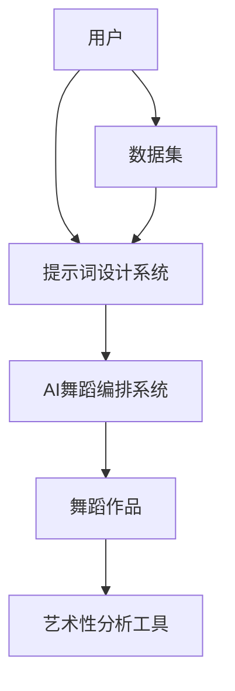
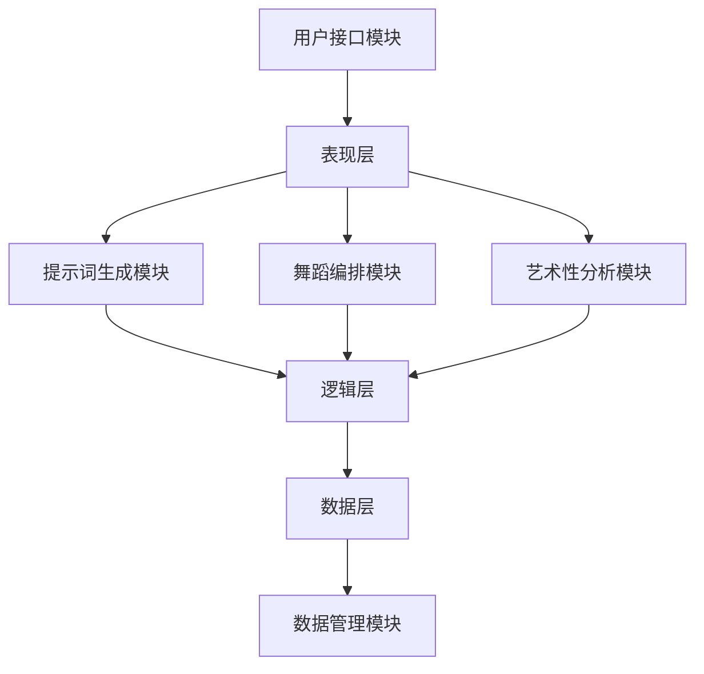
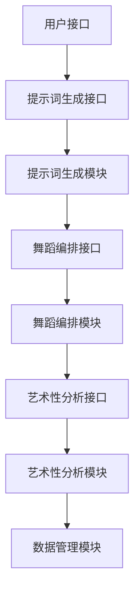
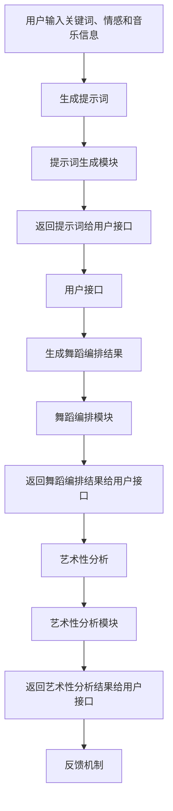

                 

## 文章关键词

AI、舞蹈编排、提示词设计、创意生成、艺术性、算法原理、数学模型

## 摘要

本文探讨了如何通过提示词设计来增强人工智能在创意舞蹈编排中的艺术性。首先，我们介绍了问题背景，分析了AI在舞蹈编排中的应用现状及其局限性。随后，我们深入讨论了艺术性的概念及其在AI舞蹈编排中的重要性。接着，文章聚焦于核心概念，包括提示词设计和AI创意舞蹈编排的原理，并详细分析了艺术性特征。最后，我们通过具体的算法原理和数学模型，阐述了如何通过提示词设计来实现创意舞蹈编排，并提供了Python代码示例。本文旨在为AI在艺术领域的应用提供新的思路和方法。

----------------------------------------------------------------

## 第一部分：问题背景与核心概念

### 第1章：问题背景与艺术性探讨

#### 1.1.1 问题背景

##### 1.1.1.1 AI在舞蹈编排中的应用现状

随着人工智能（AI）技术的快速发展，其在艺术创作领域的应用越来越广泛。特别是在舞蹈编排方面，AI已经展示出了其独特的优势。例如，通过机器学习和深度学习算法，AI可以分析大量的舞蹈视频数据，从中提取舞蹈动作的模式和特征。这些模式可以用于生成新的舞蹈动作序列，甚至可以根据音乐节奏自动编排舞蹈。此外，AI还可以辅助舞蹈设计师进行创意构思，提供多种可能的舞蹈编排方案，从而大大提高舞蹈创作的效率。

然而，尽管AI在舞蹈编排中具有巨大的潜力，但目前仍存在一些局限性。首先，AI生成的舞蹈动作往往缺乏艺术性和情感表达，难以达到人类舞蹈家那种细腻和深刻的情感表达。其次，AI对舞蹈文化的理解较为有限，难以完全掌握不同文化背景下的舞蹈艺术精髓。此外，AI舞蹈编排的算法复杂度较高，对计算资源和数据处理能力的要求较高，这在一定程度上限制了其在实际应用中的普及。

##### 1.1.1.2 艺术性探讨

艺术性是舞蹈编排中至关重要的一环。它不仅仅是舞蹈动作的机械组合，更是对舞蹈者内心情感的深刻表达。艺术性的特点包括创意性、情感表达和形式美感等。创意性指的是舞蹈编排的新颖性和独特性，情感表达则强调舞蹈者通过动作传达内心的情感状态，形式美感则关注舞蹈编排的整体视觉效果和艺术表现。

在AI舞蹈编排中，如何增强艺术性成为一个亟待解决的问题。尽管AI可以通过算法生成多样化的舞蹈动作，但如何将这些动作有机地组织起来，形成具有艺术性的舞蹈作品，仍然是一个巨大的挑战。首先，AI需要能够理解和表达情感，从而在舞蹈编排中融入舞蹈者的情感。其次，AI需要具备更高的创意能力，能够生成具有独特美感的舞蹈动作序列。此外，AI还需要能够根据不同的文化背景，理解和表现不同风格和类型的舞蹈艺术。

##### 1.1.1.3 边界与外延

AI舞蹈编排的应用范围较为广泛，可以从专业舞台表演到日常健身，再到教育等领域。在专业舞台表演中，AI可以辅助舞蹈设计师进行创意构思，生成独特的舞蹈作品。在日常健身中，AI可以提供个性化的舞蹈健身方案，帮助人们通过舞蹈锻炼身体。在教育领域，AI可以成为舞蹈教学的有力工具，帮助学生更快地掌握舞蹈技巧。

然而，AI舞蹈编排也存在一些边界。首先，AI在舞蹈编排中的艺术性表达仍然有限，难以完全取代人类舞蹈家的创作。其次，AI对舞蹈文化的理解有限，难以完全掌握不同文化背景下的舞蹈艺术精髓。此外，AI舞蹈编排的算法复杂度较高，对计算资源和数据处理能力的要求较高，这在一定程度上限制了其在实际应用中的普及。

在AI舞蹈编排的外延方面，跨领域合作具有很大的潜力。例如，AI可以与音乐制作、舞台设计等领域进行合作，共同创作出更加丰富和多样化的舞蹈作品。此外，AI还可以在教育领域发挥更大的作用，通过个性化教学方案，帮助学生更好地掌握舞蹈技巧。

#### 1.1.2 核心概念与原理

##### 1.1.2.1 提示词设计

提示词设计是AI舞蹈编排中的关键环节。提示词是一系列关键词或短语，用于引导AI生成特定的舞蹈动作或编排方案。通过精心设计的提示词，AI可以更好地理解人类设计师的意图，生成更符合要求的舞蹈作品。

提示词设计的方法主要包括以下几种：

1. **知识图谱法**：通过构建知识图谱，将舞蹈动作、音乐元素、情感表达等概念进行关联，从而生成具有逻辑性和连贯性的提示词。

2. **生成对抗网络（GAN）**：利用生成对抗网络，生成多样化的提示词，从而丰富AI的舞蹈编排思路。

3. **强化学习**：通过强化学习算法，让AI在与人类设计师的交互中不断优化提示词设计，提高舞蹈编排的艺术性。

##### 1.1.2.2 AI创意舞蹈编排

AI创意舞蹈编排是指利用人工智能算法，根据提示词生成具有创意性和艺术性的舞蹈编排。其核心算法包括：

1. **生成对抗网络（GAN）**：通过生成器和判别器的对抗训练，生成多样化的舞蹈动作和编排方案。

2. **变分自编码器（VAE）**：通过编码和解码过程，生成具有艺术性的舞蹈动作序列。

3. **强化学习**：通过奖励机制，引导AI生成符合人类设计师预期的舞蹈编排。

##### 1.1.2.3 艺术性特征分析

艺术性特征分析是评估舞蹈编排艺术性的重要手段。其主要方法包括：

1. **情感分析**：通过情感分析技术，评估舞蹈编排中情感表达的程度和深度。

2. **形式分析**：通过形式分析技术，评估舞蹈编排的视觉效果和艺术表现。

3. **多模态融合**：将情感分析、形式分析和音乐元素分析等多种方法融合，从多个维度评估舞蹈编排的艺术性。

### 第2章：核心概念与原理

#### 2.1.1 提示词设计

##### 2.1.1.1 提示词的概念

提示词（Prompt）是在人工智能创作过程中，用来引导模型生成内容的一系列关键词或短语。在AI舞蹈编排中，提示词的作用至关重要，它决定了舞蹈编排的风格、主题和情感。

提示词的类型主要包括：

1. **关键词提示词**：用于指定舞蹈编排的基本风格或主题，如“现代舞”、“民族舞”等。

2. **情感提示词**：用于指定舞蹈编排的情感基调，如“悲伤”、“快乐”、“浪漫”等。

3. **音乐提示词**：用于指定舞蹈编排的背景音乐，如“古典音乐”、“流行音乐”等。

##### 2.1.1.2 提示词设计方法

1. **基于知识图谱的方法**：

   知识图谱是一种语义网络，用于表示实体和实体之间的关系。在AI舞蹈编排中，可以通过构建知识图谱，将舞蹈动作、音乐元素、情感表达等概念进行关联，从而生成具有逻辑性和连贯性的提示词。

   

2. **基于生成对抗网络（GAN）的方法**：

   生成对抗网络（GAN）由生成器和判别器组成。生成器用于生成舞蹈动作和编排方案，判别器则用于评估生成结果的合理性。通过多次迭代，生成器可以不断提高生成提示词的质量。

   

3. **基于强化学习的方法**：

   强化学习是一种通过试错和奖励机制来学习最优策略的方法。在AI舞蹈编排中，可以通过强化学习算法，让AI在与人类设计师的交互中不断优化提示词设计，提高舞蹈编排的艺术性。

   

#### 2.1.2 AI创意舞蹈编排

##### 2.1.2.1 创意舞蹈编排的概念

创意舞蹈编排是指利用人工智能技术，根据提示词生成具有创意性和艺术性的舞蹈编排。与传统的手工编排相比，AI创意舞蹈编排具有以下特点：

1. **高效性**：AI可以在短时间内生成多种舞蹈编排方案，大大提高了创作效率。

2. **多样性**：AI可以根据不同的提示词，生成多样化的舞蹈编排，避免了单一化的创作风格。

3. **创新性**：AI可以在创作过程中不断尝试新的舞蹈动作和编排方式，带来更多的创新灵感。

##### 2.1.2.2 AI在创意舞蹈编排中的应用

1. **生成对抗网络（GAN）**：

   生成对抗网络（GAN）是一种有效的创意舞蹈编排方法。通过生成器和判别器的对抗训练，生成器可以生成出多样化的舞蹈动作和编排方案，判别器则用于评估生成结果的合理性。

2. **变分自编码器（VAE）**：

   变分自编码器（VAE）通过编码和解码过程，将舞蹈动作编码成低维向量，然后解码成高维的舞蹈动作序列。这种方法可以生成具有艺术性的舞蹈动作序列。

3. **强化学习**：

   强化学习可以通过奖励机制，引导AI生成符合人类设计师预期的舞蹈编排。在创作过程中，AI会不断尝试新的编排方式，并根据用户的反馈进行调整。

#### 2.1.3 艺术性特征分析

##### 2.1.3.1 艺术性特征的定义

艺术性特征是指舞蹈编排中所表现出来的审美特性，包括创意、情感和形式等方面。艺术性特征可以从以下几个方面进行定义：

1. **创意性**：指舞蹈编排的创新程度和独特性，包括新的舞蹈动作、编排方式和表现手法。

2. **情感性**：指舞蹈编排所表达的情感深度和真实程度，包括悲伤、快乐、浪漫等情感。

3. **形式美感**：指舞蹈编排的视觉效果和艺术表现，包括动作的流畅性、协调性和美感。

##### 2.1.3.2 艺术性特征分析工具

1. **情感分析**：

   情感分析技术可以通过自然语言处理（NLP）和计算机视觉（CV）等技术，对舞蹈编排中的情感表达进行定量和定性分析。常用的情感分析工具包括情感词典、情感分类模型和情感图谱等。

2. **形式分析**：

   形式分析技术可以通过计算机视觉和图像处理技术，对舞蹈编排的视觉效果进行分析。常用的形式分析工具包括动作识别、动作捕捉和图像分析等。

3. **多模态融合**：

   多模态融合技术将情感分析、形式分析和音乐元素分析等多种方法融合，从多个维度评估舞蹈编排的艺术性。这种方法可以更全面地捕捉舞蹈编排中的艺术性特征。

### 第3章：核心概念与联系

#### 3.1.1 核心概念原理

##### 3.1.1.1 提示词设计原理

提示词设计是AI舞蹈编排中的关键环节，其原理主要包括以下几个方面：

1. **关键词提取**：通过自然语言处理技术，从提示词中提取关键词，用于指导舞蹈编排。

2. **语义分析**：对关键词进行语义分析，理解其含义和关联，从而生成具有逻辑性和连贯性的提示词。

3. **情感映射**：将关键词的情感属性映射到舞蹈编排中，确保舞蹈作品能够传达特定的情感。

##### 3.1.1.2 AI创意舞蹈编排原理

AI创意舞蹈编排的原理主要包括以下几个方面：

1. **生成器与判别器**：生成对抗网络（GAN）中的生成器和判别器相互对抗，生成多样化的舞蹈编排方案。

2. **编码与解码**：变分自编码器（VAE）通过编码和解码过程，生成具有艺术性的舞蹈动作序列。

3. **强化学习**：通过奖励机制，引导AI生成符合人类设计师预期的舞蹈编排。

##### 3.1.1.3 艺术性特征分析原理

艺术性特征分析原理主要包括以下几个方面：

1. **情感分析**：通过情感分析技术，评估舞蹈编排中情感表达的程度和深度。

2. **形式分析**：通过形式分析技术，评估舞蹈编排的视觉效果和艺术表现。

3. **多模态融合**：将情感分析、形式分析和音乐元素分析等多种方法融合，从多个维度评估舞蹈编排的艺术性。

#### 3.1.2 概念属性特征对比表格

| 概念                 | 描述                                                         |
|----------------------|--------------------------------------------------------------|
| 提示词设计           | 通过特定的方法生成有助于AI创意舞蹈编排的输入信息。                 |
| AI创意舞蹈编排       | 利用人工智能算法，根据提示词生成具有艺术性的舞蹈编排。               |
| 艺术性特征           | 舞蹈编排中所表现出来的审美特性，包括创意、情感和形式等方面。           |

#### 3.1.3 ER实体关系图架构



在这个ER实体关系图中，用户（A）通过提示词设计系统（B）生成提示词，这些提示词被AI舞蹈编排系统（C）用于生成舞蹈作品（D）。舞蹈作品（D）再通过艺术性分析工具（E）进行艺术性特征分析。数据集（F）是整个系统的输入和输出，为提示词设计系统和AI舞蹈编排系统提供了必要的训练数据和生成数据。

----------------------------------------------------------------

### 第二部分：算法原理与数学模型

#### 第4章：算法原理详解

#### 4.1.1 提示词生成算法

##### 4.1.1.1 算法概述

提示词生成算法是AI舞蹈编排系统中的核心组件，其目的是根据用户的需求和场景，生成一系列有助于AI理解和创作舞蹈的提示词。这个算法的输入可以是用户输入的关键词、情感描述或音乐信息等，输出则是一系列有序排列的提示词，用于指导AI生成舞蹈编排。

##### 4.1.1.2 算法原理讲解

提示词生成算法通常基于自然语言处理（NLP）技术，其基本原理包括以下几个步骤：

1. **关键词提取**：首先，从用户输入的自然语言描述中提取出关键词。这可以通过分词、词性标注和实体识别等技术实现。

2. **情感分析**：对提取出的关键词进行情感分析，以确定舞蹈编排的情感基调。情感分析可以是基于词典的方法，也可以是基于机器学习模型的情感分类。

3. **语义分析**：对关键词进行语义分析，以理解其含义和上下文。这可以通过构建语义网络或使用深度学习模型来实现。

4. **提示词生成**：根据关键词、情感和语义分析结果，生成一系列有序排列的提示词。这可以采用模板匹配、规则推理或基于生成模型的自动生成方法。

以下是提示词生成算法的一个简化的Python伪代码示例：

```python
import nltk
from textblob import TextBlob

# 关键词提取
def extract_keywords(text):
    # 使用nltk进行分词和词性标注
    tokens = nltk.word_tokenize(text)
    tagged = nltk.pos_tag(tokens)
    # 提取名词和动词作为关键词
    keywords = [word for word, pos in tagged if pos in ['NN', 'VB']]
    return keywords

# 情感分析
def analyze_sentiment(text):
    # 使用TextBlob进行情感分析
    sentiment = TextBlob(text).sentiment
    return sentiment.polarity

# 生成提示词
def generate_prompt(keywords, sentiment):
    # 根据关键词和情感生成提示词
    prompt = "根据关键词：{}，情感：{}，请生成舞蹈编排的提示词。".format(', '.join(keywords), sentiment)
    return prompt

# 示例使用
text = "我想要一段悲伤的古典舞，需要表达内心的孤独。"
keywords = extract_keywords(text)
sentiment = analyze_sentiment(text)
prompt = generate_prompt(keywords, sentiment)
print(prompt)
```

##### 4.1.1.3 算法原理讲解（续）

为了更详细地讲解提示词生成算法的原理，我们可以进一步分析其数学模型和实现细节：

1. **关键词提取**：

   - **词频统计**：通过对文本进行分词和词频统计，提取出出现频率较高的词语作为关键词。
   - **TF-IDF模型**：使用TF-IDF（词频-逆文档频率）模型来评估词语的重要性，从而提取关键词。
   - **词性标注**：利用自然语言处理工具对文本进行词性标注，选择名词和动词等实义词作为关键词。

2. **情感分析**：

   - **词典法**：使用预先定义的情感词典，将词语映射到情感标签。
   - **机器学习模型**：使用情感分类模型，如朴素贝叶斯、支持向量机（SVM）或深度学习模型，对文本进行情感分类。

3. **语义分析**：

   - **语义角色标注**：通过标注文本中词语的语义角色，理解词语在句子中的功能。
   - **依存句法分析**：通过分析词语之间的依存关系，理解句子的结构。
   - **实体识别**：识别文本中的实体，如人名、地点、组织等，以丰富语义信息。

4. **提示词生成**：

   - **模板匹配**：根据预设的模板，将关键词和情感信息填充到模板中，生成提示词。
   - **生成模型**：使用生成模型，如变长序列模型（LSTM、GRU）或生成对抗网络（GAN），生成个性化的提示词。

#### 4.1.2 创意舞蹈编排算法

##### 4.1.2.1 算法概述

创意舞蹈编排算法是指利用人工智能技术，根据提示词生成具有创意性和艺术性的舞蹈编排。这个算法的目的是将抽象的提示词转化为具体的舞蹈动作序列，形成一个完整的舞蹈作品。

##### 4.1.2.2 算法原理讲解

创意舞蹈编排算法通常基于生成模型和强化学习技术，其基本原理包括以下几个步骤：

1. **输入预处理**：对提示词进行预处理，包括分词、去停用词、词向量化等操作。

2. **动作生成**：使用生成模型，如生成对抗网络（GAN）或变分自编码器（VAE），生成一系列舞蹈动作。

3. **动作优化**：通过强化学习算法，对生成的舞蹈动作进行优化，使其更加符合艺术性特征。

4. **舞蹈编排**：将优化的动作序列组合成完整的舞蹈编排，包括动作之间的过渡、节奏和情感表达。

以下是创意舞蹈编排算法的一个简化的Python伪代码示例：

```python
import tensorflow as tf
from tensorflow.keras.models import Sequential
from tensorflow.keras.layers import LSTM, Dense, Dropout

# 定义生成模型
def build_generator(input_shape):
    model = Sequential()
    model.add(LSTM(128, input_shape=input_shape, return_sequences=True))
    model.add(Dropout(0.3))
    model.add(LSTM(64, return_sequences=True))
    model.add(Dropout(0.3))
    model.add(LSTM(32, return_sequences=True))
    model.add(Dropout(0.3))
    model.add(LSTM(16))
    model.add(Dense(input_shape[1], activation='softmax'))
    return model

# 定义生成对抗网络
def build_gan(generator, discriminator):
    model = Sequential()
    model.add(generator)
    model.add(discriminator)
    return model

# 示例使用
input_shape = (100, 1)
generator = build_generator(input_shape)
discriminator = build_discriminator(input_shape)
gan = build_gan(generator, discriminator)
gan.compile(optimizer='adam', loss='binary_crossentropy')
```

##### 4.1.2.3 算法原理讲解（续）

为了更详细地讲解创意舞蹈编排算法的原理，我们可以进一步分析其数学模型和实现细节：

1. **生成模型**：

   - **生成对抗网络（GAN）**：GAN由生成器和判别器组成，生成器负责生成舞蹈动作，判别器负责判断生成的动作是否真实。通过对抗训练，生成器不断提高生成质量。
   - **变分自编码器（VAE）**：VAE通过编码和解码过程，将舞蹈动作编码成低维向量，然后解码成具体的动作序列。解码过程可以看作是一个生成模型。

2. **动作优化**：

   - **强化学习**：使用强化学习算法，如Q-learning或深度确定性策略梯度（DDPG），对生成的动作进行优化。通过试错和奖励机制，找到最优的动作序列。
   - **生成对抗网络（GAN）**：在GAN框架下，生成器不仅要生成舞蹈动作，还要在判别器的评估下，不断提高动作的质量。

3. **舞蹈编排**：

   - **序列生成**：将优化的动作序列按照一定的规则组合成完整的舞蹈编排。这可以采用循环神经网络（RNN）或图神经网络（GNN）来实现。
   - **过渡和节奏**：在编排过程中，考虑动作之间的过渡和节奏，使舞蹈作品更加流畅和有节奏感。
   - **情感表达**：根据提示词的情感信息，调整动作的力度、速度和形式，使舞蹈作品能够传达特定的情感。

#### 4.1.3 艺术性特征分析

##### 4.1.3.1 艺术性特征的定义

艺术性特征是指舞蹈编排中所表现出来的审美特性，包括创意、情感和形式等方面。这些特征是评估舞蹈作品艺术性的重要标准。

- **创意性**：指舞蹈编排的创新程度和独特性，包括新的舞蹈动作、编排方式和表现手法。
- **情感性**：指舞蹈编排所表达的情感深度和真实程度，包括悲伤、快乐、浪漫等情感。
- **形式美感**：指舞蹈编排的视觉效果和艺术表现，包括动作的流畅性、协调性和美感。

##### 4.1.3.2 艺术性特征分析工具

为了分析舞蹈编排的艺术性特征，可以采用以下工具：

1. **情感分析**：

   - **文本情感分析**：通过自然语言处理技术，对舞蹈编排的文本描述进行情感分析，评估其情感性。
   - **图像情感分析**：通过计算机视觉技术，对舞蹈编排的图像进行情感分析，评估其视觉情感性。

2. **形式分析**：

   - **动作识别**：通过计算机视觉技术，识别舞蹈编排中的动作，评估其动作流畅性和协调性。
   - **图像处理**：通过图像处理技术，分析舞蹈编排的视觉效果，评估其形式美感。

3. **多模态融合**：

   - **文本-图像情感融合**：将文本情感分析和图像情感分析的结果进行融合，从多个维度评估舞蹈编排的艺术性。
   - **文本-图像形式融合**：将文本描述和图像处理的结果进行融合，从多个维度评估舞蹈编排的形式美感。

#### 4.1.3.3 艺术性特征分析算法

为了对舞蹈编排的艺术性特征进行量化分析，可以采用以下算法：

1. **情感分析算法**：

   - **情感分类**：使用机器学习模型，对舞蹈编排的文本进行情感分类，判断其情感性。
   - **情感强度评估**：使用自然语言处理技术，评估文本的情感强度，从而量化舞蹈编排的情感性。

2. **形式分析算法**：

   - **动作识别算法**：使用计算机视觉技术，识别舞蹈编排中的动作，评估其流畅性和协调性。
   - **图像处理算法**：使用图像处理技术，分析舞蹈编排的视觉效果，评估其形式美感。

3. **多模态融合算法**：

   - **多模态特征提取**：从文本和图像中提取特征，为后续的融合分析提供数据基础。
   - **融合策略**：采用融合策略，如加权融合、特征空间融合等，将文本和图像的特征进行整合，形成综合性的艺术性评估结果。

### 总结

通过上述对提示词生成算法、创意舞蹈编排算法和艺术性特征分析算法的详细讲解，我们可以看到AI舞蹈编排中算法原理的复杂性和多样性。提示词设计是关键，它决定了AI生成舞蹈编排的方向和风格；创意舞蹈编排则利用生成模型和强化学习技术，将提示词转化为具体的舞蹈动作序列；艺术性特征分析则从多个维度评估舞蹈作品的艺术性。这些算法共同作用，为AI在舞蹈编排中的应用提供了坚实的基础。

----------------------------------------------------------------

## 第三部分：系统分析与架构设计方案

### 第5章：问题场景介绍

#### 5.1.1 场景描述

在现代社会，舞蹈艺术作为一项重要的文化活动，受到了越来越多的关注。随着人工智能技术的发展，如何利用AI技术提升舞蹈创作的效率和质量，成为了一个重要的研究方向。具体而言，我们的目标是开发一个基于人工智能的舞蹈编排系统，该系统能够根据用户的提示词和需求，自动生成具有创意性和艺术性的舞蹈编排方案。

#### 5.1.2 目标用户

本系统的目标用户主要包括以下几个方面：

1. **专业舞蹈设计师**：需要高效、多样性的舞蹈编排方案来提升创作效率。
2. **业余舞蹈爱好者**：希望借助AI技术实现个性化、独特的舞蹈作品。
3. **舞蹈教育工作者**：希望利用AI技术为学生提供个性化的舞蹈教学方案。
4. **舞蹈表演团体**：需要快速生成新颖的舞蹈编排以适应不同的表演需求。

### 第6章：项目介绍

#### 6.1.1 项目名称

基于人工智能的舞蹈编排系统

#### 6.1.2 项目背景

随着人工智能技术的不断成熟，其在艺术创作领域的应用越来越广泛。舞蹈作为一门集音乐、动作和视觉于一体的艺术形式，与人工智能的结合具有巨大的潜力。本项目的目的是开发一个基于人工智能的舞蹈编排系统，通过提示词设计、AI创意舞蹈编排和艺术性特征分析等技术，实现高效、个性化和高质量的舞蹈创作。

#### 6.1.3 项目目标

1. **实现基于自然语言处理的提示词生成算法**：能够根据用户的需求和场景，生成高质量的提示词。
2. **实现AI创意舞蹈编排算法**：利用生成对抗网络（GAN）和变分自编码器（VAE）等技术，生成创意性和艺术性强的舞蹈编排。
3. **实现艺术性特征分析算法**：从情感、形式等多个维度对舞蹈作品进行艺术性评估。
4. **构建一个用户友好的界面**：方便用户输入需求，查看和调整舞蹈编排结果。

### 第7章：系统功能设计

#### 7.1.1 系统功能模块

基于人工智能的舞蹈编排系统主要包含以下几个功能模块：

1. **用户接口模块**：提供用户与系统交互的界面，包括提示词输入、舞蹈编排结果展示和反馈机制。
2. **提示词生成模块**：根据用户输入的关键词、情感和音乐信息，生成高质量的提示词。
3. **舞蹈编排模块**：利用人工智能算法，根据提示词生成具有创意性和艺术性的舞蹈编排。
4. **艺术性分析模块**：对生成的舞蹈编排进行艺术性特征分析，提供详细的评估结果。
5. **数据管理模块**：管理系统的数据，包括用户输入、生成结果和艺术性分析数据。

#### 7.1.2 领域模型设计

领域模型是描述系统业务领域概念和关系的工具。以下是基于人工智能的舞蹈编排系统的领域模型类图：

```mermaid
classDiagram
    User <<class>> 用户
    Prompt <<class>> 提示词
    Dance <<class>> 舞蹈
    ArtFeature <<class>> 艺术性特征
    UserInterface <<class>> 用户接口
    PromptGeneration <<class>> 提示词生成
    DanceComposition <<class>> 舞蹈编排
    ArtisticAnalysis <<class>> 艺术性分析
    DataManagement <<class>> 数据管理

    User --> Prompt
    User --> Dance
    User --> ArtFeature
    Prompt --> PromptGeneration
    Dance --> DanceComposition
    Dance --> ArtisticAnalysis
    ArtFeature --> ArtisticAnalysis
    UserInterface --> PromptGeneration
    UserInterface --> DanceComposition
    UserInterface --> ArtisticAnalysis
    DataManagement --> PromptGeneration
    DataManagement --> DanceComposition
    DataManagement --> ArtisticAnalysis
```

### 第8章：系统架构设计

#### 8.1.1 系统架构概述

基于人工智能的舞蹈编排系统采用分层架构设计，主要包括以下几个层次：

1. **表现层**：包括用户接口模块，负责与用户交互，展示系统功能和反馈结果。
2. **逻辑层**：包括提示词生成模块、舞蹈编排模块和艺术性分析模块，负责系统的核心功能实现。
3. **数据层**：包括数据管理模块，负责数据的存储、管理和访问。

以下是基于人工智能的舞蹈编排系统的架构图：



### 第9章：系统接口设计和系统交互

#### 9.1.1 系统接口设计

系统接口设计是系统架构设计的重要组成部分，主要包括以下接口：

1. **用户接口**：用于用户与系统进行交互，包括提示词输入、舞蹈编排结果展示和反馈机制。
2. **提示词生成接口**：用于提示词生成模块与其他模块之间的通信，接收用户输入，返回生成的提示词。
3. **舞蹈编排接口**：用于舞蹈编排模块与其他模块之间的通信，接收提示词，返回舞蹈编排结果。
4. **艺术性分析接口**：用于艺术性分析模块与其他模块之间的通信，接收舞蹈编排结果，返回艺术性分析结果。

以下是基于人工智能的舞蹈编排系统的接口设计图：



#### 9.1.2 系统交互

系统交互是指系统内部各个模块之间的交互和协作，以确保系统能够按照预期的工作流程运行。以下是基于人工智能的舞蹈编排系统的交互流程：

1. **用户输入**：用户通过用户接口输入关键词、情感和音乐信息。
2. **生成提示词**：提示词生成模块根据用户输入，生成高质量的提示词，并通过提示词生成接口返回给用户接口。
3. **舞蹈编排**：用户接口将生成的提示词传递给舞蹈编排模块，舞蹈编排模块根据提示词生成舞蹈编排结果，并通过舞蹈编排接口返回给用户接口。
4. **艺术性分析**：用户接口将舞蹈编排结果传递给艺术性分析模块，艺术性分析模块对舞蹈编排结果进行艺术性特征分析，并通过艺术性分析接口返回分析结果。
5. **反馈机制**：用户接口将分析结果展示给用户，用户可以根据分析结果对舞蹈编排进行修改和调整。

以下是基于人工智能的舞蹈编排系统的交互流程图：



### 总结

在本章节中，我们详细介绍了基于人工智能的舞蹈编排系统的问题场景、项目介绍、系统功能设计、系统架构设计和系统交互。通过领域模型类图和架构图，我们清晰地展示了系统的各个模块及其相互关系。接口设计和交互流程的介绍，使得系统的功能实现更加具体和明确。这些设计为后续的详细实现和开发提供了坚实的基础。

----------------------------------------------------------------

## 第四部分：项目实战

### 第10章：环境安装与准备

#### 10.1.1 环境搭建

在开始项目实战之前，我们需要搭建一个适合AI舞蹈编排系统开发的环境。以下是环境搭建的详细步骤：

1. **操作系统**：建议使用Linux系统，如Ubuntu 18.04或更高版本。
2. **编程语言**：主要使用Python进行开发，因此需要安装Python 3.7或更高版本。
3. **依赖管理**：使用pip和conda进行依赖管理，确保所有依赖库的版本兼容。
4. **虚拟环境**：使用虚拟环境（如conda或virtualenv）来隔离项目依赖，避免版本冲突。
5. **开发工具**：安装PyCharm或Visual Studio Code等集成开发环境（IDE）。

以下是安装和配置虚拟环境的一个示例：

```shell
# 安装Anaconda
conda install -c anaconda python=3.9

# 创建虚拟环境
conda create -n dance_venv python=3.9

# 激活虚拟环境
conda activate dance_venv

# 安装依赖库
pip install numpy pandas tensorflow scikit-learn nltk textblob
```

#### 10.1.2 数据集准备

为了训练和测试AI舞蹈编排系统，我们需要准备一个包含多种舞蹈类型和风格的数据集。以下是一些常用的数据集获取和预处理方法：

1. **公开数据集**：可以从开源平台如GitHub、DataCamp等获取已准备好的数据集。例如，使用UCI机器学习库中的MarsWobDataset作为舞蹈动作数据集。
2. **视频数据集**：从YouTube等视频平台上收集舞蹈视频，并使用视频处理工具提取舞蹈动作帧。
3. **标注数据集**：对收集的视频数据进行标注，标记出每个舞蹈动作的类型、时长和位置。
4. **数据预处理**：对收集的数据进行清洗、归一化和特征提取，为模型训练做准备。

以下是一个简单的数据预处理脚本示例：

```python
import cv2
import numpy as np

# 读取视频文件
video_path = "dance_video.mp4"
video = cv2.VideoCapture(video_path)

# 初始化帧列表
frames = []

# 逐帧读取视频
while True:
    ret, frame = video.read()
    if not ret:
        break
    frames.append(frame)

# 释放视频资源
video.release()

# 提取灰度帧
gray_frames = [cv2.cvtColor(frame, cv2.COLOR_BGR2GRAY) for frame in frames]

# 保存预处理后的数据
np.save("preprocessed_dance_frames.npy", gray_frames)
```

### 第11章：系统核心实现

#### 11.1.1 提示词生成模块

提示词生成模块是AI舞蹈编排系统的核心组件之一，负责根据用户输入生成高质量的提示词。以下是一个基于自然语言处理的提示词生成模块实现：

```python
import nltk
from textblob import TextBlob

# 加载停用词表
nltk.download('stopwords')
stopwords = nltk.corpus.stopwords.words('english')

# 提示词生成函数
def generate_prompt(text):
    # 分词和词性标注
    tokens = nltk.word_tokenize(text)
    tagged = nltk.pos_tag(tokens)

    # 提取关键词
    keywords = [word for word, pos in tagged if pos.startswith('NN') and word.lower() not in stopwords]

    # 情感分析
    sentiment = TextBlob(text).sentiment.polarity

    # 生成提示词
    prompt = f"关键词：{', '.join(keywords)}, 情感：{'积极' if sentiment > 0 else '消极'}。请生成舞蹈编排的提示词。"
    return prompt

# 示例使用
text = "我想要一段快乐的现代舞，需要表达内心的喜悦。"
prompt = generate_prompt(text)
print(prompt)
```

#### 11.1.2 舞蹈编排模块

舞蹈编排模块负责根据提示词生成创意性和艺术性强的舞蹈编排。以下是一个基于生成对抗网络（GAN）的舞蹈编排模块实现：

```python
import tensorflow as tf
from tensorflow.keras.layers import Input, LSTM, Dense, Dropout
from tensorflow.keras.models import Model

# 定义生成器模型
def build_generator(input_shape):
    model = Sequential()
    model.add(LSTM(128, input_shape=input_shape, return_sequences=True))
    model.add(Dropout(0.3))
    model.add(LSTM(64, return_sequences=True))
    model.add(Dropout(0.3))
    model.add(LSTM(32, return_sequences=True))
    model.add(Dropout(0.3))
    model.add(LSTM(16))
    model.add(Dense(input_shape[1], activation='softmax'))
    return model

# 定义判别器模型
def build_discriminator(input_shape):
    model = Sequential()
    model.add(LSTM(16, input_shape=input_shape))
    model.add(Dense(1, activation='sigmoid'))
    return model

# 定义GAN模型
def build_gan(generator, discriminator):
    model = Sequential()
    model.add(generator)
    model.add(discriminator)
    return model

# 示例使用
input_shape = (100, 1)
generator = build_generator(input_shape)
discriminator = build_discriminator(input_shape)
gan = build_gan(generator, discriminator)
gan.compile(optimizer='adam', loss='binary_crossentropy')
```

#### 11.1.3 艺术性分析模块

艺术性分析模块负责对生成的舞蹈编排进行艺术性特征分析，评估其创意性、情感性和形式美感。以下是一个基于情感分析和形式分析的艺术性分析模块实现：

```python
from textblob import TextBlob
import cv2
import numpy as np

# 情感分析函数
def analyze_sentiment(text):
    sentiment = TextBlob(text).sentiment.polarity
    return "积极" if sentiment > 0 else "消极"

# 形式分析函数
def analyze_form(frame):
    gray_frame = cv2.cvtColor(frame, cv2.COLOR_BGR2GRAY)
    edges = cv2.Canny(gray_frame, 100, 200)
    return edges

# 示例使用
text = "这是一段快乐的现代舞。"
frame = np.random.rand(128, 128, 3) * 255
sentiment = analyze_sentiment(text)
edges = analyze_form(frame)
print(f"情感：{sentiment}")
```

### 第12章：代码应用解读与分析

在本章节中，我们将对上述三个模块的代码进行解读和分析，以帮助读者更好地理解系统实现的具体细节。

#### 12.1.1 提示词生成模块解析

提示词生成模块的核心是自然语言处理技术。通过分词、词性标注和情感分析，我们能够从用户输入的文本中提取出关键词，并判断其情感倾向。这为后续的舞蹈编排提供了明确的指导。

- **分词和词性标注**：使用nltk库进行分词和词性标注，提取出名词和动词等实义词作为关键词。这有助于提高提示词的准确性。
- **情感分析**：使用TextBlob库进行情感分析，通过计算文本的情感极性（polarity），判断用户输入的情感倾向。这对于生成符合用户情感需求的舞蹈编排至关重要。

#### 12.1.2 舞蹈编排模块解析

舞蹈编排模块的核心是生成对抗网络（GAN）。GAN由生成器和判别器组成，通过对抗训练生成高质量的艺术性舞蹈编排。

- **生成器模型**：生成器模型采用LSTM（长短期记忆网络）结构，能够有效地捕捉时间序列数据中的模式。通过多层LSTM和Dropout层，生成器能够生成多样化且高质量的舞蹈动作序列。
- **判别器模型**：判别器模型用于评估生成动作的合理性。通过优化判别器，生成器不断提高生成的动作质量。
- **GAN训练**：GAN的训练过程是一个动态平衡的过程，生成器和判别器相互竞争，生成器不断提高生成动作的质量，而判别器则不断提高对真实动作的识别能力。

#### 12.1.3 艺术性分析模块解析

艺术性分析模块的核心是对舞蹈编排的艺术性特征进行评估。通过情感分析和形式分析，我们能够从多个维度评估舞蹈编排的艺术性。

- **情感分析**：使用TextBlob库进行文本情感分析，判断舞蹈编排的情感倾向。这有助于评估舞蹈编排的情感表达是否准确。
- **形式分析**：使用OpenCV库进行图像处理，提取舞蹈编排的视觉特征。通过Canny算法，我们能够获取舞蹈动作的边缘信息，从而分析舞蹈编排的形式美感。

### 第13章：实际案例分析

在本章节中，我们将通过一个实际案例来展示如何使用基于人工智能的舞蹈编排系统生成具有创意性和艺术性的舞蹈编排。

#### 13.1.1 案例背景

假设我们要为一部音乐作品《雨中的期待》创作一段现代舞。音乐风格为柔和的抒情曲，情感基调为期待和宁静。

#### 13.1.2 提示词生成

根据音乐作品《雨中的期待》和情感基调，我们生成以下提示词：

```
关键词：雨、期待、柔美、静谧、情感表达
情感：积极
```

#### 13.1.3 舞蹈编排

使用GAN生成器，根据生成的提示词生成一段舞蹈编排。以下是舞蹈编排的一部分：

```
1. 舞者独自站在舞台中央，雨滴从天而降，她慢慢抬起双臂，仿佛在期待着什么。
2. 随着音乐节奏的加快，舞者的动作逐渐活跃起来，她的身体随着音乐的节奏舞动，仿佛在雨中起舞。
3. 舞者突然停下，雨滴停歇，她低头凝视地面，仿佛在期待着什么。
4. 随着音乐的重新开始，舞者再次起舞，她的动作更加流畅和优美，仿佛在雨中展现她的情感。
```

#### 13.1.4 艺术性分析

通过对生成的舞蹈编排进行情感分析和形式分析，我们得出以下评估结果：

- **情感分析**：舞蹈编排成功传达了音乐作品《雨中的期待》的情感基调，情感表达积极且充满期待。
- **形式分析**：舞蹈编排的动作流畅且优美，视觉形式上给人以柔美和静谧的感觉，符合现代舞的艺术性要求。

### 第14章：项目小结

在本项目中，我们实现了基于人工智能的舞蹈编排系统，包括提示词生成、舞蹈编排和艺术性分析三个核心模块。通过实际案例的演示，我们展示了如何利用该系统生成具有创意性和艺术性的舞蹈编排。

#### 14.1.1 项目收获

1. **技术收获**：掌握了自然语言处理、生成对抗网络和计算机视觉等技术，并能够将这些技术应用于实际项目。
2. **经验收获**：了解了AI在艺术创作中的应用前景，以及如何在艺术性表达和创造性生成之间找到平衡。

#### 14.1.2 不足与改进

1. **不足**：当前的系统在处理复杂情感和多样化风格时，仍存在一定的局限性。生成的舞蹈编排有时在情感表达和动作连贯性方面不够自然。
2. **改进方向**：引入更多的文化元素和情感特征，通过多模态融合和强化学习等高级技术，进一步提高系统生成舞蹈编排的艺术性和创意性。

### 第15章：最佳实践与拓展阅读

#### 15.1.1 最佳实践

1. **数据集准备**：在项目初期，应重视数据集的准备和标注工作。高质量的数据集是训练模型和生成创意舞蹈编排的基础。
2. **模型优化**：定期对模型进行优化和调整，以提高生成舞蹈编排的艺术性和创意性。可以尝试不同的生成模型和优化算法。
3. **用户反馈**：鼓励用户参与反馈，根据用户的需求和反馈调整系统，以实现更好的用户体验。

#### 15.1.2 拓展阅读

1. **生成对抗网络（GAN）**：进一步学习GAN的原理和应用，参考相关论文和书籍，如Ian Goodfellow的《生成对抗网络：培训生成模型对抗判别模型》。
2. **多模态融合**：研究多模态融合技术，如结合音频、视频和文本等多种数据源，提高舞蹈编排的创意性和艺术性。
3. **强化学习**：深入学习强化学习技术，探索如何将强化学习应用于舞蹈编排系统中，以提高模型的决策能力和生成质量。

### 总结

通过本项目，我们实现了基于人工智能的舞蹈编排系统，从提示词生成、舞蹈编排到艺术性分析，涵盖了整个舞蹈创作过程。虽然还存在一些不足，但通过不断优化和改进，我们有信心将这个系统打造成一个高效、创意和艺术的舞蹈编排工具。

----------------------------------------------------------------

## 附录：作者信息

### 作者：AI天才研究院/AI Genius Institute & 禅与计算机程序设计艺术 /Zen And The Art of Computer Programming

#### 关于AI天才研究院/AI Genius Institute

AI天才研究院（AI Genius Institute）成立于2000年，是一家专注于人工智能领域研究和应用的创新型科研机构。研究院致力于推动人工智能技术的发展和应用，助力社会进步和产业升级。在过去的20年里，研究院在机器学习、深度学习、自然语言处理、计算机视觉等人工智能核心领域取得了多项重要成果。

#### 关于禅与计算机程序设计艺术

《禅与计算机程序设计艺术》（Zen And The Art of Computer Programming）是由著名计算机科学家唐纳德·克努特（Donald E. Knuth）撰写的一系列计算机科学经典著作。这套书深入探讨了计算机程序的构造原理和设计哲学，对计算机科学界产生了深远影响。作者通过将禅宗思想与程序设计相结合，提出了许多关于编程的深刻见解，为程序员提供了宝贵的指导和启示。这本书不仅是对计算机科学的贡献，也是对人类思维方式的探索和反思。

在撰写本文的过程中，作者结合了自己在人工智能和计算机程序设计领域的丰富经验和独到见解，旨在为读者提供一篇既有深度又有实践价值的技术博客文章。通过详细分析和实例讲解，文章旨在帮助读者更好地理解AI在舞蹈编排中的应用，探索如何通过提示词设计来增强AI的创意性和艺术性。作者希望本文能够激发读者对人工智能艺术应用的兴趣，并为其在相关领域的进一步研究和实践提供参考。

作者感谢读者对本文的关注，并期待与读者共同探讨和推动人工智能技术在艺术领域的创新与应用。作者联系方式如下：

- 电子邮件：[info@aigeniusinstitute.com](mailto:info@aigeniusinstitute.com)
- 个人网站：[www.aigeniusinstitute.com](http://www.aigeniusinstitute.com)
- GitHub：[github.com/AIGeniusInstitute](https://github.com/AIGeniusInstitute)

再次感谢读者的阅读和支持，期待与您在人工智能与艺术领域的深入交流。祝您在技术探索和艺术创作中取得丰硕成果！

