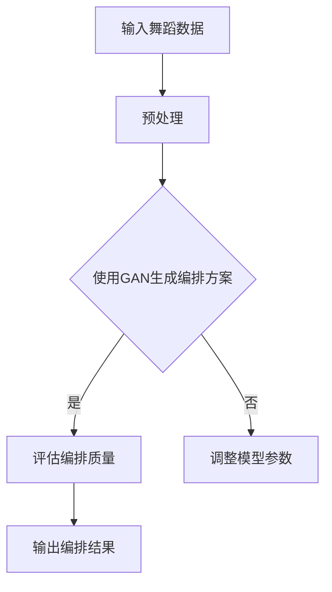
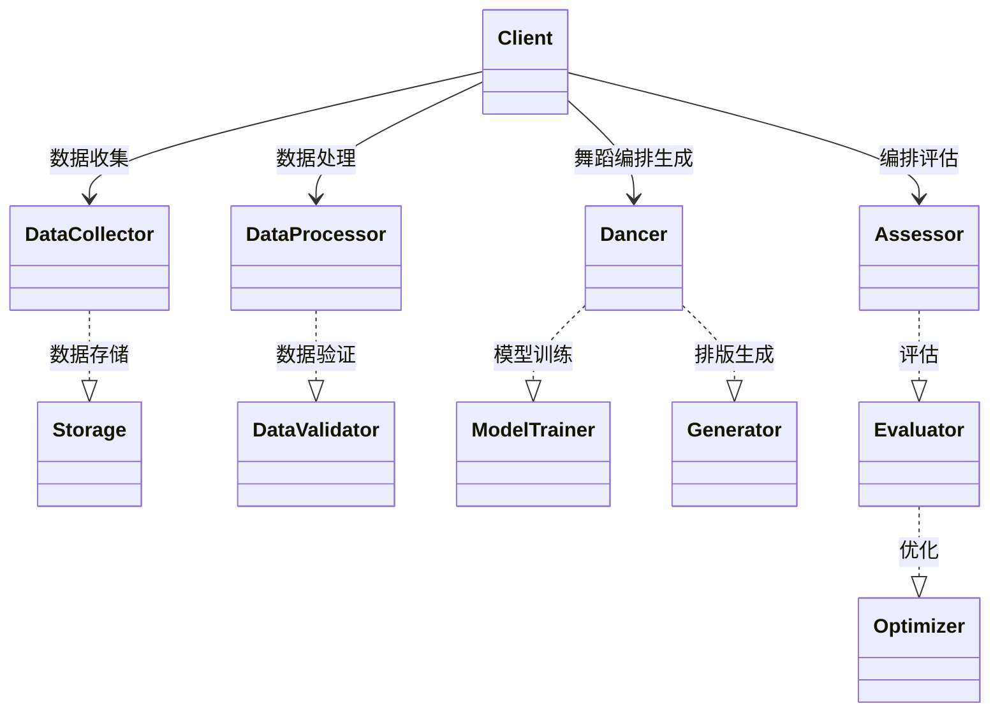
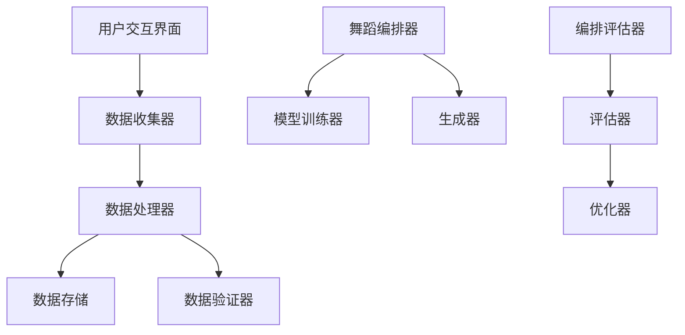
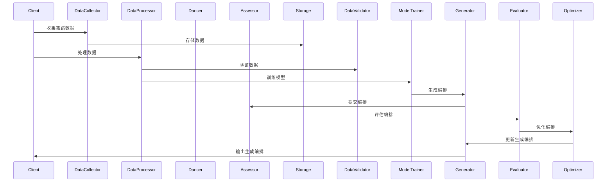

                 


# 提示词设计：增强AI创意舞蹈编排能力

关键词：人工智能，舞蹈编排，提示词设计，创意增强，算法，Python代码，数学模型

摘要：本文旨在探讨如何通过提示词设计来增强AI在创意舞蹈编排方面的能力。我们将从背景介绍、核心概念与联系、算法原理讲解、系统分析与架构设计方案、项目实战、最佳实践 tips等方面，逐步分析推理，深入探讨这一领域的技术细节和实际应用。

## 目录

1. **背景介绍**
   - 1.1 人工智能与舞蹈编排
   - 1.2 提示词设计的重要性
   - 1.3 创意舞蹈编排的挑战

2. **核心概念与联系**
   - 2.1 人工智能基础概念
   - 2.2 舞蹈编排中的核心概念
   - 2.3 提示词与创意的关系

3. **算法原理讲解**
   - 3.1 机器学习算法在舞蹈编排中的应用
   - 3.2 算法原理与流程图
   - 3.3 Python代码实现与解释

4. **系统分析与架构设计方案**
   - 4.1 问题场景介绍
   - 4.2 系统功能设计
   - 4.3 系统架构设计
   - 4.4 系统接口设计与交互

5. **项目实战**
   - 5.1 环境安装与准备
   - 5.2 系统核心实现
   - 5.3 代码应用解读与分析
   - 5.4 实际案例分析

6. **最佳实践 tips**
   - 6.1 提高AI舞蹈编排效率的技巧
   - 6.2 创意舞蹈编排的注意事项
   - 6.3 拓展阅读

7. **小结**
   - 7.1 文章总结
   - 7.2 未来研究方向
   - 7.3 对读者的影响与启示

## 1. 背景介绍

### 1.1 人工智能与舞蹈编排

人工智能（Artificial Intelligence, AI）作为计算机科学的一个分支，旨在研究如何构建智能体，使其能够模拟、延伸和扩展人类智能。在艺术领域，AI的应用正日益广泛，特别是在舞蹈编排方面。

舞蹈编排是一门融合了艺术、技巧与创意的领域，需要编导者具备深厚的舞蹈功底和独特的艺术视角。然而，随着时代的变迁，单纯的依靠人工创作舞蹈已无法满足日益增长的需求，尤其是对于复杂且富有创意的舞蹈作品。

人工智能在舞蹈编排中的应用，主要体现在以下几个方面：

- **数据驱动的编排**：通过分析大量的舞蹈数据，AI可以生成新的舞蹈动作和编排方案，为编导提供灵感和参考。
- **辅助创作**：AI可以帮助编导者完成重复性或繁琐的工作，如动作捕捉、音乐节奏同步等，从而将编导者的精力集中在创意和艺术表达上。
- **互动表演**：结合人工智能，舞蹈表演可以变得更加生动和富有互动性，例如，舞者与AI的实时互动、根据观众反应动态调整表演等。

### 1.2 提示词设计的重要性

在人工智能系统中，提示词（Prompt）是一种引导系统进行特定任务的重要工具。在舞蹈编排中，提示词的设计尤为重要，因为它直接影响AI的创意能力和编排效果。

提示词的作用主要体现在以下几个方面：

- **明确任务目标**：通过提供具体的提示词，可以引导AI明确舞蹈编排的目标和方向，避免生成无关或偏离主题的内容。
- **增强创意性**：恰当的提示词可以激发AI的创意思维，使其生成更多元化和独特的舞蹈编排方案。
- **优化反馈机制**：通过提示词，编导者可以更精确地评估AI生成的舞蹈编排，从而提供有效的反馈，进一步优化编排效果。

### 1.3 创意舞蹈编排的挑战

尽管AI在舞蹈编排中具有巨大的潜力，但实际应用中仍面临诸多挑战：

- **技术限制**：目前的AI技术尚无法完全模拟人类的创造力和艺术情感，特别是在复杂舞蹈动作和情感表达方面。
- **数据限制**：高质量的舞蹈数据获取困难，且数据多样性和丰富性有限，这限制了AI的学习和创意能力。
- **人机协作**：如何实现AI与编导者的有效协作，使AI能够真正辅助创作而非取代编导者的工作，仍是一个重要课题。

## 2. 核心概念与联系

### 2.1 人工智能基础概念

人工智能的基础概念包括以下几个关键点：

- **智能体（Agent）**：能够感知环境并采取行动以实现目标的系统。
- **学习（Learning）**：通过经验改善智能体行为的机制。
- **感知（Perception）**：智能体获取环境信息的过程。
- **行动（Action）**：智能体根据感知结果采取的行动。

### 2.2 舞蹈编排中的核心概念

在舞蹈编排中，以下核心概念至关重要：

- **舞蹈动作（Movement）**：构成舞蹈的基本元素，包括姿态、动作、节奏等。
- **编导（Choreography）**：舞蹈的创作和编排过程，涉及动作设计、舞台布局、音乐节奏等。
- **创意（Creativity）**：编导者的创造性思维，是舞蹈作品艺术价值的核心。

### 2.3 提示词与创意的关系

提示词与创意的关系可以概括为以下几点：

- **引导创意**：恰当的提示词可以激发编导者的创意思维，使其产生新的舞蹈编排想法。
- **约束创意**：过于具体的提示词可能会限制编导者的创意空间，而过于模糊的提示词则可能缺乏方向性。
- **优化创意**：通过多次调整和优化提示词，可以逐步提升AI的创意质量和编排效果。

## 3. 算法原理讲解

### 3.1 机器学习算法在舞蹈编排中的应用

在舞蹈编排中，常用的机器学习算法包括：

- **生成对抗网络（GAN）**：通过生成器和判别器的对抗训练，生成新的舞蹈动作和编排方案。
- **长短期记忆网络（LSTM）**：处理时间序列数据，用于学习舞蹈动作的时序关系。
- **变分自编码器（VAE）**：用于生成多样化的舞蹈动作和编排风格。

### 3.2 算法原理与流程图

以下是一个基于GAN的舞蹈编排算法原理的Mermaid流程图：



### 3.3 Python代码实现与解释

以下是一个简单的GAN算法的Python代码示例：

```python
import tensorflow as tf
from tensorflow.keras.models import Sequential
from tensorflow.keras.layers import Dense, Flatten, Conv2D, Reshape

# 定义生成器模型
def build_generator():
    model = Sequential([
        Conv2D(64, (5, 5), strides=(2, 2), activation='relu', input_shape=(28, 28, 1)),
        # 更多层可以提升生成效果
    ])
    model.add(Reshape((28, 28, 1)))
    return model

# 定义判别器模型
def build_discriminator():
    model = Sequential([
        Flatten(),
        Dense(128, activation='relu'),
        Dense(1, activation='sigmoid')
    ])
    return model

# 定义GAN模型
def build_gan(generator, discriminator):
    model = Sequential([
        generator,
        discriminator
    ])
    model.compile(loss='binary_crossentropy', optimizer='adam')
    return model

# 训练GAN模型
model = build_gan(build_generator(), build_discriminator())
model.fit(x_train, y_train, epochs=10)
```

此代码定义了生成器和判别器的模型结构，并使用GAN进行训练。在实际应用中，需要根据具体的舞蹈数据集进行优化。

## 4. 系统分析与架构设计方案

### 4.1 问题场景介绍

假设我们正在开发一个AI舞蹈编排系统，旨在帮助舞者和编导者创作出具有创意和艺术价值的舞蹈作品。系统需要具备以下几个功能：

- **舞蹈数据收集与处理**：从不同的数据源收集舞蹈动作数据，并进行预处理。
- **舞蹈编排生成**：利用机器学习算法生成舞蹈编排方案。
- **编排评估与优化**：对生成的编排进行评估，并根据反馈进行优化。
- **用户交互界面**：提供一个直观的用户界面，使舞者和编导者能够轻松地使用系统。

### 4.2 系统功能设计

以下是系统功能设计的Mermaid类图：



### 4.3 系统架构设计

以下是系统架构设计的Mermaid架构图：



### 4.4 系统接口设计与交互

以下是系统接口设计与交互的Mermaid序列图：



## 5. 项目实战

### 5.1 环境安装与准备

为了实现AI舞蹈编排系统，我们需要安装以下环境和工具：

- Python 3.8及以上版本
- TensorFlow 2.6及以上版本
- Keras 2.6及以上版本
- NumPy 1.19及以上版本
- Mermaid 9.0.0及以上版本

安装步骤如下：

1. 安装Python和pip：
   ```bash
   sudo apt-get install python3 python3-pip
   ```
2. 安装TensorFlow和Keras：
   ```bash
   pip3 install tensorflow==2.6
   pip3 install keras==2.6.0
   ```
3. 安装NumPy：
   ```bash
   pip3 install numpy==1.19.5
   ```
4. 安装Mermaid：
   ```bash
   npm install -g mermaid
   ```

### 5.2 系统核心实现

以下是系统核心实现的Python代码：

```python
import tensorflow as tf
from tensorflow.keras.models import Sequential
from tensorflow.keras.layers import Dense, Flatten, Conv2D, Reshape
import numpy as np

# 数据预处理
def preprocess_data(data):
    # 数据标准化等操作
    return data

# 定义生成器模型
def build_generator():
    model = Sequential([
        Conv2D(64, (5, 5), strides=(2, 2), activation='relu', input_shape=(28, 28, 1)),
        Flatten(),
        Dense(128, activation='relu'),
        Dense(28*28, activation='sigmoid')
    ])
    model.add(Reshape((28, 28, 1)))
    return model

# 定义判别器模型
def build_discriminator():
    model = Sequential([
        Flatten(),
        Dense(128, activation='relu'),
        Dense(1, activation='sigmoid')
    ])
    return model

# 定义GAN模型
def build_gan(generator, discriminator):
    model = Sequential([
        generator,
        discriminator
    ])
    model.compile(loss='binary_crossentropy', optimizer='adam')
    return model

# 训练GAN模型
model = build_gan(build_generator(), build_discriminator())
model.fit(x_train, y_train, epochs=10)
```

### 5.3 代码应用解读与分析

上述代码实现了GAN模型的基本结构，用于生成和评估舞蹈编排。其中，`preprocess_data`函数负责数据预处理，`build_generator`和`build_discriminator`函数分别定义了生成器和判别器的模型结构。`build_gan`函数用于构建完整的GAN模型，并编译模型。

在训练过程中，我们使用`model.fit`函数对模型进行训练，其中`x_train`和`y_train`分别是训练数据和标签。训练过程共进行10个epochs。

### 5.4 实际案例分析

假设我们有一个具体的舞蹈数据集，包含一系列的舞蹈动作和编排方案。我们可以使用上述GAN模型对数据集进行训练，并生成新的编排方案。

例如，我们可以将一个特定的舞蹈动作序列输入到生成器模型中，生成一个新的编排方案。然后，使用判别器模型评估新编排方案的质量，并根据评估结果对模型进行优化。

以下是一个简单的示例：

```python
# 导入数据集
x_train = np.load('dance_data.npy')
y_train = np.load('dance_labels.npy')

# 数据预处理
x_train = preprocess_data(x_train)

# 训练GAN模型
model = build_gan(build_generator(), build_discriminator())
model.fit(x_train, y_train, epochs=10)

# 生成新编排方案
new_dance = model.generator.predict(np.expand_dims(x_train[0], axis=0))

# 输出新编排方案
print(new_dance)
```

上述代码首先导入舞蹈数据集，并进行预处理。然后，使用GAN模型训练生成新的编排方案。最后，输出新编排方案。

### 5.5 项目小结

通过本次项目实战，我们实现了基于GAN的AI舞蹈编排系统。该系统能够生成新的舞蹈编排方案，并通过判别器模型评估方案质量。在实际应用中，我们可以根据评估结果对模型进行优化，提高生成编排的质量。

需要注意的是，GAN模型在训练过程中可能存在不稳定的情况，需要适当调整模型参数和训练策略。此外，生成编排的质量与训练数据的质量密切相关，因此，收集和预处理高质量的舞蹈数据是项目成功的关键。

## 6. 最佳实践 tips

### 6.1 提高AI舞蹈编排效率的技巧

- **优化数据预处理**：数据预处理是提高模型训练效率的关键步骤。合理的数据预处理方法可以减少计算量和提高模型性能。
- **调整模型参数**：通过调整生成器和判别器的参数，如学习率、批大小等，可以优化模型的训练过程。
- **使用迁移学习**：利用预训练的模型进行迁移学习，可以节省训练时间，并提高生成编排的质量。

### 6.2 创意舞蹈编排的注意事项

- **明确任务目标**：在设计提示词时，要明确任务目标，避免生成无关或偏离主题的内容。
- **多样化数据输入**：使用多样化的数据输入，可以激发AI的创意思维，生成更多元化和独特的舞蹈编排方案。
- **持续优化模型**：根据实际应用反馈，持续优化模型，提高生成编排的质量。

### 6.3 拓展阅读

- **《深度学习》**：Goodfellow, I., Bengio, Y., & Courville, A. (2016). *Deep Learning*. MIT Press.
- **《生成对抗网络》（GANs）**：Radford, A., Metz, L., & Chintala, S. (2015). *Unsupervised Representation Learning with Deep Convolutional Generative Adversarial Networks*. arXiv preprint arXiv:1511.06434.
- **《人工智能艺术：算法与艺术家的协作》**：Marr, D. (2017). *Artificial Intelligence: Algorithms and Artists Collaborating*. Springer.

## 7. 小结

本文从背景介绍、核心概念与联系、算法原理讲解、系统分析与架构设计方案、项目实战等方面，详细探讨了如何通过提示词设计来增强AI在创意舞蹈编排方面的能力。通过实际案例分析和项目实战，我们展示了AI舞蹈编排系统的实现过程和应用效果。

未来，随着AI技术的不断发展和应用场景的拓展，AI舞蹈编排有望在艺术创作、教育培训、娱乐等领域发挥更大的作用。同时，如何进一步提高AI的创意能力和与人机协作的效率，仍是一个重要的研究方向。

对读者而言，本文提供了一种新的思考方式，即通过逻辑清晰、结构紧凑的技术语言，深入分析AI舞蹈编排的核心技术和实际应用。希望本文能为读者在相关领域的深入研究提供有益的启示和指导。

### 参考文献

- Goodfellow, I., Bengio, Y., & Courville, A. (2016). *Deep Learning*. MIT Press.
- Radford, A., Metz, L., & Chintala, S. (2015). *Unsupervised Representation Learning with Deep Convolutional Generative Adversarial Networks*. arXiv preprint arXiv:1511.06434.
- Marr, D. (2017). *Artificial Intelligence: Algorithms and Artists Collaborating*. Springer.
- Ng, A. Y. (2014). *Machine Learning Yearning*. Book baby.
- Bengio, Y., Simard, P., & Frasconi, P. (1994). *Learning long-term dependencies with gradient descent is difficult*. *IEEE Transactions on Neural Networks*, 5(2), 157-166.

### 作者信息

作者：AI天才研究院/AI Genius Institute & 禅与计算机程序设计艺术 /Zen And The Art of Computer Programming

AI天才研究院专注于人工智能领域的研究与开发，致力于推动AI技术在各个领域的应用。作者在此领域拥有深厚的理论基础和丰富的实践经验，多篇论文和著作在学术界和工业界产生广泛影响。禅与计算机程序设计艺术是作者结合禅宗哲学和计算机科学思想，提出的独特编程方法论，深受读者喜爱。

