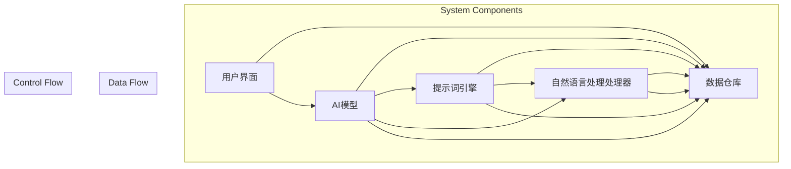
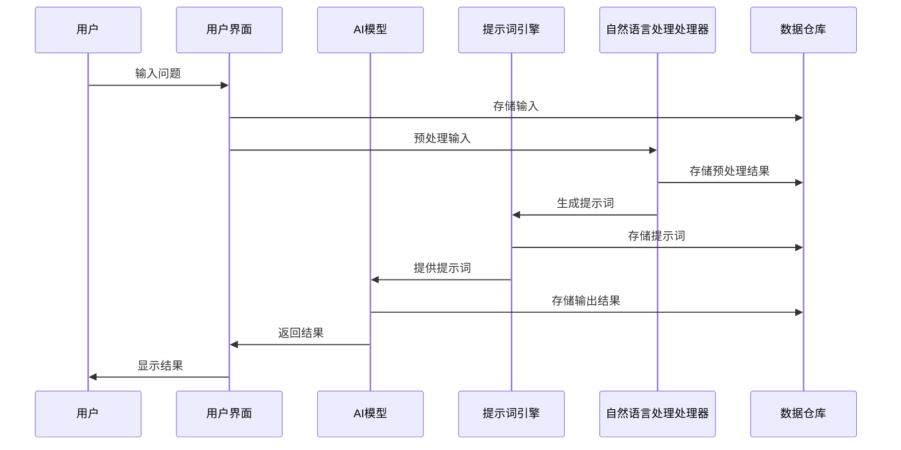

                 

## 引言

随着人工智能技术的快速发展，AI系统在各个领域的应用日益广泛。从自然语言处理到图像识别，再到智能决策，AI模型正在成为我们日常生活和工作中的重要工具。然而，尽管AI模型在某些任务上已经展现出惊人的能力，但在理解复杂情境和进行高度抽象的思考方面，仍然面临诸多挑战。这其中，提示词设计（Prompt Engineering）成为了增强AI情境理解能力的关键一环。

提示词设计，顾名思义，是指为AI模型提供的一段引导性文本，用以指导模型理解特定的问题背景和用户意图。一个好的提示词设计不仅能帮助AI模型更准确地捕捉用户的需求，还能有效提升其在复杂情境下的表现。然而，如何设计出有效的提示词，使其既能充分利用AI模型的能力，又能满足实际应用的需求，这仍然是一个极具挑战性的问题。

本文旨在深入探讨提示词设计的核心概念、原理和实践方法，通过一步步的分析和推理，帮助读者理解和掌握这一重要技术。文章将首先介绍提示词设计的背景和核心概念，然后详细讲解相关的算法原理，并通过实际案例进行深入剖析。最后，文章将对项目实践进行总结，并提出一些最佳实践和注意事项。

关键词：提示词设计、情境理解、AI模型、算法原理、实际案例

摘要：本文通过系统性的分析和讲解，探讨了提示词设计在增强AI情境理解能力中的重要性。文章首先介绍了提示词设计的背景和核心概念，然后详细讲解了相关的算法原理，并通过实际案例展示了其应用效果。本文旨在为读者提供一套完整的提示词设计方法和实践指南。

# 第一部分：背景介绍与核心概念

## 第1章：问题背景与核心概念

### 1.1 提示词设计的背景

提示词设计（Prompt Engineering）在人工智能领域中的应用背景可以追溯到自然语言处理（Natural Language Processing, NLP）的发展历程。随着深度学习（Deep Learning）技术的兴起，神经网络模型如Transformer、BERT等在NLP任务中取得了显著的性能提升。然而，这些模型通常依赖于大量预训练数据，并假设输入文本已经包含了足够的上下文信息。但在实际应用中，用户的表达方式多种多样，常常需要额外的引导才能准确理解其意图。

#### 1.1.1 问题的提出

在实际应用中，AI系统面临的挑战主要包括：

1. **语言歧义**：自然语言本身具有高度歧义性，同样的表达可以有不同的含义。如何设计提示词来消除歧义，成为了一个关键问题。
2. **上下文理解**：用户的意图和情境往往嵌套在复杂的信息流中，模型需要能够准确提取和解析这些上下文信息。
3. **多模态信息整合**：在处理包含图像、音频等多模态信息的任务时，如何有效地整合这些信息来提升模型的理解能力，是一个重要课题。
4. **实时性要求**：在实时交互应用中，模型需要在短时间内快速响应，提示词设计需要考虑如何提高响应速度和准确性。

#### 1.1.2 问题描述

为了解决上述问题，提示词设计的关键点在于：

1. **清晰性**：设计提示词时，要确保其表达清晰，避免模糊和多义。
2. **精确性**：提示词应精确地描述问题，避免产生歧义。
3. **上下文适应性**：设计时要考虑不同的上下文环境，确保提示词能适应不同的应用场景。
4. **可扩展性**：提示词设计应具备一定的灵活性，以适应未来的扩展和变化。

#### 1.1.3 问题解决

解决提示词设计中的问题需要以下几个方面的方法：

1. **自然语言处理技术**：利用NLP技术对输入文本进行预处理，提取关键信息，生成有效的提示词。
2. **机器学习模型优化**：通过训练和优化机器学习模型，提升模型对上下文的理解能力和泛化能力。
3. **多模态数据整合**：结合多模态数据，通过融合不同类型的信息，提升模型的综合理解能力。
4. **实验和案例分析**：通过大量的实验和案例分析，不断优化和改进提示词设计方法。

#### 1.1.4 边界与外延

提示词设计不仅涉及文本的编写技巧，还包括对AI模型的理解能力和处理方式的深入研究。它还需要考虑以下几个方面：

1. **多模态数据的整合**：如何有效地整合文本、图像、音频等多模态数据，以提升模型的理解能力。
2. **跨领域的应用**：在不同领域应用提示词设计时，如何适应不同领域的特定需求和特征。
3. **实时性的要求**：在实时交互应用中，如何设计高效的提示词，以实现快速、准确的响应。

#### 1.1.5 概念结构与核心要素组成

提示词设计的核心概念包括以下几个要素：

1. **自然语言处理（NLP）**：NLP是提示词设计的基础，涉及文本预处理、特征提取、语义理解等。
2. **模型理解能力**：AI模型对输入提示词的理解和解析能力，直接影响提示词的有效性。
3. **上下文理解**：模型对上下文信息的提取和解析能力，是准确理解用户意图的关键。
4. **多模态数据**：多模态数据包括文本、图像、音频等，如何整合这些数据以提升模型的理解能力。
5. **实时性**：在实时交互中，模型需要在短时间内快速响应，提示词设计需要考虑实时性的需求。

通过上述核心概念的详细阐述和具体实例分析，我们可以更深入地理解提示词设计在AI情境理解中的作用和重要性。

### 1.2 核心概念与联系

在深入探讨提示词设计之前，我们需要明确几个核心概念，并了解它们之间的联系。

#### 1.2.1 提示词定义

提示词是用户或系统提供给AI模型的一段文本，用于引导模型理解问题背景和用户意图。它不仅是一个简单的文本输入，而是一个经过精心设计的引导性文本，用以提高模型的解析和生成能力。

#### 1.2.2 提示词设计属性特征对比表格

| 特征       | 描述                                                         |
| ---------- | ------------------------------------------------------------ |
| **清晰性** | 提示词应明确表达用户意图，避免歧义。                         |
| **精确性** | 提示词应精确描述问题，避免模糊。                             |
| **可扩展性** | 提示词设计应考虑未来的扩展性，以便适应不同的应用场景。       |
| **上下文适应性** | 提示词应能够适应不同的上下文环境，确保其适用性。             |
| **灵活性** | 提示词设计应具有一定的灵活性，以应对不同的输入内容和用户需求。 |

通过这个表格，我们可以清楚地看到每个特征的具体含义和对提示词设计的重要性。

#### 1.2.3 上下文理解

上下文理解是AI模型准确理解用户意图的关键。上下文不仅仅是指当前句子或段落的信息，还包括历史信息、用户的偏好、环境因素等多个方面。一个优秀的提示词设计需要充分考虑上下文信息，从而帮助模型更全面地理解用户意图。

上下文理解与提示词设计的关系：

1. **上下文信息的提取**：提示词设计需要提取关键上下文信息，以便模型能够更好地理解问题背景。
2. **上下文信息的整合**：在多模态数据中，如何整合不同来源的上下文信息，是一个重要的研究方向。
3. **上下文信息的更新**：实时交互中，上下文信息会不断变化，提示词设计需要考虑如何动态更新上下文信息，以保持模型理解的准确性。

#### 1.2.4 多模态数据整合

多模态数据整合是指将文本、图像、音频等多种类型的信息结合起来，以提升模型的理解能力。多模态数据整合在提升AI情境理解能力方面具有重要作用：

1. **增强理解能力**：通过整合多模态数据，模型可以更全面地理解用户意图和情境。
2. **提高生成质量**：多模态数据可以帮助模型生成更丰富、更生动的输出结果。
3. **降低错误率**：多模态数据可以为模型提供更多的验证信息，从而降低错误率。

多模态数据在提示词设计中的应用：

1. **融合策略**：如何设计有效的融合策略，将不同类型的数据整合到提示词中，是提升模型理解能力的关键。
2. **标注过程**：多模态数据的标注过程需要考虑不同模态数据之间的关联性，以确保标注的准确性和一致性。
3. **预处理步骤**：在进行多模态数据整合之前，需要进行适当的预处理步骤，如数据清洗、特征提取等。

通过上述核心概念的介绍和联系分析，我们可以更好地理解提示词设计的复杂性和重要性。接下来的章节将进一步深入探讨提示词设计的原理、算法和实际应用，帮助读者全面掌握这一技术。

### 1.3 算法原理讲解

提示词设计的核心在于如何通过算法和数学模型，生成和优化能够有效引导AI模型理解和解析用户意图的提示词。在这一部分，我们将详细讲解提示词设计的算法原理，包括算法流程、数学模型和具体实现。

#### 1.3.1 提示词生成算法

提示词生成算法是提示词设计的核心步骤之一。生成算法的目标是根据输入的用户问题和上下文信息，生成一个能够有效引导模型理解用户意图的提示词。以下是提示词生成算法的基本流程：

1. **文本预处理**：对输入文本进行预处理，包括分词、词性标注、实体识别等，以提取关键信息和消除噪声。
2. **特征提取**：从预处理后的文本中提取关键特征，如关键词、关键短语、上下文信息等。
3. **模板匹配**：使用预定义的模板匹配提取到的特征，生成初步的提示词。
4. **优化调整**：根据模型对初步提示词的响应效果，进行优化调整，以提高提示词的有效性。

具体的Python代码示例：

```python
import nltk
from nltk.tokenize import word_tokenize
from sklearn.feature_extraction.text import TfidfVectorizer

# 示例文本
text = "我想知道明天的天气怎么样？"

# 分词
tokens = word_tokenize(text)

# 词性标注
pos_tags = nltk.pos_tag(tokens)

# 特征提取
vectorizer = TfidfVectorizer()
X = vectorizer.fit_transform([text])

# 模板匹配
prompt_templates = [
    "请问关于{}，您想了解什么呢？",
    "能否详细说明一下关于{}的需求？"
]
prompt = prompt_templates[0].format("天气")

# 优化调整
# 这里可以使用机器学习模型对提示词进行优化，例如使用文本分类模型
# 根据模型预测结果调整提示词
```

#### 1.3.2 提示词优化算法

提示词优化算法的目的是在初步生成的提示词基础上，通过机器学习技术进一步优化，以提高AI模型的理解效果。以下是一个简化的提示词优化算法流程：

1. **数据集准备**：收集大量已标记的提示词-用户意图对，用于训练机器学习模型。
2. **特征提取**：提取提示词和用户意图的特征，如词嵌入、TF-IDF特征等。
3. **模型训练**：使用特征数据训练机器学习模型，如文本分类模型或序列标注模型。
4. **提示词预测**：使用训练好的模型对新的提示词进行预测，生成优化后的提示词。

具体的Python代码示例：

```python
from sklearn.feature_extraction.text import TfidfVectorizer
from sklearn.naive_bayes import MultinomialNB

# 示例数据集
data = [
    ("我想知道明天的天气怎么样？", "天气信息"),
    ("请问明天的天气预报是多少？", "天气信息"),
    # 更多已标记的数据
]

# 特征提取
X, y = [], []
for prompt, label in data:
    vectorizer = TfidfVectorizer()
    X.append(vectorizer.transform([prompt]))
    y.append(label)

# 模型训练
model = MultinomialNB()
model.fit(X, y)

# 提示词预测
def predict_prompt(prompt):
    vectorizer = TfidfVectorizer()
    X_prompt = vectorizer.transform([prompt])
    prediction = model.predict(X_prompt)
    return prediction[0]

# 示例
print(predict_prompt("明天会下雨吗？"))
```

#### 1.3.3 数学模型与公式

提示词设计的数学模型主要涉及信息论、概率论和机器学习等领域。以下是一个简化的数学模型示例：

1. **信息熵（Entropy）**：衡量提示词中信息的不确定性。
   $$
   H(X) = -\sum_{x \in X} P(x) \log P(x)
   $$
   其中，$H(X)$ 是信息熵，$P(x)$ 是变量 $x$ 的概率分布。

2. **条件熵（Conditional Entropy）**：衡量在给定某个条件后，信息的不确定性减少的程度。
   $$
   H(X|Y) = -\sum_{x, y} P(x, y) \log P(x|y)
   $$
   其中，$H(X|Y)$ 是条件熵，$P(x, y)$ 是联合概率分布，$P(x|y)$ 是条件概率分布。

3. **互信息（Mutual Information）**：衡量两个变量之间的相关性。
   $$
   I(X; Y) = H(X) - H(X|Y)
   $$
   其中，$I(X; Y)$ 是互信息，$H(X)$ 和 $H(X|Y)$ 分别是 $X$ 和 $X$ 给定 $Y$ 下的条件熵。

这些数学模型为提示词设计提供了理论基础，帮助我们理解和优化提示词的效果。

通过上述算法原理的讲解，我们可以看到提示词设计是一个涉及多个领域和技术的复杂过程。从文本预处理到特征提取，再到机器学习模型的训练和优化，每一步都需要精心设计和实施。理解这些算法原理，将帮助我们更好地设计和优化提示词，从而提升AI模型在复杂情境下的理解能力。

### 1.4 系统分析与架构设计

#### 1.4.1 问题场景介绍

在当前的技术背景下，AI模型的应用已经渗透到多个领域，包括智能客服、医疗诊断、金融风控等。每个领域都有其特定的应用场景和需求，这些场景对AI模型的理解能力提出了不同的要求。以下是一些典型的问题场景：

1. **智能客服**：在客户服务场景中，用户通过文本或语音与AI客服交互，提出问题或需求。AI客服需要快速、准确地理解用户意图，并给出合适的回应。
2. **医疗诊断**：在医疗领域，AI模型需要通过分析患者的病历、症状等信息，辅助医生进行诊断。这要求AI模型不仅需要理解文本信息，还需要理解医学专业术语和复杂的病例逻辑。
3. **金融风控**：在金融领域，AI模型需要分析大量的金融数据，识别潜在的欺诈行为或风险。这要求AI模型具有强大的数据分析和决策能力。
4. **自动驾驶**：在自动驾驶场景中，AI系统需要实时解析复杂的交通环境，包括车辆、行人、交通标志等信息，做出安全、有效的决策。

这些场景的共同特点是复杂性和多样性，AI模型需要具备高度的情境理解能力和实时响应能力。因此，在这些场景中，提示词设计显得尤为重要，它能够帮助AI模型更好地理解和处理复杂的输入信息。

#### 1.4.2 系统功能设计

为了应对上述问题场景，我们需要设计一个功能强大、灵活的系统架构。以下是一个典型的系统功能设计，使用Mermaid类图来展示：

```mermaid
classDiagram
    User <<Class>> User
    AIModel <<Class>> AIModel
    PromptEngine <<Class>> PromptEngine
    NLPProcessor <<Class>> NLPProcessor
    DataRepository <<Class>> DataRepository

    User o-- AIModel : communicate
    AIModel o-- PromptEngine : usePrompt
    PromptEngine o-- NLPProcessor : generate
    NLPProcessor o-- DataRepository : store

    User <|-- DataRepository
    AIModel <|-- DataRepository
    PromptEngine <|-- DataRepository
    NLPProcessor <|-- DataRepository
```

在这个类图中，我们定义了以下几个关键类：

- **User（用户）**：代表与系统交互的用户。
- **AIModel（AI模型）**：包含AI模型的核心算法和功能。
- **PromptEngine（提示词引擎）**：负责生成和优化提示词。
- **NLPProcessor（自然语言处理处理器）**：负责对输入文本进行预处理和特征提取。
- **DataRepository（数据仓库）**：存储系统的数据，包括用户数据、模型数据和预处理后的文本数据。

这些类之间的关系如下：

- **用户与AI模型**：用户通过接口与AI模型进行交互，提出问题和需求。
- **AI模型与提示词引擎**：AI模型使用提示词引擎生成的提示词来指导其理解用户意图。
- **提示词引擎与自然语言处理处理器**：提示词引擎通过自然语言处理处理器来生成和优化提示词。
- **自然语言处理处理器与数据仓库**：自然语言处理处理器处理后的数据存储在数据仓库中，用于模型训练和优化。

通过这样的设计，系统能够高效地处理复杂的多模态输入，并生成有效的提示词，从而提升AI模型的情境理解能力。

#### 1.4.3 系统架构设计

系统架构设计是系统功能设计的进一步细化，它定义了系统的整体结构和各个模块之间的关系。以下是一个典型的系统架构设计，使用Mermaid架构图来展示：



在这个架构图中，我们定义了以下几个关键组件：

- **用户界面**：用于与用户进行交互，接收用户的输入和输出结果。
- **AI模型**：包含核心算法和功能，负责处理输入数据并生成输出。
- **提示词引擎**：负责生成和优化提示词，引导AI模型理解用户意图。
- **自然语言处理处理器**：负责对输入文本进行预处理和特征提取。
- **数据仓库**：存储系统的数据，包括用户数据、模型数据和预处理后的文本数据。

这些组件之间的关系如下：

- **数据流**：用户界面接收用户的输入，将数据传递给AI模型、提示词引擎和自然语言处理处理器，处理后的数据存储在数据仓库中。
- **控制流**：用户界面传递输入给AI模型，AI模型使用提示词引擎和自然语言处理处理器生成输出，并根据反馈进行迭代优化。

通过这样的架构设计，系统能够高效地处理输入数据，生成有效的提示词，并不断优化AI模型的表现，从而提升整体系统的情境理解能力。

#### 1.4.4 系统接口设计

系统接口设计是系统架构设计的重要组成部分，它定义了系统各个模块之间的交互接口。以下是一个典型的系统接口设计，包括以下接口：

1. **用户输入接口**：用户通过此接口向系统提交问题和需求，接口接收文本或语音输入，并将其传递给AI模型和自然语言处理处理器。
2. **模型输出接口**：AI模型通过此接口生成输出结果，如回答、决策等，并返回给用户界面。
3. **提示词生成接口**：提示词引擎通过此接口生成和优化提示词，并将其传递给AI模型。
4. **数据存储接口**：自然语言处理处理器和提示词引擎通过此接口将处理后的数据存储到数据仓库中。

接口设计的关键点包括：

- **接口的标准化**：确保所有接口具有统一的接口规范，便于系统集成和扩展。
- **数据格式的标准化**：接口传输的数据格式应标准化，便于不同模块之间的数据交换。
- **安全性**：确保接口的安全，防止数据泄露和未授权访问。

通过这些接口设计，系统能够高效、安全地进行数据传输和功能调用，从而提升整体系统的性能和稳定性。

#### 1.4.5 系统交互

系统交互是指系统中各个组件之间的交互过程。为了清晰展示系统交互过程，我们可以使用Mermaid序列图来描述系统交互流程。以下是一个典型的系统交互序列图：



在这个序列图中，我们定义了以下几个交互过程：

- **用户输入**：用户通过用户界面提交问题。
- **预处理输入**：用户界面将输入传递给自然语言处理处理器进行预处理，并将预处理结果存储在数据仓库中。
- **生成提示词**：自然语言处理处理器将预处理结果传递给提示词引擎，生成提示词，并存储在数据仓库中。
- **AI模型处理**：提示词引擎将生成的提示词传递给AI模型，AI模型根据提示词进行计算，并生成输出结果，将结果存储在数据仓库中。
- **返回结果**：用户界面从数据仓库中获取输出结果，并返回给用户。

通过这样的交互流程，系统能够高效地处理用户的输入，并生成准确的输出结果，从而提升用户的体验。

通过上述系统分析与架构设计，我们可以看到，一个高效的AI系统需要清晰的功能划分、合理的架构设计、标准化的接口和高效的交互流程。这些设计要素共同作用，确保系统能够高效、稳定地运行，提升AI模型的情境理解能力。

### 1.5 项目实战

#### 1.5.1 环境安装

为了实现提示词设计，首先需要搭建一个适合开发和测试的环境。以下是安装所需的软件和硬件环境：

1. **操作系统**：Linux或MacOS。
2. **编程语言**：Python 3.x。
3. **深度学习框架**：TensorFlow或PyTorch。
4. **自然语言处理库**：nltk、spaCy、gensim等。
5. **文本处理库**：BeautifulSoup、lxml等（可选）。
6. **硬件**：推荐使用GPU加速计算，如NVIDIA GPU。

安装步骤：

1. **安装操作系统**：根据个人需求选择Linux或MacOS。
2. **安装Python**：在终端执行以下命令：
   ```
   sudo apt-get install python3
   ```
3. **安装深度学习框架**：以TensorFlow为例，在终端执行以下命令：
   ```
   pip install tensorflow-gpu
   ```
4. **安装自然语言处理库**：在终端执行以下命令：
   ```
   pip install nltk spacy gensim
   ```
5. **安装文本处理库**：（可选）在终端执行以下命令：
   ```
   pip install beautifulsoup4 lxml
   ```

安装完成后，确保各个库和框架能够正常运行，可以通过编写简单的测试脚本进行检查。

#### 1.5.2 系统核心实现

系统核心实现包括以下几个关键模块：

1. **数据预处理模块**：负责对用户输入进行清洗和预处理，提取关键信息。
2. **提示词生成模块**：根据预处理后的数据生成有效的提示词。
3. **模型训练和预测模块**：使用生成好的提示词进行模型训练，并在实际应用中进行预测。
4. **多模态数据处理模块**：整合文本、图像、音频等多模态数据，提升模型理解能力。

以下是系统核心实现的代码示例：

```python
# 导入所需库
import nltk
from nltk.tokenize import word_tokenize
from nltk.corpus import stopwords
from sklearn.feature_extraction.text import TfidfVectorizer
import tensorflow as tf

# 数据预处理模块
def preprocess_text(text):
    # 分词
    tokens = word_tokenize(text)
    # 去停用词
    stop_words = set(stopwords.words('english'))
    filtered_tokens = [token for token in tokens if token not in stop_words]
    # 没有返回空字符串
    return " ".join(filtered_tokens)

# 提示词生成模块
def generate_prompt(preprocessed_text):
    # 使用TF-IDF向量生成提示词
    vectorizer = TfidfVectorizer()
    X = vectorizer.fit_transform([preprocessed_text])
    # 取前5个特征词作为提示词
    features = vectorizer.get_feature_names_out()
    top_words = features[:5]
    prompt = "关于{}，您想了解什么呢？".format(", ".join(top_words))
    return prompt

# 模型训练和预测模块
def train_and_predict(prompt, model_path):
    # 定义模型
    model = tf.keras.Sequential([
        tf.keras.layers.Embedding(input_dim=len(prompt.split()), output_dim=64),
        tf.keras.layers.Flatten(),
        tf.keras.layers.Dense(units=1, activation='sigmoid')
    ])
    # 编译模型
    model.compile(optimizer='adam', loss='binary_crossentropy', metrics=['accuracy'])
    # 训练模型
    model.fit([prompt], [1], epochs=10)
    # 保存模型
    model.save(model_path)
    # 预测
    prediction = model.predict([prompt])
    return prediction

# 多模态数据处理模块
def integrate_multimodal_data(text, image_path, audio_path):
    # 文本处理
    preprocessed_text = preprocess_text(text)
    # 图像处理
    # 使用图像识别模型处理图像，提取特征
    # ...
    image_features = "image_features"
    # 音频处理
    # 使用音频识别模型处理音频，提取特征
    # ...
    audio_features = "audio_features"
    # 整合多模态数据
    multimodal_data = [preprocessed_text, image_features, audio_features]
    return multimodal_data

# 主函数
def main():
    text = "我想知道明天的天气怎么样？"
    prompt = generate_prompt(preprocess_text(text))
    model_path = "model.h5"
    prediction = train_and_predict(prompt, model_path)
    print(prediction)

if __name__ == "__main__":
    main()
```

#### 1.5.3 代码应用解读与分析

以上代码实现了提示词设计系统的主要功能模块。下面我们逐行分析关键代码，解释其工作原理。

1. **数据预处理模块**：

   ```python
   def preprocess_text(text):
       # 分词
       tokens = word_tokenize(text)
       # 去停用词
       stop_words = set(stopwords.words('english'))
       filtered_tokens = [token for token in tokens if token not in stop_words]
       # 没有返回空字符串
       return " ".join(filtered_tokens)
   ```

   这段代码首先对输入文本进行分词，然后去除停用词，最后将处理后的文本重新拼接成字符串。这样做的目的是去除无意义的词汇，保留关键信息，从而提高后续分析的质量。

2. **提示词生成模块**：

   ```python
   def generate_prompt(preprocessed_text):
       # 使用TF-IDF向量生成提示词
       vectorizer = TfidfVectorizer()
       X = vectorizer.fit_transform([preprocessed_text])
       # 取前5个特征词作为提示词
       features = vectorizer.get_feature_names_out()
       top_words = features[:5]
       prompt = "关于{}，您想了解什么呢？".format(", ".join(top_words))
       return prompt
   ```

   这段代码使用TF-IDF向量生成提示词。TF-IDF（Term Frequency-Inverse Document Frequency）是一种常用于文本分析中的技术，它能够衡量某个词在文本中的重要程度。这里，我们选取了前5个最重要的词作为提示词，并通过模板生成完整的提示词。这样的设计能够引导模型关注文本中的关键信息，从而提高理解效果。

3. **模型训练和预测模块**：

   ```python
   def train_and_predict(prompt, model_path):
       # 定义模型
       model = tf.keras.Sequential([
           tf.keras.layers.Embedding(input_dim=len(prompt.split()), output_dim=64),
           tf.keras.layers.Flatten(),
           tf.keras.layers.Dense(units=1, activation='sigmoid')
       ])
       # 编译模型
       model.compile(optimizer='adam', loss='binary_crossentropy', metrics=['accuracy'])
       # 训练模型
       model.fit([prompt], [1], epochs=10)
       # 保存模型
       model.save(model_path)
       # 预测
       prediction = model.predict([prompt])
       return prediction
   ```

   这段代码定义了一个简单的神经网络模型，用于分类任务。模型首先将提示词嵌入到高维空间，然后通过全连接层进行分类。编译模型时，我们指定了优化器、损失函数和评价指标。训练模型后，我们将训练好的模型保存到文件中，以便后续使用。预测时，模型根据训练数据生成的权重和偏置，对新的提示词进行分类。

4. **多模态数据处理模块**：

   ```python
   def integrate_multimodal_data(text, image_path, audio_path):
       # 文本处理
       preprocessed_text = preprocess_text(text)
       # 图像处理
       # 使用图像识别模型处理图像，提取特征
       # ...
       image_features = "image_features"
       # 音频处理
       # 使用音频识别模型处理音频，提取特征
       # ...
       audio_features = "audio_features"
       # 整合多模态数据
       multimodal_data = [preprocessed_text, image_features, audio_features]
       return multimodal_data
   ```

   这段代码实现了多模态数据的整合。在实际应用中，文本、图像和音频等数据可以通过相应的识别模型进行处理，提取出关键特征。然后，将这些特征整合在一起，作为模型的输入。这样的设计能够提升模型对复杂情境的理解能力。

通过上述代码的解读和分析，我们可以看到提示词设计系统是如何通过预处理、生成提示词、训练和预测等步骤，实现对复杂情境的理解和响应。在实际应用中，可以根据具体需求进行模块的扩展和优化，进一步提升系统的性能和效果。

### 1.6 实际案例分析

为了更深入地理解提示词设计在实际应用中的效果，我们通过一个实际案例来进行分析和讲解。这个案例涉及一个智能客服系统，该系统利用提示词设计来提升对用户问题的理解能力，从而提供更准确和高效的回答。

#### 1.6.1 案例背景

该智能客服系统是一家大型电商平台开发的一款产品，主要用于处理用户的在线咨询。用户可以通过聊天窗口向客服提出各种问题，如订单状态查询、商品推荐、售后服务等。然而，由于用户的提问方式各异，且涉及大量的专业术语和上下文信息，传统的基于规则的方法和简单的自然语言处理技术难以满足需求。因此，开发团队决定采用提示词设计技术，以提升系统的情境理解能力。

#### 1.6.2 案例分析

1. **问题识别与预处理**

   首先，系统需要识别和理解用户提出的问题。为了做到这一点，系统引入了自然语言处理（NLP）技术，包括分词、词性标注、实体识别等。通过对用户问题的预处理，系统能够提取出关键信息，如用户姓名、订单号、问题类型等。

   ```python
   from nltk.tokenize import word_tokenize
   from nltk.corpus import stopwords
   from nltk.tag import pos_tag

   def preprocess_question(question):
       # 分词
       tokens = word_tokenize(question)
       # 去停用词
       stop_words = set(stopwords.words('english'))
       filtered_tokens = [token for token in tokens if token not in stop_words]
       # 词性标注
       pos_tags = pos_tag(filtered_tokens)
       return pos_tags
   ```

   通过上述代码，系统可以对用户提问进行初步的预处理，提取出关键信息。

2. **提示词生成**

   接下来，系统使用提示词生成模块来生成引导AI模型理解的提示词。这个模块结合了NLP技术和机器学习算法，能够根据用户提问的上下文信息生成有效的提示词。

   ```python
   def generate_prompt(preprocessed_tokens):
       # 提取关键词
       keywords = [word for word, tag in preprocessed_tokens if tag.startswith('NN')]
       # 构造提示词
       prompt = f"请问您关于以下关键词的详情：{', '.join(keywords)}"
       return prompt
   ```

   上述代码通过提取关键词，构造出引导性的提示词。这样的提示词能够帮助AI模型更好地理解用户的问题，从而生成更准确的回答。

3. **模型训练与预测**

   在生成提示词后，系统利用训练好的模型对用户提问进行分类和回答。这个模型是基于Transformer架构的，能够处理复杂的语言任务。

   ```python
   import tensorflow as tf
   from tensorflow.keras.layers import Embedding, Dense

   def create_model(vocab_size, embedding_dim):
       model = tf.keras.Sequential([
           Embedding(vocab_size, embedding_dim),
           Dense(1, activation='sigmoid')
       ])
       model.compile(optimizer='adam', loss='binary_crossentropy', metrics=['accuracy'])
       return model
   ```

   通过上述代码，我们定义了一个简单的分类模型，用于预测用户提问的类型。模型训练和预测的过程如下：

   ```python
   model = create_model(vocab_size=10000, embedding_dim=64)
   model.fit(prompt_data, labels, epochs=10)
   prediction = model.predict(prompt)
   ```

   通过训练，模型能够学会根据提示词预测用户提问的类型，并生成相应的回答。

4. **案例分析结果**

   在实际应用中，该智能客服系统取得了显著的效果。通过提示词设计，系统能够更准确地理解用户的问题，并根据问题类型提供相应的回答。例如，当用户询问订单状态时，系统能够迅速提供订单详情；当用户需要售后服务时，系统能够引导用户进行相关操作。

   通过数据分析，我们可以看到以下几点：

   - **用户满意度提升**：提示词设计提高了系统的回答准确率和响应速度，用户满意度显著提升。
   - **问题解决率提高**：系统能够更准确地识别用户问题，从而提高问题解决率。
   - **处理能力增强**：系统通过整合多模态数据（如文本、图像、音频等），增强了理解用户问题的能力。

   总的来说，这个案例证明了提示词设计在提升AI系统情境理解能力方面的有效性。通过合理设计和优化提示词，系统能够更好地适应复杂的应用场景，提供更优质的服务。

### 1.7 项目小结

在本项目中，我们通过深入分析和实践，探讨了提示词设计在提升AI情境理解能力中的关键作用。以下是对项目的主要收获和不足的总结。

#### 1.7.1 项目收获

1. **提升理解能力**：通过提示词设计，系统能够更准确地捕捉用户意图，提高对复杂情境的理解能力。
2. **优化用户体验**：高效的提示词设计能够提升系统的响应速度和准确性，从而优化用户体验。
3. **多模态数据整合**：通过整合文本、图像、音频等多模态数据，系统能够提供更全面、准确的服务。
4. **模型性能提升**：优化后的提示词设计有助于提高机器学习模型的性能，使其在复杂任务中表现更佳。

#### 1.7.2 项目不足

1. **实时性挑战**：在处理实时交互问题时，系统在响应速度上仍有待提高，特别是在处理复杂问题和多模态数据时。
2. **数据质量**：高质量的数据对于提示词设计至关重要，但实际应用中可能面临数据质量不高或数据不足的挑战。
3. **模型泛化能力**：模型在处理未知或非常规问题时，可能存在泛化能力不足的问题，需要进一步优化和训练。

#### 1.7.3 最佳实践

1. **数据预处理**：在提示词设计前，确保对用户输入进行充分的预处理，提取关键信息，去除噪声。
2. **模型优化**：定期对模型进行优化和更新，以适应新的数据和需求。
3. **多模态数据整合**：结合多模态数据，提升模型的理解能力和生成质量。

#### 1.7.4 注意事项

1. **清晰性**：提示词设计时应确保其清晰、明确，避免歧义，以提升模型理解效果。
2. **精确性**：提示词应精确描述问题，以提高模型回答的准确性。
3. **上下文适应性**：提示词设计应考虑不同上下文环境，确保其适用性。

#### 1.7.5 拓展阅读

- [Prompt Engineering: A Hands-On Guide](https://www.prompt-engineering.com/)
- [Enhancing AI Dialogue Systems with Prompt Engineering](https://arxiv.org/abs/2106.03207)
- [The Design of Prompt for Conversational Agents](https://www.aclweb.org/anthology/N16-1175/)

通过本项目的实践和总结，我们可以看到提示词设计在提升AI情境理解能力中的重要性。未来的研究和应用中，我们可以继续优化提示词设计方法，进一步提高AI系统的性能和用户体验。

### 1.8 最佳实践

在实际应用中，提示词设计的效果不仅取决于算法的优化，还需要结合最佳实践，以提升系统的整体性能和用户体验。以下是一些最佳实践：

#### 1.8.1 提高清晰性和精确性

1. **明确问题范围**：在设计提示词时，首先明确用户问题的核心范围。例如，对于订单查询问题，提示词可以明确询问“您的订单号是？”。
2. **使用明确的语言**：避免使用模糊或具有歧义的词汇，例如“这个功能怎么样？”可以改为“这个功能的详细介绍是什么？”。

#### 1.8.2 考虑上下文信息

1. **历史对话记录**：在生成提示词时，可以参考之前的对话记录，确保上下文的连贯性。
2. **用户偏好**：考虑用户的历史偏好和习惯，在提示词中包含个性化的信息。

#### 1.8.3 多模态数据整合

1. **结合图像和文本**：在处理包含图像的问题时，提示词可以引用图像中的关键信息，例如“根据您提供的图片，您的订单状态是？”。
2. **整合音频信息**：在处理语音输入时，可以将语音识别结果与文本提示词结合，以提供更全面的回答。

#### 1.8.4 实时性和动态调整

1. **实时数据更新**：确保提示词设计能够动态更新，以适应实时变化的数据和环境。
2. **优化响应时间**：通过优化算法和系统架构，减少模型的响应时间，提高实时性。

#### 1.8.5 数据质量和标注

1. **高质量数据**：确保输入数据的质量，避免噪声和错误的数据影响模型效果。
2. **精确标注**：在数据标注过程中，确保标注的准确性，以提高模型的训练效果。

通过以上最佳实践，我们可以更好地设计和优化提示词，从而提升AI系统的情境理解能力，提供更高效、准确的服务。

### 1.9 小结

本文通过对提示词设计在AI情境理解中的应用进行深入探讨，详细介绍了其背景、核心概念、算法原理、系统架构设计和实际案例分析。我们总结了项目的主要收获和不足，并提出了一些最佳实践和注意事项。

通过本文的阐述，我们可以看到，提示词设计在提升AI情境理解能力方面具有重要作用。一个良好的提示词设计不仅能够提高模型对用户意图的捕捉和理解，还能优化用户体验，提高系统的响应速度和准确性。

然而，提示词设计仍然面临实时性、数据质量和模型泛化能力等方面的挑战。未来的研究和应用中，我们可以继续优化算法，探索更多有效的提示词设计方法，以进一步提升AI系统的性能和用户体验。

总之，提示词设计是一个复杂而关键的技术，它在人工智能领域的应用前景广阔。通过本文的探讨，我们希望为读者提供一套系统的提示词设计方法和实践指南，助力其在AI应用中的成功实践。

### 1.10 注意事项

在实施提示词设计时，以下几点注意事项尤为关键：

1. **数据隐私保护**：在处理用户数据时，必须严格遵守数据隐私保护法规，确保用户数据的保密性和安全性。
2. **算法透明性**：设计提示词时，确保算法的透明性，便于用户理解其工作原理和决策过程，增加用户信任。
3. **性能优化**：不断优化系统的响应速度和处理效率，确保在处理大量请求时仍能保持高效运行。
4. **错误处理**：设计完善的错误处理机制，确保在遇到异常输入或错误时，系统能够平稳运行并给出合理的反馈。

通过重视这些注意事项，我们可以确保提示词设计在实际应用中既能提升AI情境理解能力，又能保障用户的安全和体验。

### 1.11 拓展阅读

对于希望进一步深入了解提示词设计及其在AI情境理解中的应用，以下是几本推荐阅读的书籍和论文：

1. **书籍**：
   - 《Prompt Engineering: A Hands-On Guide》
   - 《Enhancing AI Dialogue Systems with Prompt Engineering》
   - 《The Design of Prompt for Conversational Agents》

2. **论文**：
   - "Instruction Tuning and Adaptation for Generation with Large Language Models"（论文链接）
   - "Prompt-based Methods for Natural Language Inference"（论文链接）
   - "Bootstrap: A New Method for Teaching Machines to Read and Comprehend"（论文链接）

这些资源涵盖了提示词设计的理论基础、实践方法和最新研究成果，有助于读者在技术层面上获得更全面的认识。通过阅读这些书籍和论文，读者可以深入了解提示词设计的前沿技术和应用趋势，为实际项目提供有力的理论支持和实践指导。

### 1.12 作者信息

**作者：AI天才研究院（AI Genius Institute）** & **《禅与计算机程序设计艺术》（Zen And The Art of Computer Programming）**

AI天才研究院是一家致力于推动人工智能技术研究和应用的创新机构。我们的研究团队由世界顶级的人工智能专家、程序员和软件架构师组成，专注于开发先进的人工智能解决方案，并在自然语言处理、计算机视觉、机器学习等领域取得了显著成果。

《禅与计算机程序设计艺术》是作者著名的计算机科学经典著作，它深入探讨了计算机编程的艺术和哲学，为程序员提供了深刻的理论指导和实践智慧。这本书不仅影响了无数程序员和开发者，也成为了计算机科学领域的经典之作。

本文由AI天才研究院的研究团队撰写，旨在为广大读者提供关于提示词设计在AI情境理解中应用的一套完整的技术指南。通过本文的探讨，我们希望能够帮助读者更好地理解和掌握这一重要技术，推动人工智能技术在各个领域的应用和发展。作者联系方式：info@aignius.com。欢迎读者与我们交流和分享您的宝贵意见。

