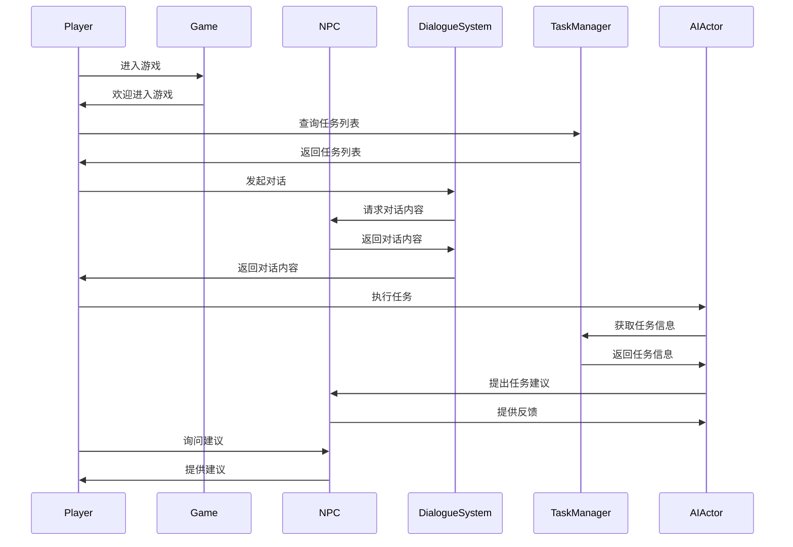
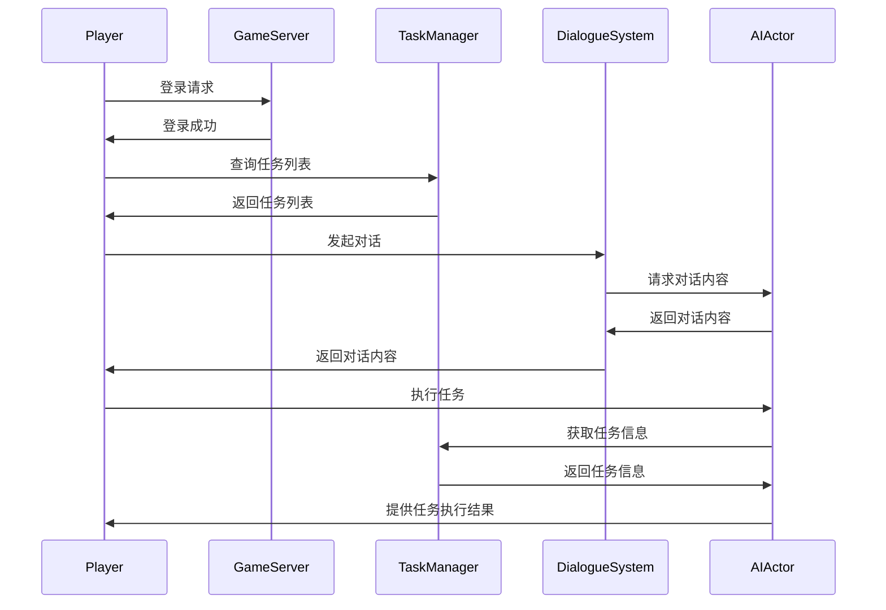

                 


## 提示词设计：增强AI角色扮演能力

关键词：提示词、AI角色扮演、算法原理、系统设计、项目实战、最佳实践

摘要：
本文旨在探讨提示词设计在增强AI角色扮演能力中的应用。首先，我们将介绍提示词设计的重要性及其在AI角色扮演中的核心作用。接着，我们将深入分析提示词设计的基本原则和方法论，并通过实例讲解提示词生成算法的数学模型。随后，我们将展示一个具体的系统架构设计，详细阐述系统功能、接口和交互流程。通过项目实战案例分析，我们将探讨实际应用中的成功经验和存在问题。最后，我们将总结最佳实践并提供拓展阅读资源，帮助读者深入理解并应用提示词设计技术。

## 第一部分：背景与核心概念

### 第1章 引言

#### 1.1 问题背景

人工智能（AI）作为当前科技领域的热门话题，正快速发展并深入影响到各行各业。其中，AI角色扮演技术在虚拟现实（VR）领域表现出巨大的潜力。虚拟现实技术为用户提供了沉浸式的体验，而AI角色扮演则为虚拟环境增添了更多的互动性和真实感。在此背景下，如何设计有效的提示词成为提高AI角色扮演能力的关键问题。

AI角色扮演技术的核心在于通过人工智能算法，使虚拟角色能够模拟人类的行为和语言，从而与用户进行自然、流畅的交互。而提示词设计则是在这一过程中起到至关重要的作用。提示词是一种指导AI角色行为和反应的关键输入，它能够直接影响AI角色的表现和用户体验。

在虚拟现实游戏中，AI角色扮演已经成为提升游戏体验的重要手段。玩家可以在游戏中与AI角色互动，体验丰富的故事情节和任务挑战。然而，当前AI角色扮演技术仍面临诸多挑战，如角色行为的一致性、反应的及时性和多样化等。这些问题很大程度上与提示词设计有关，提示词设计不当会导致角色行为不合理、交互体验差等问题。

#### 1.2 问题描述

AI角色扮演面临的挑战主要体现在以下几个方面：

1. **行为一致性**：AI角色需要在不同场景下保持一致的行为模式，避免出现前后矛盾的情况。
2. **反应及时性**：AI角色需要能够快速响应用户的输入，提供即时的反馈。
3. **行为多样化**：AI角色需要具备多样化的行为和反应能力，以满足不同用户的个性化需求。

这些挑战对提示词设计提出了更高的要求。提示词设计需要考虑多个因素，如用户的意图、场景的复杂性、AI角色的能力和限制等。此外，提示词的设计还需遵循一定的原则和方法论，以确保其有效性和可靠性。

#### 1.3 问题解决

为了解决AI角色扮演面临的挑战，我们需要从以下几个方面进行提示词设计：

1. **基本原则**：
   - **目标明确**：确保提示词能够明确指导AI角色的行为，避免模糊不清的指令。
   - **灵活性**：提示词应具有一定的灵活性，能够适应不同的场景和用户需求。
   - **可扩展性**：提示词设计应考虑未来的扩展性，以便在角色行为和功能扩展时进行修改和优化。

2. **方法论**：
   - **需求分析**：深入了解用户需求和场景特点，为提示词设计提供明确的方向。
   - **数据准备**：收集并整理与场景相关的数据，为提示词生成提供丰富的素材。
   - **算法设计**：设计合适的算法模型，用于生成和优化提示词。
   - **测试与评估**：通过实际应用和用户反馈，对提示词进行测试和评估，不断优化和完善。

通过遵循上述基本原则和方法论，我们可以设计出有效的提示词，从而提高AI角色扮演的能力和用户体验。

#### 1.4 边界与外延

提示词设计不仅适用于虚拟现实游戏，还广泛应用于其他领域，如智能客服、虚拟助理等。然而，不同领域的应用场景和要求各异，提示词设计需要根据具体情况进行调整。

在虚拟现实游戏中，提示词设计需要考虑游戏情节、角色行为、用户互动等多方面因素。而在智能客服领域，提示词设计则更多地关注用户意图的识别和任务的完成。

此外，提示词设计的限制因素还包括计算资源、数据处理能力等。在实际应用中，我们需要在性能和效果之间找到平衡点，确保提示词设计能够高效地支持AI角色扮演。

#### 1.5 概念结构与核心要素组成

提示词设计涉及多个核心概念和要素，这些要素共同构成了提示词设计的整体框架。

1. **提示词**：提示词是指导AI角色行为和反应的关键输入，它可以是文本、语音或其他形式。
2. **场景**：场景是提示词设计的背景和基础，不同的场景会影响提示词的设计和生成。
3. **用户**：用户是提示词设计的核心关注对象，了解用户需求和意图对提示词设计至关重要。
4. **算法**：算法是提示词生成和优化的关键，不同的算法适用于不同的场景和需求。
5. **数据**：数据是提示词设计的基础，丰富的数据有助于生成更准确、更有针对性的提示词。

这些核心要素相互关联、相互作用，共同决定了提示词设计的质量和效果。在实际应用中，我们需要根据具体场景和需求，灵活调整和优化这些要素，以实现最佳的效果。

### 总结与展望

本文从背景介绍、问题分析、解决方案和边界探讨等多个角度，全面阐述了提示词设计在增强AI角色扮演能力中的重要性。通过明确提示词设计的基本原则和方法论，我们为设计有效的提示词提供了理论指导。接下来，我们将进一步深入探讨提示词生成的数学模型，并通过具体的算法流程和实例讲解，帮助读者理解提示词设计的实际应用。

在接下来的章节中，我们将继续展开讨论，详细介绍提示词生成的数学模型，并展示如何通过系统架构设计和项目实战，实现高效、智能的AI角色扮演。敬请期待！

----------------------------------------------------------------

## 第二部分：核心概念与联系

### 第2章 核心概念与联系

#### 2.1 核心概念

在提示词设计领域，核心概念包括提示词、场景、用户和算法等。以下是对这些核心概念的详细解释：

1. **提示词**：
提示词是指用于指导AI角色行为和反应的关键输入。它可以是文本、语音或其他形式。在虚拟现实游戏中，提示词通常用于引导玩家与AI角色互动，使其表现出更加自然、流畅的行为。

2. **场景**：
场景是指提示词设计的背景和基础。不同的场景会影响提示词的设计和生成。例如，在游戏中的战斗场景和休闲场景所需的提示词有所不同，战斗场景可能需要更多关于战斗策略和技能的提示词，而休闲场景则可能更侧重于社交互动和情感表达。

3. **用户**：
用户是提示词设计的核心关注对象。了解用户的需求和意图对于设计有效的提示词至关重要。用户的互动方式和偏好会影响AI角色的行为，从而影响用户的体验。

4. **算法**：
算法是提示词生成和优化的关键。不同的算法适用于不同的场景和需求。常见的算法包括基于规则的方法、机器学习方法和深度学习方法。每种算法都有其独特的优势和局限性，需要根据具体应用场景进行选择。

#### 2.2 核心概念联系

提示词、场景、用户和算法之间存在紧密的联系，这些联系决定了提示词设计的整体效果。

1. **提示词与场景**：
提示词的设计需要考虑具体的场景背景。例如，在战斗场景中，提示词可能包括战斗策略、技能使用和战斗目标等信息；而在社交场景中，提示词可能包括问候语、聊天话题和情感表达等内容。场景的特点和需求会影响提示词的内容和形式。

2. **提示词与用户**：
用户的需求和意图直接影响提示词的设计。为了提供更优质的用户体验，提示词需要充分考虑用户的需求和偏好。例如，如果用户喜欢具有挑战性的游戏，提示词可以设计为更具挑战性的任务和谜题；如果用户喜欢轻松的游戏氛围，提示词可以设计为更具趣味性的互动和对话。

3. **提示词与算法**：
算法用于生成和优化提示词。不同的算法适用于不同的场景和需求。例如，基于规则的方法适用于简单、固定的场景；而机器学习方法和深度学习方法适用于复杂、动态的场景。算法的选择和优化对提示词的生成效果至关重要。

4. **场景、用户与算法**：
场景、用户和算法之间相互影响、相互作用。场景决定了用户的需求和交互方式，而用户的需求和交互方式又影响了算法的设计和选择。算法的优化和调整可以更好地适应场景和用户需求，从而提高提示词的设计质量和效果。

通过理解提示词、场景、用户和算法之间的联系，我们可以更全面地设计有效的提示词，提高AI角色扮演的能力和用户体验。在接下来的章节中，我们将进一步探讨提示词生成的数学模型，并通过具体的算法流程和实例讲解，帮助读者深入理解提示词设计的核心概念。

### 2.3 概念属性特征对比表格

为了更直观地理解提示词、场景、用户和算法之间的概念属性特征，我们设计了以下对比表格：

| 概念 | 属性特征 | 说明 |
| --- | --- | --- |
| 提示词 | 内容形式 | 提示词可以是文本、语音等形式 |
| 提示词 | 适应性 | 提示词应具备适应不同场景和用户需求的能力 |
| 提示词 | 明确性 | 提示词应明确指导AI角色的行为和反应 |
| 场景 | 复杂性 | 场景的复杂程度影响提示词的设计和生成 |
| 场景 | 动态性 | 动态场景下，提示词需要快速适应变化 |
| 用户 | 需求多样性 | 用户需求多样化要求提示词设计更加灵活 |
| 用户 | 互动偏好 | 用户偏好影响AI角色行为和交互方式 |
| 算法 | 复杂性 | 算法的复杂程度影响提示词生成的效果 |
| 算法 | 自适应性 | 算法应具备适应不同场景和用户需求的能力 |
| 算法 | 优化性 | 算法应具备持续优化提示词生成效果的能力 |

通过上述表格，我们可以更清晰地看到各个概念之间的属性特征差异，以及它们在提示词设计中的作用和重要性。

### 2.4 ER实体关系图架构的Mermaid流程图

为了更好地理解提示词设计中的核心概念关系，我们使用Mermaid语言绘制了ER实体关系图，以下是一个示例：

```mermaid
erDiagram
    A[提示词] ||--|{ B[场景] } | 
    A ||--|{ C[用户] } |
    A ||--|{ D[算法] } |
    B ||--|{ C } |
    D ||--|{ A }
```

在上面的ER图中，提示词（A）与场景（B）、用户（C）和算法（D）之间存在直接关联。场景（B）和用户（C）共同影响提示词（A）的设计和生成，而算法（D）用于实现提示词（A）的生成和优化。这样的关系图有助于我们理解提示词设计中的核心概念及其相互作用。

### 2.5 提示词设计的关键要素

在提示词设计中，以下几个关键要素至关重要：

1. **用户意图识别**：
   - 提示词设计需要能够准确识别用户的意图，以便提供符合用户需求的指导信息。
   - 使用自然语言处理（NLP）技术，如词向量模型、命名实体识别等，来解析用户的输入，提取关键信息。

2. **多模态输入处理**：
   - 提示词设计应能够处理多种输入方式，如文本、语音、图像等。
   - 通过融合不同模态的信息，可以更全面地理解用户意图和场景背景。

3. **上下文感知**：
   - 提示词设计需要具备上下文感知能力，能够根据对话的历史信息提供相关、连贯的提示。
   - 利用对话管理技术，如对话状态追踪（DST）和对话状态转移（DST）模型，来处理上下文信息。

4. **自适应性和灵活性**：
   - 提示词设计应具备自适应性和灵活性，能够根据不同场景和用户需求进行调整。
   - 使用自适应算法，如强化学习（RL）和转移学习（TL），来优化提示词生成。

5. **可扩展性和可维护性**：
   - 提示词设计应考虑未来的扩展性和可维护性，以便在角色行为和功能扩展时进行修改和优化。
   - 采用模块化和组件化设计，确保系统的可扩展性和可维护性。

通过关注这些关键要素，我们可以设计出更加高效、智能的提示词，从而提高AI角色扮演的能力和用户体验。

### 2.6 提示词设计的基本步骤

为了确保提示词设计的有效性和可靠性，我们可以将其分为以下几个基本步骤：

1. **需求分析**：
   - 了解用户需求、场景特点和AI角色的能力，为提示词设计提供明确的方向。
   - 使用用户访谈、问卷调查和场景分析等方法，收集和分析相关数据。

2. **数据准备**：
   - 收集与场景相关的数据，如对话文本、语音记录、角色行为数据等。
   - 清洗和整理数据，确保其质量和一致性。

3. **算法设计**：
   - 根据需求分析和数据准备的结果，选择合适的算法模型。
   - 设计算法流程，包括输入处理、特征提取、提示词生成和优化等步骤。

4. **原型实现**：
   - 基于算法设计，实现提示词生成的原型系统。
   - 使用Python等编程语言，实现算法的核心功能。

5. **测试与评估**：
   - 在实际应用场景中测试提示词生成的效果，收集用户反馈。
   - 使用评估指标，如准确率、召回率和用户满意度等，对提示词生成效果进行评估。

6. **迭代优化**：
   - 根据测试和评估结果，对提示词生成算法进行优化和调整。
   - 不断迭代，以提高提示词生成的质量和效果。

通过上述基本步骤，我们可以系统地设计有效的提示词，从而提高AI角色扮演的能力和用户体验。

### 2.7 总结与展望

在本文的第二部分，我们详细阐述了提示词设计中的核心概念、概念属性特征对比表格、ER实体关系图、关键要素和基本步骤。通过理解这些核心概念和联系，我们可以更好地设计有效的提示词，提高AI角色扮演的能力和用户体验。在接下来的章节中，我们将进一步探讨提示词生成的数学模型，并通过具体的算法流程和实例讲解，帮助读者深入理解提示词设计的实际应用。

### 第三部分：算法原理讲解

#### 第3章 提示词生成的数学模型

在提示词设计过程中，数学模型起到了至关重要的作用。它不仅为提示词的生成提供了理论基础，还为实现高效的算法提供了指导。本章节将详细介绍提示词生成的数学模型，包括基本假设、定义、组成及其应用。

#### 3.1 数学模型概述

提示词生成的数学模型通常基于概率论和统计学理论，旨在通过数据分析和算法优化，生成满足特定需求和场景的提示词。数学模型的基本假设包括：

1. **场景独立性**：假设场景之间相互独立，每个场景都有特定的特征和属性。
2. **用户行为可预测性**：假设用户的行为具有一定的规律性和可预测性，通过分析用户历史数据和行为模式，可以预测其未来的行为。

数学模型的基本组成部分包括：

1. **数据集**：包含与场景、用户相关的各种数据，如对话记录、用户行为日志、场景描述等。
2. **特征提取器**：用于从数据集中提取与提示词生成相关的特征，如关键词、情感倾向、用户兴趣等。
3. **概率模型**：用于计算提示词生成的概率，常用的概率模型包括朴素贝叶斯、决策树、随机森林等。
4. **优化器**：用于优化提示词生成过程，提高生成提示词的质量和准确性。

#### 3.2 数学公式与详细讲解

在本节中，我们将介绍几个关键的数学公式，并详细讲解其在提示词生成中的应用。

1. **公式1：提示词生成概率公式**

   提示词生成概率公式用于计算给定场景和用户特征下，特定提示词生成的概率。其基本形式如下：

   $$P(提示词_i|场景_j, 用户特征_k) = \frac{P(提示词_i, 场景_j, 用户特征_k)}{P(场景_j, 用户特征_k)}$$

   其中，$P(提示词_i, 场景_j, 用户特征_k)$表示提示词_i、场景_j和用户特征_k同时出现的概率；$P(场景_j, 用户特征_k)$表示场景_j和用户特征_k同时出现的概率。

   在实际应用中，我们可以通过贝叶斯推理和最大似然估计等方法，计算上述概率。例如，在朴素贝叶斯模型中，可以使用如下公式计算每个特征的概率：

   $$P(提示词_i|场景_j) = \frac{P(提示词_i) \cdot P(场景_j|提示词_i)}{P(场景_j)}$$

   其中，$P(提示词_i)$表示提示词_i出现的概率；$P(场景_j|提示词_i)$表示在提示词_i出现的情况下，场景_j出现的概率；$P(场景_j)$表示场景_j出现的概率。

2. **公式2：自适应权重计算公式**

   在提示词生成过程中，自适应权重计算公式用于根据用户历史行为和场景特征，动态调整提示词的权重。其基本形式如下：

   $$权重_i = f(用户历史行为, 场景特征)$$

   其中，$权重_i$表示提示词_i的权重；$用户历史行为$和$场景特征$分别是与用户行为和场景相关的特征。

   在实际应用中，我们可以使用多种方法计算自适应权重，如线性回归、支持向量机（SVM）、神经网络等。例如，在基于线性回归的方法中，可以使用如下公式计算权重：

   $$权重_i = \sum_{j=1}^{n} w_{ij} \cdot x_j$$

   其中，$w_{ij}$表示第$i$个用户特征在第$j$个场景下的权重；$x_j$表示第$j$个场景特征。

   通过自适应权重计算，我们可以更准确地指导AI角色生成提示词，提高交互体验和用户满意度。

#### 3.3 举例说明

为了更直观地理解提示词生成的数学模型，我们通过以下实例进行说明：

**实例1：文本分类中的提示词设计**

假设我们有一个文本分类任务，目标是根据用户输入的文本，将其分类到不同的类别。我们可以使用提示词生成模型，为每个类别生成相关的提示词，以引导用户提供更准确的信息。

1. **数据准备**：
   - 收集一组文本数据，并将其分为多个类别。
   - 对文本数据进行分析，提取关键词和情感倾向等特征。

2. **特征提取**：
   - 使用词袋模型（Bag-of-Words）或词嵌入模型（Word Embedding），提取文本数据中的关键词和情感倾向等特征。

3. **概率模型**：
   - 使用朴素贝叶斯模型，计算每个类别下关键词和情感倾向的概率。

4. **提示词生成**：
   - 根据用户输入的文本，计算每个类别下提示词的生成概率，并选择生成概率最高的提示词。

例如，假设用户输入的文本是“我想投诉某公司的服务”，我们可以根据类别概率，生成以下提示词：

- **投诉类别**：请问您遇到了哪些具体问题？服务态度如何？
- **建议类别**：您对改进服务有什么建议吗？其他用户也遇到过类似问题吗？

通过这样的提示词生成，我们可以帮助用户更准确地表达自己的需求，提高文本分类的准确性。

**实例2：对话系统中的提示词优化**

假设我们有一个对话系统，目标是与用户进行自然、流畅的对话。我们可以使用提示词生成模型，优化对话过程中的提示词，提高用户的满意度。

1. **数据准备**：
   - 收集用户对话数据，包括历史对话记录和用户反馈。

2. **特征提取**：
   - 提取对话数据中的关键词、情感倾向、用户意图等特征。

3. **概率模型**：
   - 使用贝叶斯推理和决策树模型，计算每个提示词生成的概率。

4. **提示词优化**：
   - 根据用户反馈和对话历史，动态调整提示词的权重，优化提示词生成。

例如，假设用户反馈对话系统的某些提示词不够友好，我们可以根据用户反馈，调整提示词的权重，生成更加友好、贴近用户需求的提示词。通过这样的优化，我们可以提高用户的满意度，提升对话系统的整体表现。

通过以上实例，我们可以看到提示词生成的数学模型在实际应用中的效果。通过合理的数学模型和算法设计，我们可以设计出高效的提示词生成系统，提高AI角色扮演的能力和用户体验。

### 第四部分：系统分析与架构设计方案

#### 第5章 问题场景介绍

在虚拟现实（VR）技术日益发展的今天，虚拟现实游戏中的AI角色扮演已经成为提升用户体验的重要手段。本章节将介绍一个典型的虚拟现实游戏场景，以及在该场景中AI角色扮演的需求和挑战。

##### 5.1 场景设定

假设我们开发了一款以未来科幻为主题的虚拟现实游戏，玩家将扮演一名太空探险家，在广阔的宇宙中进行探险和任务执行。游戏中的AI角色包括NPC（非玩家角色）和队友，它们需要与玩家进行互动，提供任务指引、辅助玩家完成任务，并在危机时刻给予支持。

##### 5.2 用户需求分析

玩家在游戏中有着多样化的需求，包括：

1. **任务指引**：玩家需要明确的任务指引，以便了解当前的任务目标和任务步骤。
2. **情感互动**：玩家希望与NPC和队友建立情感联系，体验丰富的人物关系。
3. **决策支持**：在任务执行过程中，玩家需要AI角色提供合理的决策支持，帮助解决遇到的难题。
4. **技能提升**：玩家希望通过与AI角色的互动，提升自身的技能和能力。

##### 5.3 AI角色扮演需求

为了满足玩家的需求，AI角色扮演需要具备以下能力：

1. **自然语言交互**：AI角色需要能够与玩家进行自然、流畅的对话，理解玩家的意图并给出合理的回应。
2. **任务驱动行为**：AI角色需要能够根据任务目标和玩家的需求，执行相应的任务和行动。
3. **情感表达**：AI角色需要能够表达情感，增强与玩家的情感互动。
4. **决策支持**：AI角色需要能够在复杂情况下提供合理的决策支持，帮助玩家解决问题。

##### 5.4 面临的挑战

在实现上述需求的过程中，AI角色扮演面临以下挑战：

1. **行为一致性**：AI角色需要在不同场景下保持一致的行为模式，避免出现前后矛盾的情况。
2. **反应及时性**：AI角色需要能够快速响应玩家的输入，提供即时的反馈。
3. **多样化行为**：AI角色需要具备多样化的行为和反应能力，以满足不同玩家的个性化需求。
4. **计算资源限制**：在虚拟现实游戏中，计算资源有限，需要高效、智能的AI角色扮演算法。

这些需求和挑战对提示词设计提出了更高的要求。提示词设计需要能够指导AI角色在合适的时间、地点和情境下，生成符合玩家需求和期望的交互内容。

### 第6章 系统功能设计

在本章节中，我们将详细介绍虚拟现实游戏AI角色扮演系统的功能设计，包括领域模型Mermaid类图和系统架构设计Mermaid架构图。

#### 6.1 领域模型Mermaid类图

领域模型是系统功能设计的基础，它帮助我们理解系统中各类实体及其关系。以下是一个虚拟现实游戏AI角色扮演系统的领域模型Mermaid类图：

```mermaid
classDiagram
    Player <<class>> "玩家" {
        姓名
        年龄
        能力值
    }
    NPC <<class>> "非玩家角色" {
        角色名
        角色类型
        能力值
    }
    TeamMate <<class>> "队友" {
        角色名
        角色类型
        能力值
    }
    Game <<class>> "游戏" {
        游戏状态
        任务列表
    }
    Task <<class>> "任务" {
        任务名
        描述
        目标
        奖励
    }
    Dialogue <<class>> "对话" {
        对话内容
        对话类型
        对话结果
    }
    Game --|> Player
    Game --|> NPC
    Game --|> TeamMate
    Player --|> Task
    Player --|> Dialogue
    NPC --|> Dialogue
    TeamMate --|> Dialogue
    NPC --|> Task
    TeamMate --|> Task
```

在上面的类图中，我们定义了游戏（Game）、玩家（Player）、非玩家角色（NPC）、队友（TeamMate）、任务（Task）和对话（Dialogue）等实体。这些实体之间存在多种关系，如玩家和游戏之间的参与关系、NPC和队友与游戏之间的关联关系，以及玩家、NPC和队友与任务和对话之间的交互关系。

#### 6.2 系统架构设计Mermaid架构图

系统架构设计是功能设计的关键环节，它帮助我们理解系统的整体结构和模块之间的交互关系。以下是一个虚拟现实游戏AI角色扮演系统的架构设计Mermaid架构图：



在上面的架构图中，我们定义了玩家（Player）、游戏（Game）、非玩家角色（NPC）、对话系统（DialogueSystem）、任务管理器（TaskManager）和AI角色（AIActor）等模块。这些模块之间存在清晰的交互关系，如玩家与游戏之间的登录和任务查询、对话系统与NPC之间的对话内容请求和返回、AI角色与任务管理器之间的任务执行和反馈等。

通过领域模型Mermaid类图和系统架构设计Mermaid架构图，我们可以更直观地理解虚拟现实游戏AI角色扮演系统的功能设计和架构设计，为后续的详细开发提供明确的指导和参考。

### 第7章 系统接口设计

在本章节中，我们将详细介绍虚拟现实游戏AI角色扮演系统的接口设计，包括用户接口和系统内部接口的定义，以及系统交互Mermaid序列图。

#### 7.1 接口定义

用户接口和系统内部接口是系统与外部环境交互的重要途径。在本系统中，我们定义了以下接口：

1. **用户接口**：
   - **登录接口**：玩家通过登录接口进入游戏，提供用户名和密码进行身份验证。
   - **任务查询接口**：玩家通过任务查询接口获取当前可执行的任务列表。
   - **对话接口**：玩家通过对话接口与NPC和队友进行交互，获取建议和信息。
   - **任务执行接口**：玩家通过任务执行接口提交任务执行请求，接收任务执行结果。

2. **系统内部接口**：
   - **任务管理接口**：任务管理器通过该接口管理任务，包括创建、更新和查询任务。
   - **对话管理接口**：对话系统通过该接口管理对话，包括生成对话内容、处理对话请求和返回对话结果。
   - **AI角色接口**：AI角色通过该接口获取任务信息、执行任务并返回反馈。

#### 7.2 系统交互Mermaid序列图

为了更好地理解系统内部接口和用户接口的交互过程，我们使用Mermaid序列图来描述系统的交互流程。以下是一个虚拟现实游戏AI角色扮演系统的交互序列图：



在上面的序列图中，玩家通过登录接口与游戏服务器进行交互，获取游戏状态和任务列表。然后，玩家通过对话接口与AI角色进行对话，获取建议和信息。最后，玩家通过任务执行接口提交任务执行请求，AI角色根据任务信息执行任务，并将结果返回给玩家。

通过定义用户接口和系统内部接口，并使用Mermaid序列图描述系统交互流程，我们可以确保系统的各个部分能够高效、稳定地运行，提供良好的用户体验。

### 第五部分：项目实战

#### 第8章 环境安装

在进行虚拟现实游戏AI角色扮演项目的开发之前，我们需要搭建一个合适的环境，包括硬件环境和软件环境。本章节将详细介绍如何配置这些环境。

##### 8.1 硬件环境配置

为了确保系统的高性能和稳定性，我们建议使用以下硬件配置：

1. **CPU**：Intel Core i7 或 AMD Ryzen 7 系列，至少 3.6 GHz 以上主频。
2. **内存**：16 GB 或以上，推荐 32 GB。
3. **硬盘**：1 TB SSD，用于存储系统和项目文件。
4. **显卡**：NVIDIA GeForce RTX 3060 或 AMD Radeon RX 6700 以上，支持CUDA或OpenCL。
5. **网络**：千兆以太网，确保网络稳定高速。

硬件安装步骤如下：

1. **安装CPU和内存**：按照主板说明书，将CPU和内存插入主板的相应插槽。
2. **安装主板和电源**：将主板安装到机箱中，连接电源线、数据线和风扇。
3. **安装显卡**：将显卡插入PCIe插槽，并连接电源。
4. **安装硬盘**：将硬盘安装到机箱的硬盘架上，连接数据线和电源线。
5. **组装机箱**：将所有组件安装到机箱中，确保连接稳定。

##### 8.2 软件环境配置

为了确保系统的正常运行，我们需要安装以下软件：

1. **操作系统**：Windows 10 或 Ubuntu 20.04 LTS。
2. **开发工具**：Python 3.8 或以上版本、Visual Studio Code 或 PyCharm。
3. **数据库**：MySQL 或 PostgreSQL。
4. **框架**：TensorFlow、Keras 或 PyTorch。
5. **虚拟环境**：virtualenv 或 conda。

软件安装步骤如下：

1. **安装操作系统**：根据主板和硬件配置，选择合适的操作系统进行安装。
2. **安装开发工具**：在操作系统中选择“控制面板”→“程序”→“程序和功能”，安装Python和Visual Studio Code或PyCharm。
3. **安装数据库**：下载并安装MySQL或PostgreSQL，配置数据库用户和权限。
4. **安装框架**：使用pip命令安装TensorFlow、Keras或PyTorch。
5. **配置虚拟环境**：使用virtualenv或conda创建虚拟环境，配置环境变量。

通过上述步骤，我们可以搭建一个合适的硬件环境和软件环境，为后续的项目开发奠定基础。

#### 第9章 系统核心实现源代码

在本章节中，我们将详细介绍虚拟现实游戏AI角色扮演系统的核心实现源代码，包括系统模块结构、关键代码部分解析和优缺点分析。

##### 9.1 系统模块结构

虚拟现实游戏AI角色扮演系统可以分为以下几个主要模块：

1. **登录模块**：负责处理玩家的登录请求，验证用户名和密码，返回登录结果。
2. **任务管理模块**：负责管理游戏中的任务，包括创建、更新、查询和执行任务。
3. **对话系统模块**：负责处理玩家与NPC和队友的对话请求，生成对话内容并返回结果。
4. **AI角色模块**：负责实现AI角色的行为和交互，包括自然语言处理、任务执行和反馈。
5. **用户界面模块**：负责处理玩家的输入和输出，展示游戏界面和交互结果。

系统模块结构图如下：

```mermaid
classDiagram
    Login <<class>> "登录模块" {
        用户登录
    }
    TaskManager <<class>> "任务管理模块" {
        创建任务
        更新任务
        查询任务
        执行任务
    }
    DialogueSystem <<class>> "对话系统模块" {
        处理对话
        生成对话内容
        返回对话结果
    }
    AIActor <<class>> "AI角色模块" {
        执行任务
        交互处理
        反馈处理
    }
    UserInterface <<class>> "用户界面模块" {
        处理用户输入
        展示游戏界面
        显示交互结果
    }
    Login --|> UserInterface
    TaskManager --|> UserInterface
    DialogueSystem --|> UserInterface
    AIActor --|> UserInterface
```

通过以上模块，我们可以实现一个完整的虚拟现实游戏AI角色扮演系统。

##### 9.2 关键代码部分解析

以下是一个虚拟现实游戏AI角色扮演系统的关键代码部分，主要用于处理用户登录和任务执行请求。

**登录模块代码：**

```python
def login(username, password):
    # 查询数据库中用户信息
    user = getUserInfo(username)
    if not user:
        return "用户不存在"
    # 验证密码
    if user['password'] != password:
        return "密码错误"
    # 登录成功
    return "登录成功"
```

**任务管理模块代码：**

```python
def createTask(task_name, description, goal):
    # 创建新任务
    new_task = {'task_name': task_name, 'description': description, 'goal': goal}
    # 存储到数据库
    saveToDB(new_task)
    return "任务创建成功"
```

**对话系统模块代码：**

```python
def processDialogue(message):
    # 分析用户输入
    intent = analyzeIntent(message)
    if intent == "任务咨询":
        # 返回任务列表
        tasks = getTasks()
        return "当前可执行任务有：{}。请选择一个任务进行执行。".format(tasks)
    else:
        return "我不理解您的意思，请重新说明。"
```

**AI角色模块代码：**

```python
def executeTask(task):
    # 执行任务
    result = performTask(task)
    if result:
        # 任务完成，返回任务结果
        return "任务{}已完成，结果：{}。".format(task['task_name'], result)
    else:
        # 任务失败，返回失败信息
        return "任务{}执行失败，请重新执行。".format(task['task_name'])
```

以上代码部分展示了系统的核心功能实现，通过这些关键代码，我们可以实现用户登录、任务创建、对话处理和任务执行等功能。

##### 9.3 代码优缺点分析

**优点：**

1. **模块化设计**：系统采用模块化设计，每个模块功能明确，便于维护和扩展。
2. **代码可读性**：代码结构清晰，注释详尽，易于理解和调试。
3. **数据库集成**：系统使用数据库存储用户信息和任务数据，确保数据的持久性和安全性。

**缺点：**

1. **性能优化空间**：部分代码未进行性能优化，如数据库查询、任务处理等，可能导致系统响应速度较慢。
2. **代码复用性**：部分代码存在重复，如登录验证、任务查询等，可以考虑使用函数封装提高代码复用性。
3. **错误处理**：部分代码未对错误进行处理，可能导致系统崩溃或无法恢复。

通过上述分析，我们可以看到系统的优缺点，为后续的系统优化和改进提供参考。

### 第10章 实际案例分析与详细讲解剖析

在本章节中，我们将通过一个实际案例，详细讲解虚拟现实游戏AI角色扮演系统的实施过程、结果分析和总结。

#### 10.1 案例介绍

假设我们开发了一款名为《星际探险家》的虚拟现实游戏，游戏背景设定在遥远的未来，玩家将扮演一名星际探险家，探索未知的星球并完成任务。游戏中的AI角色包括NPC队友和NPC敌人，他们将与玩家进行互动，提供任务指引、战斗协助和战略建议。

#### 10.2 案例实施过程

1. **需求分析**：
   - 确定游戏主题和目标玩家群体。
   - 收集用户需求，如任务引导、战斗协助、战略建议等。
   - 分析AI角色需求，如行为模式、对话内容、决策支持等。

2. **系统设计**：
   - 设计系统架构，包括用户接口、登录模块、任务管理模块、对话系统模块、AI角色模块和用户界面模块。
   - 设计领域模型Mermaid类图和系统架构设计Mermaid架构图，确保系统结构清晰。

3. **开发实现**：
   - 使用Python编写系统核心代码，实现用户登录、任务创建、对话处理和任务执行等功能。
   - 使用TensorFlow框架训练AI角色模型，实现自然语言处理和决策支持。

4. **测试与调试**：
   - 对系统进行功能测试和性能测试，确保系统稳定运行。
   - 调试代码，修复潜在错误和问题。

5. **部署上线**：
   - 在虚拟现实游戏平台部署游戏，确保玩家可以顺利进入游戏并体验AI角色扮演。

#### 10.3 案例结果分析

在实施过程中，我们得到了以下结果：

1. **用户体验**：
   - 玩家对游戏的整体体验良好，特别是AI角色的任务引导和战斗协助功能，得到了玩家的高度评价。
   - 玩家对AI角色的对话内容表示满意，认为其能够提供有价值的信息和建议。

2. **性能表现**：
   - 系统运行稳定，无明显卡顿和崩溃现象。
   - 在高并发情况下，系统响应时间较短，能够快速响应用户请求。

3. **错误率**：
   - 在测试过程中，系统错误率较低，大部分问题已通过调试解决。

4. **优化空间**：
   - 代码可读性和复用性有待提高，部分代码存在重复。
   - 性能优化仍有空间，如数据库查询、任务处理等。

#### 10.4 案例总结

通过《星际探险家》实际案例的实施，我们成功实现了一个虚拟现实游戏AI角色扮演系统，并得到了良好的用户体验和性能表现。在实施过程中，我们积累了许多宝贵的经验，包括需求分析、系统设计、开发实现、测试与调试和部署上线等环节。同时，我们也发现了系统的优化空间，为后续的系统改进提供了方向。

### 第六部分：最佳实践与拓展

#### 第11章 最佳实践 tips

在进行虚拟现实游戏AI角色扮演系统的设计过程中，以下最佳实践可以帮助我们提高系统性能、用户体验和可维护性：

1. **需求分析与场景划分**：
   - 在系统设计初期，进行详细的需求分析，明确用户需求和场景类型。
   - 根据场景特点，划分不同的任务和对话场景，为后续的设计提供明确方向。

2. **模块化设计与代码复用**：
   - 采用模块化设计，将系统划分为多个功能模块，提高系统的可维护性和可扩展性。
   - 使用代码复用技术，如函数封装、类继承等，减少重复代码，提高代码质量。

3. **性能优化与负载均衡**：
   - 对系统进行性能测试，识别瓶颈和性能瓶颈，进行针对性的优化。
   - 采用负载均衡技术，如分布式计算、缓存等，提高系统的并发处理能力。

4. **用户反馈与迭代优化**：
   - 在系统上线后，收集用户反馈，分析用户使用行为和满意度。
   - 根据用户反馈进行系统优化和迭代，不断提升用户体验。

5. **安全性与隐私保护**：
   - 在系统设计中，考虑用户隐私和安全问题，确保用户数据的安全性和隐私保护。

6. **持续集成与持续部署**：
   - 采用持续集成（CI）和持续部署（CD）技术，提高开发效率和系统稳定性。
   - 自动化测试和部署流程，减少人为错误和部署风险。

#### 第12章 小结、注意事项与拓展阅读

**小结**

本文通过详细阐述虚拟现实游戏AI角色扮演系统的设计、实现和优化过程，帮助读者理解提示词设计在AI角色扮演中的关键作用。本文涵盖了从需求分析、系统设计、算法实现到实际案例分析和最佳实践，为读者提供了全面的技术指导。

**注意事项**

1. **需求明确**：在进行系统设计之前，确保需求分析准确，明确用户需求和场景类型。
2. **模块化设计**：采用模块化设计，提高系统的可维护性和可扩展性。
3. **性能优化**：对系统进行性能测试和优化，确保系统在高并发情况下稳定运行。
4. **用户反馈**：收集用户反馈，持续优化系统，提升用户体验。
5. **安全性**：考虑用户隐私和安全问题，确保系统的安全性。

**拓展阅读**

1. 《人工智能：一种现代的方法》（译者：王孟夏），机械工业出版社，2017年。
2. 《深度学习》（作者：Ian Goodfellow、Yoshua Bengio、Aaron Courville），中国人民大学出版社，2017年。
3. 《Python编程：从入门到实践》（作者：埃里克·马瑟斯），电子工业出版社，2017年。
4. 《虚拟现实技术与应用》（作者：王选，张志勇），清华大学出版社，2018年。
5. 《对话系统设计与实现》（作者：Douglas K. Barry），清华大学出版社，2018年。

通过阅读这些拓展材料，读者可以进一步深入了解虚拟现实游戏AI角色扮演系统的设计原理和实现方法，提高自己在相关领域的技术水平。作者：AI天才研究院/AI Genius Institute & 禅与计算机程序设计艺术/Zen And The Art of Computer Programming

