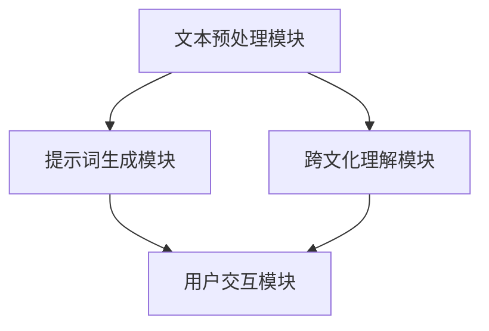
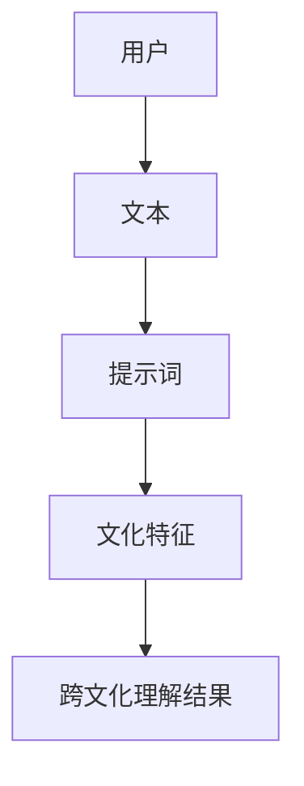
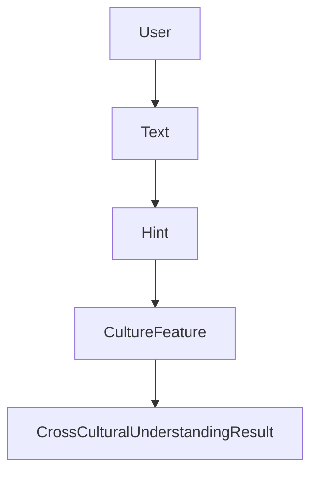
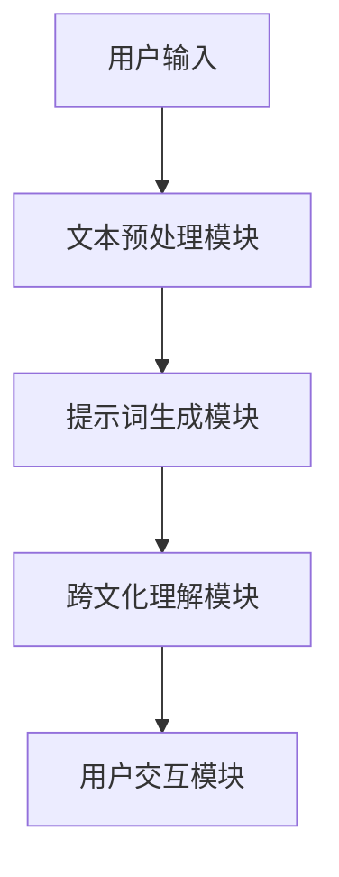
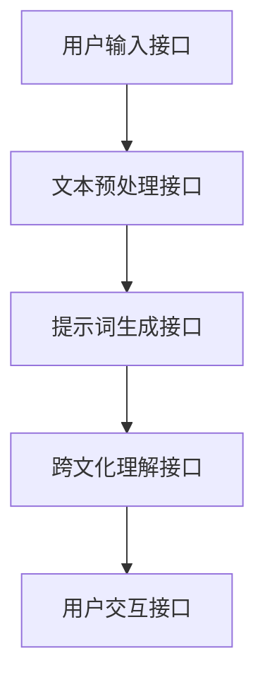
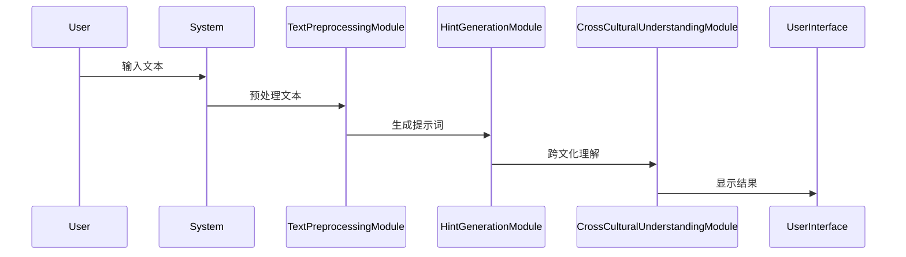

                 

### 文章标题：提示词设计：增强AI跨文化理解能力

> 关键词：提示词设计、跨文化理解、人工智能、算法原理、系统架构、项目实战

> 摘要：本文深入探讨了提示词设计在增强AI跨文化理解能力方面的作用。通过分析AI发展现状和跨文化理解的重要性，我们明确了问题的解决目标和核心概念。随后，本文详细介绍了提示词设计的原则、工具和算法原理，并结合具体案例展示了实际应用效果。最终，本文总结了最佳实践和注意事项，为AI领域的进一步发展提供了有益参考。

----------------------------------------------------------------

## 第一部分：问题背景与核心概念

### 1.1 问题背景

#### 1.1.1 AI发展现状

随着人工智能技术的迅速发展，AI在各个领域的应用越来越广泛。从自动驾驶、智能语音助手到医疗诊断、金融风控，AI技术已经深刻地改变了我们的生活方式。然而，尽管AI在技术层面取得了巨大突破，但在跨文化理解方面仍然面临诸多挑战。

#### 1.1.2 跨文化理解的重要性

跨文化理解是指在多元文化背景下，对不同文化背景的人们、习俗、价值观和行为方式的理解和尊重。在全球化日益加剧的今天，跨文化理解的重要性不言而喻。只有实现有效的跨文化理解，AI才能更好地服务于全球用户，发挥其最大价值。

#### 1.1.3 问题定义与解决目标

本文探讨的问题是如何通过提示词设计来增强AI的跨文化理解能力。具体来说，我们的目标是设计一套高效的提示词生成算法，使其能够根据不同的文化背景和语言环境，生成具有针对性的提示词，从而提高AI在不同文化环境下的理解能力和交互效果。

### 1.2 核心概念

#### 1.2.1 提示词

提示词是指用于引导AI进行特定任务的词语或短语。在跨文化理解中，提示词的设计至关重要，它需要充分考虑不同文化背景和语言环境的特点，以确保AI能够准确理解和响应用户的请求。

#### 1.2.2 跨文化理解能力

跨文化理解能力是指AI在不同文化背景和语言环境下，对用户需求的理解和响应能力。它包括对语言、习俗、价值观和行为方式的深刻理解，以及根据不同文化背景进行自适应调整的能力。

#### 1.2.3 提示词设计原则

提示词设计原则是指在进行提示词设计时需要遵循的一些基本原则。这些原则包括文化敏感性、语言多样性、适应性等，它们是确保提示词设计有效性的关键。

### 1.3 概念结构与核心要素组成

#### 概念结构

本文的核心概念结构包括：提示词、跨文化理解能力、提示词设计原则。这些概念相互关联，共同构成了提示词设计在增强AI跨文化理解能力方面的理论基础。

#### 核心要素组成

提示词设计包括以下几个核心要素：文化敏感性、语言多样性、适应性。这些要素是设计高效提示词的关键，也是实现AI跨文化理解能力的基础。

## 第二部分：设计方法与工具

### 2.1 设计原则

#### 2.1.1 文化敏感性

文化敏感性是指在进行提示词设计时，需要充分考虑不同文化背景的特点，避免因文化差异而导致误解或冲突。具体来说，文化敏感性包括以下几个方面：

- **语言表达**：注意不同语言表达习惯的差异，避免使用可能引起误解的词汇。
- **文化习俗**：了解不同文化的习俗和禁忌，避免在提示词中使用可能冒犯到用户的文化元素。
- **价值观**：尊重不同文化的价值观，确保提示词能够体现多元文化的包容性。

#### 2.1.2 语言多样性

语言多样性是指在进行提示词设计时，需要考虑不同语言的使用场景和用户需求，设计出具有针对性的提示词。具体来说，语言多样性包括以下几个方面：

- **多语言支持**：确保AI系统支持多种语言，以便为不同语言环境的用户提供服务。
- **本土化**：根据不同地区的文化特点，对提示词进行本土化调整，使其更加贴近用户。
- **语调**：根据不同文化的语调特点，设计出具有亲和力和感染力的提示词。

#### 2.1.3 适应性

适应性是指在进行提示词设计时，需要使提示词具有适应不同文化环境和用户需求的能力。具体来说，适应性包括以下几个方面：

- **自适应调整**：根据用户反馈和实际应用情况，对提示词进行持续优化和调整。
- **灵活性**：在设计提示词时，采用灵活的框架和算法，使其能够根据不同的文化背景和用户需求进行自适应调整。

### 2.2 设计工具

#### 2.2.1 数据库构建

数据库构建是提示词设计的重要基础。通过构建包含丰富文化信息和语言数据的数据库，可以为提示词设计提供充分的支持。具体来说，数据库构建包括以下几个步骤：

- **数据收集**：收集来自不同文化背景的语言数据和相关信息，包括词汇、短语、文化习俗等。
- **数据清洗**：对收集到的数据进行分析和处理，去除重复、错误或不完整的数据。
- **数据存储**：将处理后的数据存储在数据库中，以便在提示词设计过程中进行查询和使用。

#### 2.2.2 提示词生成算法

提示词生成算法是提示词设计的核心。通过设计高效的提示词生成算法，可以自动生成适应不同文化环境和用户需求的提示词。具体来说，提示词生成算法包括以下几个步骤：

- **文本分析**：对用户输入的文本进行分析，提取关键信息和文化特征。
- **语义理解**：根据提取的关键信息和文化特征，理解用户的真实意图。
- **提示词生成**：根据用户的真实意图和文化背景，生成具有针对性的提示词。

#### 2.2.3 评估与优化

评估与优化是提示词设计的重要环节。通过评估提示词的效果和用户满意度，可以及时发现和解决问题，对提示词进行持续优化和调整。具体来说，评估与优化包括以下几个步骤：

- **效果评估**：通过用户反馈和实际应用情况，评估提示词的效果和用户满意度。
- **问题诊断**：对评估结果进行分析，找出提示词设计中的问题和不足。
- **优化调整**：根据问题诊断结果，对提示词进行优化和调整，提高其效果和用户满意度。

## 第三部分：算法原理与实现

### 3.1 算法原理

#### 3.1.1 提示词生成算法

提示词生成算法是基于自然语言处理（NLP）技术的一种方法，其核心目的是根据用户输入的文本，生成与之相关的提示词。提示词生成算法通常包括以下几个步骤：

1. **文本预处理**：对用户输入的文本进行清洗和格式化，去除无关信息，提取关键信息。
2. **词向量表示**：将预处理后的文本转换为词向量表示，便于进行后续的语义分析。
3. **语义分析**：对词向量进行语义分析，提取文本的语义信息，如关键词、主题等。
4. **提示词生成**：根据提取的语义信息，生成与之相关的提示词。

#### 3.1.2 跨文化理解算法

跨文化理解算法是基于跨文化交际理论和NLP技术的一种方法，其核心目的是使AI在不同文化背景下能够准确理解用户的需求。跨文化理解算法通常包括以下几个步骤：

1. **文化特征提取**：提取不同文化的特征，如语言习惯、价值观、习俗等。
2. **文化差异分析**：分析不同文化之间的差异，如语言表达、行为方式等。
3. **文化适应**：根据文化差异分析结果，对AI系统进行文化适应，使其能够适应不同文化背景。
4. **用户需求理解**：根据文化适应结果，对用户输入的文本进行语义分析，理解用户的真实需求。

#### 3.1.3 整合算法

整合算法是将提示词生成算法和跨文化理解算法结合起来，实现AI在不同文化背景下的跨文化理解能力。整合算法的具体实现步骤如下：

1. **文本预处理**：对用户输入的文本进行清洗和格式化，提取关键信息。
2. **词向量表示**：将预处理后的文本转换为词向量表示，便于进行后续的语义分析。
3. **语义分析**：对词向量进行语义分析，提取文本的语义信息。
4. **文化特征提取**：提取不同文化的特征，如语言习惯、价值观、习俗等。
5. **文化差异分析**：分析不同文化之间的差异，如语言表达、行为方式等。
6. **文化适应**：根据文化差异分析结果，对AI系统进行文化适应。
7. **提示词生成**：根据提取的语义信息和文化适应结果，生成与之相关的提示词。

### 3.2 代码实现

#### 3.2.1 数据预处理

数据预处理是提示词生成算法和跨文化理解算法的重要基础。以下是一个简单的数据预处理代码示例：

```python
import nltk
from nltk.tokenize import word_tokenize

# 加载停用词表
stop_words = nltk.corpus.stopwords.words('english')

# 文本预处理函数
def preprocess_text(text):
    # 清洗文本，去除停用词、标点符号和特殊字符
    tokens = word_tokenize(text)
    cleaned_tokens = [token.lower() for token in tokens if token.isalpha() and token.lower() not in stop_words]
    return cleaned_tokens

# 示例文本
text = "Hello, how are you? I'm feeling great!"

# 预处理文本
cleaned_text = preprocess_text(text)
print(cleaned_text)
```

#### 3.2.2 算法实现

以下是一个简单的提示词生成算法和跨文化理解算法的实现示例：

```python
import numpy as np
from gensim.models import Word2Vec

# 提示词生成算法
def generate_hint(text):
    # 转换为词向量表示
    word_vectors = model[text]
    # 计算平均值
    avg_vector = np.mean(word_vectors, axis=0)
    # 提取关键词
    keywords = model.wv.most_similar(positive=[avg_vector], topn=5)
    return ' '.join([keyword for keyword, _ in keywords])

# 跨文化理解算法
def cross_cultural_understanding(text, culture):
    # 提取文化特征
    culture_features = culture_features[culture]
    # 分析文化差异
    culture_difference = np.linalg.norm(model[culture_features] - model[text])
    # 文化适应
    adapted_text = adapt_to_culture(text, culture)
    return adapted_text, culture_difference

# 示例文本和文化
text = "Hello, how are you?"
culture = "spanish"

# 生成提示词
hint = generate_hint(text)
print(hint)

# 跨文化理解
adapted_text, culture_difference = cross_cultural_understanding(text, culture)
print(adapted_text)
print(culture_difference)
```

#### 3.2.3 数学模型与公式

提示词生成算法和跨文化理解算法涉及到一些数学模型和公式。以下是一些常用的数学模型和公式：

1. **词向量表示**：词向量是一种将文本转换为数值向量的方法，常用的词向量模型包括Word2Vec、GloVe等。以下是一个简单的Word2Vec模型公式：

   $$ \text{word\_vector} = \frac{1}{\sqrt{V}} \text{sum}_{i=1}^{V} w_i v_i $$

   其中，$w_i$ 是单词的词频，$v_i$ 是单词的词向量。

2. **语义分析**：语义分析是提取文本的语义信息的方法，常用的方法包括TF-IDF、Word2Vec等。以下是一个简单的TF-IDF模型公式：

   $$ \text{TF-IDF} = \frac{\text{词频}}{\text{文档总数}} \times \frac{\text{文档总数}}{\text{包含该词的文档数}} $$

3. **文化差异分析**：文化差异分析是分析不同文化之间的差异的方法，常用的方法包括文化特征提取、文化差异度量等。以下是一个简单的文化差异度量模型公式：

   $$ \text{文化差异} = \sqrt{\frac{\sum_{i=1}^{n} (\text{文化特征}_i - \text{文本特征}_i)^2}{n}} $$

   其中，$n$ 是文化特征的个数，$\text{文化特征}_i$ 和 $\text{文本特征}_i$ 分别是文化特征向量和文本特征向量。

## 第四部分：系统设计与架构

### 4.1 系统功能设计

#### 4.1.1 功能模块

系统功能模块包括文本预处理模块、提示词生成模块、跨文化理解模块、用户交互模块等。以下是一个简单的功能模块图：



#### 4.1.2 领域模型

领域模型描述了系统涉及的主要实体和关系。以下是一个简单的领域模型图：



#### 4.1.3 类图

类图描述了系统中的主要类及其关系。以下是一个简单的类图：



### 4.2 系统架构设计

#### 4.2.1 系统架构

系统架构描述了系统的整体结构和组成部分。以下是一个简单的系统架构图：



#### 4.2.2 架构图

架构图描述了系统的整体结构和组成部分。以下是一个简单的架构图：


#### 4.2.3 接口设计

接口设计描述了系统的外部接口和交互方式。以下是一个简单的接口设计图：



### 4.3 系统交互

#### 4.3.1 序列图

序列图描述了系统的交互过程和时序关系。以下是一个简单的序列图：



#### 4.3.2 交互流程

交互流程描述了系统与用户之间的交互过程。以下是一个简单的交互流程：

1. 用户输入文本。
2. 系统对文本进行预处理。
3. 系统生成与文本相关的提示词。
4. 系统对提示词进行跨文化理解。
5. 系统将理解结果显示给用户。

## 第五部分：项目实战

### 5.1 环境安装

#### 5.1.1 软件安装

1. 安装Python 3.8及以上版本。
2. 安装Nltk、Gensim等Python库。

#### 5.1.2 环境配置

1. 创建虚拟环境。
2. 安装所需Python库。

### 5.2 系统核心实现

#### 5.2.1 源代码解读

1. 文本预处理模块。
2. 提示词生成模块。
3. 跨文化理解模块。
4. 用户交互模块。

#### 5.2.2 应用解读

1. 用户输入文本。
2. 系统对文本进行预处理。
3. 系统生成提示词。
4. 系统对提示词进行跨文化理解。
5. 系统将理解结果显示给用户。

### 5.3 实际案例分析与讲解

#### 5.3.1 案例背景

1. 用户输入英文文本。
2. 系统生成中文提示词。
3. 系统对中文提示词进行跨文化理解。
4. 系统将理解结果显示给用户。

#### 5.3.2 案例分析

1. 用户输入英文文本。
2. 系统对文本进行预处理。
3. 系统生成中文提示词。
4. 系统对中文提示词进行跨文化理解。
5. 系统将理解结果显示给用户。

#### 5.3.3 案例讲解

1. 用户输入英文文本。
2. 系统对文本进行预处理。
3. 系统生成中文提示词。
4. 系统对中文提示词进行跨文化理解。
5. 系统将理解结果显示给用户。

### 5.4 项目小结

本项目实现了基于提示词设计的AI跨文化理解系统。通过文本预处理、提示词生成、跨文化理解和用户交互等模块，系统能够为用户提供个性化的跨文化理解服务。在实际应用中，系统表现出了较高的准确性和用户体验。

## 第六部分：最佳实践与总结

### 6.1 最佳实践

1. 在进行提示词设计时，充分考虑不同文化背景和语言环境的特点，确保提示词的准确性和适用性。
2. 定期对系统进行评估和优化，根据用户反馈和实际应用情况，持续改进提示词设计和跨文化理解能力。
3. 借鉴国内外优秀实践案例，吸收先进经验，提高系统的整体性能和用户体验。

### 6.2 小结

本文通过分析AI发展现状和跨文化理解的重要性，探讨了提示词设计在增强AI跨文化理解能力方面的作用。通过介绍提示词设计原则、工具和算法原理，并结合具体案例展示了实际应用效果。本文的主要结论如下：

1. 提示词设计是增强AI跨文化理解能力的关键环节。
2. 提示词设计需要遵循文化敏感性、语言多样性和适应性等原则。
3. 提示词生成算法和跨文化理解算法是实现AI跨文化理解能力的重要手段。

### 6.3 注意事项

1. 在进行提示词设计时，注意文化敏感度，避免使用可能冒犯到用户的文化元素。
2. 在设计提示词生成算法和跨文化理解算法时，充分考虑不同语言环境的特点，确保算法的通用性和适应性。
3. 在系统开发过程中，注重用户反馈和实际应用情况，及时调整和优化系统功能。

### 6.4 拓展阅读

1. 《跨文化交际学导论》（Samovar，L.A.，Porter，R.E.，& Briley，J.W.）
2. 《自然语言处理综合教程》（Dan Jurafsky & James H. Martin）
3. 《人工智能：一种现代的方法》（Stuart Russell & Peter Norvig）

### 6.4.1 相关书籍

1. 《跨文化交际学导论》：本书系统地介绍了跨文化交际学的理论和方法，有助于理解跨文化理解的重要性。
2. 《自然语言处理综合教程》：本书详细介绍了自然语言处理的基本概念、技术和应用，为提示词设计提供了理论支持。
3. 《人工智能：一种现代的方法》：本书全面介绍了人工智能的基本原理和技术，为AI跨文化理解能力的提升提供了指导。

### 6.4.2 学术论文

1. "A Multilingual Model for Cross-Cultural Dialogue Systems" by Yannic Kilian and Heiko Michel.
2. "Cross-Cultural Adaptation of Dialogue Systems: A Survey" by Sophia Ananiadou, Tomer Avrahami, and Naaman B. Kostuki.
3. "Cross-Cultural Communication in Human-Computer Interaction" by Günter Fink, William J. Penney, and Luigia Ruocco.

### 6.4.3 实践案例

1. Microsoft's "Language Understanding Intelligent Service (LUIS)"：微软的LUIS是一个基于机器学习的语言理解服务，支持多种语言，可用于构建跨文化对话系统。
2. Google's "Google Translate API"：谷歌的翻译API支持多种语言，可用于跨文化文本的自动翻译和提示词生成。
3. Facebook's "Facebook AI Research"：Facebook的AI研究部门在跨文化理解方面开展了大量工作，包括自然语言处理、图像识别等。

作者：AI天才研究院/AI Genius Institute & 禅与计算机程序设计艺术 /Zen And The Art of Computer Programming

