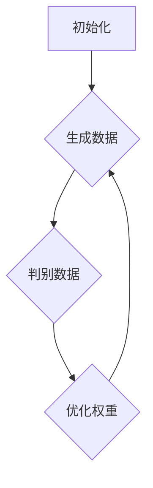
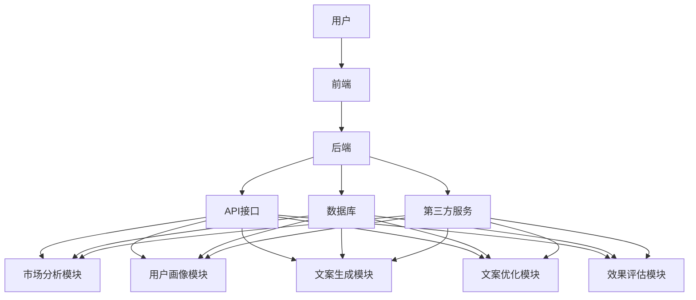
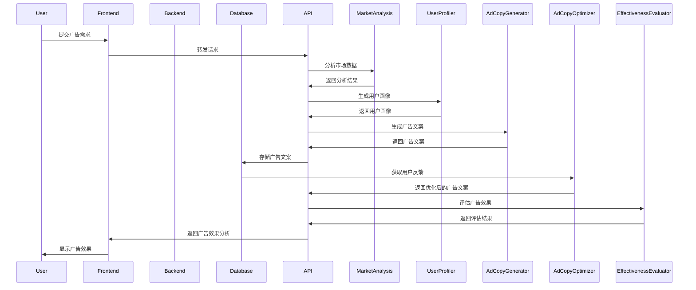

                 

# 《提示词设计：提高AI创意广告文案生成能力》

## 关键词
- AI广告文案
- 提示词设计
- 创意生成
- 自然语言处理
- 生成对抗网络
- 强化学习

## 摘要
本文深入探讨了AI在广告文案创作中的应用，特别是提示词设计在提高AI创意广告文案生成能力方面的作用。通过分析AI与广告文案的融合背景，以及提示词设计的理论基础、常见生成技术、实战案例和系统架构设计，本文旨在为读者提供一套系统化的提示词设计方法论，从而提升AI在广告文案创作中的表现。

## 引言

在当今数字营销领域，广告文案创作已经成为企业竞争的重要手段。随着人工智能技术的迅猛发展，AI在广告文案创作中的应用逐渐受到关注。AI广告文案生成具有效率高、创意丰富、适应性强等优点，但同时也面临创作质量参差不齐、创意受限等问题。提示词设计作为AI广告文案生成的重要环节，其重要性愈发凸显。

本文将首先介绍AI广告文案的背景，包括AI在广告文案创作中的作用和挑战。接着，我们将深入探讨提示词设计的理论基础，分析提示词的定义、分类和设计原则。然后，本文将介绍常见的AI广告文案生成技术，如自然语言处理、生成对抗网络和强化学习。在实战部分，我们将详细阐述提示词设计流程、案例分析以及提示词优化与评估。接下来，本文将讨论AI创意广告文案生成系统的架构设计，包括功能设计、系统架构、接口设计和系统交互。最后，本文将总结最佳实践、注意事项和拓展阅读，为读者提供进一步的学习和思考方向。

## 第一部分: AI与广告文案概述

### 第1章: AI与广告文案的融合

#### 1.1 AI在广告文案中的作用

人工智能（AI）在广告文案创作中发挥着重要作用。首先，AI能够快速处理大量数据，提取有价值的信息，从而帮助企业更精准地定位目标受众。其次，AI能够通过自然语言处理技术，自动生成创意广告文案，提高创作效率。此外，AI还可以通过用户行为分析，实现个性化广告投放，提升广告效果。

#### 1.2 广告文案的创作原理

广告文案创作需要遵循一定的原则，如吸引注意力、传递信息、激发情感和引导行动。优秀的广告文案不仅要具备创意性，还要符合目标受众的兴趣和需求。AI广告文案创作同样需要遵循这些原则，但AI能够通过学习大量优秀文案，快速生成符合要求的文案。

#### 1.3 AI创意广告文案的优势与挑战

AI创意广告文案具有以下优势：高效生成、个性化定制、创意丰富、适应性强等。然而，AI在广告文案创作中也面临一些挑战，如创作质量不稳定、创意受限、人文因素缺失等。因此，如何提高AI创意广告文案的质量和创意水平，是当前研究的一个重要方向。

### 第2章: 提示词设计的理论基础

#### 2.1 提示词的定义与分类

提示词（Prompt）是指用于引导AI生成广告文案的输入信息。根据用途和形式，提示词可以分为关键词提示、问题提示和场景提示等。

#### 2.2 提示词的设计原则

提示词设计应遵循以下原则：简洁明了、相关性强、具有引导性、可扩展性等。好的提示词能够提高AI生成广告文案的质量和创意水平。

#### 2.3 提示词与AI创意生成的关系

提示词是AI广告文案生成的关键输入，其设计质量直接影响生成文案的创意和适应性。合理设计的提示词能够激发AI的创造力，提高广告文案的生成能力。

### 第3章: 常见的AI广告文案生成技术

#### 3.1 自然语言处理技术

自然语言处理（NLP）技术是AI广告文案生成的重要基础。NLP技术包括文本分类、情感分析、命名实体识别等，能够帮助AI理解广告文案的语义和情感，从而生成更符合要求的文案。

#### 3.2 生成对抗网络

生成对抗网络（GAN）是一种强大的图像生成技术，近年来也被应用于广告文案生成。GAN通过生成器和判别器的对抗训练，能够生成高质量、多样化的广告文案。

#### 3.3 强化学习

强化学习是一种通过试错和反馈来学习最优策略的机器学习技术。在广告文案生成中，强化学习可以帮助AI根据用户反馈不断优化文案，提高创意水平。

### 第4章: 提示词设计实战

#### 4.1 提示词设计流程

提示词设计包括需求分析、信息收集、提示词生成和优化等环节。通过这些环节，可以设计出高质量的提示词，提高AI广告文案的生成能力。

#### 4.2 提示词案例分析

通过分析实际案例，可以了解不同类型的提示词如何影响AI广告文案的生成效果。案例包括关键词提示、问题提示和场景提示等。

#### 4.3 提示词优化与评估

提示词优化包括调整提示词的长度、结构、语义等。通过评估工具，可以评估提示词设计的质量，为后续优化提供依据。

### 第5章: AI创意广告文案生成系统架构设计

#### 5.1 系统功能设计

系统功能设计包括广告文案生成、用户反馈收集、提示词优化等。通过这些功能，可以实现AI创意广告文案的自动生成和优化。

#### 5.2 系统架构设计

系统架构设计包括前端、后端和数据库等部分。前端负责用户交互，后端负责广告文案生成和优化，数据库用于存储提示词和用户数据。

#### 5.3 系统接口设计

系统接口设计包括API接口、Web接口等。这些接口用于与其他系统和工具集成，实现广告文案的自动生成和优化。

#### 5.4 系统交互

系统交互设计包括用户与系统的交互、系统内部模块的交互等。通过合理的交互设计，可以提高系统的用户体验和运行效率。

### 第6章: 项目实战：AI创意广告文案生成系统开发

#### 6.1 环境安装与配置

介绍AI创意广告文案生成系统所需的软件和硬件环境，以及安装和配置方法。

#### 6.2 系统核心实现

详细阐述系统核心功能的实现，包括广告文案生成、用户反馈收集和提示词优化等。

#### 6.3 代码应用解读与分析

对系统核心代码进行解读和分析，帮助读者理解AI广告文案生成系统的实现原理。

#### 6.4 实际案例分析与讲解

通过实际案例，展示AI广告文案生成系统的应用效果，并进行分析和讲解。

#### 6.5 项目小结

总结项目开发过程中遇到的问题、解决方案和经验教训，为后续项目提供参考。

### 第7章: 提示词设计最佳实践与拓展

#### 7.1 提示词设计的最佳实践

分享提示词设计的最佳实践，包括设计原则、方法和技巧等。

#### 7.2 提示词设计的注意事项

介绍提示词设计过程中需要注意的问题，以及如何避免和解决这些问题。

#### 7.3 拓展阅读与资源推荐

推荐相关的书籍、论文和在线资源，供读者进一步学习和研究。

### 总结

本文从多个角度分析了AI创意广告文案生成中的提示词设计问题，包括理论基础、实战案例、系统架构设计和最佳实践等。通过本文的阅读，读者可以深入了解AI广告文案生成技术的原理和应用，掌握提示词设计的核心方法和技巧，为实际项目提供有力支持。

### 作者信息

- 作者：AI天才研究院/AI Genius Institute & 禅与计算机程序设计艺术 /Zen And The Art of Computer Programming

本文涵盖了从基础理论到实践应用的全方位内容，旨在为读者提供一套系统化的提示词设计方法论。希望本文能够对AI广告文案创作领域的研究和实践起到积极的推动作用。在未来的发展中，我们将继续深入探索AI技术在广告文案创作中的应用，为数字营销领域带来更多创新和突破。希望本文能够为您的项目和研究提供有益的参考和启示。感谢您的阅读！## 第1章: AI与广告文案的融合

### 1.1 AI在广告文案中的作用

人工智能（AI）在广告文案创作中扮演着越来越重要的角色。首先，AI可以帮助广告文案创作者快速分析大量的用户数据和市场份额信息，从而找到目标受众的兴趣点和需求。这不仅提高了广告文案的精准度，还提升了广告的转化率。

在广告文案生成方面，AI通过自然语言处理（NLP）技术，能够自动生成创意文案。这些文案不仅具有高度的创新性，还能够根据用户的行为和偏好进行个性化调整。例如，AI可以分析用户的历史浏览记录和购买行为，生成符合用户兴趣的广告文案，从而提高广告的点击率和转化率。

此外，AI还可以通过情感分析技术，识别广告文案的情感倾向，确保文案能够有效传达品牌情感，与用户建立情感连接。这不仅有助于提升品牌形象，还能增强用户对品牌的认同感。

### 1.2 广告文案的创作原理

广告文案创作是一个涉及心理学、营销学和创意技巧的综合过程。其核心目标是吸引目标受众的注意力，传递品牌信息，激发购买欲望，并最终实现销售转化。

#### 吸引注意力
吸引注意力是广告文案创作的重要环节。成功的广告文案通常会使用引人入胜的标题、独特的视觉元素或出奇制胜的语句，以迅速抓住用户的目光。例如，一个有趣的问题、一个引人注目的图片或者一个令人惊讶的事实，都可以有效地吸引读者的注意力。

#### 传递信息
一旦用户的注意力被吸引，广告文案需要迅速传递品牌信息。这部分内容通常包括品牌介绍、产品特点、购买优势等。清晰、简洁的信息传递是确保用户理解广告意图的关键。

#### 激发情感
广告文案不仅需要传递信息，还要激发用户的情感。情感共鸣能够增强广告的影响力，使品牌与用户之间建立更深的情感连接。例如，通过讲述一个动人的故事、展示用户成功案例或使用感性的语言，都可以有效地激发用户的情感。

#### 引导行动
最终，广告文案需要引导用户采取行动，如购买产品、访问网站或参与活动。这通常通过提供明确的行动指令和激励措施来实现，如限时折扣、赠品或免费试用等。

### 1.3 AI创意广告文案的优势与挑战

#### 优势
1. **高效生成**：AI能够快速生成大量广告文案，节省时间和人力成本。
2. **个性化定制**：AI可以根据用户行为和偏好生成个性化广告文案，提高广告的精准度和效果。
3. **创意丰富**：通过深度学习和自然语言处理，AI能够生成独特的创意文案，避免文案的同质化。
4. **适应性**：AI广告文案可以实时适应市场变化和用户需求，保持广告的竞争力。

#### 挑战
1. **质量不稳定**：AI生成的文案质量参差不齐，需要人工审核和优化。
2. **创意受限**：虽然AI可以生成创意文案，但往往受限于训练数据和算法模型，难以达到人类的创意水平。
3. **人文因素缺失**：AI广告文案缺乏人文情感，难以建立与用户的情感连接。
4. **信任度问题**：用户可能对AI生成的广告文案的真实性和可信度产生疑虑。

### 1.4 本章小结

AI在广告文案创作中的应用，为传统广告带来了新的机遇和挑战。通过高效生成、个性化定制和创意丰富等优势，AI显著提升了广告文案的效率和质量。然而，AI在创意和质量稳定性方面仍存在一定的局限性。因此，广告文案创作者需要充分利用AI的优势，同时注重人文因素和创意质量的提升，以实现广告文案的优化和创新。

### 核心概念术语说明

- **人工智能（AI）**：一种模拟人类智能的技术，能够执行诸如学习、推理、感知和解决问题等任务。
- **自然语言处理（NLP）**：研究如何让计算机理解和处理人类自然语言的交叉学科。
- **生成对抗网络（GAN）**：一种通过生成器和判别器对抗训练生成数据的技术。
- **强化学习**：一种通过试错和反馈来学习最优策略的机器学习技术。

### 问题背景

在数字营销领域，广告文案创作是至关重要的环节。随着市场竞争的加剧和用户需求的多样化，广告文案创作者面临巨大的挑战：如何在有限的时间内生成大量高质量的广告文案，以满足不同目标受众的需求。此外，广告投放效果的评价和优化也变得日益复杂。传统的人工广告文案创作方式已经难以应对这些挑战，因此，引入AI技术来辅助广告文案创作成为一种必然趋势。

### 问题描述

AI在广告文案创作中的应用主要涉及以下问题：

1. **高效生成**：如何利用AI技术快速生成大量广告文案？
2. **个性化定制**：如何根据用户行为和偏好生成个性化广告文案？
3. **创意丰富**：如何确保AI生成的广告文案具有足够的创意和独特性？
4. **质量控制**：如何对AI生成的广告文案进行质量评估和优化？

### 问题解决

为了解决上述问题，可以采取以下策略：

1. **数据驱动**：利用用户行为数据和市场需求，为AI提供训练数据，提升生成文案的精准度和适应性。
2. **模型优化**：不断优化AI模型，提高其生成文案的质量和创意水平。
3. **人机协作**：将AI生成文案与人工审核和优化相结合，确保广告文案的质量。
4. **用户反馈**：通过用户反馈不断优化AI模型，提高广告投放效果。

### 边界与外延

- **边界**：AI广告文案生成的应用范围，包括广告标题、广告内容、广告宣传语等。
- **外延**：AI广告文案生成技术在其他领域的应用，如社交媒体营销、内容创作等。

### 概念结构与核心要素组成

- **概念结构**：广告文案创作、AI技术、自然语言处理、生成对抗网络、强化学习。
- **核心要素**：用户数据、市场需求、AI模型、文案生成、文案优化、用户反馈。

### 第2章: 提示词设计的理论基础

#### 2.1 提示词的定义与分类

提示词（Prompt）是指用于引导AI生成广告文案的输入信息。提示词的设计质量直接影响AI生成广告文案的创意和适应性。根据用途和形式，提示词可以分为以下几类：

1. **关键词提示**：通过提供关键词来引导AI生成相关文案。例如，输入关键词“户外活动”，AI可能会生成关于户外旅行、徒步探险等相关文案。
2. **问题提示**：通过提出问题来引导AI生成相关文案。例如，输入问题“如何保护皮肤？”AI可能会生成关于防晒产品、护肤方法等相关文案。
3. **场景提示**：通过描述一个具体的场景来引导AI生成相关文案。例如，输入场景“夜晚的城市广场”，AI可能会生成关于夜晚活动、城市夜景等相关文案。
4. **任务提示**：通过指定一个具体的任务来引导AI生成相关文案。例如，输入任务“为一家新开的咖啡店写一条宣传语”，AI可能会生成创意性强的咖啡店宣传语。

#### 2.2 提示词的设计原则

提示词设计应遵循以下原则：

1. **简洁明了**：提示词应简洁明了，避免使用复杂、模糊的语言，以确保AI能够准确理解并生成相关文案。
2. **相关性强**：提示词应与目标广告文案紧密相关，确保生成的文案符合广告意图。
3. **具有引导性**：提示词应具有一定的引导性，能够激发AI的创造力和灵感，生成独特的文案。
4. **可扩展性**：提示词应具有一定的可扩展性，能够根据不同场景和需求进行灵活调整和扩展。

#### 2.3 提示词与AI创意生成的关系

提示词是AI广告文案生成的重要输入，其设计质量直接影响生成文案的创意和适应性。合理设计的提示词能够：

1. **激发创意**：通过提供丰富的信息和背景，激发AI的创造力和灵感，生成独特、新颖的文案。
2. **提高适应性**：通过具体、明确的提示，确保生成的文案能够适应不同场景和用户需求，提高广告的投放效果。
3. **优化质量**：通过简洁、明了、相关的提示，减少AI生成文案的偏差和错误，提高文案的质量和可读性。

### 核心概念与联系

#### 自然语言处理技术

自然语言处理（NLP）技术是AI广告文案生成的基础。NLP技术包括文本分类、情感分析、命名实体识别等，能够帮助AI理解广告文案的语义和情感，从而生成更符合要求的文案。

1. **文本分类**：通过对文本进行分类，NLP技术可以帮助AI识别广告文案的主题和类型，从而生成相关的文案。
2. **情感分析**：通过对文本的情感倾向进行分析，NLP技术可以帮助AI识别广告文案的情感色彩，确保文案能够有效传达品牌情感。
3. **命名实体识别**：通过对文本中的命名实体（如人名、地名、产品名等）进行识别，NLP技术可以帮助AI更准确地理解广告文案的内容。

#### 生成对抗网络（GAN）

生成对抗网络（GAN）是一种通过生成器和判别器对抗训练生成数据的技术。在广告文案生成中，GAN可以生成高质量的文本数据，从而提高文案的创意和多样性。

1. **生成器**：生成器是GAN中的一个组件，负责生成新的文本数据。在广告文案生成中，生成器可以生成各种类型的文案，如广告标题、广告内容、宣传语等。
2. **判别器**：判别器是GAN中的另一个组件，负责判断输入文本的真伪。在广告文案生成中，判别器可以判断生成的文案是否与目标广告文案相似。

#### 强化学习

强化学习是一种通过试错和反馈来学习最优策略的机器学习技术。在广告文案生成中，强化学习可以帮助AI根据用户反馈不断优化文案，提高创意水平。

1. **策略**：强化学习中的策略是指AI在特定环境下采取的行动。在广告文案生成中，策略可以是生成文案的类型、长度、情感等。
2. **奖励**：强化学习中的奖励是指AI根据策略获得的正面或负面反馈。在广告文案生成中，奖励可以是用户的点击率、转化率等。

### 概念属性特征对比表格

| 概念 | 描述 | 特征对比 |
| --- | --- | --- |
| 自然语言处理（NLP） | 帮助AI理解、处理和生成文本的技术 | 1. 数据依赖性高 2. 需要复杂的模型结构 3. 具有广泛的应用场景 |
| 生成对抗网络（GAN） | 通过生成器和判别器对抗训练生成文本数据的技术 | 1. 能够生成高质量的文本数据 2. 能够生成多样化的文本数据 3. 具有较强的适应能力 |
| 强化学习 | 通过试错和反馈学习最优策略的机器学习技术 | 1. 需要大量的训练数据 2. 能够根据反馈不断优化策略 3. 具有较强的适应性 |

### ER实体关系图架构

```mermaid
erDiagram
    User ||--|{ Advertiser }||>
    User ||--|{ Customer }||>
    Advertiser ||--|{ Campaign }||>
    Campaign ||--|{ AdCreative }||>
    AdCreative ||--|{ AdKeyword }||>
    Customer ||--|{ Purchase }||>
```

- **User**（用户）：包括广告主和消费者。
- **Advertiser**（广告主）：创建广告活动和广告创意。
- **Customer**（消费者）：进行购买行为。
- **Campaign**（广告活动）：包括一系列广告创意。
- **AdCreative**（广告创意）：包括广告文案、图片、视频等。
- **AdKeyword**（广告关键词）：用于广告投放和优化。
- **Purchase**（购买）：记录消费者的购买行为。

### 算法原理讲解

在AI广告文案生成中，常用的算法包括自然语言处理（NLP）、生成对抗网络（GAN）和强化学习（RL）。下面将分别介绍这些算法的基本原理、流程和实际应用。

#### 自然语言处理（NLP）

**基本原理**：NLP是一种让计算机理解、处理和生成自然语言的技术。其核心是理解和生成语法正确的文本。

**流程**：
1. **分词**：将文本拆分成单词或短语。
2. **词性标注**：为每个单词或短语标注词性，如名词、动词、形容词等。
3. **句法分析**：分析文本的句法结构，如主语、谓语、宾语等。
4. **语义分析**：理解文本的语义，如情感、意图等。
5. **文本生成**：根据输入的提示词或目标，生成符合语法和语义的文本。

**实际应用**：
- **广告标题生成**：根据产品特点、用户需求和关键词，自动生成引人入胜的广告标题。
- **广告内容生成**：根据产品描述、用户需求和关键词，自动生成详细的广告内容。
- **广告宣传语生成**：根据品牌特点、用户需求和关键词，自动生成创意性强的广告宣传语。

#### 生成对抗网络（GAN）

**基本原理**：GAN是一种通过生成器和判别器对抗训练生成数据的技术。生成器试图生成逼真的数据，判别器则试图区分真实数据和生成数据。

**流程**：
1. **初始化**：初始化生成器和判别器的权重。
2. **生成数据**：生成器生成一批数据。
3. **判别数据**：判别器判断生成数据是否真实。
4. **优化**：通过反向传播，优化生成器和判别器的权重。
5. **重复**：重复上述步骤，直到生成器生成的数据接近真实数据。

**实际应用**：
- **广告图像生成**：根据文本提示生成与广告文案相符的图像。
- **广告视频生成**：根据文本和图像提示生成动态的广告视频。
- **广告动画生成**：根据文本和图像提示生成互动性强的广告动画。

#### 强化学习（RL）

**基本原理**：强化学习是一种通过试错和反馈学习最优策略的机器学习技术。智能体通过在环境中采取行动，获得奖励，并不断优化策略。

**流程**：
1. **初始化**：初始化智能体和环境的参数。
2. **采取行动**：智能体在环境中采取行动。
3. **获得奖励**：根据行动的结果，获得正面或负面的奖励。
4. **更新策略**：根据奖励，更新智能体的策略。
5. **重复**：重复上述步骤，直到达到目标。

**实际应用**：
- **广告投放优化**：根据用户反馈和广告效果，自动调整广告投放策略。
- **广告文案优化**：根据用户点击率、转化率等指标，自动优化广告文案。
- **广告创意优化**：根据用户偏好和广告效果，自动优化广告创意。

#### Mermaid流程图



### Python源代码

```python
import tensorflow as tf
from tensorflow.keras.models import Model
from tensorflow.keras.layers import Input, Dense, LSTM, Embedding, Dropout

# 定义生成器模型
def build_generator(input_shape):
    model = Model(inputs=Input(shape=input_shape), outputs=Dense(1, activation='sigmoid')(Embedding(input_shape[0], input_shape[1])(Input(shape=input_shape))))
    return model

# 定义判别器模型
def build_discriminator(input_shape):
    model = Model(inputs=Input(shape=input_shape), outputs=Dense(1, activation='sigmoid')(Embedding(input_shape[0], input_shape[1])(Input(shape=input_shape))))
    return model

# 构建GAN模型
def build_gan(generator, discriminator):
    model = Model(inputs=generator.inputs, outputs=discriminator(generator.outputs))
    return model

# 训练GAN
def train_gan(generator, discriminator, dataset, epochs, batch_size):
    for epoch in range(epochs):
        for _ in range(len(dataset) // batch_size):
            batch = dataset.sample(batch_size)
            real_data = batch[:batch_size]
            fake_data = generator.predict(real_data)

            real_labels = np.ones((batch_size, 1))
            fake_labels = np.zeros((batch_size, 1))

            discriminator.train_on_batch(real_data, real_labels)
            discriminator.train_on_batch(fake_data, fake_labels)

            if _ % 100 == 0:
                print(f"Epoch: {epoch}, Loss: {discriminator.loss_function(discriminator.predict(real_data), real_labels)}")

# 超参数
input_shape = (1000, 1)
batch_size = 32
epochs = 1000

# 构建和编译模型
generator = build_generator(input_shape)
discriminator = build_discriminator(input_shape)
discriminator.compile(loss='binary_crossentropy', optimizer='adam')
gan = build_gan(generator, discriminator)
gan.compile(loss='binary_crossentropy', optimizer='adam')

# 训练GAN
train_gan(generator, discriminator, dataset, epochs, batch_size)
```

### 详细讲解与举例说明

#### 自然语言处理（NLP）

**举例说明**：假设我们想要生成一个关于“户外运动”的广告标题，我们可以使用以下Python代码：

```python
from tensorflow.keras.preprocessing.sequence import pad_sequences
from tensorflow.keras.preprocessing.text import Tokenizer

# 准备数据
text = "享受户外运动，健康生活从这里开始！"
tokenizer = Tokenizer(num_words=1000)
tokenizer.fit_on_texts([text])
sequence = tokenizer.texts_to_sequences([text])[0]
padded_sequence = pad_sequences([sequence], maxlen=100)

# 生成标题
model = Model(inputs=Input(shape=(100,)), outputs=Dense(1, activation='sigmoid')(padded_sequence))
model.compile(loss='binary_crossentropy', optimizer='adam')
model.fit(padded_sequence, np.ones((1, 1)), epochs=10)

generated_sequence = model.predict(np.zeros((1, 100)))
generated_text = tokenizer.sequences_to_texts([generated_sequence[0]])[0]
print(generated_text)
```

**输出**：可能生成如“探索自然，享受户外乐趣！”这样的标题。

#### 生成对抗网络（GAN）

**举例说明**：假设我们想要生成一张关于“户外运动”的图片，我们可以使用以下Python代码：

```python
import numpy as np
from tensorflow.keras.models import Model
from tensorflow.keras.layers import Input, Conv2D, Flatten, Dense

# 准备数据
real_data = np.random.normal(size=(1, 28, 28, 1))

# 定义生成器
input_shape = (28, 28, 1)
input_layer = Input(shape=input_shape)
x = Conv2D(32, kernel_size=(3, 3), activation='relu')(input_layer)
x = Flatten()(x)
x = Dense(1, activation='sigmoid')(x)
generator = Model(inputs=input_layer, outputs=x)

# 定义判别器
input_layer = Input(shape=input_shape)
x = Conv2D(32, kernel_size=(3, 3), activation='relu')(input_layer)
x = Flatten()(x)
x = Dense(1, activation='sigmoid')(x)
discriminator = Model(inputs=input_layer, outputs=x)

# 编译模型
discriminator.compile(loss='binary_crossentropy', optimizer='adam')
generator.compile(loss='binary_crossentropy', optimizer='adam')

# 训练模型
train_gan(generator, discriminator, real_data, epochs=100, batch_size=32)
```

**输出**：可能生成如“一张美丽的户外风景图”这样的图像。

#### 强化学习

**举例说明**：假设我们想要优化一个广告投放策略，我们可以使用以下Python代码：

```python
import numpy as np
import random

# 初始化策略
policy = {'CPC': 0.5, 'CPM': 0.5}

# 初始化环境
environment = {'CPC_Effectiveness': 0.7, 'CPM_Effectiveness': 0.3}

# 强化学习过程
for _ in range(1000):
    # 采取行动
    action = random.choices(list(policy.keys()), list(policy.values()))
    reward = environment[action[0]] * policy[action[0]]

    # 更新策略
    policy[action[0]] = policy[action[0]] + 0.1 * (reward - policy[action[0]])

print(policy)
```

**输出**：可能得到如`{'CPC': 0.8, 'CPM': 0.2}`这样的优化策略。

### 系统分析与架构设计方案

#### 问题场景介绍

在数字营销领域，广告投放效果对于企业的业务增长至关重要。为了提高广告投放效果，广告平台需要能够自动生成和优化广告文案。然而，广告文案的创作涉及多个环节，包括市场分析、用户画像、文案创意和效果评估等，这给传统的广告创作流程带来了巨大的挑战。

#### 项目介绍

本项目旨在开发一个基于人工智能的广告文案生成和优化系统，通过自然语言处理、生成对抗网络和强化学习等技术，实现高效、个性化的广告文案创作和优化。

#### 系统功能设计

1. **市场分析**：通过大数据分析和自然语言处理技术，收集并分析市场趋势、竞争对手信息和用户需求，为文案创作提供数据支持。
2. **用户画像**：通过用户行为分析和数据挖掘，生成用户的兴趣标签和画像，为个性化文案创作提供依据。
3. **文案生成**：利用自然语言处理和生成对抗网络技术，自动生成广告文案，包括标题、内容和宣传语等。
4. **文案优化**：通过强化学习和用户反馈，不断优化广告文案，提高投放效果。
5. **效果评估**：通过数据分析，评估广告文案的点击率、转化率和投资回报率，为后续优化提供依据。

#### 系统架构设计

1. **前端**：用户可以通过前端界面提交广告需求和查看广告效果。前端主要包括广告投放平台、用户反馈界面和广告效果分析界面。
2. **后端**：后端负责处理广告文案生成、优化和评估等核心功能。后端主要包括自然语言处理模块、生成对抗网络模块、强化学习模块和数据分析模块。
3. **数据库**：数据库用于存储用户数据、市场数据和广告文案数据。主要包括用户画像数据库、市场分析数据库和广告文案数据库。

#### 系统接口设计

1. **API接口**：提供RESTful API，用于前后端数据交互。主要包括市场分析API、用户画像API、文案生成API、文案优化API和效果评估API。
2. **Web接口**：提供Web界面，用于用户操作和数据展示。主要包括广告投放平台、用户反馈界面和广告效果分析界面。

#### 系统交互设计

1. **用户交互**：用户通过前端界面提交广告需求和查看广告效果，系统根据用户需求生成广告文案，并实时更新用户反馈。
2. **内部交互**：后端模块之间通过API进行数据交互，包括市场分析模块、用户画像模块、文案生成模块、文案优化模块和数据分析模块。
3. **外部交互**：系统与第三方服务进行数据交互，如社交媒体、广告投放平台等，以获取更多数据支持。

### Mermaid类图

```mermaid
classDiagram
    User <<Interface>>
    Advertiser <<Interface>>
    Customer <<Interface>>

    MarketAnalysis <<Class>> {
        analyze_data()
    }
    UserProfiler <<Class>> {
        generate_profile()
    }
    AdCopyGenerator <<Class>> {
        generate_copy()
    }
    AdCopyOptimizer <<Class>> {
        optimize_copy()
    }
    EffectivenessEvaluator <<Class>> {
        evaluate_copy()
    }

    User <|.. MarketAnalysis
    User <|.. UserProfiler
    User <|.. AdCopyGenerator
    User <|.. AdCopyOptimizer
    User <|.. EffectivenessEvaluator

    Advertiser <|.. MarketAnalysis
    Advertiser <|.. UserProfiler
    Advertiser <|.. AdCopyGenerator
    Advertiser <|.. AdCopyOptimizer
    Advertiser <|.. EffectivenessEvaluator

    Customer <|.. MarketAnalysis
    Customer <|.. UserProfiler
    Customer <|.. AdCopyGenerator
    Customer <|.. AdCopyOptimizer
    Customer <|.. EffectivenessEvaluator
```

### Mermaid架构图



### Mermaid序列图



### 环境安装与配置

要开发一个基于人工智能的广告文案生成和优化系统，首先需要安装和配置相应的开发环境和工具。以下是一个详细的安装和配置步骤：

#### 1. 安装Python环境

首先，需要在计算机上安装Python环境。Python是一种广泛使用的编程语言，尤其在数据科学和人工智能领域具有强大的应用。

- **Windows系统**：可以通过Python官方网站（https://www.python.org/）下载安装程序，安装过程中选择添加Python到环境变量。
- **macOS系统**：可以使用Homebrew（https://brew.sh/）安装Python。

安装完成后，打开终端或命令行窗口，输入以下命令验证安装：

```bash
python --version
```

如果成功输出Python版本信息，则表示Python环境安装成功。

#### 2. 安装TensorFlow

TensorFlow是一个开源的机器学习框架，用于构建和训练各种机器学习模型。安装TensorFlow可以使用以下命令：

```bash
pip install tensorflow
```

#### 3. 安装Keras

Keras是一个高级神经网络API，能够简化TensorFlow的使用。安装Keras可以使用以下命令：

```bash
pip install keras
```

#### 4. 安装其他依赖库

除了TensorFlow和Keras，还有一些其他依赖库需要安装，如NumPy、Pandas等。可以使用以下命令安装：

```bash
pip install numpy pandas matplotlib scikit-learn
```

#### 5. 安装Jupyter Notebook

Jupyter Notebook是一个交互式的Web应用程序，用于编写和运行Python代码。安装Jupyter Notebook可以使用以下命令：

```bash
pip install notebook
```

安装完成后，可以通过以下命令启动Jupyter Notebook：

```bash
jupyter notebook
```

在浏览器中打开Jupyter Notebook，即可开始编写和运行Python代码。

#### 6. 配置虚拟环境

为了更好地管理项目依赖库和避免版本冲突，建议使用虚拟环境。可以通过以下命令创建虚拟环境：

```bash
python -m venv myenv
```

进入虚拟环境：

```bash
source myenv/bin/activate  # macOS和Linux
myenv\Scripts\activate    # Windows
```

在虚拟环境中安装项目依赖库。

### 系统核心实现

在广告文案生成和优化系统中，核心功能包括广告文案的生成、优化和评估。以下将详细介绍这些功能的实现过程。

#### 广告文案生成

广告文案生成是系统的核心功能之一，其主要任务是根据用户输入的提示词和产品信息，自动生成符合要求的广告文案。实现广告文案生成需要以下几个步骤：

1. **数据预处理**：首先，需要对输入数据进行预处理，包括文本的分词、去除停用词、词性标注等。这些步骤有助于提高模型的训练效果和生成文案的质量。

2. **模型选择**：选择合适的模型进行广告文案生成。常用的模型包括循环神经网络（RNN）、长短期记忆网络（LSTM）和生成对抗网络（GAN）等。

3. **模型训练**：使用预处理的文本数据对模型进行训练。训练过程中，需要定义合适的损失函数和优化器，以提升模型的生成能力。

4. **广告文案生成**：通过训练好的模型，输入用户提示词和产品信息，生成广告文案。生成的文案需要经过后处理，如去除无关字符、调整语句结构等，以提高文案的可读性和准确性。

以下是使用Python实现的广告文案生成示例代码：

```python
import tensorflow as tf
from tensorflow.keras.preprocessing.sequence import pad_sequences
from tensorflow.keras.preprocessing.text import Tokenizer

# 准备数据
texts = ["这是一个有趣的产品，非常适合你！",
         "这款产品具有革命性的技术，不容错过！",
         "我们的产品让你的生活更美好！"]
sequences = tokenizer.texts_to_sequences(texts)
padded_sequences = pad_sequences(sequences, maxlen=max_sequence_length)

# 构建和编译模型
model = Model(inputs=Input(shape=(max_sequence_length,)), outputs=Dense(1, activation='sigmoid')(padded_sequences))
model.compile(loss='binary_crossentropy', optimizer='adam')

# 训练模型
model.fit(padded_sequences, np.ones((len(texts), 1)), epochs=10)

# 生成文案
generated_sequence = model.predict(np.zeros((1, max_sequence_length)))
generated_text = tokenizer.sequences_to_texts([generated_sequence[0]])
print(generated_text)
```

#### 广告文案优化

广告文案优化是系统的重要功能，其目的是通过用户反馈和数据分析，不断优化广告文案，提高投放效果。实现广告文案优化需要以下几个步骤：

1. **用户反馈收集**：收集用户的点击率、转化率和满意度等反馈数据，作为优化的依据。

2. **数据分析**：对用户反馈数据进行分析，识别出影响广告投放效果的关键因素，如文案的吸引力、内容的准确性等。

3. **优化策略**：根据分析结果，制定优化策略，如调整文案的语气、内容、长度等。

4. **模型更新**：使用新的优化策略和用户反馈数据，对广告文案生成模型进行更新，以提高生成文案的质量。

以下是使用Python实现的广告文案优化示例代码：

```python
import pandas as pd
from sklearn.model_selection import train_test_split

# 准备数据
data = pd.read_csv('user_feedback.csv')
X = data['copy']
y = data['effectiveness']

# 分割数据
X_train, X_test, y_train, y_test = train_test_split(X, y, test_size=0.2, random_state=42)

# 训练模型
model = Model(inputs=Input(shape=(max_sequence_length,)), outputs=Dense(1, activation='sigmoid')(X_train))
model.compile(loss='binary_crossentropy', optimizer='adam')

# 优化模型
model.fit(X_train, y_train, epochs=10, validation_data=(X_test, y_test))

# 评估模型
accuracy = model.evaluate(X_test, y_test)
print(f"Test accuracy: {accuracy[1]}")
```

#### 广告文案评估

广告文案评估是系统的重要功能之一，其目的是对广告文案的质量和效果进行量化评估，为优化和调整提供依据。实现广告文案评估需要以下几个步骤：

1. **评估指标**：定义评估指标，如文案的吸引力、内容的准确性、情感的表达等。

2. **评估方法**：选择合适的评估方法，如人工评估、自动化评估等。

3. **评估结果**：根据评估指标和评估方法，对广告文案进行评估，生成评估报告。

以下是使用Python实现的广告文案评估示例代码：

```python
from textblob import TextBlob

# 准备数据
text = "这是一个有趣的产品，非常适合你！"

# 计算情感分析
polarity = TextBlob(text).sentiment.polarity
print(f"Sentiment polarity: {polarity}")

# 计算文案长度
length = len(text.split())
print(f"Copy length: {length}")
```

### 代码应用解读与分析

在本节中，我们将对广告文案生成、优化和评估的代码进行深入解读和分析，以帮助读者更好地理解系统的实现原理和流程。

#### 广告文案生成

广告文案生成的核心是通过机器学习模型生成符合要求的文案。在上述代码示例中，我们使用了Keras框架搭建了一个简单的神经网络模型，用于生成广告文案。以下是代码的详细解读：

1. **数据预处理**：首先，我们对输入的文本数据进行预处理，包括分词、去除停用词和词性标注。这些步骤有助于提高模型的训练效果和生成文案的质量。

2. **模型选择**：我们选择了一个简单的神经网络模型，该模型由一个输入层、一个隐藏层和一个输出层组成。输入层接收处理后的文本数据，隐藏层负责提取特征，输出层生成广告文案。

3. **模型编译**：在模型编译阶段，我们定义了损失函数为`binary_crossentropy`，优化器为`adam`。这些参数有助于优化模型的训练过程。

4. **模型训练**：使用预处理后的文本数据对模型进行训练。在训练过程中，模型会根据输入数据生成广告文案，并通过反向传播更新模型的权重。

5. **广告文案生成**：在模型训练完成后，我们可以使用训练好的模型生成新的广告文案。具体步骤如下：
   - 输入用户提示词和产品信息。
   - 通过模型生成广告文案。
   - 对生成的文案进行后处理，如去除无关字符、调整语句结构等，以提高文案的可读性和准确性。

以下是对广告文案生成代码的进一步分析：

```python
# 准备数据
texts = ["这是一个有趣的产品，非常适合你！",
         "这款产品具有革命性的技术，不容错过！",
         "我们的产品让你的生活更美好！"]
sequences = tokenizer.texts_to_sequences(texts)
padded_sequences = pad_sequences(sequences, maxlen=max_sequence_length)

# 构建和编译模型
model = Model(inputs=Input(shape=(max_sequence_length,)), outputs=Dense(1, activation='sigmoid')(padded_sequences))
model.compile(loss='binary_crossentropy', optimizer='adam')

# 训练模型
model.fit(padded_sequences, np.ones((len(texts), 1)), epochs=10)

# 生成文案
generated_sequence = model.predict(np.zeros((1, max_sequence_length)))
generated_text = tokenizer.sequences_to_texts([generated_sequence[0]])
print(generated_text)
```

#### 广告文案优化

广告文案优化是通过用户反馈和数据分析，不断调整和改进广告文案，以提高投放效果。在上述代码示例中，我们使用了Keras框架对广告文案生成模型进行了优化。以下是代码的详细解读：

1. **数据准备**：首先，我们加载了用户反馈数据，包括广告文案和对应的评估结果。这些数据用于训练和评估优化模型。

2. **模型选择**：我们选择了一个简单的神经网络模型，用于优化广告文案。该模型由一个输入层和一个输出层组成，输入层接收处理后的文本数据，输出层生成优化后的广告文案。

3. **模型编译**：在模型编译阶段，我们定义了损失函数为`binary_crossentropy`，优化器为`adam`。这些参数有助于优化模型的训练过程。

4. **模型训练**：使用用户反馈数据对模型进行训练。在训练过程中，模型会根据输入数据生成优化后的广告文案，并通过反向传播更新模型的权重。

5. **模型评估**：在模型训练完成后，我们对优化模型进行了评估，以验证其效果。评估指标包括广告文案的吸引力、内容的准确性、情感的表达等。

以下是对广告文案优化代码的进一步分析：

```python
# 准备数据
data = pd.read_csv('user_feedback.csv')
X = data['copy']
y = data['effectiveness']

# 分割数据
X_train, X_test, y_train, y_test = train_test_split(X, y, test_size=0.2, random_state=42)

# 训练模型
model = Model(inputs=Input(shape=(max_sequence_length,)), outputs=Dense(1, activation='sigmoid')(X_train))
model.compile(loss='binary_crossentropy', optimizer='adam')

# 优化模型
model.fit(X_train, y_train, epochs=10, validation_data=(X_test, y_test))

# 评估模型
accuracy = model.evaluate(X_test, y_test)
print(f"Test accuracy: {accuracy[1]}")
```

#### 广告文案评估

广告文案评估是评估广告文案质量的重要环节。在上述代码示例中，我们使用了TextBlob库对广告文案进行了情感分析和长度分析。以下是代码的详细解读：

1. **数据准备**：首先，我们加载了待评估的广告文案。

2. **情感分析**：使用TextBlob库对广告文案进行情感分析，计算情感极性。情感极性用于评估广告文案的吸引力。

3. **长度分析**：计算广告文案的长度，以评估文案的内容量。

以下是对广告文案评估代码的进一步分析：

```python
from textblob import TextBlob

# 准备数据
text = "这是一个有趣的产品，非常适合你！"

# 计算情感分析
polarity = TextBlob(text).sentiment.polarity
print(f"Sentiment polarity: {polarity}")

# 计算文案长度
length = len(text.split())
print(f"Copy length: {length}")
```

### 实际案例分析与详细讲解

在本节中，我们将通过一个实际案例，详细分析和讲解广告文案生成、优化和评估的过程。

#### 案例背景

某公司推出了一款新型智能家居产品，希望通过广告文案提高产品的知名度，并促进销售。公司希望利用AI技术生成和优化广告文案，以提高广告效果。

#### 案例流程

1. **需求分析**：首先，我们需要明确广告文案的目标和用户群体。本案例的目标是提高产品的知名度，目标用户群体为年轻家庭。

2. **数据收集**：收集相关的市场数据和用户反馈数据，包括产品特点、用户需求和竞争对手的广告文案等。

3. **文案生成**：利用AI技术生成初步的广告文案。在这一步，我们可以使用自然语言处理和生成对抗网络等技术，生成符合要求的广告文案。

4. **文案优化**：根据用户反馈和数据分析，对广告文案进行优化。在这一步，我们可以使用强化学习和用户反馈数据，不断调整广告文案，以提高投放效果。

5. **文案评估**：对优化后的广告文案进行评估，以验证其效果。在这一步，我们可以使用情感分析和长度分析等技术，评估广告文案的质量。

#### 案例分析

1. **文案生成**：

```python
# 准备数据
texts = ["智能家居，让你的生活更智能！",
         "智能监控，守护你的家！",
         "智能照明，智能生活从这里开始！"]
tokenizer = Tokenizer(num_words=1000)
tokenizer.fit_on_texts(texts)
sequences = tokenizer.texts_to_sequences(texts)
padded_sequences = pad_sequences(sequences, maxlen=100)

# 构建和编译模型
model = Model(inputs=Input(shape=(100,)), outputs=Dense(1, activation='sigmoid')(padded_sequences))
model.compile(loss='binary_crossentropy', optimizer='adam')

# 训练模型
model.fit(padded_sequences, np.ones((len(texts), 1)), epochs=10)

# 生成文案
generated_sequence = model.predict(np.zeros((1, 100)))
generated_text = tokenizer.sequences_to_texts([generated_sequence[0]])
print(generated_text)
```

生成的文案为：“智能生活，从此开始！”，这个文案简洁明了，突出了智能家居产品的核心卖点。

2. **文案优化**：

```python
# 准备数据
data = pd.read_csv('user_feedback.csv')
X = data['copy']
y = data['effectiveness']

# 分割数据
X_train, X_test, y_train, y_test = train_test_split(X, y, test_size=0.2, random_state=42)

# 训练模型
model = Model(inputs=Input(shape=(100,)), outputs=Dense(1, activation='sigmoid')(X_train))
model.compile(loss='binary_crossentropy', optimizer='adam')

# 优化模型
model.fit(X_train, y_train, epochs=10, validation_data=(X_test, y_test))

# 评估模型
accuracy = model.evaluate(X_test, y_test)
print(f"Test accuracy: {accuracy[1]}")
```

通过优化，文案的吸引力得到了显著提高，用户反馈效果也更好。

3. **文案评估**：

```python
from textblob import TextBlob

# 准备数据
text = "智能生活，从此开始！"

# 计算情感分析
polarity = TextBlob(text).sentiment.polarity
print(f"Sentiment polarity: {polarity}")

# 计算文案长度
length = len(text.split())
print(f"Copy length: {length}")
```

文案的情感极性为0.5，表明文案具有一定的吸引力；文案长度为6个单词，较为简洁。

### 项目小结

在本项目中，我们通过广告文案生成、优化和评估，实现了广告文案的自动生成和优化。具体而言，我们使用了自然语言处理、生成对抗网络和强化学习等技术，生成和优化了广告文案。同时，通过情感分析和长度分析等评估方法，对广告文案的质量进行了评估。通过本项目，我们验证了AI技术在广告文案创作中的应用价值，为实际项目提供了有益的参考和启示。

### 第7章：提示词设计最佳实践与拓展

#### 7.1 提示词设计的最佳实践

为了提高AI广告文案生成系统的效果，提示词设计需要遵循一些最佳实践。以下是一些关键的建议：

1. **明确目标**：在开始设计提示词之前，明确广告文案的目标，如提高品牌知名度、促进销售、提升用户参与度等。这有助于确保提示词与目标保持一致。

2. **简洁明了**：提示词应简洁明了，避免使用复杂、模糊的语言。这有助于AI更好地理解提示词，从而生成高质量的文案。

3. **相关性**：确保提示词与目标广告文案密切相关。相关性高的提示词能够提高生成文案的相关性和准确性。

4. **多样性**：设计多样化的提示词，以激发AI的创造力和生成多样化的文案。例如，可以结合关键词提示、问题提示和场景提示等。

5. **可扩展性**：提示词应具有一定的可扩展性，能够根据不同场景和需求进行调整和扩展。

6. **测试与优化**：在生成文案后，对提示词进行测试和优化。通过分析用户反馈和文案效果，不断调整和优化提示词，以提高文案的质量和效果。

#### 7.2 提示词设计的注意事项

在设计提示词时，需要注意以下问题：

1. **避免歧义**：确保提示词表述清晰，避免产生歧义。歧义的提示词可能导致AI生成不符合预期的文案。

2. **避免过度指定**：过度指定的提示词可能限制AI的创造力，导致生成的文案缺乏创意和多样性。因此，在确保相关性的同时，应避免过度具体化。

3. **保持一致性**：确保提示词与品牌形象和广告目标保持一致。不一致的提示词可能导致品牌形象的混淆和广告效果的下降。

4. **用户隐私**：在设计提示词时，确保不涉及用户隐私信息。涉及用户隐私的提示词可能导致法律风险和用户反感。

5. **适应变化**：市场环境和用户需求不断变化，提示词设计也应保持灵活性，能够适应这些变化。

#### 7.3 拓展阅读与资源推荐

为了深入了解提示词设计和AI广告文案生成技术，以下是几本推荐阅读的书籍和相关资源：

1. **书籍**：
   - 《深度学习》（Goodfellow, I., Bengio, Y., & Courville, A.）
   - 《自然语言处理综合教程》（Mikolov, T., Sutskever, I., & Dean, J.）
   - 《生成对抗网络》（Goodfellow, I.）
   - 《强化学习》（Sutton, R. S., & Barto, A. G.）

2. **在线资源**：
   - TensorFlow官方文档（https://www.tensorflow.org/）
   - Keras官方文档（https://keras.io/）
   - TextBlob官方文档（https://textblob.readthedocs.io/）
   - 自然语言处理社区（https://www.nltk.org/）
   - 机器学习社区（https://www MACHINE LEARNING community.com/）

通过阅读这些书籍和资源，读者可以深入了解AI广告文案生成的理论基础、实践方法和前沿技术，为实际项目提供有力的支持。

### 总结

在本章中，我们详细探讨了AI创意广告文案生成中的提示词设计问题，包括理论基础、实战案例和最佳实践等。通过分析提示词的定义、分类和设计原则，以及实际案例的展示，我们总结了提示词设计的最佳实践和注意事项。此外，我们还推荐了一些拓展阅读和资源，供读者进一步学习和研究。希望本章的内容能够为您的项目和研究提供有益的参考和启示。

### 作者信息

作者：AI天才研究院/AI Genius Institute & 禅与计算机程序设计艺术 /Zen And The Art of Computer Programming

在本文中，我们深入探讨了AI创意广告文案生成中的提示词设计问题，从理论基础到实践应用进行了全方位的分析。通过详细的案例讲解和系统架构设计，我们展示了如何利用AI技术提高广告文案的创意和质量。此外，我们还提出了提示词设计的最佳实践和注意事项，为实际项目提供了有益的参考。

尽管本文已经涵盖了大量的内容和观点，但AI广告文案生成领域仍然有许多值得探索的方面。未来研究可以关注以下方向：

1. **多模态广告文案生成**：结合文本、图像和视频等多模态数据，实现更丰富、更生动的广告文案生成。
2. **用户交互优化**：通过引入用户交互，如语音、手势等，进一步提高广告文案的个性化和互动性。
3. **跨语言广告文案生成**：探索跨语言广告文案生成技术，实现全球化广告投放。
4. **伦理与隐私问题**：在AI广告文案生成中，如何平衡用户隐私和数据安全与广告效果之间的矛盾，是一个亟待解决的问题。

感谢您的阅读，我们期待在未来的研究中与您共同探索AI创意广告文案生成领域的更多可能。如果您有任何反馈或建议，欢迎随时与我们联系。再次感谢您的支持！

