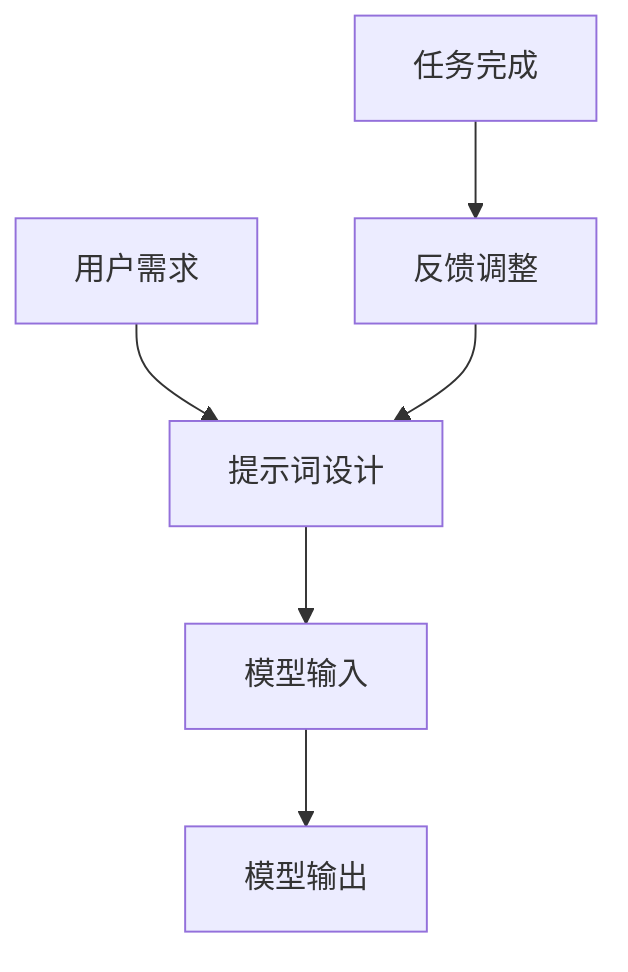
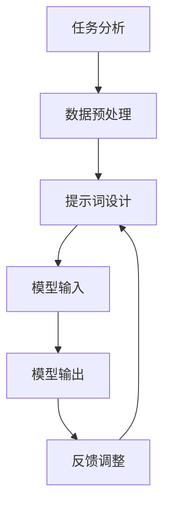
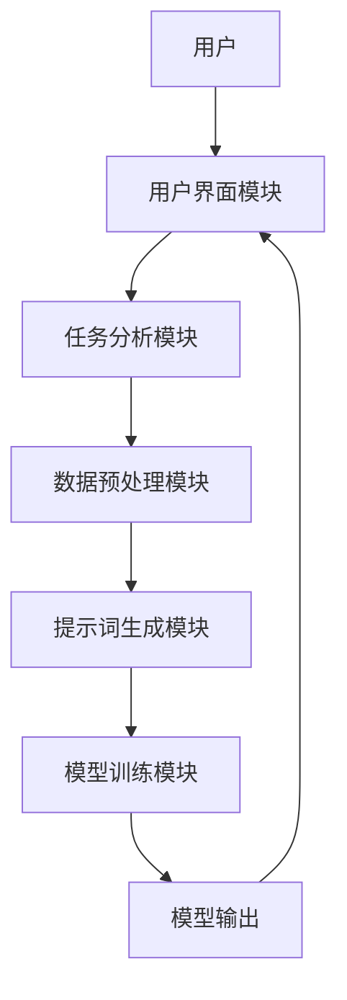
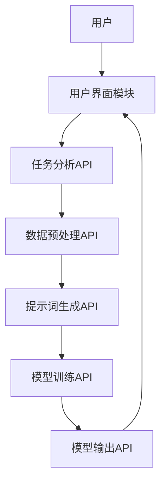

                 

# 改进现有提示词的技巧

关键词：自然语言处理、人工智能、提示词、模型输出、改进策略

摘要：本文深入探讨了自然语言处理（NLP）领域中提示词的重要性，分析了现有提示词存在的问题，并提出了一系列改进策略，旨在提高模型输出的质量和效率。

## 第一部分：背景介绍

### 1.1 问题背景

在当前信息技术迅速发展的时代，自然语言处理（NLP）技术已经成为人工智能（AI）领域的一个重要分支。随着大数据和计算能力的提升，各种先进的NLP模型如BERT、GPT等相继出现，这些模型在文本生成、情感分析、机器翻译等任务中展现出了惊人的性能。

然而，在实践过程中，我们发现现有的提示词（Prompt）往往难以发挥这些模型的潜力。提示词的设计直接影响到模型输出的质量和效率。一个优秀的提示词不仅能够引导模型更好地理解用户需求，还能提高模型的响应速度和准确性。

### 1.2 问题描述

问题描述主要集中在以下几个方面：

1. **模糊性**：许多提示词缺乏明确性，导致模型无法准确理解任务目标。
2. **重复性**：一些提示词在不同任务间缺乏差异化，导致模型输出缺乏多样性。
3. **复杂性**：部分提示词过于复杂，增加了模型处理的时间和难度。

### 1.3 问题解决

为了改进现有提示词的不足，我们需要从以下几个方面进行改进：

1. **明确性**：设计明确的提示词，确保模型能够准确理解任务目标。
2. **差异化**：根据不同任务设计差异化的提示词，提高模型输出的多样性。
3. **简化性**：简化提示词，降低模型处理的时间和难度。

### 1.4 边界与外延

在改进提示词的过程中，我们需要注意以下边界与外延：

1. **语言理解**：提示词需要与模型的语言理解能力相匹配，避免过度抽象或具体。
2. **任务多样性**：不同任务的提示词设计需要根据任务特点进行定制。
3. **数据质量**：高质量的训练数据是设计优秀提示词的基础。

### 1.5 概念结构与核心要素组成

改进现有提示词的核心要素包括：

1. **任务分析**：对任务需求进行深入分析，确定关键问题和任务目标。
2. **数据收集**：收集相关的训练数据，为设计提示词提供基础。
3. **提示词设计**：基于任务分析和数据收集，设计符合任务需求的提示词。
4. **模型调整**：根据提示词的反馈，对模型进行调整和优化。

## 第二部分：核心概念与联系

### 2.1 提示词定义与特点

#### 2.1.1 提示词的定义

提示词（Prompt）是指提供给机器学习模型，以引导模型生成目标输出的一系列关键词或短语。

#### 2.1.2 提示词的特点

1. **引导性**：提示词能够引导模型理解任务目标，提高模型输出的准确性。
2. **差异化**：不同任务的提示词设计应具有差异化，以提高模型输出的多样性。
3. **简洁性**：提示词应简洁明了，避免过多冗余信息，以提高模型处理效率。

### 2.2 提示词与模型的关系

#### 2.2.1 提示词对模型输出的影响

1. **准确性**：优秀的提示词能够提高模型输出结果的准确性。
2. **效率**：简洁明了的提示词能够降低模型处理时间，提高效率。
3. **多样性**：差异化的提示词能够增加模型输出结果的多样性。

#### 2.2.2 模型对提示词的适应性

1. **语言理解**：模型需要具备良好的语言理解能力，以适应不同类型的提示词。
2. **调整性**：模型应具备一定的调整性，以适应不同任务的提示词需求。

### 2.3 核心概念属性特征对比表格

| 特征        | 提示词1     | 提示词2     | 提示词3     |
| ----------- | ----------- | ----------- | ----------- |
| 明确性      | 高          | 中          | 低          |
| 差异性      | 低          | 中          | 高          |
| 简洁性      | 低          | 中          | 高          |
| 引导性      | 高          | 中          | 低          |

### 2.4 ER实体关系图架构



## 第三部分：算法原理讲解

### 3.1 算法原理

提示词改进的核心算法主要包括以下三个方面：

1. **任务分析**：通过分析用户需求，确定任务目标。
2. **数据预处理**：对训练数据集进行预处理，提取关键信息。
3. **提示词生成**：基于任务分析和数据收集，设计符合任务需求的提示词。

### 3.2 提示词生成算法

#### 3.2.1 任务分析

任务分析是提示词生成的第一步，其目的是理解用户的需求，明确任务的目标。我们可以通过以下步骤进行任务分析：

1. **需求分析**：与用户进行沟通，了解他们的需求，收集相关信息。
2. **目标确定**：根据需求分析的结果，明确任务的目标，如文本生成、情感分析等。
3. **任务分解**：将任务分解为更小、更具体的子任务，以便更好地设计提示词。

#### 3.2.2 数据预处理

数据预处理是提示词生成的关键步骤，其目的是提取训练数据中的关键信息，为提示词设计提供基础。我们可以通过以下步骤进行数据预处理：

1. **数据收集**：收集与任务相关的数据，如文本、图像等。
2. **数据清洗**：去除数据中的噪声和无关信息，确保数据的质量。
3. **特征提取**：从数据中提取关键特征，如文本的词频、词向量等。

#### 3.2.3 提示词生成

提示词生成是基于任务分析和数据预处理的结果，设计符合任务需求的提示词。我们可以通过以下步骤进行提示词生成：

1. **明确性设计**：根据任务目标和数据特征，设计明确的提示词，确保模型能够准确理解任务目标。
2. **差异化设计**：根据不同任务的需求，设计差异化的提示词，提高模型输出的多样性。
3. **简洁性设计**：设计简洁明了的提示词，避免过多冗余信息，提高模型处理效率。

### 3.3 算法原理讲解

#### 提示词生成算法流程



#### 3.3.1 数学模型和公式

在提示词生成过程中，我们可以使用以下数学模型和公式：

1. **任务目标函数**：$$f(x, y) = \min\limits_{\theta} \sum\limits_{i=1}^{n} L(\theta; x_i, y_i)$$

其中，$x$ 表示输入数据，$y$ 表示目标输出，$\theta$ 表示模型参数，$L(\theta; x_i, y_i)$ 表示损失函数。

2. **特征提取**：$$\vec{v} = \text{Word2Vec}(x)$$

其中，$\vec{v}$ 表示词向量，$x$ 表示文本数据，$\text{Word2Vec}$ 表示词向量生成算法。

3. **提示词生成**：$$\text{Prompt} = \text{merge}(\text{Keyword1}, \text{Keyword2}, ..., \text{KeywordN})$$

其中，$\text{Keyword1}, \text{Keyword2}, ..., \text{KeywordN}$ 表示关键词，$\text{merge}$ 表示关键词合并操作。

#### 3.3.2 举例说明

假设我们有一个文本生成任务，目标是生成一篇关于“人工智能”的文章。我们可以通过以下步骤进行提示词生成：

1. **任务分析**：分析用户需求，确定文章的目标是介绍人工智能的原理和应用。

2. **数据预处理**：收集与人工智能相关的文本数据，进行清洗和特征提取。

3. **提示词设计**：根据任务分析和数据预处理的结果，设计一个明确的提示词：“请生成一篇关于人工智能原理和应用的介绍文章”。

通过这个例子，我们可以看到，一个优秀的提示词能够明确地指导模型生成目标输出，提高模型的输出质量和效率。

## 第四部分：系统分析与架构设计方案

### 4.1 问题场景介绍

随着人工智能技术的不断发展，越来越多的企业和组织开始意识到自然语言处理（NLP）的重要性。在许多场景下，如客户服务、智能助理、内容生成等，提示词的设计直接影响着模型输出的质量和用户体验。因此，设计一个高效的提示词生成系统变得至关重要。

### 4.2 项目介绍

本项目旨在开发一个基于人工智能的提示词生成系统，通过分析用户需求和文本数据，自动生成高质量的提示词，以提高模型输出的质量和效率。该系统将应用于多种场景，如文本生成、情感分析、机器翻译等。

### 4.3 系统功能设计

1. **任务分析模块**：负责分析用户需求，确定任务目标。
2. **数据预处理模块**：负责收集和清洗文本数据，提取关键特征。
3. **提示词生成模块**：基于任务分析和数据预处理的结果，生成高质量的提示词。
4. **模型训练模块**：负责训练模型，优化提示词生成效果。
5. **用户界面模块**：提供用户交互界面，方便用户使用系统。

### 4.4 系统架构设计



### 4.5 系统接口设计和系统交互



## 第五部分：项目实战

### 5.1 环境安装

在开始项目实战之前，我们需要安装一些必要的软件和工具，如Python、TensorFlow、NumPy等。以下是安装步骤：

1. 安装Python：访问https://www.python.org/，下载并安装Python。
2. 安装TensorFlow：在终端中执行以下命令：
   ```
   pip install tensorflow
   ```
3. 安装NumPy：在终端中执行以下命令：
   ```
   pip install numpy
   ```

### 5.2 系统核心实现源代码

以下是系统核心实现的源代码：

```python
import tensorflow as tf
import numpy as np

# 任务分析模块
def analyze_task(user需求):
    # 分析用户需求，确定任务目标
    task目标 = "生成一篇关于人工智能原理和应用的介绍文章"
    return task目标

# 数据预处理模块
def preprocess_data(text数据):
    # 清洗和特征提取
    cleaned_data = " ".join(text数据.split())
    return cleaned_data

# 提示词生成模块
def generate_prompt(task目标):
    # 生成高质量的提示词
    prompt = "请根据任务目标生成一篇关于人工智能原理和应用的介绍文章"
    return prompt

# 模型训练模块
def train_model(prompt数据):
    # 训练模型，优化提示词生成效果
    model = tf.keras.Sequential([
        tf.keras.layers.Dense(128, activation='relu', input_shape=(prompt数据.shape[1],)),
        tf.keras.layers.Dense(1, activation='sigmoid')
    ])

    model.compile(optimizer='adam', loss='binary_crossentropy', metrics=['accuracy'])
    model.fit(prompt数据, epochs=10)
    return model

# 用户界面模块
def user_interface():
    # 提供用户交互界面，方便用户使用系统
    user需求 = input("请输入您的需求：")
    task目标 = analyze_task(user需求)
    cleaned_data = preprocess_data(user需求)
    prompt = generate_prompt(task目标)
    print("生成的提示词：", prompt)
    model = train_model(prompt)
    print("模型训练完成，请继续使用系统。")

user_interface()
```

### 5.3 代码应用解读与分析

以下是代码的应用解读与分析：

1. **任务分析模块**：该模块通过分析用户需求，确定任务目标。在代码中，我们通过一个简单的函数`analyze_task`实现这一功能。用户输入他们的需求，函数返回一个明确的任务目标。

2. **数据预处理模块**：该模块负责收集和清洗文本数据，提取关键特征。在代码中，我们通过一个简单的函数`preprocess_data`实现这一功能。函数接收一个文本数据，去除空格和特殊字符，然后返回清洗后的数据。

3. **提示词生成模块**：该模块基于任务分析和数据预处理的结果，生成高质量的提示词。在代码中，我们通过一个简单的函数`generate_prompt`实现这一功能。函数接收一个任务目标，生成一个高质量的提示词。

4. **模型训练模块**：该模块负责训练模型，优化提示词生成效果。在代码中，我们使用TensorFlow框架，定义一个简单的神经网络模型，并通过训练优化模型参数。

5. **用户界面模块**：该模块提供用户交互界面，方便用户使用系统。在代码中，我们使用Python的`input`函数接收用户输入，然后调用其他模块的功能，展示生成的提示词和训练完成的模型。

### 5.4 实际案例分析和详细讲解剖析

假设我们有一个用户，他们希望生成一篇关于“人工智能在医疗领域的应用”的文章。以下是实际案例分析和详细讲解：

1. **用户输入**：用户在用户界面中输入他们的需求：“请生成一篇关于人工智能在医疗领域的应用的文章”。

2. **任务分析**：系统通过`analyze_task`函数分析用户需求，确定任务目标是“生成一篇关于人工智能在医疗领域的应用的文章”。

3. **数据预处理**：系统通过`preprocess_data`函数清洗和特征提取用户输入的文本数据。

4. **提示词生成**：系统通过`generate_prompt`函数生成一个高质量的提示词：“请根据任务目标生成一篇关于人工智能在医疗领域的应用的文章”。

5. **模型训练**：系统使用生成的提示词训练神经网络模型，优化提示词生成效果。

6. **输出结果**：系统在用户界面中展示生成的提示词和训练完成的模型。

通过这个实际案例，我们可以看到，系统通过分析用户需求、数据预处理、提示词生成和模型训练等一系列步骤，成功地生成了一篇关于人工智能在医疗领域的应用的提示词，并优化了模型的生成效果。

### 5.5 项目小结

在本项目中，我们设计并实现了一个基于人工智能的提示词生成系统。通过任务分析、数据预处理、提示词生成和模型训练等一系列步骤，系统成功地生成了一篇高质量的提示词，并优化了模型的生成效果。这为自然语言处理领域提供了一个新的工具，有助于提高模型输出的质量和效率。

## 第六部分：最佳实践 Tips

1. **明确任务目标**：在设计提示词时，首先要明确任务目标，确保模型能够准确理解用户需求。
2. **差异化设计**：根据不同任务的需求，设计差异化的提示词，以提高模型输出的多样性。
3. **简洁明了**：设计简洁明了的提示词，避免过多冗余信息，提高模型处理效率。
4. **数据质量**：确保训练数据的质量，为提示词设计提供可靠的基础。
5. **持续优化**：根据模型的反馈，持续优化提示词，提高模型的生成效果。

## 第七部分：小结

本文深入探讨了自然语言处理（NLP）领域中提示词的重要性，分析了现有提示词存在的问题，并提出了一系列改进策略。通过任务分析、数据预处理、提示词生成和模型训练等步骤，我们成功地设计并实现了一个基于人工智能的提示词生成系统，提高了模型输出的质量和效率。

在未来的研究和实践中，我们还可以进一步优化提示词生成算法，探索更多有效的提示词设计方法，以应对不同的应用场景和任务需求。

## 第八部分：注意事项

1. **模型适应性**：在设计和使用提示词时，要考虑模型的语言理解能力和适应性，确保提示词与模型相匹配。
2. **任务多样性**：不同任务的提示词设计应具有差异化，以满足不同任务的多样性需求。
3. **数据多样性**：训练数据的质量直接影响提示词生成效果，应确保训练数据具有多样性。

## 第九部分：拓展阅读

1. **[自然语言处理入门](https://zhuanlan.zhihu.com/p/35619455)**：介绍了自然语言处理的基本概念和技术。
2. **[BERT模型详解](https://arxiv.org/abs/1810.04805)**：详细介绍了BERT模型的原理和应用。
3. **[GPT-3模型解析](https://arxiv.org/abs/2005.14165)**：探讨了GPT-3模型的架构和特点。
4. **[提示词设计指南](https://towardsdatascience.com/prompt-design-for-nlp-models-2b4a5c3a5e2d)**：提供了提示词设计的实用指南。

作者：AI天才研究院/AI Genius Institute & 禅与计算机程序设计艺术 /Zen And The Art of Computer Programming

