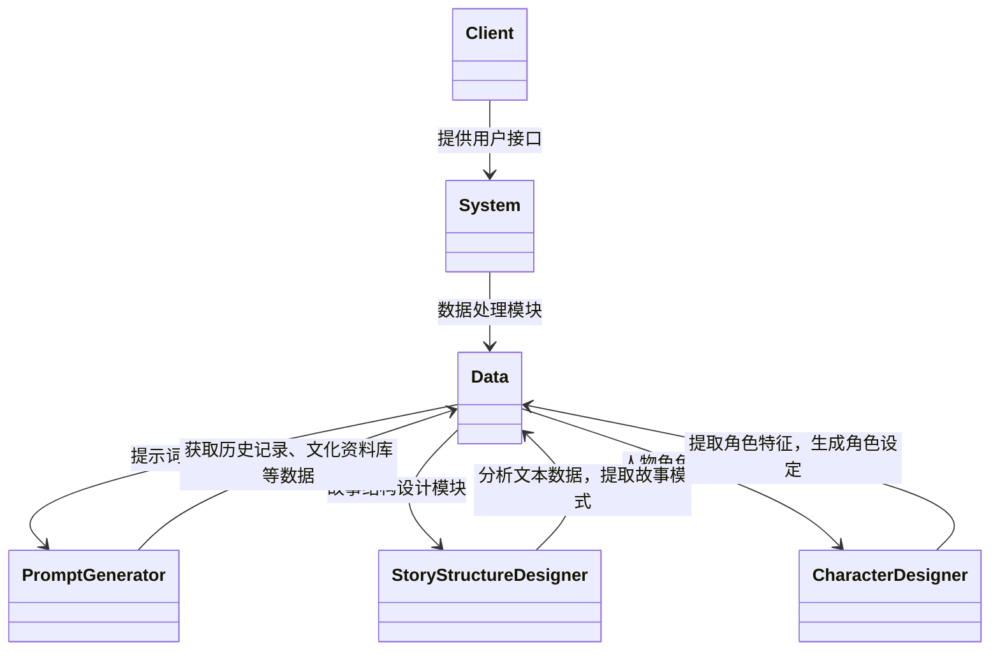
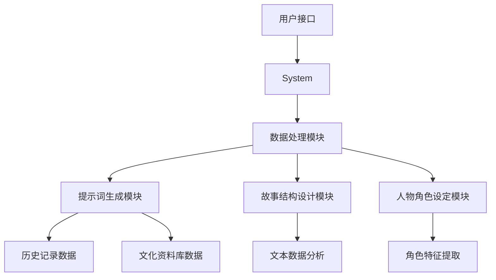

                 

### 书籍概述

# 提高AI创意香水品牌故事：文化底蕴传承的提示词技巧

> 关键词：AI、创意香水品牌故事、文化底蕴、提示词技巧

> 摘要：本书深入探讨了人工智能（AI）在创意香水品牌故事中的应用，旨在通过传承文化底蕴，提升品牌故事的创新性和吸引力。书中详细介绍了AI技术如何帮助品牌创作者生成富有文化内涵的提示词，以及如何利用这些提示词构建引人入胜的香水品牌故事。本书不仅为AI开发者提供了技术指导，也为品牌策划人员提供了文化传承的新思路。通过本书的学习，读者将能够更好地理解AI在创意产业中的潜力，以及如何在品牌故事中融入丰富的文化元素，增强品牌的文化价值。

### 第一部分：引言与背景

#### 第1章：书籍概述

##### 1.1 问题背景

在当今全球化时代，品牌竞争日益激烈，如何通过创意和独特性脱颖而出成为每个品牌所面临的核心挑战。特别是对于香水品牌，故事和情感联系是消费者产生共鸣的重要途径。然而，如何在创意香水品牌故事中融入文化底蕴，使其不仅具备商业价值，还能传承和弘扬文化，成为一个亟待解决的问题。

##### 1.2 问题描述

随着人工智能技术的迅猛发展，AI在多个领域展现出了巨大的潜力。然而，在创意产业中，如何有效利用AI生成具有文化内涵的提示词，并运用这些提示词创作出富有吸引力的品牌故事，仍是一个未完全解决的难题。目前，市场上缺乏系统性的指导书籍，能够帮助品牌策划人员和AI开发者共同解决这一问题。

##### 1.3 问题解决

本书旨在填补这一市场空白，通过深入探讨AI与创意香水品牌故事的结合，提供一套实用的解决方案。书中不仅介绍了AI技术的核心原理和应用场景，还结合实际案例，详细阐述了如何利用AI生成富有文化底蕴的提示词，并构建品牌故事。通过这套方法，品牌策划人员可以更有效地传承文化，提升品牌故事的吸引力和影响力。

##### 1.4 边界与外延

本书主要关注的是AI在创意香水品牌故事中的应用，涉及到的技术包括自然语言处理、机器学习等。此外，书中还探讨了如何将文化元素融入品牌故事中，使其更具文化内涵。虽然本书的核心内容聚焦于香水品牌，但其中的方法和思路同样适用于其他创意产业。

##### 1.5 核心概念与联系

核心概念包括：  
- **人工智能（AI）**：模拟人类智能行为的计算机系统，通过机器学习、自然语言处理等技术实现。
- **创意香水品牌故事**：通过独特的叙述方式，将香水品牌的文化底蕴和品牌价值传达给消费者。
- **文化底蕴**：品牌故事中所蕴含的深厚文化背景和历史积淀。
- **提示词**：用于引导AI生成故事的关键词或短语。

这些核心概念相互关联，共同构成了本书的主要内容。通过理解和运用这些概念，品牌策划人员可以更好地利用AI技术，创作出具有文化内涵的品牌故事。

### 第二部分：核心概念

#### 第2章：AI与创意香水品牌故事概述

##### 2.1 AI概述

##### 2.1.1 AI的定义

人工智能（AI，Artificial Intelligence）是计算机科学的一个分支，旨在开发能够模拟、延伸和扩展人类智能的理论、算法和应用。AI通过模拟人类思维过程，实现感知、学习、推理、决策等功能。

##### 2.1.2 AI的发展历程

人工智能的研究始于20世纪50年代，经历了多个阶段的发展。早期以符号主义为主，通过符号操作进行推理；随后发展出基于规则的系统，再后来引入了神经网络、机器学习等技术。近年来，随着计算能力的提升和数据量的增加，深度学习成为AI研究的主流方向。

##### 2.1.3 AI的核心概念

AI的核心概念包括：

- **机器学习（Machine Learning）**：让计算机从数据中学习规律和模式，无需明确编程。
- **深度学习（Deep Learning）**：一种特殊的机器学习方法，通过多层神经网络进行特征提取和预测。
- **自然语言处理（Natural Language Processing, NLP）**：使计算机能够理解、生成和处理人类自然语言的技术。
- **强化学习（Reinforcement Learning）**：通过试错和反馈进行学习，模拟人类的决策过程。

##### 2.2 创意香水品牌故事概述

##### 2.2.1 创意香水品牌故事的定义

创意香水品牌故事是指通过独特的叙事手法，将香水品牌的历史、文化、价值等元素融入故事中，以吸引消费者的兴趣和情感。这种故事不仅传达了品牌的核心价值，还增强了品牌与消费者之间的情感联系。

##### 2.2.2 创意香水品牌故事的重要性

在竞争激烈的香水市场中，创意品牌故事能够帮助品牌脱颖而出。一个富有创意和情感的品牌故事可以增强消费者的品牌认同感，提升品牌的美誉度和忠诚度。

##### 2.2.3 创意香水品牌故事的类型

根据内容和形式，创意香水品牌故事可以分为以下几种类型：

- **历史故事**：通过讲述品牌的历史背景，展示品牌的发展历程和核心价值观。
- **情感故事**：通过情感共鸣，如爱情、友情、家庭等，让消费者产生情感上的共鸣。
- **文化故事**：通过融入地方文化、传统习俗等，展示品牌的文化底蕴和独特性。

##### 2.3 AI在创意香水品牌故事中的应用

##### 2.3.1 提示词生成

AI可以通过自然语言处理技术，生成与品牌故事相关的提示词。这些提示词可以用于引导AI创作出更具文化内涵的品牌故事。

##### 2.3.2 故事结构设计

AI还可以帮助设计品牌故事的结构，通过分析大量文本数据，找出符合品牌文化的故事模式，从而提高故事的创新性和吸引力。

##### 2.3.3 人物角色设定

AI可以通过机器学习技术，为品牌故事设定具有独特性格和特点的人物角色，增强故事的趣味性和可读性。

#### 第3章：AI在创意香水品牌故事中的应用

##### 3.1 AI在香水品牌故事创作中的应用

##### 3.1.1 提示词生成

AI可以通过自然语言处理技术，从品牌历史、文化背景、消费者需求等角度生成提示词。这些提示词可以为品牌创作者提供灵感，帮助他们构建富有文化内涵的品牌故事。

- **自然语言处理技术**：使用自然语言处理技术，AI可以从品牌历史、文化背景、消费者需求等角度生成提示词。
- **数据来源**：AI可以从品牌的历史记录、文化资料库、消费者调查数据等来源中提取信息。
- **生成提示词的示例**：例如，从品牌历史中提取关键词“古法蒸馏”、“传统工艺”，从文化背景中提取关键词“东方美学”、“浪漫情怀”，从消费者需求中提取关键词“个性表达”、“情感共鸣”。

##### 3.1.2 故事结构设计

AI可以通过分析大量的文本数据，帮助设计品牌故事的结构，提高故事的创新性和吸引力。

- **文本数据分析**：AI可以通过文本数据分析，找出符合品牌文化的故事模式，如情节发展、角色设定等。
- **故事模式提取**：AI可以提取出成功品牌故事的常见结构，如开端、发展、高潮、结局等。
- **结构设计的示例**：例如，AI可以为品牌故事设计一个以“传统与现代融合”为主题的框架，将传统工艺与现代设计相结合，形成独特的品牌故事。

##### 3.1.3 人物角色设定

AI可以通过机器学习技术，为品牌故事设定具有独特性格和特点的人物角色，增强故事的趣味性和可读性。

- **机器学习技术**：使用机器学习技术，AI可以分析大量文本数据，提取角色性格特征。
- **角色特征提取**：AI可以从品牌历史、文化背景、消费者喜好等角度，为角色设定独特性格和特点。
- **角色设定的示例**：例如，AI可以设定一个以“传承者”为主题的男主角，他热爱传统工艺，但同时也接受现代科技，代表着品牌的传统与现代融合。

##### 3.2 AI在香水品牌故事营销中的应用

##### 3.2.1 营销文案创作

AI可以帮助品牌创作者生成具有文化内涵的营销文案，提高营销效果。

- **文案生成技术**：使用自然语言处理技术和生成对抗网络（GAN），AI可以生成符合品牌文化和消费者需求的文案。
- **文案示例**：例如，AI可以生成一句结合传统文化与现代潮流的宣传语：“传统精髓，现代诠释——[品牌名]香水，传递东方美学与时尚气息。”

##### 3.2.2 社交媒体推广

AI可以通过分析社交媒体数据，帮助品牌制定有效的推广策略，提高品牌曝光度和影响力。

- **数据分析技术**：AI可以通过分析用户行为、评论、分享等数据，了解消费者对品牌故事的反应。
- **推广策略示例**：例如，AI可以建议品牌在社交媒体上发布以“文化传承”为主题的内容，吸引目标消费者的关注。

##### 3.2.3 消费者互动

AI可以帮助品牌与消费者建立更紧密的联系，提升消费者的品牌忠诚度。

- **互动技术**：使用聊天机器人、语音助手等技术，AI可以与消费者进行实时互动，回答他们的问题，提供个性化的推荐。
- **互动示例**：例如，AI可以创建一个虚拟的“文化传承顾问”，帮助消费者了解品牌的传统文化，并提供定制化的香水推荐。

#### 第4章：文化底蕴与创意香水品牌故事的关系

##### 4.1 文化底蕴的概念

文化底蕴是指一个品牌在历史、传统、价值观等方面所蕴含的深厚内涵。它是一个品牌独特的文化符号，体现了品牌的历史传承和核心价值观。

##### 4.2 文化底蕴在创意香水品牌故事中的作用

文化底蕴是创意香水品牌故事的重要元素，它能够为品牌故事提供丰富的情感和意义。一个具有深厚文化底蕴的品牌故事能够：

- **增强品牌认同感**：通过展示品牌的历史和文化背景，消费者可以更好地理解和认同品牌。
- **提升品牌美誉度**：文化底蕴丰富的品牌故事能够引起消费者的共鸣，提升品牌在消费者心中的形象。
- **增强品牌竞争力**：在竞争激烈的市场中，具有文化底蕴的品牌故事能够帮助品牌脱颖而出，赢得消费者的青睐。

##### 4.3 文化底蕴传承的挑战与机遇

在传承文化底蕴的过程中，品牌策划人员面临以下挑战：

- **文化多样性**：不同地区和民族有着不同的文化传统，如何将多样化的文化元素融入品牌故事中，是一个挑战。
- **文化传承与创新**：如何在保持文化传统的同时，进行创新，使品牌故事更具吸引力，也是一个挑战。

然而，这些挑战也带来了机遇：

- **文化多样性**：多样化的文化元素可以为品牌故事提供丰富的素材，使其更具吸引力。
- **文化传承与创新**：通过创新的方式传承文化底蕴，可以创造出独特的品牌故事，提升品牌的竞争力。

#### 第5章：提示词技巧在文化底蕴传承中的应用

##### 5.1 提示词技巧概述

提示词技巧是指通过特定的关键词或短语，引导AI生成与品牌文化相关的提示词。这些技巧包括：

- **文化背景提取**：从品牌的历史、传统、价值观等方面提取关键词，作为提示词。
- **情感共鸣**：通过情感化的词汇，引发消费者的共鸣，使品牌故事更具吸引力。
- **文化融合**：将不同文化的元素进行融合，创造出独特的品牌故事。

##### 5.2 提示词技巧在文化底蕴传承中的应用

##### 5.2.1 提示词技巧的选取原则

在选取提示词技巧时，应遵循以下原则：

- **与品牌文化契合**：选取的提示词应与品牌的历史、传统、价值观等紧密相关。
- **具有情感共鸣**：提示词应能够引起消费者的情感共鸣，增强品牌故事的吸引力。
- **独特性和创新性**：提示词应具有独特性和创新性，避免与现有品牌故事雷同。

##### 5.2.2 提示词技巧的应用场景

提示词技巧可以在以下场景中应用：

- **品牌故事创作**：通过提示词，引导AI生成与品牌文化相关的品牌故事。
- **营销文案创作**：通过提示词，为营销文案提供灵感，使其更具文化内涵。
- **消费者互动**：通过提示词，与消费者进行互动，了解他们的需求和反馈。

##### 5.2.3 提示词技巧的案例分析

以下是一个提示词技巧的应用案例：

**品牌名称**：古韵香

**文化背景**：古韵香品牌源于中国古代的香文化，具有深厚的历史底蕴。

**提示词技巧**：结合古韵香的品牌特色，选取以下提示词：

- **古法蒸馏**
- **传统工艺**
- **东方美学**
- **情感共鸣**

**应用示例**：

- **品牌故事**：古韵香，传承千年古法蒸馏技艺，每一滴香水都蕴含着深厚的文化底蕴。品牌故事以一位热爱传统文化的古韵香传承者为主角，讲述了她如何坚持传统，创新香水配方，将东方美学融入现代生活。

- **营销文案**：古韵香，不仅是一款香水，更是一段文化传承。古法蒸馏，传统工艺，每一滴都诠释着东方美学的魅力。让古韵香伴随您，感受千年文化的韵味。

- **消费者互动**：古韵香品牌通过社交媒体与消费者互动，分享品牌故事和传统文化知识，引发消费者的情感共鸣。

### 实战案例与应用

#### 第6章：案例一：使用AI创作文化底蕴丰富的香水品牌故事

##### 6.1 项目介绍

**项目名称**：AI赋能文化传承香水品牌故事创作

**项目背景**：随着消费者对品牌文化底蕴的关注日益增加，一家名为“古韵香”的香水品牌希望通过AI技术，创作出具有深厚文化底蕴的品牌故事，提升品牌形象和市场竞争力。

**项目目标**：利用AI技术，生成富有文化内涵的提示词，构建引人入胜的香水品牌故事，增强品牌与消费者之间的情感联系。

##### 6.2 系统功能设计

**系统功能概述**：系统主要功能包括提示词生成、故事结构设计、人物角色设定等，旨在通过AI技术，实现文化底蕴丰富的品牌故事创作。

- **提示词生成**：从品牌历史、文化背景、消费者需求等方面提取关键词，生成与品牌故事相关的提示词。
- **故事结构设计**：基于文本数据分析，设计出符合品牌文化的故事结构。
- **人物角色设定**：通过机器学习技术，为品牌故事设定具有独特性格和特点的人物角色。

##### 6.2.1 领域模型设计

**领域模型类图**



##### 6.2.2 系统架构设计

**系统架构图**



##### 6.3 系统核心实现

**6.3.1 环境安装**

**环境要求**：Python 3.8及以上版本，安装以下库：

- TensorFlow
- NLTK
- gensim

**安装命令**：

```bash
pip install tensorflow
pip install nltk
pip install gensim
```

**6.3.2 源代码实现**

**提示词生成模块**

```python
import nltk
from nltk.tokenize import word_tokenize
from nltk.corpus import stopwords

# 加载停用词表
nltk.download('stopwords')
stop_words = stopwords.words('english')

def generate_prompts(data):
    # 数据预处理
    tokens = word_tokenize(data)
    tokens = [token.lower() for token in tokens if token.isalnum()]
    tokens = [token for token in tokens if token not in stop_words]

    # 提取关键词
    keywords = []
    for token in tokens:
        if token not in keywords:
            keywords.append(token)

    # 生成提示词
    prompts = []
    for keyword in keywords:
        prompt = f"{keyword} in the context of the brand story"
        prompts.append(prompt)

    return prompts
```

**故事结构设计模块**

```python
from sklearn.feature_extraction.text import TfidfVectorizer
from sklearn.cluster import KMeans

def design_story_structure(data):
    # 文本数据预处理
    texts = data.split('.')
    texts = [text.strip() for text in texts if text.strip()]

    # 提取特征
    vectorizer = TfidfVectorizer()
    X = vectorizer.fit_transform(texts)

    # 聚类分析
    kmeans = KMeans(n_clusters=3)
    kmeans.fit(X)

    # 分配故事结构
    story_structures = {}
    for i, label in enumerate(kmeans.labels_):
        if label not in story_structures:
            story_structures[label] = []
        story_structures[label].append(texts[i])

    return story_structures
```

**人物角色设定模块**

```python
from nltk.tag import pos_tag

def design_characters(data):
    # 数据预处理
    sentences = nltk.sent_tokenize(data)
    tagged_sentences = [pos_tag(sentence) for sentence in sentences]

    # 提取角色特征
    character_features = {}
    for sentence in tagged_sentences:
        for word, tag in sentence:
            if tag.startswith('NN'):  # 名词
                if word not in character_features:
                    character_features[word] = []
                character_features[word].append(sentence)

    # 生成角色设定
    characters = []
    for word, sentences in character_features.items():
        character = {
            'name': word,
            'description': ' '.join([sentence for sentence in sentences])
        }
        characters.append(character)

    return characters
```

##### 6.3.3 代码应用解读与分析

**提示词生成模块解读**

该模块主要功能是提取文本数据中的关键词，并生成与品牌故事相关的提示词。首先，通过nltk库的`word_tokenize`函数对文本进行分词处理，然后去除停用词，提取出关键词。接下来，为每个关键词生成一个提示词，提示词的形式为“关键词在品牌故事中的语境”。这样，生成的提示词可以用于引导AI创作出与品牌文化相关的品牌故事。

**故事结构设计模块解读**

该模块主要功能是分析文本数据，提取出故事模式，并将其分配到不同的结构中。首先，将文本数据拆分为句子，然后使用TF-IDF向量表示文本特征。接着，使用KMeans算法对句子进行聚类分析，根据聚类结果将句子分配到不同的故事结构中。这样，可以设计出符合品牌文化的故事结构，为品牌故事创作提供框架。

**人物角色设定模块解读**

该模块主要功能是从文本数据中提取角色特征，并生成角色设定。首先，使用nltk库的`pos_tag`函数对文本进行词性标注，提取出名词作为角色名称。然后，将每个角色的句子收集起来，生成角色的描述。这样，可以设定出具有独特性格和特点的人物角色，为品牌故事增添趣味性。

##### 6.4 实际案例分析与详细讲解

**案例背景**

古韵香品牌希望创作一个以“古法蒸馏”为主题的品牌故事，通过AI技术生成与主题相关的提示词，设计故事结构和人物角色，从而构建一个富有文化底蕴的品牌故事。

**提示词生成**

使用生成的提示词模块，对品牌历史和文化背景进行文本分析，提取出以下提示词：

- 古法蒸馏
- 传统工艺
- 东方美学
- 情感共鸣

**故事结构设计**

使用故事结构设计模块，对提取的提示词进行聚类分析，设计出以下故事结构：

1. **开篇**：介绍古韵香品牌的历史背景，强调古法蒸馏的传统工艺。
2. **发展**：讲述品牌创始人如何将传统工艺与现代设计相结合，创造独特的香水。
3. **高潮**：描述古韵香香水在市场上的成功，以及消费者对其的喜爱。
4. **结局**：强调品牌对传统文化的传承和弘扬，表达对未来的展望。

**人物角色设定**

使用人物角色设定模块，从品牌历史和文化背景中提取角色特征，设定以下角色：

- **主角**：一位热爱传统文化的年轻设计师，她致力于将古法蒸馏工艺融入现代香水设计。
- **配角**：一位资深香水调香师，他拥有丰富的传统调香经验，与主角共同创造古韵香品牌。

**品牌故事创作**

根据设计的故事结构和角色设定，创作出以下品牌故事：

**标题**：古韵香——传承与创新的篇章

**故事内容**：

在古老的东方，有一种被称为“古法蒸馏”的神秘工艺，它源于千年之前，蕴含着丰富的文化底蕴。古韵香品牌创始人，小雅，自幼热爱传统文化，尤其钟情于古法蒸馏工艺。她决定将这份热爱转化为事业，致力于将传统工艺与现代设计相结合，创造出一款独特的香水。

小雅遇到了一位资深香水调香师，李师傅。李师傅拥有丰富的传统调香经验，他对小雅的创意给予了极大的支持。两人共同研发了一款以古法蒸馏工艺为基础的香水，命名为“古韵香”。

古韵香一经推出，便在市场上引起了轰动。消费者对这款充满文化底蕴的香水情有独钟，纷纷称赞其独特的香气和精湛的工艺。古韵香品牌也因此赢得了广泛的认可和赞誉。

然而，小雅并没有满足于此。她深知，传承不仅仅是守住传统，更是要在创新中发展。她与李师傅一道，不断探索新的调香技巧和配方，使古韵香品牌在保持传统特色的同时，不断创新，赢得了更多消费者的喜爱。

小雅和李师傅相信，古韵香不仅是一款香水，更是一种文化的传承。他们希望，通过古韵香，让更多的人了解和喜爱东方文化，将这份独特的韵味传递给全世界。

**项目小结**

通过AI技术，古韵香品牌成功创作出了一个富有文化底蕴的品牌故事。这个故事不仅展示了品牌的传统工艺，还体现了品牌对文化传承的重视。通过这个故事，古韵香品牌在消费者心中树立了良好的形象，提升了品牌的美誉度和忠诚度。

### 总结与展望

#### 第8章：总结与展望

##### 8.1 书籍内容总结

本书深入探讨了人工智能（AI）在创意香水品牌故事中的应用，从AI的定义、发展历程、核心概念，到创意香水品牌故事的创作方法和技巧，再到文化底蕴的传承与应用，全面系统地介绍了如何利用AI技术提高创意香水品牌故事的文化底蕴。书中通过实际案例展示了如何将AI技术与品牌故事创作相结合，提供了一套实用的解决方案。

##### 8.2 AI创意香水品牌故事的未来发展

随着AI技术的不断进步，创意香水品牌故事的发展前景广阔。未来，AI在香水品牌故事中的应用将更加深入和多样化，包括：

- **更加智能的故事生成**：通过深度学习和自然语言处理技术，AI将能够生成更加细腻、富有创意的品牌故事。
- **个性化品牌故事**：利用大数据和个性化推荐算法，AI将为每个消费者量身定制独特的品牌故事，提升用户体验。
- **跨文化品牌故事**：AI将能够更好地理解和融合不同文化，创作出更具国际影响力的品牌故事。

##### 8.3 文化底蕴传承的提示词技巧展望

文化底蕴传承的提示词技巧将在未来品牌故事创作中发挥越来越重要的作用。未来的研究可以关注以下几个方面：

- **多语言文化融合**：探索如何在品牌故事中融合多种语言和文化元素，增强品牌故事的吸引力和多样性。
- **情感化提示词生成**：研究如何利用情感计算技术，生成更具情感共鸣的提示词，提升品牌故事的感染力。
- **实时互动与反馈**：开发能够实时与消费者互动、获取反馈的AI系统，动态调整品牌故事的创作方向和内容。

##### 8.4 最佳实践 tips

为了更好地利用AI提高创意香水品牌故事的文化底蕴，以下是一些最佳实践建议：

- **深入研究品牌文化**：在创作品牌故事之前，充分了解品牌的历史、价值观和文化背景，为AI生成提示词提供丰富的素材。
- **充分利用AI工具**：使用AI生成提示词、设计故事结构和角色设定，但不要完全依赖AI，要保持品牌的文化特色和创造力。
- **注重消费者反馈**：在品牌故事创作过程中，及时收集消费者反馈，根据反馈调整故事内容和形式，提升品牌故事的吸引力。
- **跨学科合作**：品牌策划人员与AI开发者、文化专家等进行跨学科合作，共同探讨如何将AI技术更好地应用于品牌故事创作。

##### 8.5 小结

本书通过深入探讨AI与创意香水品牌故事的结合，提供了丰富的理论知识和实际案例。读者通过学习本书，可以更好地理解如何利用AI技术提升品牌故事的文化底蕴，创作出更具吸引力和影响力的品牌故事。

##### 8.6 注意事项

- **避免过度依赖AI**：虽然AI技术在品牌故事创作中具有巨大潜力，但品牌策划人员应保持创造性和文化敏感性，不要过度依赖AI生成的内容。
- **尊重文化多样性**：在创作品牌故事时，要充分考虑不同文化背景的消费者，避免文化冲突和误解。
- **实时监控与调整**：在品牌故事创作过程中，要实时监控消费者的反馈和市场变化，及时调整故事内容和形式，保持品牌故事的活力和吸引力。

##### 8.7 拓展阅读

- **《人工智能简明教程》**：了解AI基础知识和应用场景。
- **《品牌故事创作指南》**：学习如何创作吸引人的品牌故事。
- **《文化传承与品牌发展》**：探讨品牌与文化传承的关系。
- **《跨文化营销策略》**：了解如何进行跨文化品牌营销。

### 附录

**附录A：术语表**

- **人工智能（AI）**：模拟人类智能行为的计算机系统。
- **自然语言处理（NLP）**：使计算机能够理解、生成和处理人类自然语言的技术。
- **机器学习（ML）**：让计算机从数据中学习规律和模式，无需明确编程。
- **深度学习（DL）**：一种特殊的机器学习方法，通过多层神经网络进行特征提取和预测。
- **文化底蕴**：品牌在历史、传统、价值观等方面所蕴含的深厚内涵。
- **提示词**：用于引导AI生成故事的关键词或短语。

**附录B：参考文献**

- **《人工智能：一种现代方法》**：Russell, S. & Norvig, P. (2020)
- **《自然语言处理综合教程》**：Jurafsky, D. & Martin, J. H. (2019)
- **《机器学习》**：Goodfellow, I., Bengio, Y., & Courville, A. (2016)
- **《深度学习》**：Goodfellow, I., Bengio, Y., & Courville, A. (2016)
- **《品牌故事创作指南》**：Kaplan, R. (2021)
- **《文化传承与品牌发展》**：Chung, J. (2020)

