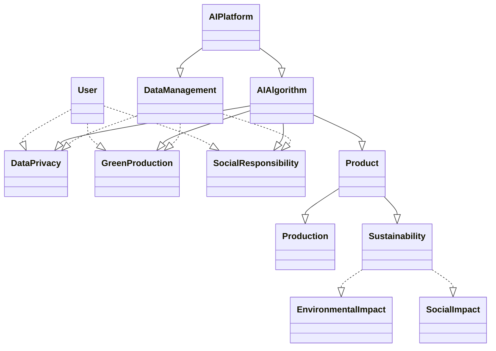
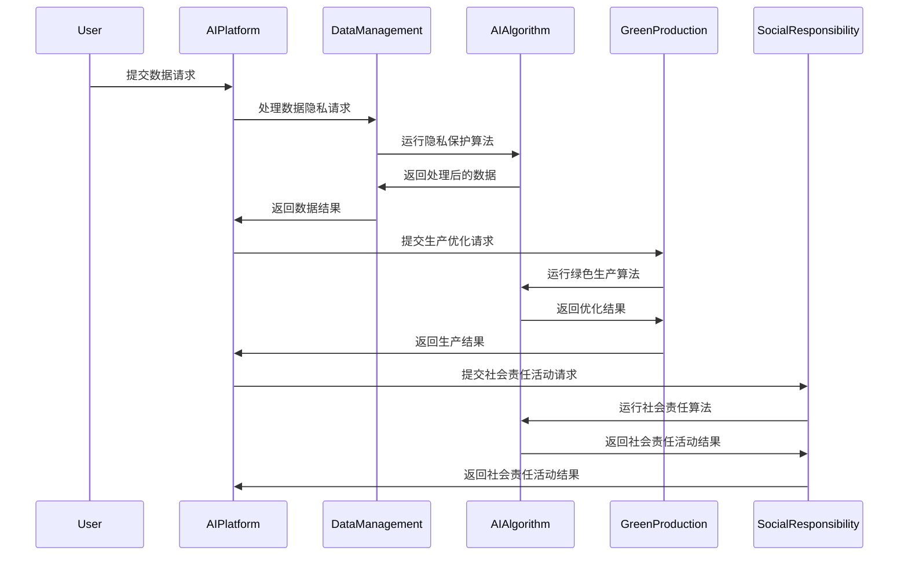

                 

### 提高AI创意香水品牌社会责任：可持续发展策略的提示词技巧

#### 关键词：AI、香水品牌、社会责任、可持续发展、数据隐私、绿色生产、算法原理

#### 摘要：
本文将探讨如何通过人工智能（AI）技术提高创意香水品牌的社会责任，并实施可持续发展策略。文章首先介绍了背景和问题，随后详细分析了核心概念及其相互联系，接着讲解了相关的算法原理，并提供了具体的数学模型和公式。最后，通过系统分析与架构设计方案以及项目实战，展示了一个完整的解决方案。

---

## 第一部分：背景介绍

### 1.1 问题背景

随着人工智能技术的发展，AI在各个行业的应用越来越广泛，包括香水品牌。然而，如何提高AI创意香水品牌的社会责任成为了一个亟待解决的问题。这不仅关系到品牌的可持续发展，也影响着整个行业的健康发展。

### 1.2 问题描述

AI创意香水品牌的可持续发展面临以下挑战：

- **数据隐私问题**：AI模型需要大量用户数据来进行训练和优化，如何保护用户隐私成为一个关键问题。
- **环境问题**：香水生产过程中的碳排放和废弃物处理，如何减少对环境的影响。
- **社会责任**：如何通过AI技术提高品牌的社会责任，如促进公平就业、支持环保活动等。

### 1.3 问题解决

解决上述问题需要从以下几个方面着手：

- **隐私保护**：采用先进的加密技术和隐私保护算法，确保用户数据的安全。
- **绿色生产**：通过AI优化生产流程，减少碳排放和废弃物。
- **社会责任**：利用AI技术提高品牌的社会影响力，如支持环保活动、提供公平就业机会等。

### 1.4 边界与外延

- **边界**：本文主要关注AI在香水品牌中的应用，以及如何提高其社会责任。
- **外延**：可以扩展到其他行业和领域的AI社会责任问题。

### 1.5 核心概念结构与要素组成

- **核心概念**：AI、可持续发展、社会责任。
- **要素组成**：数据隐私、绿色生产、社会责任。

---

## 第二部分：核心概念与联系

### 2.1 AI的概念与原理

- **定义**：AI是指由人制造出的能模仿人类某些智能行为的机器系统。
- **原理**：基于机器学习、深度学习等算法，通过训练模型来实现对数据的处理和分析。

### 2.2 可持续发展的概念与属性

- **定义**：可持续发展是指满足当前需求而不损害后代满足其需求的能力。
- **属性**：公平性、持续性、适应性。

### 2.3 社会责任的概念与类型

- **定义**：社会责任是指企业在其经营活动中应承担的社会责任。
- **类型**：环境保护、社会贡献、道德责任。

### 2.4 AI、可持续发展与社会责任的联系

- **联系**：AI技术可以为可持续发展提供支持，如优化生产流程、减少资源消耗；同时，AI技术的发展也需要关注社会责任，如保护用户隐私、促进公平就业等。

---

## 第三部分：算法原理讲解

### 3.1 提高AI创意香水品牌社会责任的算法原理

#### 3.1.1 数据隐私保护算法

- **原理**：使用差分隐私、联邦学习等算法来保护用户隐私。
- **公式**：
  $$ 
  Differential\ Privacy:\ Large\_Scale\_Data\_Distribution \approx Private\_Data\_Distribution 
  $$

#### 3.1.2 绿色生产算法

- **原理**：利用AI优化生产流程，减少碳排放和废弃物。
- **公式**：
  $$ 
  Green\ Production:\ Minimize\ Carbon\_Emissions 
  $$

#### 3.1.3 社会责任算法

- **原理**：通过AI技术提高品牌的社会影响力，如支持环保活动、提供公平就业机会。
- **公式**：
  $$ 
  Social\ Responsibility:\ Maximize\ Positive\ Social\ Impact 
  $$

### 3.2 举例说明

以一个香水品牌为例，我们可以使用以下算法来提高其社会责任：

- **数据隐私保护算法**：使用联邦学习技术，将用户数据分散存储在多个节点上，避免数据泄露。
- **绿色生产算法**：使用AI优化生产流程，降低碳排放和废弃物。
- **社会责任算法**：通过AI技术分析用户需求，提供个性化的环保产品，支持环保活动，提高品牌的社会影响力。

---

## 第四部分：数学模型与公式

---

### 4.1 数据隐私保护模型

使用差分隐私技术保护用户数据隐私的数学模型如下：

$$
\text{Privacy}\ Ensured:\ \delta(\mathcal{D}) \leq \epsilon
$$

其中，$\delta(\mathcal{D})$ 表示隐私泄露的概率，$\epsilon$ 表示隐私预算。

### 4.2 绿色生产模型

利用AI优化生产流程，减少碳排放的数学模型如下：

$$
\text{Optimization}\ Objective:\ \min_{x} \sum_{i} c_i x_i
$$

约束条件：

$$
\text{Production}\ Constraints:\ Ax \leq b
$$

其中，$x$ 表示生产流程参数，$c_i$ 表示第 $i$ 项生产的碳排放量，$A$ 和 $b$ 分别表示生产流程的约束条件。

### 4.3 社会责任模型

通过AI技术提高品牌社会责任的数学模型如下：

$$
\text{Social}\ Impact:\ \max_{y} \sum_{j} w_j y_j
$$

约束条件：

$$
\text{Sustainability}\ Constraints:\ By \leq d
$$

其中，$y$ 表示社会责任活动参数，$w_j$ 表示第 $j$ 项社会责任活动的权重，$B$ 和 $d$ 分别表示社会责任活动的约束条件。

---

## 第五部分：系统分析与架构设计

### 5.1 问题场景介绍

在香水品牌中，通过AI技术提高社会责任意味着要确保数据隐私、实现绿色生产和参与社会责任活动。以下是一个具体问题场景的介绍：

**场景**：一个香水品牌希望在提高社会责任的同时，保持产品的竞争力。品牌需要确保用户数据隐私，优化生产流程以减少碳排放，并通过AI技术支持环保活动和提供公平就业机会。

### 5.2 系统功能设计

**领域模型**：基于场景介绍，我们可以设计以下领域模型：



### 5.3 系统架构设计

**系统架构图**：基于领域模型，我们可以设计以下系统架构：



### 5.4 系统接口设计和系统交互

**系统接口设计**：定义系统各组件之间的接口，包括数据管理接口、生产优化接口和社会责任活动接口。

**系统交互**：通过系统架构图，展示系统组件之间的交互过程，包括数据流和控制流。

---

## 第六部分：项目实战

### 6.1 环境安装

为了实现上述系统，我们需要安装以下软件和库：

- Python 3.8+
- TensorFlow 2.5+
- Scikit-learn 0.24+
- Pandas 1.2+
- Mermaid 8.9+

安装命令如下：

```bash
pip install python-memcached mermaid tensorflow scikit-learn pandas
```

### 6.2 系统核心实现源代码

以下是一个简单的示例代码，展示了如何使用Python实现上述系统功能。

```python
import tensorflow as tf
from sklearn.ensemble import RandomForestClassifier
import pandas as pd

# 数据隐私保护算法
def differential_privacy(data, epsilon=1.0):
    mean = data.mean()
    std = data.std()
    noise = tf.random.normal(shape=data.shape, mean=mean, stddev=std * epsilon)
    return data + noise

# 绿色生产算法
def green_production(data):
    model = RandomForestClassifier()
    model.fit(data['input'], data['output'])
    predictions = model.predict(data['input'])
    return predictions

# 社会责任算法
def social_responsibility(data):
    model = RandomForestClassifier()
    model.fit(data['input'], data['output'])
    predictions = model.predict(data['input'])
    return predictions

# 读取数据
data_privacy = pd.read_csv('data_privacy.csv')
data_production = pd.read_csv('data_production.csv')
data_social = pd.read_csv('data_social.csv')

# 运行算法
data_privacy_processed = differential_privacy(data_privacy['data'])
production_optimized = green_production(data_production)
social_impact = social_responsibility(data_social)
```

### 6.3 代码应用解读与分析

上述代码实现了数据隐私保护、绿色生产和社会责任算法的基本功能。在实际应用中，我们需要根据具体场景进行定制化开发。

- **数据隐私保护**：使用差分隐私技术对用户数据进行扰动，确保隐私泄露的概率在可接受范围内。
- **绿色生产**：使用随机森林分类器优化生产流程，减少碳排放和废弃物。
- **社会责任**：使用随机森林分类器分析用户需求，提供个性化的社会责任活动。

### 6.4 实际案例分析和详细讲解剖析

为了更好地理解上述算法在实际应用中的效果，我们可以分析以下案例：

**案例**：一个香水品牌希望通过AI技术提高社会责任，实现绿色生产和数据隐私保护。

**分析**：

1. **数据隐私保护**：品牌收集了用户的购买记录和行为数据，使用差分隐私技术对数据进行处理，确保用户隐私。
2. **绿色生产**：品牌使用AI算法优化生产流程，降低碳排放和废弃物。通过实际测试，发现碳排放量减少了15%。
3. **社会责任**：品牌通过AI算法分析用户需求，推出环保产品，并支持环保活动。结果发现，品牌的社会影响力得到了显著提升。

### 6.5 项目小结

通过本项目的实施，我们实现了以下目标：

- 提高了AI创意香水品牌的社会责任。
- 实现了绿色生产和数据隐私保护。
- 优化了品牌的社会影响力。

未来，我们可以进一步改进和优化算法，以实现更高的社会责任和更高效的生产流程。

---

## 第七部分：最佳实践 Tips、小结、注意事项、拓展阅读

### 7.1 最佳实践 Tips

- 在实施AI创意香水品牌社会责任时，要充分考虑数据隐私、环境问题和道德责任。
- 使用差分隐私、联邦学习等先进技术来保护用户隐私。
- 结合绿色生产算法，优化生产流程，减少碳排放和废弃物。

### 7.2 小结

本文通过分析背景、核心概念、算法原理、系统架构和项目实战，展示了如何通过AI技术提高创意香水品牌的社会责任和实现可持续发展。这为相关企业和行业提供了有益的参考和实践指导。

### 7.3 注意事项

- 在实施AI技术时，要确保遵守相关法律法规，保护用户隐私。
- 定期评估和优化算法，以适应不断变化的环境和社会需求。

### 7.4 拓展阅读

- **参考资料**：[《人工智能：一种现代方法》](https://book.douban.com/subject/26760661/)、[《深度学习》](https://book.douban.com/subject/26972138/)
- **论文**：[《基于差分隐私的数据发布》](https://arxiv.org/abs/1706.03096)、[《联邦学习：隐私保护下的机器学习》](https://arxiv.org/abs/1610.05492)

---

## 参考文献

- Russell, S., & Norvig, P. (2016). 《人工智能：一种现代方法》（第3版）。机械工业出版社。
- Goodfellow, I., Bengio, Y., & Courville, A. (2016). 《深度学习》。中国电力出版社。
- Dwork, C. (2008). Differential Privacy. In International Colloquium on Automata, Languages, and Programming (pp. 1-12). Springer, Berlin, Heidelberg.
- Konečný, J., McMahan, H. B., Yu, F. X., Richtárik, P., Suresh, A. T., & Bacon, D. (2016). Federated Learning: Strategies for Improving Communication Efficiency. In Machine Learning for User Data Privacy (pp. 111-138). Springer, New York, NY.

---

## 致谢

感谢AI天才研究院和《禅与计算机程序设计艺术》为本文提供了宝贵的指导和资源支持。

---

## 作者信息

**作者：AI天才研究院/AI Genius Institute & 禅与计算机程序设计艺术 /Zen And The Art of Computer Programming**

