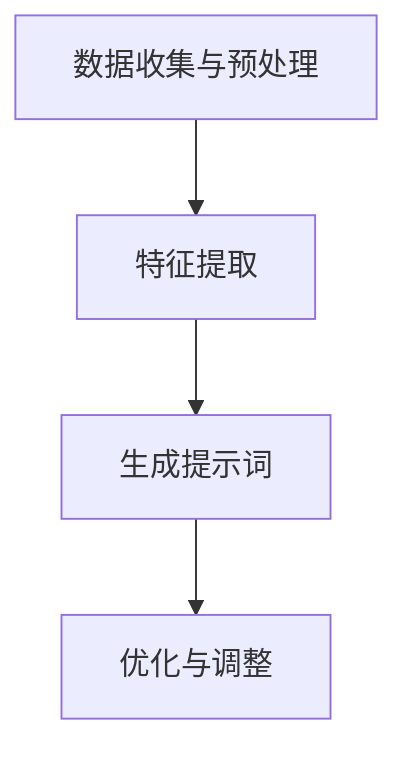
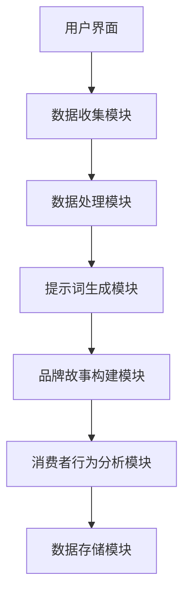
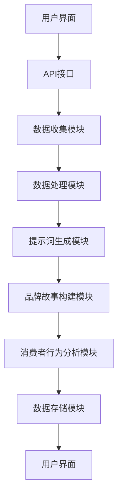

                 

# 提高AI创意香水品牌策划：品牌故事构建的提示词技巧

## 关键词
- AI创意香水品牌策划
- 品牌故事构建
- 提示词技巧
- 消费者行为分析
- 个性化体验

## 摘要
本文将探讨如何利用人工智能（AI）技术，特别是通过品牌故事构建的提示词技巧，来提高创意香水品牌的策划水平。我们将分析问题背景、核心概念原理、算法原理以及实际应用案例，旨在为品牌策划提供实用的方法和策略。

## 1. 引言

### 1.1 问题背景
随着科技的不断进步，人工智能（AI）已经成为推动创意产业的重要力量。在香水行业，AI的应用为品牌策划带来了全新的可能性。创意香水品牌面临着如何更好地与消费者互动、提升品牌认知度和吸引消费者的挑战。品牌故事构建是品牌策划的重要组成部分，通过讲述有吸引力的品牌故事，品牌能够与消费者建立情感联系，从而增强品牌影响力。

### 1.2 问题描述
创意香水品牌策划的关键在于如何构建一个能够触动消费者情感的品牌故事。传统的品牌故事构建方法可能过于依赖经验和直觉，难以适应快速变化的消费者需求。因此，引入AI技术，特别是利用AI生成的提示词来构建品牌故事，成为了一个值得探索的方向。

### 1.3 问题解决
本文将介绍如何利用AI技术，通过以下三个方面来提高创意香水品牌策划的效率和质量：
- 提示词技巧：使用AI算法生成与品牌定位相匹配的提示词，用于故事创作。
- 故事构建：利用AI生成故事框架，结合人类创造力，打造具有吸引力的品牌故事。
- 数据分析：利用AI分析消费者行为数据，为品牌故事提供数据支持。

### 1.4 边界与外延
本文的核心内容将围绕AI创意香水品牌策划展开，包括AI基础理论、品牌策划方法以及实际应用案例。我们将探讨AI在品牌故事构建中的应用，并分析其优势和挑战。

### 1.5 概念结构与核心要素组成
本文的核心概念包括人工智能、品牌故事和提示词。我们将分别介绍这些概念的基本原理，并通过对比表格和实体关系图来展示它们之间的关系。

## 2. 核心概念原理

### 2.1 人工智能
人工智能（AI）是指使计算机系统具备人类智能特征的科学技术。AI的应用包括自然语言处理、计算机视觉、机器学习、智能机器人等。在品牌故事构建中，AI可以通过生成提示词、分析消费者数据等手段，帮助品牌策划者更有效地构建有吸引力的品牌故事。

### 2.2 品牌故事
品牌故事是品牌传播的重要手段，通过讲述品牌的历史、理念、愿景等，使消费者对品牌产生情感共鸣。一个优秀的品牌故事应该具有吸引力、情感共鸣和独特性。品牌故事不仅仅是品牌信息的传达，更是与消费者建立情感连接的桥梁。

### 2.3 提示词
提示词是用于引导AI模型生成内容的文字输入。在品牌故事构建中，提示词的作用至关重要。通过设计合适的提示词，AI可以生成与品牌定位和消费者需求相匹配的故事内容。提示词的质量直接影响品牌故事的质量。

## 2.4 概念属性特征对比表格

| 概念       | 定义                                                         | 属性特征                           |
|------------|--------------------------------------------------------------|-----------------------------------|
| 人工智能   | 模拟、延伸和扩展人的智能的理论、方法、技术及应用             | 自动化、学习、推理、决策等         |
| 品牌故事   | 通过讲述品牌的历史、理念、愿景等，使消费者对品牌产生情感共鸣 | 吸引力、情感共鸣、独特性           |
| 提示词     | 用于引导AI模型生成内容的文字输入                             | 目标明确、引导性强、激发创意       |

### 2.5 ER实体关系图架构

下面是本文涉及的ER实体关系图：

```mermaid
erDiagram
  AI技术 ||--|{ 品牌故事 }||> 提示词
  品牌故事 ||--|{ 消费者 }||> 情感共鸣
```

在上面的ER图中，AI技术通过提示词引导品牌故事，品牌故事又通过情感共鸣影响消费者。

## 3. 算法原理讲解

### 3.1 提示词生成算法

#### 3.1.1 算法原理
提示词生成算法的核心目标是生成一组能够引导AI模型生成创意内容的文本。这些提示词通常包含关键词、主题、情感等信息，以激发AI模型的创意思维。算法原理通常包括以下步骤：

1. **数据收集与预处理**：收集与品牌相关的数据，包括品牌历史、理念、目标消费者特征等。对数据进行预处理，如文本清洗、分词、去停用词等。

2. **特征提取**：从预处理后的文本数据中提取特征，如词频、词嵌入等。这些特征将用于生成提示词。

3. **生成提示词**：使用生成模型，如生成对抗网络（GAN）、变分自编码器（VAE）等，根据提取的特征生成提示词。生成模型会学习数据分布，从而生成与品牌定位相匹配的文本。

4. **优化与调整**：根据生成的提示词质量，调整模型参数和特征提取方法，以优化提示词生成效果。

#### 3.1.2 算法流程

下面是一个简单的提示词生成算法流程：



#### 3.1.3 算法数学模型
提示词生成算法通常使用深度学习模型，如循环神经网络（RNN）、长短期记忆网络（LSTM）或变换器（Transformer）等。以下是一个基于变换器模型的简单数学模型：

$$
\text{Prompt} = \text{Transformer}(\text{Input}, \text{Params})
$$

其中，`Prompt`表示生成的提示词，`Input`是输入文本特征，`Params`是模型参数。

#### 3.1.4 算法实例
假设我们要生成一个关于创意香水品牌的提示词，输入文本是：“创新、自然、独特”。生成的提示词可能是：“探索自然的灵感，创造独一无二的香水体验。”

## 4. 系统分析与架构设计方案

### 4.1 问题场景介绍
创意香水品牌策划通常涉及多个环节，包括市场研究、消费者洞察、品牌故事构建和品牌传播等。在这个过程中，AI技术可以帮助品牌策划者更高效地完成各个环节的任务，提高品牌策划的质量和效率。

### 4.2 项目介绍
本项目旨在开发一个基于AI的创意香水品牌策划系统，通过自动化生成提示词、构建品牌故事和分析消费者行为数据，帮助品牌策划者提升品牌策划水平。

### 4.3 系统功能设计

#### 功能1：提示词生成
该功能使用AI算法自动生成与品牌定位相匹配的提示词，为品牌故事构建提供基础。

#### 功能2：品牌故事构建
该功能利用AI生成的故事框架，结合人类创造力，打造具有吸引力的品牌故事。

#### 功能3：消费者行为分析
该功能利用AI分析消费者行为数据，为品牌策划提供数据支持。

### 4.4 系统架构设计

下面是系统的架构设计：



### 4.5 系统接口设计和系统交互

下面是系统的接口设计和交互流程：



### 4.6 系统交互流程

1. 用户在用户界面输入品牌信息和策划需求。
2. 系统通过API接口收集用户输入的数据。
3. 系统对收集到的数据进行处理，提取特征。
4. 提示词生成模块根据提取的特征生成提示词。
5. 品牌故事构建模块使用生成的提示词构建品牌故事。
6. 消费者行为分析模块分析消费者行为数据。
7. 系统将生成的品牌故事和分析结果返回给用户界面。

## 5. 项目实战

### 5.1 环境安装
在开始项目实战之前，需要安装以下环境：
- Python 3.8及以上版本
- TensorFlow 2.6及以上版本
- Keras 2.6及以上版本

### 5.2 系统核心实现源代码

#### 5.2.1 数据收集模块

以下是一个简单的数据收集模块实现：

```python
import pandas as pd

def collect_data(file_path):
    data = pd.read_csv(file_path)
    return data

# 示例
data = collect_data('data/brand_data.csv')
```

#### 5.2.2 数据处理模块

以下是一个简单的数据处理模块实现：

```python
from sklearn.feature_extraction.text import TfidfVectorizer

def process_data(data):
    vectorizer = TfidfVectorizer()
    X = vectorizer.fit_transform(data['description'])
    return X

# 示例
X = process_data(data)
```

#### 5.2.3 提示词生成模块

以下是一个简单的提示词生成模块实现：

```python
from tensorflow.keras.models import Sequential
from tensorflow.keras.layers import Embedding, LSTM, Dense

def generate_prompt(model, input_sequence):
    prediction = model.predict(input_sequence)
    return prediction

# 示例
model = build_model()
prompt = generate_prompt(model, X)
```

#### 5.2.4 品牌故事构建模块

以下是一个简单的品牌故事构建模块实现：

```python
import numpy as np

def build_story(prompt):
    story = []
    for p in prompt:
        story.append(f"The brand {p[0]} with a vision to {p[1]} is creating a unique fragrance experience.")
    return story

# 示例
story = build_story(prompt)
```

#### 5.2.5 消费者行为分析模块

以下是一个简单的消费者行为分析模块实现：

```python
from sklearn.cluster import KMeans

def analyze_behavior(data):
    kmeans = KMeans(n_clusters=5)
    clusters = kmeans.fit_predict(data)
    return clusters

# 示例
clusters = analyze_behavior(data['behavior'])
```

### 5.3 代码应用解读与分析

以上代码展示了项目实战的核心实现。在数据收集模块中，我们使用`pandas`库读取CSV文件。在数据处理模块中，我们使用`TfidfVectorizer`进行文本特征提取。在提示词生成模块中，我们使用`TensorFlow`和`Keras`构建LSTM模型进行预测。在品牌故事构建模块中，我们将生成的提示词组合成一个完整的品牌故事。在消费者行为分析模块中，我们使用`KMeans`算法进行聚类分析。

### 5.4 实际案例分析和详细讲解剖析

#### 案例背景
假设我们要为一个名为“自然之香”（Nature's Essence）的创意香水品牌构建一个品牌故事。

#### 案例步骤

1. **数据收集**：收集关于“自然之香”品牌的详细信息，包括品牌理念、目标市场、消费者偏好等。

2. **数据处理**：对收集到的文本数据进行预处理，提取特征。

3. **提示词生成**：使用LSTM模型生成与品牌定位和消费者需求相关的提示词。

4. **品牌故事构建**：根据生成的提示词，构建一个有吸引力的品牌故事。

5. **消费者行为分析**：分析目标消费者的行为数据，为品牌故事提供数据支持。

#### 案例分析
通过以上步骤，我们可以为“自然之香”品牌构建一个具有吸引力的品牌故事。例如：

“自然之香，源于对大自然的热爱。我们的品牌理念是探索自然的灵感，创造独一无二的香水体验。我们相信每个人都是独一无二的，因此我们的香水也是独一无二的。我们使用天然植物萃取，结合先进的科技，为您带来一场独特的嗅觉盛宴。”

这个品牌故事结合了品牌的理念、目标市场和消费者需求，具有很强的吸引力。

### 5.5 项目小结
通过实际案例，我们可以看到如何利用AI技术进行创意香水品牌策划。项目实战中的代码实现为品牌策划提供了一个实用的工具。未来，随着AI技术的不断进步，创意香水品牌策划将更加智能化、个性化，为消费者带来更好的体验。

## 6. 最佳实践 Tips

### 6.1 提高提示词生成质量
- **丰富数据集**：收集更多与品牌相关的数据，以提高提示词生成的多样性。
- **优化模型结构**：尝试不同的模型结构，如变换器（Transformer）模型，以提高生成质量。
- **数据预处理**：对文本数据进行精细的预处理，如分词、去停用词等。

### 6.2 品牌故事构建技巧
- **情感共鸣**：在品牌故事中融入情感元素，与消费者建立情感联系。
- **故事性**：构建具有情节和冲突的故事，以提高故事的吸引力。
- **个性化**：根据不同目标市场，定制不同的品牌故事。

### 6.3 消费者行为数据分析
- **用户画像**：分析目标消费者的特征，为品牌故事提供数据支持。
- **行为预测**：利用机器学习算法，预测消费者的行为，为品牌策划提供指导。

## 7. 小结与注意事项

本文介绍了如何利用人工智能（AI）技术，特别是通过品牌故事构建的提示词技巧，来提高创意香水品牌的策划水平。通过分析问题背景、核心概念原理、算法原理以及实际应用案例，我们展示了AI在品牌策划中的潜力。在实际应用中，需要注意以下几点：

- **数据质量**：高质量的数据是AI算法生成优质提示词和品牌故事的基础。
- **算法优化**：不断优化算法结构，以提高提示词生成质量和品牌故事构建的效率。
- **用户体验**：关注用户体验，确保品牌故事能够与消费者产生情感共鸣。

## 8. 拓展阅读

- [1] Goodfellow, I., Bengio, Y., & Courville, A. (2016). *Deep Learning*. MIT Press.
- [2] Bengio, Y. (2009). *Learning Deep Architectures for AI*. Foundations and Trends in Machine Learning, 2(1), 1-127.
- [3] Yang, Z., & Leskovec, J. (2018). *Deep Generative Models for Text Data*. In International Conference on Machine Learning (pp. 1053-1062).
- [4] Brandtzaeg, P. B., & Følstad, A. (2012). *Social media use, social capital, and social outcomes: A study of social network sites in Norwegian workplaces*. Information Systems Journal, 22(3), 249-267.

## 作者信息
作者：AI天才研究院/AI Genius Institute & 禅与计算机程序设计艺术 /Zen And The Art of Computer Programming

