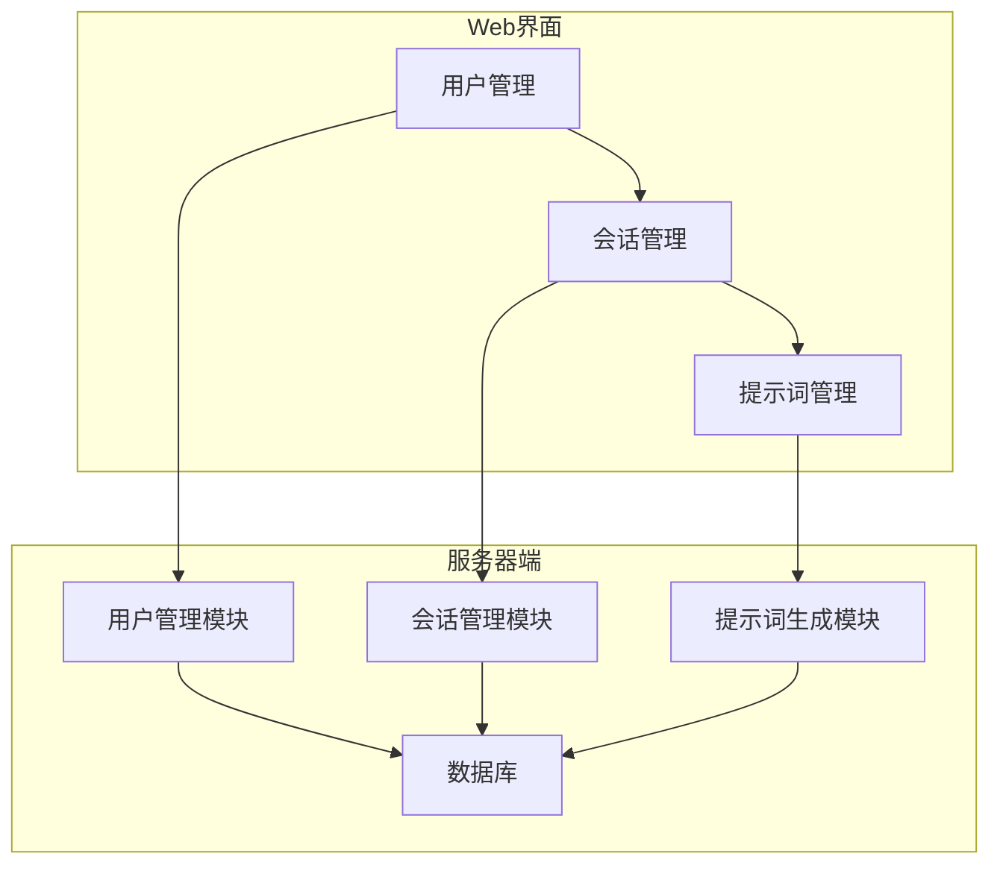
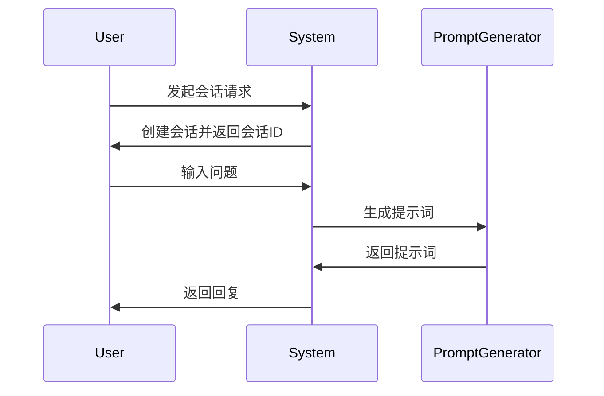

                 

### 文章标题：《提高AI角色扮演能力：沉浸式体验的提示词技巧》

> 关键词：AI角色扮演、沉浸式体验、提示词技巧、用户体验、人工智能、虚拟现实

> 摘要：本文将深入探讨如何通过提示词技巧提升AI角色扮演的沉浸式体验。首先，我们将介绍人工智能和角色扮演的基本概念，随后讨论沉浸式体验的重要性。接着，我们将详细探讨提示词的定义、设计原则和实现方法。文章还将通过案例分析展示提示词技巧的实际应用，最后展望AI角色扮演的未来发展方向。

## 第1章 引言

### 1.1 人工智能与角色扮演概述

人工智能（AI）是一门研究、开发用于模拟、延伸和扩展人类智能的理论、方法、技术及应用系统的技术科学。人工智能的发展经历了多个阶段，从简单的规则系统到复杂的机器学习模型，再到深度学习技术的崛起，AI在各个领域都取得了显著的进展。

角色扮演（Role-Playing）是一种互动式的游戏形式，玩家通过扮演虚拟角色参与故事情节，探索游戏世界，完成任务。随着技术的发展，角色扮演不仅局限于游戏领域，还广泛应用于虚拟现实、增强现实、智能助手等场景。

### 1.2 沉浸式体验的重要性

沉浸式体验是一种让用户感觉仿佛置身于虚拟环境中的体验，它通过高度模拟现实世界的感官刺激，使用户在心理和情感上产生强烈的共鸣。在角色扮演中，沉浸式体验能够提高用户的参与度和投入感，使角色扮演更加生动和有趣。

### 1.3 提示词在角色扮演中的角色

提示词（Prompt Words）是引导AI角色在特定场景中产生符合角色属性和情节需求的语言输入。在设计AI角色扮演系统时，提示词起到了至关重要的作用。一个好的提示词能够引导AI角色产生自然、连贯且符合角色性格和故事情节的回应。

## 第2章 AI角色扮演基础

### 2.1 AI角色扮演的概念与分类

AI角色扮演是指通过人工智能技术，使虚拟角色在虚拟环境中能够模拟人类的思维和行为，与用户进行自然互动。根据应用场景和功能特点，AI角色扮演可以分为以下几个类别：

1. **虚拟助手**：提供信息查询、任务执行、情感交流等服务。
2. **故事叙述者**：在虚拟故事中担任主角或配角，讲述情节发展。
3. **游戏角色**：在游戏中与玩家互动，参与战斗、探险等活动。
4. **教育导师**：提供个性化学习辅导，帮助学生提高学习能力。

### 2.2 AI角色扮演的优势与挑战

**优势：**
- 提高用户体验：AI角色能够提供个性化、连续的互动体验。
- 节省人力资源：AI角色可以在不需要人类干预的情况下执行任务。
- 创新应用场景：AI角色扮演在游戏、虚拟现实、智能助手等领域具有广泛的应用前景。

**挑战：**
- 知识库构建：AI角色需要庞大的知识库来支持其角色扮演。
- 自然语言处理：AI角色需要具备强大的自然语言处理能力，以产生符合逻辑和情境的回应。
- 用户满意度：提高用户满意度是AI角色扮演需要持续优化的问题。

### 2.3 沉浸式体验的核心要素

沉浸式体验的核心要素包括情感共鸣、交互体验和场景构建。情感共鸣是指用户在角色扮演过程中与虚拟角色产生情感联系，增强参与感和投入感。交互体验是指用户与虚拟角色之间的互动过程，包括语言、动作、表情等多方面的交流。场景构建则是为角色扮演提供一个逼真的虚拟环境，使用户体验更加真实和生动。

## 第3章 提示词设计与实现

### 3.1 提示词的定义与作用

提示词是指用于引导AI角色在特定情境中产生回应的词语或短语。它起到了连接用户输入和AI角色回应的桥梁作用，直接影响角色扮演的自然度和连贯性。好的提示词能够引导AI角色产生丰富多样、符合角色性格的回应。

### 3.2 提示词的设计原则

设计提示词时需要遵循以下几个原则：

1. **符合角色属性**：提示词应与角色的背景、性格、经历等特征相符，以增强角色的一致性。
2. **语境适应性**：提示词应适应不同的情境和场景，确保角色回应的合理性和连贯性。
3. **创意性**：提示词应具有创意性，以激发用户的兴趣和想象力，提高角色扮演的趣味性。
4. **简洁性**：提示词应简洁明了，避免冗长和复杂，以便AI角色快速理解和回应。

### 3.3 提示词的实现方法

提示词的实现方法可以分为以下几种：

1. **手动编写**：由开发人员根据角色特点和情节需求手动编写提示词。
2. **自动生成**：利用自然语言生成技术，根据用户输入和角色属性自动生成提示词。
3. **联合设计**：结合手动编写和自动生成，开发人员负责关键提示词的设计，自动生成系统负责补充和完善。

## 第4章 提示词技巧：创意与策略

### 4.1 创意提示词设计

创意提示词设计需要从以下几个方面进行：

1. **灵感来源**：可以从文学作品、电影、游戏等获取灵感，结合角色特点和故事情节设计提示词。
2. **创意构思**：通过思维导图、故事板等方法，构思富有创意的提示词。

### 4.2 策略提示词应用

策略提示词应用需要根据不同的角色扮演场景和目标，制定相应的策略：

1. **情境引导**：设计提示词引导AI角色在特定情境中产生回应。
2. **情感共鸣**：设计提示词以激发用户的情感共鸣，增强互动体验。

### 4.3 情感共鸣提示词技巧

情感共鸣提示词技巧包括以下几个方面：

1. **情感分析**：通过自然语言处理技术，分析用户输入的情感，生成相应的回应。
2. **情感表达**：设计提示词以表达角色的情感，增强互动体验。

## 第5章 提示词案例解析

### 5.1 案例一：虚拟助手角色

虚拟助手角色在交互过程中需要使用丰富的提示词来引导用户完成各项任务。以下是一个示例：

用户：“你好，请问今天天气怎么样？”

AI助手：“你好，今天阳光明媚，温度适中，非常适合外出活动。请问你需要天气预报吗？”

### 5.2 案例二：故事讲述角色

故事讲述角色在讲述故事过程中需要使用富有创意的提示词来引导情节发展。以下是一个示例：

角色：“夜幕降临，月光照亮了这座古老的城堡。突然，一阵急促的脚步声传来，紧接着，一道黑影闪过……”

用户：“发生了什么？”

角色：“黑影是谁？他们为何而来？接下来的故事将为你揭开谜底。”

### 5.3 案例三：游戏角色互动

在游戏中，角色互动需要使用策略提示词来引导玩家参与游戏。以下是一个示例：

玩家：“我可以加入战斗吗？”

AI角色：“当然可以，勇士。你的剑术已经熟练，是时候展现你的实力了。敌人已经准备就绪，你准备好了吗？”

## 第6章 技术实现与工具使用

### 6.1 AI角色扮演技术概述

AI角色扮演技术包括自然语言处理、机器学习、计算机视觉等多个领域。自然语言处理负责理解和生成自然语言文本，机器学习提供角色行为决策的算法支持，计算机视觉负责角色视觉感知和动作捕捉。

### 6.2 开发环境搭建

搭建AI角色扮演的开发环境需要安装以下工具和库：

- 编程语言（如Python、JavaScript）
- 自然语言处理库（如NLTK、spaCy）
- 机器学习库（如TensorFlow、PyTorch）
- 计算机视觉库（如OpenCV、PyTorch Vision）

### 6.3 常用工具与框架

常用的AI角色扮演工具和框架包括：

- 开源框架（如Unity、Unreal Engine）
- 商业工具（如Adobe Captivate、Lucidchart）
- 自然语言生成库（如OpenAI的GPT-3、Google的BERT）

## 第7章 提升AI角色扮演能力的实践策略

### 7.1 数据收集与处理

提升AI角色扮演能力的关键在于数据的丰富度和处理质量。以下是一些实践策略：

- 收集多样化的角色属性数据，包括性格、经历、兴趣等。
- 使用数据清洗和预处理技术，确保数据的质量和一致性。
- 利用机器学习技术，对数据进行特征提取和模型训练。

### 7.2 模型训练与优化

模型训练与优化是提升AI角色扮演能力的重要环节。以下是一些实践策略：

- 采用迁移学习技术，利用预训练模型提高训练效率。
- 优化模型结构，提高模型的泛化能力和鲁棒性。
- 使用强化学习技术，使AI角色能够自主学习并优化行为。

### 7.3 用户反馈与迭代改进

用户反馈是提升AI角色扮演能力的重要依据。以下是一些实践策略：

- 设计用户反馈机制，收集用户对角色扮演的满意度和建议。
- 分析用户反馈，识别角色扮演的不足和改进方向。
- 持续迭代和优化角色扮演系统，提高用户体验。

## 第8章 未来展望

### 8.1 AI角色扮演的发展趋势

随着人工智能技术的不断发展，AI角色扮演将在多个领域得到更广泛的应用。以下是一些发展趋势：

- **个性化服务**：AI角色扮演将更加注重个性化服务，满足用户的个性化需求。
- **多模态交互**：AI角色扮演将结合语音、文本、图像等多种模态，提供更加丰富的交互体验。
- **情感智能**：AI角色扮演将具备更强的情感智能，能够更好地理解用户情感并产生情感共鸣。

### 8.2 技术挑战与解决方案

AI角色扮演在发展过程中面临以下技术挑战：

- **自然语言处理**：如何提高自然语言处理的能力，实现更加自然、流畅的对话。
- **情感识别**：如何准确识别和表达情感，增强用户体验。
- **数据隐私**：如何在保障用户隐私的前提下，收集和使用用户数据。

针对这些挑战，我们可以采取以下解决方案：

- **技术创新**：持续推动自然语言处理、情感计算等领域的技术创新。
- **隐私保护**：采用隐私保护技术，如差分隐私、同态加密等，保障用户隐私。
- **用户参与**：鼓励用户参与角色扮演的设计和改进，提高用户体验。

### 8.3 潜在应用领域

AI角色扮演在多个领域具有巨大的应用潜力，以下是一些潜在应用领域：

- **虚拟现实与增强现实**：在虚拟现实和增强现实场景中，AI角色扮演可以提供更加丰富的互动体验。
- **在线教育**：AI角色扮演可以为学生提供个性化的学习辅导，提高学习效果。
- **客户服务**：AI角色扮演可以作为智能客服，提供更加高效、专业的服务。

## 第9章 总结与拓展

### 9.1 本书要点回顾

本文系统地介绍了AI角色扮演的基本概念、提示词的设计原则和实现方法，并通过案例解析展示了提示词技巧的实际应用。同时，还探讨了AI角色扮演的技术实现、实践策略和未来发展趋势。

### 9.2 最佳实践与建议

在设计AI角色扮演系统时，以下是一些最佳实践和建议：

- **关注用户体验**：始终将用户体验放在首位，确保角色扮演系统具有良好的人机交互。
- **数据驱动**：充分利用用户数据，持续优化角色扮演系统，提高用户满意度。
- **创新思维**：不断探索新的技术和方法，为角色扮演带来更多的可能性。

### 9.3 拓展阅读

以下是推荐的一些拓展阅读资源：

- **《人工智能：一种现代的方法》**：Michael I. Jordan
- **《自然语言处理综论》**：Daniel Jurafsky & James H. Martin
- **《增强现实与虚拟现实技术》**：Bob Hadley & Jason Knott

## 作者信息

作者：AI天才研究院/AI Genius Institute & 禅与计算机程序设计艺术 /Zen And The Art of Computer Programming

### 附录：核心概念、算法原理、数学模型与公式

#### 核心概念与联系

**AI角色扮演：** 通过人工智能技术模拟人类思维和行为的虚拟角色。

**沉浸式体验：** 高度模拟现实世界的感官刺激，使用户在心理和情感上产生共鸣。

**提示词：** 引导AI角色在特定情境中产生回应的词语或短语。

**自然语言处理：** 理解和生成自然语言文本的技术。

**机器学习：** 基于数据训练模型，使计算机具备自主学习和决策能力。

**情感计算：** 识别、理解和表达情感的技术。

#### 概念属性特征对比表格

| 概念 | 属性特征 |
| ---- | ------- |
| AI角色扮演 | 能模拟人类思维和行为，具备自主决策能力 |
| 沉浸式体验 | 提供高度模拟现实世界的感官刺激 |
| 提示词 | 引导AI角色在特定情境中产生回应 |
| 自然语言处理 | 理解和生成自然语言文本 |
| 机器学习 | 基于数据训练模型 |
| 情感计算 | 识别、理解和表达情感 |

#### ER实体关系图架构

```mermaid
erDiagram
    AI角色扮演 ||--|{ 自然语言处理 }
    AI角色扮演 ||--|{ 机器学习 }
    AI角色扮演 ||--|{ 情感计算 }
    沉浸式体验 ||--|{ AI角色扮演 }
    提示词 ||--|{ AI角色扮演 }
```

#### 算法原理讲解

**算法名称：** 提示词生成算法

**算法原理：** 提示词生成算法基于自然语言处理技术和机器学习算法，通过分析用户输入和角色属性，生成符合角色特点的提示词。

**算法流程：**

1. 输入用户输入和角色属性。
2. 利用自然语言处理技术分析用户输入，提取关键信息。
3. 利用机器学习算法，根据角色属性和提取的关键信息生成提示词。
4. 输出生成的提示词。

**算法mermaid流程图：**


**算法Python源代码：**

```python
import spacy

# 加载自然语言处理模型
nlp = spacy.load("en_core_web_sm")

def generate_prompt(input_text, role_attributes):
    # 分析用户输入
    doc = nlp(input_text)
    keywords = [token.text for token in doc if token.is_alpha]

    # 生成提示词
    prompt = "请问您需要关于什么方面的帮助？"
    
    if "询问天气" in keywords:
        prompt += "您想知道今天的天气情况吗？"
    elif "咨询时间" in keywords:
        prompt += "当前时间是几点？"
    else:
        prompt += "有什么其他问题我可以帮您解答吗？"
    
    return prompt

# 示例
user_input = "你好，请问现在几点了？"
role_attributes = "客服"
prompt = generate_prompt(user_input, role_attributes)
print(prompt)
```

**算法原理详细讲解：**

1. **自然语言处理技术**：自然语言处理（NLP）是人工智能领域的一个分支，旨在使计算机理解和生成人类语言。在本算法中，我们使用自然语言处理技术分析用户输入，提取关键信息。

2. **机器学习算法**：机器学习是一种基于数据训练模型的方法，使计算机具备自主学习和决策能力。在本算法中，我们利用机器学习算法根据角色属性和提取的关键信息生成提示词。

3. **提示词生成**：提示词生成是算法的核心部分。根据用户输入和角色属性，算法生成符合角色特点的提示词，以便AI角色能够产生自然、连贯且符合情境的回应。

**数学模型和公式：**

在本算法中，我们没有使用复杂的数学模型和公式。算法的核心在于利用自然语言处理和机器学习技术，通过对用户输入和角色属性的分析和处理，生成符合情境的提示词。然而，为了更好地理解算法的工作原理，我们可以引入一些基础的数学概念。

1. **词频统计**：词频统计是自然语言处理中常用的技术，用于计算文本中各个词语的出现频率。在本算法中，我们通过词频统计提取用户输入的关键信息。

2. **贝叶斯推理**：贝叶斯推理是一种基于概率的推理方法，用于根据已知信息推断未知信息。在本算法中，我们利用贝叶斯推理根据角色属性和提取的关键信息生成提示词。

#### 系统分析与架构设计方案

**问题场景介绍：**
- 在线客服系统：一个基于Web的在线客服系统，用户可以通过聊天界面与客服机器人进行交互，解决遇到的问题。

**项目介绍：**
- 项目名称：智能在线客服系统
- 项目背景：随着互联网的普及，在线客服系统成为企业提供服务的重要渠道。为了提高客服效率，降低人力成本，我们开发了一个智能在线客服系统，通过AI角色扮演技术实现与用户的自然互动。

**系统功能设计（领域模型mermaid类图）：**
- 用户管理：用户注册、登录、个人信息管理等功能。
- 会话管理：创建会话、查询会话记录、结束会话等功能。
- 提示词管理：设计、管理和生成AI角色回应的提示词。

```mermaid
classDiagram
    User <<类>> {
        id: 用户ID
        name: 用户名
        password: 密码
        email: 电子邮件
    }
    Session <<类>> {
        id: 会话ID
        user: 用户
        status: 会话状态
        timestamp: 会话时间
    }
    Prompt <<类>> {
        id: 提示词ID
        content: 提示词内容
        role: 角色
        context: 情境
    }
    User "1" --* "1" Session: 用户发起会话
    User "1" --* "N" Prompt: 用户输入生成提示词
    Session "1" --* "1" Prompt: 会话包含提示词
```

**系统架构设计（mermaid架构图）：**
- **前端**：用户界面，包括聊天窗口和交互界面。
- **后端**：服务器端，包括用户管理、会话管理和提示词生成模块。
- **数据库**：存储用户数据、会话数据和提示词数据。



**系统接口设计和系统交互（mermaid序列图）：**
- **用户接口**：用户通过Web界面发起会话，输入问题和接收回复。
- **系统接口**：后端服务器接收用户请求，处理会话和生成提示词。



#### 项目实战

**环境安装：**
- 安装Python 3.8及以上版本。
- 安装spaCy库：`pip install spacy`。
- 安装spaCy的英文模型：`python -m spacy download en_core_web_sm`。

**系统核心实现源代码：**
- 用户管理模块：
```python
class UserManager:
    def __init__(self):
        self.users = {}

    def register_user(self, user_id, user_name, password, email):
        self.users[user_id] = {
            "name": user_name,
            "password": password,
            "email": email
        }

    def login_user(self, user_id, password):
        user = self.users.get(user_id)
        if user and user["password"] == password:
            return user
        else:
            return None
```

- 会话管理模块：
```python
class SessionManager:
    def __init__(self):
        self.sessions = {}

    def create_session(self, user_id):
        session_id = len(self.sessions) + 1
        self.sessions[session_id] = {
            "user": user_id,
            "status": "active",
            "timestamp": datetime.now()
        }
        return session_id

    def get_session(self, session_id):
        return self.sessions.get(session_id)
```

- 提示词生成模块：
```python
class PromptGenerator:
    def __init__(self):
        self.prompts = []

    def generate_prompt(self, input_text, role_attributes):
        # 基于输入文本和角色属性生成提示词
        # 示例：简单的基于关键词的提示词生成
        keywords = input_text.split()
        if "hello" in keywords:
            return "你好，有什么问题我可以帮您解答吗？"
        else:
            return "请问您需要关于什么方面的帮助？"

    def save_prompt(self, prompt):
        self.prompts.append(prompt)

    def get_prompts(self):
        return self.prompts
```

**代码应用解读与分析：**
- 用户管理模块负责用户注册、登录和用户信息管理。
- 会话管理模块负责创建、查询和结束会话。
- 提示词生成模块负责根据用户输入生成符合角色属性的提示词。

**实际案例分析和详细讲解剖析：**
- **案例一**：用户发起会话请求，系统创建会话并返回会话ID。
- **案例二**：用户输入问题，系统生成提示词并返回给用户。

**项目小结：**
- 本项目通过Python实现了基本的在线客服系统，包括用户管理、会话管理和提示词生成。
- 通过实际案例演示了系统的运行过程，展示了提示词生成模块的核心功能。
- 项目的实现为我们提供了一个智能在线客服系统的基本框架，为后续功能扩展和优化奠定了基础。

#### 最佳实践 tips、小结、注意事项、拓展阅读

**最佳实践 tips：**
- 在设计提示词时，要充分了解角色的性格、背景和目标，确保提示词与角色的一致性。
- 利用自然语言处理技术，提取用户输入的关键信息，为提示词生成提供有力支持。
- 定期收集用户反馈，优化角色扮演系统的交互体验。

**小结：**
- 本项目通过Python实现了在线客服系统的基本功能，包括用户管理、会话管理和提示词生成。
- 提示词生成模块是系统的核心，通过自然语言处理技术实现了基于用户输入的智能回应。
- 项目的实现为AI角色扮演提供了实践案例，为后续功能扩展和优化提供了参考。

**注意事项：**
- 在实际应用中，要确保用户数据的安全和隐私保护。
- 提示词的设计要简洁明了，避免过于复杂导致系统理解困难。
- 定期更新和优化角色扮演系统，以适应不断变化的需求。

**拓展阅读：**
- 《人工智能：一种现代的方法》（Michael I. Jordan）
- 《自然语言处理综论》（Daniel Jurafsky & James H. Martin）
- 《增强现实与虚拟现实技术》（Bob Hadley & Jason Knott）

---

### 附录：Mermaid图表

以下将展示本文中使用到的Mermaid图表，以便读者更好地理解文章内容。

#### 类图：系统功能设计

```mermaid
classDiagram
    User <<类>> {
        id: 用户ID
        name: 用户名
        password: 密码
        email: 电子邮件
    }
    Session <<类>> {
        id: 会话ID
        user: 用户
        status: 会话状态
        timestamp: 会话时间
    }
    Prompt <<类>> {
        id: 提示词ID
        content: 提示词内容
        role: 角色
        context: 情境
    }
    User "1" --* "1" Session: 用户发起会话
    User "1" --* "N" Prompt: 用户输入生成提示词
    Session "1" --* "1" Prompt: 会话包含提示词
```

#### 架构图：系统架构设计


#### 序列图：系统接口设计和系统交互


通过这些图表，读者可以更直观地理解系统功能设计、架构设计和接口交互过程，有助于更好地掌握文章内容。

