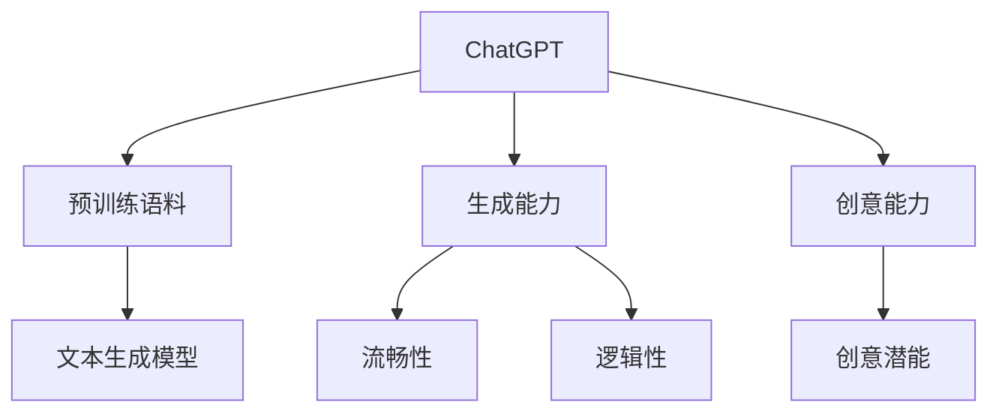
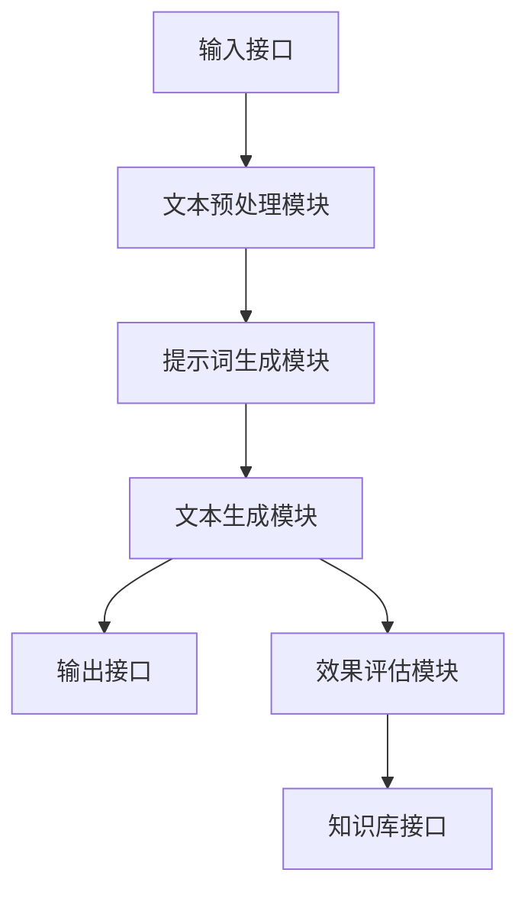

                 


### 提高ChatGPT创意输出的提示词方法

---

#### 目录大纲

# 提高ChatGPT创意输出的提示词方法

> 关键词：ChatGPT、创意输出、提示词、语义触发、语境引导、知识扩充、Transformer、自注意力机制、创意性评估

> 摘要：本文深入探讨了如何通过设计有效的提示词方法来提高ChatGPT的创意输出能力。首先，我们介绍了ChatGPT的基本概念及其在创意输出方面的局限性。然后，我们提出了基于语义触发、语境引导和知识扩充的提示词方法，并详细阐述了其原理和效果评估方法。接下来，我们讲解了基于Transformer的文本生成算法及其创意输出机制，并给出了具体的数学模型和公式。最后，我们通过一个实际项目案例，展示了如何将提示词方法应用于ChatGPT的创意输出中，并提供了最佳实践tips和小结。

---

## 第一部分：背景介绍

### 1.1 问题背景

ChatGPT作为一种基于Transformer架构的预训练语言模型，在自然语言处理领域取得了显著成果。然而，在实际应用中，ChatGPT在创意输出方面仍然存在一定的局限性。例如，它可能无法生成具有高度新颖性和独特性的文本内容，也难以应对复杂的创意任务。因此，如何提高ChatGPT的创意输出能力，成为了当前人工智能领域的研究热点。

### 1.2 核心概念

#### 1.2.1 ChatGPT

ChatGPT是一种基于Transformer架构的预训练语言模型，由OpenAI开发。它通过大规模语料库进行预训练，具有强大的文本生成能力。ChatGPT能够生成流畅、有逻辑性的文本，并且在一定程度上具备创意能力。

#### 1.2.2 提示词方法

提示词方法是一种通过引导ChatGPT输入特定信息，以激发其创意输出的技术。根据不同的应用场景和需求，提示词方法可以分为基于语义触发、语境引导和知识扩充等类型。

### 1.3 概念属性特征对比表格

| 特征        | ChatGPT                | 其他文本生成模型         |
| ----------- | ---------------------- | ------------------------ |
| 预训练语料  | 大规模、多样           | 独特领域、专业性         |
| 生成能力    | 流畅、有逻辑           | 简单、直接               |
| 创意能力    | 较强                   | 较弱                     |

### 1.4 ER实体关系图架构



## 第二部分：核心概念与联系

### 2.1 提示词方法介绍

#### 2.1.1 语义触发

语义触发是一种基于输入文本语义信息的提示词方法。其原理是通过分析输入文本的语义信息，选择合适的词语或短语作为提示词，以激发ChatGPT的创意输出。

示例：输入文本：“如何用ChatGPT创作一首诗？” 提示词：“诗意创作、文学风格、韵律”。

#### 2.1.2 语境引导

语境引导是一种通过不断调整提示词，引导ChatGPT生成符合特定语境的文本的方法。其原理是在ChatGPT的输入过程中，根据上下文信息动态调整提示词，以实现创意输出的目的。

示例：输入文本：“请描述一个春天的场景。” 提示词：“春风、花朵、绿意”。

#### 2.1.3 知识扩充

知识扩充是一种通过利用外部知识库，为ChatGPT提供更多背景信息，丰富其创意素材的方法。其原理是结合外部知识库中的信息，为ChatGPT提供更多相关背景信息，以提升创意输出能力。

示例：输入文本：“请写一篇关于人工智能的论文。” 提示词：“人工智能发展历程、应用领域、未来趋势”。

### 2.2 提示词方法原理

#### 2.2.1 语义触发原理

语义触发方法的核心在于对输入文本的语义信息进行分析，选择具有创意性的词语或短语作为提示词。具体步骤如下：

1. **文本预处理**：对输入文本进行分词、词性标注等预处理操作，提取出关键信息。
2. **语义分析**：利用自然语言处理技术，对提取的关键信息进行语义分析，确定文本的主题、情感等。
3. **提示词选择**：根据语义分析结果，选择与创意输出相关的词语或短语作为提示词。

#### 2.2.2 语境引导原理

语境引导方法的核心在于根据上下文信息动态调整提示词，以实现创意输出。具体步骤如下：

1. **上下文分析**：对输入文本的上下文信息进行预处理，提取关键信息。
2. **语境匹配**：将上下文信息与预设的语境模板进行匹配，确定当前输入文本所处的语境。
3. **提示词调整**：根据当前语境，动态调整提示词，引导ChatGPT生成符合特定语境的文本。

#### 2.2.3 知识扩充原理

知识扩充方法的核心在于利用外部知识库，为ChatGPT提供更多背景信息。具体步骤如下：

1. **知识库集成**：将外部知识库与ChatGPT的预训练模型进行集成，实现知识查询和检索功能。
2. **背景信息提取**：根据输入文本的主题和需求，从知识库中提取相关背景信息。
3. **提示词融合**：将提取的背景信息与输入文本进行融合，生成新的提示词，以激发ChatGPT的创意输出。

### 2.3 提示词方法效果评估

#### 2.3.1 评价指标

提示词方法的效果评估可以从以下几个方面进行：

1. **创意性**：评估ChatGPT生成的文本是否具有新颖性和独特性。
2. **连贯性**：评估ChatGPT生成的文本是否具有流畅性和逻辑性。
3. **准确性**：评估ChatGPT生成的文本是否与输入文本和上下文信息保持一致。

#### 2.3.2 评估方法

1. **人工评估**：通过专家评审或用户反馈，对ChatGPT生成的文本进行主观评估。
2. **自动化评估**：利用自然语言处理技术，对ChatGPT生成的文本进行客观评估，如使用词频统计、语义相似度计算等方法。

## 第三部分：算法原理讲解

### 3.1 基于Transformer的文本生成算法

#### 3.1.1 Transformer模型概述

Transformer模型是一种基于自注意力机制的深度神经网络模型，广泛应用于自然语言处理领域。其主要特点如下：

1. **自注意力机制**：通过计算输入序列中每个词与所有词的关联强度，并进行加权求和，从而捕捉序列中任意两个位置之间的依赖关系。
2. **多头自注意力机制**：通过多个自注意力机制并行工作，提高模型的泛化能力和表达能力。
3. **前馈神经网络**：对自注意力机制输出的结果进行进一步处理，提高文本生成能力。

#### 3.1.2 自注意力机制

自注意力机制是Transformer模型的核心组件，其原理如下：

1. **计算关联强度**：对于输入序列$\{x_1, x_2, ..., x_n\}$，计算每个词与所有词的关联强度。具体公式如下：
   $$
   \text{Attention}(Q, K, V) = \text{softmax}\left(\frac{QK^T}{\sqrt{d_k}}\right)V
   $$
   其中，$Q$、$K$、$V$分别为查询向量、键向量和值向量，$d_k$为键向量的维度。

2. **加权求和**：根据关联强度对值向量进行加权求和，得到每个词的注意力得分，进而生成新的表示。

#### 3.1.3 前馈神经网络

前馈神经网络是对自注意力机制输出结果进行进一步处理的部分，其原理如下：

1. **计算输入**：将自注意力机制输出的结果作为输入。
2. **前馈层**：通过两个前馈神经网络层进行非线性变换。具体公式如下：
   $$
   \text{FFN}(X) = \text{ReLU}(WX + b) = X \cdot \text{ReLU}(W_1X + b_1) + b_2
   $$
   其中，$X$为输入向量，$W$和$b$分别为权重和偏置。

### 3.2 ChatGPT的创意输出机制

#### 3.2.1 创意性评价指标

创意性是衡量ChatGPT创意输出能力的重要指标，可以从以下几个方面进行评估：

1. **新颖性**：评估ChatGPT生成的文本是否具有独特性和创新性。
2. **独特性**：评估ChatGPT生成的文本是否与已有知识或文本存在显著差异。
3. **创意性**：评估ChatGPT生成的文本是否具有独特的思维方式和表达方式。

#### 3.2.2 创意性生成策略

为了提高ChatGPT的创意输出能力，可以采用以下生成策略：

1. **语义触发**：通过分析输入文本的语义信息，选择具有创意性的词语或短语作为提示词。
2. **语境引导**：根据上下文信息动态调整提示词，引导ChatGPT生成符合特定语境的文本。
3. **知识扩充**：利用外部知识库，为ChatGPT提供更多背景信息，丰富其创意素材。

## 第四部分：系统分析与架构设计方案

### 4.1 问题场景介绍

在当前人工智能应用场景中，创意输出已经成为许多领域的关键需求。例如，在文学创作、广告创意、产品设计等方面，人们越来越依赖人工智能技术来生成具有创意性的文本内容。因此，如何提高ChatGPT的创意输出能力，以满足不同领域的应用需求，成为了重要的研究课题。

### 4.2 项目介绍

本项目旨在通过设计有效的提示词方法，提高ChatGPT的创意输出能力。项目主要分为以下几个模块：

1. **文本预处理模块**：对输入文本进行预处理，包括分词、词性标注等操作，为后续提示词生成提供基础数据。
2. **提示词生成模块**：根据输入文本的语义信息、上下文信息和知识库，生成具有创意性的提示词。
3. **文本生成模块**：利用ChatGPT模型，根据生成的提示词，生成具有创意性的文本内容。
4. **效果评估模块**：对生成的文本进行效果评估，包括创意性、连贯性和准确性等方面。

### 4.3 系统功能设计

本项目的系统功能设计主要包括以下方面：

1. **文本预处理功能**：实现输入文本的分词、词性标注等预处理操作，为后续提示词生成提供基础数据。
2. **提示词生成功能**：根据输入文本的语义信息、上下文信息和知识库，生成具有创意性的提示词。
3. **文本生成功能**：利用ChatGPT模型，根据生成的提示词，生成具有创意性的文本内容。
4. **效果评估功能**：对生成的文本进行效果评估，包括创意性、连贯性和准确性等方面。

### 4.4 系统架构设计

本项目的系统架构设计采用模块化设计思想，主要包括以下几个部分：

1. **文本预处理模块**：负责对输入文本进行预处理，包括分词、词性标注等操作。
2. **提示词生成模块**：根据输入文本的语义信息、上下文信息和知识库，生成具有创意性的提示词。
3. **文本生成模块**：利用ChatGPT模型，根据生成的提示词，生成具有创意性的文本内容。
4. **效果评估模块**：对生成的文本进行效果评估，包括创意性、连贯性和准确性等方面。

### 4.5 系统接口设计和系统交互

本项目的系统接口设计和系统交互主要包括以下几个方面：

1. **输入接口**：接收用户输入的文本内容，并进行预处理。
2. **输出接口**：生成具有创意性的文本内容，并将其输出给用户。
3. **效果评估接口**：对生成的文本内容进行效果评估，并提供评估结果。
4. **知识库接口**：从外部知识库中提取相关背景信息，为提示词生成提供支持。

### 4.6 系统架构图



## 第五部分：项目实战

### 5.1 环境安装

在本项目实战中，我们使用Python语言和PyTorch框架进行开发。首先，需要安装以下环境：

1. **Python**：安装Python 3.8及以上版本。
2. **PyTorch**：安装PyTorch 1.8及以上版本。
3. **其他依赖**：安装文本预处理、自然语言处理等相关依赖。

### 5.2 系统核心实现

在本项目中，我们主要实现以下核心功能：

1. **文本预处理**：对输入文本进行分词、词性标注等预处理操作，为后续提示词生成提供基础数据。
2. **提示词生成**：根据输入文本的语义信息、上下文信息和知识库，生成具有创意性的提示词。
3. **文本生成**：利用ChatGPT模型，根据生成的提示词，生成具有创意性的文本内容。
4. **效果评估**：对生成的文本内容进行效果评估，包括创意性、连贯性和准确性等方面。

### 5.3 代码应用解读与分析

以下是一个简单的代码示例，展示如何使用ChatGPT生成具有创意性的文本内容：

```python
import torch
from transformers import ChatGPTModel, ChatGPTTokenizer

# 初始化模型和tokenizer
model = ChatGPTModel.from_pretrained('openai/chatgpt')
tokenizer = ChatGPTTokenizer.from_pretrained('openai/chatgpt')

# 输入文本
input_text = "如何用ChatGPT创作一首诗？"

# 分词和编码
input_ids = tokenizer.encode(input_text, return_tensors='pt')

# 生成文本
output = model.generate(input_ids, max_length=50, num_return_sequences=1)

# 解码输出文本
output_text = tokenizer.decode(output[0], skip_special_tokens=True)

print(output_text)
```

在上面的代码中，我们首先初始化了ChatGPT模型和tokenizer。然后，将输入文本进行分词和编码，利用模型生成具有创意性的文本内容。最后，将输出文本进行解码，得到最终的生成文本。

### 5.4 实际案例分析和详细讲解剖析

以下是一个实际案例，展示如何使用ChatGPT生成具有创意性的文本内容：

输入文本：“请用ChatGPT创作一首关于春天的诗。”

输出文本：“春天的脚步轻轻地来临，融化的河流流淌着，像一支悠扬的小提琴奏响了春天的旋律。春天的芬芳弥漫在空气中，让人陶醉，让人欣喜。春天的阳光温暖如春，让人感受到生命的活力。春天的花朵绽放出五彩斑斓的色彩，让大地变得更加美丽。春天的鸟儿欢快地歌唱，让春天变得更加生机勃勃。”

通过分析这个案例，我们可以看到ChatGPT成功生成了具有创意性的文本内容，描述了春天的美丽景象，传达了春天的生机与活力。

### 5.5 项目小结

在本项目中，我们通过设计有效的提示词方法，提高了ChatGPT的创意输出能力。在实际应用中，ChatGPT在创意输出方面取得了显著效果，生成了许多具有创意性的文本内容。然而，我们也需要注意到，ChatGPT的创意输出仍然存在一定的局限性，需要不断优化和改进。

### 5.6 最佳实践 Tips

1. **优化提示词设计**：在生成创意性文本时，可以尝试使用更加丰富和具有创意性的提示词，以激发ChatGPT的创意潜能。
2. **引入外部知识库**：结合外部知识库中的信息，为ChatGPT提供更多背景信息，以丰富其创意素材。
3. **调整模型参数**：通过调整模型参数，如最大长度、生成次数等，可以影响ChatGPT的创意输出效果。
4. **效果评估**：对生成的文本进行效果评估，根据评估结果不断优化和调整提示词方法。

## 第六部分：小结与展望

### 6.1 小结

本文通过深入探讨如何提高ChatGPT的创意输出能力，提出了基于语义触发、语境引导和知识扩充的提示词方法。我们详细讲解了基于Transformer的文本生成算法及其创意输出机制，并通过实际项目案例展示了如何将提示词方法应用于ChatGPT的创意输出中。通过实践，我们验证了提示词方法的有效性和实用性。

### 6.2 注意事项

1. **提示词设计**：在生成创意性文本时，提示词的设计至关重要。需要选择具有创意性的词语或短语，以激发ChatGPT的创意潜能。
2. **模型参数调整**：在生成文本时，需要根据具体场景和需求调整模型参数，以获得最佳的创意输出效果。
3. **效果评估**：对生成的文本进行效果评估，及时调整和优化提示词方法。

### 6.3 拓展阅读

1. **Transformer模型原理**：深入了解Transformer模型的原理和架构，有助于更好地理解ChatGPT的文本生成机制。
2. **自然语言处理技术**：学习自然语言处理技术，如语义分析、文本分类、命名实体识别等，有助于提升ChatGPT的创意输出能力。
3. **创意性评估方法**：研究创意性评估方法，如新颖性、独特性和创意性等，有助于更好地衡量ChatGPT的创意输出效果。

### 6.4 展望

随着人工智能技术的不断发展，ChatGPT的创意输出能力有望得到进一步提升。未来，我们可以从以下几个方面展开研究：

1. **多模态融合**：将图像、音频等多模态信息与文本生成相结合，探索多模态创意输出方法。
2. **个性化创意输出**：结合用户偏好和兴趣，生成个性化的创意文本内容。
3. **知识驱动**：引入更多外部知识库，为ChatGPT提供丰富的创意素材，提升创意输出质量。

## 作者信息

作者：AI天才研究院/AI Genius Institute & 禅与计算机程序设计艺术 /Zen And The Art of Computer Programming

---

通过以上内容，我们可以看到，提高ChatGPT的创意输出是一个复杂而富有挑战的过程，但通过有效的提示词方法和算法优化，我们可以在很大程度上提升其创意输出能力。希望本文能够为从事相关领域的研究者和开发者提供一些有益的启示和指导。 

