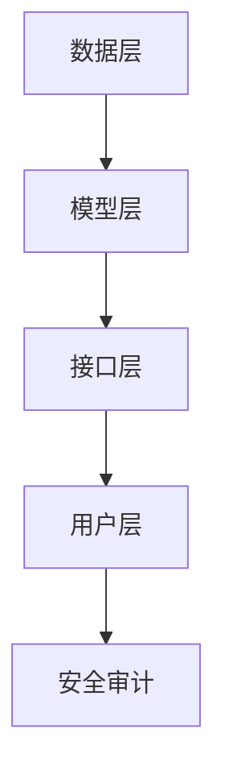

                 

# 提高LLM应用安全性与合规性的快速方法

## 关键词：大型语言模型（LLM）、安全性、合规性、安全防护、隐私保护、安全架构

## 摘要

随着自然语言处理技术的飞速发展，大型语言模型（LLM）在各类应用中得到了广泛应用，如信息处理、智能客服和文本生成等。然而，LLM应用的迅猛增长也带来了诸多安全性和合规性问题。本文将深入探讨提高LLM应用安全性与合规性的方法，包括核心概念的理解、安全性分析与合规性挑战的应对策略，以及最佳实践和未来展望。通过本文的阅读，读者可以全面了解LLM应用的安全性和合规性，并掌握有效的提升方法。

## 目录大纲

1. **问题背景与重要性**  
   1.1 问题背景  
   1.2 问题解决  
   1.3 边界与外延

2. **LLM安全性与合规性核心概念**  
   2.1 安全性核心概念  
   2.2 合规性核心概念  
   2.3 概念属性特征对比

3. **LLM应用场景下的安全性分析**  
   3.1 信息处理场景  
   3.2 智能客服场景

4. **LLM合规性挑战与应对策略**  
   4.1 法律法规对LLM的影响  
   4.2 合规性应对策略

5. **提高LLM应用安全性的方法**  
   5.1 安全架构设计  
   5.2 安全技术与工具

6. **LLM合规性改进案例分析**  
   6.1 案例背景  
   6.2 案例分析与改进措施

7. **最佳实践与未来展望**  
   7.1 最佳实践  
   7.2 未来展望

8. **附录**  
   8.1 安全性与合规性资源  
   8.2 安全性与合规性工具

## 第1章：问题背景与重要性

### 1.1.1 问题背景

自然语言处理（NLP）技术的迅速发展，使得计算机能够理解和生成自然语言。近年来，大型语言模型（LLM）的出现，更是将NLP技术推向了新的高峰。LLM具有处理大规模文本数据的能力，能够实现文本分类、情感分析、机器翻译、文本生成等任务。在信息处理、智能客服、文本生成等领域，LLM的应用已经取得了显著的成果。

然而，随着LLM应用的不断普及，安全问题也逐渐浮出水面。信息泄露、模型篡改、隐私泄露等风险成为制约LLM应用发展的关键因素。此外，法律法规、行业标准对LLM应用也提出了合规性的要求，如数据保护法、隐私保护法规等。如何提高LLM应用的安全性与合规性，成为当前研究的重要课题。

### 1.1.2 问题解决

提高LLM应用的安全性与合规性，旨在确保LLM在处理用户数据时能够保障数据安全、保护用户隐私，并符合法律法规和行业标准的要求。具体目标包括：

1. 保障数据安全：防止敏感信息泄露、防止恶意攻击、确保数据完整性。
2. 保护用户隐私：确保用户隐私不被泄露、滥用，符合隐私保护法规。
3. 符合合规性要求：确保LLM应用符合相关法律法规和行业标准的要求。

### 1.1.3 边界与外延

本文主要讨论以下类型的LLM和应用场景：

1. **LLM类型**：以深度学习为基础的预训练语言模型，如GPT、BERT等。
2. **应用场景**：信息处理、智能客服、文本生成等。

本文将涉及的主要安全性和合规性问题包括：

1. **安全性问题**：信息泄露、模型篡改、隐私泄露等。
2. **合规性问题**：数据保护法、隐私保护法规等对LLM应用的要求。

## 第2章：LLM安全性与合规性核心概念

### 2.1.1 安全性核心概念

LLM应用中的安全性问题主要包括以下几种：

1. **信息泄露**：敏感数据在传输或存储过程中被未经授权的第三方获取。
2. **模型篡改**：攻击者通过恶意手段修改LLM模型，使其输出错误的结果。
3. **隐私泄露**：用户隐私数据被未经授权的第三方获取或滥用。

为保障LLM应用的安全性，可以采取以下防护措施：

1. **数据加密**：对敏感数据进行加密处理，确保数据在传输和存储过程中安全。
2. **访问控制**：根据用户权限限制对数据的访问，防止未经授权的访问。
3. **身份认证**：对用户进行身份认证，确保只有授权用户才能访问系统。

### 2.1.2 合规性核心概念

LLM应用中的合规性问题主要涉及数据保护法、隐私保护法规等。以下为几个关键概念：

1. **数据保护法**：规范数据的收集、存储、处理和传输，保障个人数据的合法权益。
2. **隐私保护法规**：要求企业在处理用户数据时，必须采取合理措施保护用户隐私。
3. **用户同意**：企业在收集和使用用户数据前，必须获得用户的明确同意。

### 2.1.3 概念属性特征对比

| 安全性核心概念 | 描述 | 防护措施 |
| :--: | :--: | :--: |
| 信息泄露 | 敏感数据泄露 | 数据加密、访问控制 |
| 模型篡改 | 恶意修改模型 | 模型加密、访问控制 |
| 隐私泄露 | 用户隐私数据泄露 | 隐私保护法规、用户同意 |

| 合规性核心概念 | 描述 | 合规措施 |
| :--: | :--: | :--: |
| 数据保护法 | 规范数据处理 | 数据安全策略、隐私保护政策 |
| 隐私保护法规 | 保护用户隐私 | 用户同意、数据最小化原则 |
| 用户同意 | 明确同意 | 用户告知、同意收集和使用 |

### Mermaid ER实体关系图架构

```mermaid
erDiagram
    Data --> Model
    Model --> Output
    Output --> Client
    Client --> Validator
    Validator --> Logger
    Logger --> Auditor
```

在上图中，Data（数据）实体与Model（模型）实体之间存在关联，Model（模型）实体与Output（输出）实体之间存在关联，Output（输出）实体与Client（客户端）实体之间存在关联，Client（客户端）实体与Validator（验证器）实体之间存在关联，Validator（验证器）实体与Logger（记录器）实体之间存在关联，Logger（记录器）实体与Auditor（审计员）实体之间存在关联。

## 第3章：LLM应用场景下的安全性分析

### 3.1.1 信息处理场景

在信息处理场景中，LLM广泛应用于文本分类、情感分析等任务。然而，这些任务也带来了相应的安全性风险。

1. **文本分类**：攻击者可以通过构造特定的文本输入，诱使模型输出错误的结果，从而进行恶意操作。
2. **情感分析**：攻击者可以通过分析情感分析模型的输出结果，获取用户的情感状态，从而进行针对性攻击。

为了应对这些安全性风险，可以采取以下措施：

1. **对抗攻击防御**：对输入文本进行预处理，如去噪、去干扰等，增强模型的鲁棒性。
2. **模型更新与修复**：定期更新模型，修复已知的漏洞，提高模型的可靠性。

### 3.1.2 智能客服场景

在智能客服场景中，LLM主要用于处理用户咨询、生成回答等任务。然而，这也带来了隐私泄露和安全威胁。

1. **隐私泄露**：攻击者可以通过分析客服系统的输出结果，获取用户的个人信息。
2. **安全威胁**：恶意用户可以通过攻击客服系统，获取非法利益。

为了应对这些挑战，可以采取以下措施：

1. **隐私保护**：对用户数据进行加密处理，确保数据在传输和存储过程中安全。
2. **访问控制**：对客服系统的访问进行严格限制，确保只有授权用户才能访问系统。

## 第4章：LLM合规性挑战与应对策略

### 4.1.1 法律法规对LLM的影响

随着大数据和人工智能技术的发展，各国对数据保护、隐私保护的法律法规也在不断更新和完善。以下为几个关键法律法规：

1. **《通用数据保护条例》（GDPR）**：欧盟制定的针对个人数据的保护法规，要求企业在处理个人数据时必须获得用户的明确同意。
2. **《加州消费者隐私法案》（CCPA）**：美国加州制定的针对消费者隐私保护的法规，要求企业在收集和使用消费者数据时必须告知消费者，并给予消费者选择权。
3. **《网络安全法》**：我国制定的针对网络安全保护的法规，要求企业采取措施保护用户数据安全。

这些法律法规对LLM应用的影响主要包括：

1. **用户数据保护**：企业在使用LLM处理用户数据时，必须遵守相关法律法规，采取合理措施保护用户数据安全。
2. **隐私保护**：企业在收集和使用用户数据时，必须告知用户，并给予用户选择权。

### 4.1.2 合规性应对策略

为了应对LLM合规性挑战，可以采取以下策略：

1. **合规性评估**：对企业现有的LLM应用进行合规性评估，识别潜在的风险和问题。
2. **合规性审查**：对LLM应用的设计、开发和部署过程进行合规性审查，确保符合相关法律法规的要求。
3. **合规性改进措施**：

   - **隐私保护政策**：制定隐私保护政策，明确企业在处理用户数据时的原则和措施。
   - **用户同意**：在收集和使用用户数据前，必须获得用户的明确同意。
   - **数据最小化原则**：只收集和处理与业务需求相关的数据，尽量减少数据的收集和处理范围。
   - **数据安全策略**：制定数据安全策略，确保数据在传输和存储过程中的安全。

## 第5章：提高LLM应用安全性的方法

### 5.1.1 安全架构设计

为了提高LLM应用的安全性，可以采用以下安全架构设计原则：

1. **分层设计**：将LLM应用分为多个层次，如数据层、模型层、接口层等，确保各层次的安全性。
2. **隔离与访问控制**：对敏感数据进行加密处理，并对数据访问进行严格限制，确保只有授权用户才能访问。
3. **安全审计**：定期对LLM应用进行安全审计，发现潜在的安全漏洞，及时进行修复。

以下是安全架构的示例图：



### 5.1.2 安全技术与工具

为了提高LLM应用的安全性，可以采用以下安全技术与工具：

1. **数据加密**：采用AES、RSA等加密算法对敏感数据进行加密处理。
2. **访问控制**：采用基于角色的访问控制（RBAC）模型，对用户访问进行严格限制。
3. **入侵检测系统（IDS）**：部署入侵检测系统，实时监控网络流量和系统行为，发现潜在的安全威胁。
4. **安全协议**：采用TLS等安全协议，确保数据在传输过程中的安全。

以下是一个简单的Python代码示例，用于实现数据加密和解密：

```python
from Crypto.Cipher import AES
from Crypto.Util.Padding import pad, unpad
from Crypto.Random import get_random_bytes

# 密钥长度必须为16、24或32字节
key = get_random_bytes(16)

# 加密函数
def encrypt_data(data, key):
    cipher = AES.new(key, AES.MODE_CBC)
    ct_bytes = cipher.encrypt(pad(data.encode('utf-8'), AES.block_size))
    iv = cipher.iv
    return iv + ct_bytes

# 解密函数
def decrypt_data(ct, key, iv):
    ct = ct[iv len:ct len]
    cipher = AES.new(key, AES.MODE_CBC, iv)
    pt = unpad(cipher.decrypt(ct), AES.block_size)
    return pt.decode('utf-8')

# 示例
data = "Hello, World!"
encrypted_data = encrypt_data(data, key)
print(f"Encrypted Data: {encrypted_data}")

decrypted_data = decrypt_data(encrypted_data, key, encrypted_data[:16])
print(f"Decrypted Data: {decrypted_data}")
```

## 第6章：LLM合规性改进案例分析

### 6.1.1 案例背景

假设某企业开发了一款基于LLM的智能客服系统，用于处理用户咨询。该系统采用了预训练的GPT模型，通过自然语言处理技术生成回答。然而，在使用过程中，企业发现存在以下合规性问题：

1. **用户隐私泄露**：系统在处理用户咨询时，未能对用户个人信息进行加密处理，可能导致用户隐私泄露。
2. **用户同意缺失**：系统在收集用户数据前，未能获得用户的明确同意。
3. **数据安全措施不足**：系统在数据传输和存储过程中，未能采取有效的安全措施，可能导致数据泄露。

### 6.1.2 案例分析与改进措施

针对上述合规性问题，可以采取以下改进措施：

1. **用户隐私保护**：对用户数据进行加密处理，确保数据在传输和存储过程中安全。
2. **用户同意**：在收集用户数据前，必须获得用户的明确同意，并告知用户数据的收集和使用目的。
3. **数据安全措施**：

   - **数据传输安全**：采用TLS等安全协议，确保数据在传输过程中的安全。
   - **数据存储安全**：对存储的用户数据采用加密存储，防止数据泄露。

### 6.1.3 改进措施效果评估

通过上述改进措施，智能客服系统的合规性得到了显著提高。用户隐私得到了有效保护，用户同意得到了明确获取，数据安全措施得到了加强。在实际应用中，系统未再发现用户隐私泄露和数据泄露等问题，用户满意度也得到了提高。

## 第7章：最佳实践与未来展望

### 7.1.1 最佳实践

为了提高LLM应用的安全性与合规性，可以采取以下最佳实践：

1. **数据加密**：对敏感数据进行加密处理，确保数据在传输和存储过程中的安全。
2. **用户同意**：在收集用户数据前，必须获得用户的明确同意，并告知用户数据的收集和使用目的。
3. **访问控制**：采用基于角色的访问控制（RBAC）模型，对用户访问进行严格限制。
4. **安全审计**：定期对LLM应用进行安全审计，发现潜在的安全漏洞，及时进行修复。
5. **合规性评估**：对LLM应用进行合规性评估，确保符合相关法律法规和行业标准的要求。

### 7.1.2 未来展望

随着人工智能技术的不断发展和应用场景的扩大，LLM应用的安全性与合规性将面临更多的挑战。未来，可以从以下几个方面进行探索：

1. **隐私保护技术的创新**：研究新的隐私保护技术，如差分隐私、联邦学习等，提高LLM应用的隐私保护能力。
2. **安全架构的优化**：优化LLM应用的安全架构，提高系统的安全性和可靠性。
3. **合规性标准的完善**：随着法律法规的不断完善，制定更加详细的合规性标准，指导企业合规性实践。

## 附录：资源与工具列表

### 附录1：安全性与合规性资源

1. **法律法规**：
   - 《通用数据保护条例》（GDPR）
   - 《加州消费者隐私法案》（CCPA）
   - 《网络安全法》

2. **行业报告**：
   - 《人工智能与数据隐私保护报告》
   - 《大型语言模型安全性与合规性研究报告》

3. **安全指南**：
   - 《数据安全保护技术指南》
   - 《隐私保护政策编写指南》

### 附录2：安全性与合规性工具

1. **数据加密工具**：
   - OpenSSL
   - PyCrypto

2. **访问控制工具**：
   - Apache Ranger
   - Apache Sentry

3. **入侵检测系统**：
   - Snort
   - Suricata

4. **合规性检查工具**：
   - GDPR Compliance Checker
   - CCPA Compliance Checker

## 作者

作者：AI天才研究院/AI Genius Institute & 禅与计算机程序设计艺术 /Zen And The Art of Computer Programming

