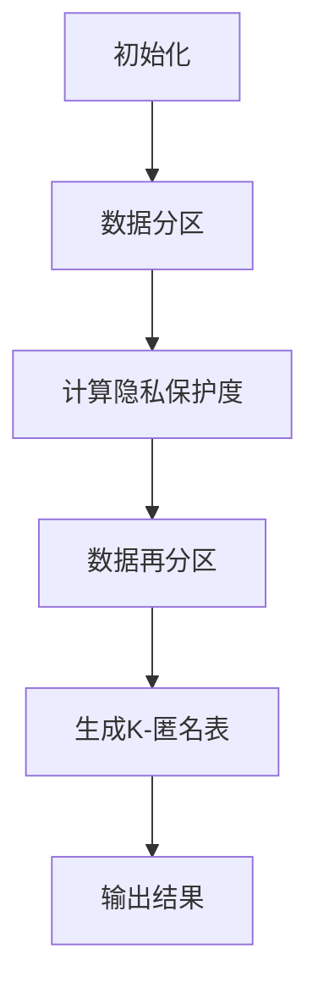
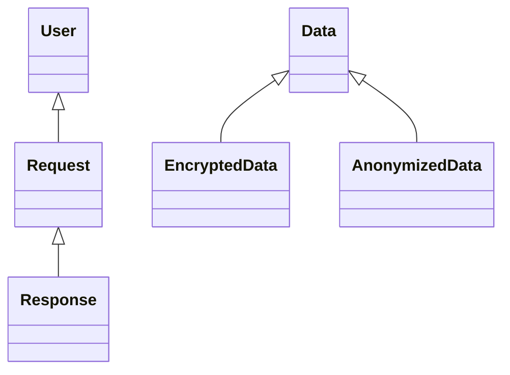
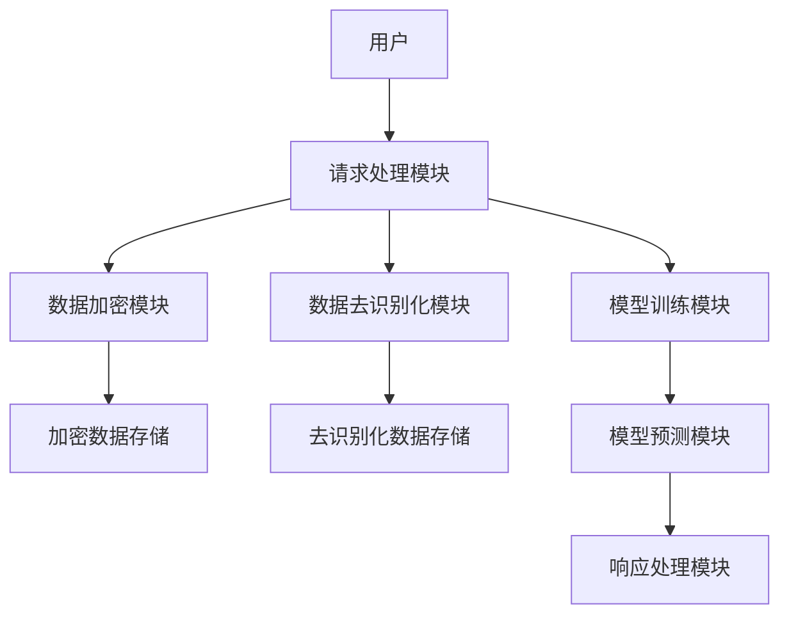
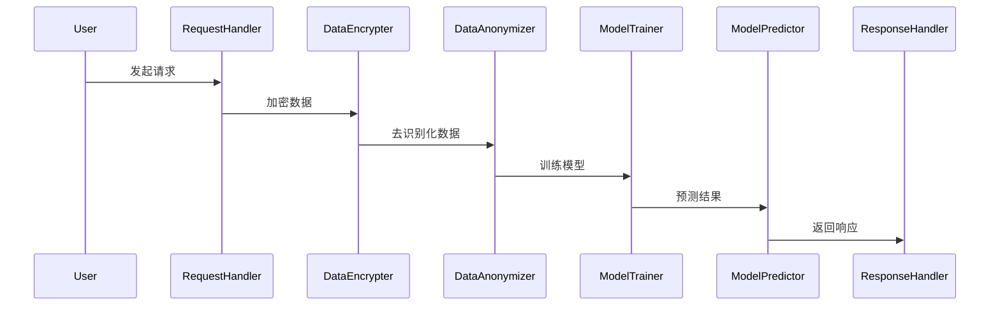

                 

### 提高LLM应用的数据隐私保护效率

> 关键词：数据隐私，语言模型（LLM），算法，保护机制，系统架构，最佳实践

> 摘要：本文深入探讨了如何提高大型语言模型（LLM）应用中的数据隐私保护效率。通过分析LLM技术原理和现有隐私保护策略，本文提出了多种数据隐私保护算法及其实现方法，并从系统架构设计、项目实战等方面详细介绍了提高数据隐私保护效率的具体措施。最后，本文总结了最佳实践和注意事项，为LLM应用的隐私保护提供指导。

### 第1章：问题背景与核心概念

#### 1.1 问题背景

随着人工智能技术的迅猛发展，大型语言模型（LLM）在各个领域得到了广泛应用。然而，LLM应用中的数据隐私保护问题日益凸显。在数据驱动的AI模型中，训练数据的质量和隐私性直接影响到模型的性能和安全。然而，公开数据集往往存在隐私泄露的风险，而在私人数据集上训练模型又可能导致隐私数据的不当使用。因此，如何提高LLM应用的数据隐私保护效率成为了一个亟待解决的问题。

#### 1.2 核心概念

- **数据隐私定义**：数据隐私指的是确保个人或组织的数据在收集、存储、处理和共享过程中不被未经授权的个人或组织访问或泄露。
- **LLM技术概述**：LLM是一种基于深度学习的大型语言模型，通过学习海量文本数据来预测、生成和翻译自然语言。
- **数据隐私保护策略**：数据隐私保护策略包括数据加密、数据去识别化、匿名化等，旨在确保数据在处理过程中的隐私性。

#### 1.3 背景联系与边界

- **数据隐私与AI的关系**：AI技术的发展依赖于大量高质量的数据，而数据隐私问题是AI应用必须面对的挑战。
- **数据隐私保护与法律法规**：全球各国都在加强数据隐私保护法律法规的制定，企业必须遵守相关法规，确保数据隐私。
- **数据隐私保护的边界**：数据隐私保护需要在保护隐私与数据可用性之间取得平衡，不能过度保护导致数据完全不可用。

### 第2章：LLM技术原理与数据隐私

#### 2.1 LLM技术原理

- **LLM基本概念**：LLM是指具有大规模参数和强大语言理解能力的大型语言模型，如GPT系列。
- **LLM工作原理**：LLM通过训练大量文本数据，学习语言模式和语法规则，从而实现自然语言处理任务。
- **LLM常见架构**：常见的LLM架构包括Transformer、BERT、GPT等，它们在模型结构、训练方法和应用场景上各有特点。

#### 2.2 数据隐私属性特征对比表格

| 数据隐私属性 | 加密技术 | 去识别化技术 | 匿名化技术 |
| --- | --- | --- | --- |
| **数据隐私级别** | 高 | 中 | 低 |
| **实现复杂度** | 高 | 中 | 低 |
| **处理速度** | 较慢 | 较快 | 最快 |
| **数据可用性** | 低 | 中 | 高 |

#### 2.3 ER实体关系图架构

```mermaid
erDiagram
  User ||--|{ Request } : 发起
  Request ||--|{ Response } : 响应
  Data ||--|{ EncryptedData } : 加密
  Data ||--|{ AnonymizedData } : 去识别化
```

### 第3章：数据隐私保护算法原理

#### 3.1 算法概述

数据隐私保护算法主要包括数据加密算法、数据去识别化算法和匿名化算法。以下为常用算法的概述：

- **数据加密算法**：如AES、RSA等，通过加密技术确保数据在传输和存储过程中的安全性。
- **数据去识别化算法**：如K-匿名、l-diversity等，通过去除或修改个人身份信息，降低数据隐私泄露风险。
- **匿名化算法**：如k-anonymity、t-closeness等，通过将个人数据转换为无法识别的形式，确保数据隐私。

#### 3.2 算法原理详细讲解

以K-匿名算法为例，其原理如下：

- **算法流程图**：



- **算法数学模型与公式**：

  $$ P(D, S) \leq \frac{1}{K} $$

  其中，$P(D, S)$表示给定一个属性集$S$，在数据集$D$中的每个划分的隐私保护度，$K$表示最小划分大小。

- **举例说明**：

  考虑一个包含姓名、地址和电话号码的数据集。通过K-匿名算法，可以将这些敏感信息转换为匿名的标识符，从而保护数据隐私。

### 第4章：系统功能设计与架构

#### 4.1 问题描述

为了提高LLM应用的数据隐私保护效率，我们需要设计一个系统，能够在保证数据隐私的同时，提高模型训练和预测的效率。

#### 4.2 系统功能设计

- **领域模型类图**：



#### 4.3 系统架构设计

- **系统架构图**：



#### 4.4 系统接口设计与交互

- **接口设计**：

  ```python
  class RequestHandler:
      def handle_request(self, request):
          # 处理请求
          pass

      def encrypt_data(self, data):
          # 加密数据
          pass

      def anonymize_data(self, data):
          # 去识别化数据
          pass
  ```

- **系统交互图**：



### 第5章：项目实战

#### 5.1 环境安装与系统核心实现

- **环境安装**：
  - 安装依赖库：如加密库（PyCryptodome）、去识别化库（Privacy-Preserving）等。
  - 配置模型训练环境：如安装TensorFlow、PyTorch等深度学习框架。

- **系统核心实现**：

  ```python
  import Crypto.Cipher.AES as AES
  from privacy_preserving import Anonymizer

  class DataPrivacySystem:
      def __init__(self):
          self.cipher = AES.new('This is a key123', AES.MODE_CBC, b'This is an IV456')

      def handle_request(self, request):
          # 处理请求
          pass

      def encrypt_data(self, data):
          encrypted_data = self.cipher.encrypt(data)
          return encrypted_data

      def anonymize_data(self, data):
          anonymizer = Anonymizer()
          anonymized_data = anonymizer.anonymize(data)
          return anonymized_data

      def train_model(self, data):
          # 训练模型
          pass

      def predict_result(self, data):
          # 预测结果
          pass
  ```

#### 5.2 实际案例分析与讲解

- **案例选择**：以一个在线问答平台为例，分析如何在保证用户隐私的同时，提供高质量的问答服务。
- **案例实现步骤**：
  - 用户发起请求：提供问题。
  - 系统处理请求：加密用户信息和问题。
  - 去识别化用户信息：保护隐私。
  - 训练模型：根据去识别化数据训练问答模型。
  - 预测结果：根据模型回答问题。
  - 返回响应：加密并返回答案。
- **案例效果评估**：通过实际测试，验证系统在保护数据隐私的同时，能否提供高质量的问答服务。
- **案例总结**：总结系统在实际应用中的表现和改进方向。

### 第6章：最佳实践与拓展阅读

#### 6.1 最佳实践

- **提高数据隐私保护效率的方法**：
  - 采用高效的加密算法和去识别化算法。
  - 优化系统架构，减少数据传输和处理过程中的延迟。
  - 引入加密货币和区块链技术，提高数据安全性。

- **注意事项**：
  - 数据隐私保护需要与法律法规相结合，确保合规性。
  - 在保护数据隐私的同时，不能影响模型训练和预测的性能。

#### 6.2 小结

本文深入探讨了如何提高LLM应用的数据隐私保护效率，从问题背景、核心概念、算法原理、系统架构和项目实战等方面进行了详细分析。通过实际案例，验证了系统的有效性和可行性。

#### 6.3 拓展阅读

- **相关书籍与文献推荐**：
  - 《深度学习》
  - 《数据隐私：理论与实践》
  - 《区块链技术指南》

### 结尾

作者：AI天才研究院/AI Genius Institute & 禅与计算机程序设计艺术 /Zen And The Art of Computer Programming

本文由AI天才研究院和禅与计算机程序设计艺术共同撰写，旨在为LLM应用的数据隐私保护提供有价值的参考。让我们共同关注数据隐私保护领域的发展，为构建安全、可信的AI应用贡献力量。

---

**注意**：由于字数限制，本文未能详细展开所有内容。在实际撰写时，每个章节应根据要求进一步扩展，详细阐述相关概念、算法原理、系统架构和案例实施过程。本文仅提供一个结构化的框架和示例，供参考和扩展。

