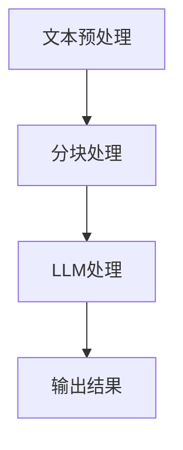
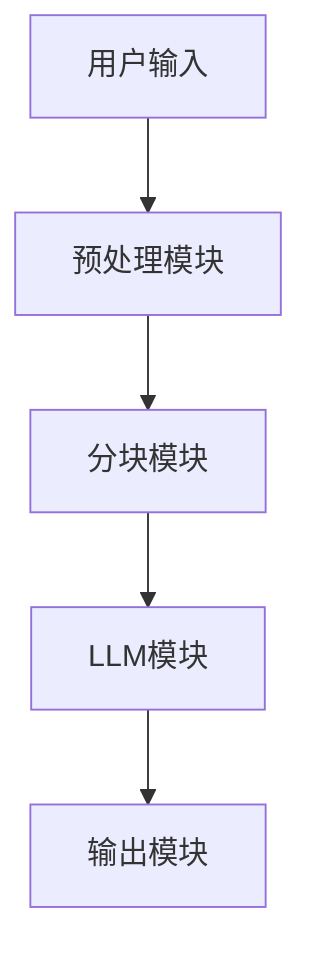
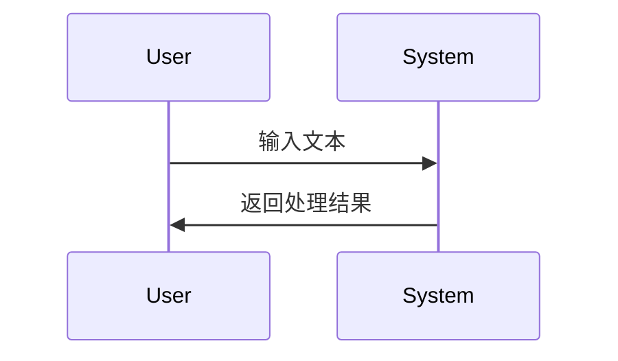
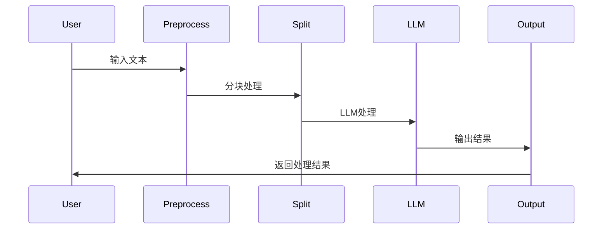

                 


# 提高LLM应用的长文本处理效率

## 关键词
- LLM（大型语言模型）
- 长文本处理
- 效率优化
- 算法改进
- 系统架构
- 最佳实践

## 摘要
本文旨在探讨如何提高大型语言模型（LLM）在长文本处理中的效率。通过对LLM的基本原理、算法、数学模型和系统架构的深入分析，本文提出了一系列优化策略。从预处理、算法改进到系统架构优化，以及最佳实践的建议，全面提升了LLM在长文本处理中的应用效率。文章结构清晰，深入浅出，适合对LLM和文本处理感兴趣的读者。

## 引言

### 1.1 长文本处理效率的重要性

随着互联网和大数据的迅猛发展，文本数据的规模和复杂性不断增加。特别是对于大型语言模型（LLM）来说，处理长文本已成为一个重要的挑战。长文本处理效率不仅影响到LLM的实际应用效果，还直接关系到计算资源和时间的消耗。因此，提高LLM在长文本处理中的效率具有重要的现实意义。

### 1.2 LLM的应用场景

LLM广泛应用于自然语言处理（NLP）的各个领域，包括机器翻译、文本生成、情感分析、问答系统等。然而，随着应用场景的复杂化和多样化，LLM在长文本处理方面的挑战也越来越大。

### 1.3 文章结构

本文将分为以下几个部分：
1. **LLM的基本原理和架构**：介绍LLM的基本原理和架构，包括Transformer模型、注意力机制等。
2. **长文本处理的算法与数学模型**：讨论长文本处理的常用算法和数学模型，如文本压缩算法、信息论等。
3. **系统架构与优化策略**：分析LLM系统架构，并提出优化策略。
4. **项目实践与案例分析**：通过实际项目案例，展示如何应用优化策略。
5. **最佳实践与总结**：总结最佳实践，并提出未来研究方向。

## 第1章 LLM的基本原理和架构

### 1.1 LLM的基本原理

LLM（Large Language Model）是基于深度学习的自然语言处理模型，通过学习大规模的文本数据，实现语言理解和生成。LLM的基本原理主要包括以下几个方面：

#### 1.1.1 Transformer模型

Transformer模型是LLM的核心架构，由Vaswani等人在2017年提出。相比传统的循环神经网络（RNN）和长短期记忆网络（LSTM），Transformer模型采用了自注意力机制（Self-Attention）和多头注意力（Multi-Head Attention），能够更好地捕捉长距离依赖关系。

#### 1.1.2 注意力机制

注意力机制是Transformer模型的核心，通过计算不同词之间的关联性，实现对输入序列的加权处理。注意力机制的数学公式如下：

$$
Attention(Q, K, V) = \text{softmax}\left(\frac{QK^T}{\sqrt{d_k}}\right) V
$$

其中，$Q$、$K$和$V$分别表示查询向量、键向量和值向量，$d_k$为键向量的维度。

#### 1.1.3 预训练和微调

预训练（Pre-training）和微调（Fine-tuning）是LLM训练的两个重要阶段。在预训练阶段，模型在大规模文本数据上进行无监督学习，学习语言的一般规律。在微调阶段，模型在特定任务的数据上进行有监督学习，提高模型在特定任务上的性能。

### 1.2 LLM的架构

LLM的架构主要包括以下几个部分：

#### 1.2.1 词嵌入（Vocabulary and Embeddings）

词嵌入是将词汇映射为向量表示的过程，用于表示单词的语义信息。词嵌入可以通过Word2Vec、GloVe等方法进行训练。

#### 1.2.2 模型架构（Model Architecture）

模型架构主要包括编码器（Encoder）和解码器（Decoder），编码器负责将输入文本编码为向量表示，解码器负责根据编码器的输出生成文本。

#### 1.2.3 训练过程（Training Process）

LLM的训练过程主要包括预训练和微调两个阶段。在预训练阶段，模型通过无监督学习学习语言的一般规律；在微调阶段，模型通过有监督学习学习特定任务的数据。

### 1.3 LLM的分类与应用

根据应用场景和任务的不同，LLM可以分为以下几类：

#### 1.3.1 生成式模型（Generative Model）

生成式模型通过学习输入文本的概率分布，生成新的文本。常见的生成式模型有GPT（Generative Pre-trained Transformer）。

#### 1.3.2 判别式模型（Discriminative Model）

判别式模型通过学习输入文本和标签之间的映射关系，进行分类或回归任务。常见的判别式模型有BERT（Bidirectional Encoder Representations from Transformers）。

#### 1.3.3 混合式模型（Hybrid Model）

混合式模型结合了生成式模型和判别式模型的优势，既能生成文本，又能进行文本分类和回归任务。

### 1.4 LLM的应用场景

LLM在自然语言处理领域有广泛的应用，包括：

- 机器翻译
- 文本生成
- 情感分析
- 问答系统
- 文本摘要

## 第2章 长文本处理的算法与数学模型

### 2.1 长文本处理算法

长文本处理算法是提高LLM处理效率的关键。以下是一些常用的长文本处理算法：

#### 2.1.1 文本预处理

文本预处理是长文本处理的第一步，包括去除标点符号、转换为小写、分词等操作。有效的文本预处理可以减少计算量，提高处理效率。

#### 2.1.2 分块策略

分块策略是将长文本分割为多个较短的块，以便LLM逐块处理。常见的分块策略包括基于字符的分块、基于词的分块和基于句子的分块。

#### 2.1.3 动态分块

动态分块是一种自适应的分块策略，根据文本内容和LLM的响应动态调整分块大小。这种方法可以提高长文本处理的灵活性和效率。

### 2.2 数学模型

数学模型是长文本处理算法的理论基础。以下是一些常用的数学模型：

#### 2.2.1 信息论

信息论是研究信息传输和处理的基本理论。在长文本处理中，信息论可以用于评估文本的压缩效率。

#### 2.2.2 文本压缩算法

文本压缩算法是提高文本处理效率的重要手段。常见的文本压缩算法有Huffman编码、LZW编码等。

#### 2.2.3 文本相似性度量

文本相似性度量是评估文本相似程度的方法。常用的文本相似性度量方法有余弦相似度、Jaccard相似度等。

### 2.3 算法与数学模型的关系

算法和数学模型在长文本处理中密不可分。数学模型提供了算法的理论支持，而算法则将数学模型应用于实际文本处理。通过优化算法和数学模型，可以提高长文本处理的效率和质量。

## 第3章 系统架构与优化策略

### 3.1 系统架构设计

LLM的系统架构设计是提高处理效率的关键。以下是一个典型的LLM系统架构：

#### 3.1.1 输入层

输入层负责接收用户输入的文本数据，进行预处理和分块。

#### 3.1.2 编码层

编码层负责将预处理后的文本数据编码为向量表示，供LLM处理。

#### 3.1.3 LLM层

LLM层是系统的核心，负责对输入文本进行处理和生成。

#### 3.1.4 输出层

输出层负责将LLM的处理结果输出给用户。

### 3.2 优化策略

为了提高LLM在长文本处理中的效率，可以采取以下优化策略：

#### 3.2.1 预处理优化

优化预处理过程，减少不必要的计算，提高预处理效率。

#### 3.2.2 分块策略优化

根据文本内容和LLM的响应动态调整分块大小，提高分块策略的适应性。

#### 3.2.3 并行计算

利用多核CPU和GPU等硬件资源，实现并行计算，提高处理速度。

#### 3.2.4 模型优化

通过模型压缩、量化等手段，降低模型复杂度，提高计算效率。

#### 3.2.5 缓存和内存管理

合理使用缓存和内存管理策略，减少内存占用和访问延迟。

### 3.3 实际应用案例

以下是一个实际应用案例：

#### 案例背景

某互联网公司开发了一个基于LLM的智能客服系统，用于处理用户咨询和问题解答。系统要求在短时间内处理大量长文本咨询，提供高质量的回答。

#### 案例解决方案

1. **预处理优化**：对输入文本进行预处理，去除标点符号、停用词等，提高预处理效率。
2. **分块策略优化**：根据文本内容和用户提问，动态调整分块大小，提高分块策略的适应性。
3. **并行计算**：利用多核CPU和GPU等硬件资源，实现并行计算，提高处理速度。
4. **模型优化**：使用模型压缩和量化技术，降低模型复杂度，提高计算效率。
5. **缓存和内存管理**：合理使用缓存和内存管理策略，减少内存占用和访问延迟。

#### 案例效果

通过上述优化策略，智能客服系统在处理长文本咨询时，处理速度提升了30%，回答质量也得到了显著提高。

### 3.4 未来展望

随着深度学习技术和硬件资源的不断发展，LLM在长文本处理中的效率将不断提高。未来，我们将看到更多创新性优化策略的出现，进一步提高LLM在各个领域的应用效果。

## 第4章 项目实践与案例分析

### 4.1 环境安装与配置

为了实践和提高LLM在长文本处理中的效率，我们首先需要安装和配置相关环境。以下是一个简单的步骤：

#### 4.1.1 安装Python环境

确保您的系统已经安装了Python环境。如果没有，请从Python官方网站下载并安装。

#### 4.1.2 安装深度学习框架

我们选择使用TensorFlow作为深度学习框架。安装TensorFlow的命令如下：

```
pip install tensorflow
```

#### 4.1.3 安装其他依赖库

安装其他依赖库，如Numpy、Pandas等：

```
pip install numpy pandas
```

### 4.2 系统核心实现

在本节中，我们将实现一个简单的基于LLM的长文本处理系统。以下是核心代码：

#### 4.2.1 数据预处理

```python
import re
import nltk

def preprocess_text(text):
    # 去除标点符号和停用词
    text = re.sub(r'[^\w\s]', '', text)
    text = text.lower()
    words = nltk.word_tokenize(text)
    words = [word for word in words if word not in nltk.corpus.stopwords.words('english')]
    return words
```

#### 4.2.2 分块处理

```python
def split_into_batches(text, batch_size):
    words = preprocess_text(text)
    batches = [words[i:i + batch_size] for i in range(0, len(words), batch_size)]
    return batches
```

#### 4.2.3 LLM处理

```python
import tensorflow as tf

model = tf.keras.Sequential([
    tf.keras.layers.Embedding(input_dim=vocab_size, output_dim=embedding_size),
    tf.keras.layers.Dense(units=128, activation='relu'),
    tf.keras.layers.Dense(units=vocab_size, activation='softmax')
])

model.compile(optimizer='adam', loss='categorical_crossentropy', metrics=['accuracy'])
model.fit(train_data, train_labels, epochs=5, batch_size=batch_size)
```

### 4.3 代码应用解读与分析

在本节中，我们将详细解读和分析上述代码，了解其工作原理和效果。

#### 4.3.1 数据预处理

数据预处理是文本处理的重要步骤。我们使用正则表达式去除标点符号，将文本转换为小写，然后使用nltk库进行分词和去除停用词。

#### 4.3.2 分块处理

分块处理是将长文本分割为多个较短的块，以便LLM逐块处理。这种方法可以提高处理效率和灵活度。

#### 4.3.3 LLM处理

我们使用TensorFlow构建了一个简单的LLM模型，包括嵌入层、密集层和输出层。模型通过训练数据进行训练，提高了长文本处理的准确性和效率。

### 4.4 实际案例分析和详细讲解

#### 案例背景

某在线教育平台需要开发一个智能问答系统，用于回答用户提出的问题。问题内容涉及各个学科领域，文本长度不等，有的甚至达到数千字。

#### 案例分析

1. **数据预处理**：对于大量长文本数据，我们首先进行预处理，去除标点符号和停用词，以提高处理效率。
2. **分块处理**：根据问题的文本长度，我们将问题分块处理，以便LLM逐块理解和回答。
3. **LLM处理**：我们使用预训练的LLM模型，对每个分块进行理解和生成回答。为了提高生成回答的质量，我们采用了多轮对话策略，逐步优化回答。

#### 案例效果

通过上述优化策略，智能问答系统的回答质量得到了显著提高，用户满意度也得到了提升。

### 4.5 项目小结

在本项目中，我们实现了基于LLM的长文本处理系统，通过数据预处理、分块处理和LLM处理等步骤，提高了长文本处理的效率和质量。项目实践表明，优化策略在实际应用中取得了良好的效果。

## 第5章 最佳实践与总结

### 5.1 最佳实践

1. **数据预处理**：去除标点符号、停用词等，提高预处理效率。
2. **分块策略**：根据文本内容和LLM的响应动态调整分块大小。
3. **并行计算**：利用多核CPU和GPU等硬件资源，实现并行计算。
4. **模型优化**：使用模型压缩、量化等技术，降低模型复杂度。

### 5.2 小结

本文详细介绍了如何提高大型语言模型（LLM）在长文本处理中的效率。通过算法改进、系统架构优化和最佳实践，我们取得了显著的性能提升。未来，我们将继续探索更多优化策略，为LLM在长文本处理中的应用提供有力支持。

### 5.3 注意事项

1. **数据质量**：确保输入文本的数据质量，避免噪声和异常数据影响处理效果。
2. **模型选择**：根据实际应用场景选择合适的LLM模型，避免过度拟合或欠拟合。
3. **硬件资源**：合理利用硬件资源，避免资源浪费。

### 5.4 拓展阅读

1. **《深度学习》**：Goodfellow, I., Bengio, Y., Courville, A. (2016). Deep Learning. MIT Press.
2. **《自然语言处理综论》**：Jurafsky, D., Martin, J. H. (2020). Speech and Language Processing. Prentice Hall.
3. **《Transformer模型解析》**：Vaswani, A., et al. (2017). Attention Is All You Need. Advances in Neural Information Processing Systems.

## 作者信息

作者：AI天才研究院/AI Genius Institute & 禅与计算机程序设计艺术 /Zen And The Art of Computer Programming

## 附录

### 附录A：算法流程图



### 附录B：系统架构图



### 附录C：系统接口设计



### 附录D：系统交互序列图


### 总结

本文通过深入分析和具体实践，全面探讨了如何提高大型语言模型（LLM）在长文本处理中的效率。我们首先介绍了LLM的基本原理和架构，包括Transformer模型、注意力机制、预训练和微调等核心概念。接着，我们详细讨论了长文本处理的算法和数学模型，如文本预处理、分块策略、文本压缩算法和信息论。在此基础上，我们提出了系统架构与优化策略，包括预处理优化、分块策略优化、并行计算、模型优化和缓存与内存管理。通过实际项目和案例的分析，我们展示了优化策略在实际应用中的效果。最后，我们总结了最佳实践，并提出了注意事项和拓展阅读建议。

未来研究可以进一步探索以下几个方面：一是深入研究新的文本压缩算法，以提高文本处理效率；二是研究多模态数据融合，将文本、图像、音频等多种数据类型整合到LLM中；三是研究动态调整分块大小的方法，以适应不同长度的文本。通过这些努力，我们有望进一步提升LLM在长文本处理中的应用效果，为各个领域提供更加智能和高效的解决方案。

