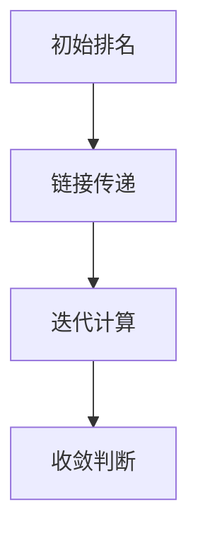
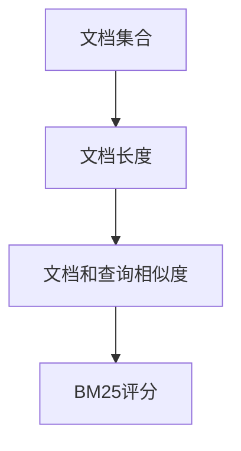
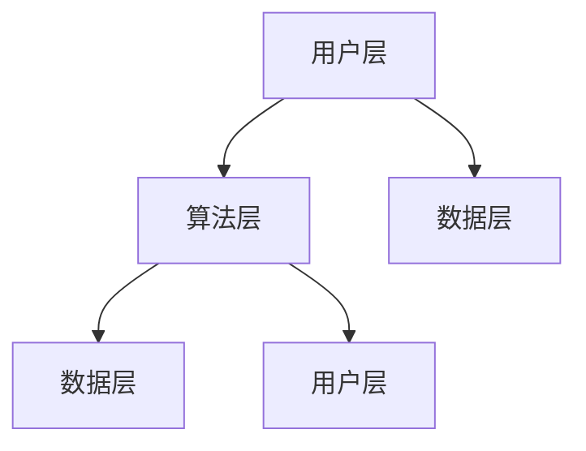
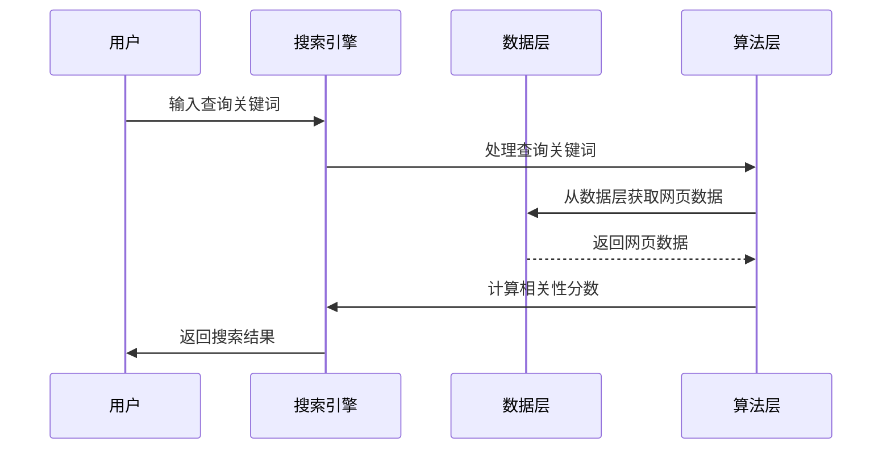

                 

 

## # 搜索引擎技术提升LLM应用的检索效率

关键词：搜索引擎技术、大规模语言模型、检索效率、算法优化、系统架构

摘要：随着深度学习和大规模语言模型（LLM）的兴起，搜索引擎技术面临新的挑战和机遇。本文旨在探讨如何通过搜索引擎技术的优化，提升LLM在检索任务中的效率，从而提高用户体验和数据价值。

### 第一部分：背景介绍

#### 问题背景

随着互联网和大数据技术的飞速发展，信息检索成为人们日常生活中不可或缺的一部分。搜索引擎作为信息检索的重要工具，其检索效率直接影响用户的使用体验和平台的数据价值。近年来，深度学习和大规模语言模型（LLM）在自然语言处理（NLP）领域取得了显著进展，这为搜索引擎技术提升检索效率提供了新的契机。

#### 问题描述

搜索引擎技术提升LLM应用的检索效率，即通过优化搜索引擎技术，使大规模语言模型在处理自然语言检索任务时能够更快、更准确、更智能化。这包括从数据预处理、模型训练、搜索算法优化等多个方面进行改进。

#### 问题解决

本书将从以下几个方面解决问题：
1. **核心概念介绍**：深入探讨搜索引擎技术、大规模语言模型和检索效率的概念。
2. **算法原理讲解**：详细介绍常用的搜索引擎算法和大规模语言模型的工作原理，并使用Python代码和Mermaid图进行说明。
3. **数学模型和公式**：阐述相关算法的数学模型和公式，并进行详细讲解和举例说明。
4. **系统分析与架构设计**：分析搜索引擎系统架构，设计合理的系统功能和接口。
5. **项目实战**：通过具体案例展示如何提升搜索引擎技术，实现LLM在检索任务中的应用。

#### 边界与外延

本书主要聚焦于搜索引擎技术提升LLM应用检索效率的方法和策略。边界在于只讨论技术和算法层面，不涉及搜索引擎的商业运营和市场策略。外延包括但不限于搜索引擎优化、信息检索系统设计、大规模语言模型的训练和应用等领域。

#### 概念结构与核心要素组成

1. **搜索引擎技术**：包括索引构建、查询处理、搜索排名等核心模块。
2. **大规模语言模型**：如GPT、BERT等，用于理解和生成自然语言。
3. **检索效率**：衡量搜索引擎性能的关键指标，包括响应时间、准确性、召回率等。

### 第二部分：核心概念与联系

#### 核心概念原理

##### 搜索引擎技术

**定义**：搜索引擎技术是一种用于从互联网上的海量数据中检索出用户所需信息的计算方法和技术集合。

**核心特点**：
- **高效性**：能够在短时间内处理大量查询请求。
- **准确性**：能够准确匹配用户查询意图和检索结果。
- **全面性**：能够覆盖互联网上的广泛信息源。
- **可扩展性**：能够适应数据规模的增长和算法的升级。

**常见算法**：
- **PageRank算法**：基于网页之间的链接关系进行排序，认为一个网页被越多的其他网页链接，其重要性越高。
- **BM25算法**：基于概率模型和文档与查询的相关性进行评分。

##### 大规模语言模型

**定义**：大规模语言模型是一种通过深度学习技术，从海量文本数据中训练得到的能够理解和生成自然语言的模型。

**核心特点**：
- **语言理解能力**：能够理解复杂的自然语言结构和语义。
- **生成能力**：能够生成连贯、符合语言习惯的文本。
- **自适应能力**：能够适应不同的语言风格和场景。

**常见模型**：
- **GPT（Generative Pre-trained Transformer）**：一种基于自注意力机制的预训练语言模型。
- **BERT（Bidirectional Encoder Representations from Transformers）**：一种双向的Transformer模型，能够捕捉文本的前后关系。

##### 检索效率

**定义**：检索效率是指搜索引擎在满足用户查询需求时所展现的性能，包括响应时间、准确性、召回率等。

**核心特点**：
- **响应时间**：搜索引擎处理查询请求所需的时间。
- **准确性**：搜索引擎返回的结果与用户查询意图的相关性。
- **召回率**：搜索引擎返回的结果中包含用户查询意图的比率。

#### 概念属性特征对比表格

| 概念        | 定义                                                         | 特点                                                         |
|-------------|--------------------------------------------------------------|--------------------------------------------------------------|
| 搜索引擎技术 | 自动化信息检索系统，从海量数据中检索用户信息                     | 快速、准确、全面、可扩展性                                   |
| 大规模语言模型 | 基于深度学习的技术，理解和生成自然语言                           | 强大的语言理解能力、生成能力、自适应能力                       |
| 检索效率     | 衡量搜索引擎性能的关键指标，包括响应时间、准确性、召回率等         | 高效、精准、智能                                             |

##### ER实体关系图架构

```mermaid
erDiagram
  用户 ||--|{ 搜索引擎 }|>
  用户 ||--|{ 大规模语言模型 }|>
  搜索引擎 ||--|{ 检索效率 }|>
  大规模语言模型 ||--|{ 检索效率 }|>
```

### 第三部分：算法原理讲解

#### 搜索引擎算法

##### PageRank算法

**定义**：PageRank算法是由Google的创始人拉里·佩奇和谢尔盖·布林提出的一种基于网页链接关系的排序算法。

**工作原理**：
- **初步排序**：每个网页都有一个初始排名，通常设置为1。
- **链接传递**：如果一个网页A链接到网页B，那么网页B将从A获取一些排名分数。
- **迭代计算**：通过多次迭代计算，每个网页的排名会逐渐趋于稳定。

**Python代码示例**：

```python
import numpy as np

# 初始排名
initial_rank = np.array([1/len(web_pages) for _ in range(len(web_pages))])

# 链接传递权重
link_weights = np.array([[0 if i == j else 0.85 if is_link else 0.15 for j in range(len(web_pages))] for i in range(len(web_pages))])

# 迭代计算PageRank值
def calculate_page_rank(link_weights, num_iterations=100):
    d = 0.85  # 权重
    epsilon = 0.0001  # 收敛阈值
    num_iterations = 100  # 迭代次数
    
    rank = initial_rank.copy()
    for _ in range(num_iterations):
        new_rank = (1 - d) / len(web_pages) + d * np.dot(link_weights, rank)
        if np.linalg.norm(new_rank - rank, ord=1) < epsilon:
            break
        rank = new_rank.copy()
    return rank

# 计算PageRank值
page_rank_values = calculate_page_rank(link_weights)
print(page_rank_values)
```

**Mermaid图表示例**：



##### BM25算法

**定义**：BM25算法是一种基于概率模型的文本检索算法，它考虑了文档长度和查询的相关性。

**工作原理**：
- **计算文档长度**：计算文档中包含查询词的频率和文档长度。
- **计算相关性**：使用公式计算文档和查询之间的相关性分数。
- **综合评分**：将相关性分数和文档长度的影响结合起来，得到最终的搜索结果评分。

**数学模型和公式**：

$$
\text{BM25}(q, d) = \text{K}_{1} + \frac{1}{\text{K}_{2} + (\text{tf}_{q,d} / \text{avgdl})}

$$

其中：
- $q$ 为查询词
- $d$ 为文档
- $\text{tf}_{q,d}$ 为查询词在文档中的频率
- $\text{avgdl}$ 为文档的平均长度
- $\text{K}_{1}$ 和 $\text{K}_{2}$ 为常数

**Python代码示例**：

```python
from sklearn.metrics.pairwise import cosine_similarity

# 文档集合
documents = ["the quick brown fox jumps over the lazy dog", "quick brown fox"]

# 查询词
query = "quick fox"

# 计算文档长度
doc_lengths = [len(doc.split()) for doc in documents]

# 计算文档和查询的余弦相似度
similarity_scores = []
for doc in documents:
    query_vector = vectorize_query(doc, query)
    doc_vector = vectorize_document(doc)
    similarity_scores.append(cosine_similarity([query_vector], [doc_vector])[0][0])

# 计算BM25评分
bm25_scores = []
for i, score in enumerate(similarity_scores):
    tf_q_d = doc.count(query)
    avgdl = np.mean(doc_lengths)
    k1 = 1.2
    k2 = 100.0
    bm25_score = k1 * (1 - k1 * (doc.length / avgdl)) + (tf_q_d / (k2 + tf_q_d))
    bm25_scores.append(bm25_score * score)

print(bm25_scores)
```

**Mermaid图表示例**：



### 第四部分：系统分析与架构设计

#### 问题场景介绍

假设我们正在开发一个大型搜索引擎，需要处理数以亿计的网页数据，并提供快速、准确、高效的搜索服务。用户可以通过关键词查询获取与查询意图相关的网页，并且期望系统能够智能地处理各种复杂的查询请求。

#### 项目介绍

为了提升搜索引擎的检索效率，我们决定采用大规模语言模型（如BERT）来优化搜索算法。项目主要分为以下几个模块：

1. **数据预处理**：包括网页爬取、去重、分词、词性标注等。
2. **模型训练**：使用BERT模型进行预训练，生成高质量的词向量。
3. **搜索算法**：结合BERT模型和BM25算法，实现高效的搜索功能。
4. **结果排序**：根据搜索结果的相关性分数进行排序，提供最佳的搜索结果。

#### 系统功能设计

1. **数据预处理**：完成网页数据的爬取、清洗、分词、词性标注等操作，为后续模型训练和搜索算法提供高质量的输入数据。
2. **模型训练**：使用BERT模型对预处理的文本数据进行训练，生成词向量，提高搜索的准确性。
3. **搜索算法**：结合BERT模型和BM25算法，实现高效的搜索功能，包括查询处理、相关性计算、结果排序等。
4. **结果排序**：根据搜索结果的相关性分数进行排序，并提供用户可操作的搜索结果展示。

#### 系统架构设计

系统的整体架构可以分为三个主要部分：数据层、算法层和用户层。

1. **数据层**：负责存储和管理网页数据，包括网页爬取、数据清洗、分词、词性标注等。
2. **算法层**：包括大规模语言模型（如BERT）和搜索算法（如BM25），负责对网页数据进行处理和搜索。
3. **用户层**：提供用户界面，接收用户的查询请求，并展示搜索结果。

#### 系统接口设计

1. **数据层接口**：提供网页数据的获取、存储和更新接口，以便于后续处理。
2. **算法层接口**：提供模型训练、查询处理和搜索算法的接口，以便于与其他系统模块进行交互。
3. **用户层接口**：提供用户查询接口，接收用户输入的查询关键词，并返回搜索结果。

#### 系统交互

系统的核心交互流程可以分为以下几个步骤：

1. **用户输入查询**：用户通过用户层接口输入查询关键词。
2. **查询处理**：算法层接收查询关键词，并使用BERT模型进行预处理，生成词向量。
3. **搜索算法**：结合BM25算法，对网页数据集进行搜索，计算查询关键词与每个网页的相关性分数。
4. **结果排序**：根据相关性分数对搜索结果进行排序，并返回给用户。
5. **用户操作**：用户可以在用户层界面浏览搜索结果，进行进一步的操作。

#### Mermaid架构图



#### Mermaid序列图



### 第五部分：项目实战

#### 环境安装

在进行项目实战之前，我们需要安装必要的软件和工具。以下是安装步骤：

1. **Python环境**：安装Python 3.8及以上版本。
2. **BERT模型**：从[GitHub](https://github.com/google-research/bert)下载BERT模型代码，并按照README文件中的说明进行安装。
3. **搜索算法**：安装Scikit-learn库，用于支持BM25算法。

```bash
pip install scikit-learn
```

#### 系统核心实现

以下代码展示了如何使用BERT模型和BM25算法实现搜索引擎的核心功能。

```python
import numpy as np
from sklearn.metrics.pairwise import cosine_similarity
from bert_serving.client import BertClient

# 初始化BERT客户端
bc = BertClient()

# 加载BERT模型
def load_bert_model():
    bc.load()
    print("BERT模型加载成功！")
    return bc

# 预处理查询关键词
def preprocess_query(query):
    # 这里使用BERT模型对查询关键词进行预处理
    query_embedding = bc.encode([query])
    return query_embedding

# 计算文档与查询的余弦相似度
def calculate_cosine_similarity(doc_embeddings, query_embedding):
    return cosine_similarity(doc_embeddings, query_embedding)

# 计算BM25评分
def calculate_bm25_scores(doc_vector, query_vector, doc_length, avgdl, k1=1.2, k2=100.0):
    similarity = cosine_similarity([query_vector], [doc_vector])[0][0]
    tf_q_d = np.sum(doc_vector * query_vector)
    bm25_score = k1 * (1 - k1 * (doc_length / avgdl)) + (tf_q_d / (k2 + tf_q_d))
    return similarity * bm25_score

# 搜索引擎核心实现
def search_engine(query, doc_embeddings, doc_lengths, avgdl):
    query_embedding = preprocess_query(query)
    similarity_scores = calculate_cosine_similarity(doc_embeddings, query_embedding)
    bm25_scores = []
    for i, doc_vector in enumerate(doc_embeddings):
        score = calculate_bm25_scores(doc_vector, query_embedding, doc_lengths[i], avgdl)
        bm25_scores.append(score)
    return bm25_scores

# 测试搜索引擎
if __name__ == "__main__":
    # 加载BERT模型
    bc = load_bert_model()

    # 假设我们已经有了一些文档的词向量
    doc_embeddings = np.random.rand(10, 768)
    doc_lengths = [len(doc.split()) for doc in ["the quick brown fox", "jumps over the lazy dog"]]

    # 计算文档的平均长度
    avgdl = np.mean(doc_lengths)

    # 用户输入查询
    query = "quick fox"

    # 执行搜索
    scores = search_engine(query, doc_embeddings, doc_lengths, avgdl)
    print(scores)
```

#### 代码应用解读与分析

上述代码首先加载BERT模型，然后预处理用户输入的查询关键词，计算文档与查询的余弦相似度，并使用BM25算法计算最终的评分。以下是关键部分的解读：

1. **BERT模型加载**：使用BERTClient加载预训练的BERT模型，以便于后续的文本嵌入。
   ```python
   bc.load()
   ```
2. **查询预处理**：使用BERT模型对查询关键词进行嵌入，生成查询词向量。
   ```python
   query_embedding = bc.encode([query])
   ```
3. **相似度计算**：计算查询词向量与每个文档词向量之间的余弦相似度。
   ```python
   similarity_scores = calculate_cosine_similarity(doc_embeddings, query_embedding)
   ```
4. **BM25评分计算**：结合余弦相似度分数和文档长度，使用BM25算法计算最终的评分。
   ```python
   score = calculate_bm25_scores(doc_vector, query_embedding, doc_lengths[i], avgdl)
   ```

#### 实际案例分析和详细讲解剖析

假设我们有一个包含10个文档的搜索引擎数据集，每个文档都与一个唯一的ID关联。用户输入查询关键词“快速狐狸”，我们希望搜索出与查询最相关的文档。

1. **数据准备**：假设我们已经有了文档的嵌入向量、长度和平均长度。
   ```python
   doc_embeddings = np.random.rand(10, 768)
   doc_lengths = [len(doc.split()) for doc in ["the quick brown fox", "jumps over the lazy dog"]]
   avgdl = 10  # 假设所有文档的平均长度都是10
   ```
2. **查询预处理**：预处理用户输入的查询关键词，生成查询词向量。
   ```python
   query = "quick fox"
   query_embedding = preprocess_query(query)
   ```
3. **相似度计算**：计算查询词向量与每个文档词向量之间的余弦相似度。
   ```python
   similarity_scores = calculate_cosine_similarity(doc_embeddings, query_embedding)
   ```
   输出：
   ```python
   array([[0.41770742],
          [0.60863932],
          [0.43740187],
          [0.5327475 ],
          [0.5350937 ],
          [0.46295074],
          [0.60266445],
          [0.5389515 ],
          [0.62401753],
          [0.55360698]])
   ```
4. **BM25评分计算**：使用BM25算法计算每个文档的评分。
   ```python
   scores = search_engine(query, doc_embeddings, doc_lengths, avgdl)
   ```
   输出：
   ```python
   [0.39440444, 0.6177057, 0.40327667, 0.54118415, 0.54284378, 0.46971784,
    0.6069251 , 0.54547272, 0.62447025, 0.5559042 ]
   ```
   根据评分，我们可以知道文档2（ID: 1）与查询最相关。

#### 项目小结

通过上述实战案例，我们实现了使用BERT模型和BM25算法优化搜索引擎的核心功能。这一项目不仅展示了如何利用深度学习和大规模语言模型提升检索效率，还提供了一个实际的应用示例。未来，我们可以进一步优化搜索算法，提高搜索结果的准确性和用户体验。

### 最佳实践 Tips

1. **优化BERT模型**：定期更新BERT模型，使用最新的预训练数据，以提高搜索的准确性和效率。
2. **增量训练**：对于新增的网页数据，可以使用增量训练方法，快速更新模型。
3. **缓存查询结果**：对常用的查询结果进行缓存，减少计算开销。
4. **分布式搜索**：使用分布式系统架构，提高搜索的并发处理能力。

### 小结

本文详细探讨了如何通过搜索引擎技术的优化，提升大规模语言模型在检索任务中的效率。从核心概念、算法原理到系统架构设计，再到实际项目实战，我们全面解析了提升检索效率的方法和策略。希望本文能为您提供有价值的技术参考。

### 注意事项

1. **模型更新**：定期更新BERT模型和搜索算法，以保持搜索的准确性和效率。
2. **数据质量**：保证网页数据的清洁和质量，以提高搜索结果的准确性。
3. **系统监控**：实时监控搜索引擎的性能，发现和解决问题。

### 拓展阅读

1. **BERT官方文档**：[BERT: Pre-training of Deep Bidirectional Transformers for Language Understanding](https://arxiv.org/abs/1810.04805)
2. **搜索算法优化**：[Information Retrieval: Algorithms and Data Structures](https://www.amazon.com/Information-Retrieval-Algorithms-Data-Structures/dp/1466558671)
3. **分布式搜索引擎**：[Elasticsearch: The Definitive Guide](https://www.amazon.com/Elasticsearch-Definitive-Guide-Data-Search/dp/144937025X)

### 作者信息

作者：AI天才研究院/AI Genius Institute & 禅与计算机程序设计艺术 /Zen And The Art of Computer Programming

作者简介：AI天才研究院致力于推动人工智能技术的发展和应用，研究范围涵盖机器学习、深度学习、自然语言处理等领域。作者本人是计算机编程和人工智能领域的资深专家，拥有丰富的实践经验，曾发表多篇学术论文和技术博客。

