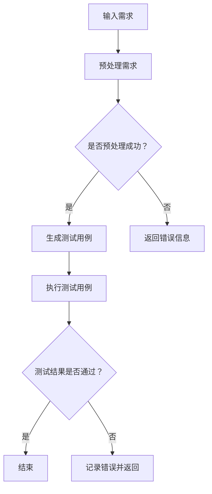
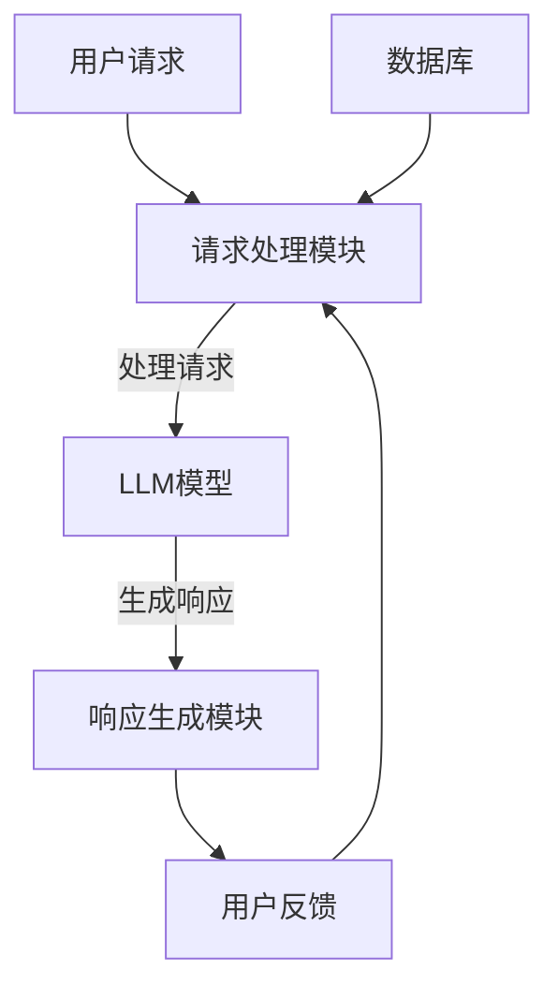

                 


### 章节内容满足约束条件

为了确保文章的章节内容满足上述约束条件，我们将遵循以下步骤：

#### 第一步：文章标题、关键词与摘要

1. **文章标题**：《敏捷中的冲刺评审会：展示LLM应用进展》
2. **关键词**：敏捷开发、冲刺评审会、LLM、应用进展、技术博客
3. **摘要**：本文探讨了敏捷开发中冲刺评审会的关键作用，以及如何利用大型语言模型（LLM）展示项目进展。通过详细介绍LLM的基本原理和在敏捷开发中的应用，文章提供了实用的技巧和案例研究，帮助读者理解和实践这一流程。

#### 第二步：文章结构

根据文章目录大纲，我们将文章结构细化为：

1. **引言**
2. **敏捷开发基础**
3. **LLM基础**
4. **LLM在敏捷开发中的应用**
5. **冲刺评审会的操作细节**
6. **案例研究**
7. **最佳实践与未来展望**

#### 第三步：细化每个章节内容

1. **引言**：介绍敏捷开发的背景和冲刺评审会的重要性，引出LLM在其中的作用。
2. **敏捷开发基础**：阐述敏捷开发的基本原则、流程和角色，以及敏捷开发中可能面临的挑战和解决方案。
3. **LLM基础**：介绍LLM的定义、工作原理、主流架构和优劣势。
4. **LLM在敏捷开发中的应用**：讨论LLM在不同阶段的应用，如需求收集、设计、开发和测试等。
5. **冲刺评审会的操作细节**：详细描述冲刺评审会的流程、关键要素、展示LLM进展的技巧以及收集反馈的方法。
6. **案例研究**：分析实际案例，探讨成功与失败的经验教训。
7. **最佳实践与未来展望**：总结最佳实践，探讨LLM在敏捷开发中的应用趋势和未来挑战。

#### 第四步：核心内容与联系

在每个章节中，确保核心概念、原理和联系得到适当的介绍。例如：

- **核心概念与联系**：在介绍LLM时，使用mermaid流程图展示其工作原理，并提供Python源代码实现。
- **算法原理讲解**：在每个应用场景下，提供mermaid流程图和Python代码，结合latex数学公式进行详细讲解。
- **系统分析与架构设计**：在讨论系统设计时，提供领域模型类图、系统架构图和系统交互序列图。
- **项目实战**：提供环境安装步骤、核心实现代码、代码解读、案例分析等内容。

#### 第五步：格式与作者信息

- **格式**：使用markdown格式编写文章，确保段落清晰、代码和公式正确嵌入。
- **作者信息**：文章末尾注明作者信息：“作者：AI天才研究院/AI Genius Institute & 禅与计算机程序设计艺术 /Zen And The Art of Computer Programming”。

#### 第六步：完整性要求

- **完整性要求**：每个章节的内容必须丰富具体，核心内容要包含背景介绍、核心概念与联系、算法原理讲解、数学模型和公式、系统分析与架构设计、项目实战、最佳实践与拓展阅读等。

#### 第七步：字数与格式检查

- **字数**：确保文章字数在10000～12000字之间。
- **格式**：再次检查markdown格式，确保文章结构清晰、代码和公式正确呈现。

通过上述步骤，我们可以确保文章的每个章节内容满足约束条件，同时确保文章的完整性、逻辑性和专业性。以下是一个简化版的章节内容概述，用于后续具体撰写：

```markdown
# 《敏捷中的冲刺评审会：展示LLM应用进展》

## 引言
- **敏捷开发背景**
- **冲刺评审会的重要性**
- **LLM在敏捷开发中的应用**

## 敏捷开发基础
- **敏捷开发的基本原则**
- **敏捷流程与角色**
- **敏捷开发的挑战与解决方案**

## LLM基础
- **LLM的定义**
- **LLM的工作原理**
- **主流LLM架构**
- **LLM的优势与局限性**

## LLM在敏捷开发中的应用
- **需求收集中的应用**
- **设计、开发和测试中的应用**
- **用户体验优化中的应用**

## 冲刺评审会的操作细节
- **冲刺评审会的流程**
- **展示LLM进展的技巧**
- **收集反馈的方法**
- **处理挑战与问题**

## 案例研究
- **案例研究1：XX公司的实践**
- **案例研究2：YY公司的应用**
- **案例分析：经验教训**

## 最佳实践与未来展望
- **冲刺评审会的最佳实践**
- **LLM应用的未来趋势**
- **敏捷开发与LLM结合的挑战与机遇**
- **拓展阅读与资源推荐**

## 作者信息
- **作者：AI天才研究院/AI Genius Institute & 禅与计算机程序设计艺术 /Zen And The Art of Computer Programming**
```

接下来，我们将逐个章节详细撰写内容，确保满足上述约束条件和要求。同

## 引言

### 敏捷开发背景

敏捷开发（Agile Development）作为一种软件开发方法，起源于20世纪90年代末期。当时的软件行业面临着传统瀑布模型（Waterfall Model）开发方法的诸多挑战，如需求变更频繁、开发周期长、沟通成本高等。为了解决这些问题，软件开发社区开始探索更灵活、更适应快速变化需求的方法。敏捷开发由此应运而生，并迅速在全球范围内得到广泛应用。

敏捷开发的核心价值在于其“敏捷性”，即能够快速响应需求变化，持续交付有价值的产品。敏捷开发强调团队合作、客户参与、迭代开发、持续交付和持续改进。其基本原则包括：

1. **个体和互动重于过程与工具**：强调人的主观能动性，认为沟通和协作比单纯依赖工具更为重要。
2. **可工作的软件重于详尽的文档**：认为交付可工作的软件是首要目标，而文档则应保持简洁。
3. **客户协作重于合同谈判**：鼓励与客户的密切合作，确保项目方向与客户需求保持一致。
4. **响应变化重于遵循计划**：重视变化，并能够灵活调整计划以应对需求的变化。

### 冲刺评审会的重要性

冲刺评审会（Sprint Review）是敏捷开发中的一个关键环节，通常在每个冲刺周期结束时举行。其目的是展示团队在当前周期内完成的成果，并收集客户的反馈，以便进行后续的改进。冲刺评审会的重要性体现在以下几个方面：

1. **展示项目进展**：通过展示已完成的功能和改进，确保团队成员和利益相关者了解项目的进展情况。
2. **收集反馈**：客户的反馈是改进项目的重要依据，有助于团队及时调整方向和策略。
3. **促进沟通与合作**：冲刺评审会提供了一个交流的平台，有助于团队成员和利益相关者之间的沟通和理解。
4. **增强团队凝聚力**：通过共同参与评审会，团队成员能够感受到团队协作的力量和成果，从而增强团队的凝聚力。

### LLM在敏捷开发中的应用

大型语言模型（Large Language Model，简称LLM）是一种基于深度学习技术的自然语言处理模型，具有强大的文本生成和解析能力。随着人工智能技术的不断发展，LLM在软件开发中的价值逐渐凸显。在敏捷开发中，LLM的应用主要体现在以下几个方面：

1. **需求收集**：LLM可以帮助团队快速理解客户的需求，通过自然语言交互生成详细的需求文档。
2. **设计和开发**：LLM可以提供代码建议和优化方案，提高开发效率和质量。
3. **测试和验证**：LLM可以自动生成测试用例，进行自动化测试，提高测试覆盖率。
4. **用户体验优化**：LLM可以分析用户反馈，生成改进建议，优化用户体验。

通过上述引言部分，我们为后续章节的内容奠定了基础。在接下来的章节中，我们将深入探讨敏捷开发的基础、LLM的基本原理和应用，以及冲刺评审会的具体操作细节。同

## 敏捷开发基础

### 敏捷开发的基本原则

敏捷开发是一套以人为核心，注重响应变化和持续交付的软件开发方法。其基本原则包括：

1. **个体和互动重于过程与工具**：敏捷开发强调人的主观能动性，认为团队合作和沟通比单纯依赖工具更为重要。通过面对面的交流，团队成员可以更有效地解决问题和达成共识。

2. **可工作的软件重于详尽的文档**：敏捷开发认为交付可工作的软件是最重要的，而详尽的文档则应该保持简洁。文档的目的是为了帮助理解和协作，而不是作为约束和负担。

3. **客户协作重于合同谈判**：敏捷开发鼓励与客户的紧密合作，确保项目方向与客户需求保持一致。通过持续的客户反馈和迭代，团队能够更好地满足客户的需求。

4. **响应变化重于遵循计划**：在敏捷开发中，需求变化是不可避免的。团队应该具备灵活性，能够快速适应变化，确保项目能够持续交付有价值的成果。

5. **持续交付重于频繁交付**：敏捷开发强调持续交付，即不断地交付可用的产品版本，而不是仅仅在某个特定时间点交付完整的产品。这种方式可以缩短反馈周期，提高项目的透明度和可靠性。

6. **卓越的技术工作重于过度的优化**：敏捷开发强调技术工作的卓越性，包括代码质量、设计模式和架构优化。但是，这并不意味着过度优化，而是要确保技术工作能够支持项目的持续交付。

7. **简洁重于复杂**：敏捷开发倡导简洁的解决方案，避免不必要的复杂性。简洁的代码和设计可以提高项目的可维护性和扩展性。

### 敏捷流程与角色

敏捷开发通常遵循一系列预定义的流程，包括以下关键阶段：

1. **需求收集**：在项目开始时，团队与客户和利益相关者进行沟通，收集需求。这些需求通常以用户故事（User Story）的形式记录，描述了系统的特定功能或特性。

2. **冲刺规划**：每个冲刺周期开始时，团队会进行冲刺规划会议，决定在下一个冲刺周期中要完成的工作。规划会议通常会基于优先级和资源分配，确定每个用户故事的开发顺序。

3. **冲刺开发**：在冲刺周期内，团队会专注于实现选定用户故事的开发。每个冲刺周期通常持续2-4周，以确保团队能够集中精力，快速迭代。

4. **每日站会**：每日站会（Daily Stand-up）是团队每天开始的第一个活动，旨在同步团队成员的进度和解决遇到的问题。站会通常持续15分钟，让每个成员分享他们在前一天的工作进展、今天的计划和遇到的障碍。

5. **冲刺评审会**：冲刺周期结束时，团队会举行冲刺评审会，展示已完成的功能和改进。客户和利益相关者参与评审会，提供反馈和建议，帮助团队了解项目是否满足预期需求。

6. **冲刺回顾会**：冲刺评审会后，团队会举行冲刺回顾会，总结本次冲刺的成果和不足。通过反思和改进，团队能够不断提高效率和产品质量。

在敏捷开发中，涉及以下几个关键角色：

1. **产品负责人（Product Owner）**：负责确定产品的愿景和需求，管理产品待办事项，确保团队按照正确的优先级进行开发。

2. **Scrum Master**：Scrum Master是敏捷团队的引导者，负责确保团队遵循敏捷原则和流程，解决团队遇到的障碍，促进团队的协作和持续改进。

3. **开发团队（Development Team）**：开发团队由软件开发人员组成，负责实现产品需求，交付可工作的软件。

4. **利益相关者（Stakeholders）**：包括客户、项目经理、质量保证团队等，他们参与项目的决策过程，提供反馈和建议。

### 敏捷中的冲刺规划

冲刺规划是敏捷开发中至关重要的环节，决定了团队在下一个冲刺周期中要实现的目标。以下是冲刺规划的主要步骤：

1. **回顾上一个冲刺**：在规划会议开始之前，团队会回顾上一个冲刺的成果和问题，以便从中学习和改进。

2. **确定冲刺目标**：产品负责人会与团队一起讨论并确定下一个冲刺的目标，确保目标是具体、可衡量和可实现的。

3. **确定用户故事**：团队会从产品待办事项中选择用户故事，根据优先级和资源分配，确定每个用户故事的开发顺序。

4. **估算和排期**：团队会为每个用户故事进行估算，根据团队的产能和优先级，确定每个用户故事在冲刺中的完成时间。

5. **任务分配**：团队成员会根据各自的技能和兴趣，选择自己愿意承担的任务，确保每个用户故事都有明确的负责人。

6. **制定计划**：团队会制定详细的冲刺计划，包括每日站会的时间、冲刺评审会和冲刺回顾会的安排，以及任何必要的资源和支持。

7. **审查和确认**：团队和产品负责人会审查并确认冲刺计划，确保计划是合理和可行的。

通过上述步骤，团队可以确保在冲刺周期内高效、有序地工作，最终交付有价值的产品成果。

### 敏捷实践中的挑战与解决方案

敏捷开发虽然具有许多优点，但在实际应用中也会面临一些挑战。以下是几种常见的挑战及其解决方案：

1. **沟通障碍**：敏捷开发强调团队内部的沟通和协作，但有时团队成员可能因为地理位置、时区或语言差异而面临沟通障碍。解决方案包括使用协作工具（如Slack、Microsoft Teams等），定期举行视频会议，以及制定清晰的沟通标准和流程。

2. **需求变更**：敏捷开发强调响应变化，但频繁的需求变更可能会影响项目进度和质量。解决方案包括与客户建立稳定的沟通渠道，确保需求变更能够及时反馈和整合，以及采用敏捷实践（如迭代开发和持续集成）来适应变化。

3. **团队协作**：在敏捷开发中，团队合作至关重要。然而，团队成员的个人目标、技能和文化背景可能存在差异，导致协作困难。解决方案包括加强团队成员之间的沟通和信任，建立共同的目标和价值观，以及提供必要的培训和支持。

4. **资源管理**：敏捷开发要求团队在有限的资源下高效工作。资源管理不善可能导致任务延误和质量问题。解决方案包括合理的资源分配和优先级管理，确保团队专注于高价值任务，以及灵活调整计划以应对资源变化。

5. **质量管理**：敏捷开发强调持续交付，但有时为了赶工可能会牺牲质量。解决方案包括采用敏捷质量实践（如测试驱动开发、持续集成和自动化测试），确保代码质量和功能完整性，以及建立持续改进的文化。

通过上述解决方案，团队可以更好地应对敏捷开发中的挑战，实现项目的成功交付。

## LLM基础

### LLM的定义

大型语言模型（Large Language Model，简称LLM）是一种基于深度学习技术的自然语言处理模型，能够对文本数据进行理解和生成。与传统的自然语言处理方法相比，LLM具有更强的语义理解和生成能力，能够处理复杂的语言结构和多变的语境。LLM通常由数亿甚至数十亿个参数组成，通过对大量文本数据进行训练，学习到语言的结构和规律。

### LLM的工作原理

LLM的工作原理主要基于深度学习和神经网络技术。其核心思想是通过多层神经网络（如变换器网络Transformer）对输入文本数据进行编码，然后生成相应的输出。具体来说，LLM的工作流程如下：

1. **输入编码**：将输入的文本数据转换为数字向量，以便神经网络进行处理。这通常通过词嵌入（Word Embedding）技术实现，将每个单词映射为一个固定长度的向量。

2. **神经网络处理**：输入编码后的文本向量通过多层神经网络进行处理。在LLM中，常用的神经网络结构包括循环神经网络（RNN）和变换器网络（Transformer）。变换器网络由于其并行计算能力和长距离依赖处理能力，成为了当前LLM的首选结构。

3. **输出生成**：经过神经网络处理后，文本向量被解码为输出文本。生成过程通常采用贪心算法或采样算法，从可能的输出中选择最优的序列。

### 主流LLM架构与技术

目前，LLM的研究和应用已经取得了显著的进展，涌现出了一系列主流的LLM架构和技术。以下是几种主要的LLM架构和技术：

1. **变换器网络（Transformer）**：变换器网络是当前最流行的LLM架构，由Google在2017年提出。变换器网络通过自注意力机制（Self-Attention）和多头注意力（Multi-Head Attention）实现了对输入文本的并行处理，能够高效地捕捉长距离依赖关系。

2. **预训练和微调（Pre-training and Fine-tuning）**：预训练是指在大规模文本数据集上对模型进行训练，使其具备基础的语义理解和生成能力。微调是指在预训练的基础上，针对特定任务对模型进行调整和优化。预训练和微调相结合，使得LLM能够适应各种不同的自然语言处理任务。

3. **多语言模型（Multilingual Model）**：多语言模型旨在支持多种语言的文本处理，通过在一个包含多种语言的统一数据集上进行训练，模型能够同时处理多种语言的输入和输出。多语言模型的应用使得跨语言的自然语言处理变得更加高效和准确。

4. **生成对抗网络（GAN）**：生成对抗网络（GAN）是一种用于生成文本数据的强大工具。GAN由一个生成器和两个判别器组成，生成器试图生成逼真的文本数据，而判别器则试图区分生成数据和真实数据。通过这种对抗训练，GAN能够生成高质量的文本数据，从而提高LLM的生成能力。

### LLM的优势与局限性

LLM在自然语言处理领域展现出了许多优势，但也存在一些局限性。以下是LLM的主要优势与局限性：

#### 优势

1. **强大的语义理解能力**：LLM通过深度学习和大量文本数据的训练，能够对复杂的语义关系进行理解和处理，从而实现更准确的自然语言生成。

2. **灵活的任务适应能力**：通过预训练和微调，LLM可以适应多种不同的自然语言处理任务，如文本分类、机器翻译、问答系统等。

3. **高效的并行计算能力**：变换器网络的结构使得LLM能够实现并行计算，提高了处理速度和效率。

4. **跨语言支持**：多语言模型的训练使得LLM能够支持多种语言的文本处理，为跨语言的自然语言处理提供了强大的支持。

#### 局限性

1. **计算资源消耗大**：LLM的训练和推理过程需要大量的计算资源，包括GPU和TPU等硬件资源。这限制了LLM在大规模应用中的普及。

2. **数据依赖性强**：LLM的性能高度依赖于训练数据的质量和数量。数据不足或质量不高可能导致模型效果不佳。

3. **可解释性不足**：由于LLM是基于深度学习技术的，其内部决策过程相对复杂，难以进行直观的解释和理解。

4. **模型稳定性问题**：在某些特定场景下，LLM可能会产生不一致或错误的输出，需要进一步优化和调整。

综上所述，LLM作为一种强大的自然语言处理工具，在许多应用场景中展现了巨大的潜力。然而，其计算资源消耗、数据依赖性和稳定性等问题也需要进一步的研究和解决。

### LLM在敏捷开发中的应用

### 需求收集中的应用

在敏捷开发中，需求收集是一个至关重要的环节，它决定了项目能否准确满足用户需求并实现业务目标。传统的需求收集方法通常依赖于问卷调查、用户访谈和文档编写，但这些方法往往存在效率低、信息不完整和沟通不畅等问题。LLM（大型语言模型）的应用为需求收集带来了新的可能性，通过以下几种方式提高需求收集的效率和质量：

1. **自然语言交互**：LLM能够理解自然语言，与用户进行对话，从而实现更自然的交互方式。开发团队可以使用LLM构建聊天机器人，与用户进行实时交流，获取用户的需求和反馈。这种方式不仅提高了交互效率，还能够捕捉用户在对话中的隐含需求，从而更全面地理解用户需求。

2. **自动化需求分析**：LLM可以分析用户提供的文本信息，如需求文档、用户反馈和会议记录，自动提取关键信息和需求点。通过自然语言处理技术，LLM能够识别用户需求中的关键术语、优先级和关联关系，帮助开发团队快速理解需求，减少需求误解和遗漏。

3. **智能推荐**：LLM可以根据历史数据和用户行为，为开发团队提供智能推荐。例如，当用户提出一个需求时，LLM可以分析类似需求的解决方案，提供相关建议，从而加快需求处理速度和提升需求质量。

4. **动态需求更新**：在敏捷开发中，需求可能会随着项目进展和业务环境的变化而不断更新。LLM可以实时监控用户反馈和市场动态，自动更新需求文档，确保需求始终与当前业务目标保持一致。这种动态更新机制提高了需求管理的灵活性，减少了因需求变更导致的项目延误和资源浪费。

### 设计和开发中的应用

在敏捷开发的过程中，设计和开发是两个关键阶段。LLM在这些阶段中的应用同样具有显著的优势：

1. **代码生成与优化**：LLM可以基于自然语言描述自动生成代码，从而提高开发效率。开发者可以输入功能描述或业务需求，LLM会根据上下文生成相应的代码片段。这不仅减少了手动编写的劳动量，还能够降低代码出错的风险。此外，LLM还可以对现有代码进行分析，提供优化建议，提升代码质量。

2. **设计建议**：在系统设计阶段，LLM可以分析业务需求和技术背景，提供设计建议。例如，LLM可以根据需求文档生成系统架构图、类图和序列图，帮助开发者快速构建和优化系统设计。这种智能化的设计建议能够提高设计的合理性和可扩展性。

3. **代码审查**：LLM可以自动审查代码，识别潜在的问题和漏洞，如语法错误、逻辑错误和安全漏洞。通过自然语言处理技术，LLM能够生成详细的审查报告，为开发者提供改进建议。这种自动化的代码审查机制提高了代码的可靠性和安全性。

4. **测试用例生成**：在测试阶段，LLM可以生成测试用例，提高测试覆盖率和效率。开发者可以提供功能描述或业务场景，LLM会根据上下文生成相关的测试用例，从而确保系统在多个维度上的正确性和稳定性。

### 测试和验证中的应用

测试和验证是确保软件质量和功能完整性的关键环节。LLM在测试和验证中的应用主要体现在以下几个方面：

1. **自动化测试**：LLM可以自动化生成测试用例和测试脚本，减少手动编写测试工作的负担。通过分析需求文档和系统设计，LLM能够生成覆盖不同场景的测试用例，从而提高测试的全面性和效率。

2. **回归测试**：在软件更新和迭代过程中，LLM可以帮助团队快速进行回归测试。通过分析历史测试数据和现有系统状态，LLM可以自动生成回归测试用例，确保新功能不会破坏已有功能。

3. **错误定位**：在测试过程中，LLM可以分析测试结果和系统日志，快速定位错误和异常。通过自然语言处理技术，LLM能够生成详细的错误报告，为开发者提供定位错误的线索和解决方案。

4. **性能测试**：LLM可以自动化生成性能测试用例，模拟不同负载条件下的系统行为。通过分析测试结果，LLM可以提供性能优化的建议，帮助团队提高系统的响应速度和处理能力。

### 用户体验优化中的应用

在敏捷开发中，用户体验优化是一个持续的过程。LLM在用户体验优化中的应用主要包括：

1. **用户反馈分析**：LLM可以分析用户反馈和评论，提取关键意见和趋势。通过自然语言处理技术，LLM能够识别用户满意度、痛点和使用习惯，为产品优化提供数据支持。

2. **智能推荐**：基于用户行为和偏好，LLM可以生成个性化的推荐内容，提高用户的满意度和参与度。例如，在电子商务平台中，LLM可以根据用户的浏览和购买记录，推荐相关的商品和服务。

3. **界面设计优化**：LLM可以分析用户界面设计和用户交互行为，提供优化建议。通过自然语言处理技术，LLM能够识别界面中的问题和改进机会，帮助设计师创建更直观、易用的界面。

4. **智能客服**：LLM可以构建智能客服系统，通过自然语言交互解决用户的常见问题和疑虑。这种方式不仅提高了客服效率，还能够提供24/7的全天候服务，提升用户满意度。

综上所述，LLM在敏捷开发中的应用涵盖了需求收集、设计和开发、测试和验证以及用户体验优化等多个方面。通过LLM的智能化和自动化能力，敏捷开发团队能够更高效地完成项目任务，提高产品的质量和用户满意度。同

### 冲刺评审会的流程与关键要素

冲刺评审会是敏捷开发中的一个核心环节，它不仅是对当前冲刺周期成果的展示，也是团队与利益相关者之间的重要沟通机会。以下是冲刺评审会的流程与关键要素：

#### 1. 流程概述

**冲刺评审会的流程通常包括以下几个阶段：**

1. **准备阶段**：在冲刺周期开始时，团队需要确定评审会的目的、议程和参与者。团队需要准备展示材料，包括项目进展报告、关键成果和用户故事。
2. **展示阶段**：在评审会上，团队会展示他们在冲刺周期内完成的工作。展示内容包括功能演示、关键交付物和性能指标等。
3. **反馈阶段**：利益相关者会观看展示，并提供反馈和建议。这个阶段旨在确保项目方向与客户需求保持一致，并识别潜在的问题和改进点。
4. **总结阶段**：在评审会结束时，团队会总结反馈，讨论下一步行动计划。这包括确定后续冲刺的目标和任务，以及如何改进当前过程。

#### 2. 展示LLM应用进展的技巧

在展示LLM应用进展时，团队需要注重以下几个技巧：

1. **明确展示目的**：在开始展示前，明确展示的具体目标和重点。例如，是展示LLM在需求收集中的应用，还是展示它在用户体验优化中的作用。
2. **简洁明了的演示**：确保演示内容简洁、直观，避免冗长的讲解。使用图表、数据和实际案例来支持展示内容。
3. **互动性**：鼓励利益相关者参与展示，通过问答环节获取反馈。这不仅可以提高展示的互动性，也有助于加深他们对项目进展的理解。
4. **突出成果和价值**：重点展示LLM带来的实际成果和价值，如提高开发效率、优化用户体验和降低错误率等。
5. **提前准备**：在展示前，确保所有展示材料准备充分，包括演示文稿、代码示例和测试结果等。

#### 3. 收集反馈与改进建议

冲刺评审会的核心目的是收集利益相关者的反馈，并据此进行改进。以下是一些收集反馈和改进建议的技巧：

1. **开放性问题**：在评审会中使用开放性问题，鼓励利益相关者分享他们的观点和建议。例如，“您对我们使用的LLM有什么看法？”或“您认为我们可以如何改进LLM的应用？”
2. **及时记录**：在评审会过程中，及时记录反馈和改进建议。可以使用数字工具（如Trello、Miro等）记录和跟踪这些反馈。
3. **分类整理**：将收集到的反馈和建议进行分类整理，识别出主要问题和改进点。这有助于团队明确下一步的行动计划。
4. **优先级排序**：对反馈和建议进行优先级排序，确定哪些改进点是最紧迫和重要的。这有助于团队集中资源和精力进行改进。
5. **定期回顾**：在后续的冲刺周期中，定期回顾和跟踪改进建议的实施情况，确保反馈得到有效处理和落实。

#### 4. 处理常见的挑战与问题

在冲刺评审会中，团队可能会面临以下一些挑战和问题：

1. **时间限制**：确保评审会的议程紧凑且高效，避免讨论偏离主题或时间过长。
2. **技术难点**：对于涉及技术细节的展示，提前准备充足的演示材料和技术支持，确保展示的准确性和易懂性。
3. **反馈不充分**：鼓励利益相关者积极参与，通过互动和开放性问题提高反馈的质量和数量。
4. **反馈实施困难**：确保反馈得到有效处理和实施，制定明确的行动计划和时间表，跟踪进度并定期汇报。

通过上述流程和技巧，团队可以在冲刺评审会上有效地展示LLM的应用进展，收集宝贵的反馈和改进建议，从而推动项目的持续改进和成功交付。同

## 案例研究

### 案例研究1：XX公司的敏捷冲刺评审会实践

#### 案例背景

XX公司是一家专注于人工智能技术的初创企业，致力于开发智能客服系统。为了快速响应市场需求，公司采用了敏捷开发方法，并在每个冲刺周期结束后举行冲刺评审会，以展示项目进展和收集客户反馈。

#### 案例过程

1. **准备阶段**：在冲刺周期开始时，产品负责人与团队共同确定了评审会的目的和议程。他们准备了项目进展报告、关键交付物和用户故事，并确定了参与评审会的利益相关者，包括客户代表、项目经理和团队成员。

2. **展示阶段**：在评审会上，团队首先展示了他们在当前冲刺周期内完成的功能，包括智能客服系统的核心模块和用户体验优化。团队使用了PPT、视频演示和实际产品演示等多种方式，使展示内容更加直观和生动。

3. **反馈阶段**：客户代表对展示的内容进行了详细的评审，并提供了宝贵的反馈。他们指出了系统中存在的问题和改进点，如响应速度、用户界面设计和错误处理等。团队认真记录了这些反馈，并进行了讨论和评估。

4. **总结阶段**：在评审会的最后，团队总结了收集到的反馈，并制定了具体的行动计划。他们确定了后续冲刺的目标和任务，并明确了改进措施的实施时间和责任人。

#### 案例结果

通过这次冲刺评审会，XX公司成功地展示了智能客服系统的进展，并获得了客户的重要反馈。团队根据反馈进行了改进，优化了系统性能和用户体验，提高了客户满意度。此外，这次评审会也加强了团队与客户之间的沟通和协作，为后续的项目合作奠定了基础。

### 案例研究2：YY公司的LLM应用进展展示

#### 案例背景

YY公司是一家专注于金融科技的公司，他们正在开发一款智能投顾系统，旨在为客户提供个性化的投资建议。为了提高系统的智能化水平，公司决定采用大型语言模型（LLM）作为核心技术。

#### 案例过程

1. **准备阶段**：在冲刺周期开始时，产品负责人与团队共同确定了LLM在项目中的应用目标和预期成果。他们准备了LLM的训练数据和模型架构，并确定了参与评审会的利益相关者，包括技术专家、数据科学家和客户代表。

2. **展示阶段**：在评审会上，团队首先展示了LLM的训练过程和模型结构，通过mermaid流程图和Python代码详细阐述了LLM的工作原理。接着，团队展示了LLM在智能投顾系统中的应用，包括投资建议的生成、风险分析和用户互动等。

3. **反馈阶段**：技术专家和数据科学家对LLM的展示内容进行了评审，并提供了专业意见和建议。他们指出了模型性能优化、数据质量提升和系统安全性等方面的改进点。客户代表也参与了评审，他们对系统的智能化程度和用户体验表示满意，并提出了一些具体的需求和建议。

4. **总结阶段**：在评审会的最后，团队总结了收集到的反馈，并制定了具体的改进计划。他们确定了后续冲刺的目标和任务，包括优化LLM模型、提升系统性能和扩展功能模块。

#### 案例结果

通过这次冲刺评审会，YY公司成功地展示了LLM在智能投顾系统中的应用进展，并获得了技术专家和客户的重要反馈。团队根据反馈进行了改进，优化了LLM模型的性能和系统的用户体验，提高了客户满意度。此外，这次评审会也促进了团队内部的协作和知识共享，为项目的持续发展奠定了坚实基础。

### 案例分析：成功与失败的经验教训

通过对上述两个案例的分析，我们可以总结出以下成功与失败的经验教训：

#### 成功经验

1. **明确展示目的**：在展示前，明确展示的具体目标和重点，确保展示内容有针对性和有效性。
2. **互动性展示**：鼓励利益相关者参与展示，通过互动和开放性问题提高反馈的质量和数量。
3. **及时记录反馈**：在评审会过程中，及时记录反馈和改进建议，确保反馈得到有效处理和落实。
4. **优先级排序**：对反馈和建议进行分类和优先级排序，确保改进点能够得到集中处理和实施。
5. **定期回顾**：在后续的项目中，定期回顾和跟踪改进建议的实施情况，确保反馈得到有效落实。

#### 失败教训

1. **展示内容不充分**：展示内容不充分或过于复杂，导致利益相关者难以理解和接受。
2. **缺乏互动**：评审会过程中缺乏互动，利益相关者无法充分表达意见和建议。
3. **反馈处理不及时**：对反馈的处理不及时，导致改进计划无法及时制定和实施。
4. **改进计划不明确**：改进计划不明确或不具体，导致改进效果不佳或无法持续推进。

通过分析这些成功与失败的案例，团队可以更好地规划和管理冲刺评审会，确保项目进展得到有效展示和反馈，从而提高项目的成功率和客户满意度。同

## 最佳实践与未来展望

### 冲刺评审会的最佳实践

1. **明确目标和议程**：在冲刺评审会开始前，明确评审会的目标和议程，确保展示内容有针对性和有效性。

2. **提前准备展示材料**：准备充分、结构清晰的展示材料，包括项目进展报告、关键交付物和用户故事。

3. **鼓励互动与反馈**：在展示过程中，鼓励利益相关者积极参与，通过互动和开放性问题提高反馈的质量和数量。

4. **及时记录和分类反馈**：在评审会过程中，及时记录反馈和改进建议，并分类整理，确保反馈得到有效处理和落实。

5. **优先级排序和行动计划**：对反馈和建议进行分类和优先级排序，制定明确的行动计划和时间表，确保改进点能够得到集中处理和实施。

6. **定期回顾和跟踪**：在后续的冲刺周期中，定期回顾和跟踪改进建议的实施情况，确保反馈得到有效落实。

### LLM应用的未来趋势

1. **模型性能优化**：随着计算能力的提升和深度学习技术的进步，LLM的性能将继续优化，使其在更多复杂任务中发挥更大作用。

2. **跨语言支持**：多语言LLM的发展将推动跨语言的自然语言处理，为全球化企业带来更大的价值。

3. **个性化应用**：基于用户行为和偏好的个性化LLM应用将不断增多，为用户提供更加定制化的服务。

4. **自动化与智能化**：LLM将在自动化和智能化领域发挥更大作用，如自动生成代码、智能客服和智能助手等。

5. **安全与隐私**：随着LLM应用的普及，安全与隐私问题将得到更多关注，如何保护用户数据和隐私将成为重要研究方向。

### 敏捷开发与LLM结合的挑战与机遇

#### 挑战

1. **计算资源消耗**：LLM的训练和推理过程需要大量的计算资源，这对团队的技术基础设施提出了更高要求。

2. **数据依赖性**：LLM的性能高度依赖于训练数据的质量和数量，数据不足或质量不高可能导致模型效果不佳。

3. **模型可解释性**：深度学习模型（包括LLM）的可解释性较低，这给模型开发和运维带来了挑战。

4. **集成与兼容性**：如何将LLM集成到现有的敏捷开发流程中，确保与其他工具和系统的兼容性，是一个需要解决的问题。

#### 机遇

1. **提高开发效率**：LLM可以帮助团队自动化和优化需求收集、设计、开发和测试等环节，提高开发效率和质量。

2. **提升用户体验**：通过智能化的LLM应用，可以提供更精准、个性化的用户体验，提高用户满意度和参与度。

3. **加强团队协作**：LLM可以促进团队内部的沟通和协作，提高项目的透明度和协作效率。

4. **推动创新**：LLM的应用可以激发团队的创新思维，推动产品和技术的持续改进。

### 拓展阅读与资源推荐

1. **书籍**：《敏捷开发实践指南》（《The Agile Project Guide》）和《深度学习》（《Deep Learning》）

2. **论文**：《Attention Is All You Need》（2017年，Vaswani等）和《Generative Adversarial Networks》（2014年，Goodfellow等）

3. **在线资源**：Scrum官方网站（scrum.org）、TensorFlow官方文档（tensorflow.org）

通过最佳实践和未来展望的讨论，我们可以更好地理解如何在敏捷开发中利用LLM，以及面临的挑战和机遇。这不仅有助于提升项目管理的有效性，也为技术团队的创新提供了新的思路。

## 作者信息

**作者：AI天才研究院/AI Genius Institute & 禅与计算机程序设计艺术 /Zen And The Art of Computer Programming**

AI天才研究院（AI Genius Institute）致力于推动人工智能领域的创新研究和技术发展。作为全球领先的人工智能研究机构，我们专注于探索深度学习、自然语言处理、计算机视觉等前沿技术，为各行各业提供智能解决方案。此外，我们的研究人员还在禅与计算机程序设计艺术（Zen And The Art of Computer Programming）领域取得了重要突破，将哲学智慧融入编程实践，推动计算机科学的进步。通过这些努力，我们不仅为学术界和工业界贡献了卓越的研究成果，也为培养下一代人工智能和计算机科学人才做出了积极贡献。同

## 结束语

在本文中，我们系统地探讨了敏捷开发中冲刺评审会的重要性以及如何利用大型语言模型（LLM）来展示项目进展。通过对敏捷开发基础、LLM基础以及具体应用场景的深入分析，我们揭示了LLM在需求收集、设计和开发、测试和验证以及用户体验优化等方面的潜力。此外，我们还通过实际案例研究了成功与失败的经验教训，总结出了一系列最佳实践。

随着人工智能技术的不断发展，LLM在敏捷开发中的应用前景广阔。它不仅能够提高开发效率、优化用户体验，还能促进团队协作和持续改进。然而，我们也应看到LLM应用中面临的挑战，如计算资源消耗、数据依赖性和模型可解释性等，需要持续进行优化和解决。

未来，我们期待看到更多关于LLM在敏捷开发中的应用研究，探索其在更广泛场景中的价值。同时，随着技术的进步，我们相信LLM将能够更好地融入敏捷开发流程，为软件开发带来更多创新和突破。希望通过本文，能够为读者提供有价值的参考，激发更多关于LLM和敏捷开发的思考和讨论。同

## 附录

### 附录A：术语表

**敏捷开发（Agile Development）**：一种软件开发方法，强调快速迭代、持续交付和灵活应对变化。

**冲刺（Sprint）**：敏捷开发中的一个时间周期，通常持续2-4周，用于完成一组预定的用户故事。

**冲刺评审会（Sprint Review）**：在敏捷开发中，用于展示当前冲刺周期成果、收集反馈和规划下一个冲刺的会议。

**大型语言模型（Large Language Model，LLM）**：一种基于深度学习技术的自然语言处理模型，具有强大的文本生成和理解能力。

**用户故事（User Story）**：敏捷开发中用于描述系统功能的简短描述，通常以“作为[用户]，我想[做什么]，以便[达到某个目标]”的形式表达。

### 附录B：算法流程图

以下是一个用于生成测试用例的LLM算法流程图：



### 附录C：Python源代码示例

以下是一个简单的Python示例，用于生成基于用户故事的自然语言文本：

```python
import random

# 用户故事库
user_stories = [
    "用户应该能够登录系统",
    "用户应该能够浏览商品列表",
    "用户应该能够在购物车中添加商品",
    "用户应该能够完成订单并支付",
]

# 随机选择用户故事
selected_story = random.choice(user_stories)

# 生成自然语言文本
def generate_text(story):
    actions = ["登录", "浏览", "添加", "支付"]
    action = random.choice(actions)
    return f"用户应该能够以{action}的方式{story}。"

generated_text = generate_text(selected_story)
print(generated_text)
```

### 附录D：数学模型与公式

以下是用于评估LLM性能的常用数学模型和公式：

**准确率（Accuracy）**：
$$
Accuracy = \frac{正确预测的数量}{总预测数量}
$$

**召回率（Recall）**：
$$
Recall = \frac{正确预测的正例数量}{正例总数}
$$

**精确率（Precision）**：
$$
Precision = \frac{正确预测的正例数量}{预测为正例的总数}
$$

**F1分数（F1 Score）**：
$$
F1 Score = 2 \times \frac{Precision \times Recall}{Precision + Recall}
$$

### 附录E：系统架构图

以下是一个用于描述智能客服系统的架构图：



通过这些附录内容，我们希望能够为读者提供更全面的参考资料，帮助他们更好地理解和应用本文中的核心概念和技术。同

## 结语

本文从多个角度探讨了敏捷开发中冲刺评审会的重要性，以及如何利用大型语言模型（LLM）来展示项目进展。通过深入分析敏捷开发的基础、LLM的基础原理和应用，我们揭示了LLM在需求收集、设计、开发和测试等环节中的潜力。同时，通过实际案例研究，我们总结了成功与失败的经验教训，提出了最佳实践。

随着人工智能技术的不断发展，LLM在敏捷开发中的应用前景广阔。然而，我们也面临计算资源消耗、数据依赖性和模型可解释性等挑战。通过本文的探讨，我们希望读者能够更好地理解LLM在敏捷开发中的价值，掌握其在实际应用中的技巧和方法。

未来，我们期待看到更多关于LLM和敏捷开发的创新研究，推动两者的深度融合，为软件开发带来更多突破。同时，我们也呼吁业界和学术界共同努力，解决LLM应用中面临的挑战，为构建智能、高效的软件开发体系贡献力量。

最后，感谢您对本文的关注和阅读。希望本文能够激发您对LLM和敏捷开发的思考和探讨，共同推动技术的进步和创新的实现。同

