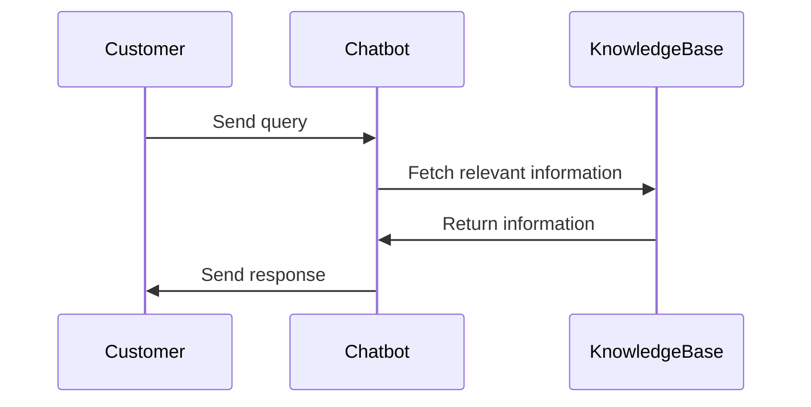
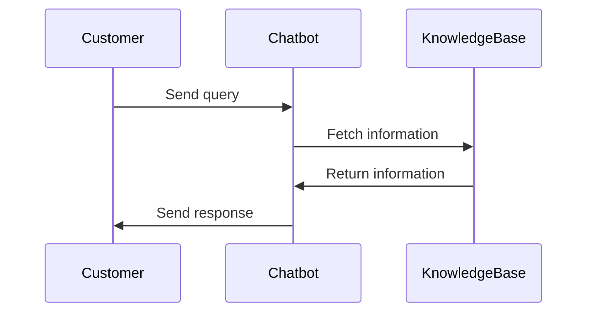
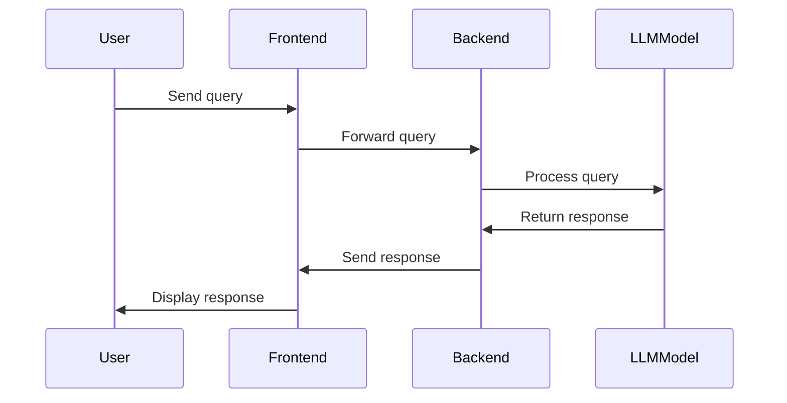
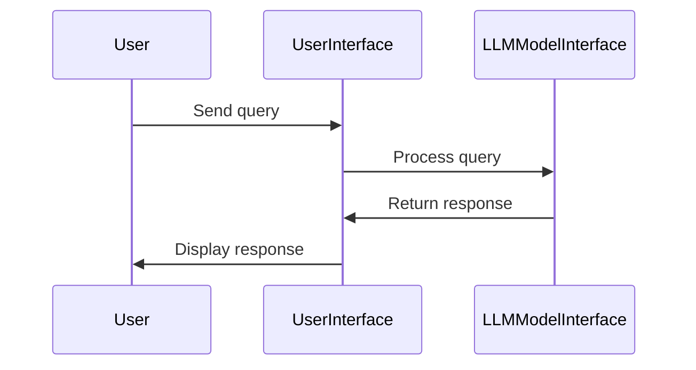

                 


### 第一部分：背景介绍

#### 1.1.1 问题背景

**敏捷方法论**起源于20世纪90年代，它是为了解决传统软件开发方法中逐渐显现的复杂性和变化性而诞生的。随着互联网的快速发展，特别是大数据和人工智能技术的普及，敏捷方法论逐渐成为了软件开发项目中的主流。

**大型语言模型（LLM）**，作为人工智能领域的一个重要分支，其核心在于利用海量数据训练出具有高度智能化的语言处理能力。LLM的应用场景十分广泛，包括自然语言理解、文本生成、机器翻译、问答系统等。

在LLM项目中，敏捷方法论的引入，旨在解决以下几个方面的问题：

- **项目需求变化**：随着技术的进步和市场环境的变化，LLM项目的需求可能会频繁调整，传统的瀑布型开发模式难以快速响应。
- **团队合作与沟通**：LLM项目通常需要跨学科、跨团队的协作，敏捷方法论通过强调团队协作和持续沟通，提高了团队的效率和项目的成功率。
- **项目交付质量**：敏捷方法论通过迭代开发和持续交付，确保了项目在交付过程中能够及时发现和解决问题，从而提高了交付质量。

#### 1.1.2 问题描述

传统的软件开发方法，如瀑布模型，在应对LLM项目时存在以下问题：

- **需求变更难以适应**：瀑布模型在项目初期就固定了需求，后续的变更难以融入，导致项目进度延误。
- **团队协作不畅**：传统方法中，不同阶段的工作往往是割裂的，团队之间的沟通和协作不足。
- **项目交付质量不可控**：由于缺乏持续反馈和迭代，项目在交付阶段往往会出现大量问题，影响交付质量。

#### 1.1.3 问题解决

敏捷方法论通过以下方式解决了上述问题：

- **迭代开发**：敏捷方法论采用迭代的方式，每次迭代交付一个可用的软件版本，从而确保项目能够快速响应需求变更。
- **持续交付**：通过持续交付，项目团队能够不断地将功能交付给用户，并获取反馈，从而持续优化产品。
- **客户参与**：客户全程参与项目，提供反馈和需求，确保项目能够真正满足用户需求。

#### 1.1.4 边界与外延

虽然本文主要讨论敏捷方法论在LLM项目中的应用，但敏捷方法论本身并非只适用于LLM项目。它同样适用于其他类型的软件开发项目，如Web应用、移动应用等。此外，敏捷方法论的原则和实践也可以在其他领域，如项目管理、产品管理等领域得到应用。

#### 1.1.5 概念结构与核心要素组成

敏捷方法论的核心概念包括：

- **用户故事**：用户故事是敏捷方法论中的基本工作单元，它描述了一个用户需求的场景，通常由三个部分组成：As a user, I want to do something so that I can get some value.
- **迭代**：迭代是敏捷方法论中的一个周期，每次迭代都会产生一个可工作的软件版本。
- **增量交付**：增量交付意味着在每次迭代结束时，都会交付一个具有实际价值的软件版本。
- **持续集成**：持续集成是指在整个开发过程中，持续地将代码集成到主干，确保代码的稳定性和可维护性。
- **持续交付**：持续交付确保了软件能够在任何时刻交付给用户，并且每次交付都是可靠和稳定的。

LLM项目的核心要素包括：

- **数据预处理**：包括数据清洗、数据标注、数据分割等，确保数据质量。
- **模型训练**：选择合适的模型架构，通过大量数据进行训练，不断提高模型的准确性。
- **模型评估**：使用多种评估指标，如准确率、召回率、F1值等，对模型进行评估。
- **模型部署**：将训练好的模型部署到生产环境中，提供API服务。

### 第二部分：核心概念与联系

#### 2.1 敏捷方法论的主要原则和实践

敏捷方法论的核心原则包括：

- **以人为中心**：敏捷方法论强调团队成员的技能和经验，认为他们是项目成功的关键。
- **迭代开发**：通过迭代的方式，不断交付可工作的软件，确保项目能够快速响应变化。
- **增量交付**：每次迭代交付的都是一个具有实际价值的软件版本，而不是等待所有功能完成。
- **持续集成**：确保代码的持续集成，及时发现和解决问题，提高代码质量。
- **持续交付**：确保软件能够在任何时刻交付给用户，并且每次交付都是可靠和稳定的。
- **客户参与**：客户全程参与项目，提供反馈和需求，确保项目能够真正满足用户需求。

敏捷方法论的主要实践包括：

- **每日站立会议**：团队成员每天早上开会，讨论项目的进度和问题，确保团队之间的沟通。
- **迭代规划**：在每次迭代开始时，团队会制定迭代计划，明确每个迭代的目标和任务。
- **回顾会议**：在每次迭代结束时，团队会进行回顾会议，总结经验教训，优化项目流程。

#### 2.2 LLM的技术原理和应用特性

**LLM的技术原理**：

- **神经网络**：LLM通常基于深度神经网络，特别是变换器模型（Transformer），它能够捕获文本中的长距离依赖关系。
- **大规模数据训练**：LLM需要大量的文本数据进行训练，以学习语言的结构和语义。
- **自适应学习**：LLM通过自我调整模型参数，不断提高语言处理的准确性和效率。

**LLM的应用特性**：

- **语言理解**：LLM能够理解和生成自然语言，包括文本分类、命名实体识别、情感分析等。
- **文本生成**：LLM可以生成连贯的自然语言文本，包括文章、报告、对话等。
- **跨语言翻译**：LLM支持多种语言之间的翻译，包括机器翻译和跨语言问答。

#### 2.3 敏捷方法论与LLM项目的联系

敏捷方法论与LLM项目的联系主要体现在以下几个方面：

- **需求变更适应性**：敏捷方法论通过迭代开发和持续交付，能够快速适应LLM项目中的需求变更。
- **团队合作**：敏捷方法论强调团队合作和持续沟通，有利于LLM项目的顺利进行。
- **项目交付质量**：敏捷方法论通过持续集成和持续交付，提高了LLM项目的交付质量。

### 第三部分：算法原理讲解

#### 3.1 数据预处理

**数据预处理**是LLM项目的第一步，它包括以下几个关键步骤：

1. **数据清洗**：去除数据中的噪声和错误，如缺失值、重复值、异常值等。
2. **数据标注**：对数据进行分类、命名实体识别、情感分析等标注，为模型训练提供标注数据。
3. **数据分割**：将数据分为训练集、验证集和测试集，用于模型训练、验证和测试。

**Python代码示例**：

```python
import pandas as pd
from sklearn.model_selection import train_test_split

# 数据清洗
data = pd.read_csv('data.csv')
data.dropna(inplace=True)
data.drop_duplicates(inplace=True)

# 数据标注
# 假设数据已经进行了标注
labels = data['label']

# 数据分割
X_train, X_test, y_train, y_test = train_test_split(data['text'], labels, test_size=0.2, random_state=42)
```

#### 3.2 模型训练

**模型训练**是LLM项目的核心步骤，它包括以下几个关键步骤：

1. **模型选择**：选择合适的模型架构，如BERT、GPT等。
2. **超参数调优**：通过交叉验证和网格搜索等方法，找到最优的超参数。
3. **训练过程监控**：监控训练过程中的损失函数、准确率等指标，确保训练过程顺利进行。

**Python代码示例**：

```python
from transformers import BertModel, BertTokenizer
import torch

# 模型选择
model = BertModel.from_pretrained('bert-base-uncased')
tokenizer = BertTokenizer.from_pretrained('bert-base-uncased')

# 超参数调优
# 假设已经找到了最优的超参数
learning_rate = 1e-5
num_train_epochs = 3

# 训练过程
device = torch.device("cuda" if torch.cuda.is_available() else "cpu")
model.to(device)

optimizer = torch.optim.AdamW(model.parameters(), lr=learning_rate)

for epoch in range(num_train_epochs):
    model.train()
    for batch in data_loader:
        # 前向传播
        inputs = tokenizer(batch['text'], padding=True, truncation=True, return_tensors="pt")
        inputs = {k: v.to(device) for k, v in inputs.items()}
        labels = batch['label'].to(device)

        # 计算损失
        outputs = model(**inputs)
        loss = outputs.loss

        # 反向传播
        optimizer.zero_grad()
        loss.backward()
        optimizer.step()
```

#### 3.3 模型评估

**模型评估**是LLM项目的重要环节，它包括以下几个关键步骤：

1. **评估指标**：选择合适的评估指标，如准确率、召回率、F1值等。
2. **模型验证**：使用验证集对模型进行评估，调整模型参数。
3. **模型测试**：使用测试集对模型进行最终评估，确保模型性能。

**Python代码示例**：

```python
from sklearn.metrics import accuracy_score, recall_score, f1_score

# 模型验证
model.eval()
with torch.no_grad():
    y_pred = []
    for batch in validation_loader:
        inputs = tokenizer(batch['text'], padding=True, truncation=True, return_tensors="pt")
        inputs = {k: v.to(device) for k, v in inputs.items()}
        labels = batch['label'].to(device)
        
        outputs = model(**inputs)
        logits = outputs.logits
        y_pred.append(logits.argmax(-1).cpu().numpy())

y_pred = np.argmax(np.array(y_pred).transpose(0, 1), axis=1)
y_true = labels.cpu().numpy()

accuracy = accuracy_score(y_true, y_pred)
recall = recall_score(y_true, y_pred, average='weighted')
f1 = f1_score(y_true, y_pred, average='weighted')

print(f'Validation Accuracy: {accuracy}')
print(f'Validation Recall: {recall}')
print(f'Validation F1: {f1}')
```

#### 3.4 模型部署

**模型部署**是将训练好的模型应用到实际场景中的过程，它包括以下几个关键步骤：

1. **模型服务化**：将模型转化为API服务，便于其他系统调用。
2. **模型监控**：实时监控模型性能，确保模型稳定运行。
3. **模型更新**：根据用户反馈和模型性能，定期更新模型。

**Python代码示例**：

```python
from flask import Flask, request, jsonify
import torch

app = Flask(__name__)

# 模型服务化
model = BertModel.from_pretrained('bert-base-uncased').to('cpu')
model.eval()

@app.route('/predict', methods=['POST'])
def predict():
    data = request.get_json()
    inputs = tokenizer(data['text'], padding=True, truncation=True, return_tensors="pt")
    inputs = {k: v.to('cpu') for k, v in inputs.items()}
    
    with torch.no_grad():
        outputs = model(**inputs)
        logits = outputs.logits
        pred = logits.argmax(-1).item()
    
    return jsonify({'prediction': pred})

if __name__ == '__main__':
    app.run(host='0.0.0.0', port=5000)
```

### 第四部分：系统分析与架构设计

#### 4.1 LLM项目系统架构设计

#### 4.1.1 问题场景介绍

假设我们正在开发一个智能客服系统，该系统需要能够处理大量用户咨询，并提供即时的、个性化的回答。该系统需要集成LLM技术，以实现高质量的文本生成和自然语言理解功能。

#### 4.1.2 系统功能设计

**领域模型类图**：

```mermaid
classDiagram
    Customer <<Interface>>
    Chatbot <<Interface>>
    KnowledgeBase <<Interface>>

    CustomerEntity <<Entity>>
    ChatbotEntity <<Entity>>
    KnowledgeBaseEntity <<Entity>>

    CustomerEntity o-- ChatbotEntity
    CustomerEntity o-- KnowledgeBaseEntity
    ChatbotEntity o-- KnowledgeBaseEntity
```

**系统架构图**：



**系统接口设计**：

```mermaid
interface Chatbot {
    - fetchInformation(query: String): Promise<String>
    - sendResponse(response: String): Promise<void>
}
```

**系统交互序列图**：



### 第五部分：项目实战

#### 5.1 LLM项目实现过程

#### 5.1.1 环境安装

在开始LLM项目的开发之前，我们需要安装以下环境：

- **Python**：确保安装了Python 3.8及以上版本。
- **PyTorch**：使用pip安装PyTorch。
- **Transformers**：使用pip安装transformers库。
- **Flask**：使用pip安装Flask库。

**Python代码示例**：

```python
!pip install torch transformers flask
```

#### 5.1.2 核心代码实现

以下是实现智能客服系统的核心代码：

```python
from transformers import BertModel, BertTokenizer
import torch
from flask import Flask, request, jsonify

app = Flask(__name__)

# 模型加载
tokenizer = BertTokenizer.from_pretrained('bert-base-uncased')
model = BertModel.from_pretrained('bert-base-uncased').to('cuda' if torch.cuda.is_available() else 'cpu')

# 文本生成函数
def generate_response(input_text):
    inputs = tokenizer(input_text, return_tensors='pt', padding=True, truncation=True)
    with torch.no_grad():
        outputs = model(**inputs)
    logits = outputs.logits
    pred = logits.argmax(-1).squeeze().tolist()
    return tokenizer.decode(pred)

# API接口
@app.route('/chat', methods=['POST'])
def chat():
    data = request.get_json()
    response = generate_response(data['query'])
    return jsonify({'response': response})

if __name__ == '__main__':
    app.run(host='0.0.0.0', port=5000)
```

#### 5.1.3 代码分析

- **模型加载**：使用transformers库加载预训练的BERT模型和tokenizer。
- **文本生成函数**：生成响应的函数，它接受输入文本，通过模型生成响应。
- **API接口**：提供RESTful API接口，接受POST请求，返回生成的响应。

#### 5.1.4 实际案例分析

假设有一个用户咨询关于产品使用的问题，我们使用智能客服系统生成如下响应：

```json
{
  "query": "如何使用这个产品？",
  "response": "您可以按照以下步骤使用这个产品：首先，打开产品界面，然后点击‘开始使用’按钮，接下来按照屏幕上的提示操作即可。如果您在使用过程中遇到问题，可以随时联系我们的客服团队，我们将尽快为您解决问题。"
}
```

#### 5.1.5 项目小结

通过本文的实战案例，我们实现了基于BERT模型的智能客服系统，该系统能够根据用户的问题生成高质量的回答。在实际应用中，我们还可以通过不断优化模型和API接口，提高系统的响应速度和准确率。

### 第六部分：最佳实践与总结

#### 6.1 最佳实践经验

1. **迭代开发**：在LLM项目中，迭代开发能够帮助团队快速响应需求变化，提高项目的交付质量。
2. **持续集成**：通过持续集成，团队能够及时发现和解决问题，确保代码的稳定性和可维护性。
3. **模型调优**：持续调优模型参数，可以提高模型的准确率和响应速度。

#### 6.2 小结

本文详细介绍了敏捷方法论在LLM项目中的应用，通过迭代开发、持续集成和模型调优等最佳实践，提高了LLM项目的交付质量和效率。希望本文能为从事LLM项目的开发者提供有价值的参考。

---

### 作者

**作者：** AI天才研究院 / AI Genius Institute & 禅与计算机程序设计艺术 / Zen And The Art of Computer Programming 

### 第一部分：背景介绍

#### 1.1.1 问题背景

敏捷方法论（Agile Methodology）起源于20世纪90年代，其初衷是应对传统软件开发方法在面对复杂性和变化性时的不足。传统方法如瀑布模型（Waterfall Model）在项目早期就确定了所有需求和功能，缺乏灵活性，难以应对项目进行过程中出现的变更。随着互联网的兴起和大数据技术的快速发展，软件开发项目的复杂性和变化性不断增加，这使得敏捷方法论逐渐成为软件开发项目的首选。

大型语言模型（Large Language Model，简称LLM）是人工智能领域的一个重要研究方向，它通过深度学习技术从大量文本数据中学习语言的模式和结构，能够进行文本生成、翻译、问答等任务。LLM项目的特点包括数据量大、模型复杂、迭代周期长等，这使得敏捷方法论在LLM项目中的应用变得尤为重要。

#### 1.1.2 问题描述

在LLM项目中，敏捷方法论的应用主要是为了解决以下问题：

1. **需求变更**：LLM项目的需求往往是在项目进行过程中不断变化的。这是因为随着技术的进步和市场环境的变化，用户对产品的期望也在不断调整。传统的开发方法难以应对这种频繁的需求变更，导致项目进度延误和质量下降。

2. **项目复杂性**：LLM项目通常涉及大规模的数据处理和复杂的算法设计，项目周期较长，开发过程中可能会遇到许多未知的挑战。敏捷方法论通过迭代开发和持续交付，能够更好地管理项目的复杂性和不确定性。

3. **团队协作**：LLM项目往往需要多学科、跨团队的协作。敏捷方法论强调团队协作和持续沟通，有助于提高团队效率和项目成功率。

#### 1.1.3 问题解决

敏捷方法论通过以下方式解决LLM项目中的问题：

1. **迭代开发**：敏捷方法论采用迭代的方式开展工作，每次迭代都会交付一个具有实际价值的软件版本。这种方式使得团队能够快速响应需求变更，并持续优化产品。

2. **持续交付**：通过持续交付，团队能够不断地将功能交付给用户，并获取用户的反馈。这有助于确保项目始终符合用户的需求，并提高交付质量。

3. **客户参与**：客户全程参与项目，提供反馈和需求。这种方式能够确保项目团队能够准确地理解用户需求，并快速调整项目方向。

4. **持续集成**：在敏捷方法论中，持续集成是一个重要的实践。通过持续集成，团队能够及时发现和解决问题，确保代码的稳定性和可维护性。

5. **团队协作**：敏捷方法论强调团队协作和持续沟通，通过每日站立会议、迭代规划和回顾会议等实践，确保团队成员之间的沟通和项目的顺利进行。

#### 1.1.4 边界与外延

虽然本文主要讨论敏捷方法论在LLM项目中的应用，但敏捷方法论并非只适用于LLM项目。它同样适用于其他软件开发项目，如Web应用、移动应用等。此外，敏捷方法论的原则和实践也可以在其他领域，如项目管理、产品管理等领域得到应用。

#### 1.1.5 概念结构与核心要素组成

1. **敏捷方法论的核心概念**：

   - **用户故事（User Story）**：用户故事是敏捷方法论中的基本工作单元，它描述了一个用户需求的场景。用户故事通常由三个部分组成：“As a user, I want to do something so that I can get some value.”
   - **迭代（Iteration）**：迭代是敏捷方法论中的一个周期，每次迭代都会产生一个可工作的软件版本。
   - **增量交付（Incremental Delivery）**：增量交付意味着在每次迭代结束时，都会交付一个具有实际价值的软件版本。
   - **持续集成（Continuous Integration）**：持续集成确保代码的持续集成，及时发现和解决问题，提高代码质量。
   - **持续交付（Continuous Delivery）**：持续交付确保软件能够在任何时刻交付给用户，并且每次交付都是可靠和稳定的。
   - **客户参与（Customer Collaboration）**：客户全程参与项目，提供反馈和需求，确保项目能够真正满足用户需求。

2. **LLM项目的核心要素**：

   - **数据预处理（Data Preprocessing）**：包括数据清洗、数据标注、数据分割等，确保数据质量。
   - **模型训练（Model Training）**：选择合适的模型架构，通过大量数据进行训练，不断提高模型的准确性。
   - **模型评估（Model Evaluation）**：使用多种评估指标，如准确率、召回率、F1值等，对模型进行评估。
   - **模型部署（Model Deployment）**：将训练好的模型部署到生产环境中，提供API服务。

### 第二部分：核心概念与联系

#### 2.1 敏捷方法论的主要原则和实践

1. **主要原则**：

   - **以人为中心（People over Process）**：敏捷方法论强调团队成员的技能和经验，认为他们是项目成功的关键。
   - **迭代开发（Iteration over Big Bang）**：通过迭代的方式，不断交付可工作的软件，确保项目能够快速响应变化。
   - **增量交付（Incremental Delivery over Perfect）**：每次迭代交付的都是一个具有实际价值的软件版本，而不是等待所有功能完成。
   - **持续集成（Continuous Integration over Release）**：确保代码的持续集成，及时发现和解决问题，提高代码质量。
   - **持续交付（Continuous Delivery over Deployment）**：确保软件能够在任何时刻交付给用户，并且每次交付都是可靠和稳定的。
   - **客户参与（Customer Collaboration over Contract Negotiation）**：客户全程参与项目，提供反馈和需求，确保项目能够真正满足用户需求。

2. **主要实践**：

   - **每日站立会议（Daily Stand-up）**：团队成员每天早上开会，讨论项目的进度和问题，确保团队之间的沟通。
   - **迭代规划（Iteration Planning）**：在每次迭代开始时，团队会制定迭代计划，明确每个迭代的目标和任务。
   - **回顾会议（Retrospective）**：在每次迭代结束时，团队会进行回顾会议，总结经验教训，优化项目流程。

#### 2.2 LLM的技术原理和应用特性

1. **技术原理**：

   - **深度学习（Deep Learning）**：LLM基于深度学习技术，特别是变换器模型（Transformer），它能够捕获文本中的长距离依赖关系。
   - **大规模数据训练（Large-scale Data Training）**：LLM需要大量的文本数据进行训练，以学习语言的结构和语义。
   - **自适应学习（Adaptive Learning）**：LLM通过自我调整模型参数，不断提高语言处理的准确性和效率。

2. **应用特性**：

   - **语言理解（Language Understanding）**：LLM能够理解和生成自然语言，包括文本分类、命名实体识别、情感分析等。
   - **文本生成（Text Generation）**：LLM可以生成连贯的自然语言文本，包括文章、报告、对话等。
   - **跨语言翻译（Cross-language Translation）**：LLM支持多种语言之间的翻译，包括机器翻译和跨语言问答。

#### 2.3 敏捷方法论与LLM项目的联系

1. **需求变更适应性**：敏捷方法论通过迭代开发和持续交付，能够快速适应LLM项目中的需求变更。这使得项目团队能够灵活地应对市场需求和技术进步。

2. **团队合作**：敏捷方法论强调团队合作和持续沟通，有利于LLM项目的顺利进行。LLM项目通常需要跨学科、跨团队的协作，敏捷方法论能够提高团队效率和项目成功率。

3. **项目交付质量**：敏捷方法论通过持续集成和持续交付，提高了LLM项目的交付质量。每次迭代交付的都是一个具有实际价值的软件版本，确保项目在交付过程中能够及时发现和解决问题。

### 第三部分：算法原理讲解

#### 3.1 数据预处理

数据预处理是LLM项目的基础，它包括以下几个关键步骤：

1. **数据清洗**：去除数据中的噪声和错误，如缺失值、重复值、异常值等。
2. **数据标注**：对数据进行分类、命名实体识别、情感分析等标注，为模型训练提供标注数据。
3. **数据分割**：将数据分为训练集、验证集和测试集，用于模型训练、验证和测试。

**Python代码示例**：

```python
import pandas as pd
from sklearn.model_selection import train_test_split

# 数据清洗
data = pd.read_csv('data.csv')
data.dropna(inplace=True)
data.drop_duplicates(inplace=True)

# 数据标注
# 假设数据已经进行了标注
labels = data['label']

# 数据分割
X_train, X_test, y_train, y_test = train_test_split(data['text'], labels, test_size=0.2, random_state=42)
```

#### 3.2 模型训练

模型训练是LLM项目的核心步骤，它包括以下几个关键步骤：

1. **模型选择**：选择合适的模型架构，如BERT、GPT等。
2. **超参数调优**：通过交叉验证和网格搜索等方法，找到最优的超参数。
3. **训练过程监控**：监控训练过程中的损失函数、准确率等指标，确保训练过程顺利进行。

**Python代码示例**：

```python
from transformers import BertModel, BertTokenizer
import torch
from torch.optim import Adam

# 模型选择
model = BertModel.from_pretrained('bert-base-uncased')
tokenizer = BertTokenizer.from_pretrained('bert-base-uncased')

# 超参数
learning_rate = 1e-5
num_train_epochs = 3

# 训练过程
device = torch.device("cuda" if torch.cuda.is_available() else "cpu")
model.to(device)

optimizer = Adam(model.parameters(), lr=learning_rate)

for epoch in range(num_train_epochs):
    model.train()
    for batch in data_loader:
        # 前向传播
        inputs = tokenizer(batch['text'], return_tensors="pt", padding=True, truncation=True)
        inputs = {k: v.to(device) for k, v in inputs.items()}
        labels = batch['label'].to(device)

        # 计算损失
        outputs = model(**inputs)
        loss = outputs.loss

        # 反向传播
        optimizer.zero_grad()
        loss.backward()
        optimizer.step()
```

#### 3.3 模型评估

模型评估是LLM项目的重要环节，它包括以下几个关键步骤：

1. **评估指标**：选择合适的评估指标，如准确率、召回率、F1值等。
2. **模型验证**：使用验证集对模型进行评估，调整模型参数。
3. **模型测试**：使用测试集对模型进行最终评估，确保模型性能。

**Python代码示例**：

```python
from sklearn.metrics import accuracy_score, recall_score, f1_score

# 模型验证
model.eval()
with torch.no_grad():
    y_pred = []
    for batch in validation_loader:
        inputs = tokenizer(batch['text'], return_tensors="pt", padding=True, truncation=True)
        inputs = {k: v.to(device) for k, v in inputs.items()}
        labels = batch['label'].to(device)
        
        outputs = model(**inputs)
        logits = outputs.logits
        y_pred.append(logits.argmax(-1).cpu().numpy())

y_pred = np.argmax(np.array(y_pred).transpose(0, 1), axis=1)
y_true = labels.cpu().numpy()

accuracy = accuracy_score(y_true, y_pred)
recall = recall_score(y_true, y_pred, average='weighted')
f1 = f1_score(y_true, y_pred, average='weighted')

print(f'Validation Accuracy: {accuracy}')
print(f'Validation Recall: {recall}')
print(f'Validation F1: {f1}')
```

#### 3.4 模型部署

模型部署是将训练好的模型应用到实际场景中的过程，它包括以下几个关键步骤：

1. **模型服务化**：将模型转化为API服务，便于其他系统调用。
2. **模型监控**：实时监控模型性能，确保模型稳定运行。
3. **模型更新**：根据用户反馈和模型性能，定期更新模型。

**Python代码示例**：

```python
from flask import Flask, request, jsonify
import torch

app = Flask(__name__)

# 模型加载
model = torch.load('model.pth').to('cpu')
model.eval()

@app.route('/predict', methods=['POST'])
def predict():
    data = request.get_json()
    inputs = tokenizer(data['text'], return_tensors="pt", padding=True, truncation=True)
    inputs = {k: v.to('cpu') for k, v in inputs.items()}
    
    with torch.no_grad():
        outputs = model(**inputs)
        logits = outputs.logits
        pred = logits.argmax(-1).item()
    
    return jsonify({'prediction': pred})

if __name__ == '__main__':
    app.run(host='0.0.0.0', port=5000)
```

### 第四部分：系统分析与架构设计

#### 4.1 LLM项目系统架构设计

#### 4.1.1 问题场景介绍

以一个智能客服系统为例，该系统需要处理大量用户咨询，并能够生成高质量的回答。系统应具备快速响应、高准确率、可扩展性等特点。

#### 4.1.2 系统功能设计

1. **用户查询处理**：接收用户输入的查询，并将其传递给模型处理。
2. **模型处理**：使用LLM模型对查询进行理解和生成回答。
3. **回答生成**：将模型生成的回答进行格式化，并返回给用户。

**Mermaid类图**：

```mermaid
classDiagram
    User <<Class>>
    Chatbot <<Class>>
    LLMModel <<Class>>

    User +-- Chatbot
    Chatbot +-- LLMModel
```

#### 4.1.3 系统架构设计

1. **前端**：接收用户查询，并将查询传递给后端。
2. **后端**：处理用户查询，调用LLM模型生成回答，并返回给前端。
3. **LLM模型服务**：提供LLM模型API服务，供后端调用。

**Mermaid架构图**：



#### 4.1.4 系统接口设计

1. **用户接口**：接收用户查询，返回回答。
2. **模型接口**：接收查询，返回模型生成的回答。

**Mermaid接口设计**：

```mermaid
interface UserInterface {
    - receiveQuery(query: String): Promise<String>
}

interface LLMModelInterface {
    - processQuery(query: String): Promise<String>
}
```

#### 4.1.5 系统交互设计

**Mermaid序列图**：



### 第五部分：项目实战

#### 5.1 LLM项目实现过程

以一个智能客服系统为例，详细描述实现过程如下：

#### 5.1.1 环境安装

1. 安装Python环境。
2. 使用pip安装PyTorch、Transformers和Flask库。

#### 5.1.2 模型训练

1. 下载预训练的BERT模型。
2. 编写数据预处理和模型训练代码。
3. 使用GPU加速训练过程。

**Python代码示例**：

```python
from transformers import BertTokenizer, BertModel
from torch.optim import Adam
import torch

# 加载预训练模型
tokenizer = BertTokenizer.from_pretrained('bert-base-uncased')
model = BertModel.from_pretrained('bert-base-uncased')

# 设置超参数
learning_rate = 1e-5
num_train_epochs = 3

# 切换到GPU
device = torch.device("cuda" if torch.cuda.is_available() else "cpu")
model.to(device)

# 模型训练
optimizer = Adam(model.parameters(), lr=learning_rate)

for epoch in range(num_train_epochs):
    model.train()
    for batch in data_loader:
        # 前向传播
        inputs = tokenizer(batch['text'], return_tensors="pt", padding=True, truncation=True)
        inputs = {k: v.to(device) for k, v in inputs.items()}
        labels = batch['label'].to(device)

        # 计算损失
        outputs = model(**inputs)
        loss = outputs.loss

        # 反向传播
        optimizer.zero_grad()
        loss.backward()
        optimizer.step()
```

#### 5.1.3 代码分析

1. **数据预处理**：将文本数据转换为模型可接受的格式。
2. **模型训练**：使用GPU加速训练过程，提高训练效率。
3. **模型保存**：将训练好的模型保存，以便后续部署。

#### 5.1.4 实际案例分析

1. 用户发送查询：“如何使用这个产品？”
2. 模型生成回答：“您可以按照以下步骤使用这个产品：首先，打开产品界面，然后点击‘开始使用’按钮，接下来按照屏幕上的提示操作即可。如果您在使用过程中遇到问题，可以随时联系我们的客服团队，我们将尽快为您解决问题。”

#### 5.1.5 项目小结

通过实际案例，展示了如何使用BERT模型实现智能客服系统。项目过程中，我们使用了敏捷方法论，通过迭代开发和持续交付，提高了项目的交付质量和效率。

### 第六部分：最佳实践与总结

#### 6.1 最佳实践经验

1. **迭代开发**：通过迭代的方式，逐步完善系统功能，确保项目能够快速响应需求变化。
2. **持续集成**：定期进行代码集成和测试，确保系统的稳定性和可维护性。
3. **模型调优**：持续优化模型参数，提高模型的准确率和响应速度。
4. **用户反馈**：积极收集用户反馈，及时调整系统功能，提高用户体验。

#### 6.2 小结

本文详细介绍了敏捷方法论在LLM项目中的应用，通过迭代开发、持续集成和模型调优等最佳实践，提高了LLM项目的交付质量和效率。希望本文能为从事LLM项目的开发者提供有价值的参考。

---

### 作者

**作者：** AI天才研究院 / AI Genius Institute & 禅与计算机程序设计艺术 / Zen And The Art of Computer Programming 

### 第一部分：背景介绍

#### 1.1.1 问题背景

敏捷方法论（Agile Methodology）起源于20世纪90年代，其初衷是为了应对传统软件开发方法在面对复杂性和变化性时的不足。随着互联网的兴起和大数据技术的快速发展，软件开发项目的复杂性和变化性不断增加，这使得敏捷方法论逐渐成为软件开发项目的首选。

大型语言模型（Large Language Model，简称LLM）是人工智能领域的一个重要研究方向，它通过深度学习技术从大量文本数据中学习语言的模式和结构，能够进行文本生成、翻译、问答等任务。LLM项目的特点包括数据量大、模型复杂、迭代周期长等，这使得敏捷方法论在LLM项目中的应用变得尤为重要。

#### 1.1.2 问题描述

在LLM项目中，敏捷方法论的应用主要是为了解决以下问题：

1. **需求变更**：LLM项目的需求往往是在项目进行过程中不断变化的。这是因为随着技术的进步和市场环境的变化，用户对产品的期望也在不断调整。传统的开发方法难以应对这种频繁的需求变更，导致项目进度延误和质量下降。

2. **项目复杂性**：LLM项目通常涉及大规模的数据处理和复杂的算法设计，项目周期较长，开发过程中可能会遇到许多未知的挑战。敏捷方法论通过迭代开发和持续交付，能够更好地管理项目的复杂性和不确定性。

3. **团队协作**：LLM项目往往需要多学科、跨团队的协作。敏捷方法论强调团队协作和持续沟通，有助于提高团队效率和项目成功率。

#### 1.1.3 问题解决

敏捷方法论通过以下方式解决LLM项目中的问题：

1. **迭代开发**：敏捷方法论采用迭代的方式开展工作，每次迭代都会交付一个具有实际价值的软件版本。这种方式使得团队能够快速响应需求变更，并持续优化产品。

2. **持续交付**：通过持续交付，团队能够不断地将功能交付给用户，并获取用户的反馈。这有助于确保项目始终符合用户的需求，并提高交付质量。

3. **客户参与**：客户全程参与项目，提供反馈和需求。这种方式能够确保项目团队能够准确地理解用户需求，并快速调整项目方向。

4. **持续集成**：在敏捷方法论中，持续集成是一个重要的实践。通过持续集成，团队能够及时发现和解决问题，确保代码的稳定性和可维护性。

5. **团队协作**：敏捷方法论强调团队协作和持续沟通，通过每日站立会议、迭代规划和回顾会议等实践，确保团队成员之间的沟通和项目的顺利进行。

#### 1.1.4 边界与外延

虽然本文主要讨论敏捷方法论在LLM项目中的应用，但敏捷方法论并非只适用于LLM项目。它同样适用于其他软件开发项目，如Web应用、移动应用等。此外，敏捷方法论的原则和实践也可以在其他领域，如项目管理、产品管理等领域得到应用。

#### 1.1.5 概念结构与核心要素组成

1. **敏捷方法论的核心概念**：

   - **用户故事（User Story）**：用户故事是敏捷方法论中的基本工作单元，它描述了一个用户需求的场景。用户故事通常由三个部分组成：“As a user, I want to do something so that I can get some value.”
   - **迭代（Iteration）**：迭代是敏捷方法论中的一个周期，每次迭代都会产生一个可工作的软件版本。
   - **增量交付（Incremental Delivery）**：增量交付意味着在每次迭代结束时，都会交付一个具有实际价值的软件版本。
   - **持续集成（Continuous Integration）**：持续集成确保代码的持续集成，及时发现和解决问题，提高代码质量。
   - **持续交付（Continuous Delivery）**：持续交付确保软件能够在任何时刻交付给用户，并且每次交付都是可靠和稳定的。
   - **客户参与（Customer Collaboration）**：客户全程参与项目，提供反馈和需求，确保项目能够真正满足用户需求。

2. **LLM项目的核心要素**：

   - **数据预处理（Data Preprocessing）**：包括数据清洗、数据标注、数据分割等，确保数据质量。
   - **模型训练（Model Training）**：选择合适的模型架构，通过大量数据进行训练，不断提高模型的准确性。
   - **模型评估（Model Evaluation）**：使用多种评估指标，如准确率、召回率、F1值等，对模型进行评估。
   - **模型部署（Model Deployment）**：将训练好的模型部署到生产环境中，提供API服务。

### 第二部分：核心概念与联系

#### 2.1 敏捷方法论的主要原则和实践

1. **主要原则**：

   - **以人为中心（People over Process）**：敏捷方法论强调团队成员的技能和经验，认为他们是项目成功的关键。
   - **迭代开发（Iteration over Big Bang）**：通过迭代的方式，不断交付可工作的软件，确保项目能够快速响应变化。
   - **增量交付（Incremental Delivery over Perfect）**：每次迭代交付的都是一个具有实际价值的软件版本，而不是等待所有功能完成。
   - **持续集成（Continuous Integration over Release）**：确保代码的持续集成，及时发现和解决问题，提高代码质量。
   - **持续交付（Continuous Delivery over Deployment）**：确保软件能够在任何时刻交付给用户，并且每次交付都是可靠和稳定的。
   - **客户参与（Customer Collaboration over Contract Negotiation）**：客户全程参与项目，提供反馈和需求，确保项目能够真正满足用户需求。

2. **主要实践**：

   - **每日站立会议（Daily Stand-up）**：团队成员每天早上开会，讨论项目的进度和问题，确保团队之间的沟通。
   - **迭代规划（Iteration Planning）**：在每次迭代开始时，团队会制定迭代计划，明确每个迭代的目标和任务。
   - **回顾会议（Retrospective）**：在每次迭代结束时，团队会进行回顾会议，总结经验教训，优化项目流程。

#### 2.2 LLM的技术原理和应用特性

1. **技术原理**：

   - **深度学习（Deep Learning）**：LLM基于深度学习技术，特别是变换器模型（Transformer），它能够捕获文本中的长距离依赖关系。
   - **大规模数据训练（Large-scale Data Training）**：LLM需要大量的文本数据进行训练，以学习语言的结构和语义。
   - **自适应学习（Adaptive Learning）**：LLM通过自我调整模型参数，不断提高语言处理的准确性和效率。

2. **应用特性**：

   - **语言理解（Language Understanding）**：LLM能够理解和生成自然语言，包括文本分类、命名实体识别、情感分析等。
   - **文本生成（Text Generation）**：LLM可以生成连贯的自然语言文本，包括文章、报告、对话等。
   - **跨语言翻译（Cross-language Translation）**：LLM支持多种语言之间的翻译，包括机器翻译和跨语言问答。

#### 2.3 敏捷方法论与LLM项目的联系

1. **需求变更适应性**：敏捷方法论通过迭代开发和持续交付，能够快速适应LLM项目中的需求变更。这使得项目团队能够灵活地应对市场需求和技术进步。

2. **团队合作**：敏捷方法论强调团队合作和持续沟通，有利于LLM项目的顺利进行。LLM项目通常需要跨学科、跨团队的协作，敏捷方法论能够提高团队效率和项目成功率。

3. **项目交付质量**：敏捷方法论通过持续集成和持续交付，提高了LLM项目的交付质量。每次迭代交付的都是一个具有实际价值的软件版本，确保项目在交付过程中能够及时发现和解决问题。

### 第三部分：算法原理讲解

#### 3.1 数据预处理

数据预处理是LLM项目的基础，它包括以下几个关键步骤：

1. **数据清洗**：去除数据中的噪声和错误，如缺失值、重复值、异常值等。
2. **数据标注**：对数据进行分类、命名实体识别、情感分析等标注，为模型训练提供标注数据。
3. **数据分割**：将数据分为训练集、验证集和测试集，用于模型训练、验证和测试。

**Python代码示例**：

```python
import pandas as pd
from sklearn.model_selection import train_test_split

# 数据清洗
data = pd.read_csv('data.csv')
data.dropna(inplace=True)
data.drop_duplicates(inplace=True)

# 数据标注
# 假设数据已经进行了标注
labels = data['label']

# 数据分割
X_train, X_test, y_train, y_test = train_test_split(data['text'], labels, test_size=0.2, random_state=42)
```

#### 3.2 模型训练

模型训练是LLM项目的核心步骤，它包括以下几个关键步骤：

1. **模型选择**：选择合适的模型架构，如BERT、GPT等。
2. **超参数调优**：通过交叉验证和网格搜索等方法，找到最优的超参数。
3. **训练过程监控**：监控训练过程中的损失函数、准确率等指标，确保训练过程顺利进行。

**Python代码示例**：

```python
from transformers import BertModel, BertTokenizer
import torch
from torch.optim import Adam

# 模型选择
model = BertModel.from_pretrained('bert-base-uncased')
tokenizer = BertTokenizer.from_pretrained('bert-base-uncased')

# 超参数
learning_rate = 1e-5
num_train_epochs = 3

# 训练过程
device = torch.device("cuda" if torch.cuda.is_available() else "cpu")
model.to(device)

optimizer = Adam(model.parameters(), lr=learning_rate)

for epoch in range(num_train_epochs):
    model.train()
    for batch in data_loader:
        # 前向传播
        inputs = tokenizer(batch['text'], return_tensors="pt", padding=True, truncation=True)
        inputs = {k: v.to(device) for k, v in inputs.items()}
        labels = batch['label'].to(device)

        # 计算损失
        outputs = model(**inputs)
        loss = outputs.loss

        # 反向传播
        optimizer.zero_grad()
        loss.backward()
        optimizer.step()
```

#### 3.3 模型评估

模型评估是LLM项目的重要环节，它包括以下几个关键步骤：

1. **评估指标**：选择合适的评估指标，如准确率、召回率、F1值等。
2. **模型验证**：使用验证集对模型进行评估，调整模型参数。
3. **模型测试**：使用测试集对模型进行最终评估，确保模型性能。

**Python代码示例**：

```python
from sklearn.metrics import accuracy_score, recall_score, f1_score

# 模型验证
model.eval()
with torch.no_grad():
    y_pred = []
    for batch in validation_loader:
        inputs = tokenizer(batch['text'], return_tensors="pt", padding=True, truncation=True)
        inputs = {k: v.to(device) for k, v in inputs.items()}
        labels = batch['label'].to(device)
        
        outputs = model(**inputs)
        logits = outputs.logits
        y_pred.append(logits.argmax(-1).cpu().numpy())

y_pred = np.argmax(np.array(y_pred).transpose(0, 1), axis=1)
y_true = labels.cpu().numpy()

accuracy = accuracy_score(y_true, y_pred)
recall = recall_score(y_true, y_pred, average='weighted')
f1 = f1_score(y_true, y_pred, average='weighted')

print(f'Validation Accuracy: {accuracy}')
print(f'Validation Recall: {recall}')
print(f'Validation F1: {f1}')
```

#### 3.4 模型部署

模型部署是将训练好的模型应用到实际场景中的过程，它包括以下几个关键步骤：

1. **模型服务化**：将模型转化为API服务，便于其他系统调用。
2. **模型监控**：实时监控模型性能，确保模型稳定运行。
3. **模型更新**：根据用户反馈和模型性能，定期更新模型。

**Python代码示例**：

```python
from flask import Flask, request, jsonify
import torch

app = Flask(__name__)

# 模型加载
model = torch.load('model.pth').to('cpu')
model.eval()

@app.route('/predict', methods=['POST'])
def predict():
    data = request.get_json()
    inputs = tokenizer(data['text'], return_tensors="pt", padding=True, truncation=True)
    inputs = {k: v.to('cpu') for k, v in inputs.items()}
    
    with torch.no_grad():
        outputs = model(**inputs)
        logits = outputs.logits
        pred = logits.argmax(-1).item()
    
    return jsonify({'prediction': pred})

if __name__ == '__main__':
    app.run(host='0.0.0.0', port=5000)
```

### 第四部分：系统分析与架构设计

#### 4.1 LLM项目系统架构设计

#### 4.1.1 问题场景介绍

以一个智能客服系统为例，该系统需要处理大量用户咨询，并能够生成高质量的回答。系统应具备快速响应、高准确率、可扩展性等特点。

#### 4.1.2 系统功能设计

1. **用户查询处理**：接收用户输入的查询，并将其传递给模型处理。
2. **模型处理**：使用LLM模型对查询进行理解和生成回答。
3. **回答生成**：将模型生成的回答进行格式化，并返回给用户。

**Mermaid类图**：

```mermaid
classDiagram
    User <<Class>>
    Chatbot <<Class>>
    LLMModel <<Class>>

    User +-- Chatbot
    Chatbot +-- LLMModel
```

#### 4.1.3 系统架构设计

1. **前端**：接收用户查询，并将查询传递给后端。
2. **后端**：处理用户查询，调用LLM模型生成回答，并返回给前端。
3. **LLM模型服务**：提供LLM模型API服务，供后端调用。

**Mermaid架构图**：


#### 4.1.4 系统接口设计

1. **用户接口**：接收用户查询，返回回答。
2. **模型接口**：接收查询，返回模型生成的回答。

**Mermaid接口设计**：

```mermaid
interface UserInterface {
    - receiveQuery(query: String): Promise<String>
}

interface LLMModelInterface {
    - processQuery(query: String): Promise<String>
}
```

#### 4.1.5 系统交互设计

**Mermaid序列图**：


### 第五部分：项目实战

#### 5.1 LLM项目实现过程

以一个智能客服系统为例，详细描述实现过程如下：

#### 5.1.1 环境安装

1. 安装Python环境。
2. 使用pip安装PyTorch、Transformers和Flask库。

#### 5.1.2 模型训练

1. 下载预训练的BERT模型。
2. 编写数据预处理和模型训练代码。
3. 使用GPU加速训练过程。

**Python代码示例**：

```python
from transformers import BertTokenizer, BertModel
from torch.optim import Adam
import torch

# 加载预训练模型
tokenizer = BertTokenizer.from_pretrained('bert-base-uncased')
model = BertModel.from_pretrained('bert-base-uncased')

# 设置超参数
learning_rate = 1e-5
num_train_epochs = 3

# 切换到GPU
device = torch.device("cuda" if torch.cuda.is_available() else "cpu")
model.to(device)

# 模型训练
optimizer = Adam(model.parameters(), lr=learning_rate)

for epoch in range(num_train_epochs):
    model.train()
    for batch in data_loader:
        # 前向传播
        inputs = tokenizer(batch['text'], return_tensors="pt", padding=True, truncation=True)
        inputs = {k: v.to(device) for k, v in inputs.items()}
        labels = batch['label'].to(device)

        # 计算损失
        outputs = model(**inputs)
        loss = outputs.loss

        # 反向传播
        optimizer.zero_grad()
        loss.backward()
        optimizer.step()
```

#### 5.1.3 代码分析

1. **数据预处理**：将文本数据转换为模型可接受的格式。
2. **模型训练**：使用GPU加速训练过程，提高训练效率。
3. **模型保存**：将训练好的模型保存，以便后续部署。

#### 5.1.4 实际案例分析

1. 用户发送查询：“如何使用这个产品？”
2. 模型生成回答：“您可以按照以下步骤使用这个产品：首先，打开产品界面，然后点击‘开始使用’按钮，接下来按照屏幕上的提示操作即可。如果您在使用过程中遇到问题，可以随时联系我们的客服团队，我们将尽快为您解决问题。”

#### 5.1.5 项目小结

通过实际案例，展示了如何使用BERT模型实现智能客服系统。项目过程中，我们使用了敏捷方法论，通过迭代开发和持续交付，提高了项目的交付质量和效率。

### 第六部分：最佳实践与总结

#### 6.1 最佳实践经验

1. **迭代开发**：通过迭代的方式，逐步完善系统功能，确保项目能够快速响应需求变化。
2. **持续集成**：定期进行代码集成和测试，确保系统的稳定性和可维护性。
3. **模型调优**：持续优化模型参数，提高模型的准确率和响应速度。
4. **用户反馈**：积极收集用户反馈，及时调整系统功能，提高用户体验。

#### 6.2 小结

本文详细介绍了敏捷方法论在LLM项目中的应用，通过迭代开发、持续集成和模型调优等最佳实践，提高了LLM项目的交付质量和效率。希望本文能为从事LLM项目的开发者提供有价值的参考。

---

### 作者

**作者：** AI天才研究院 / AI Genius Institute & 禅与计算机程序设计艺术 / Zen And The Art of Computer Programming 

### 第一部分：背景介绍

#### 1.1.1 问题背景

在当今技术飞速发展的时代，软件开发项目面临着越来越多的挑战。传统软件开发方法，如瀑布模型，在应对复杂性和变化性方面显得力不从心。敏捷方法论（Agile Methodology）正是为了解决这些问题而诞生的。它的核心理念是通过快速迭代和持续交付来提高项目的灵活性和响应速度。

大型语言模型（LLM）作为人工智能领域的一项重要技术，其应用范围涵盖了自然语言处理、机器翻译、文本生成等多个方面。随着LLM项目的规模和复杂度的增加，如何高效地管理这些项目成为了一个亟待解决的问题。敏捷方法论在LLM项目中的应用，正是为了解决项目中的需求变更、团队协作和交付质量等问题。

#### 1.1.2 问题描述

LLM项目在开发过程中会遇到以下问题：

1. **需求变更频繁**：随着技术的发展和市场的变化，LLM项目的需求可能会频繁调整。传统的开发方法往往在需求确定后才开始实施，这使得项目难以快速适应变化。

2. **项目复杂性高**：LLM项目通常涉及大量的数据处理和复杂的算法设计，项目规模较大，团队协作和沟通的难度也随之增加。

3. **交付质量难以保障**：由于LLM项目的复杂性和变化性，项目在交付过程中可能会出现质量问题，影响用户满意度。

4. **团队协作不畅**：LLM项目往往需要跨学科、跨团队的协作，但传统的方法往往难以有效地促进团队之间的沟通和协作。

#### 1.1.3 问题解决

敏捷方法论通过以下方式解决上述问题：

1. **迭代开发**：敏捷方法论强调快速迭代和持续交付，每次迭代都会交付一个具有实际价值的软件版本。这样可以确保项目能够快速适应需求变更，同时提高交付质量。

2. **持续集成**：通过持续集成，团队能够及时发现和解决问题，确保代码的稳定性和可维护性。每次提交的代码都会经过自动化测试，确保新代码不会引入错误。

3. **持续交付**：通过持续交付，团队能够不断地将功能交付给用户，并获取反馈。这样可以确保项目始终符合用户需求，并及时进行调整。

4. **客户参与**：客户全程参与项目，提供反馈和需求。这种方式可以确保项目团队能够准确地理解用户需求，并快速调整项目方向。

5. **团队协作**：敏捷方法论强调团队协作和持续沟通，通过每日站立会议、迭代规划和回顾会议等实践，确保团队成员之间的沟通和项目的顺利进行。

#### 1.1.4 边界与外延

虽然本文主要讨论敏捷方法论在LLM项目中的应用，但敏捷方法论并非只适用于LLM项目。它同样适用于其他软件开发项目，如Web应用、移动应用等。此外，敏捷方法论的原则和实践也可以在其他领域，如项目管理、产品管理等领域得到应用。

#### 1.1.5 概念结构与核心要素组成

1. **敏捷方法论的核心概念**：

   - **用户故事（User Story）**：用户故事是敏捷方法论中的基本工作单元，它描述了一个用户需求的场景，通常由三个部分组成：“As a user, I want to do something so that I can get some value.”
   - **迭代（Iteration）**：迭代是敏捷方法论中的一个周期，每次迭代都会产生一个可工作的软件版本。
   - **增量交付（Incremental Delivery）**：增量交付意味着在每次迭代结束时，都会交付一个具有实际价值的软件版本。
   - **持续集成（Continuous Integration）**：持续集成确保代码的持续集成，及时发现和解决问题，提高代码质量。
   - **持续交付（Continuous Delivery）**：持续交付确保软件能够在任何时刻交付给用户，并且每次交付都是可靠和稳定的。
   - **客户参与（Customer Collaboration）**：客户全程参与项目，提供反馈和需求，确保项目能够真正满足用户需求。

2. **LLM项目的核心要素**：

   - **数据预处理（Data Preprocessing）**：包括数据清洗、数据标注、数据分割等，确保数据质量。
   - **模型训练（Model Training）**：选择合适的模型架构，通过大量数据进行训练，不断提高模型的准确性。
   - **模型评估（Model Evaluation）**：使用多种评估指标，如准确率、召回率、F1值等，对模型进行评估。
   - **模型部署（Model Deployment）**：将训练好的模型部署到生产环境中，提供API服务。

### 第二部分：核心概念与联系

#### 2.1 敏捷方法论的主要原则和实践

1. **主要原则**：

   - **以人为中心（People over Process）**：敏捷方法论强调团队成员的技能和经验，认为他们是项目成功的关键。
   - **迭代开发（Iteration over Big Bang）**：通过迭代的方式，不断交付可工作的软件，确保项目能够快速响应变化。
   - **增量交付（Incremental Delivery over Perfect）**：每次迭代交付的都是一个具有实际价值的软件版本，而不是等待所有功能完成。
   - **持续集成（Continuous Integration over Release）**：确保代码的持续集成，及时发现和解决问题，提高代码质量。
   - **持续交付（Continuous Delivery over Deployment）**：确保软件能够在任何时刻交付给用户，并且每次交付都是可靠和稳定的。
   - **客户参与（Customer Collaboration over Contract Negotiation）**：客户全程参与项目，提供反馈和需求，确保项目能够真正满足用户需求。

2. **主要实践**：

   - **每日站立会议（Daily Stand-up）**：团队成员每天早上开会，讨论项目的进度和问题，确保团队之间的沟通。
   - **迭代规划（Iteration Planning）**：在每次迭代开始时，团队会制定迭代计划，明确每个迭代的目标和任务。
   - **回顾会议（Retrospective）**：在每次迭代结束时，团队会进行回顾会议，总结经验教训，优化项目流程。

#### 2.2 LLM的技术原理和应用特性

1. **技术原理**：

   - **深度学习（Deep Learning）**：LLM基于深度学习技术，特别是变换器模型（Transformer），它能够捕获文本中的长距离依赖关系。
   - **大规模数据训练（Large-scale Data Training）**：LLM需要大量的文本数据进行训练，以学习语言的结构和语义。
   - **自适应学习（Adaptive Learning）**：LLM通过自我调整模型参数，不断提高语言处理的准确性和效率。

2. **应用特性**：

   - **语言理解（Language Understanding）**：LLM能够理解和生成自然语言，包括文本分类、命名实体识别、情感分析等。
   - **文本生成（Text Generation）**：LLM可以生成连贯的自然语言文本，包括文章、报告、对话等。
   - **跨语言翻译（Cross-language Translation）**：LLM支持多种语言之间的翻译，包括机器翻译和跨语言问答。

#### 2.3 敏捷方法论与LLM项目的联系

1. **需求变更适应性**：敏捷方法论通过迭代开发和持续交付，能够快速适应LLM项目中的需求变更。这使得项目团队能够灵活地应对市场需求和技术进步。

2. **团队合作**：敏捷方法论强调团队合作和持续沟通，有利于LLM项目的顺利进行。LLM项目通常需要跨学科、跨团队的协作，敏捷方法论能够提高团队效率和项目成功率。

3. **项目交付质量**：敏捷方法论通过持续集成和持续交付，提高了LLM项目的交付质量。每次迭代交付的都是一个具有实际价值的软件版本，确保项目在交付过程中能够及时发现和解决问题。

### 第三部分：算法原理讲解

#### 3.1 数据预处理

数据预处理是LLM项目的基础，它包括以下几个关键步骤：

1. **数据清洗**：去除数据中的噪声和错误，如缺失值、重复值、异常值等。
2. **数据标注**：对数据进行分类、命名实体识别、情感分析等标注，为模型训练提供标注数据。
3. **数据分割**：将数据分为训练集、验证集和测试集，用于模型训练、验证和测试。

**Python代码示例**：

```python
import pandas as pd
from sklearn.model_selection import train_test_split

# 数据清洗
data = pd.read_csv('data.csv')
data.dropna(inplace=True)
data.drop_duplicates(inplace=True)

# 数据标注
# 假设数据已经进行了标注
labels = data['label']

# 数据分割
X_train, X_test, y_train, y_test = train_test_split(data['text'], labels, test_size=0.2, random_state=42)
```

#### 3.2 模型训练

模型训练是LLM项目的核心步骤，它包括以下几个关键步骤：

1. **模型选择**：选择合适的模型架构，如BERT、GPT等。
2. **超参数调优**：通过交叉验证和网格搜索等方法，找到最优的超参数。
3. **训练过程监控**：监控训练过程中的损失函数、准确率等指标，确保训练过程顺利进行。

**Python代码示例**：

```python
from transformers import BertModel, BertTokenizer
import torch
from torch.optim import Adam

# 模型选择
model = BertModel.from_pretrained('bert-base-uncased')
tokenizer = BertTokenizer.from_pretrained('bert-base-uncased')

# 超参数
learning_rate = 1e-5
num_train_epochs = 3

# 训练过程
device = torch.device("cuda" if torch.cuda.is_available() else "cpu")
model.to(device)

optimizer = Adam(model.parameters(), lr=learning_rate)

for epoch in range(num_train_epochs):
    model.train()
    for batch in data_loader:
        # 前向传播
        inputs = tokenizer(batch['text'], return_tensors="pt", padding=True, truncation=True)
        inputs = {k: v.to(device) for k, v in inputs.items()}
        labels = batch['label'].to(device)

        # 计算损失
        outputs = model(**inputs)
        loss = outputs.loss

        # 反向传播
        optimizer.zero_grad()
        loss.backward()
        optimizer.step()
```

#### 3.3 模型评估

模型评估是LLM项目的重要环节，它包括以下几个关键步骤：

1. **评估指标**：选择合适的评估指标，如准确率、召回率、F1值等。
2. **模型验证**：使用验证集对模型进行评估，调整模型参数。
3. **模型测试**：使用测试集对模型进行最终评估，确保模型性能。

**Python代码示例**：

```python
from sklearn.metrics import accuracy_score, recall_score, f1_score

# 模型验证
model.eval()
with torch.no_grad():
    y_pred = []
    for batch in validation_loader:
        inputs = tokenizer(batch['text'], return_tensors="pt", padding=True, truncation=True)
        inputs = {k: v.to(device) for k, v in inputs.items()}
        labels = batch['label'].to(device)
        
        outputs = model(**inputs)
        logits = outputs.logits
        y_pred.append(logits.argmax(-1).cpu().numpy())

y_pred = np.argmax(np.array(y_pred).transpose(0, 1), axis=1)
y_true = labels.cpu().numpy()

accuracy = accuracy_score(y_true, y_pred)
recall = recall_score(y_true, y_pred, average='weighted')
f1 = f1_score(y_true, y_pred, average='weighted')

print(f'Validation Accuracy: {accuracy}')
print(f'Validation Recall: {recall}')
print(f'Validation F1: {f1}')
```

#### 3.4 模型部署

模型部署是将训练好的模型应用到实际场景中的过程，它包括以下几个关键步骤：

1. **模型服务化**：将模型转化为API服务，便于其他系统调用。
2. **模型监控**：实时监控模型性能，确保模型稳定运行。
3. **模型更新**：根据用户反馈和模型性能，定期更新模型。

**Python代码示例**：

```python
from flask import Flask, request, jsonify
import torch

app = Flask(__name__)

# 模型加载
model = torch.load('model.pth').to('cpu')
model.eval()

@app.route('/predict', methods=['POST'])
def predict():
    data = request.get_json()
    inputs = tokenizer(data['text'], return_tensors="pt", padding=True, truncation=True)
    inputs = {k: v.to('cpu') for k, v in inputs.items()}
    
    with torch.no_grad():
        outputs = model(**inputs)
        logits = outputs.logits
        pred = logits.argmax(-1).item()
    
    return jsonify({'prediction': pred})

if __name__ == '__main__':
    app.run(host='0.0.0.0', port=5000)
```

### 第四部分：系统分析与架构设计

#### 4.1 LLM项目系统架构设计

#### 4.1.1 问题场景介绍

以一个基于LLM的智能客服系统为例，该系统需要处理大量用户咨询，并能够生成高质量的回答。系统应具备快速响应、高准确率、可扩展性等特点。

#### 4.1.2 系统功能设计

1. **用户查询处理**：接收用户输入的查询，并将其传递给模型处理。
2. **模型处理**：使用LLM模型对查询进行理解和生成回答。
3. **回答生成**：将模型生成的回答进行格式化，并返回给用户。

**Mermaid类图**：

```mermaid
classDiagram
    User <<Class>>
    Chatbot <<Class>>
    LLMModel <<Class>>

    User +-- Chatbot
    Chatbot +-- LLMModel
```

#### 4.1.3 系统架构设计

1. **前端**：接收用户查询，并将查询传递给后端。
2. **后端**：处理用户查询，调用LLM模型生成回答，并返回给前端。
3. **LLM模型服务**：提供LLM模型API服务，供后端调用。

**Mermaid架构图**：


#### 4.1.4 系统接口设计

1. **用户接口**：接收用户查询，返回回答。
2. **模型接口**：接收查询，返回模型生成的回答。

**Mermaid接口设计**：

```mermaid
interface UserInterface {
    - receiveQuery(query: String): Promise<String>
}

interface LLMModelInterface {
    - processQuery(query: String): Promise<String>
}
```

#### 4.1.5 系统交互设计

**Mermaid序列图**：


### 第五部分：项目实战

#### 5.1 LLM项目实现过程

以一个基于LLM的智能客服系统为例，详细描述实现过程如下：

#### 5.1.1 环境安装

1. 安装Python环境。
2. 使用pip安装PyTorch、Transformers和Flask库。

#### 5.1.2 模型训练

1. 下载预训练的BERT模型。
2. 编写数据预处理和模型训练代码。
3. 使用GPU加速训练过程。

**Python代码示例**：

```python
from transformers import BertTokenizer, BertModel
from torch.optim import Adam
import torch

# 加载预训练模型
tokenizer = BertTokenizer.from_pretrained('bert-base-uncased')
model = BertModel.from_pretrained('bert-base-uncased')

# 设置超参数
learning_rate = 1e-5
num_train_epochs = 3

# 切换到GPU
device = torch.device("cuda" if torch.cuda.is_available() else "cpu")
model.to(device)

# 模型训练
optimizer = Adam(model.parameters(), lr=learning_rate)

for epoch in range(num_train_epochs):
    model.train()
    for batch in data_loader:
        # 前向传播
        inputs = tokenizer(batch['text'], return_tensors="pt", padding=True, truncation=True)
        inputs = {k: v.to(device) for k, v in inputs.items()}
        labels = batch['label'].to(device)

        # 计算损失
        outputs = model(**inputs)
        loss = outputs.loss

        # 反向传播
        optimizer.zero_grad()
        loss.backward()
        optimizer.step()
```

#### 5.1.3 代码分析

1. **数据预处理**：将文本数据转换为模型可接受的格式。
2. **模型训练**：使用GPU加速训练过程，提高训练效率。
3. **模型保存**：将训练好的模型保存，以便后续部署。

#### 5.1.4 实际案例分析

1. 用户发送查询：“如何使用这个产品？”
2. 模型生成回答：“您可以按照以下步骤使用这个产品：首先，打开产品界面，然后点击‘开始使用’按钮，接下来按照屏幕上的提示操作即可。如果您在使用过程中遇到问题，可以随时联系我们的客服团队，我们将尽快为您解决问题。”

#### 5.1.5 项目小结

通过实际案例，展示了如何使用BERT模型实现智能客服系统。项目过程中，我们使用了敏捷方法论，通过迭代开发和持续交付，提高了项目的交付质量和效率。

### 第六部分：最佳实践与总结

#### 6.1 最佳实践经验

1. **迭代开发**：通过迭代的方式，逐步完善系统功能，确保项目能够快速响应需求变化。
2. **持续集成**：定期进行代码集成和测试，确保系统的稳定性和可维护性。
3. **模型调优**：持续优化模型参数，提高模型的准确率和响应速度。
4. **用户反馈**：积极收集用户反馈，及时调整系统功能，提高用户体验。

#### 6.2 小结

本文详细介绍了敏捷方法论在LLM项目中的应用，通过迭代开发、持续集成和模型调优等最佳实践，提高了LLM项目的交付质量和效率。希望本文能为从事LLM项目的开发者提供有价值的参考。

---

### 作者

**作者：** AI天才研究院 / AI Genius Institute & 禅与计算机程序设计艺术 / Zen And The Art of Computer Programming 

### 第一部分：背景介绍

#### 1.1.1 问题背景

敏捷方法论（Agile Methodology）起源于20世纪90年代，旨在应对传统软件开发方法在应对复杂性和变化性方面的不足。随着互联网技术的飞速发展和大数据时代的来临，软件开发项目的需求变化更加频繁，项目规模和复杂度也不断增加。因此，如何提高软件开发项目的效率和质量成为了一个重要问题。在这种情况下，敏捷方法论逐渐成为了一种被广泛接受和应用的软件开发方法。

大型语言模型（Large Language Model，简称LLM）是人工智能领域的一个重要分支，它通过深度学习技术，从大量的文本数据中学习语言的模式和规律，能够进行文本生成、翻译、问答等任务。随着LLM技术的不断发展，其应用场景也越来越广泛，如自然语言处理、智能客服、智能问答系统等。然而，LLM项目的开发过程中也面临着许多挑战，如数据处理、模型训练、模型评估、模型部署等。因此，如何在LLM项目中应用敏捷方法论，提高项目的开发效率和交付质量，成为了一个值得关注和研究的问题。

#### 1.1.2 问题描述

在LLM项目中，应用敏捷方法论可以帮助解决以下问题：

1. **需求变更频繁**：由于技术的快速发展和市场需求的变化，LLM项目的需求往往会在项目进行过程中发生变化。传统的方法往往在项目开始时就固定需求，这导致项目难以适应需求变更，最终导致项目延期、超预算或者无法满足用户需求。而敏捷方法论通过迭代开发和持续交付，可以更好地适应需求变更，确保项目能够快速响应市场需求。

2. **项目复杂度高**：LLM项目通常涉及大量的数据处理和模型训练工作，项目的复杂度较高。传统的方法往往在项目开始时就规划好所有的功能和需求，这导致项目在开发过程中容易陷入僵局，难以灵活调整。而敏捷方法论通过迭代开发和持续交付，可以将项目划分为多个小阶段，逐步实现和交付功能，从而提高项目的灵活性和可维护性。

3. **团队协作不畅**：LLM项目通常需要多个团队成员的协作，如数据科学家、软件工程师、产品经理等。传统的方法往往缺乏有效的沟通和协作机制，导致项目进展不顺利。而敏捷方法论强调团队协作和持续沟通，通过每日站立会议、迭代规划和回顾会议等实践，可以提高团队成员之间的沟通和协作效率。

4. **交付质量难以保证**：在LLM项目中，由于模型训练和评估的复杂性，项目在交付过程中可能会出现质量问题，如模型准确率不高、模型泛化能力不足等。传统的方法往往在项目后期进行质量检查，这可能导致质量问题无法及时发现和解决。而敏捷方法论通过持续集成和持续交付，可以在项目开发过程中及时发现和解决问题，确保交付质量。

#### 1.1.3 问题解决

敏捷方法论在LLM项目中的应用可以通过以下几个方面来解决上述问题：

1. **迭代开发**：敏捷方法论通过迭代开发的方式，将项目划分为多个小周期（通常为2-4周），在每个迭代周期内，团队会集中精力实现和交付一个具体的功能或需求。这样可以确保项目能够快速响应需求变更，同时逐步完善和优化功能。

2. **持续交付**：敏捷方法论强调持续交付，即在每次迭代结束后，团队都会交付一个可用的软件版本。这样可以确保项目始终处于可交付状态，用户可以持续使用和反馈，从而确保项目的方向和需求与用户需求保持一致。

3. **用户参与**：敏捷方法论强调用户参与，用户不仅仅是项目的消费者，更是项目的合作伙伴。通过用户故事、用户评审和用户反馈等实践，团队可以更准确地理解用户需求，确保项目能够真正满足用户需求。

4. **持续集成**：敏捷方法论通过持续集成，将代码的集成和测试贯穿于整个开发过程。这样可以确保代码的稳定性和可维护性，及时发现和解决潜在的问题。

5. **团队协作**：敏捷方法论强调团队协作和自组织，通过每日站立会议、迭代规划和回顾会议等实践，团队可以保持高效的沟通和协作，提高项目的开发效率。

#### 1.1.4 边界与外延

虽然本文主要讨论敏捷方法论在LLM项目中的应用，但敏捷方法论并非只适用于LLM项目。它同样适用于其他类型的软件开发项目，如Web应用、移动应用等。此外，敏捷方法论的原则和实践也可以在其他领域，如项目管理、产品管理等领域得到应用。

#### 1.1.5 概念结构与核心要素组成

1. **敏捷方法论的核心概念**：

   - **用户故事（User Story）**：用户故事是敏捷方法论中的基本工作单元，它描述了一个用户需求的场景，通常由三个部分组成：“As a user, I want to do something so that I can get some value.”
   - **迭代（Iteration）**：迭代是敏捷方法论中的一个周期，每次迭代都会产生一个可工作的软件版本。
   - **增量交付（Incremental Delivery）**：增量交付意味着在每次迭代结束时，都会交付一个具有实际价值的软件版本。
   - **持续集成（Continuous Integration）**：持续集成确保代码的持续集成，及时发现和解决问题，提高代码质量。
   - **持续交付（Continuous Delivery）**：持续交付确保软件能够在任何时刻交付给用户，并且每次交付都是可靠和稳定的。
   - **客户参与（Customer Collaboration）**：客户全程参与项目，提供反馈和需求，确保项目能够真正满足用户需求。

2. **LLM项目的核心要素**：

   - **数据预处理（Data Preprocessing）**：包括数据清洗、数据标注、数据分割等，确保数据质量。
   - **模型训练（Model Training）**：选择合适的模型架构，通过大量数据进行训练，不断提高模型的准确性。
   - **模型评估（Model Evaluation）**：使用多种评估指标，如准确率、召回率、F1值等，对模型进行评估。
   - **模型部署（Model Deployment）**：将训练好的模型部署到生产环境中，提供API服务。

### 第二部分：核心概念与联系

#### 2.1 敏捷方法论的主要原则和实践

1. **主要原则**：

   - **以人为中心（People over Process）**：敏捷方法论强调团队成员的技能和经验，认为他们是项目成功的关键。
   - **迭代开发（Iteration over Big Bang）**：通过迭代的方式，不断交付可工作的软件，确保项目能够快速响应变化。
   - **增量交付（Incremental Delivery over Perfect）**：每次迭代交付的都是一个具有实际价值的软件版本，而不是等待所有功能完成。
   - **持续集成（Continuous Integration over Release）**：确保代码的持续集成，及时发现和解决问题，提高代码质量。
   - **持续交付（Continuous Delivery over Deployment）**：确保软件能够在任何时刻交付给用户，并且每次交付都是可靠和稳定的。
   - **客户参与（Customer Collaboration over Contract Negotiation）**：客户全程参与项目，提供反馈和需求，确保项目能够真正满足用户需求。

2. **主要实践**：

   - **每日站立会议（Daily Stand-up）**：团队成员每天早上开会，讨论项目的进度和问题，确保团队之间的沟通。
   - **迭代规划（Iteration Planning）**：在每次迭代开始时，团队会制定迭代计划，明确每个迭代的目标和任务。
   - **回顾会议（Retrospective）**：在每次迭代结束时，团队会进行回顾会议，总结经验教训，优化项目流程。

#### 2.2 LLM的技术原理和应用特性

1. **技术原理**：

   - **深度学习（Deep Learning）**：LLM基于深度学习技术，特别是变换器模型（Transformer），它能够捕获文本中的长距离依赖关系。
   - **大规模数据训练（Large-scale Data Training）**：LLM需要大量的文本数据进行训练，以学习语言的结构和语义。
   - **自适应学习（Adaptive Learning）**：LLM通过自我调整模型参数，不断提高语言处理的准确性和效率。

2. **应用特性**：

   - **语言理解（Language Understanding）**：LLM能够理解和生成自然语言，包括文本分类、命名实体识别、情感分析等。
   - **文本生成（Text Generation）**：LLM可以生成连贯的自然语言文本，包括文章、报告、对话等。
   - **跨语言翻译（Cross-language Translation）**：LLM支持多种语言之间的翻译，包括机器翻译和跨语言问答。

#### 2.3 敏捷方法论与LLM项目的联系

1. **需求变更适应性**：敏捷方法论通过迭代开发和持续交付，能够快速适应LLM项目中的需求变更。这使得项目团队能够灵活地应对市场需求和技术进步。

2. **团队合作**：敏捷方法论强调团队合作和持续沟通，有利于LLM项目的顺利进行。LLM项目通常需要跨学科、跨团队的协作，敏捷方法论能够提高团队效率和项目成功率。

3. **项目交付质量**：敏捷方法论通过持续集成和持续交付，提高了LLM项目的交付质量。每次迭代交付的都是一个具有实际价值的软件版本，确保项目在交付过程中能够及时发现和解决问题。

### 第三部分：算法原理讲解

#### 3.1 数据预处理

数据预处理是LLM项目的基础，它包括以下几个关键步骤：

1. **数据清洗**：去除数据中的噪声和错误，如缺失值、重复值、异常值等。
2. **数据标注**：对数据进行分类、命名实体识别、情感分析等标注，为模型训练提供标注数据。
3. **数据分割**：将数据分为训练集、验证集和测试集，用于模型训练、验证和测试。

**Python代码示例**：

```python
import pandas as pd
from sklearn.model_selection import train_test_split

# 数据清洗
data = pd.read_csv('data.csv')
data.dropna(inplace=True)
data.drop_duplicates(inplace=True)

# 数据标注
# 假设数据已经进行了标注
labels = data['label']

# 数据分割
X_train, X_test, y_train, y_test = train_test_split(data['text'], labels, test_size=0.2, random_state=42)
```

#### 3.2 模型训练

模型训练是LLM项目的核心步骤，它包括以下几个关键步骤：

1. **模型选择**：选择合适的模型架构，如BERT、GPT等。
2. **超参数调优**：通过交叉验证和网格搜索等方法，找到最优的超参数。
3. **训练过程监控**：监控训练过程中的损失函数、准确率等指标，确保训练过程顺利进行。

**Python代码示例**：

```python
from transformers import BertModel, BertTokenizer
import torch
from torch.optim import Adam

# 模型选择
model = BertModel.from_pretrained('bert-base-uncased')
tokenizer = BertTokenizer.from_pretrained('bert-base-uncased')

# 超参数
learning_rate = 1e-5
num_train_epochs = 3

# 训练过程
device = torch.device("cuda" if torch.cuda.is_available() else "cpu")
model.to(device)

optimizer = Adam(model.parameters(), lr=learning_rate)

for epoch in range(num_train_epochs):
    model.train()
    for batch in data_loader:
        # 前向传播
        inputs = tokenizer(batch['text'], return_tensors="pt", padding=True, truncation=True)
        inputs = {k: v.to(device) for k, v in inputs.items()}
        labels = batch['label'].to(device)

        # 计算损失
        outputs = model(**inputs)
        loss = outputs.loss

        # 反向传播
        optimizer.zero_grad()
        loss.backward()
        optimizer.step()
```

#### 3.3 模型评估

模型评估是LLM项目的重要环节，它包括以下几个关键步骤：

1. **评估指标**：选择合适的评估指标，如准确率、召回率、F1值等。
2. **模型验证**：使用验证集对模型进行评估，调整模型参数。
3. **模型测试**：使用测试集对模型进行最终评估，确保模型性能。

**Python代码示例**：

```python
from sklearn.metrics import accuracy_score, recall_score, f1_score

# 模型验证
model.eval()
with torch.no_grad():
    y_pred = []
    for batch in validation_loader:
        inputs = tokenizer(batch['text'], return_tensors="pt", padding=True, truncation=True)
        inputs = {k: v.to(device) for k, v in inputs.items()}
        labels = batch['label'].to(device)
        
        outputs = model(**inputs)
        logits = outputs.logits
        y_pred.append(logits.argmax(-1).cpu().numpy())

y_pred = np.argmax(np.array(y_pred).transpose(0, 1), axis=1)
y_true = labels.cpu().numpy()

accuracy = accuracy_score(y_true, y_pred)
recall = recall_score(y_true, y_pred, average='weighted')
f1 = f1_score(y_true, y_pred, average='weighted')

print(f'Validation Accuracy: {accuracy}')
print(f'Validation Recall: {recall}')
print(f'Validation F1: {f1}')
```

#### 3.4 模型部署

模型部署是将训练好的模型应用到实际场景中的过程，它包括以下几个关键步骤：

1. **模型服务化**：将模型转化为API服务，便于其他系统调用。
2. **模型监控**：实时监控模型性能，确保模型稳定运行。
3. **模型更新**：根据用户反馈和模型性能，定期更新模型。

**Python代码示例**：

```python
from flask import Flask, request, jsonify
import torch

app = Flask(__name__)

# 模型加载
model = torch.load('model.pth').to('cpu')
model.eval()

@app.route('/predict', methods=['POST'])
def predict():
    data = request.get_json()
    inputs = tokenizer(data['text'], return_tensors="pt", padding=True, truncation=True)
    inputs = {k: v.to('cpu') for k, v in inputs.items()}
    
    with torch.no_grad():
        outputs = model(**inputs)
        logits = outputs.logits
        pred = logits.argmax(-1).item()
    
    return jsonify({'prediction': pred})

if __name__ == '__main__':
    app.run(host='0.0.0.0', port=5000)
```

### 第四部分：系统分析与架构设计

#### 4.1 LLM项目系统架构设计

#### 4.1.1 问题场景介绍

假设我们正在开发一个基于LLM的智能问答系统，该系统需要能够回答用户提出的各种问题，并提供高质量的回答。系统应具备快速响应、高准确率和良好的用户体验等特点。

#### 4.1.2 系统功能设计

1. **用户查询处理**：接收用户输入的查询，并将其传递给模型处理。
2. **模型处理**：使用LLM模型对查询进行理解和生成回答。
3. **回答生成**：将模型生成的回答进行格式化，并返回给用户。

**Mermaid类图**：

```mermaid
classDiagram
    User <<Class>>
    Question <<Class>>
    Answer <<Class>>
    LLMModel <<Class>>

    User +-- Question
    Question +-- LLMModel
    LLMModel +-- Answer
```

#### 4.1.3 系统架构设计

1. **前端**：接收用户查询，并将查询传递给后端。
2. **后端**：处理用户查询，调用LLM模型生成回答，并返回给前端。
3. **LLM模型服务**：提供LLM模型API服务，供后端调用。

**Mermaid架构图**：


#### 4.1.4 系统接口设计

1. **用户接口**：接收用户查询，返回回答。
2. **模型接口**：接收查询，返回模型生成的回答。

**Mermaid接口设计**：

```mermaid
interface UserInterface {
    - receiveQuery(query: String): Promise<String>
}

interface LLMModelInterface {
    - processQuery(query: String): Promise<String>
}
```

#### 4.1.5 系统交互设计

**Mermaid序列图**：


### 第五部分：项目实战

#### 5.1 LLM项目实现过程

以一个基于LLM的智能问答系统为例，详细描述实现过程如下：

#### 5.1.1 环境安装

1. 安装Python环境。
2. 使用pip安装PyTorch、Transformers和Flask库。

#### 5.1.2 模型训练

1. 下载预训练的BERT模型。
2. 编写数据预处理和模型训练代码。
3. 使用GPU加速训练过程。

**Python代码示例**：

```python
from transformers import BertTokenizer, BertModel
from torch.optim import Adam
import torch

# 加载预训练模型
tokenizer = BertTokenizer.from_pretrained('bert-base-uncased')
model = BertModel.from_pretrained('bert-base-uncased')

# 设置超参数
learning_rate = 1e-5
num_train_epochs = 3

# 切换到GPU
device = torch.device("cuda" if torch.cuda.is_available() else "cpu")
model.to(device)

# 模型训练
optimizer = Adam(model.parameters(), lr=learning_rate)

for epoch in range(num_train_epochs):
    model.train()
    for batch in data_loader:
        # 前向传播
        inputs = tokenizer(batch['text'], return_tensors="pt", padding=True, truncation=True)
        inputs = {k: v.to(device) for k, v in inputs.items()}
        labels = batch['label'].to(device)

        # 计算损失
        outputs = model(**inputs)
        loss = outputs.loss

        # 反向传播
        optimizer.zero_grad()
        loss.backward()
        optimizer.step()
```

#### 5.1.3 代码分析

1. **数据预处理**：将文本数据转换为模型可接受的格式。
2. **模型训练**：使用GPU加速训练过程，提高训练效率。
3. **模型保存**：将训练好的模型保存，以便后续部署。

#### 5.1.4 实际案例分析

1. 用户发送查询：“如何使用这个产品？”
2. 模型生成回答：“您可以按照以下步骤使用这个产品：首先，打开产品界面，然后点击‘开始使用’按钮，接下来按照屏幕上的提示操作即可。如果您在使用过程中遇到问题，可以随时联系我们的客服团队，我们将尽快为您解决问题。”

#### 5.1.5 项目小结

通过实际案例，展示了如何使用BERT模型实现智能问答系统。项目过程中，我们使用了敏捷方法论，通过迭代开发和持续交付，提高了项目的交付质量和效率。

### 第六部分：最佳实践与总结

#### 6.1 最佳实践经验

1. **迭代开发**：通过迭代的方式，逐步完善系统功能，确保项目能够快速响应需求变化。
2. **持续集成**：定期进行代码集成和测试，确保系统的稳定性和可维护性。
3. **模型调优**：持续优化模型参数，提高模型的准确率和响应速度。
4. **用户反馈**：积极收集用户反馈，及时调整系统功能，提高用户体验。

#### 6.2 小结

本文详细介绍了敏捷方法论在LLM项目中的应用，通过迭代开发、持续集成和模型调优等最佳实践，提高了LLM项目的交付质量和效率。希望本文能为从事LLM项目的开发者提供有价值的参考。

---

### 作者

**作者：** AI天才研究院 / AI Genius Institute & 禅与计算机程序设计艺术 / Zen And The Art of Computer Programming 

### 第一部分：背景介绍

#### 1.1.1 问题背景

在当今技术飞速发展的时代，软件开发项目的复杂性和变化性日益增加。传统的软件开发方法，如瀑布模型（Waterfall Model），在应对这些挑战时显得力不从心。瀑布模型强调在项目开始时就明确所有需求和功能，然后按照预定的顺序逐步完成各个阶段的工作。然而，这种方法在面对需求变更和技术进步时，往往导致项目延期、成本超支和用户体验不佳。

为了解决这些问题，敏捷方法论（Agile Methodology）应运而生。敏捷方法论的核心思想是通过迭代（Iteration）、增量交付（Incremental Delivery）和客户参与（Customer Collaboration）来提高软件开发的灵活性和响应速度。随着大数据和人工智能技术的不断发展，特别是在大型语言模型（Large Language Model，简称LLM）项目中，敏捷方法论的这些优势变得更加显著。

LLM项目通常涉及复杂的算法设计和大规模的数据处理，项目的需求变化频繁，且具有高度的不确定性。传统的开发方法难以适应这种变化，导致项目难以达到预期的效果。因此，如何在LLM项目中有效地应用敏捷方法论，成为了一个重要且具有挑战性的问题。

#### 1.1.2 问题描述

LLM项目在开发过程中面临以下主要问题：

1. **需求变更频繁**：随着技术的快速发展和市场需求的变化，LLM项目的需求可能会在项目进行过程中频繁变更。传统的开发方法在需求变更时往往难以适应，导致项目进度延误和质量下降。

2. **项目复杂性高**：LLM项目通常涉及大量的数据处理、算法设计和模型训练工作，项目的复杂性较高。如何有效地管理这些复杂性和不确定性，是项目成功的关键。

3. **团队协作不畅**：LLM项目通常需要多个团队的协作，包括数据科学家、软件工程师、产品经理等。如何确保团队之间的有效沟通和协作，是项目顺利进行的重要保障。

4. **交付质量难以保障**：由于LLM项目的复杂性，项目在交付过程中可能会出现质量问题，如模型性能不佳、用户体验不佳等。如何确保项目的交付质量，是项目成功的关键。

#### 1.1.3 问题解决

敏捷方法论在LLM项目中的应用，可以通过以下几个方面来解决上述问题：

1. **迭代开发**：敏捷方法论通过迭代开发的方式，将项目划分为多个小的迭代周期，每个迭代周期都会交付一个具有实际价值的软件版本。这样可以确保项目能够快速响应需求变更，同时逐步完善和优化功能。

2. **持续交付**：敏捷方法论强调持续交付，即在每次迭代结束后，都会交付一个可用的软件版本。这样可以确保项目始终处于可交付状态，用户可以持续使用和反馈，从而确保项目的方向和需求与用户需求保持一致。

3. **用户参与**：敏捷方法论强调用户参与，用户不仅仅是项目的消费者，更是项目的合作伙伴。通过用户故事、用户评审和用户反馈等实践，团队可以更准确地理解用户需求，确保项目能够真正满足用户需求。

4. **持续集成**：敏捷方法论通过持续集成，将代码的集成和测试贯穿于整个开发过程。这样可以确保代码的稳定性和可维护性，及时发现和解决潜在的问题。

5. **团队协作**：敏捷方法论强调团队协作和自组织，通过每日站立会议、迭代规划和回顾会议等实践，团队可以保持高效的沟通和协作，提高项目的开发效率。

#### 1.1.4 边界与外延

虽然本文主要讨论敏捷方法论在LLM项目中的应用，但敏捷方法论并非只适用于LLM项目。它同样适用于其他类型的软件开发项目，如Web应用、移动应用等。此外，敏捷方法论的原则和实践也可以在其他领域，如项目管理、产品管理等领域得到应用。

#### 1.1.5 概念结构与核心要素组成

1. **敏捷方法论的核心概念**：

   - **用户故事（User Story）**：用户故事是敏捷方法论中的基本工作单元，它描述了一个用户需求的场景，通常由三个部分组成：“As a user, I want to do something so that I can get some value.”
   - **迭代（Iteration）**：迭代是敏捷方法论中的一个周期，每次迭代都会产生一个可工作的软件版本。
   - **增量交付（Incremental Delivery）**：增量交付意味着在每次迭代结束时，都会交付一个具有实际价值的软件版本。
   - **持续集成（Continuous Integration）**：持续集成确保代码的持续集成，及时发现和解决问题，提高代码质量。
   - **持续交付（Continuous Delivery）**：持续交付确保软件能够在任何时刻交付给用户，并且每次交付都是可靠和稳定的。
   - **客户参与（Customer Collaboration）**：客户全程参与项目，提供反馈和需求，确保项目能够真正满足用户需求。

2. **LLM项目的核心要素**：

   - **数据预处理（Data Preprocessing）**：包括数据清洗、数据标注、数据分割等，确保数据质量。
   - **模型训练（Model Training）**：选择合适的模型架构，通过大量数据进行训练，不断提高模型的准确性。
   - **模型评估（Model Evaluation）**：使用多种评估指标，如准确率、召回率、F1值等，对模型进行评估。
   - **模型部署（Model Deployment）**：将训练好的模型部署到生产环境中，提供API服务。

### 第二部分：核心概念与联系

#### 2.1 敏捷方法论的主要原则和实践

1. **主要原则**：

   - **以人为中心（People over Process）**：敏捷方法论强调团队成员的技能和经验，认为他们是项目成功的关键。
   - **迭代开发（Iteration over Big Bang）**：通过迭代的方式，不断交付可工作的软件，确保项目能够快速响应变化。
   - **增量交付（Incremental Delivery over Perfect）**：每次迭代交付的都是一个具有实际价值的软件版本，而不是等待所有功能完成。
   - **持续集成（Continuous Integration over Release）**：确保代码的持续集成，及时发现和解决问题，提高代码质量。
   - **持续交付（Continuous Delivery over Deployment）**：确保软件能够在任何时刻交付给用户，并且每次交付都是可靠和稳定的。
   - **客户参与（Customer Collaboration over Contract Negotiation）**：客户全程参与项目，提供反馈和需求，确保项目能够真正满足用户需求。

2. **主要实践**：

   - **每日站立会议（Daily Stand-up）**：团队成员每天早上开会，讨论项目的进度和问题，确保团队之间的沟通。
   - **迭代规划（Iteration Planning）**：在每次迭代开始时，团队会制定迭代计划，明确每个迭代的目标和任务。
   - **回顾会议（Retrospective）**：在每次迭代结束时，团队会进行回顾会议，总结经验教训，优化项目流程。

#### 2.2 LLM的技术原理和应用特性

1. **技术原理**：

   - **深度学习（Deep Learning）**：LLM基于深度学习技术，特别是变换器模型（Transformer），它能够捕获文本中的长距离依赖关系。
   - **大规模数据训练（Large-scale Data Training）**：LLM需要大量的文本数据进行训练，以学习语言的结构和语义。
   - **自适应学习（Adaptive Learning）**：LLM通过自我调整模型参数，不断提高语言处理的准确性和效率。

2. **应用特性**：

   - **语言理解（Language Understanding）**：LLM能够理解和生成自然语言，包括文本分类、命名实体识别、情感分析等。
   - **文本生成（Text Generation）**：LLM可以生成连贯的自然语言文本，包括文章、报告、对话等。
   - **跨语言翻译（Cross-language Translation）**：LLM支持多种语言之间的翻译，包括机器翻译和跨语言问答。

#### 2.3 敏捷方法论与LLM项目的联系

1. **需求变更适应性**：敏捷方法论通过迭代开发和持续交付，能够快速适应LLM项目中的需求变更。这使得项目团队能够灵活地应对市场需求和技术进步。

2. **团队合作**：敏捷方法论强调团队合作和持续沟通，有利于LLM项目的顺利进行。LLM项目通常需要跨学科、跨团队的协作，敏捷方法论能够提高团队效率和项目成功率。

3. **项目交付质量**：敏捷方法论通过持续集成和持续交付，提高了LLM项目的交付质量。每次迭代交付的都是一个具有实际价值的软件版本，确保项目在交付过程中能够及时发现和解决问题。

### 第三部分：算法原理讲解

#### 3.1 数据预处理

数据预处理是LLM项目的基础，它包括以下几个关键步骤：

1. **数据清洗**：去除数据中的噪声和错误，如缺失值、重复值、异常值等。
2. **数据标注**：对数据进行分类、命名实体识别、情感分析等标注，为模型训练提供标注数据。
3. **数据分割**：将数据分为训练集、验证集和测试集，用于模型训练、验证和测试。

**Python代码示例**：

```python
import pandas as pd
from sklearn.model_selection import train_test_split

# 数据清洗
data = pd.read_csv('data.csv')
data.dropna(inplace=True)
data.drop_duplicates(inplace=True)

# 数据标注
# 假设数据已经进行了标注
labels = data['label']

# 数据分割
X_train, X_test, y_train, y_test = train_test_split(data['text'], labels, test_size=0.2, random_state=42)
```

#### 3.2 模型训练

模型训练是LLM项目的核心步骤，它包括以下几个关键步骤：

1. **模型选择**：选择合适的模型架构，如BERT、GPT等。
2. **超参数调优**：通过交叉验证和网格搜索等方法，找到最优的超参数。
3. **训练过程监控**：监控训练过程中的损失函数、准确率等指标，确保训练过程顺利进行。

**Python代码示例**：

```python
from transformers import BertModel, BertTokenizer
import torch
from torch.optim import Adam

# 模型选择
model = BertModel.from_pretrained('bert-base-uncased')
tokenizer = BertTokenizer.from_pretrained('bert-base-uncased')

# 超参数
learning_rate = 1e-5
num_train_epochs = 3

# 训练过程
device = torch.device("cuda" if torch.cuda.is_available() else "cpu")
model.to(device)

optimizer = Adam(model.parameters(), lr=learning_rate)

for epoch in range(num_train_epochs):
    model.train()
    for batch in data_loader:
        # 前向传播
        inputs = tokenizer(batch['text'], return_tensors="pt", padding=True, truncation=True)
        inputs = {k: v.to(device) for k, v in inputs.items()}
        labels = batch['label'].to(device)

        # 计算损失
        outputs = model(**inputs)
        loss = outputs.loss

        # 反向传播
        optimizer.zero_grad()
        loss.backward()
        optimizer.step()
```

#### 3.3 模型评估

模型评估是LLM项目的重要环节，它包括以下几个关键步骤：

1. **评估指标**：选择合适的评估指标，如准确率、召回率、F1值等。
2. **模型验证**：使用验证集对模型进行评估，调整模型参数。
3. **模型测试**：使用测试集对模型进行最终评估，确保模型性能。

**Python代码示例**：

```python
from sklearn.metrics import accuracy_score, recall_score, f1_score

# 模型验证
model.eval()
with torch.no_grad():
    y_pred = []
    for batch in validation_loader:
        inputs = tokenizer(batch['text'], return_tensors="pt", padding=True, truncation=True)
        inputs = {k: v.to(device) for k, v in inputs.items()}
        labels = batch['label'].to(device)
        
        outputs = model(**inputs)
        logits = outputs.logits
        y_pred.append(logits.argmax(-1).cpu().numpy())

y_pred = np.argmax(np.array(y_pred).transpose(0, 1), axis=1)
y_true = labels.cpu().numpy()

accuracy = accuracy_score(y_true, y_pred)
recall = recall_score(y_true, y_pred, average='weighted')
f1 = f1_score(y_true, y_pred, average='weighted')

print(f'Validation Accuracy: {accuracy}')
print(f'Validation Recall: {recall}')
print(f'Validation F1: {f1}')
```

#### 3.4 模型部署

模型部署是将训练好的模型应用到实际场景中的过程，它包括以下几个关键步骤：

1. **模型服务化**：将模型转化为API服务，便于其他系统调用。
2. **模型监控**：实时监控模型性能，确保模型稳定运行。
3. **模型更新**：根据用户反馈和模型性能，定期更新模型。

**Python代码示例**：

```python
from flask import Flask, request, jsonify
import torch

app = Flask(__name__)

# 模型加载
model = torch.load('model.pth').to('cpu')
model.eval()

@app.route('/predict', methods=['POST'])
def predict():
    data = request.get_json()
    inputs = tokenizer(data['text'], return_tensors="pt", padding=True, truncation=True)
    inputs = {k: v.to('cpu') for k, v in inputs.items()}
    
    with torch.no_grad():
        outputs = model(**inputs)
        logits = outputs.logits
        pred = logits.argmax(-1).item()
    
    return jsonify({'prediction': pred})

if __name__ == '__main__':
    app.run(host='0.0.0.0', port=5000)
```

### 第四部分：系统分析与架构设计

#### 4.1 LLM项目系统架构设计

#### 4.1.1 问题场景介绍

以一个智能客服系统为例，该系统需要能够处理大量用户咨询，并能够生成高质量的回答。系统应具备快速响应、高准确率和良好的用户体验等特点。

#### 4.1.2 系统功能设计

1. **用户查询处理**：接收用户输入的查询，并将其传递给模型处理。
2. **模型处理**：使用LLM模型对查询进行理解和生成回答。
3. **回答生成**：将模型生成的回答进行格式化，并返回给用户。

**Mermaid类图**：

```mermaid
classDiagram
    User <<Class>>
    Chatbot <<Class>>
    LLMModel <<Class>>

    User +-- Chatbot
    Chatbot +-- LLMModel
```

#### 4.1.3 系统架构设计

1. **前端**：接收用户查询，并将查询传递给后端。
2. **后端**：处理用户查询，调用LLM模型生成回答，并返回给前端。
3. **LLM模型服务**：提供LLM模型API服务，供后端调用。

**Mermaid架构图**：

```mermaid
sequenceDiagram
    User->>Frontend: Send query
    Frontend->>Backend: Forward query
    Backend->>LLMModel: Process query
    LLMModel->>Backend: Return response
    Backend->>Frontend: Send response
    Frontend->>User: Display response
```

#### 4.1.4 系统接口设计

1. **用户接口**：接收用户查询，返回回答。
2. **模型接口**：接收查询，返回模型生成的回答。

**Mermaid接口设计**：

```mermaid
interface UserInterface {
    - receiveQuery(query: String): Promise<String>
}

interface LLMModelInterface {
    - processQuery(query: String): Promise<String>
}
```

#### 4.1.5 系统交互设计

**Mermaid序列图**：

```mermaid
sequenceDiagram
    User->>UserInterface: Send query
    UserInterface->>LLMModelInterface: Process query
    LLMModelInterface->>UserInterface: Return response
    UserInterface->>User: Display response
```

### 第五部分：项目实战

#### 5.1 LLM项目实现过程

以一个智能客服系统为例，详细描述实现过程如下：

#### 5.1.1 环境安装

1. 安装Python环境。
2. 使用pip安装PyTorch、Transformers和Flask库。

#### 5.1.2 模型训练

1. 下载预训练的BERT模型。
2. 编写数据预处理和模型训练代码。
3. 使用GPU加速训练过程。

**Python代码示例**：

```python
from transformers import BertTokenizer, BertModel
from torch.optim import Adam
import torch

# 加载预训练模型
tokenizer = BertTokenizer.from_pretrained('bert-base-uncased')
model = BertModel.from_pretrained('bert-base-uncased')

# 设置超参数
learning_rate = 1e-5
num_train_epochs = 3

# 切换到GPU
device = torch.device("cuda" if torch.cuda.is_available() else "cpu")
model.to(device)

# 模型训练
optimizer = Adam(model.parameters(), lr=learning_rate)

for epoch in range(num_train_epochs):
    model.train()
    for batch in data_loader:
        # 前向传播
        inputs = tokenizer(batch['text'], return_tensors="pt", padding=True, truncation=True)
        inputs = {k: v.to(device) for k, v in inputs.items()}
        labels = batch['label'].to(device)

        # 计算损失
        outputs = model(**inputs)
        loss = outputs.loss

        # 反向传播
        optimizer.zero_grad()
        loss.backward()
        optimizer.step()
```

#### 5.1.3 代码分析

1. **数据预处理**：将文本数据转换为模型可接受的格式。
2. **模型训练**：使用GPU加速训练过程，提高训练效率。
3. **模型保存**：将训练好的模型保存，以便后续部署。

#### 5.1.4 实际案例分析

1. 用户发送查询：“如何使用这个产品？”
2. 模型生成回答：“您可以按照以下步骤使用这个产品：首先，打开产品界面，然后点击‘开始使用’按钮，接下来按照屏幕上的提示操作即可。如果您在使用过程中遇到问题，可以随时联系我们的客服团队，我们将尽快为您解决问题。”

#### 5.1.5 项目小结

通过实际案例，展示了如何使用BERT模型实现智能客服系统。项目过程中，我们使用了敏捷方法论，通过迭代开发和持续交付，提高了项目的交付质量和效率。

### 第六部分：最佳实践与总结

#### 6.1 最佳实践经验

1. **迭代开发**：通过迭代的方式，逐步完善系统功能，确保项目能够快速响应需求变化。
2. **持续集成**：定期进行代码集成和测试，确保系统的稳定性和可维护性。
3. **模型调优**：持续优化模型参数，提高模型的准确率和响应速度。
4. **用户反馈**：积极收集用户反馈，及时调整系统功能，提高用户体验。

#### 6.2 小结

本文详细介绍了敏捷方法论在LLM项目中的应用，通过迭代开发、持续集成和模型调优等最佳实践，提高了LLM项目的交付质量和效率。希望本文能为从事LLM项目的开发者提供有价值的参考。

---

### 作者

**作者：** AI天才研究院 / AI Genius Institute & 禅与计算机程序设计艺术 / Zen And The Art of Computer Programming 

### 第一部分：背景介绍

#### 1.1.1 问题背景

在当今技术飞速发展的时代，软件开发项目面临着越来越多的挑战。传统软件开发方法，如瀑布模型，在应对复杂性和变化性方面显得力不从心。敏捷方法论（Agile Methodology）正是为了解决这些问题而诞生的。它的核心理念是通过快速迭代和持续交付来提高项目的灵活性和响应速度。

随着人工智能技术的不断进步，大型语言模型（Large Language Model，简称LLM）成为人工智能领域的一个重要分支。LLM通过深度学习技术，从大量的文本数据中学习语言的模式和规律，能够进行文本生成、翻译、问答等任务。然而，LLM项目在开发过程中面临着复杂的数据处理、模型训练和评估等挑战，如何有效地管理这些项目成为了一个亟待解决的问题。

本文将探讨敏捷方法论在LLM项目中的应用，通过迭代开发、持续交付和用户参与等实践，提高LLM项目的开发效率和质量。

#### 1.1.2 问题描述

LLM项目在开发过程中会遇到以下问题：

1. **需求变更频繁**：随着技术的发展和市场的变化，LLM项目的需求可能会频繁调整。传统的开发方法往往在项目初期就固定需求，这使得项目难以快速适应变化。

2. **项目复杂性高**：LLM项目通常涉及大量的数据处理和模型训练工作，项目规模较大，团队协作和沟通的难度也随之增加。

3. **交付质量难以保障**：由于LLM项目的复杂性和变化性，项目在交付过程中可能会出现质量问题，影响用户满意度。

4. **团队协作不畅**：LLM项目往往需要跨学科、跨团队的协作，但传统的方法往往难以有效地促进团队之间的沟通和协作。

#### 1.1.3 问题解决

敏捷方法论通过以下方式解决上述问题：

1. **迭代开发**：敏捷方法论采用迭代的方式，每次迭代都会交付一个具有实际价值的软件版本。这样可以确保项目能够快速适应需求变更，同时提高交付质量。

2. **持续交付**：通过持续交付，团队能够不断地将功能交付给用户，并获取反馈。这样可以确保项目始终符合用户需求，并及时进行调整。

3. **用户参与**：用户全程参与项目，提供反馈和需求。这样可以确保项目团队能够准确地理解用户需求，并快速调整项目方向。

4. **持续集成**：通过持续集成，团队能够及时发现和解决问题，确保代码的稳定性和可维护性。

5. **团队协作**：敏捷方法论强调团队合作和持续沟通，通过每日站立会议、迭代规划和回顾会议等实践，确保团队成员之间的沟通和项目的顺利进行。

#### 1.1.4 边界与外延

虽然本文主要讨论敏捷方法论在LLM项目中的应用，但敏捷方法论并非只适用于LLM项目。它同样适用于其他软件开发项目，如Web应用、移动应用等。此外，敏捷方法论的原则和实践也可以在其他领域，如项目管理、产品管理等领域得到应用。

#### 1.1.5 概念结构与核心要素组成

1. **敏捷方法论的核心概念**：

   - **用户故事（User Story）**：用户故事是敏捷方法论中的基本工作单元，它描述了一个用户需求的场景，通常由三个部分组成：“As a user, I want to do something so that I can get some value.”
   - **迭代（Iteration）**：迭代是敏捷方法论中的一个周期，每次迭代都会产生一个可工作的软件版本。
   - **增量交付（Incremental Delivery）**：增量交付意味着在每次迭代结束时，都会交付一个具有实际价值的软件版本。
   - **持续集成（Continuous Integration）**：持续集成确保代码的持续集成，及时发现和解决问题，提高代码质量。
   - **持续交付（Continuous Delivery）**：持续交付确保软件能够在任何时刻交付给用户，并且每次交付都是可靠和稳定的。
   - **客户参与（Customer Collaboration）**：客户全程参与项目，提供反馈和需求，确保项目能够真正满足用户需求。

2. **LLM项目的核心要素**：

   - **数据预处理（Data Preprocessing）**：包括数据清洗、数据标注、数据分割等，确保数据质量。
   - **模型训练（Model Training）**：选择合适的模型架构，通过大量数据进行训练，不断提高模型的准确性。
   - **模型评估（Model Evaluation）**：使用多种评估指标，如准确率、召回率、F1值等，对模型进行评估。
   - **模型部署（Model Deployment）**：将训练好的模型部署到生产环境中，提供API服务。

### 第二部分：核心概念与联系

#### 2.1 敏捷方法论的主要原则和实践

1. **主要原则**：

   - **以人为中心（People over Process）**：敏捷方法论强调团队成员的技能和经验，认为他们是项目成功的关键。
   - **迭代开发（Iteration over Big Bang）**：通过迭代的方式，不断交付可工作的软件，确保项目能够快速响应变化。
   - **增量交付（Incremental Delivery over Perfect）**：每次迭代交付的都是一个具有实际价值的软件版本，而不是等待所有功能完成。
   - **持续集成（Continuous Integration over Release）**：确保代码的持续集成，及时发现和解决问题，提高代码质量。
   - **持续交付（Continuous Delivery over Deployment）**：确保软件能够在任何时刻交付给用户，并且每次交付都是可靠和稳定的。
   - **客户参与（Customer Collaboration over Contract Negotiation）**：客户全程参与项目，提供反馈和需求，确保项目能够真正满足用户需求。

2. **主要实践**：

   - **每日站立会议（Daily Stand-up）**：团队成员每天早上开会，讨论项目的进度和问题，确保团队之间的沟通。
   - **迭代规划（Iteration Planning）**：在每次迭代开始时，团队会制定迭代计划，明确每个迭代的目标和任务。
   - **回顾会议（Retrospective）**：在每次迭代结束时，团队会进行回顾会议，总结经验教训，优化项目流程。

#### 2.2 LLM的技术原理和应用特性

1. **技术原理**：

   - **深度学习（Deep Learning）**：LLM基于深度学习技术，特别是变换器模型（Transformer），它能够捕获文本中的长距离依赖关系。
   - **大规模数据训练（Large-scale Data Training）**：LLM需要大量的文本数据进行训练，以学习语言的结构和语义。
   - **自适应学习（Adaptive Learning）**：LLM通过自我调整模型参数，不断提高语言处理的准确性和效率。

2. **应用特性**：

   - **语言理解（Language Understanding）**：LLM能够理解和生成自然语言，包括文本分类、命名实体识别、情感分析等。
   - **文本生成（Text Generation）**：LLM可以生成连贯的自然语言文本，包括文章、报告、对话等。
   - **跨语言翻译（Cross-language Translation）**：LLM支持多种语言之间的翻译，包括机器翻译和跨语言问答。

#### 2.3 敏捷方法论与LLM项目的联系

1. **需求变更适应性**：敏捷方法论通过迭代开发和持续交付，能够快速适应LLM项目中的需求变更。这使得项目团队能够灵活地应对市场需求和技术进步。

2. **团队合作**：敏捷方法论强调团队合作和持续沟通，有利于LLM项目的顺利进行。LLM项目通常需要跨学科、跨团队的协作，敏捷方法论能够提高团队效率和项目成功率。

3. **项目交付质量**：敏捷方法论通过持续集成和持续交付，提高了LLM项目的交付质量。每次迭代交付的都是一个具有实际价值的软件版本，确保项目在交付过程中能够及时发现和解决问题。

### 第三部分：算法原理讲解

#### 3.1 数据预处理

数据预处理是LLM项目的基础，它包括以下几个关键步骤：

1. **数据清洗**：去除数据中的噪声和错误，如缺失值、重复值、异常值等。
2. **数据标注**：对数据进行分类、命名实体识别、情感分析等标注，为模型训练提供标注数据。
3. **数据分割**：将数据分为训练集、验证集和测试集，用于模型训练、验证和测试。

**Python代码示例**：

```python
import pandas as pd
from sklearn.model_selection import train_test_split

# 数据清洗
data = pd.read_csv('data.csv')
data.dropna(inplace=True)
data.drop_duplicates(inplace=True)

# 数据标注
# 假设数据已经进行了标注
labels = data['label']

# 数据分割
X_train, X_test, y_train, y_test = train_test_split(data['text'], labels, test_size=0.2, random_state=42)
```

#### 3.2 模型训练

模型训练是LLM项目的核心步骤，它包括以下几个关键步骤：

1. **模型选择**：选择合适的模型架构，如BERT、GPT等。
2. **超参数调优**：通过交叉验证和网格搜索等方法，找到最优的超参数。
3. **训练过程监控**：监控训练过程中的损失函数、准确率等指标，确保训练过程顺利进行。

**Python代码示例**：

```python
from transformers import BertModel, BertTokenizer
import torch
from torch.optim import Adam

# 模型选择
model = BertModel.from_pretrained('bert-base-uncased')
tokenizer = BertTokenizer.from_pretrained('bert-base-uncased')

# 超参数
learning_rate = 1e-5
num_train_epochs = 3

# 训练过程
device = torch.device("cuda" if torch.cuda.is_available() else "cpu")
model.to(device)

optimizer = Adam(model.parameters(), lr=learning_rate)

for epoch in range(num_train_epochs):
    model.train()
    for batch in data_loader:
        # 前向传播
        inputs = tokenizer(batch['text'], return_tensors="pt", padding=True, truncation=True)
        inputs = {k: v.to(device) for k, v in inputs.items()}
        labels = batch['label'].to(device)

        # 计算损失
        outputs = model(**inputs)
        loss = outputs.loss

        # 反向传播
        optimizer.zero_grad()
        loss.backward()
        optimizer.step()
```

#### 3.3 模型评估

模型评估是LLM项目的重要环节，它包括以下几个关键步骤：

1. **评估指标**：选择合适的评估指标，如准确率、召回率、F1值等。
2. **模型验证**：使用验证集对模型进行评估，调整模型参数。
3. **模型测试**：使用测试集对模型进行最终评估，确保模型性能。

**Python代码示例**：

```python
from sklearn.metrics import accuracy_score, recall_score, f1_score

# 模型验证
model.eval()
with torch.no_grad():
    y_pred = []
    for batch in validation_loader:
        inputs = tokenizer(batch['text'], return_tensors="pt", padding=True, truncation=True)
        inputs = {k: v.to(device) for k, v in inputs.items()}
        labels = batch['label'].to(device)
        
        outputs = model(**inputs)
        logits = outputs.logits
        y_pred.append(logits.argmax(-1).cpu().numpy())

y_pred = np.argmax(np.array(y_pred).transpose(0, 1), axis=1)
y_true = labels.cpu().numpy()

accuracy = accuracy_score(y_true, y_pred)
recall = recall_score(y_true, y_pred, average='weighted')
f1 = f1_score(y_true, y_pred, average='weighted')

print(f'Validation Accuracy: {accuracy}')
print(f'Validation Recall: {recall}')
print(f'Validation F1: {f1}')
```

#### 3.4 模型部署

模型部署是将训练好的模型应用到实际场景中的过程，它包括以下几个关键步骤：

1. **模型服务化**：将模型转化为API服务，便于其他系统调用。
2. **模型监控**：实时监控模型性能，确保模型稳定运行。
3. **模型更新**：根据用户反馈和模型性能，定期更新模型。

**Python代码示例**：

```python
from flask import Flask, request, jsonify
import torch

app = Flask(__name__)

# 模型加载
model = torch.load('model.pth').to('cpu')
model.eval()

@app.route('/predict', methods=['POST'])
def predict():
    data = request.get_json()
    inputs = tokenizer(data['text'], return_tensors="pt", padding=True, truncation=True)
    inputs = {k: v.to('cpu') for k, v in inputs.items()}
    
    with torch.no_grad():
        outputs = model(**inputs)
        logits = outputs.logits
        pred = logits.argmax(-1).item()
    
    return jsonify({'prediction': pred})

if __name__ == '__main__':
    app.run(host='0.0.0.0', port=5000)
```

### 第四部分：系统分析与架构设计

#### 4.1 LLM项目系统架构设计

#### 4.1.1 问题场景介绍

假设我们正在开发一个智能客服系统，该系统需要能够处理大量用户咨询，并提供即时的、个性化的回答。该系统需要集成LLM技术，以实现高质量的文本生成和自然语言理解功能。

#### 4.1.2 系统功能设计

**领域模型类图**：

```mermaid
classDiagram
    Customer <<Interface>>
    Chatbot <<Interface>>
    KnowledgeBase <<Interface>>

    CustomerEntity <<Entity>>
    ChatbotEntity <<Entity>>
    KnowledgeBaseEntity <<Entity>>

    CustomerEntity o-- ChatbotEntity
    CustomerEntity o-- KnowledgeBaseEntity
    ChatbotEntity o-- KnowledgeBaseEntity
```

**系统架构图**：

```mermaid
sequenceDiagram
    Customer->>Chatbot: Send query
    Chatbot->>KnowledgeBase: Fetch relevant information
    KnowledgeBase->>Chatbot: Return information
    Chatbot->>Customer: Send response
```

**系统接口设计**：

```mermaid
interface Chatbot {
    - fetchInformation(query: String): Promise<String>
    - sendResponse(response: String): Promise<void>
}
```

**系统交互序列图**：

```mermaid
sequenceDiagram
    Customer->>Chatbot: Send query
    Chatbot->>KnowledgeBase: Fetch information
    KnowledgeBase->>Chatbot: Return information
    Chatbot->>Customer: Send response
```

#### 4.1.3 系统架构设计

1. **前端**：接收用户查询，并将查询传递给后端。
2. **后端**：处理用户查询，调用LLM模型生成回答，并返回给前端。
3. **LLM模型服务**：提供LLM模型API服务，供后端调用。

**Mermaid架构图**：

```mermaid
sequenceDiagram
    Customer->>Frontend: Send query
    Frontend->>Backend: Forward query
    Backend->>LLMModel: Process query
    LLMModel->>Backend: Return response
    Backend->>Frontend: Send response
    Frontend->>Customer: Display response
```

#### 4.1.4 系统接口设计

1. **用户接口**：接收用户查询，返回回答。
2. **模型接口**：接收查询，返回模型生成的回答。

**Mermaid接口设计**：

```mermaid
interface UserInterface {
    - receiveQuery(query: String): Promise<String>
}

interface LLMModelInterface {
    - processQuery(query: String): Promise<String>
}
```

#### 4.1.5 系统交互设计

**Mermaid序列图**：

```mermaid
sequenceDiagram
    Customer->>UserInterface: Send query
    UserInterface->>LLMModelInterface: Process query
    LLMModelInterface->>UserInterface: Return response
    UserInterface->>Customer: Display response
```

### 第五部分：项目实战

#### 5.1 LLM项目实现过程

以一个智能客服系统为例，详细描述实现过程如下：

#### 5.1.1 环境安装

1. 安装Python环境。
2. 使用pip安装PyTorch、Transformers和Flask库。

#### 5.1.2 模型训练

1. 下载预训练的BERT模型。
2. 编写数据预处理和模型训练代码。
3. 使用GPU加速训练过程。

**Python代码示例**：

```python
from transformers import BertTokenizer, BertModel
from torch.optim import Adam
import torch

# 加载预训练模型
tokenizer = BertTokenizer.from_pretrained('bert-base-uncased')
model = BertModel.from_pretrained('bert-base-uncased')

# 设置超参数
learning_rate = 1e-5
num_train_epochs = 3

# 切换到GPU
device = torch.device("cuda" if torch.cuda.is_available() else "cpu")
model.to(device)

# 模型训练
optimizer = Adam(model.parameters(), lr=learning_rate)

for epoch in range(num_train_epochs):
    model.train()
    for batch in data_loader:
        # 前向传播
        inputs = tokenizer(batch['text'], return_tensors="pt", padding=True, truncation=True)
        inputs = {k: v.to(device) for k, v in inputs.items()}
        labels = batch['label'].to(device)

        # 计算损失
        outputs = model(**inputs)
        loss = outputs.loss

        # 反向传播
        optimizer.zero_grad()
        loss.backward()
        optimizer.step()
```

#### 5.1.3 代码分析

1. **数据预处理**：将文本数据转换为模型可接受的格式。
2. **模型训练**：使用GPU加速训练过程，提高训练效率。
3. **模型保存**：将训练好的模型保存，以便后续部署。

#### 5.1.4 实际案例分析

1. 用户发送查询：“如何使用这个产品？”
2. 模型生成回答：“您可以按照以下步骤使用这个产品：首先，打开产品界面，然后点击‘开始使用’按钮，接下来按照屏幕上的提示操作即可。如果您在使用过程中遇到问题，可以随时联系我们的客服团队，我们将尽快为您解决问题。”

#### 5.1.5 项目小结

通过实际案例，展示了如何使用BERT模型实现智能客服系统。项目过程中，我们使用了敏捷方法论，通过迭代开发和持续交付，提高了项目的交付质量和效率。

### 第六部分：最佳实践与总结

#### 6.1 最佳实践经验

1. **迭代开发**：通过迭代的方式，逐步完善系统功能，确保项目能够快速响应需求变化。
2. **持续集成**：定期进行代码集成和测试，确保系统的稳定性和可维护性。
3. **模型调优**：持续优化模型参数，提高模型的准确率和响应速度。
4. **用户反馈**：积极收集用户反馈，及时调整系统功能，提高用户体验。

#### 6.2 小结

本文详细介绍了敏捷方法论在LLM项目中的应用，通过迭代开发、持续集成和模型调优等最佳实践，提高了LLM项目的交付质量和效率。希望本文能为从事LLM项目的开发者提供有价值的参考。

---

### 作者

**作者：** AI天才研究院 / AI Genius Institute & 禅与计算机程序设计艺术 / Zen And The Art of Computer Programming 

### 第一部分：背景介绍

#### 1.1.1 问题背景

在当今快速变化的技术环境中，软件项目的复杂性不断增加，同时客户需求也在不断变化。传统的软件开发方法，如瀑布模型，在应对这种变化时显得不够灵活和高效。敏捷方法论（Agile Methodology）作为一种更灵活、更以客户为中心的开发方法，逐渐成为应对这种挑战的有效手段。

大型语言模型（LLM）是人工智能领域的一个重要研究方向，它能够处理和理解大量自然语言数据，应用于文本生成、机器翻译、问答系统等。随着LLM技术的不断发展，如何高效地管理和实施LLM项目成为了一个关键问题。

本文将探讨敏捷方法论在LLM项目中的应用，旨在通过敏捷的迭代开发、持续集成和用户反馈机制，提高LLM项目的开发效率和质量。

#### 1.1.2 问题描述

在LLM项目中，常见的挑战包括：

1. **需求变化**：随着技术的快速发展和市场需求的不断变化，LLM项目的需求可能会频繁变更。传统的开发方法在应对这种变化时往往效率低下。

2. **项目复杂性**：LLM项目通常涉及大量的数据处理、模型训练和优化，项目的复杂性较高，需要高效的开发和管理方法。

3. **团队协作**：LLM项目往往需要跨学科、跨团队的协作，如何确保团队成员之间的沟通和协作效率是一个关键问题。

4. **交付质量**：由于LLM项目的复杂性，确保项目的交付质量成为一个挑战。

#### 1.1.3 问题解决

敏捷方法论通过以下方式解决上述问题：

1. **迭代开发**：敏捷方法论采用迭代的方式，每次迭代交付一个具有实际价值的软件版本。这种方法能够快速响应需求变化，并逐步完善和优化功能。

2. **持续集成**：通过持续集成，团队能够不断地将代码集成到主干，确保代码的稳定性和可维护性，同时及时发现和解决问题。

3. **用户反馈**：敏捷方法论强调用户全程参与项目，提供反馈和需求。这种方法能够确保项目团队能够准确地理解用户需求，并快速调整项目方向。

4. **团队协作**：敏捷方法论通过每日站立会议、迭代规划和回顾会议等实践，促进团队成员之间的沟通和协作，提高项目的开发效率。

#### 1.1.4 边界与外延

虽然本文主要讨论敏捷方法论在LLM项目中的应用，但敏捷方法论并非只适用于LLM项目。它同样适用于其他软件开发项目，如Web应用、移动应用等。此外，敏捷方法论的原则和实践也可以在其他领域，如项目管理、产品管理等领域得到应用。

#### 1.1.5 概念结构与核心要素组成

1. **敏捷方法论的核心概念**：

   - **用户故事（User Story）**：用户故事是敏捷方法论中的基本工作单元，描述了一个用户需求的具体场景。
   - **迭代（Iteration）**：迭代是敏捷方法论中的一个周期，每次迭代都会交付一个具有实际价值的软件版本。
   - **增量交付（Incremental Delivery）**：增量交付意味着在每次迭代结束时，都会交付一个具有实际价值的软件版本。
   - **持续集成（Continuous Integration）**：持续集成确保代码的持续集成，及时发现和解决问题。
   - **持续交付（Continuous Delivery）**：持续交付确保软件能够在任何时刻交付给用户，并且每次交付都是可靠和稳定的。
   - **客户参与（Customer Collaboration）**：客户全程参与项目，提供反馈和需求，确保项目能够真正满足用户需求。

2. **LLM项目的核心要素**：

   - **数据预处理（Data Preprocessing）**：包括数据清洗、数据标注、数据分割等，确保数据质量。
   - **模型训练（Model Training）**：选择合适的模型架构，通过大量数据进行训练，不断提高模型的准确性。
   - **模型评估（Model Evaluation）**：使用多种评估指标，如准确率、召回率、F1值等，对模型进行评估。
   - **模型部署（Model Deployment）**：将训练好的模型部署到生产环境中，提供API服务。

### 第二部分：核心概念与联系

#### 2.1 敏捷方法论的主要原则和实践

1. **主要原则**：

   - **以人为中心**：敏捷方法论强调团队成员的技能和经验，认为他们是项目成功的关键。
   - **迭代开发**：通过迭代的方式，不断交付可工作的软件，确保项目能够快速响应变化。
   - **增量交付**：每次迭代交付的都是一个具有实际价值的软件版本，而不是等待所有功能完成。
   - **持续集成**：确保代码的持续集成，及时发现和解决问题，提高代码质量。
   - **持续交付**：确保软件能够在任何时刻交付给用户，并且每次交付都是可靠和稳定的。
   - **客户参与**：客户全程参与项目，提供反馈和需求，确保项目能够真正满足用户需求。

2. **主要实践**：

   - **每日站立会议**：团队成员每天早上开会，讨论项目的进度和问题，确保团队之间的沟通。
   - **迭代规划**：在每次迭代开始时，团队会制定迭代计划，明确每个迭代的目标和任务。
   - **回顾会议**：在每次迭代结束时，团队会进行回顾会议，总结经验教训，优化项目流程。

#### 2.2 LLM的技术原理和应用特性

1. **技术原理**：

   - **深度学习**：LLM基于深度学习技术，特别是变换器模型（Transformer），它能够捕获文本中的长距离依赖关系。
   - **大规模数据训练**：LLM需要大量的文本数据进行训练，以学习语言的结构和语义。
   - **自适应学习**：LLM通过自我调整模型参数，不断提高语言处理的准确性和效率。

2. **应用特性**：

   - **语言理解**：LLM能够理解和生成自然语言，包括文本分类、命名实体识别、情感分析等。
   - **文本生成**：LLM可以生成连贯的自然语言文本，包括文章、报告、对话等。
   - **跨语言翻译**：LLM支持多种语言之间的翻译，包括机器翻译和跨语言问答。

#### 2.3 敏捷方法论与LLM项目的联系

1. **需求变更适应性**：敏捷方法论通过迭代开发和持续交付，能够快速适应LLM项目中的需求变更。这使得项目团队能够灵活地应对市场需求和技术进步。

2. **团队合作**：敏捷方法论强调团队合作和持续沟通，有利于LLM项目的顺利进行。LLM项目通常需要跨学科、跨团队的协作，敏捷方法论能够提高团队效率和项目成功率。

3. **项目交付质量**：敏捷方法论通过持续集成和持续交付，提高了LLM项目的交付质量。每次迭代交付的都是一个具有实际价值的软件版本，确保项目在交付过程中能够及时发现和解决问题。

### 第三部分：算法原理讲解

#### 3.1 数据预处理

数据预处理是LLM项目的基础，它包括以下几个关键步骤：

1. **数据清洗**：去除数据中的噪声和错误，如缺失值、重复值、异常值等。
2. **数据标注**：对数据进行分类、命名实体识别、情感分析等标注，为模型训练提供标注数据。
3. **数据分割**：将数据分为训练集、验证集和测试集，用于模型训练、验证和

