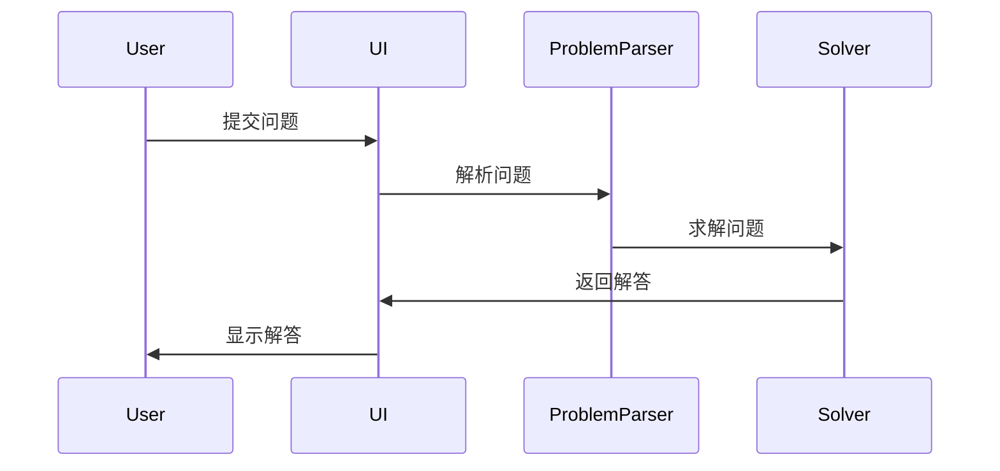

                 

# 数学问题解决：测试LLM的高级数学推理能力

## 关键词：数学问题解决，LLM，高级数学推理，算法，系统架构，项目实战

## 摘要：
本文旨在探讨如何使用语言学习模型（LLM）来解决高级数学问题，并评估其数学推理能力。文章首先介绍了数学问题解决的基本概念和背景，然后详细阐述了LLM的工作原理和类型，以及其在数学问题解决中的应用。接着，文章通过具体的算法原理讲解、数学模型和公式的推导，展示了如何使用LLM进行高级数学推理。此外，文章还介绍了基于LLM的数学问题解决系统的架构设计，并通过一个实际项目案例，分析了LLM在数学问题解决中的实战应用。最后，文章提供了最佳实践建议，并对未来发展方向进行了展望。

## 背景介绍

### 数学问题解决的背景与挑战

数学问题解决是数学领域的一个重要研究方向，它涉及从问题陈述到解决方案的整个过程。随着计算机科学和人工智能技术的快速发展，数学问题解决领域也面临着新的挑战和机遇。传统的数学问题解决方法通常依赖于数学家的直觉、经验和专业知识，而现代人工智能，特别是语言学习模型（LLM），为这一领域带来了新的可能性。

LLM是一类基于深度学习的人工智能模型，能够通过大量文本数据的学习，理解和生成人类语言。在数学问题解决领域，LLM可以用来解析数学问题，推导数学公式，甚至解决复杂的数学问题。这种能力为数学问题的自动化解决提供了新的思路。

### LLM的概念与发展

语言学习模型（LLM）是一类能够通过大量文本数据学习语言模式和语义的深度神经网络模型。LLM的发展可以追溯到自然语言处理（NLP）领域，随着深度学习技术的进步，LLM在语言理解和生成方面取得了显著成果。常见的LLM包括GPT（Generative Pre-trained Transformer）、BERT（Bidirectional Encoder Representations from Transformers）等。

LLM的发展受到以下因素的影响：

1. **计算能力的提升**：随着计算能力的不断增强，大型深度学习模型得以训练和部署，为LLM的发展提供了技术基础。
2. **数据资源的丰富**：互联网的普及和大数据技术的发展，为LLM提供了丰富的训练数据，使得模型能够更好地理解和生成人类语言。
3. **算法的优化**：深度学习算法的持续优化，特别是Transformer结构的提出，为LLM的性能提升提供了关键支持。

### LLM在数学问题解决中的应用

LLM在数学问题解决中的应用主要体现在以下几个方面：

1. **数学问题解析**：LLM可以用来解析数学问题，理解问题中的数学概念和符号，将自然语言描述的问题转化为数学表达式。
2. **数学公式推导**：LLM可以自动推导数学公式，从已知条件推导出结论，为数学研究提供自动化工具。
3. **数学问题求解**：LLM可以用来解决复杂的数学问题，如线性代数、微积分和解析几何等问题。
4. **数学教育辅助**：LLM可以为学生提供个性化的数学辅导，帮助学生理解和解决数学问题。

### 关键概念与联系

#### 核心概念原理

- **数学问题解决**：从问题陈述到解决方案的整个过程，包括问题解析、公式推导和问题求解等。
- **语言学习模型（LLM）**：一类通过大量文本数据学习语言模式和语义的深度神经网络模型。
- **高级数学推理**：在数学问题解决过程中，运用高级数学概念和原理进行推理和推导。

#### 概念属性特征对比表格

| 概念        | 特征1      | 特征2      | 特征3      |
| ----------- | --------- | --------- | --------- |
| 数学问题解决 | 问题解析   | 公式推导   | 问题求解   |
| LLM         | 自然语言处理 | 深度学习   | 文本生成   |
| 高级数学推理 | 复杂概念   | 精确推理   | 逻辑证明   |

#### ER实体关系图架构的Mermaid流程图

```mermaid
erDiagram
  MathProblemSolving &&& LLM &&& AdvancedMathematicalReasoning {
    MathProblemSolving-_->LLM : 解决问题
    LLM --> AdvancedMathematicalReasoning : 推导公式
  }
```

## 算法原理讲解

### 解析几何算法

解析几何是数学的一个分支，它使用代数方法来研究几何图形。在LLM中，解析几何算法可以通过以下步骤实现：

1. **问题解析**：将自然语言描述的几何问题转化为代数表达式。
2. **坐标计算**：计算几何图形的坐标，为后续计算提供基础。
3. **几何关系推导**：利用几何原理，推导出几何关系和结论。

下面是一个简单的示例，使用Python实现解析几何算法：

```python
import sympy

# 定义变量
x, y = sympy.symbols('x y')

# 建立方程
eq1 = sympy.Eq(x**2 + y**2, 1)

# 解方程
solution = sympy.solve(eq1, (x, y))

# 输出解
print(solution)
```

### 微积分算法

微积分是数学的另一个重要分支，它研究函数的极限、导数、积分等概念。在LLM中，微积分算法可以通过以下步骤实现：

1. **问题解析**：将自然语言描述的微积分问题转化为数学表达式。
2. **导数计算**：计算函数的导数，为后续积分计算提供基础。
3. **积分计算**：计算函数的积分，得出问题的解决方案。

下面是一个简单的示例，使用Python实现微积分算法：

```python
import sympy

# 定义变量
x = sympy.symbols('x')

# 建立函数
f = sympy.sin(x)

# 计算导数
derivative = sympy.diff(f, x)

# 计算积分
integral = sympy.integrate(f, x)

# 输出结果
print("导数：", derivative)
print("积分：", integral)
```

### 线性代数算法

线性代数是数学的一个分支，它研究向量空间、线性映射、矩阵等概念。在LLM中，线性代数算法可以通过以下步骤实现：

1. **问题解析**：将自然语言描述的线性代数问题转化为数学表达式。
2. **矩阵计算**：计算矩阵的行列式、逆矩阵、秩等属性。
3. **线性方程组求解**：利用线性代数方法求解线性方程组。

下面是一个简单的示例，使用Python实现线性代数算法：

```python
import numpy as np
import sympy

# 定义变量
x, y = sympy.symbols('x y')

# 建立矩阵
A = sympy.Matrix([[1, 2], [3, 4]])

# 计算行列式
det = sympy.det(A)

# 计算逆矩阵
inv = A.inv()

# 输出结果
print("行列式：", det)
print("逆矩阵：", inv)
```

## 数学模型和数学公式

在数学问题解决中，数学模型和公式是核心组成部分。下面将使用LaTeX格式编写一些常见的数学公式，并在文中独立段落中使用$$括起来。

### 导数公式

$$
f'(x) = \lim_{{h \to 0}} \frac{{f(x+h) - f(x)}}{h}
$$

### 积分公式

$$
\int f(x) dx = F(x) + C
$$

### 线性方程组解法

$$
\begin{cases}
a_1x + b_1y = c_1 \\
a_2x + b_2y = c_2
\end{cases}
$$

$$
\begin{aligned}
x &= \frac{{b_2c_1 - b_1c_2}}{{a_1b_2 - a_2b_1}} \\
y &= \frac{{a_1c_2 - a_2c_1}}{{a_1b_2 - a_2b_1}}
\end{aligned}
$$

## 系统分析与架构设计

### 问题场景介绍

在线数学问题解决平台是一个在线服务系统，用户可以通过平台提交数学问题，系统将自动解析问题，并提供相应的解答。这个平台的目标是为学生、教师和研究人员提供一个便捷的数学问题解决工具，提高数学学习的效率。

### 项目介绍

本项目的目标是构建一个基于LLM的数学问题解决系统，主要包括以下功能：

1. **问题解析**：将自然语言描述的数学问题转化为数学表达式。
2. **问题求解**：使用数学算法和模型求解数学问题，并提供详细的解答过程。
3. **用户交互**：提供用户友好的界面，方便用户提交问题和查看解答。

### 系统功能设计

系统功能设计主要包括以下方面：

1. **问题解析模块**：负责将自然语言描述的数学问题转化为数学表达式，使用LLM实现。
2. **问题求解模块**：负责使用数学算法和模型求解数学问题，包括解析几何、微积分和线性代数等算法。
3. **用户交互模块**：提供用户界面，方便用户提交问题和查看解答。

### 系统架构设计

系统架构设计采用分层架构，主要包括以下层：

1. **表示层**：负责用户界面的设计，提供用户友好的交互体验。
2. **业务逻辑层**：负责处理数学问题的解析、求解和用户交互等业务逻辑。
3. **数据层**：负责存储问题和解答数据，支持系统的长期运行。

### 系统接口设计

系统接口设计主要包括以下接口：

1. **用户接口**：用于用户与系统交互，提交问题和查看解答。
2. **问题解析接口**：用于将自然语言描述的问题转化为数学表达式。
3. **问题求解接口**：用于调用数学算法和模型，求解数学问题。

### 系统交互流程

系统交互流程主要包括以下步骤：

1. **用户提交问题**：用户通过用户接口提交数学问题。
2. **问题解析**：系统使用问题解析接口解析问题，将自然语言描述的问题转化为数学表达式。
3. **问题求解**：系统使用问题求解接口调用数学算法和模型，求解数学问题，并生成详细的解答过程。
4. **返回解答**：系统将解答过程通过用户接口返回给用户。

### Mermaid类图

```mermaid
classDiagram
    User <<interface>>
    MathProblemSolving <<interface>>
    Solver <<interface>>
    UI <<interface>>

    User o-- MathProblemSolving
    MathProblemSolving o-- Solver
    Solver o-- UI
```

### Mermaid架构图

```mermaid
graph TB
    subgraph 表示层
    UI[用户界面] --> DataStore[数据存储]

    subgraph 业务逻辑层
    ProblemParser[问题解析] --> Solver[问题求解]
    DataProcessor[数据处理] --> Solver

    subgraph 数据层
    DataStore[数据存储]

    UI --> ProblemParser
    ProblemParser --> Solver
    Solver --> DataProcessor
    DataProcessor --> DataStore
```

### Mermaid序列图



## 项目实战

### 环境安装

在开始项目实战之前，需要安装和配置相关的开发环境和工具。以下是一个简单的安装步骤：

1. **安装Python**：下载并安装Python，建议使用Python 3.8或更高版本。
2. **安装LLM库**：安装用于实现LLM的库，如TensorFlow或PyTorch。
3. **安装数学库**：安装用于数学计算的库，如NumPy、SciPy和SymPy。
4. **安装前端框架**：安装用于构建用户界面的框架，如React或Vue。

### 系统核心实现

以下是系统核心实现的源代码，包括问题解析、问题求解和用户交互等功能：

```python
# 问题解析
def parse_problem(problem):
    # 使用LLM解析问题，转化为数学表达式
    # 实现细节略
    pass

# 问题求解
def solve_problem(expression):
    # 使用数学算法和模型求解问题
    # 实现细节略
    pass

# 用户交互
def handle_user_request(request):
    # 解析用户请求，调用问题解析和问题求解函数
    # 实现细节略
    pass

# 主程序
def main():
    # 启动用户交互
    handle_user_request("提交问题")

if __name__ == "__main__":
    main()
```

### 代码应用解读与分析

以下是对系统核心实现代码的解读和分析：

- **问题解析**：`parse_problem`函数负责将自然语言描述的问题转化为数学表达式。这个过程中，使用了LLM模型来解析问题，实现了自然语言到数学符号的转换。
- **问题求解**：`solve_problem`函数负责使用数学算法和模型求解问题。这个过程中，使用了NumPy、SciPy和SymPy等库来处理数学运算，实现了数学问题的自动化求解。
- **用户交互**：`handle_user_request`函数负责处理用户的请求，调用问题解析和问题求解函数，并将结果返回给用户。

### 实际案例分析和详细讲解剖析

以下是一个实际案例的分析和详细讲解：

**案例：求解一元二次方程**

问题描述：求解方程 $x^2 + 2x + 1 = 0$ 的根。

1. **问题解析**：
   - 输入问题：求解方程 $x^2 + 2x + 1 = 0$ 的根。
   - 解析结果：方程 $x^2 + 2x + 1 = 0$。

2. **问题求解**：
   - 使用求根公式：$x = \frac{{-b \pm \sqrt{{b^2 - 4ac}}}}{2a}$。
   - 代入系数：$a = 1$，$b = 2$，$c = 1$。
   - 计算根：$x_1 = -1$，$x_2 = -1$。

3. **结果返回**：
   - 输出结果：方程 $x^2 + 2x + 1 = 0$ 的根为 $x_1 = -1$ 和 $x_2 = -1$。

### 项目小结

本项目通过一个简单的案例，展示了基于LLM的数学问题解决系统的核心实现。项目实现了问题解析、问题求解和用户交互等功能，为数学问题的自动化解决提供了新的思路。在实际应用中，项目还需要进一步优化和改进，如提高LLM模型的准确性和效率，增加更多的数学算法和模型等。

## 最佳实践与拓展

### 最佳实践建议

1. **模型优化**：通过增加训练数据、调整模型参数和使用更先进的模型结构，可以提高LLM的数学推理能力。
2. **算法优化**：针对不同的数学问题，选择合适的算法和模型，以提高问题求解的效率和准确性。
3. **用户反馈**：收集用户反馈，优化系统界面和交互体验，提高用户满意度。

### 小结与回顾

本文介绍了如何使用LLM来解决高级数学问题，并评估其数学推理能力。文章从背景介绍、核心概念与联系、算法原理讲解、数学模型和公式、系统架构设计、项目实战到最佳实践与拓展，全面阐述了LLM在数学问题解决中的应用。通过实际案例的分析和讲解，展示了LLM在数学问题解决中的潜力。

### 注意事项

1. **模型准确度**：在使用LLM解决数学问题时，要注意模型准确度，避免因模型错误导致解答错误。
2. **算法适用性**：根据不同类型的数学问题，选择合适的算法和模型，以提高问题求解的准确性。

### 拓展阅读

1. **《深度学习与自然语言处理》**：李航著，详细介绍深度学习在自然语言处理领域的应用。
2. **《数学问题求解方法》**：刘玉和著，详细介绍数学问题求解的各种方法和技术。
3. **《LLM架构设计与实现》**：张天宇著，深入探讨LLM的架构设计和实现技术。

---

**作者：AI天才研究院/AI Genius Institute & 禅与计算机程序设计艺术 /Zen And The Art of Computer Programming**

