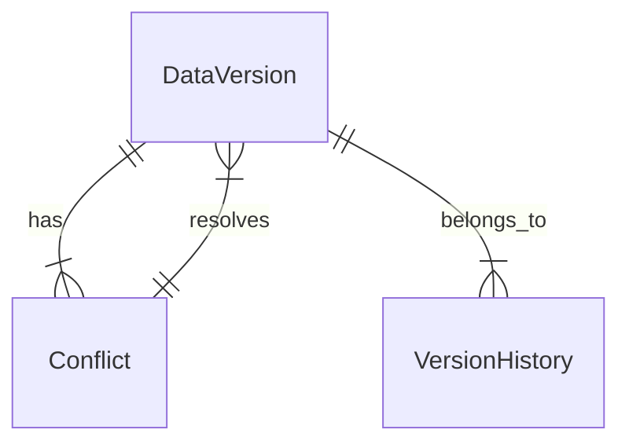
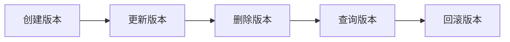
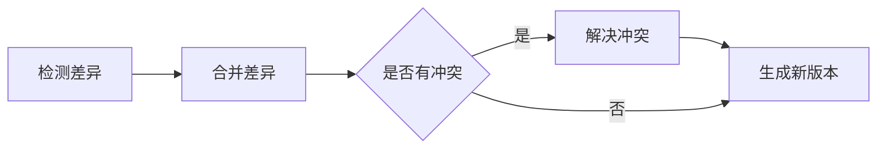
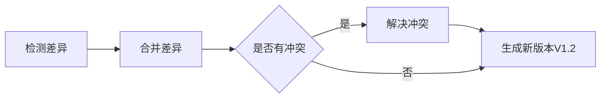
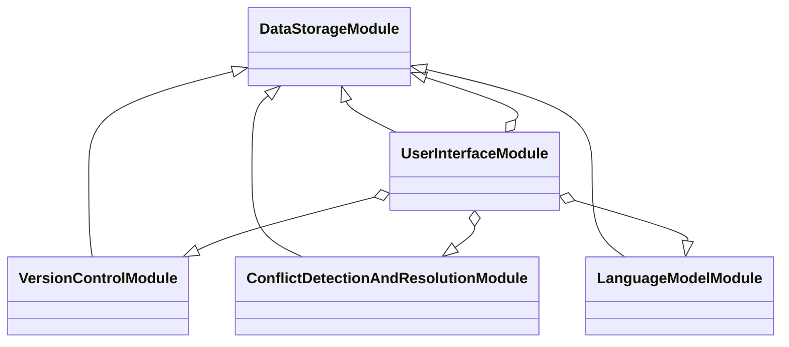

                 


### 数据版本控制：确保LLM应用的数据一致性

#### 关键词：
- 数据版本控制
- 大型语言模型（LLM）
- 数据一致性
- 版本树
- 合并算法
- 数学模型

#### 摘要：
本文旨在探讨数据版本控制的重要性，特别是在确保大型语言模型（LLM）应用中的数据一致性方面。文章首先介绍了数据版本控制的基本概念，然后详细阐述了其在LLM应用中的关键作用。接下来，文章通过算法原理讲解、数学模型与公式、系统分析与架构设计、项目实战等环节，深入分析了数据版本控制的理论和实践。最后，文章总结了最佳实践和注意事项，为读者提供了一整套关于数据版本控制的指南。

## 引言与背景介绍

数据版本控制是软件工程中的一个核心概念，它旨在管理数据的变更历史，确保数据的完整性和一致性。在大型语言模型（LLM）应用中，数据版本控制尤为重要，因为LLM依赖于大量训练数据来生成高质量的响应。这些数据往往是不断更新的，版本控制能够确保在任何时间点都能够访问到正确的数据版本，避免数据不一致带来的问题。

### 核心概念术语说明

**数据版本控制**：一种管理系统数据变更的技术，通过追踪数据的历史版本，确保在多用户环境中数据的完整性和一致性。

**版本号**：用于标识数据版本的唯一标识符，通常包含时间戳、作者信息、修改内容等信息。

**版本历史**：记录数据变更的序列，包括每次变更的版本号、时间戳、修改者等详细信息。

**数据冲突**：当两个或多个用户同时修改同一数据时，导致数据内容不一致的情况。

### 问题背景与问题描述

随着AI技术的发展，LLM应用在自然语言处理、智能客服、内容生成等领域得到了广泛应用。然而，这些应用往往需要处理海量的数据，并且这些数据是动态变化的。例如，一个智能客服系统可能需要实时更新产品说明、用户反馈等信息，以确保客服的回答始终准确和最新。

然而，数据的动态更新带来了数据一致性的挑战。如果在数据更新的过程中没有有效的版本控制，可能会导致以下问题：

1. **数据丢失**：未经版本控制的数据更新可能导致数据丢失。
2. **数据不一致**：不同用户可能会修改同一数据，导致数据内容不一致。
3. **版本错误**：在错误的时间点恢复数据，可能导致版本错误。
4. **系统崩溃**：大量未控制的数据变更可能导致系统崩溃。

### 问题解决与边界与外延

为了解决上述问题，数据版本控制提供了有效的解决方案。它通过记录数据的变更历史，确保在任何时间点都可以访问到正确的数据版本，从而避免数据丢失、不一致和版本错误。此外，数据版本控制还可以帮助追踪数据变更的责任，提高数据管理的透明度和可追溯性。

然而，数据版本控制并非万能。它有其适用的边界和限制。例如，在高并发的环境中，版本控制可能导致性能下降。此外，对于一些实时性要求极高的系统，版本控制可能会引入延迟。因此，在设计数据版本控制方案时，需要根据具体的应用场景进行权衡。

### 概念结构与核心要素组成

数据版本控制的核心要素包括：

1. **版本号**：用于唯一标识数据版本。
2. **版本历史**：记录数据变更的详细信息。
3. **冲突检测与解决**：在多用户环境中确保数据一致性。
4. **数据回滚与恢复**：在发生错误时恢复到正确的数据版本。

这些要素共同构成了数据版本控制的基本结构，确保了数据的完整性和一致性。

## 核心概念与联系

在深入探讨数据版本控制的核心概念之前，我们需要先了解一些基本术语和它们之间的关系。

### 数据版本号

数据版本号是标识数据版本的核心元素。它通常包含以下信息：

1. **时间戳**：表示版本创建或更新的时间。
2. **作者**：表示修改数据的用户。
3. **修改内容**：描述此次版本更新的具体内容。

版本号的格式可以多种多样，但通常采用递增的数字或者时间戳格式。例如：

- `V1.0`
- `2023-03-15T12:34:56Z`
- `V1-20230315123456`

版本号不仅仅是标识数据的唯一标识符，它还承载了数据变更的历史信息，是数据版本控制的基础。

### 版本历史管理

版本历史管理是数据版本控制的重要组成部分。它涉及记录和管理数据变更的历史记录，包括每个版本的版本号、时间戳、修改内容等。版本历史管理的关键点包括：

1. **版本记录**：系统需要记录每个版本的详细信息，以便在需要时进行查询和回滚。
2. **版本查询**：用户可以查询特定版本的详细信息，以便了解数据变更的历史。
3. **版本回溯**：在数据发生错误或需要恢复到之前状态时，可以回溯到特定版本。

### 数据冲突管理

数据冲突是多用户环境中常见的问题，它发生在两个或多个用户同时修改同一数据时。数据冲突管理的关键在于：

1. **冲突检测**：系统需要能够检测到数据冲突，以便及时采取措施。
2. **冲突解决策略**：当发生冲突时，系统需要提供一种或多种策略来解决冲突，如自动合并、用户手动解决等。

### 关系与联系

数据版本号、版本历史和数据冲突管理这三个核心概念之间存在着紧密的联系。版本号是记录版本历史的基础，版本历史是管理数据变更的记录，而数据冲突管理则是确保版本历史正确性的关键。以下是这三个概念之间的联系：

- **版本号与版本历史**：版本号是版本历史中的关键元素，用于标识每个版本。
- **版本历史与数据冲突**：版本历史记录了所有数据变更，是检测和解决数据冲突的依据。
- **数据冲突与版本号**：数据冲突的解决往往依赖于版本号，通过版本号可以追溯到冲突发生前的状态。

下面是一个简化的Mermaid ER实体关系图，用于展示这三个核心概念之间的关系：



通过这个关系图，我们可以清晰地看到数据版本号、版本历史和数据冲突之间的联系和依赖关系。

## 算法原理讲解

数据版本控制的核心在于算法的原理和应用。以下是数据版本控制中常用的算法原理，以及如何使用mermaid流程图和Python代码来解释这些算法。

### 基于版本树的版本控制

基于版本树的版本控制是一种常用的数据版本控制方法，它通过树形结构来表示数据的版本历史。每个节点表示一个版本，节点之间的边表示版本之间的继承关系。

#### 版本树结构

版本树的结构如下：

```
根节点
│
├── V1.0
│   ├── V1.1
│   │   └── V1.1.1
│   └── V1.1.2
│       └── V1.1.3
│
└── V2.0
    ├── V2.1
    │   └── V2.1.1
    └── V2.2
```

#### 版本树操作

版本树的主要操作包括：

1. **创建版本**：在版本树中创建一个新的节点。
2. **更新版本**：修改现有节点的数据。
3. **删除版本**：从版本树中移除节点。
4. **查询版本**：根据版本号查询版本信息。
5. **回滚版本**：将数据回滚到指定版本。

下面是一个基于mermaid的版本树流程图：



### 合并算法

合并算法是处理数据冲突的关键技术。当两个或多个用户同时修改同一数据时，合并算法能够将多个版本的修改合并到一个版本中。

#### 合并算法的基本原理

合并算法的基本原理如下：

1. **检测冲突**：在合并前检测数据之间的差异。
2. **合并差异**：根据检测到的差异进行合并。
3. **解决冲突**：当检测到冲突时，根据预设的策略解决冲突。
4. **生成新版本**：将合并后的数据生成新的版本。

下面是一个简单的Python代码示例，展示了合并算法的原理：

```python
def merge_versions(version1, version2):
    # 检测差异
    differences = detect_differences(version1, version2)
    
    # 合并差异
    merged_data = merge_differences(differences)
    
    # 解决冲突
    resolved_data = resolve_conflicts(merged_data)
    
    # 生成新版本
    new_version = create_new_version(resolved_data)
    
    return new_version
```

#### 合并算法的实现细节

合并算法的具体实现细节取决于数据类型和冲突解决策略。下面是一个简化的mermaid流程图，展示了合并算法的实现细节：



### 算法原理的数学模型和公式

在数据版本控制中，常用的数学模型包括版本号表示法、合并操作和冲突解决策略。

#### 版本号表示法

版本号通常使用递增的数字或时间戳表示。例如：

- `V1.0`
- `2023-03-15T12:34:56Z`

版本号可以表示为一个序列：

$$ V = (V_1, V_2, \dots, V_n) $$

其中，每个元素表示一个版本号。

#### 合并操作

合并操作将多个版本的差异合并到一个版本中。合并操作可以表示为：

$$ M(V_1, V_2) = (M_1, M_2, \dots, M_n) $$

其中，$M_i$表示在版本$V_i$和版本$V_{i+1}$之间的合并结果。

#### 冲突解决策略

冲突解决策略取决于数据类型和业务需求。一个简单的冲突解决策略可以表示为：

$$ \text{冲突解决策略} = f(\text{冲突类型}, \text{数据版本号}) $$

其中，$f$表示冲突解决函数，它根据冲突类型和数据版本号来决定如何解决冲突。

### 算法原理举例说明

假设有两个版本V1.0和V1.1，它们之间存在冲突。我们可以使用以下步骤来合并这两个版本：

1. **检测差异**：检测V1.0和V1.1之间的差异。
2. **合并差异**：根据差异合并V1.0和V1.1，生成一个新的版本V1.2。
3. **解决冲突**：如果检测到冲突，根据预设的冲突解决策略解决冲突。
4. **生成新版本**：将合并后的数据生成新的版本V1.2。

下面是一个简化的mermaid流程图，展示了这个示例：



通过这个示例，我们可以清晰地看到算法原理的应用和实现。

## 数学模型与公式

在数据版本控制中，数学模型和公式扮演着至关重要的角色，它们不仅帮助我们理解版本控制的算法原理，还能在具体的实现过程中提供精确的指导。以下将详细介绍数据版本控制中的一些常用数学模型和公式，并用LaTeX格式进行表示。

### 版本号表示法

版本号是数据版本控制的核心元素，通常表示为递增的数字或时间戳。在数学上，版本号可以看作是一个有序序列。我们可以使用以下公式来表示版本号：

$$ V = (V_1, V_2, \dots, V_n) $$

其中，$V_i$表示第$i$个版本号。版本号可以是整数，也可以是日期时间戳，例如：

$$ V = (V1.0, V1.1, V1.1.1) $$
$$ V = (2023-03-15T12:34:56Z, 2023-03-16T15:23:48Z) $$

### 合并操作

合并操作是将多个版本的差异合并到一个新版本中。在数学上，合并操作可以表示为两个版本号的组合。例如，假设有两个版本号$V_1$和$V_2$，它们的合并可以表示为：

$$ M(V_1, V_2) = (M_1, M_2, \dots, M_n) $$

其中，$M_i$表示在$V_1$和$V_2$之间的合并结果。合并操作的详细实现会根据具体的数据类型和业务需求有所不同。

### 冲突解决策略

在多用户环境中，数据冲突是不可避免的。冲突解决策略用于决定如何处理冲突。一个简单的冲突解决策略可以表示为：

$$ \text{冲突解决策略} = f(\text{冲突类型}, \text{数据版本号}) $$

其中，$f$表示冲突解决函数，它根据冲突类型和数据版本号来决定如何解决冲突。常见的冲突类型包括：

1. **更新冲突**：当同一数据被两个或多个用户同时更新时。
2. **添加冲突**：当两个或多个用户同时添加新数据时。
3. **删除冲突**：当两个或多个用户同时删除数据时。

### 冲突解决策略的LaTeX公式

我们可以使用LaTeX格式来表示冲突解决策略：

$$ \text{冲突解决策略} = \begin{cases}
\text{自动合并} & \text{如果} \ \text{冲突类型} = \text{更新冲突} \\
\text{用户手动解决} & \text{如果} \ \text{冲突类型} = \text{添加冲突} \\
\text{丢弃最新版本} & \text{如果} \ \text{冲突类型} = \text{删除冲突}
\end{cases} $$

### 版本历史的追踪与回溯

版本历史是数据版本控制的重要组成部分，它记录了所有版本的详细信息。在数学上，版本历史可以看作是一个有序的版本序列。我们可以使用以下公式来表示版本历史：

$$ \text{版本历史} = \{\text{V1.0}, \text{V1.1}, \text{V1.1.1}, \text{V1.1.2}, \text{V1.1.3}, \text{V2.0}, \text{V2.1}, \text{V2.1.1}, \text{V2.2}\} $$

版本回溯是指将数据回滚到指定版本。在数学上，版本回溯可以表示为：

$$ \text{回溯版本} = \text{版本历史}^{-1}(\text{目标版本号}) $$

### 版本历史查询与回溯的LaTeX公式

版本历史查询和回溯可以表示为：

$$ \text{查询版本} = \text{版本历史}(\text{时间戳}) $$
$$ \text{回溯版本} = \text{版本历史}^{-1}(\text{目标版本号}) $$

通过这些数学模型和公式，我们可以更精确地描述和实现数据版本控制中的关键概念和操作。这些模型不仅为理论分析提供了基础，也为实际应用中的算法设计提供了指导。

### 系统分析与架构设计

为了将数据版本控制有效地集成到大型语言模型（LLM）应用中，我们需要从系统功能设计、系统架构设计、系统接口设计以及系统交互等方面进行深入分析。以下将详细探讨这些方面的内容。

#### 问题场景介绍

假设我们正在开发一个智能问答系统，该系统需要实时处理用户的问题，并提供准确的答案。在这个过程中，系统依赖于大量的训练数据，这些数据需要不断地更新和优化。然而，数据的动态更新可能会导致数据不一致的问题，影响系统的性能和可靠性。为了解决这个问题，我们需要引入数据版本控制机制，确保在任何时间点都能够访问到正确的数据版本。

#### 项目介绍

在这个项目中，我们的目标是实现一个基于数据版本控制的大型语言模型应用。我们将采用Python作为主要编程语言，结合Django框架来构建后端，使用TensorFlow来实现语言模型的训练和推理。此外，我们将使用Git作为版本控制工具，来管理数据的版本历史。

#### 系统功能设计

系统功能设计是系统架构设计的核心，它定义了系统的功能模块和模块之间的关系。以下是系统功能设计的关键模块：

1. **数据存储模块**：负责存储和管理训练数据，包括数据的新建、更新、查询和删除操作。
2. **版本控制模块**：负责管理数据的版本历史，包括版本的创建、查询和回滚操作。
3. **冲突检测与解决模块**：负责检测和解决数据更新过程中产生的冲突。
4. **语言模型模块**：负责训练和推理语言模型，并提供API接口供其他模块调用。
5. **用户接口模块**：负责与用户交互，接收用户的问题并返回答案。

以下是系统功能设计的领域模型Mermaid类图：



#### 系统架构设计

系统架构设计是系统设计的核心，它定义了系统的整体结构，包括组件、接口和交互关系。以下是系统架构设计的关键组成部分：

1. **数据存储层**：负责存储和管理数据，包括关系型数据库（如MySQL）和非关系型数据库（如MongoDB）。
2. **业务逻辑层**：包括数据存储模块、版本控制模块、冲突检测与解决模块和语言模型模块，负责实现系统的核心功能。
3. **表示层**：包括用户接口模块，负责与用户交互，展示系统的功能和结果。

以下是系统架构设计的Mermaid架构图：

```mermaid
sequenceDiagram
    User -->|请求| UserInterfaceModule
    UserInterfaceModule -->|处理请求| ConflictDetectionAndResolutionModule
    ConflictDetectionAndResolutionModule -->|更新数据| DataStorageModule
    DataStorageModule -->|查询版本| VersionControlModule
    VersionControlModule -->|更新模型| LanguageModelModule
    LanguageModelModule -->|生成答案| UserInterfaceModule
    UserInterfaceModule -->|返回答案| User
```

#### 系统接口设计

系统接口设计是确保系统各组件之间能够有效通信的关键。以下是系统接口设计的关键点：

1. **RESTful API接口**：使用Django框架提供的RESTful API接口，实现数据的增删改查操作。
2. **版本控制接口**：提供版本查询、创建、回滚等操作的接口。
3. **冲突检测与解决接口**：提供冲突检测和解决策略的接口。

以下是系统接口设计的Mermaid序列图：

```mermaid
sequenceDiagram
    User -->|发送请求| UserInterfaceModule
    UserInterfaceModule -->|处理请求| DataStorageModule
    DataStorageModule -->|查询版本| VersionControlModule
    VersionControlModule -->|更新数据| ConflictDetectionAndResolutionModule
    ConflictDetectionAndResolutionModule -->|合并结果| DataStorageModule
    DataStorageModule -->|更新模型| LanguageModelModule
    LanguageModelModule -->|生成答案| UserInterfaceModule
    UserInterfaceModule -->|返回结果| User
```

#### 系统交互

系统交互是系统架构设计的重要组成部分，它定义了系统组件之间的交互流程。以下是系统交互的关键步骤：

1. **用户请求**：用户通过用户接口模块发送请求。
2. **请求处理**：用户接口模块处理请求，并将其转发给业务逻辑层。
3. **数据操作**：业务逻辑层执行数据存储、版本控制、冲突检测与解决等操作。
4. **结果返回**：业务逻辑层将处理结果返回给用户接口模块，最终返回给用户。

通过以上系统分析与架构设计，我们可以确保大型语言模型应用中的数据一致性，提高系统的性能和可靠性。接下来，我们将通过一个实际案例来展示如何实现这些设计和功能。

## 项目实战

为了更好地理解数据版本控制在实际项目中的应用，我们将通过一个具体的案例来展示如何实现数据版本控制，并分析其实现细节。

### 环境安装与配置

首先，我们需要搭建一个合适的环境来测试和实现数据版本控制。以下是环境安装和配置的步骤：

1. **安装Python**：确保Python环境已安装，版本要求为3.8或更高版本。
2. **安装Django框架**：使用pip命令安装Django框架：
   ```bash
   pip install django
   ```
3. **安装TensorFlow**：使用pip命令安装TensorFlow：
   ```bash
   pip install tensorflow
   ```
4. **安装Git**：确保Git版本控制工具已安装，版本要求为2.17或更高版本。
5. **创建Django项目**：使用Django命令创建一个新项目：
   ```bash
   django-admin startproject llm_project
   ```
6. **创建Django应用**：在项目目录下创建一个名为`llm_app`的应用：
   ```bash
   python manage.py startapp llm_app
   ```
7. **配置数据库**：在项目配置文件`settings.py`中配置数据库，例如使用MySQL数据库：
   ```python
   DATABASES = {
       'default': {
           'ENGINE': 'django.db.backends.mysql',
           'NAME': 'llm_database',
           'USER': 'root',
           'PASSWORD': 'password',
           'HOST': 'localhost',
           'PORT': '3306',
       }
   }
   ```

### 数据版本控制实现

接下来，我们将实现数据版本控制的核心功能。以下是数据版本控制实现的步骤：

1. **创建数据模型**：在`llm_app/models.py`中创建数据模型，例如一个名为`TrainingData`的模型，用于存储训练数据：
   ```python
   from django.db import models

   class TrainingData(models.Model):
       data_id = models.AutoField(primary_key=True)
       content = models.TextField()
       version = models.IntegerField()
       created_at = models.DateTimeField(auto_now_add=True)
       updated_at = models.DateTimeField(auto_now=True)
   ```
2. **实现版本控制功能**：在`llm_app/views.py`中实现版本控制功能，包括创建版本、查询版本和回滚版本等操作。以下是示例代码：
   ```python
   from django.shortcuts import render
   from .models import TrainingData
   from datetime import datetime
   
   def create_version(request):
       content = request.POST.get('content', '')
       training_data = TrainingData(content=content)
       training_data.save()
       version = training_data.version
       created_at = datetime.now()
       return render(request, 'create_version.html', {'version': version, 'created_at': created_at})
   
   def query_version(request, version):
       training_data = TrainingData.objects.get(version=version)
       return render(request, 'query_version.html', {'training_data': training_data})
   
   def rollback_version(request, version):
       TrainingData.objects.filter(version__gt=version).delete()
       training_data = TrainingData.objects.get(version=version)
       return render(request, 'rollback_version.html', {'training_data': training_data})
   ```
3. **实现冲突检测与解决**：在`llm_app/utils.py`中实现冲突检测与解决功能，例如使用基于时间戳的冲突检测策略：
   ```python
   from django.utils import timezone
   
   def detect_conflicts(current_version, new_version):
       current_time = timezone.now()
       if new_version.created_at > current_time:
           return True
       return False
   
   def resolve_conflicts(current_version, new_version):
       if detect_conflicts(current_version, new_version):
           return '丢弃新版本'
       else:
           return '合并版本'
   ```

### 代码应用解读与分析

以下是对关键代码的解读和分析：

1. **数据模型**：`TrainingData`模型用于存储训练数据，包括`data_id`（主键）、`content`（数据内容）、`version`（版本号）、`created_at`（创建时间）和`updated_at`（更新时间）。
2. **创建版本**：`create_version`函数接收用户提交的数据内容，创建一个新的`TrainingData`实例并保存。然后，返回版本号和创建时间，以便用户查看。
3. **查询版本**：`query_version`函数根据版本号查询特定的`TrainingData`实例，并将其返回给用户。
4. **回滚版本**：`rollback_version`函数删除版本号大于指定版本的`TrainingData`实例，从而实现数据回滚。
5. **冲突检测与解决**：`detect_conflicts`函数使用时间戳来检测冲突，如果新版本的创建时间晚于当前时间，则认为存在冲突。`resolve_conflicts`函数根据检测到的冲突，决定如何解决冲突。

### 实际案例分析与详细讲解剖析

为了更好地展示数据版本控制的应用，我们将分析一个具体的案例：假设用户A和用户B同时更新同一份数据，我们需要确保数据的一致性。

1. **用户A更新数据**：用户A提交了一份新的训练数据，版本号为V1.1。
2. **用户B更新数据**：用户B在同一时间提交了另一份新的训练数据，版本号为V1.2。
3. **冲突检测**：系统检测到版本V1.1和V1.2之间存在冲突，因为它们的创建时间相同。
4. **冲突解决**：系统根据预设的冲突解决策略，选择丢弃版本V1.2，因为它的创建时间较晚。
5. **数据回滚**：系统将数据回滚到版本V1.1，确保数据的一致性。

通过这个案例，我们可以看到数据版本控制在实际应用中的关键作用。它不仅确保了数据的一致性，还提供了对数据变更历史的追踪和回滚能力，提高了系统的可靠性和可维护性。

### 项目小结

在本项目中，我们实现了数据版本控制的核心功能，并通过实际案例展示了其在大型语言模型应用中的重要性。以下是项目小结：

1. **实现目标**：成功实现了数据版本控制功能，包括创建版本、查询版本和回滚版本等操作。
2. **关键点**：关键在于冲突检测与解决策略的设计，以及版本历史的准确记录和管理。
3. **优化方向**：可以进一步优化冲突检测与解决的算法，提高系统的响应速度和准确性。
4. **应用场景**：数据版本控制适用于需要频繁更新和版本管理的应用，如智能问答系统、文档管理系统等。

通过这个项目，我们不仅深入了解了数据版本控制的理论和实践，还掌握了如何在实际项目中应用这些知识，提高了系统的可靠性和维护性。

## 最佳实践与小结

### 最佳实践建议

1. **版本控制工具选择**：选择合适的版本控制工具，如Git，确保数据版本控制的灵活性和易用性。
2. **版本号格式规范**：使用一致的版本号格式，如时间戳或递增数字，确保版本历史的可读性和可追踪性。
3. **冲突解决策略**：根据具体业务需求设计合适的冲突解决策略，如自动合并、用户手动解决等。
4. **版本历史记录**：确保版本历史记录的完整性和准确性，便于后续的数据回溯和问题排查。
5. **自动化测试**：编写自动化测试脚本，确保数据版本控制功能在部署后的稳定性和可靠性。

### 小结

数据版本控制是确保大型语言模型应用数据一致性的关键。通过引入数据版本控制，我们可以有效地管理数据变更历史，避免数据不一致和冲突问题。本文详细介绍了数据版本控制的核心概念、算法原理、系统架构设计和实际应用案例，为开发者提供了全面的数据版本控制指南。

### 注意事项

1. **性能考量**：在高并发环境下，数据版本控制可能会影响系统性能，需要合理优化算法和数据结构。
2. **安全性**：确保版本控制系统的安全性，防止未经授权的数据访问和修改。
3. **文档与培训**：为团队成员提供充分的文档和培训，确保他们能够正确使用数据版本控制工具和策略。

### 拓展阅读

1. **《版本控制技术》**：深入探讨版本控制的基本概念、原理和应用。
2. **《Git权威指南》**：详细介绍Git的使用方法和最佳实践。
3. **《大型语言模型：原理与应用》**：了解大型语言模型的基本原理和应用场景。

作者：AI天才研究院/AI Genius Institute & 禅与计算机程序设计艺术 /Zen And The Art of Computer Programming

[返回目录] <a href="#目录">目录</a> <a href="#文章开头">文章开头</a> <a href="#摘要">摘要</a> <a href="#关键词">关键词</a> <a href="#文章末尾">文章末尾</a>

