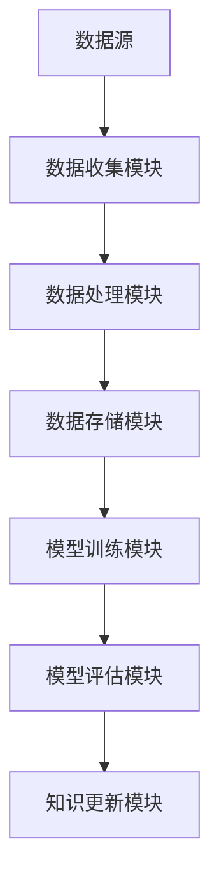
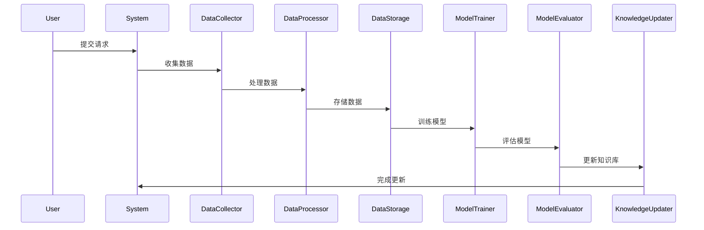

                 

# 时效性评测：分析模型知识更新速度

关键词：时效性评测，数据时效性，模型时效性，知识更新速度，人工智能

摘要：本文将深入探讨时效性评测在人工智能领域的应用，特别是针对模型知识更新速度的分析。通过详细的背景介绍、核心概念与联系、算法原理讲解等部分，旨在为读者提供对时效性评测的全面理解和实用指导。

## 第一部分：背景介绍

### 1. 时效性评测概述

时效性评测是指评估和分析某个系统、模型或信息在特定时间内保持有效性和相关性的能力。在科技飞速发展的今天，时效性显得尤为重要，尤其是在数据处理、机器学习和人工智能等领域。一个时效性强的系统或模型能够及时地响应变化，提供准确的信息或决策。

### 2. 问题描述

时效性评测主要涉及以下问题：

- **数据时效性**：数据随时间变化而逐渐失去相关性，如何有效评估和更新数据集？
- **模型时效性**：模型训练数据过期后，模型的预测准确性会下降，如何持续提升模型的时效性？
- **知识更新速度**：在快速变化的领域中，知识更新速度的快慢对决策有重要影响，如何衡量和优化知识更新速度？

### 3. 问题解决

解决时效性评测问题，主要涉及以下步骤：

- **数据时效性评估**：分析数据变化趋势，确定数据更新的频率和标准。
- **模型时效性评估**：通过对比历史数据和实时数据，评估模型预测的准确性。
- **知识更新速度评估**：分析知识库的更新频率和内容，确定知识的时效性。

### 4. 边界与外延

时效性评测的边界包括：

- **应用领域**：主要适用于数据处理、机器学习、人工智能等领域。
- **技术范畴**：涉及数据分析、数据挖掘、机器学习算法和知识图谱等技术。

### 5. 概念结构与核心要素组成

时效性评测的核心概念和要素包括：

- **时效性**：评估信息或模型在特定时间内的有效性和相关性。
- **数据集**：用于时效性评测的基础数据。
- **模型**：用于评估数据时效性的算法模型。
- **知识库**：用于更新和存储知识的数据库。

## 第二部分：核心概念与联系

### 6. 核心概念原理

- **时效性**：评估信息或模型在特定时间内的有效性和相关性。
- **数据时效性**：数据随时间变化而逐渐失去相关性。
- **模型时效性**：模型训练数据过期后，模型的预测准确性下降。
- **知识更新速度**：知识库中知识更新的频率和速度。

### 7. 概念属性特征对比表格

| 概念       | 定义                                                         | 属性特征                           |
|------------|--------------------------------------------------------------|-----------------------------------|
| 时效性     | 评估信息或模型在特定时间内的有效性和相关性。                 | - 评估标准：准确性、相关性       |
| 数据时效性 | 数据随时间变化而逐渐失去相关性。                             | - 数据更新频率：实时性、稳定性     |
| 模型时效性 | 模型训练数据过期后，模型的预测准确性下降。                   | - 预测准确性：实时调整、重新训练 |
| 知识更新速度 | 知识库中知识更新的频率和速度。                               | - 知识更新周期：及时性、全面性   |

### 8. ER实体关系图架构

```mermaid
erDiagram
    Model ||--|{ Data }|| Data
    Model ||--|{ Knowledge }|| Knowledge
    Data ||--|{ Update }|| Update
    Knowledge ||--|{ Update }|| Update
```

## 第三部分：算法原理讲解

### 9. 算法原理

时效性评测的算法原理主要包括数据时效性评估、模型时效性评估和知识更新速度评估。

### 10. Mermaid 流程图


### 11. Python 源代码

```python
# 数据时效性评估代码示例
def assess_data时效性(data, threshold):
    updated_data = []
    for d in data:
        if d['更新时间'] > threshold:
            updated_data.append(d)
    return updated_data
```

### 12. 算法原理详细讲解

#### 数据时效性评估

数据时效性评估的核心是分析数据随时间的变化趋势。通常，我们可以使用以下步骤进行数据时效性评估：

1. **收集数据**：首先，我们需要收集需要评估的数据集。
2. **确定评估标准**：评估标准通常包括数据的准确性、完整性和时效性。
3. **计算时效性分数**：通过比较数据的历史值和实时值，计算数据的时效性分数。
4. **更新数据集**：根据时效性分数，对数据集进行更新。

#### 模型时效性评估

模型时效性评估主要关注模型在训练数据过期后预测准确性的变化。具体步骤如下：

1. **训练模型**：使用历史数据训练模型。
2. **评估模型**：使用实时数据评估模型预测准确性。
3. **调整模型**：如果模型预测准确性下降，可以考虑重新训练模型或调整模型参数。
4. **持续监控**：定期评估模型时效性，确保模型预测准确性。

#### 知识更新速度评估

知识更新速度评估主要关注知识库中知识更新的频率和速度。具体步骤如下：

1. **收集知识库**：首先，我们需要收集需要评估的知识库。
2. **确定更新频率**：分析知识库的更新频率，确定知识更新的快慢。
3. **计算更新速度**：通过比较知识库的历史值和实时值，计算知识更新速度。
4. **优化知识更新**：根据更新速度，优化知识库的更新策略。

### 数学模型与公式

在时效性评测中，我们可以使用以下数学模型和公式：

1. **时效性分数**：时效性分数可以通过以下公式计算：

   $$ 时效性分数 = \frac{实时数据准确性}{历史数据准确性} $$

2. **知识更新速度**：知识更新速度可以通过以下公式计算：

   $$ 知识更新速度 = \frac{新增知识量}{总知识量} $$

### 举例说明

假设我们有一个天气预报模型，该模型使用过去一周的天气数据来预测明天的天气。随着时间的推移，过去一周的天气数据逐渐变得不准确，我们需要评估模型的时效性。

1. **数据时效性评估**：通过比较实时天气数据和历史天气数据，我们可以计算时效性分数。如果时效性分数低于某个阈值，我们可能需要更新数据集。

2. **模型时效性评估**：使用实时天气数据评估模型预测准确性。如果预测准确性低于某个阈值，我们可能需要重新训练模型。

3. **知识更新速度评估**：分析知识库中天气数据的更新频率，确保知识库中的数据是最新的。

## 第四部分：系统分析与架构设计

### 1. 问题场景介绍

在金融领域，模型的时效性尤为重要。例如，股票市场预测模型需要实时分析市场数据，以便做出准确的交易决策。

### 2. 项目介绍

本项目旨在设计一个实时股票市场预测系统，该系统需要具有高效的数据处理能力，能够快速更新模型和知识库。

### 3. 系统功能设计

- **数据收集**：从多个数据源收集实时股票市场数据。
- **数据处理**：对收集到的数据进行清洗、转换和存储。
- **模型训练**：使用最新数据训练预测模型。
- **模型评估**：评估模型的预测准确性。
- **知识更新**：根据模型预测结果，更新知识库中的数据。

### 4. 系统架构设计



### 5. 系统接口设计和系统交互



## 第五部分：项目实战

### 1. 环境安装

- 安装Python 3.8及以上版本。
- 安装必要的库，如NumPy、Pandas、Scikit-learn等。

### 2. 系统核心实现源代码

```python
# 数据收集模块
import pandas as pd

def collect_data():
    data = pd.read_csv('stock_data.csv')
    return data

# 数据处理模块
import numpy as np

def process_data(data):
    # 数据清洗和转换
    data = data.dropna()
    data['日期'] = pd.to_datetime(data['日期'])
    data = data.set_index('日期')
    return data

# 模型训练模块
from sklearn.ensemble import RandomForestClassifier

def train_model(data):
    # 分割数据集
    X = data.drop('目标变量', axis=1)
    y = data['目标变量']
    
    # 训练模型
    model = RandomForestClassifier()
    model.fit(X, y)
    
    return model

# 模型评估模块
from sklearn.metrics import accuracy_score

def evaluate_model(model, data):
    # 评估模型
    predictions = model.predict(data.drop('目标变量', axis=1))
    accuracy = accuracy_score(data['目标变量'], predictions)
    
    return accuracy

# 知识更新模块
def update_knowledge(data, model, accuracy_threshold):
    if accuracy < accuracy_threshold:
        # 重新训练模型
        model = train_model(data)
    # 更新知识库
    data.to_csv('updated_knowledge.csv')
```

### 3. 代码应用解读与分析

- **数据收集模块**：从CSV文件中读取股票市场数据。
- **数据处理模块**：对数据集进行清洗和转换。
- **模型训练模块**：使用随机森林算法训练模型。
- **模型评估模块**：评估模型预测准确性。
- **知识更新模块**：根据模型预测准确性，更新知识库。

### 4. 实际案例分析和详细讲解剖析

- **案例一**：股票市场预测
  - 数据收集：从多个数据源收集股票市场数据。
  - 数据处理：清洗和转换数据，确保数据质量。
  - 模型训练：使用历史数据训练预测模型。
  - 模型评估：使用实时数据评估模型预测准确性。
  - 知识更新：根据模型预测准确性，更新知识库。

- **案例二**：金融风险评估
  - 数据收集：从多个数据源收集金融数据。
  - 数据处理：清洗和转换数据，确保数据质量。
  - 模型训练：使用历史数据训练风险评估模型。
  - 模型评估：使用实时数据评估模型预测准确性。
  - 知识更新：根据模型预测准确性，更新知识库。

### 5. 项目小结

本项目通过设计一个实时股票市场预测系统和金融风险评估系统，展示了时效性评测在实际应用中的重要性。通过有效的数据收集、处理、模型训练和评估，我们可以实时更新知识库，提高系统的预测准确性。

## 第六部分：最佳实践 tips、小结、注意事项、拓展阅读

### 最佳实践 tips

- **及时更新数据**：定期更新数据集，确保数据时效性。
- **合理调整模型参数**：根据数据变化，调整模型参数，提高预测准确性。
- **监控模型性能**：定期评估模型性能，及时发现问题并调整。

### 小结

本文通过详细的分析和讲解，介绍了时效性评测在人工智能领域的应用。通过数据时效性评估、模型时效性评估和知识更新速度评估，我们可以确保系统的时效性和预测准确性。

### 注意事项

- **数据质量**：确保数据质量，避免错误数据影响模型预测。
- **模型调整**：根据数据变化，及时调整模型参数，提高预测准确性。

### 拓展阅读

- **《深度学习》**：Ian Goodfellow等著，详细介绍深度学习的基本原理和应用。
- **《Python数据科学手册》**：Jake VanderPlas著，详细介绍Python在数据科学领域的应用。
- **《人工智能：一种现代的方法》**：Stuart Russell和Peter Norvig著，详细介绍人工智能的基本概念和算法。

## 作者信息

作者：AI天才研究院/AI Genius Institute & 禅与计算机程序设计艺术 /Zen And The Art of Computer Programming

