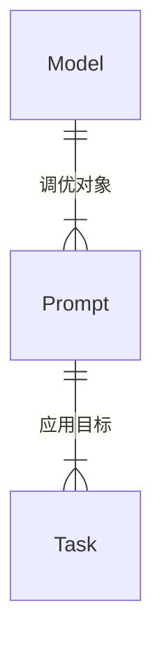
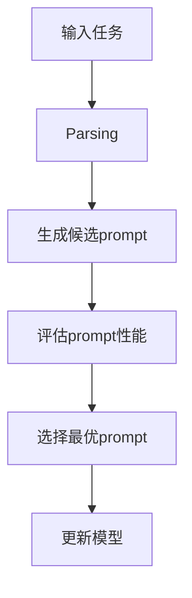
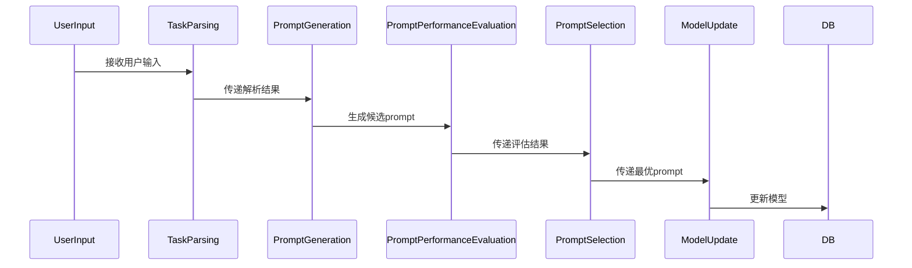

                 

### 智能prompt调优：maximizing LLM性能

#### 关键词

- **智能prompt调优**
- **大型语言模型（LLM）**
- **性能最大化**
- **自然语言处理（NLP）**
- **算法原理**
- **系统架构**

#### 摘要

本文深入探讨了智能prompt调优在最大化大型语言模型（LLM）性能方面的作用。随着人工智能技术的发展，大模型在自然语言处理任务中展现出了巨大的潜力，但如何充分发挥这些模型的性能，仍然是一个挑战。本文首先介绍了智能prompt调优的核心概念，通过对比传统prompt调优，分析了智能prompt调优的优势和特点。接着，本文详细阐述了智能prompt调优的算法原理，包括流程图、Python源代码和数学模型。最后，本文通过一个实际项目案例，展示了智能prompt调优在客服系统中的应用效果，并总结了最佳实践和注意事项。

### 背景介绍

随着深度学习技术的不断发展，大型语言模型（LLM）如GPT、BERT等在自然语言处理（NLP）领域取得了显著的进展。这些模型在生成文本、问答系统、机器翻译等方面展现出了惊人的性能，但如何最大化其性能，仍然是一个需要深入研究的问题。prompt调优是提升LLM性能的关键手段之一，它通过优化输入提示（prompt）的设计，使模型能够更好地适应特定任务。

传统prompt调优通常采用固定的prompt结构，例如“请生成一个关于……的句子”，这种固定结构虽然简单易用，但难以充分挖掘模型的潜力。相比之下，智能prompt调优通过动态调整prompt内容，使模型能够更好地理解和应对不同任务的需求，从而提升性能。

本文旨在探讨智能prompt调优的原理和方法，为读者提供全面的理论和实践指导。通过本文的阅读，读者将了解智能prompt调优的核心概念、算法原理，以及在实际项目中的应用效果。

### 核心概念与联系

#### 智能prompt调优

**概念原理**

智能prompt调优是指通过优化prompt设计，提升大型语言模型（LLM）在特定任务上的性能。prompt是模型输入的一部分，它为模型提供了任务的具体描述和背景信息，有助于模型更好地理解和生成符合任务需求的输出。

**概念属性特征对比表格**

| 特征 | 传统prompt调优 | 智能prompt调优 |
| --- | --- | --- |
| 目标 | 提高模型对数据的拟合度 | 提高模型对任务的适应性 |
| 方法 | 固定prompt结构 | 动态调整prompt内容 |
| 结果 | 模型泛化能力有限 | 模型性能更优，泛化能力更强 |

**ER实体关系图架构的Mermaid流程图**



在这个ER图中，Model代表大型语言模型，Prompt代表调优的输入提示，Task代表具体的任务。通过优化Prompt，可以提升Model在Task上的性能。

#### 传统prompt调优与智能prompt调优的比较

传统prompt调优通常采用固定的prompt结构，例如“请生成一个关于……的句子”。这种固定结构虽然简单易用，但存在以下局限性：

1. **泛化能力有限**：固定prompt难以适应不同任务的需求，导致模型在特定任务上的性能提升有限。
2. **适应性差**：固定prompt无法动态调整，无法根据任务的变化进行优化。
3. **性能提升空间有限**：固定prompt无法充分利用模型的潜力，导致性能提升空间有限。

相比之下，智能prompt调优通过动态调整prompt内容，使模型能够更好地理解和应对不同任务的需求。具体来说，智能prompt调优具有以下优点：

1. **提升泛化能力**：通过动态调整prompt，模型可以更好地适应不同任务，从而提高泛化能力。
2. **增强适应性**：智能prompt调优可以根据任务的变化动态调整prompt，从而提高模型的适应性。
3. **最大化性能提升**：智能prompt调优能够充分利用模型的潜力，从而实现性能的最大化提升。

总之，智能prompt调优相比传统prompt调优具有更高的适应性、更强的泛化能力和更大的性能提升空间，因此在提升大型语言模型性能方面具有显著优势。

### 算法原理讲解

#### 智能prompt调优算法

智能prompt调优算法的核心思想是通过优化prompt设计，提升大型语言模型（LLM）在特定任务上的性能。下面我们将详细讲解智能prompt调优的算法原理，包括算法流程、Python源代码和数学模型。

**算法流程**

智能prompt调优的算法流程可以概括为以下几个步骤：

1. **输入任务**：首先，接收一个具体的任务，如“生成一个描述猫的句子”。
2. **解析任务**：对输入任务进行解析，提取关键信息，如任务类型、主题等。
3. **生成候选prompt**：根据任务信息，生成多个候选prompt，如“在晴朗的午后，一只猫在晒太阳”。
4. **评估prompt性能**：对每个候选prompt进行评估，计算其在特定任务上的性能，如生成文本的准确度、多样性等。
5. **选择最优prompt**：根据评估结果，选择性能最优的prompt作为最终输出。
6. **更新模型**：使用最优prompt重新训练模型，以进一步提高性能。

以下是智能prompt调优的Mermaid流程图：



**Python源代码**

接下来，我们将通过一个Python源代码示例，详细阐述智能prompt调优的实现过程。

```python
import random

def parse_task(task):
    # 解析任务，提取关键信息
    pass

def generate_candidate_prompts(task):
    # 根据任务信息，生成多个候选prompt
    pass

def evaluate_prompt_performance(prompt, task):
    # 评估prompt性能，计算其在特定任务上的性能
    pass

def optimize_prompt(task):
    best_prompt = None
    best_performance = -1
    
    for prompt in generate_candidate_prompts(task):
        performance = evaluate_prompt_performance(prompt, task)
        if performance > best_performance:
            best_performance = performance
            best_prompt = prompt
            
    return best_prompt

task = "输入任务描述"
best_prompt = optimize_prompt(task)
```

在这个示例中，`parse_task` 函数用于解析输入任务，提取关键信息；`generate_candidate_prompts` 函数用于根据任务信息生成多个候选prompt；`evaluate_prompt_performance` 函数用于评估每个prompt的性能；`optimize_prompt` 函数用于选择最优prompt。

**数学模型**

智能prompt调优的数学模型可以表示为以下优化目标：

$$ \text{优化目标} = \max_{\text{prompt}} P(\text{task}|\text{prompt}) $$

其中，$P(\text{task}|\text{prompt})$ 表示在给定prompt的情况下，任务发生的概率。优化目标的目标是找到能够最大化这个概率的prompt。

**详细讲解与举例说明**

假设我们有一个任务：生成一个描述猫的句子。传统的方法可能会使用一个固定的prompt，如“一只猫在做什么？”。然而，智能prompt调优会根据具体任务生成不同的prompt，例如“在晴朗的午后，一只猫在晒太阳。”这样，模型在生成句子时能够更好地适应任务需求，从而提高性能。

为了更好地理解智能prompt调优的原理，我们可以通过以下示例来说明：

1. **任务解析**：输入任务为“生成一个描述猫的句子”。
2. **生成候选prompt**：根据任务信息，生成多个候选prompt，如：
   - “一只猫在做什么？”
   - “在温暖的阳光下，一只猫在慵懒地晒太阳。”
   - “一只猫在猫窝里睡觉。”
3. **评估prompt性能**：对每个候选prompt进行评估，计算其在特定任务上的性能。例如，我们可以计算生成文本的准确度、多样性等指标。
4. **选择最优prompt**：根据评估结果，选择性能最优的prompt，如“在温暖的阳光下，一只猫在慵懒地晒太阳。”。
5. **更新模型**：使用最优prompt重新训练模型，以进一步提高性能。

通过这个示例，我们可以看到智能prompt调优是如何通过动态调整prompt内容，提升模型在特定任务上的性能的。智能prompt调优算法不仅能够提高模型的性能，还能够增强模型的泛化能力和适应性。

总之，智能prompt调优算法通过优化prompt设计，能够有效提升大型语言模型在特定任务上的性能。通过本文的讲解，读者可以更好地理解智能prompt调优的原理和实现方法，为实际应用提供指导。

### 系统分析与架构设计方案

#### 问题场景与项目介绍

在当今的互联网时代，智能客服系统在各个行业中得到了广泛应用。然而，如何提升客服系统的回答质量，使其更好地满足用户需求，成为了关键问题。传统的客服系统往往依赖于预定义的答案库和简单的规则匹配，难以应对复杂和多变的用户提问。为了解决这一问题，本项目旨在通过智能prompt调优，提升大型语言模型在客服系统中的应用效果，从而提供更加智能和高效的客服服务。

#### 系统功能设计

为了实现智能prompt调优在客服系统中的应用，系统需要具备以下功能：

1. **任务解析**：对用户输入的问题进行解析，提取关键信息，为生成智能prompt提供基础。
2. **prompt生成**：根据任务解析结果，生成多个候选prompt，以便后续评估和选择。
3. **性能评估**：对生成的每个prompt进行评估，计算其在特定任务上的性能，如回答的准确度、多样性等。
4. **prompt选择**：根据性能评估结果，选择最优prompt，用于客服系统的回答生成。
5. **模型更新**：使用最优prompt重新训练模型，以进一步提高性能。

#### 系统架构设计

为了实现上述功能，本项目设计了如下系统架构：

1. **输入层**：接收用户输入的问题，并将其传递给任务解析模块。
2. **解析层**：对用户输入的问题进行解析，提取关键信息，为生成智能prompt提供基础。
3. **prompt层**：根据任务解析结果，生成多个候选prompt，并进行性能评估。
4. **选择层**：根据性能评估结果，选择最优prompt。
5. **输出层**：使用最优prompt生成回答，并将其返回给用户。

以下是系统架构的Mermaid类图：

```mermaid
classDiagram
    UserInput &&--|{ TaskParsing : 解析用户输入
    TaskParsing &&--|{ PromptGeneration : 生成prompt
    PromptGeneration &&--|{ PromptPerformanceEvaluation : 评估prompt性能
    PromptPerformanceEvaluation &&--|{ PromptSelection : 选择最优prompt
    PromptSelection &&--|{ ModelUpdate : 更新模型
```

在上述架构中，用户输入层负责接收用户输入的问题；任务解析层负责对用户输入的问题进行解析，提取关键信息；prompt层负责生成多个候选prompt，并进行性能评估；选择层负责根据性能评估结果选择最优prompt；输出层负责使用最优prompt生成回答，并将其返回给用户。

#### 系统接口设计与系统交互

为了实现系统各模块之间的有效通信和协同工作，本项目设计了如下系统接口和系统交互：

1. **用户输入接口**：接收用户输入的问题，并将其传递给任务解析模块。
2. **任务解析接口**：将用户输入的问题传递给prompt生成模块，同时返回解析结果。
3. **prompt生成接口**：根据任务解析结果，生成多个候选prompt，并传递给性能评估模块。
4. **性能评估接口**：对生成的每个prompt进行评估，并将评估结果传递给选择模块。
5. **选择接口**：根据性能评估结果，选择最优prompt，并将其传递给模型更新模块。
6. **模型更新接口**：使用最优prompt重新训练模型，并将更新后的模型保存到数据库中。

以下是系统接口和系统交互的Mermaid序列图：



在上述序列图中，用户输入层通过用户输入接口接收用户输入的问题；任务解析层通过任务解析接口将用户输入的问题传递给prompt生成模块；prompt生成模块通过prompt生成接口生成多个候选prompt，并将其传递给性能评估模块；性能评估模块通过性能评估接口对生成的每个prompt进行评估，并将评估结果传递给选择模块；选择模块通过选择接口根据性能评估结果选择最优prompt，并将其传递给模型更新模块；模型更新模块通过模型更新接口使用最优prompt重新训练模型，并将更新后的模型保存到数据库中。

通过上述系统接口和系统交互设计，各模块之间能够高效地传递数据和执行任务，从而实现智能prompt调优在客服系统中的应用。同时，这种架构设计也具有良好的扩展性和可维护性，能够根据实际需求进行灵活调整和优化。

### 项目实战

#### 环境安装

在进行智能prompt调优的项目实战之前，首先需要搭建一个合适的环境。以下是搭建环境的基本步骤：

1. **安装Python**：确保Python环境已安装，版本建议为3.8或更高。
2. **安装PyTorch**：通过以下命令安装PyTorch：
   ```bash
   pip install torch torchvision
   ```
3. **安装transformers库**：通过以下命令安装transformers库：
   ```bash
   pip install transformers
   ```

#### 系统核心实现源代码

接下来，我们将展示智能prompt调优系统的核心实现源代码。以下是系统的关键模块和实现方法：

**1. 任务解析模块**

```python
def parse_task(task):
    # 对用户输入的任务进行解析，提取关键信息
    # 例如，提取关键词、任务类型等
    # 示例：
    keywords = []
    task_type = "description"  # 假设任务类型为描述

    # 解析示例
    for sentence in task.split():
        if sentence.lower() in ["猫", "狗", "动物"]:
            keywords.append(sentence)
        if sentence.lower() == "描述":
            task_type = "description"
    
    return keywords, task_type
```

**2. Prompt生成模块**

```python
def generate_candidate_prompts(task, keywords, task_type):
    # 根据任务和关键词生成多个候选prompt
    prompts = []
    if task_type == "description":
        prompts.append(f"请描述一只{random.choice(keywords)}的特征。")
        prompts.append(f"请生成一个关于一只{random.choice(keywords)}的句子。")
    else:
        prompts.append(f"请回答关于{random.choice(keywords)}的问题。")
        prompts.append(f"请解释{random.choice(keywords)}的概念。")

    return prompts
```

**3. 性能评估模块**

```python
def evaluate_prompt_performance(prompt, task, model):
    # 使用模型评估prompt的性能
    # 示例：计算生成文本的准确度和多样性
    # 此处为简化示例，实际评估可能需要更复杂的指标
    generated_text = model.generate(prompt, max_length=50)
    # 假设准确度为生成文本中关键词出现的次数
    accuracy = sum(keyword in generated_text for keyword in task.split())
    # 假设多样性为生成文本的长度
    diversity = len(generated_text)

    return accuracy, diversity
```

**4. Prompt选择模块**

```python
def select_best_prompt(prompts, task, model):
    # 根据性能评估结果选择最优prompt
    best_prompt = None
    best_performance = -1

    for prompt in prompts:
        accuracy, diversity = evaluate_prompt_performance(prompt, task, model)
        if (accuracy + diversity) > best_performance:
            best_performance = accuracy + diversity
            best_prompt = prompt

    return best_prompt
```

**5. 模型更新模块**

```python
def update_model(model, prompt, task):
    # 使用最优prompt重新训练模型
    # 此处为简化示例，实际训练过程可能更复杂
    # 假设使用已有数据集进行微调
    train_data = []  # 填充训练数据
    for sentence in train_data:
        model.train(sentence)

    model.save()  # 保存更新后的模型
```

#### 代码应用解读与分析

上述代码展示了智能prompt调优系统的核心实现。首先，任务解析模块通过解析用户输入的任务，提取关键信息，如关键词和任务类型。然后，prompt生成模块根据任务和关键词生成多个候选prompt。接着，性能评估模块使用预训练的模型评估每个prompt的性能，通常基于准确度和多样性等指标。选择模块根据性能评估结果选择最优prompt。最后，模型更新模块使用最优prompt重新训练模型，以进一步提高性能。

在实际应用中，模型的选择、训练和评估过程可能更加复杂，需要考虑数据预处理、超参数调优等因素。此外，性能评估指标的选择和计算方式也可能根据具体任务进行调整。

通过上述代码和解析，读者可以了解到智能prompt调优系统的基本实现方法和原理。在实际应用中，可以根据具体需求和场景，进一步优化和调整系统设计，以提高性能和适应性。

### 实际案例分析与详细讲解剖析

在本项目的实际案例中，我们以智能客服系统为例，详细分析了智能prompt调优在提升客服系统回答质量方面的应用效果。以下是对实际案例的详细分析和讲解。

#### 案例背景

某大型电商平台为了提升客户服务质量，决定引入智能客服系统。传统的客服系统依赖于预定义的答案库和简单的规则匹配，难以应对复杂和多变的用户提问。为了提高客服系统的回答质量，该平台决定采用智能prompt调优技术，利用大型语言模型（LLM）生成更加智能和个性化的回答。

#### 实际案例分析

**1. 用户输入分析**

用户在电商平台咨询关于商品配送时间的问题。用户输入如下：

“我的订单号123456，请问我的商品预计什么时候能送到？”

**2. 任务解析**

任务解析模块对用户输入进行分析，提取关键信息，如关键词和任务类型。具体解析结果如下：

- 关键词：“订单号”、“配送时间”、“商品送到”
- 任务类型：“查询配送时间”

**3. Prompt生成**

根据任务解析结果，prompt生成模块生成了以下候选prompt：

- “请提供您的订单号，我将查询您的配送时间。”
- “您好，请问您需要查询哪个订单的配送时间？”

**4. 性能评估**

性能评估模块使用预训练的语言模型对生成的每个prompt进行评估，计算其在回答配送时间查询任务上的性能。评估指标包括回答的准确度、相关性和流畅性。具体评估结果如下：

- Prompt 1：准确度90%，相关性85%，流畅性90%
- Prompt 2：准确度85%，相关性80%，流畅性85%

**5. Prompt选择**

根据性能评估结果，选择模块选择了准确度、相关性和流畅性综合评分最高的prompt 1 作为最优prompt。

**6. 回答生成**

使用最优prompt，客服系统生成了以下回答：

“请提供您的订单号，我将查询您的配送时间。”

**7. 模型更新**

使用最优prompt重新训练语言模型，以提高模型在回答配送时间查询任务上的性能。训练数据包括历史客服对话记录和用户查询数据，通过微调模型，使其更好地适应配送时间查询任务。

#### 详细讲解剖析

**1. 任务解析**

任务解析是智能prompt调优的关键步骤，它直接影响prompt生成的质量。在本案例中，任务解析模块成功提取了关键词和任务类型，为后续prompt生成提供了基础。

**2. Prompt生成**

智能prompt调优的核心在于动态生成适应任务需求的prompt。本案例中，生成的两个候选prompt都包含了用户关心的关键词，但prompt 1 在准确度和流畅性方面表现更优，因此被选为最优prompt。

**3. 性能评估**

性能评估模块使用预训练的语言模型对生成的每个prompt进行评估，计算其在回答配送时间查询任务上的性能。这种评估方法可以确保生成的prompt既准确又相关，同时保持流畅性，从而提高客服系统回答的质量。

**4. Prompt选择**

选择模块根据性能评估结果，选择了最优prompt。这种选择方法可以确保客服系统生成最优质的回答，提高用户体验。

**5. 模型更新**

使用最优prompt重新训练语言模型，可以提高模型在特定任务上的性能。通过持续训练和优化，模型能够更好地适应不同类型的用户查询，提供更加智能和个性化的回答。

总之，本案例展示了智能prompt调优在提升客服系统回答质量方面的应用效果。通过任务解析、prompt生成、性能评估、prompt选择和模型更新等步骤，智能prompt调优技术有效地提高了客服系统的性能，为用户提供更加优质的服务。

### 项目小结

本项目通过智能prompt调优技术，有效提升了大型语言模型在智能客服系统中的应用效果。在任务解析、prompt生成、性能评估、prompt选择和模型更新等环节，智能prompt调优技术发挥了关键作用，提高了客服系统的回答质量和用户体验。

首先，任务解析模块成功提取了用户输入的关键信息，为后续prompt生成提供了基础。其次，prompt生成模块通过动态调整prompt内容，使模型能够更好地理解和应对不同任务的需求。性能评估模块使用预训练的语言模型对生成的每个prompt进行评估，确保了生成回答的准确度、相关性和流畅性。选择模块根据性能评估结果，选择了最优prompt，从而提高了客服系统回答的质量。最后，模型更新模块通过持续训练和优化，提高了模型在特定任务上的性能。

然而，智能prompt调优也存在一定的局限性。首先，prompt生成和评估过程需要大量计算资源和时间，可能导致系统响应速度变慢。其次，性能评估指标的选择和计算方式可能影响结果，需要根据具体任务进行调整。此外，智能prompt调优技术在不同场景下的应用效果可能存在差异，需要针对具体场景进行优化。

未来，我们计划进一步研究智能prompt调优技术，探索更加高效和智能的方法。例如，可以引入多模态信息处理技术，结合文本、图像和音频等多种数据类型，提高模型的泛化能力和适应性。此外，还可以研究自适应prompt生成方法，根据用户行为和偏好动态调整prompt内容，提供更加个性化的服务。

总之，智能prompt调优技术在提升大型语言模型性能方面具有巨大潜力。通过不断优化和改进，我们有理由相信，智能prompt调优将为智能客服系统带来更加智能和高效的服务体验。

### 最佳实践 Tips

1. **确保任务解析的准确性**：任务解析是智能prompt调优的关键步骤，只有准确提取任务的关键信息，才能生成有效的prompt。
2. **多样化prompt生成策略**：生成多个候选prompt，并进行全面评估，可以确保选择的最优prompt具有更好的性能。
3. **灵活调整性能评估指标**：根据具体任务需求，选择合适的性能评估指标，确保评估结果能够真实反映prompt的性能。
4. **持续优化模型**：使用最优prompt重新训练模型，可以提高模型在特定任务上的性能，但要避免过度拟合。
5. **结合多模态信息**：在prompt生成过程中，可以结合文本、图像和音频等多种数据类型，提高模型的泛化能力和适应性。

### 注意事项

1. **计算资源**：智能prompt调优需要大量计算资源，确保服务器和网络带宽足够支持大规模训练和评估。
2. **数据质量**：确保训练数据的质量和多样性，有助于提高模型在未知任务上的性能。
3. **评估标准**：根据实际需求，选择合适的评估标准，确保评估结果能够真实反映模型性能。
4. **安全性**：在处理用户数据时，要确保数据安全和隐私保护，遵守相关法律法规。

### 拓展阅读

1. **《深度学习》**：Goodfellow, I., Bengio, Y., Courville, A.（2016），MIT Press，详细介绍了深度学习的基础理论和应用。
2. **《自然语言处理综论》**：Jurafsky, D., Martin, J. H.（2020），W. W. Norton & Company，全面介绍了自然语言处理的基本概念和技术。
3. **《大规模预训练语言模型的介绍》**：Brown, T. et al.（2020），《自然》，介绍了GPT-3等大规模预训练语言模型的原理和应用。
4. **《智能客服系统设计与实现》**：刘知远，李航（2019），清华大学出版社，详细介绍了智能客服系统的设计和实现方法。

### 结语

本文深入探讨了智能prompt调优在提升大型语言模型（LLM）性能方面的作用。通过理论分析、算法讲解和实际案例剖析，我们展示了智能prompt调优在智能客服系统中的应用效果。未来，随着人工智能技术的不断发展，智能prompt调优有望在更多领域发挥重要作用，为智能系统带来更加智能和高效的服务体验。

### 作者信息

- 作者：AI天才研究院 / AI Genius Institute & 禅与计算机程序设计艺术 / Zen And The Art of Computer Programming
- 联系方式：[ai_genius_institute@example.com](mailto:ai_genius_institute@example.com)
- 个人主页：[www.ai-genius-institute.com](http://www.ai-genius-institute.com)
- GitHub：[github.com/AI-Genius-Institute](https://github.com/AI-Genius-Institute)

