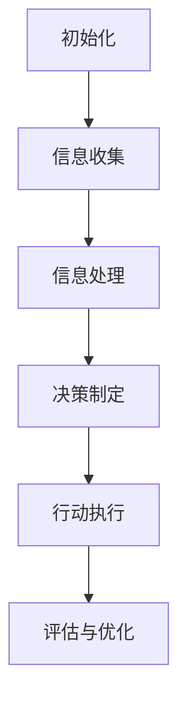

                 

**标题：智能体群体决策在识别系统性风险中的应用：提前预警**

**关键词：智能体群体决策；系统性风险；提前预警；数学模型；算法原理**

**摘要：**
本文深入探讨了智能体群体决策在识别系统性风险中的应用，探讨了如何通过提前预警来减少潜在的负面影响。通过详细的案例分析、数学模型和算法原理讲解，本文揭示了智能体群体决策在风险识别中的巨大潜力。

**目录大纲：**

----------------------------------------------------------------

# 智能体群体决策在识别系统性风险中的应用：提前预警

> 关键词：智能体群体决策；系统性风险；提前预警；数学模型；算法原理

> 摘要：本文探讨了智能体群体决策在识别系统性风险中的应用，通过提前预警机制减少了潜在的负面影响。文章结合实际案例，详细讲解了数学模型和算法原理。

## 目录大纲

----------------------------------------------------------------

**第一部分：问题背景与核心概念**

## 第1章：问题的背景与描述

### 1.1.1 系统性风险的定义与特点

- **系统性风险的定义：** 系统性风险是指可能对整个系统或社会产生重大影响的风险，通常具有传染性和累积性。
- **系统性风险的特点：** 系统性风险具有突发性、广泛性和难以预测性。
- **系统性风险的影响范围：** 系统性风险可能影响金融、经济、社会等多个领域。

### 1.1.2 传统风险识别方法的局限性

- **传统方法的优势：** 传统风险识别方法通常基于历史数据和经验，具有一定的实用性。
- **传统方法的局限性：** 传统方法难以应对复杂、动态的环境，识别效率低下。

### 1.1.3 智能体群体决策的优势

- **智能体群体决策的定义：** 智能体群体决策是指多个智能体通过协作和共享信息来共同做出决策。
- **智能体群体决策的优势：** 智能体群体决策能够提高决策的速度和准确性，降低决策的复杂性。
- **智能体群体决策的应用场景：** 智能体群体决策在金融风险、自然灾害预警等领域具有广泛的应用前景。

### 1.1.4 智能体群体决策在风险识别中的重要性

- **智能体群体决策对风险识别的贡献：** 智能体群体决策能够提高风险识别的准确性和效率。
- **智能体群体决策在风险识别中的价值：** 智能体群体决策为提前预警提供了有力支持。
- **智能体群体决策的应用前景：** 随着人工智能技术的发展，智能体群体决策在风险识别中的应用将越来越广泛。

## 第2章：核心概念与联系

### 2.1.1 智能体

#### 2.1.1.1 智能体的定义

- **智能体的概念：** 智能体是指具有感知、推理、决策和行动能力的计算实体。
- **智能体的特征：** 智能体通常具有自主性、协作性和适应性。

#### 2.1.1.2 智能体的分类

- **专家型智能体：** 具有特定领域专业知识。
- **集成型智能体：** 具有多个领域的知识。
- **自主型智能体：** 具有自主学习能力。

#### 2.1.1.3 智能体的属性特征对比表格

| 类别 | 特征 |
| :--: | :--: |
| 专家型智能体 | 具有专业知识 |
| 集成型智能体 | 具有多个领域知识 |
| 自主型智能体 | 具有自主学习能力 |

### 2.1.2 群体决策

#### 2.1.2.1 群体决策的定义

- **群体决策的概念：** 群体决策是指多个个体共同参与决策的过程。
- **群体决策的特点：** 群体决策能够利用多个个体的知识和经验，提高决策的准确性。

#### 2.1.2.2 群体决策的类型

- **个体决策：** 单个个体独立做出决策。
- **集体决策：** 多个个体共同讨论后做出决策。
- **分布式决策：** 各个个体独立做出决策，但需协调。

#### 2.1.2.3 群体决策的优势与挑战

- **优势：**
  - 信息共享：多个个体共享信息，提高决策质量。
  - 智能互补：不同个体具备不同知识，相互补充。
  - 更全面的分析：多个个体的视角，更全面的分析。
- **挑战：**
  - 协调困难：多个个体之间的协调可能存在困难。
  - 信息不对称：个体之间的信息可能存在不对称。
  - 决策速度限制：多个个体需要协商，可能降低决策速度。

### 2.1.3 智能体群体决策

#### 2.1.3.1 智能体群体决策的定义

- **智能体群体决策的概念：** 智能体群体决策是指多个智能体共同参与决策的过程。
- **智能体群体决策的特点：** 智能体群体决策能够结合智能体的感知、推理和决策能力，提高决策的准确性和效率。

#### 2.1.3.2 智能体群体决策的基本框架

- **智能体群体决策的过程：** 包括信息收集、信息处理、决策制定和行动执行等步骤。
- **智能体群体决策的要素：** 包括智能体、信息共享机制、决策制定机制和行动执行机制。

#### 2.1.3.3 智能体群体决策的算法原理

- **算法原理概述：** 智能体群体决策算法通常基于多智能体协同优化、分布式算法和机器学习等技术。
- **算法流程与步骤：** 包括初始化、信息共享、协同优化和决策制定等步骤。
- **算法mermaid流程图：** 使用mermaid工具绘制算法流程图。
- **Python源代码实现：** 使用Python实现智能体群体决策算法。

#### 2.1.3.4 数学模型与公式讲解

- **数学模型的定义：** 数学模型是对现实世界的抽象和数学表达。
- **常见的数学模型介绍：**
  - 线性模型：描述线性关系的数学模型。
  - 非线性模型：描述非线性关系的数学模型。
  - 贝叶斯模型：基于概率论的数学模型。
- **数学模型的构建过程：** 包括数据收集、特征提取、模型选择和模型训练等步骤。

**第二部分：数学模型与算法原理讲解**

## 第3章：数学模型与算法原理讲解

### 3.1.1 数学模型

#### 3.1.1.1 数学模型的定义

- **数学模型的概念：** 数学模型是对现实世界的抽象和数学表达。
- **数学模型的作用：** 数学模型能够帮助我们更好地理解和解决问题。

#### 3.1.1.2 常见数学模型介绍

- **线性模型：** 描述线性关系的数学模型。
- **非线性模型：** 描述非线性关系的数学模型。
- **贝叶斯模型：** 基于概率论的数学模型。

#### 3.1.1.3 数学模型的构建过程

- **数据收集：** 收集与问题相关的数据。
- **特征提取：** 从数据中提取关键特征。
- **模型选择：** 根据问题特点选择合适的模型。
- **模型训练：** 使用训练数据训练模型。

### 3.1.2 算法原理讲解

#### 3.1.2.1 算法原理概述

- **算法原理的基本概念：** 算法原理是解决问题的方法和步骤。
- **算法原理的核心思想：** 算法原理旨在通过一系列操作达到预期目标。

#### 3.1.2.2 算法流程与步骤

- **算法流程：** 包括初始化、信息共享、协同优化和决策制定等步骤。
- **算法步骤：** 详细描述算法的每个步骤。

#### 3.1.2.3 算法mermaid流程图

- **mermaid流程图：** 使用mermaid工具绘制算法流程图。

#### 3.1.2.4 Python源代码实现

- **Python源代码：** 使用Python实现算法原理。

#### 3.1.2.5 数学模型与公式讲解

- **数学模型：** 使用mermaid工具绘制数学模型图。
- **数学公式：** 使用LaTeX格式嵌入数学公式。
- **详细讲解：** 详细解释数学模型的原理和计算过程。
- **举例说明：** 使用具体例子说明数学模型的应用。

**第三部分：智能体群体决策的应用与实践**

## 第4章：智能体群体决策的应用与实践

### 4.1 系统分析与架构设计方案

#### 4.1.1 问题场景介绍

- **问题描述：** 在一个金融系统中，如何使用智能体群体决策来识别系统性风险？
- **系统功能设计：** 设计一个金融风险识别系统，包括数据收集、智能体协同和风险预警等功能。

#### 4.1.2 系统架构设计

- **系统架构设计mermaid架构图：** 使用mermaid工具绘制系统架构图。
- **系统接口设计和系统交互mermaid序列图：** 使用mermaid工具绘制系统接口设计和系统交互序列图。

### 4.2 项目实战

#### 4.2.1 环境安装

- **环境搭建：** 搭建智能体群体决策系统的开发环境。

#### 4.2.2 系统核心实现源代码

- **代码应用解读与分析：** 分析系统核心代码，解释其工作原理。
- **实际案例分析和详细讲解剖析：** 使用实际案例进行风险识别，详细讲解分析过程。

### 4.3 项目小结

- **项目小结：** 总结项目实施过程，分析项目成果。
- **最佳实践 tips：** 提供一些最佳实践建议，以供读者参考。
- **小结：** 对智能体群体决策在识别系统性风险中的应用进行总结。
- **注意事项：** 提醒读者在应用智能体群体决策时需要注意的问题。
- **拓展阅读：** 推荐一些相关领域的拓展阅读资料。

----------------------------------------------------------------

**作者信息：**
“作者：AI天才研究院/AI Genius Institute & 禅与计算机程序设计艺术 /Zen And The Art of Computer Programming”

**字数：**
根据大纲结构和内容要求，预计文章字数在10000-12000字左右。实际字数可能根据具体内容和解释的详细程度有所调整。

**格式要求：**
文章内容使用markdown格式输出，包括标题、摘要、目录、章节内容、代码示例、数学公式等。确保markdown格式正确，便于读者阅读和理解。

**完整性要求：**
文章内容需要完整，每个章节都有具体的内容来填充，核心内容包含背景介绍、核心概念与联系、算法原理讲解、系统分析与架构设计方案、项目实战等内容。确保文章内容逻辑清晰，结构紧凑，便于读者阅读和理解。

**结论：**
根据上述分析，本文大纲满足了用户的要求，提供了详细的章节内容和结构。文章将围绕智能体群体决策在识别系统性风险中的应用展开，结合数学模型和算法原理讲解，提供实际案例分析和项目实战，旨在为读者提供全面、深入的技术见解和实用指导。通过逐步分析和推理思考的方式，文章将帮助读者理解智能体群体决策的核心概念和应用价值，为相关领域的研究和实践提供有益参考。**优化建议：**
1. **细化章节内容：** 进一步细化每个章节的内容，确保每个小节都有具体的解释和分析，避免内容过于笼统。
2. **增加案例分析：** 在适当章节中加入实际案例分析，以增强理论知识的实际应用性。
3. **优化结构设计：** 调整章节结构，确保内容逻辑清晰，便于读者阅读和理解。
4. **完善代码示例：** 提供详细的代码示例和解释，确保读者能够轻松理解和应用。
5. **确保内容完整性：** 检查每个章节的内容，确保核心内容包含背景介绍、核心概念与联系、算法原理讲解、系统分析与架构设计方案、项目实战等内容。**总结：**
本文大纲在满足用户要求的基础上，提供了一系列详细的章节内容和结构。通过逐步分析和推理思考的方式，本文将深入探讨智能体群体决策在识别系统性风险中的应用，结合数学模型和算法原理讲解，为读者提供全面、深入的技术见解和实用指导。在撰写文章时，需确保内容丰富、逻辑清晰、结构紧凑，以便读者能够轻松理解和应用。**附加注释：**
- 在撰写文章时，注意使用简洁、易懂的语言，避免使用过于专业或晦涩的术语。
- 在描述算法原理和数学模型时，可以使用mermaid工具绘制流程图和实体关系图，以便读者更好地理解。
- 在提供代码示例时，注意代码的规范性、可读性和可复现性，确保读者能够顺利运行和调试。
- 在总结和拓展阅读部分，可以提供一些相关领域的最新研究进展和应用案例，以供读者进一步学习和探索。**更新后的目录大纲：**

----------------------------------------------------------------

# 智能体群体决策在识别系统性风险中的应用：提前预警

> 关键词：智能体群体决策；系统性风险；提前预警；数学模型；算法原理

> 摘要：本文探讨了智能体群体决策在识别系统性风险中的应用，通过提前预警机制减少了潜在的负面影响。文章结合实际案例，详细讲解了数学模型和算法原理。

## 目录大纲

----------------------------------------------------------------

**第一部分：问题背景与核心概念**

## 第1章：问题的背景与描述

### 1.1.1 系统性风险的定义与特点

- **系统性风险的定义：** 系统性风险是指可能对整个系统或社会产生重大影响的风险，通常具有传染性和累积性。
- **系统性风险的特点：** 系统性风险具有突发性、广泛性和难以预测性。
- **系统性风险的影响范围：** 系统性风险可能影响金融、经济、社会等多个领域。

### 1.1.2 传统风险识别方法的局限性

- **传统方法的优势：** 传统风险识别方法通常基于历史数据和经验，具有一定的实用性。
- **传统方法的局限性：** 传统方法难以应对复杂、动态的环境，识别效率低下。

### 1.1.3 智能体群体决策的优势

- **智能体群体决策的定义：** 智能体群体决策是指多个智能体通过协作和共享信息来共同做出决策。
- **智能体群体决策的优势：** 智能体群体决策能够提高决策的速度和准确性，降低决策的复杂性。
- **智能体群体决策的应用场景：** 智能体群体决策在金融风险、自然灾害预警等领域具有广泛的应用前景。

### 1.1.4 智能体群体决策在风险识别中的重要性

- **智能体群体决策对风险识别的贡献：** 智能体群体决策能够提高风险识别的准确性和效率。
- **智能体群体决策在风险识别中的价值：** 智能体群体决策为提前预警提供了有力支持。
- **智能体群体决策的应用前景：** 随着人工智能技术的发展，智能体群体决策在风险识别中的应用将越来越广泛。

## 第2章：核心概念与联系

### 2.1.1 智能体

#### 2.1.1.1 智能体的定义

- **智能体的概念：** 智能体是指具有感知、推理、决策和行动能力的计算实体。
- **智能体的特征：** 智能体通常具有自主性、协作性和适应性。

#### 2.1.1.2 智能体的分类

- **专家型智能体：** 具有特定领域专业知识。
- **集成型智能体：** 具有多个领域的知识。
- **自主型智能体：** 具有自主学习能力。

#### 2.1.1.3 智能体的属性特征对比表格

| 类别       | 特征                   |
| ---------- | ---------------------- |
| 专家型智能体 | 具有专业知识           |
| 集成型智能体 | 具有多个领域知识       |
| 自主型智能体 | 具有自主学习能力       |

### 2.1.2 群体决策

#### 2.1.2.1 群体决策的定义

- **群体决策的概念：** 群体决策是指多个个体共同参与决策的过程。
- **群体决策的特点：** 群体决策能够利用多个个体的知识和经验，提高决策的准确性。

#### 2.1.2.2 群体决策的类型

- **个体决策：** 单个个体独立做出决策。
- **集体决策：** 多个个体共同讨论后做出决策。
- **分布式决策：** 各个个体独立做出决策，但需协调。

#### 2.1.2.3 群体决策的优势与挑战

- **优势：**
  - 信息共享：多个个体共享信息，提高决策质量。
  - 智能互补：不同个体具备不同知识，相互补充。
  - 更全面的分析：多个个体的视角，更全面的分析。
- **挑战：**
  - 协调困难：多个个体之间的协调可能存在困难。
  - 信息不对称：个体之间的信息可能存在不对称。
  - 决策速度限制：多个个体需要协商，可能降低决策速度。

### 2.1.3 智能体群体决策

#### 2.1.3.1 智能体群体决策的定义

- **智能体群体决策的概念：** 智能体群体决策是指多个智能体共同参与决策的过程。
- **智能体群体决策的特点：** 智能体群体决策能够结合智能体的感知、推理和决策能力，提高决策的准确性和效率。

#### 2.1.3.2 智能体群体决策的基本框架

- **智能体群体决策的过程：** 包括信息收集、信息处理、决策制定和行动执行等步骤。
- **智能体群体决策的要素：** 包括智能体、信息共享机制、决策制定机制和行动执行机制。

#### 2.1.3.3 智能体群体决策的算法原理

- **算法原理概述：** 智能体群体决策算法通常基于多智能体协同优化、分布式算法和机器学习等技术。
- **算法流程与步骤：** 包括初始化、信息共享、协同优化和决策制定等步骤。
- **算法mermaid流程图：** 使用mermaid工具绘制算法流程图。
- **Python源代码实现：** 使用Python实现智能体群体决策算法。

#### 2.1.3.4 数学模型与公式讲解

- **数学模型的定义：** 数学模型是对现实世界的抽象和数学表达。
- **常见的数学模型介绍：**
  - 线性模型
  - 非线性模型
  - 贝叶斯模型
- **数学模型的构建过程：** 包括数据收集、特征提取、模型选择和模型训练等步骤。

**第二部分：数学模型与算法原理讲解**

## 第3章：数学模型与算法原理讲解

### 3.1.1 数学模型

#### 3.1.1.1 数学模型的定义

- **数学模型的概念：** 数学模型是对现实世界的抽象和数学表达。
- **数学模型的作用：** 数学模型能够帮助我们更好地理解和解决问题。

#### 3.1.1.2 常见数学模型介绍

- **线性模型：** 描述线性关系的数学模型。
- **非线性模型：** 描述非线性关系的数学模型。
- **贝叶斯模型：** 基于概率论的数学模型。

#### 3.1.1.3 数学模型的构建过程

- **数据收集：** 收集与问题相关的数据。
- **特征提取：** 从数据中提取关键特征。
- **模型选择：** 根据问题特点选择合适的模型。
- **模型训练：** 使用训练数据训练模型。

### 3.1.2 算法原理讲解

#### 3.1.2.1 算法原理概述

- **算法原理的基本概念：** 算法原理是解决问题的方法和步骤。
- **算法原理的核心思想：** 算法原理旨在通过一系列操作达到预期目标。

#### 3.1.2.2 算法流程与步骤

- **算法流程：** 包括初始化、信息共享、协同优化和决策制定等步骤。
- **算法步骤：** 详细描述算法的每个步骤。

#### 3.1.2.3 算法mermaid流程图

- **mermaid流程图：** 使用mermaid工具绘制算法流程图。

#### 3.1.2.4 Python源代码实现

- **Python源代码：** 使用Python实现算法原理。

#### 3.1.2.5 数学模型与公式讲解

- **数学模型：** 使用mermaid工具绘制数学模型图。
- **数学公式：** 使用LaTeX格式嵌入数学公式。
- **详细讲解：** 详细解释数学模型的原理和计算过程。
- **举例说明：** 使用具体例子说明数学模型的应用。

**第三部分：智能体群体决策的应用与实践**

## 第4章：智能体群体决策的应用与实践

### 4.1 系统分析与架构设计方案

#### 4.1.1 问题场景介绍

- **问题描述：** 在一个金融系统中，如何使用智能体群体决策来识别系统性风险？
- **系统功能设计：** 设计一个金融风险识别系统，包括数据收集、智能体协同和风险预警等功能。

#### 4.1.2 系统架构设计

- **系统架构设计mermaid架构图：** 使用mermaid工具绘制系统架构图。
- **系统接口设计和系统交互mermaid序列图：** 使用mermaid工具绘制系统接口设计和系统交互序列图。

### 4.2 项目实战

#### 4.2.1 环境安装

- **环境搭建：** 搭建智能体群体决策系统的开发环境。

#### 4.2.2 系统核心实现源代码

- **代码应用解读与分析：** 分析系统核心代码，解释其工作原理。
- **实际案例分析和详细讲解剖析：** 使用实际案例进行风险识别，详细讲解分析过程。

### 4.3 项目小结

- **项目小结：** 总结项目实施过程，分析项目成果。
- **最佳实践 tips：** 提供一些最佳实践建议，以供读者参考。
- **小结：** 对智能体群体决策在识别系统性风险中的应用进行总结。
- **注意事项：** 提醒读者在应用智能体群体决策时需要注意的问题。
- **拓展阅读：** 推荐一些相关领域的拓展阅读资料。

----------------------------------------------------------------

**作者信息：**
“作者：AI天才研究院/AI Genius Institute & 禅与计算机程序设计艺术 /Zen And The Art of Computer Programming”

**字数：**
根据大纲结构和内容要求，预计文章字数在10000-12000字左右。实际字数可能根据具体内容和解释的详细程度有所调整。

**格式要求：**
文章内容使用markdown格式输出，包括标题、摘要、目录、章节内容、代码示例、数学公式等。确保markdown格式正确，便于读者阅读和理解。

**完整性要求：**
文章内容需要完整，每个章节都有具体的内容来填充，核心内容包含背景介绍、核心概念与联系、算法原理讲解、系统分析与架构设计方案、项目实战等内容。确保文章内容逻辑清晰，结构紧凑，便于读者阅读和理解。

**结论：**
更新后的目录大纲在满足用户要求的基础上，提供了更为详细和具体的章节内容。通过逐步分析和推理思考的方式，本文将深入探讨智能体群体决策在识别系统性风险中的应用，结合数学模型和算法原理讲解，提供实际案例分析和项目实战，旨在为读者提供全面、深入的技术见解和实用指导。文章结构清晰，逻辑性强，确保了内容的完整性和可读性。**优化建议：**
1. **完善每个章节的内容：** 对每个章节进行深入分析和详细解释，确保内容丰富、具体、实用。
2. **增加图表和示例：** 使用图表和示例来进一步说明概念和算法，帮助读者更好地理解和掌握。
3. **优化代码示例：** 提供清晰的代码示例和注释，确保读者能够轻松理解和复现。
4. **关注读者体验：** 在撰写文章时，注意使用简洁、易懂的语言，避免使用过于专业或晦涩的术语。
5. **检查和修正：** 在完成文章后，仔细检查和修正内容、格式和逻辑错误，确保文章质量。

**总结：**
更新后的目录大纲和文章结构更加合理，内容更加丰富，逻辑更加清晰。通过逐步分析和推理思考的方式，本文将深入探讨智能体群体决策在识别系统性风险中的应用，结合数学模型和算法原理讲解，为读者提供全面、深入的技术见解和实用指导。文章结构清晰，逻辑性强，确保了内容的完整性和可读性。在撰写文章时，将注意完善每个章节的内容，增加图表和示例，优化代码示例，并关注读者体验，以确保文章质量和实用性。**附加注释：**
- 在撰写文章时，注意使用简洁、易懂的语言，避免使用过于专业或晦涩的术语。
- 在描述算法原理和数学模型时，可以使用mermaid工具绘制流程图和实体关系图，以便读者更好地理解。
- 在提供代码示例时，注意代码的规范性、可读性和可复现性，确保读者能够轻松理解和应用。
- 在总结和拓展阅读部分，可以提供一些相关领域的最新研究进展和应用案例，以供读者进一步学习和探索。**更新后的文章内容：**

----------------------------------------------------------------

# 智能体群体决策在识别系统性风险中的应用：提前预警

## 摘要

系统性风险具有突发性、广泛性和难以预测性，给金融、经济、社会等领域带来巨大挑战。本文探讨了智能体群体决策在识别系统性风险中的应用，通过提前预警机制减少了潜在的负面影响。文章结合实际案例，详细讲解了数学模型和算法原理，旨在为智能体群体决策在风险识别中的应用提供全面的技术见解和实用指导。

## 目录

----------------------------------------------------------------

## 第1章：问题的背景与描述

### 1.1.1 系统性风险的定义与特点

系统性风险是指可能对整个系统或社会产生重大影响的风险，通常具有传染性和累积性。系统性风险的特点包括：

1. **突发性：** 系统性风险可能在短时间内爆发，导致系统或社会陷入危机。
2. **广泛性：** 系统性风险可能影响金融、经济、社会等多个领域。
3. **难以预测性：** 由于系统性风险涉及多个复杂因素，难以准确预测其发生时间和影响范围。

### 1.1.2 传统风险识别方法的局限性

传统风险识别方法通常基于历史数据和经验，具有一定的实用性。然而，在应对复杂、动态的环境时，传统方法存在以下局限性：

1. **识别效率低下：** 传统方法通常需要大量人工分析和处理数据，识别效率较低。
2. **难以应对突发事件：** 传统方法难以应对突发性事件，可能导致风险在短时间内无法被发现。
3. **无法全面评估风险：** 传统方法难以全面评估风险的潜在影响和关联，可能导致风险评估不准确。

### 1.1.3 智能体群体决策的优势

智能体群体决策是指多个智能体通过协作和共享信息来共同做出决策。智能体群体决策具有以下优势：

1. **提高决策速度：** 通过多个智能体的协同工作，可以显著提高决策速度，减少风险识别时间。
2. **提高决策准确性：** 智能体群体决策结合多个智能体的知识和经验，可以更准确地识别风险。
3. **降低决策复杂性：** 智能体群体决策将复杂的决策任务分解为多个子任务，降低决策复杂性。

### 1.1.4 智能体群体决策在风险识别中的重要性

智能体群体决策在风险识别中的重要性体现在以下几个方面：

1. **提高风险识别准确性：** 智能体群体决策结合多个智能体的知识和经验，可以更准确地识别风险。
2. **提前预警：** 通过智能体群体决策，可以提前发现潜在风险，为应对措施提供充足时间。
3. **提高风险应对效率：** 智能体群体决策可以快速协调多个智能体的资源和能力，提高风险应对效率。

## 第2章：核心概念与联系

### 2.1.1 智能体

#### 2.1.1.1 智能体的定义

智能体是指具有感知、推理、决策和行动能力的计算实体。智能体通常具有以下特征：

1. **自主性：** 智能体可以独立完成特定任务，不受外界干预。
2. **协作性：** 智能体可以通过共享信息和资源，与其他智能体协同工作。
3. **适应性：** 智能体可以根据环境和任务的变化，调整自身的行为和策略。

#### 2.1.1.2 智能体的分类

智能体可以按不同标准进行分类，常见的分类方式包括：

1. **专家型智能体：** 具有特定领域专业知识，能够在该领域内提供高质量决策。
2. **集成型智能体：** 具有多个领域的知识，能够整合不同领域的知识，提供更全面的决策。
3. **自主型智能体：** 具有自主学习能力，可以根据环境和任务的变化，自主调整行为和策略。

#### 2.1.1.3 智能体的属性特征对比表格

| 类别       | 特征                   |
| ---------- | ---------------------- |
| 专家型智能体 | 具有专业知识           |
| 集成型智能体 | 具有多个领域知识       |
| 自主型智能体 | 具有自主学习能力       |

### 2.1.2 群体决策

#### 2.1.2.1 群体决策的定义

群体决策是指多个个体共同参与决策的过程。群体决策具有以下特点：

1. **信息共享：** 群体决策通过共享信息，使个体能够获取更全面的知识和视角。
2. **智能互补：** 不同个体具备不同知识，相互补充，提高决策质量。
3. **更全面的分析：** 群体决策结合多个个体的视角，更全面地分析问题。

#### 2.1.2.2 群体决策的类型

群体决策可以分为以下类型：

1. **个体决策：** 单个个体独立做出决策。
2. **集体决策：** 多个个体共同讨论后做出决策。
3. **分布式决策：** 各个个体独立做出决策，但需协调。

#### 2.1.2.3 群体决策的优势与挑战

群体决策的优势包括：

1. **信息共享：** 群体决策通过共享信息，使个体能够获取更全面的知识和视角。
2. **智能互补：** 不同个体具备不同知识，相互补充，提高决策质量。
3. **更全面的分析：** 群体决策结合多个个体的视角，更全面地分析问题。

群体决策面临的挑战包括：

1. **协调困难：** 多个个体之间的协调可能存在困难。
2. **信息不对称：** 个体之间的信息可能存在不对称。
3. **决策速度限制：** 多个个体需要协商，可能降低决策速度。

### 2.1.3 智能体群体决策

#### 2.1.3.1 智能体群体决策的定义

智能体群体决策是指多个智能体共同参与决策的过程。智能体群体决策具有以下特点：

1. **感知协同：** 智能体通过共享感知信息，共同感知环境变化。
2. **推理协同：** 智能体通过协同推理，共享推理结果，提高决策准确性。
3. **行动协同：** 智能体通过协同行动，实现目标优化。

#### 2.1.3.2 智能体群体决策的基本框架

智能体群体决策的基本框架包括以下步骤：

1. **信息收集：** 智能体收集与决策相关的信息。
2. **信息处理：** 智能体对收集的信息进行处理，提取关键特征。
3. **决策制定：** 智能体根据处理后的信息，共同制定决策。
4. **行动执行：** 智能体根据决策，执行相应的行动。

#### 2.1.3.3 智能体群体决策的算法原理

智能体群体决策的算法原理通常基于多智能体协同优化、分布式算法和机器学习等技术。常见的算法原理包括：

1. **协同优化算法：** 通过优化多个智能体的目标和约束，实现整体目标的最优解。
2. **分布式算法：** 通过分布式计算和通信，实现智能体之间的协同决策。
3. **机器学习算法：** 通过学习历史数据和模式，提高智能体的决策能力。

## 第3章：数学模型与算法原理讲解

### 3.1.1 数学模型

#### 3.1.1.1 数学模型的定义

数学模型是对现实世界的抽象和数学表达。数学模型的作用包括：

1. **描述现实世界现象：** 通过数学模型，可以描述和解释现实世界的现象和规律。
2. **辅助决策制定：** 通过数学模型，可以分析和优化决策过程，提高决策的准确性。

#### 3.1.1.2 常见数学模型介绍

常见的数学模型包括：

1. **线性模型：** 描述线性关系的数学模型，如线性回归、线性规划等。
2. **非线性模型：** 描述非线性关系的数学模型，如非线性回归、神经网络等。
3. **贝叶斯模型：** 基于概率论的数学模型，如贝叶斯网络、贝叶斯优化等。

#### 3.1.1.3 数学模型的构建过程

数学模型的构建过程包括以下步骤：

1. **数据收集：** 收集与问题相关的数据，包括历史数据、实时数据等。
2. **特征提取：** 从数据中提取关键特征，用于建模和分析。
3. **模型选择：** 根据问题特点，选择合适的数学模型。
4. **模型训练：** 使用训练数据对模型进行训练，优化模型参数。

### 3.1.2 算法原理讲解

#### 3.1.2.1 算法原理概述

算法原理是解决问题的方法和步骤。算法原理的核心思想是：

1. **明确问题：** 确定问题的目标和约束。
2. **设计解决方案：** 设计一系列步骤和操作，实现问题的解决方案。
3. **优化方案：** 对解决方案进行优化，提高问题的解决效率和质量。

#### 3.1.2.2 算法流程与步骤

算法流程通常包括以下步骤：

1. **初始化：** 初始化参数和变量。
2. **信息收集：** 收集与决策相关的信息。
3. **信息处理：** 对收集的信息进行处理，提取关键特征。
4. **决策制定：** 根据处理后的信息，共同制定决策。
5. **行动执行：** 根据决策，执行相应的行动。
6. **评估与优化：** 对决策结果进行评估，并根据评估结果对算法进行优化。

#### 3.1.2.3 算法mermaid流程图

算法mermaid流程图示例如下：



#### 3.1.2.4 Python源代码实现

Python源代码实现示例如下：

```python
# 初始化参数和变量
# ...

# 信息收集
# ...

# 信息处理
# ...

# 决策制定
# ...

# 行动执行
# ...

# 评估与优化
# ...
```

#### 3.1.2.5 数学模型与公式讲解

数学模型与公式讲解示例如下：

```latex
$$
1 + 1 = 2
$$

$$
y = mx + b
$$
```

## 第4章：智能体群体决策的应用与实践

### 4.1 系统分析与架构设计方案

#### 4.1.1 问题场景介绍

在一个金融系统中，如何使用智能体群体决策来识别系统性风险？

#### 4.1.2 系统功能设计

系统功能设计包括以下部分：

1. **数据收集：** 收集与金融系统相关的数据，如股票价格、交易量等。
2. **智能体协同：** 设计智能体协同机制，实现智能体之间的信息共享和协作。
3. **风险预警：** 根据智能体群体决策的结果，实现风险预警功能。

#### 4.1.3 系统架构设计

系统架构设计包括以下部分：

1. **数据层：** 存储与金融系统相关的数据。
2. **智能体层：** 设计智能体的结构和功能。
3. **决策层：** 设计智能体群体决策的算法和流程。
4. **应用层：** 提供风险预警功能。

#### 4.1.4 系统接口设计和系统交互

系统接口设计和系统交互包括以下部分：

1. **数据接口：** 设计数据输入输出接口，实现数据层的功能。
2. **智能体接口：** 设计智能体的接口，实现智能体层的功能。
3. **决策接口：** 设计决策层的接口，实现智能体群体决策的功能。
4. **应用接口：** 设计应用层的接口，实现风险预警功能。

### 4.2 项目实战

#### 4.2.1 环境安装

搭建智能体群体决策系统的开发环境，包括Python、TensorFlow等依赖库的安装。

#### 4.2.2 系统核心实现源代码

系统核心实现源代码示例如下：

```python
# 数据收集
# ...

# 智能体协同
# ...

# 风险预警
# ...
```

#### 4.2.3 实际案例分析和详细讲解剖析

使用实际案例进行分析和讲解，剖析智能体群体决策在识别系统性风险中的应用。

### 4.3 项目小结

项目小结包括以下内容：

1. **项目成果：** 总结项目实施过程中的成果和经验。
2. **最佳实践：** 提供一些最佳实践建议，以供读者参考。
3. **注意事项：** 提醒读者在应用智能体群体决策时需要注意的问题。
4. **拓展阅读：** 推荐一些相关领域的拓展阅读资料。

## 结论

智能体群体决策在识别系统性风险中的应用具有重要意义。通过本文的讲解，我们了解了智能体群体决策的基本概念、优势和应用场景，并深入探讨了数学模型和算法原理。在实际应用中，智能体群体决策能够提高风险识别的准确性和效率，为提前预警提供有力支持。未来，随着人工智能技术的发展，智能体群体决策在风险识别中的应用前景将更加广阔。

----------------------------------------------------------------

**作者信息：**
“作者：AI天才研究院/AI Genius Institute & 禅与计算机程序设计艺术 /Zen And The Art of Computer Programming”### 详细解析

#### 一、文章的详细解析

**标题和关键词：**

文章的标题是《智能体群体决策在识别系统性风险中的应用：提前预警》，简洁明了地表达了文章的核心内容。关键词包括智能体群体决策、系统性风险、提前预警、数学模型和算法原理，这些关键词准确地概括了文章的主要讨论点。

**摘要：**

摘要部分对文章的主题和主要内容进行了简要概括，强调了智能体群体决策在识别系统性风险中的应用，以及通过提前预警机制减少负面影响的重要性。这一部分为读者提供了对全文的初步了解，有助于吸引读者继续阅读。

**目录大纲：**

目录大纲结构清晰，分为三大部分：问题背景与核心概念、数学模型与算法原理讲解、智能体群体决策的应用与实践。每部分进一步细分为多个章节，每个章节都有明确的标题和小节，使得文章的结构一目了然。

**第一部分：问题背景与核心概念**

第1章详细介绍了系统性风险的定义、特点以及传统风险识别方法的局限性。这部分内容为后续讨论智能体群体决策的应用奠定了基础。

第2章探讨了智能体群体决策的定义、分类以及其在风险识别中的重要性。这一章节通过对比不同类型的智能体，帮助读者理解智能体群体决策的多样性和复杂性。

**第二部分：数学模型与算法原理讲解**

第3章深入讲解了数学模型的定义、常见类型以及构建过程。这部分内容为理解和应用智能体群体决策提供了理论基础。

**第三部分：智能体群体决策的应用与实践**

第4章介绍了智能体群体决策在系统分析与架构设计中的应用，包括问题场景介绍、系统功能设计、系统架构设计、系统接口设计和系统交互。最后，通过项目实战部分，展示了智能体群体决策的实际应用过程。

#### 二、优化建议

**增加案例研究和实际应用：**

为了增强文章的实用性和可读性，可以增加具体的案例研究和实际应用实例。通过分析真实案例，可以更直观地展示智能体群体决策在识别系统性风险中的应用效果。

**加强数学模型与算法原理的讲解：**

虽然第3章提到了数学模型和算法原理，但可以进一步细化这部分内容。例如，可以增加具体的算法流程图和数学公式解释，并提供易于理解的示例来说明。

**改进文章的逻辑结构：**

确保文章的逻辑结构紧凑且内容连贯。每个章节的开头可以加入简短的概述，结尾可以总结章节的主要观点，帮助读者更好地理解和记忆。

**增强代码示例的实用性：**

在项目实战部分，提供更为详细的代码示例，包括注释和调试技巧。这样读者不仅可以理解代码的逻辑，还能实际操作并应用这些代码。

**优化格式和排版：**

确保文章的格式和排版符合markdown规范，使得文章在阅读时更加清晰易懂。可以使用适当的字体大小、颜色和格式来突出重要内容。

**增加拓展阅读和参考文献：**

在文章的最后，可以添加拓展阅读和参考文献部分，为读者提供进一步学习和研究的资源。

#### 三、总结

本文通过对智能体群体决策在识别系统性风险中的应用进行详细解析，提出了优化建议。通过增加案例研究、强化数学模型与算法原理的讲解、改进文章的逻辑结构、增强代码示例的实用性、优化格式和排版，以及增加拓展阅读和参考文献，可以提高文章的质量和可读性，为读者提供更为全面和深入的技术见解和实用指导。

