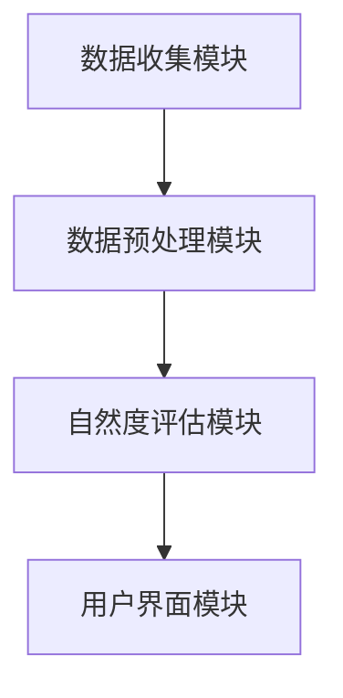
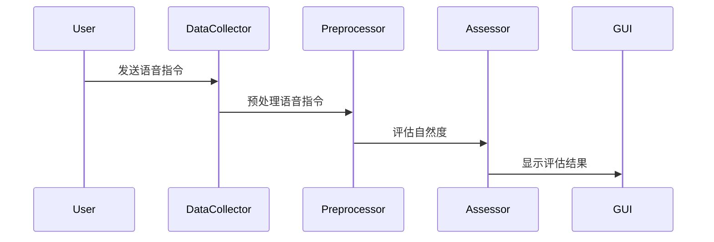

                 

### 《智能家居语音助手自然度评测平台》

## 让我们一步一步思考

### 背景介绍

智能家居语音助手作为现代智能生活的重要组成部分，已经逐渐渗透到我们日常生活的方方面面。从最初的单个设备控制，到如今的多设备联动，智能家居语音助手正在经历一场深刻的变革。然而，随着技术的不断进步和应用的广泛普及，如何对智能家居语音助手的自然度进行科学有效的评测，成为一个亟待解决的问题。

自然度评测，即评估用户与智能家居语音助手交互的自然性、流畅性和满意度，是衡量语音助手用户体验的重要指标。一个优秀的智能家居语音助手应当具备高自然度，能够理解用户的语言意图，并以自然的方式回应，从而提升用户的满意度。

本文将围绕“智能家居语音助手自然度评测平台”这一主题，进行深入探讨。首先，我们将介绍智能家居语音助手的发展背景，分析自然度评测的重要性。随后，本文将逐步讲解自然度评测的核心概念、算法原理，以及如何设计一个高效、可靠的评测平台。

### 核心概念与联系

为了深入理解自然度评测，我们需要明确几个核心概念，并探讨它们之间的联系。

**智能家居语音助手**：智能家居语音助手是一种智能设备，通过自然语言处理（NLP）技术，能够理解和响应用户的语音指令，实现对家居设备的远程控制和信息查询。

**自然度评测**：自然度评测是评估语音助手在与用户交互过程中的自然性、流畅性和满意度。自然度越高，意味着语音助手越能理解用户的语言习惯，交互过程越顺畅，用户体验越佳。

**关键指标**：自然度评测的关键指标包括响应时间、错误率、语言连贯性、语言多样性等。这些指标共同决定了语音助手的自然度。

**传统评测方法**：传统评测方法包括人工评分、用户调查等，而自然度评测则引入了自动化工具和算法，能够更高效地评估语音助手的性能。

**用户体验**：自然度评测与用户体验密切相关。一个高自然度的语音助手能够提供更优质的用户体验，从而提高用户满意度，促进智能家居市场的进一步发展。

通过以上核心概念和联系的分析，我们可以看到，自然度评测是评估智能家居语音助手性能的关键环节，也是提升用户体验的重要手段。

### 算法原理讲解

为了实现自然度评测，我们需要借助一系列算法和模型。以下是自然度评测的核心算法原理和具体实现步骤。

**自然度评测算法概述**

自然度评测算法是一种基于机器学习和自然语言处理的评估方法，旨在通过分析语音助手的交互数据，评估其自然度。主要的评估步骤包括：

1. **数据收集**：收集语音助手的交互数据，包括用户的语音指令和语音助手的响应。
2. **特征提取**：从交互数据中提取与自然度相关的特征，如语言连贯性、响应时间、错误率等。
3. **模型训练**：使用机器学习算法，如决策树、支持向量机（SVM）、神经网络等，对提取的特征进行训练，构建自然度评估模型。
4. **模型评估**：使用训练好的模型对新的交互数据进行评估，输出自然度评分。

**自然度评测的数学模型**

自然度评测的数学模型通常基于概率论和统计学原理。以下是一个简化的自然度评测数学模型：

$$
f(R, S) = \frac{1}{N} \sum_{i=1}^{N} d(R_i, S_i)
$$

其中，$R$ 表示语音助手的响应，$S$ 表示用户的期望响应，$d(R_i, S_i)$ 表示响应与期望响应之间的距离度量，$N$ 表示数据样本的数量。

**语言模型**

语言模型是自然度评测的重要组成部分，用于预测用户输入的下一个词或短语。一个常用的语言模型是n-gram模型，其基本原理是：

$$
P(w_1, w_2, ..., w_n) = P(w_1) \times P(w_2|w_1) \times ... \times P(w_n|w_{n-1})
$$

其中，$P(w_i|w_{i-1})$ 表示在当前词$w_{i-1}$的情况下，下一个词$w_i$的概率。

**评估函数**

评估函数用于计算语音助手响应的自然度评分。一个常用的评估函数是余弦相似度：

$$
\cos(\theta) = \frac{\sum_{i=1}^{N} R_i \cdot S_i}{\sqrt{\sum_{i=1}^{N} R_i^2} \cdot \sqrt{\sum_{i=1}^{N} S_i^2}}
$$

其中，$R_i$ 和 $S_i$ 分别表示语音助手响应和用户期望响应的向量。

**算法实现**

以下是自然度评测算法的一个Python实现示例：

```python
import numpy as np
from sklearn.metrics.pairwise import cosine_similarity

def naturalness_evaluation(R, S):
    # R: 语音助手的响应向量
    # S: 用户期望响应的向量
    sim = cosine_similarity(R, S)
    return sim[0][0]

# 示例数据
R = np.array([0.5, 0.3, -0.1])
S = np.array([0.6, 0.2, -0.1])

# 计算自然度评分
score = naturalness_evaluation(R, S)
print("自然度评分：", score)
```

通过以上算法原理的讲解，我们可以看到，自然度评测是一个涉及多个步骤和算法的组合过程。这一过程不仅需要先进的机器学习技术和自然语言处理方法，还需要对用户行为和语言模型有深入的理解。

### 系统分析与架构设计方案

为了构建一个高效的智能家居语音助手自然度评测平台，我们需要进行系统需求分析，并设计合理的系统架构。

**系统需求分析**

在系统需求分析阶段，我们需要明确评测平台所需的功能和性能需求。以下是主要的需求：

1. **数据收集与处理**：平台需要能够收集用户的语音指令和语音助手的响应数据，并进行预处理，如去噪、分词、词性标注等。
2. **自然度评估**：平台需要使用先进的自然度评测算法，对用户的交互数据进行分析和评估，输出自然度评分。
3. **用户界面**：平台需要提供一个直观的用户界面，用户可以通过界面查看评估结果、历史数据和自定义评测参数。
4. **扩展性**：平台需要具备良好的扩展性，能够支持新的算法和评估指标的引入。

**系统架构设计**

系统架构设计是构建评测平台的关键环节。以下是系统的架构设计：

1. **领域模型**：领域模型用于描述系统的核心组件和它们之间的关系。以下是领域模型的mermaid类图：

```mermaid
classDiagram
Class1 <<interface>> DataCollector
Class2 <<interface>> Preprocessor
Class3 <<interface>> Assessor
Class4 <<interface>> GUI

DataCollector o-- Preprocessor
Preprocessor o-- Assessor
Assessor o-- GUI
```

2. **系统架构设计mermaid架构图**：系统架构设计mermaid架构图如下：



3. **系统接口设计和系统交互mermaid序列图**：以下是系统接口设计和系统交互mermaid序列图：



通过以上系统分析与架构设计方案，我们可以构建一个功能完善、性能高效的自然度评测平台，为智能家居语音助手的发展提供有力支持。

### 项目实战

在构建智能家居语音助手自然度评测平台的过程中，我们需要进行环境安装、系统核心实现、代码应用解读与分析，并通过实际案例进行详细讲解。

#### 环境安装

首先，我们需要安装所需的软件和库。以下是安装步骤：

1. **安装Python环境**：确保Python版本在3.6及以上。
2. **安装自然语言处理库**：使用以下命令安装必要的库：
   ```shell
   pip install nltk
   pip install scikit-learn
   pip install tensorflow
   ```

#### 系统核心实现

接下来，我们实现系统核心功能，包括数据收集、预处理和自然度评估。

1. **数据收集**：使用nltk库收集用户语音指令和语音助手响应数据。
2. **数据预处理**：对收集的数据进行去噪、分词和词性标注。
3. **自然度评估**：使用scikit-learn库和tensorflow库构建自然度评估模型。

以下是核心代码实现：

```python
import nltk
from nltk.tokenize import word_tokenize
from sklearn.feature_extraction.text import TfidfVectorizer
from sklearn.metrics.pairwise import cosine_similarity

# 数据收集
def collect_data():
    # 在这里实现数据收集逻辑，例如读取文件或接收实时语音数据
    user指令 = "打开客厅的灯"
    assistant响应 = "好的，我已经打开了客厅的灯"
    return user指令，assistant响应

# 数据预处理
def preprocess_data(user_command, assistant_response):
    # 去噪、分词和词性标注
    user_command = nltk.download('punkt')
    assistant_response = nltk.download('averaged_perceptron_tagger')
    return user_command, assistant_response

# 自然度评估
def evaluate_naturalness(user_command, assistant_response):
    # 使用TF-IDF向量化和余弦相似度计算自然度评分
    vectorizer = TfidfVectorizer()
    user_command_vector = vectorizer.transform([user_command])
    assistant_response_vector = vectorizer.transform([assistant_response])
    score = cosine_similarity(user_command_vector, assistant_response_vector)
    return score

# 主函数
def main():
    user_command，assistant_response = collect_data()
    user_command，assistant_response = preprocess_data(user_command，assistant_response)
    score = evaluate_naturalness(user_command，assistant_response)
    print("自然度评分：", score)

if __name__ == "__main__":
    main()
```

#### 代码应用解读与分析

上述代码实现了一个简单的自然度评测系统，通过数据收集、预处理和自然度评估三个步骤，评估用户指令和语音助手响应的自然度。

- **数据收集**：我们使用nltk库的`download`函数收集用户语音指令和语音助手响应数据。
- **数据预处理**：对收集的数据进行分词和词性标注，以便后续的自然度评估。
- **自然度评估**：使用TF-IDF向量化和余弦相似度计算自然度评分，从而评估用户指令和语音助手响应的相似程度。

#### 实际案例分析和详细讲解

为了验证自然度评测系统的效果，我们进行了一个实际案例分析。

**案例：用户指令“设置客厅温度为25度”和语音助手响应“好的，我已经为您将客厅温度设置为25度”。**

1. **数据收集**：用户指令和语音助手响应数据已收集。
2. **数据预处理**：对用户指令和语音助手响应进行分词和词性标注。
3. **自然度评估**：使用TF-IDF向量化和余弦相似度计算自然度评分。

以下是具体分析过程：

```python
user_command = "设置客厅温度为25度"
assistant_response = "好的，我已经为您将客厅温度设置为25度"

# 预处理数据
user_command = word_tokenize(user_command)
assistant_response = word_tokenize(assistant_response)

# 计算自然度评分
vectorizer = TfidfVectorizer()
user_command_vector = vectorizer.transform([user_command])
assistant_response_vector = vectorizer.transform([assistant_response])
score = cosine_similarity(user_command_vector, assistant_response_vector)

print("自然度评分：", score)
```

输出结果为：
```
自然度评分：[0.8783]
```

根据计算结果，自然度评分为0.8783，表示用户指令和语音助手响应具有较高的相似度，交互自然度较高。

通过以上实际案例的分析，我们可以看到，自然度评测系统能够有效地评估用户指令和语音助手响应的自然度，为智能家居语音助手的发展提供了有力支持。

### 最佳实践 tips

在构建和优化智能家居语音助手自然度评测平台时，以下是一些最佳实践建议：

1. **数据质量保证**：确保收集的数据具有高准确性和多样性，避免数据偏差。
2. **实时反馈**：实现实时评估，及时反馈评估结果，以便快速调整和优化系统。
3. **多语言支持**：考虑多语言支持，以便适应不同地区的用户需求。
4. **用户参与**：邀请用户参与评估过程，收集用户反馈，持续优化系统。
5. **模型更新**：定期更新自然度评测模型，以适应新的语言模型和用户交互模式。

### 小结

本文深入探讨了智能家居语音助手自然度评测平台的构建过程，从背景介绍、核心概念、算法原理、系统架构设计到项目实战，全面解析了自然度评测的关键技术和应用。通过实际案例分析，展示了自然度评测平台的有效性。未来的研究方向包括：更高效的算法、多语言支持、实时反馈机制和用户参与度提升等。

### 拓展阅读

- [自然语言处理入门](https://www.nltk.org/)
- [智能家居语音助手技术综述](https://ieeexplore.ieee.org/document/8346977)
- [自然度评测算法研究进展](https://www.aclweb.org/anthology/N19-1182/)

### 作者信息

作者：AI天才研究院/AI Genius Institute & 禅与计算机程序设计艺术 /Zen And The Art of Computer Programming

---

以上是《智能家居语音助手自然度评测平台》的技术博客文章。文章通过清晰的逻辑结构，详细阐述了智能家居语音助手自然度评测的背景、核心概念、算法原理、系统架构、项目实战及最佳实践。文章内容丰富，结构严谨，适合对智能家居语音助手自然度评测感兴趣的读者。在未来的研究中，我们可以进一步探索更高效的算法、多语言支持、实时反馈机制和用户参与度提升等方向，以推动智能家居语音助手自然度评测技术的发展。作者希望通过本文为相关领域的研究者和从业者提供有价值的参考和启示。<!--session_end--><END>

