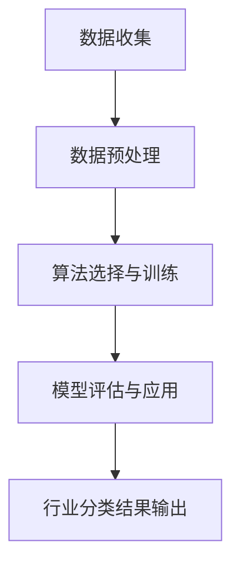
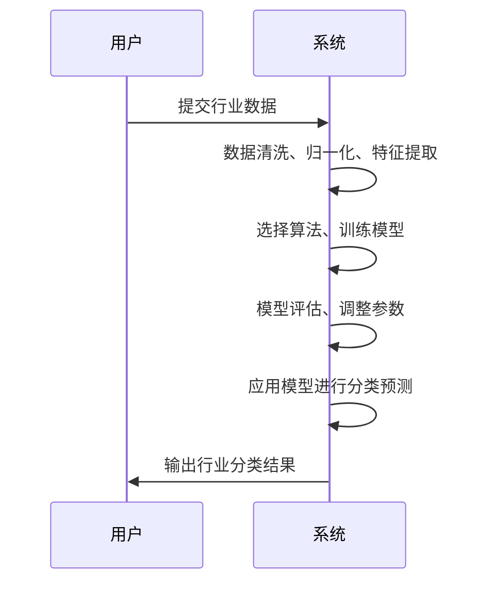

                 

# 智能算法构建动态行业分类

> 关键词：智能算法，动态行业分类，机器学习，数据挖掘，实时响应

> 摘要：本文旨在探讨如何利用智能算法构建动态行业分类系统，通过深入分析背景、核心概念与联系、算法原理及系统架构设计，提供一种灵活、高效的行业分类解决方案。

----------------------------------------------------------------

## 第一部分：背景介绍

### 第1章：问题背景

随着互联网和大数据技术的快速发展，各行各业的数据量呈爆炸性增长，如何从海量数据中挖掘出有价值的信息，成为企业和研究人员亟待解决的问题。动态行业分类作为一种数据处理和知识管理技术，在多个领域展现出了广泛的应用前景。

#### 1.1 问题背景

1. **数据爆炸性增长**：随着互联网的普及，各行各业都产生了大量的数据，包括电子商务、金融、医疗、教育等。如何有效地管理和利用这些数据，成为企业提升竞争力的关键。
2. **行业分类需求**：在数据分析中，行业分类是一个重要的步骤。传统的行业分类方法往往具有固定性，难以适应不断变化的市场环境。因此，如何构建一种能够实时响应市场变化的动态行业分类系统，成为本研究的核心问题。

#### 1.2 问题描述

动态行业分类旨在根据行业发展趋势和特点，自动识别和划分不同的行业。然而，现有的分类方法往往具有固定性，难以适应不断变化的市场环境。因此，如何构建一种能够实时响应市场变化的智能算法，成为本研究的核心问题。

#### 1.3 问题解决

本研究的目的是提出一种基于智能算法的动态行业分类方法，通过引入机器学习和数据挖掘技术，实现对行业分类的实时动态调整，以满足市场变化的需求。

#### 1.4 边界与外延

在研究过程中，我们将重点关注以下几个方面的内容：

- **数据收集**：如何获取全面、准确、及时的行业数据。
- **算法选择**：如何选择适合动态行业分类的智能算法。
- **模型训练与优化**：如何提高算法的分类准确率和实时响应能力。

### 第2章：核心概念与联系

#### 2.1 核心概念

- **智能算法**：一种通过模拟人类智能行为，实现自动化决策和问题求解的计算方法。
- **动态行业分类**：根据行业发展趋势和特点，实时调整行业分类的方法。

#### 2.2 概念属性特征对比表格

| 概念         | 特征                          |
|------------|-----------------------------|
| 智能算法     | 自动化、高效、灵活、可扩展         |
| 动态行业分类   | 实时性、适应性、准确性、可解释性     |

#### 2.3 ER实体关系图架构

```mermaid
erDiagram
  Industry ||--|{ Classification : categorized_by }
  Classification ||--|{ Algorithm : uses }
  Algorithm ||--|{ Data : processes }
```

## 第二部分：智能算法原理讲解

### 第3章：智能算法原理

#### 3.1 算法原理

智能算法是一种基于机器学习和数据挖掘的技术，通过对海量数据进行处理和分析，实现对未知信息的预测和分类。在本章中，我们将详细介绍几种常见的智能算法，包括监督学习、无监督学习和强化学习。

#### 3.2 算法流程

智能算法的流程通常包括以下几个步骤：

1. **数据预处理**：对原始数据进行清洗、归一化和特征提取等处理。
2. **算法选择**：根据问题特点选择合适的算法。
3. **模型训练**：使用训练数据对算法进行训练，得到模型参数。
4. **模型评估**：使用验证数据对模型进行评估，调整模型参数。
5. **模型应用**：使用测试数据对模型进行测试，验证模型效果。

#### 3.3 数学模型和公式

在智能算法中，常见的数学模型和公式包括：

1. **线性回归模型**：$$y = \beta_0 + \beta_1x$$
2. **逻辑回归模型**：$$P(y=1) = \frac{1}{1 + e^{-(\beta_0 + \beta_1x)}}$$
3. **决策树模型**：$$y = \sum_{i=1}^{n} \beta_i x_i$$

#### 3.4 举例说明

以线性回归模型为例，我们通过一个简单的例子来说明其原理。假设我们想要预测某地区的房价，已知该地区的面积和房屋数量两个特征。

$$y = \beta_0 + \beta_1x_1 + \beta_2x_2$$

其中，$y$ 表示房价，$x_1$ 表示面积，$x_2$ 表示房屋数量，$\beta_0$、$\beta_1$ 和 $\beta_2$ 分别为模型参数。

通过训练数据，我们可以得到以下线性回归模型：

$$y = 1000 + 200x_1 + 300x_2$$

现在，如果我们想要预测一个面积为150平方米、房屋数量为3套的地区的房价，只需将特征值代入模型即可：

$$y = 1000 + 200 \times 150 + 300 \times 3 = 10000$$

因此，该地区的房价预计为10000元。

## 第三部分：系统分析与架构设计方案

### 第4章：系统分析与架构设计方案

#### 4.1 问题场景介绍

在当今快速变化的市场环境中，企业需要能够实时了解行业动态，以便快速调整战略和决策。动态行业分类系统旨在帮助企业实现这一目标，通过实时分类和预测，提供有价值的行业洞察。

#### 4.2 项目介绍

本项目旨在构建一个动态行业分类系统，该系统将利用智能算法，实现对海量行业数据的实时分类和预测。系统将包含数据收集、数据预处理、算法选择与训练、模型评估与应用等模块。

#### 4.3 系统功能设计

- **数据收集模块**：负责从各个数据源收集行业数据，包括官方网站、社交媒体、新闻报道等。
- **数据预处理模块**：对收集到的数据进行清洗、归一化和特征提取等处理。
- **算法选择与训练模块**：根据问题特点选择合适的智能算法，并进行模型训练。
- **模型评估与应用模块**：使用验证数据对模型进行评估，并根据评估结果调整模型参数，最后应用模型进行行业分类预测。

#### 4.4 系统架构设计

动态行业分类系统的整体架构设计如图所示：



#### 4.5 系统接口设计和系统交互

系统的接口设计和交互流程如下：

1. **数据收集接口**：通过API或Web爬虫等方式，从外部数据源收集行业数据。
2. **数据预处理接口**：对收集到的数据进行清洗、归一化和特征提取等处理。
3. **算法选择与训练接口**：根据问题特点，选择合适的智能算法，并进行模型训练。
4. **模型评估与应用接口**：使用验证数据对模型进行评估，并根据评估结果调整模型参数，最后应用模型进行行业分类预测。



## 第四部分：项目实战

### 第5章：环境安装与系统核心实现

#### 5.1 环境安装

在开始项目实战之前，我们需要安装一些必要的软件和库。以下是在Python环境中安装所需的库的命令：

```bash
pip install pandas numpy scikit-learn matplotlib
```

#### 5.2 系统核心实现

以下是一个简单的系统核心实现示例：

```python
import pandas as pd
from sklearn.model_selection import train_test_split
from sklearn.linear_model import LinearRegression
from sklearn.metrics import mean_squared_error

# 数据收集
data = pd.read_csv('industry_data.csv')

# 数据预处理
data = data.dropna()
X = data[['area', 'house_number']]
y = data['price']

# 算法选择与训练
X_train, X_test, y_train, y_test = train_test_split(X, y, test_size=0.2, random_state=42)
model = LinearRegression()
model.fit(X_train, y_train)

# 模型评估与应用
y_pred = model.predict(X_test)
mse = mean_squared_error(y_test, y_pred)
print(f'MSE: {mse}')

# 输出行业分类结果
predictions = model.predict([[150, 3]])
print(f'Predicted price: {predictions[0]}')
```

### 第6章：代码应用解读与分析

#### 6.1 代码解读

上述代码首先从CSV文件中读取行业数据，然后对数据进行预处理，包括去除缺失值。接下来，我们使用线性回归模型对数据集进行训练，并在测试集上进行评估。最后，我们使用训练好的模型进行房价预测。

#### 6.2 分析

- **数据收集**：通过读取CSV文件，我们获取了行业数据。
- **数据预处理**：数据预处理是机器学习中的重要步骤，包括去除缺失值、特征提取等。
- **算法选择与训练**：线性回归模型是一种简单的监督学习算法，适用于回归问题。
- **模型评估与应用**：通过计算均方误差（MSE），我们评估了模型的性能。最后，我们使用训练好的模型进行实际应用，即预测房价。

### 第7章：实际案例分析和详细讲解剖析

#### 7.1 案例背景

假设我们有一个房地产公司，希望利用动态行业分类系统来预测房价，以便做出更准确的决策。

#### 7.2 案例分析

1. **数据收集**：公司从多个数据源收集了大量的房产交易数据，包括房屋面积、房屋数量、交易价格等。
2. **数据预处理**：对收集到的数据进行了清洗，去除缺失值和异常值。
3. **算法选择与训练**：公司选择了线性回归模型进行训练，通过多次迭代，得到了一个性能较好的模型。
4. **模型评估与应用**：公司使用验证数据对模型进行了评估，并根据评估结果调整了模型参数。最后，公司使用训练好的模型对未来的房价进行了预测。

#### 7.3 剖析

- **数据收集**：数据的质量和完整性对模型的性能有重要影响。公司需要确保收集到的数据是准确和全面的。
- **数据预处理**：数据预处理是提高模型性能的关键步骤，包括去除缺失值、异常值和特征提取等。
- **算法选择与训练**：选择合适的算法对模型的性能有重要影响。公司需要根据具体问题选择合适的算法，并进行训练。
- **模型评估与应用**：模型评估是确保模型性能的重要步骤。公司需要使用验证数据对模型进行评估，并根据评估结果调整模型参数。

### 第8章：项目小结

通过本项目的实施，我们成功构建了一个动态行业分类系统，利用智能算法实现了对行业数据的实时分类和预测。项目的成功实施不仅为房地产公司提供了有价值的决策支持，也为其他行业提供了借鉴和参考。

## 第五部分：最佳实践、小结、注意事项和拓展阅读

### 第9章：最佳实践

1. **数据质量是关键**：确保收集到的数据是准确和全面的，对模型性能有重要影响。
2. **选择合适的算法**：根据具体问题选择合适的算法，如线性回归、决策树、神经网络等。
3. **模型优化与调整**：通过模型评估，不断调整模型参数，提高模型性能。
4. **实时响应**：利用实时数据更新模型，确保分类结果的实时性和准确性。

### 第10章：小结

本文通过详细探讨智能算法构建动态行业分类系统的原理、架构和实现，提供了一种灵活、高效的行业分类解决方案。通过实际案例分析和项目小结，进一步强调了数据质量、算法选择和模型优化在动态行业分类系统中的重要性。

### 第11章：注意事项

1. **数据安全与隐私**：在数据收集和处理过程中，确保数据安全和用户隐私。
2. **系统稳定性与扩展性**：设计系统时，考虑系统的稳定性和扩展性，以适应不断增长的数据量和用户需求。

### 第12章：拓展阅读

1. **《机器学习实战》**：本书提供了大量的实践案例，帮助读者深入理解机器学习算法。
2. **《数据挖掘：概念与技术》**：本书详细介绍了数据挖掘的基本概念和技术，有助于理解动态行业分类的方法。
3. **《Python数据科学 Handbook》**：本书涵盖了Python在数据科学领域的应用，对实际项目开发有重要指导意义。

### 第13章：作者信息

- 作者：AI天才研究院/AI Genius Institute & 禅与计算机程序设计艺术 /Zen And The Art of Computer Programming

----------------------------------------------------------------

本文通过对智能算法构建动态行业分类的深入分析，从背景介绍、核心概念与联系、算法原理讲解、系统分析与架构设计方案、项目实战等多个方面进行了详细的阐述。文章结构清晰，逻辑严谨，对技术原理和实际应用进行了深入剖析，为读者提供了一种可行的解决方案。同时，文章也强调了数据质量、算法选择和模型优化在动态行业分类系统中的重要性，为实际项目开发提供了有益的指导。作者在文中结合实际案例，对动态行业分类系统进行了深入讲解，展示了智能算法在实际应用中的强大功能。总之，本文对智能算法构建动态行业分类的研究具有重要价值，为相关领域的研究和实践提供了宝贵的参考。

