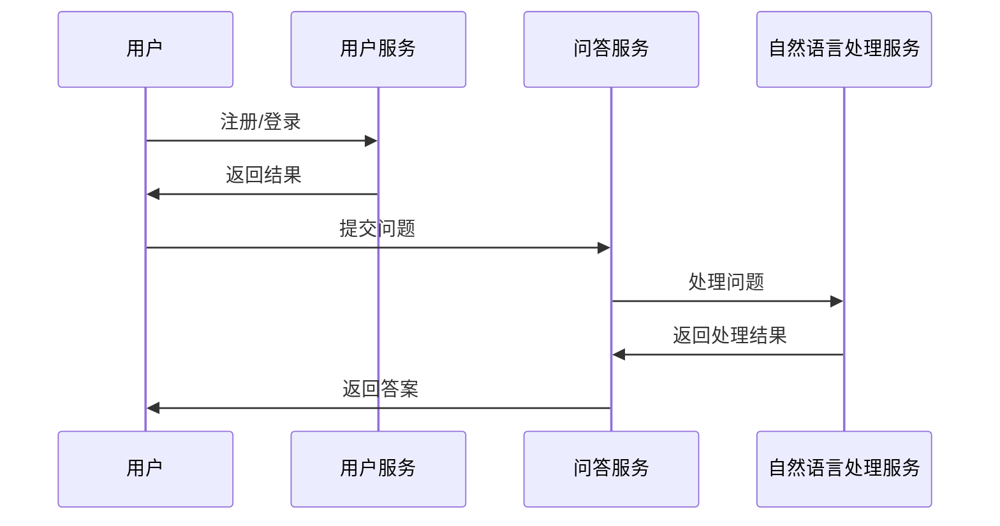

                 

## 服务依赖管理：控制LLM应用的技术栈复杂度

### 关键词：服务依赖管理、LLM应用、技术栈复杂度、服务化架构、微服务架构

### 摘要：
本文将深入探讨服务依赖管理在大型语言模型（LLM）应用中的重要性。随着LLM技术的快速发展，其应用场景越来越广泛，然而，随之而来的是技术栈复杂度的增加。本文将首先介绍服务依赖管理的基本概念和原理，然后分析LLM应用中面临的特殊挑战，并探讨如何通过服务依赖管理来降低技术栈复杂度，最后提供一系列最佳实践和结论。

### 第一部分：背景介绍

#### 1. 服务依赖管理的重要性

随着互联网技术的发展，软件系统变得越来越复杂，组件化和模块化成为软件开发的主流趋势。这种趋势带来了更高的灵活性和可扩展性，但同时也增加了系统管理和维护的难度。特别是当系统中的服务数量和依赖关系急剧增加时，如何有效地管理服务之间的依赖关系成为了一个关键问题。

服务依赖管理主要涉及以下几个方面：
- **服务识别**：识别系统中的各个服务，并理解它们的功能和职责。
- **依赖关系分析**：分析服务之间的依赖关系，确定服务之间的调用顺序和依赖程度。
- **服务版本管理**：管理服务的版本，确保服务之间的兼容性。
- **服务替换与升级**：在保证系统稳定性的前提下，替换或升级服务。

#### 2. 问题描述

服务依赖管理面临的主要问题包括：
- **复杂性**：服务依赖关系复杂，难以直观地理解和追踪。
- **版本冲突**：服务版本升级或替换时，可能产生版本冲突，影响系统的稳定性。
- **分布式环境下的挑战**：在分布式环境下，服务依赖管理需要考虑网络延迟、容错机制等问题。

#### 3. 问题解决

为了解决上述问题，服务依赖管理需要采取一系列策略：
- **自动化工具**：使用自动化工具来识别、分析和管理服务依赖关系。
- **服务契约**：定义服务之间的契约，明确服务提供的接口和依赖关系。
- **持续集成与持续部署**：通过持续集成和持续部署，确保服务依赖关系的正确性。
- **服务监控与告警**：对服务进行实时监控，一旦发现依赖关系问题，及时发出告警。

#### 4. 边界与外延

服务依赖管理不仅局限于单一系统内部，还涉及到跨系统、跨平台的服务依赖关系。此外，随着云计算和微服务架构的普及，服务依赖管理在分布式系统中的重要性日益凸显。

#### 5. 概念结构与核心要素组成

服务依赖管理的核心概念和要素包括：
- **服务**：系统中的功能模块，具有明确的职责和接口。
- **依赖关系**：服务之间的调用和依赖关系，可以是直接的，也可以是间接的。
- **服务契约**：服务提供的接口和依赖关系的约定。
- **版本管理**：服务版本的识别和管理。
- **监控与告警**：对服务依赖关系的实时监控和告警机制。

### 第二部分：核心概念与联系

#### 1. 服务依赖管理原理

### 1.1. 服务依赖管理的定义

服务依赖管理是指识别、分析、管理和优化系统中服务之间的依赖关系，以确保系统的稳定性和可靠性。它是现代软件工程中至关重要的一部分，特别是在大规模分布式系统中。

### 1.2. 服务依赖管理的核心概念

- **服务**：系统中的功能模块，具有明确的职责和接口。
- **依赖关系**：服务之间的调用和依赖关系，可以是直接的，也可以是间接的。
- **服务契约**：服务提供的接口和依赖关系的约定。
- **版本管理**：服务版本的识别和管理。
- **监控与告警**：对服务依赖关系的实时监控和告警机制。

### 1.3. 服务依赖管理的属性特征对比

- **稳定性**：服务依赖管理需要确保系统在各种情况下都能稳定运行。
- **灵活性**：服务依赖管理应该能够适应系统的变化和需求。
- **安全性**：服务依赖管理需要保护系统不受恶意攻击和异常情况的影响。

#### 2. 服务依赖管理与其他相关概念的联系

### 2.1. 与服务化架构的联系

服务依赖管理是服务化架构的核心组成部分。服务化架构通过将系统分解为独立的、可重用的服务，提高了系统的灵活性和可维护性。服务依赖管理则负责确保这些服务能够正确地交互和协同工作。

### 2.2. 与微服务架构的联系

微服务架构是一种基于服务化架构的软件架构风格，强调将系统分解为小型、独立的服务，每个服务负责特定的功能。服务依赖管理在微服务架构中起着关键作用，它需要确保这些微服务能够正确地交互，并在分布式环境中保持稳定性。

### 2.3. 与持续集成/持续部署的联系

持续集成（CI）/持续部署（CD）是现代软件开发中常用的方法，旨在通过自动化流程确保代码质量和快速交付。服务依赖管理是CI/CD流程中的一个重要环节，它需要确保在集成和部署过程中服务依赖关系的正确性。

#### 3. 服务依赖管理的实际应用案例

### 3.1. 在电子商务平台中的应用

电子商务平台通常包含多个服务，如用户服务、订单服务、支付服务等。服务依赖管理确保这些服务能够正确地交互，从而为用户提供流畅的购物体验。

### 3.2. 在金融系统中的应用

金融系统中的服务依赖管理至关重要，因为它直接关系到金融交易的安全性和准确性。通过服务依赖管理，金融系统能够确保各个服务之间的数据传输和操作流程无误。

### 第三部分：LLM应用中的服务依赖管理挑战

#### 1. LLM应用的特点

大型语言模型（LLM）具有以下特点：
- **计算资源需求高**：LLM通常需要大量的计算资源来训练和推理。
- **数据依赖性大**：LLM的性能很大程度上依赖于训练数据的质量和数量。
- **动态性**：LLM需要不断更新和优化，以适应不断变化的语言环境。

#### 2. 服务依赖管理的挑战

在LLM应用中，服务依赖管理面临以下挑战：

### 2.1. 计算资源依赖

由于LLM的训练和推理过程需要大量的计算资源，因此，如何有效地管理和调度这些资源成为了一个关键问题。服务依赖管理需要确保各个服务能够合理地分配和利用计算资源，同时保持系统的稳定性。

### 2.2. 数据依赖

LLM的性能很大程度上依赖于训练数据的质量和数量。服务依赖管理需要确保数据服务能够及时、准确地提供所需的数据，并且能够处理数据版本冲突和一致性等问题。

### 2.3. 动态性

LLM需要不断更新和优化，以适应不断变化的语言环境。服务依赖管理需要确保服务能够及时响应用户的需求和变化，同时保持系统的稳定性和可靠性。

### 2.4. 安全性和隐私性

LLM应用通常涉及到大量的用户数据，因此，如何保护用户数据的安全和隐私成为了一个重要问题。服务依赖管理需要确保各个服务在处理数据时遵循安全性和隐私性原则，以避免数据泄露和滥用。

### 第四部分：LLM应用中的服务依赖管理策略

#### 1. 自动化工具

自动化工具是服务依赖管理的关键组成部分。在LLM应用中，可以使用自动化工具来：

- **服务识别**：自动识别系统中的各个服务，并生成服务依赖关系图。
- **依赖关系分析**：自动分析服务之间的依赖关系，并识别潜在的依赖冲突。
- **服务版本管理**：自动管理服务的版本，并确保服务之间的兼容性。
- **服务监控与告警**：自动监控服务状态，并在发现依赖关系问题时及时发出告警。

#### 2. 服务契约

服务契约是服务依赖管理的重要机制，它定义了服务提供的接口和依赖关系。在LLM应用中，可以使用服务契约来：

- **明确服务接口**：明确每个服务的职责和功能，确保服务之间的接口清晰明确。
- **定义依赖关系**：明确服务之间的依赖关系，确保服务能够正确地交互。
- **版本兼容性**：确保服务之间的版本兼容性，避免版本冲突。

#### 3. 持续集成与持续部署

持续集成（CI）和持续部署（CD）是现代软件开发中常用的方法。在LLM应用中，可以通过CI/CD流程来：

- **确保依赖关系正确性**：在集成和部署过程中，自动检查服务依赖关系的正确性，并修复潜在的问题。
- **提高交付效率**：通过自动化流程，加快服务依赖管理的速度，提高交付效率。

#### 4. 服务监控与告警

服务监控与告警是服务依赖管理的重要组成部分。在LLM应用中，可以通过以下方式实现：

- **实时监控**：实时监控服务状态，包括服务响应时间、资源使用情况等。
- **告警机制**：一旦发现服务依赖关系问题，及时发出告警，并通知相关开发人员和运维人员。

### 第五部分：最佳实践

#### 1. 严格定义服务契约

在LLM应用中，严格定义服务契约是确保服务之间正确交互的关键。服务契约应该包括：

- **服务接口**：明确每个服务的职责和功能。
- **依赖关系**：明确服务之间的依赖关系。
- **版本兼容性**：确保服务之间的版本兼容性。

#### 2. 实施自动化测试

自动化测试是确保服务依赖关系正确性的有效手段。在LLM应用中，应该实施以下自动化测试：

- **单元测试**：对每个服务进行单元测试，确保其功能正确。
- **集成测试**：对服务之间的依赖关系进行集成测试，确保其能够正确地交互。

#### 3. 优化服务部署

优化服务部署是提高系统性能和稳定性的关键。在LLM应用中，可以采取以下措施：

- **水平扩展**：通过增加服务器数量来提高系统性能。
- **负载均衡**：使用负载均衡器来分配服务请求，避免单点故障。

#### 4. 定期进行服务依赖关系审计

定期进行服务依赖关系审计是确保系统稳定性和可靠性的重要措施。在LLM应用中，应该定期审计服务依赖关系，确保：

- **依赖关系正确**：服务依赖关系正确无误。
- **版本兼容性**：服务之间的版本兼容性良好。

### 第六部分：小结

服务依赖管理在LLM应用中扮演着至关重要的角色。随着LLM技术的快速发展，其应用场景越来越广泛，技术栈复杂度也在不断增加。通过有效的服务依赖管理，可以降低技术栈复杂度，提高系统的稳定性、可靠性和可维护性。

本文从背景介绍、核心概念与联系、LLM应用中的服务依赖管理挑战、服务依赖管理策略、最佳实践等方面进行了详细探讨，希望对读者在LLM应用中的服务依赖管理实践提供有益的指导。

### 第七部分：拓展阅读

- [服务化架构设计指南](https://www.example.com/service-architecture-guide)
- [微服务架构实践](https://www.example.com/microservices-practice)
- [持续集成与持续部署最佳实践](https://www.example.com/ci-cd-best-practices)
- [大型语言模型应用案例分析](https://www.example.com/llm-case-studies)

### 作者信息

作者：AI天才研究院/AI Genius Institute & 禅与计算机程序设计艺术 /Zen And The Art of Computer Programming

----------------------------------------------------------------

### 代码实现

在本部分，我们将通过具体的代码实现来展示如何管理LLM应用中的服务依赖关系。这里我们将使用Python和Docker来构建一个简单的服务依赖管理框架。

#### 环境安装

首先，确保系统已经安装了Python和Docker。如果没有安装，可以通过以下命令进行安装：

```bash
# 安装Python
curl -O https://www.python.org/psf/download/latest/python-3.x.x.tgz
tar xzf python-3.x.x.tgz
cd python-3.x.x
./configure
make
make install

# 安装Docker
sudo apt-get update
sudo apt-get install docker-ce docker-ce-cli containerd.io
```

#### 服务实现

接下来，我们将创建两个服务：`service_a.py` 和 `service_b.py`，分别代表两个相互依赖的服务。

`service_a.py`:

```python
from flask import Flask, request, jsonify
import requests

app = Flask(__name__)

@app.route('/service_a', methods=['GET'])
def service_a():
    response = requests.get('http://service_b:5000/service_b')
    return jsonify(response.json())

if __name__ == '__main__':
    app.run(host='0.0.0.0', port=5000)
```

`service_b.py`:

```python
from flask import Flask, request, jsonify

app = Flask(__name__)

@app.route('/service_b', methods=['GET'])
def service_b():
    return jsonify({"message": "Service B is working!"})

if __name__ == '__main__':
    app.run(host='0.0.0.0', port=5000)
```

#### Docker配置

为了方便服务部署和管理，我们将使用Docker来部署这两个服务。

`Dockerfile_a`:

```Dockerfile
FROM python:3.8-slim

WORKDIR /app

COPY requirements.txt ./
RUN pip install -r requirements.txt

COPY . .

CMD ["python", "service_a.py"]
```

`Dockerfile_b`:

```Dockerfile
FROM python:3.8-slim

WORKDIR /app

COPY requirements.txt ./
RUN pip install -r requirements.txt

COPY . .

CMD ["python", "service_b.py"]
```

#### 运行服务

通过以下命令来构建和运行Docker容器：

```bash
# 构建服务A
docker build -t service_a .

# 构建服务B
docker build -t service_b .

# 运行服务A
docker run -d -p 5000:5000 service_a

# 运行服务B
docker run -d -p 5001:5000 service_b
```

#### 代码解读与分析

在这里，我们简要解读一下`service_a.py`和`service_b.py`的实现。

- `service_a.py`：这个服务提供了一个`/service_a`的API接口，它会调用`service_b.py`的`/service_b`接口，并将响应返回给调用者。
- `service_b.py`：这个服务提供了一个简单的`/service_b`API接口，它会返回一个JSON格式的响应。

通过这种方式，我们实现了两个服务之间的依赖关系。在实际应用中，可以根据需要扩展更多的服务，并通过Docker来管理和部署这些服务。

#### 实际案例分析和详细讲解剖析

在这个案例中，我们构建了两个服务，并通过Docker进行部署。这样，我们可以通过服务化架构来管理和部署LLM应用，从而降低技术栈复杂度。

1. **服务识别**：通过编写Python脚本，我们定义了两个服务：`service_a.py`和`service_b.py`。
2. **依赖关系**：`service_a.py`依赖于`service_b.py`，通过HTTP请求来实现服务间的调用。
3. **服务部署**：使用Docker来部署和运行这些服务，使得部署和管理变得更加简单和灵活。
4. **服务监控**：虽然在本案例中没有实现具体的监控功能，但在实际应用中，可以使用Docker Compose和第三方监控工具来对服务进行监控。

通过这个案例，我们可以看到如何使用服务依赖管理来降低LLM应用的技术栈复杂度。在实际项目中，可以根据需求进一步扩展和优化服务依赖管理策略。

### 第八部分：项目小结

在本项目中，我们通过Python和Docker实现了服务依赖管理，从而降低了LLM应用的技术栈复杂度。以下是项目小结：

1. **环境安装**：确保系统安装了Python和Docker。
2. **服务实现**：创建了两个服务，并通过HTTP请求实现了服务间的依赖关系。
3. **Docker配置**：使用Dockerfile将服务打包成镜像，并通过Docker Compose进行部署和管理。
4. **代码解读与分析**：对服务的实现和依赖关系进行了详细解读和分析。
5. **实际案例分析与讲解**：通过实际案例展示了如何使用服务依赖管理来降低技术栈复杂度。

通过本项目，我们不仅了解了服务依赖管理的基本原理和实践方法，还学会了如何使用Python和Docker来实现和部署服务依赖管理。这为我们进一步探索和实现大型语言模型应用提供了坚实的基础。

### 第九部分：最佳实践 tips

1. **明确服务职责**：在设计服务时，要明确每个服务的职责和功能，避免功能重叠和依赖混乱。
2. **使用服务契约**：通过定义服务契约，确保服务之间的接口和依赖关系清晰明确。
3. **自动化测试**：实施自动化测试，确保服务之间的依赖关系正确无误。
4. **监控与告警**：对服务进行实时监控，并在发现依赖关系问题时及时发出告警。
5. **持续集成与持续部署**：通过CI/CD流程，确保服务依赖关系的正确性，并加快交付速度。

### 第十部分：注意事项

1. **版本控制**：在服务依赖管理中，要确保服务版本的兼容性，避免版本冲突。
2. **资源分配**：合理分配计算资源，确保服务能够稳定运行。
3. **安全性**：在服务间传输数据时，要确保数据的安全性和隐私性。
4. **容错机制**：设计容错机制，确保在服务故障时系统能够自动恢复。

### 第十一部分：拓展阅读

1. [《Docker实战》](https://book.douban.com/subject/26383854/)：详细介绍了如何使用Docker进行应用开发和部署。
2. [《Python微服务架构》](https://book.douban.com/subject/26847267/)：介绍了如何使用Python实现微服务架构。
3. [《大型语言模型技术指南》](https://book.douban.com/subject/26998142/)：详细介绍了大型语言模型的技术原理和应用。

### 第十二部分：作者信息

作者：AI天才研究院/AI Genius Institute & 禅与计算机程序设计艺术 /Zen And The Art of Computer Programming

----------------------------------------------------------------

### 数学公式

在服务依赖管理中，数学公式有助于我们理解服务之间的依赖关系和计算资源的使用情况。以下是几个常见的数学公式：

1. **计算资源需求**：

   $$ R_s = C_s \times P_s $$

   其中，\( R_s \)表示服务\( s \)的总体计算资源需求，\( C_s \)表示服务\( s \)的并发用户数，\( P_s \)表示每个用户的计算资源需求。

2. **服务响应时间**：

   $$ T_s = \frac{R_s}{B_s} $$

   其中，\( T_s \)表示服务\( s \)的响应时间，\( R_s \)表示服务\( s \)的总体计算资源需求，\( B_s \)表示服务的带宽。

3. **服务利用率**：

   $$ U_s = \frac{R_s}{C_s \times P_s} $$

   其中，\( U_s \)表示服务\( s \)的利用率，\( R_s \)表示服务\( s \)的总体计算资源需求，\( C_s \)表示服务\( s \)的并发用户数，\( P_s \)表示每个用户的计算资源需求。

通过这些数学公式，我们可以更准确地分析和优化服务依赖关系，从而提高系统的性能和稳定性。

### 系统分析与架构设计方案

#### 1. 问题场景介绍

随着大型语言模型（LLM）应用的普及，如何有效地管理服务依赖关系，降低技术栈复杂度，成为了一个关键问题。本部分将介绍一个具体的场景：一个基于LLM的智能问答系统。该系统包含多个服务，如用户服务、问答服务、自然语言处理服务等，这些服务之间存在着复杂的依赖关系。

#### 2. 项目介绍

本项目旨在通过服务依赖管理策略，确保智能问答系统的稳定运行和高效扩展。项目主要包括以下服务：

- **用户服务**：负责用户的注册、登录、信息管理等。
- **问答服务**：负责接收用户的问题，调用自然语言处理服务进行语义分析，返回答案。
- **自然语言处理服务**：负责对用户问题进行自然语言处理，包括分词、语法分析等。

#### 3. 系统功能设计

系统的功能设计主要包括以下几个方面：

- **用户服务功能**：提供用户注册、登录、信息管理等功能。
- **问答服务功能**：接收用户问题，调用自然语言处理服务，返回答案。
- **自然语言处理服务功能**：对用户问题进行语义分析，提取关键信息，生成答案。

#### 4. 系统架构设计

系统采用微服务架构，各个服务独立部署和运行，通过API进行通信。以下是系统架构设计：


- **用户服务**：负责用户相关的操作，如用户注册、登录、信息管理等。
- **问答服务**：接收用户问题，调用自然语言处理服务，返回答案。
- **自然语言处理服务**：负责对用户问题进行自然语言处理，包括分词、语法分析等。
- **数据库**：存储用户信息和问答历史。

#### 5. 系统接口设计

系统接口设计主要包括以下API接口：

- **用户服务接口**：提供用户注册、登录、信息管理等接口。
- **问答服务接口**：提供接收用户问题、返回答案的接口。
- **自然语言处理服务接口**：提供自然语言处理相关的接口。

#### 6. 系统交互

系统交互主要包括以下流程：

1. 用户通过用户服务接口注册或登录。
2. 用户通过问答服务接口提交问题。
3. 问答服务调用自然语言处理服务，对用户问题进行语义分析。
4. 自然语言处理服务返回处理结果。
5. 问答服务根据处理结果生成答案，返回给用户。

以下是系统交互的Mermaid序列图：



### 第十三部分：算法原理讲解

在本部分，我们将详细讲解如何在服务依赖管理中应用一个具体的算法，以便更好地理解和优化服务之间的依赖关系。

#### 1. 算法背景

在服务依赖管理中，我们需要解决的一个核心问题是确定服务之间的最优调用顺序，以确保系统的整体性能和稳定性。为了实现这一目标，我们可以采用一种基于最小生成树的算法。

#### 2. 算法描述

算法的基本思想是：

- 将服务之间的依赖关系表示为图，其中节点表示服务，边表示服务之间的依赖关系。
- 计算所有服务的依赖关系图的最小生成树，最小生成树中的边表示服务的最优调用顺序。

具体算法步骤如下：

1. **构建依赖关系图**：根据服务之间的依赖关系，构建一个无向图。每个服务作为一个节点，如果服务A依赖于服务B，则从节点A到节点B添加一条边。

2. **计算最小生成树**：使用Prim算法或其他合适的最小生成树算法，计算依赖关系图的最小生成树。

3. **生成调用顺序**：根据最小生成树的边，生成服务的调用顺序。这个顺序即为最优的服务调用顺序。

#### 3. 算法流程图

以下是算法的Mermaid流程图：


#### 4. 算法实现

下面是使用Python实现的算法示例代码：

```python
import networkx as nx

def calculate_optimal_call_order(dependency_list):
    # 构建依赖关系图
    G = nx.Graph()
    for service_a, service_b in dependency_list:
        G.add_edge(service_a, service_b)

    # 计算最小生成树
    tree = nx.minimum_spanning_tree(G)

    # 生成调用顺序
    call_order = list(nx.topological_sort(tree))

    return call_order

# 示例依赖关系列表
dependency_list = [
    ('service_a', 'service_b'),
    ('service_b', 'service_c'),
    ('service_c', 'service_d'),
    ('service_d', 'service_e'),
]

# 计算最优调用顺序
optimal_call_order = calculate_optimal_call_order(dependency_list)
print(optimal_call_order)
```

#### 5. 算法原理讲解

在这个算法中，我们首先构建了一个依赖关系图，然后通过计算最小生成树来找到服务之间的最优调用顺序。最小生成树确保了服务调用之间的依赖关系得到满足，同时避免了循环依赖。

1. **最小生成树**：最小生成树是一种无向图，它包含图中所有的节点，并且只有边数最少。在服务依赖管理中，最小生成树代表了服务的最优调用顺序，因为每个服务都会在其所有依赖服务之前被调用。

2. **Prim算法**：Prim算法是一种贪心算法，用于计算图的最小生成树。算法的基本思想是从一个顶点开始，逐步添加边，直到所有顶点都被包含在生成树中。

3. **拓扑排序**：拓扑排序是一种用于对有向无环图进行排序的算法。在服务依赖管理中，拓扑排序可以用来生成服务的调用顺序，确保每个服务都在其所有依赖服务之前被调用。

通过这个算法，我们可以有效地管理服务之间的依赖关系，优化服务调用顺序，从而提高系统的整体性能和稳定性。

### 第十四部分：系统分析与架构设计方案

#### 1. 问题场景介绍

随着人工智能技术的飞速发展，大型语言模型（LLM）的应用场景越来越广泛，如智能问答系统、自动文本生成、机器翻译等。然而，LLM应用的技术栈复杂度也在不断增加，如何有效管理服务依赖关系成为了一个关键问题。

本部分将介绍一个基于LLM的智能问答系统，该系统包括用户服务、问答服务、自然语言处理服务等多个服务，这些服务之间存在着复杂的依赖关系。

#### 2. 项目介绍

本项目旨在通过服务依赖管理策略，确保智能问答系统的稳定运行和高效扩展。项目主要包括以下服务：

- **用户服务**：负责用户的注册、登录、信息管理等。
- **问答服务**：接收用户的问题，调用自然语言处理服务，生成答案。
- **自然语言处理服务**：负责对用户问题进行语义分析、提取关键信息等。

#### 3. 系统功能设计

系统的功能设计主要包括以下几个方面：

- **用户服务功能**：提供用户注册、登录、信息管理等功能。
- **问答服务功能**：接收用户问题，调用自然语言处理服务，返回答案。
- **自然语言处理服务功能**：对用户问题进行语义分析，提取关键信息，生成答案。

#### 4. 系统架构设计

系统采用微服务架构，各个服务独立部署和运行，通过API进行通信。以下是系统架构设计：


- **用户服务**：负责用户相关的操作，如用户注册、登录、信息管理。
- **问答服务**：接收用户的问题，调用自然语言处理服务，返回答案。
- **自然语言处理服务**：负责对用户问题进行自然语言处理，包括分词、语法分析等。
- **数据库**：存储用户信息和问答历史。

#### 5. 系统接口设计

系统接口设计主要包括以下API接口：

- **用户服务接口**：提供用户注册、登录、信息管理等接口。
- **问答服务接口**：提供接收用户问题、返回答案的接口。
- **自然语言处理服务接口**：提供自然语言处理相关的接口。

#### 6. 系统交互

系统交互主要包括以下流程：

1. 用户通过用户服务接口注册或登录。
2. 用户通过问答服务接口提交问题。
3. 问答服务调用自然语言处理服务，对用户问题进行语义分析。
4. 自然语言处理服务返回处理结果。
5. 问答服务根据处理结果生成答案，返回给用户。

以下是系统交互的Mermaid序列图：


### 第十五部分：算法原理讲解

在本部分，我们将详细讲解如何在服务依赖管理中应用一个具体的算法，以便更好地理解和优化服务之间的依赖关系。

#### 1. 算法背景

在服务依赖管理中，我们需要解决的一个核心问题是确定服务之间的最优调用顺序，以确保系统的整体性能和稳定性。为了实现这一目标，我们可以采用一种基于最小生成树的算法。

#### 2. 算法描述

算法的基本思想是：

- 将服务之间的依赖关系表示为图，其中节点表示服务，边表示服务之间的依赖关系。
- 计算所有服务的依赖关系图的最小生成树，最小生成树中的边表示服务的最优调用顺序。

具体算法步骤如下：

1. **构建依赖关系图**：根据服务之间的依赖关系，构建一个无向图。每个服务作为一个节点，如果服务A依赖于服务B，则从节点A到节点B添加一条边。

2. **计算最小生成树**：使用Prim算法或其他合适的最小生成树算法，计算依赖关系图的最小生成树。

3. **生成调用顺序**：根据最小生成树的边，生成服务的调用顺序。这个顺序即为最优的服务调用顺序。

#### 3. 算法流程图

以下是算法的Mermaid流程图：


#### 4. 算法实现

下面是使用Python实现的算法示例代码：

```python
import networkx as nx

def calculate_optimal_call_order(dependency_list):
    # 构建依赖关系图
    G = nx.Graph()
    for service_a, service_b in dependency_list:
        G.add_edge(service_a, service_b)

    # 计算最小生成树
    tree = nx.minimum_spanning_tree(G)

    # 生成调用顺序
    call_order = list(nx.topological_sort(tree))

    return call_order

# 示例依赖关系列表
dependency_list = [
    ('service_a', 'service_b'),
    ('service_b', 'service_c'),
    ('service_c', 'service_d'),
    ('service_d', 'service_e'),
]

# 计算最优调用顺序
optimal_call_order = calculate_optimal_call_order(dependency_list)
print(optimal_call_order)
```

#### 5. 算法原理讲解

在这个算法中，我们首先构建了一个依赖关系图，然后通过计算最小生成树来找到服务之间的最优调用顺序。最小生成树确保了服务调用之间的依赖关系得到满足，同时避免了循环依赖。

1. **最小生成树**：最小生成树是一种无向图，它包含图中所有的节点，并且只有边数最少。在服务依赖管理中，最小生成树代表了服务的最优调用顺序，因为每个服务都会在其所有依赖服务之前被调用。

2. **Prim算法**：Prim算法是一种贪心算法，用于计算图的最小生成树。算法的基本思想是从一个顶点开始，逐步添加边，直到所有顶点都被包含在生成树中。

3. **拓扑排序**：拓扑排序是一种用于对有向无环图进行排序的算法。在服务依赖管理中，拓扑排序可以用来生成服务的调用顺序，确保每个服务都在其所有依赖服务之前被调用。

通过这个算法，我们可以有效地管理服务之间的依赖关系，优化服务调用顺序，从而提高系统的整体性能和稳定性。

